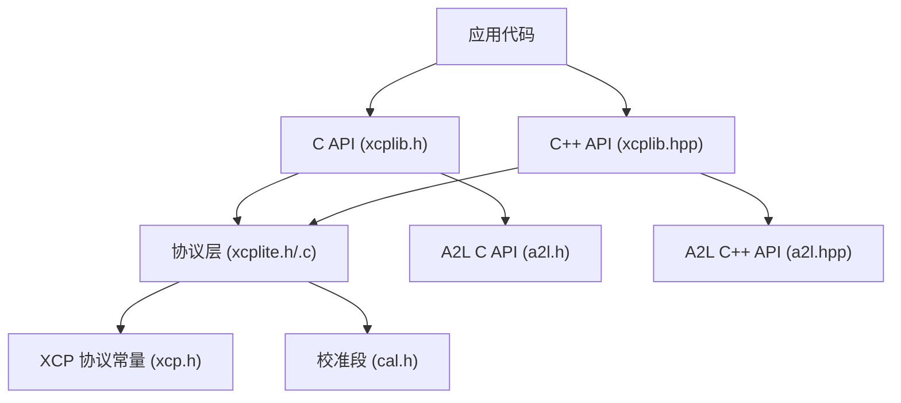
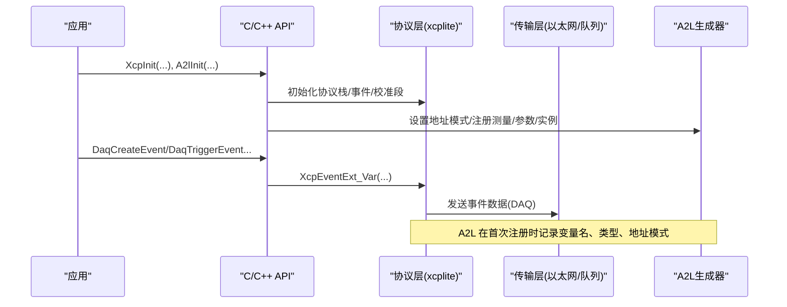
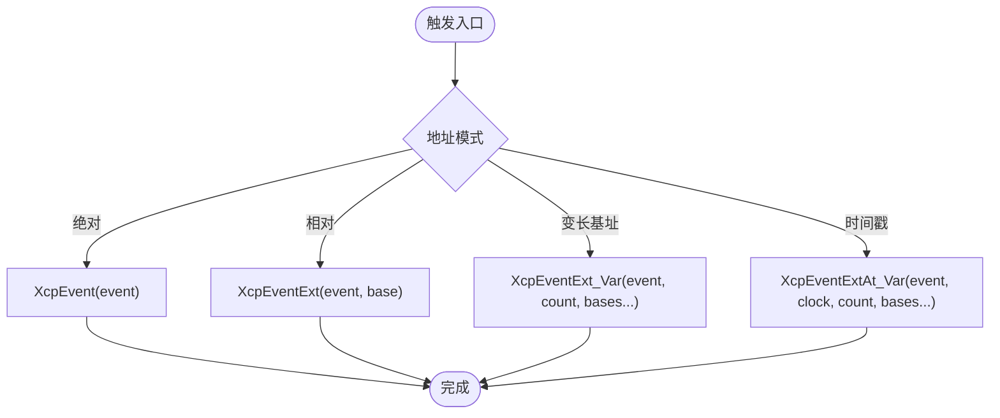
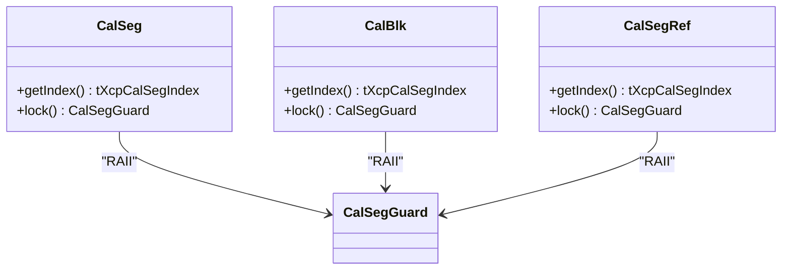
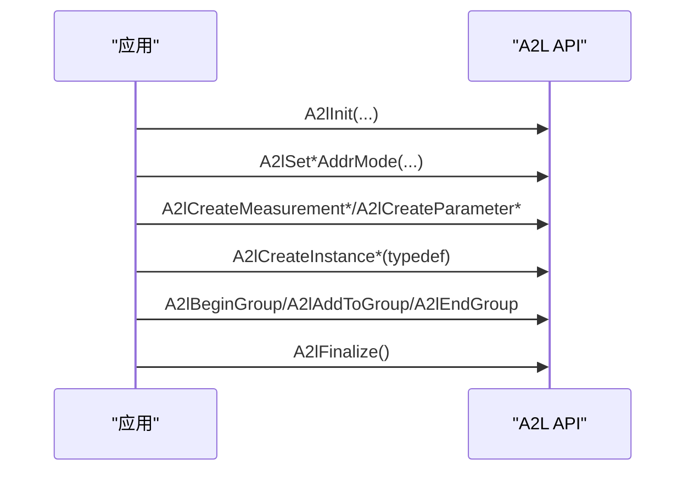
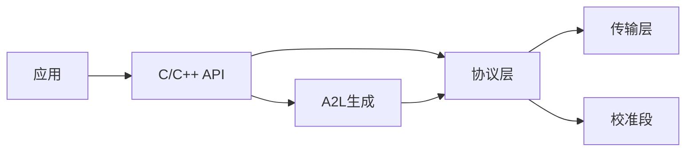

# API参考文档

<cite>
**本文引用的文件**
- [inc/xcplib.h](file://inc/xcplib.h)
- [inc/xcplib.hpp](file://inc/xcplib.hpp)
- [inc/a2l.h](file://inc/a2l.h)
- [inc/a2l.hpp](file://inc/a2l.hpp)
- [src/xcplite.h](file://src/xcplite.h)
- [src/xcplite.c](file://src/xcplite.c)
- [src/cal.h](file://src/cal.h)
- [src/xcp.h](file://src/xcp.h)
</cite>

## 目录
1. [简介](#简介)
2. [项目结构](#项目结构)
3. [核心组件](#核心组件)
4. [架构总览](#架构总览)
5. [详细组件分析](#详细组件分析)
6. [依赖关系分析](#依赖关系分析)
7. [性能考虑](#性能考虑)
8. [故障排查指南](#故障排查指南)
9. [结论](#结论)
10. [附录](#附录)

## 简介
本文件为 XCPlite 的完整 API 参考，覆盖 C 与 C++ 两套公共接口，包括：
- 初始化与生命周期管理（XCP 协议层、以太网服务器）
- 测量事件创建与触发（DAQ 事件、时间戳触发、捕获本地变量）
- 校准段管理（段/块创建、锁定访问、页切换、持久化）
- A2L 生成（类型检测、地址模式、测量/参数/实例定义、分组）
- 配置选项（编译时宏与运行时参数）
- 错误码、状态管理与异常处理机制
- 每个接口的函数签名、参数说明、返回值定义与使用示例路径

## 项目结构
XCPlite 将公共 API 暴露于 inc 目录，实现位于 src。关键头文件职责如下：
- xcplib.h / xcplib.hpp：C/C++ 主 API（事件、校准段、A2L 集成、DAQ 触发宏）
- a2l.h / a2l.hpp：A2L 生成 API（类型、地址模式、测量/参数/实例、分组、线程安全）
- xcplite.h：协议层内部接口（初始化、命令处理、DAQ 表、事件列表、回调）
- xcp.h：XCP 协议命令、返回码、事件码等常量定义
- cal.h：校准段 RCU 的内部结构与操作（段/块、页、持久化）

图表来源
- [inc/xcplib.h:31-57](file://inc/xcplib.h#L31-L57)
- [inc/xcplib.hpp:18-25](file://inc/xcplib.hpp#L18-L25)
- [src/xcplite.h:46-77](file://src/xcplite.h#L46-L77)
- [src/xcp.h:18-183](file://src/xcp.h#L18-L183)
- [src/cal.h:186-310](file://src/cal.h#L186-L310)

章节来源
- [inc/xcplib.h:31-57](file://inc/xcplib.h#L31-L57)
- [inc/xcplib.hpp:18-25](file://inc/xcplib.hpp#L18-L25)
- [src/xcplite.h:46-77](file://src/xcplite.h#L46-L77)
- [src/xcp.h:18-183](file://src/xcp.h#L18-L183)
- [src/cal.h:186-310](file://src/cal.h#L186-L310)

## 核心组件
- 初始化与服务器
  - XcpInit：初始化并激活 XCP 协议层（支持本地/共享内存/持久化模式）
  - XcpEthServerInit：初始化以太网 XCP 服务器（TCP/UDP）
  - XcpStart/XcpDeinit：启动/停止协议栈
  - 状态查询：XcpIsStarted/XcpIsConnected/XcpIsDaqRunning
- 测量事件（DAQ）
  - 动态创建：XcpCreateEvent/XcpCreateEventInstance
  - 查找与索引：XcpFindEvent/XcpGetEventIndex
  - 触发：XcpEvent/XcpEventExt/XcpEventExt_Var 及 At 系列（带时间戳）
  - 启用/禁用：XcpEventEnable
  - 便捷宏：DaqCreateEvent/DaqTriggerEvent/DaqCreateAndTriggerEvent 等
- 校准段
  - 创建：XcpCreateCalSeg（段）、XcpCreateCalBlk（块）
  - 访问：XcpLockCalSeg/XcpUnlockCalSeg（原子、无锁、线程安全）
  - 管理：XcpGetCalSegCount/XcpFindCalSeg/XcpGetCalSegName/XcpGetCalSegSize/XcpGetCalSegNumber
  - 持久化：XcpFreeze/XcpBinWrite/XcpResetAllCalSegs
- A2L 生成
  - 初始化：A2lInit（IP/端口/TCP/模式）
  - 地址模式：A2lSetAbsoluteAddrMode/A2lSetRelativeAddrMode/A2lSetStackAddrMode/A2lSetSegmentAddrMode/A2lSetAutomaticAddrMode
  - 测量/参数：A2lCreateMeasurement*/A2lCreateParameter*/A2lCreateCurve*/A2lCreateMap*
  - 实例/类型：A2lCreateInstance*/A2lTypedefBegin_/A2lTypedefEnd_
  - 分组：A2lBeginGroup/A2lAddToGroup/A2lEndGroup
  - 线程安全：A2lLock/A2lUnlock/A2lOnce/A2lThreadOnce
- C++ 封装
  - CalSeg<T>/CalBlk<T>：RAII 包装与自动锁定
  - CalSegRef<T>：非拥有型引用（链接期注册）
  - A2L 模板辅助：A2lCreateTypedef、A2L_*_COMPONENT 等

章节来源
- [src/xcplite.h:46-97](file://src/xcplite.h#L46-L97)
- [inc/xcplib.h:39-139](file://inc/xcplib.h#L39-L139)
- [inc/xcplib.h:238-483](file://inc/xcplib.h#L238-L483)
- [inc/xcplib.h:558-780](file://inc/xcplib.h#L558-L780)
- [inc/a2l.h:55-730](file://inc/a2l.h#L55-L730)
- [inc/xcplib.hpp:34-283](file://inc/xcplib.hpp#L34-L283)
- [inc/a2l.hpp:45-326](file://inc/a2l.hpp#L45-L326)

## 架构总览
XCPlite 采用“协议层 + 传输层 + 应用回调”的分层设计。应用通过 C/C++ API 创建事件与校准段，并在合适时机触发测量；A2L 生成器在运行期间收集元数据并输出 .a2l 文件供工具使用。

图表来源
- [src/xcplite.h:55-77](file://src/xcplite.h#L55-L77)
- [inc/xcplib.h:396-483](file://inc/xcplib.h#L396-L483)
- [inc/a2l.h:644-730](file://inc/a2l.h#L644-L730)

## 详细组件分析

### 初始化与生命周期
- XcpInit(name, epk, mode)
  - 参数：name（项目名），epk（软件版本标识），mode（XCP_MODE_LOCAL/SHM/DEACTIVATE/PERSISTENCE 等）
  - 返回：bool（成功/失败）
  - 行为：分配状态、加载持久化数据、准备事件/校准段列表
- XcpEthServerInit(address, port, use_tcp, measurement_queue_size)
  - 参数：绑定地址、端口、是否 TCP、测量队列大小
  - 返回：bool
- XcpStart(queue_handle, resumeMode)：启动协议栈
- XcpDeinit()：释放资源
- 状态查询：XcpIsStarted/XcpIsConnected/XcpIsDaqRunning

使用示例路径
- [examples/hello_xcp/src/main.c](file://examples/hello_xcp/src/main.c)
- [examples/c_demo/src/main.c](file://examples/c_demo/src/main.c)
- [examples/cpp_demo/src/main.cpp](file://examples/cpp_demo/src/main.cpp)

章节来源
- [src/xcplite.h:46-77](file://src/xcplite.h#L46-L77)
- [inc/xcplib.h:39-57](file://inc/xcplib.h#L39-L57)
- [src/xcplite.c:188-194](file://src/xcplite.c#L188-L194)

### 测量事件（DAQ）
- 创建
  - XcpCreateEvent(name, cycle_time_ns, priority)：创建事件（周期或随机）
  - XcpCreateEventInstance(name, cycle_time_ns, priority)：多实例事件
  - 链接期预注册：DaqCreateEvent/DaqCreateEventExt（放入 xcp_evts 段）
- 查找与索引
  - XcpFindEvent(name)：按名称查找
  - XcpGetEventIndex(event)：获取实例索引
- 触发
  - XcpEvent(event)：绝对地址基
  - XcpEventExt(event, base2)：相对地址基
  - XcpEventExt_Var(event, count, ...bases)：变长基址列表
  - At 系列：XcpEventAt/XcpEventExtAt/XcpEventExtAt_Var（带时钟）
  - 便捷宏：DaqTriggerEvent/DaqTriggerEventExt/DaqCreateAndTriggerEvent
- 启用/禁用
  - XcpEventEnable(event, enable)
  - 便捷宏：DaqEventEnable/DaqEventDisable

使用示例路径
- [examples/hello_xcp_cpp/src/main.cpp](file://examples/hello_xcp_cpp/src/main.cpp)
- [examples/multi_thread_demo/src/main.c](file://examples/multi_thread_demo/src/main.c)

图表来源
- [inc/xcplib.h:458-483](file://inc/xcplib.h#L458-L483)
- [src/xcplite.h:183-198](file://src/xcplite.h#L183-L198)

章节来源
- [inc/xcplib.h:238-483](file://inc/xcplib.h#L238-L483)
- [src/xcplite.h:205-293](file://src/xcplite.h#L205-L293)

### 校准段管理
- 创建
  - XcpCreateCalSeg(name, default_page, size)：段（含 MEMORY_SEGMENT）
  - XcpCreateCalBlk(name, default_page, size)：块（无 MEMORY_SEGMENT）
  - 链接期预注册：CalSegDecl/CalBlkDecl/CalSegCreate/CalBlkCreate
- 访问
  - XcpLockCalSeg(index)：返回活动页指针（工作页或参考页）
  - XcpUnlockCalSeg(index)：解锁
- 查询
  - XcpGetCalSegCount/XcpFindCalSeg/XcpGetCalSegName/XcpGetCalSegSize/XcpGetCalSegNumber
- 持久化与恢复
  - XcpFreeze()：写入当前工作页到持久化文件
  - XcpBinWrite(epk)：以当前工作页作为默认页创建二进制持久化文件
  - XcpResetAllCalSegs()：全部复位到默认页

C++ RAII
- xcp::CalSeg<T>：构造即创建段，lock() 返回守卫对象自动解锁
- xcp::CalBlk<T>：同上，用于块
- xcp::CalSegRef<T>：非拥有型引用（链接期注册后由 XcpInit 扫描填充索引）

使用示例路径
- [examples/struct_demo/src/main.c](file://examples/struct_demo/src/main.c)
- [examples/cpp_demo/src/lookup.cpp](file://examples/cpp_demo/src/lookup.cpp)

图表来源
- [inc/xcplib.hpp:34-283](file://inc/xcplib.hpp#L34-L283)

章节来源
- [inc/xcplib.h:61-139](file://inc/xcplib.h#L61-L139)
- [src/cal.h:186-310](file://src/cal.h#L186-L310)
- [inc/xcplib.hpp:34-283](file://inc/xcplib.hpp#L34-L283)

### A2L 生成
- 初始化
  - A2lInit(addr, port, useTCP, mode)：模式包含 WRITE_ALWAYS/WRITE_ONCE/FINALIZE_ON_CONNECT/AUTO_GROUPS/SYMBOL_PREFIX/TEMPLATE/EVENT_CONVERSION/EMBED_AML
- 地址模式
  - 绝对：A2lSetAbsoluteAddrMode_i/s
  - 相对：A2lSetRelativeAddrMode_i/s（事件+基址）
  - 栈：A2lSetStackAddrMode_i/s（帧指针）
  - 段：A2lSetSegmentAddrMode_i/s（段内偏移）
  - 自动：A2lSetAutomaticAddrMode_i/s（根据帧范围选择栈/相对）
- 测量/参数/实例
  - 测量：A2lCreateMeasurement*/A2lCreatePhysMeasurement*
  - 参数：A2lCreateParameter*/A2lCreateCurve*/A2lCreateMap*
  - 实例：A2lCreateInstance*/A2lCreateTypedef*
- 分组
  - A2lBeginGroup/A2lAddToGroup/A2lEndGroup
  - 自动分组：A2L_MODE_AUTO_GROUPS
- 线程安全
  - A2lLock/A2lUnlock
  - A2lOnce/A2lThreadOnce（C/C++ 均有封装）

使用示例路径
- [examples/fetchcontent_example/src/main.c](file://examples/fetchcontent_example/src/main.c)
- [examples/no_a2l_demo/src/main.c](file://examples/no_a2l_demo/src/main.c)

图表来源
- [inc/a2l.h:55-730](file://inc/a2l.h#L55-L730)

章节来源
- [inc/a2l.h:55-730](file://inc/a2l.h#L55-L730)
- [inc/a2l.hpp:45-326](file://inc/a2l.hpp#L45-L326)

### 错误码、状态管理与异常处理
- 返回码（XCP 协议）
  - CRC_CMD_OK/CRC_CMD_PENDING/CRC_CMD_BUSY/CRC_CMD_UNKNOWN/CRC_OUT_OF_RANGE/CRC_WRITE_PROTECTED/CRC_ACCESS_DENIED/CRC_PAGE_NOT_VALID/CRC_DAQ_CONFIG/CRC_MEMORY_OVERFLOW 等
- 事件码
  - EVC_RESUME_MODE/EVC_CLEAR_DAQ/EVC_STORE_CAL/EVC_CMD_PENDING/EVC_DAQ_OVERLOAD/EVC_SESSION_TERMINATED/EVC_TIME_SYNCH/EVC_USER 等
- 状态查询
  - XcpIsStarted/XcpIsConnected/XcpIsDaqRunning/XcpGetSessionStatus
- 异常处理建议
  - 检查 XcpIsActivated 后再进行 DAQ/校准操作
  - 对 XcpCreateEvent/CalSeg 等返回句柄进行有效性校验
  - 使用 A2lLock/A2lUnlock 保护 A2L 注册块
  - 合理设置测量队列大小以避免溢出

章节来源
- [src/xcp.h:139-183](file://src/xcp.h#L139-L183)
- [src/xcplite.h:90-97](file://src/xcplite.h#L90-L97)
- [inc/xcplib.h:396-483](file://inc/xcplib.h#L396-L483)

## 依赖关系分析
- 模块耦合
  - 应用 -> C/C++ API -> 协议层 -> 传输层
  - A2L 生成器依赖协议层提供的地址模式与事件信息
  - 校准段模块提供页切换与持久化能力
- 外部依赖
  - 平台抽象（原子、队列、共享内存）
  - 编译器特性（section 属性、inline、thread_local）

图表来源
- [src/xcplite.h:46-77](file://src/xcplite.h#L46-L77)
- [inc/xcplib.h:39-57](file://inc/xcplib.h#L39-L57)
- [inc/a2l.h:644-730](file://inc/a2l.h#L644-L730)

章节来源
- [src/xcplite.h:46-77](file://src/xcplite.h#L46-L77)
- [inc/xcplib.h:39-57](file://inc/xcplib.h#L39-L57)
- [inc/a2l.h:644-730](file://inc/a2l.h#L644-L730)

## 性能考虑
- 事件触发
  - 优先使用链接期事件 ID（避免重复查找）
  - 使用 DaqTriggerEvent_i 直接传入事件 ID
  - 避免内联导致帧指针失效（必要时使用 XCP_NOINLINE）
- 校准段访问
  - 使用 RAII 守卫减少手动锁定/解锁开销
  - 批量写操作结合原子事务（XcpCalSegBeginAtomicTransaction/End）
- A2L 生成
  - 使用 A2lOnce/A2lThreadOnce 避免重复注册
  - 合理设置 A2L_MODE（如 WRITE_ONCE）减少文件 IO
- 队列与溢出
  - 调整测量队列大小，监控溢出计数（XcpGetDaqOverflowCount）

[本节为通用指导，不直接分析具体文件]

## 故障排查指南
- 常见问题
  - 未调用 XcpInit 或 XcpIsActivated 为 false：确保先初始化再使用 API
  - 事件未找到：检查名称唯一性，或使用 XcpFindEvent 验证
  - A2L 未生成：确认 A2lInit 模式与 finalize 调用
  - 校准段访问冲突：确保 lock/unlock 成对，避免跨线程误用
- 诊断手段
  - 使用 XcpGetDaqOverflowCount 检查溢出
  - 打印日志级别（XcpSetLogLevel）
  - 检查 A2L 文件名（A2lGetFilename）与内容

章节来源
- [src/xcplite.h:90-97](file://src/xcplite.h#L90-L97)
- [inc/a2l.h:644-669](file://inc/a2l.h#L644-L669)

## 结论
XCPlite 提供了完整的 C/C++ API，覆盖 XCP 协议层的初始化、DAQ 事件、校准段管理与 A2L 生成。通过链接期预注册、RAII 封装与线程安全机制，开发者可以高效构建高性能、可维护的测量与标定系统。建议遵循最佳实践：显式初始化、合理使用地址模式、利用 RAII 与 once 模式、关注性能与错误处理。

[本节为总结，不直接分析具体文件]

## 附录
- 配置选项（编译时）
  - OPTION_DAQ_EVENT_LIST：启用动态事件列表
  - OPTION_ENABLE_A2L_GENERATOR：启用 A2L 生成
  - OPTION_SHM_MODE：启用共享内存模式
  - XCP_MAX_EVENT_COUNT/XCP_MAX_CALSEG_COUNT：限制数量
- 配置选项（运行时）
  - XcpInit mode：LOCAL/SHM/DEACTIVATE/PERSISTENCE
  - A2lInit mode：WRITE_ALWAYS/WRITE_ONCE/FINALIZE_ON_CONNECT/AUTO_GROUPS 等
  - XcpEthServerInit：address/port/use_tcp/measurement_queue_size

[本节为补充信息，不直接分析具体文件]