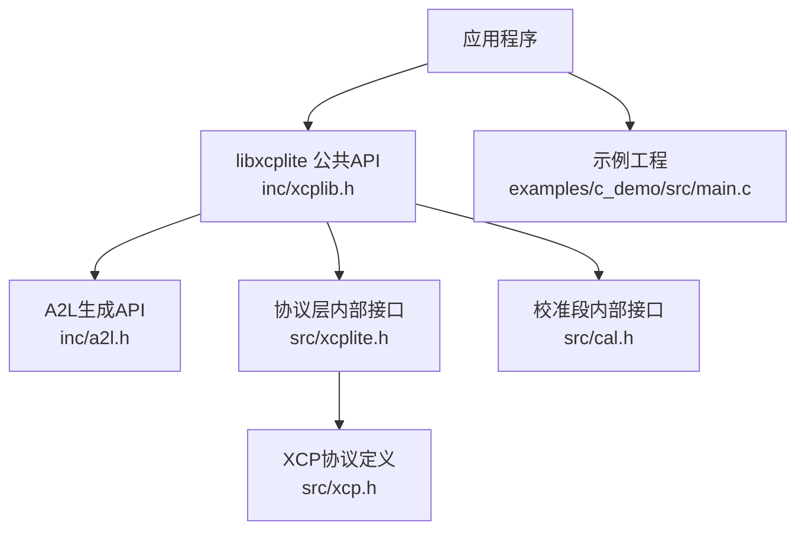
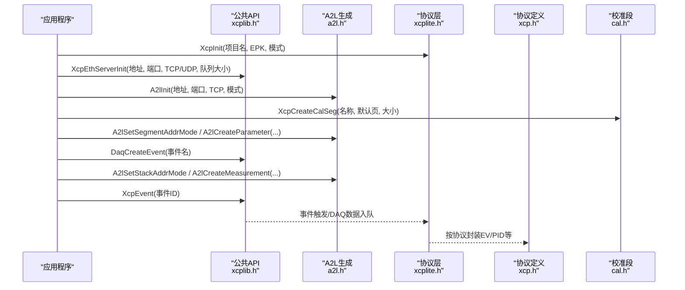
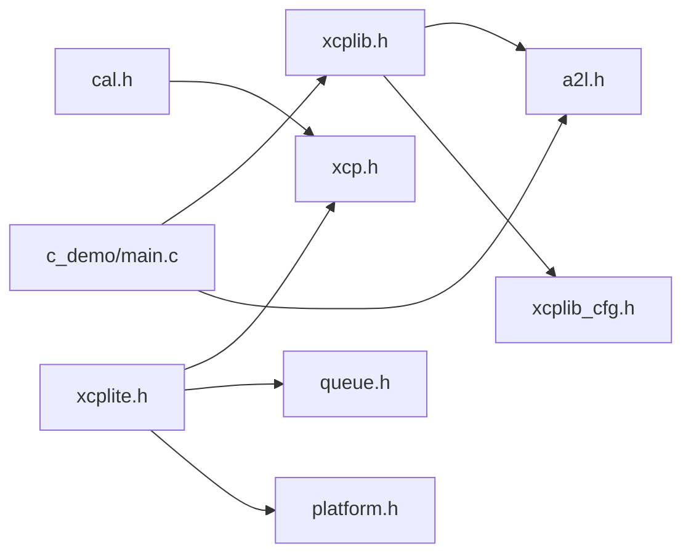

# C API参考

<cite>
**本文引用的文件**
- [xcplib.h](file://inc/xcplib.h)
- [a2l.h](file://inc/a2l.h)
- [xcplite.h](file://src/xcplite.h)
- [xcp.h](file://src/xcp.h)
- [cal.h](file://src/cal.h)
- [c_demo/main.c](file://examples/c_demo/src/main.c)
- [xcplib.md](file://docs/xcplib.md)
</cite>

## 目录
1. [简介](#简介)
2. [项目结构](#项目结构)
3. [核心组件](#核心组件)
4. [架构总览](#架构总览)
5. [详细组件分析](#详细组件分析)
6. [依赖关系分析](#依赖关系分析)
7. [性能考虑](#性能考虑)
8. [故障排查指南](#故障排查指南)
9. [结论](#结论)
10. [附录：API速查与示例路径](#附录api速查与示例路径)

## 简介
本参考文档面向使用XCPlite的C/C++开发者，系统化梳理并说明以下C语言接口：
- 服务器初始化与生命周期管理（如XcpEthServerInit、XcpEthServerShutdown、XcpIsStarted等）
- 校准段管理（创建、锁定/解锁、查询、持久化等）
- DAQ事件创建与触发（动态/静态事件、时间戳触发、变量捕获）
- A2L生成相关接口（初始化、类型/测量/参数注册、分组、最终化）

文档同时覆盖线程安全特性、内存管理要求、错误处理机制与性能注意事项，并提供实际代码示例的文件路径以便快速定位。

## 项目结构
XCPlite将公共C API暴露于inc头文件中，协议层与实现位于src目录，示例与文档在examples与docs中。关键入口包括：
- 应用侧公共API：inc/xcplib.h（服务器、校准段、DAQ事件、A2L宏）
- A2L生成API：inc/a2l.h（A2lInit/Finalize、类型检测、测量/参数注册）
- 协议层内部接口：src/xcplite.h（XcpInit、事件/DAQ表、回调）
- XCP协议定义：src/xcp.h（命令、状态码、事件码、报文格式）
- 校准段内部结构：src/cal.h（tXcpCalSegHeader、列表、页管理）

图表来源
- [xcplib.h:39-59](file://inc/xcplib.h#L39-L59)
- [a2l.h:644-669](file://inc/a2l.h#L644-L669)
- [xcplite.h:46-78](file://src/xcplite.h#L46-L78)
- [xcp.h:22-130](file://src/xcp.h#L22-L130)
- [cal.h:186-205](file://src/cal.h#L186-L205)

章节来源
- [xcplib.h:39-59](file://inc/xcplib.h#L39-L59)
- [a2l.h:644-669](file://inc/a2l.h#L644-L669)
- [xcplite.h:46-78](file://src/xcplite.h#L46-L78)
- [xcp.h:22-130](file://src/xcp.h#L22-L130)
- [cal.h:186-205](file://src/cal.h#L186-L205)

## 核心组件
- XCP以太网服务器：提供单例服务启动/停止/状态查询，支持TCP/UDP与队列大小配置。
- 校准段子系统：提供无锁、原子一致的参数访问，支持工作页/参考页切换、校验和、持久化。
- DAQ事件系统：支持链接期/运行期事件创建、时间戳触发、栈/堆/绝对地址测量与变量捕获。
- A2L生成器：运行时自动生成ASAM A2L描述文件，支持自动分组、类型推断、typedef实例、线性/枚举转换。

章节来源
- [xcplib.h:39-59](file://inc/xcplib.h#L39-L59)
- [xcplib.h:70-139](file://inc/xcplib.h#L70-L139)
- [xcplib.h:246-483](file://inc/xcplib.h#L246-L483)
- [a2l.h:58-66](file://inc/a2l.h#L58-L66)
- [a2l.h:644-669](file://inc/a2l.h#L644-L669)

## 架构总览
下图展示了从应用调用到协议层与传输层的交互流程，涵盖服务器初始化、A2L生成、校准段与DAQ事件的关键路径。

图表来源
- [xcplite.h:46-78](file://src/xcplite.h#L46-L78)
- [xcplib.h:39-59](file://inc/xcplib.h#L39-L59)
- [a2l.h:644-669](file://inc/a2l.h#L644-L669)
- [cal.h:186-205](file://src/cal.h#L186-L205)
- [xcp.h:132-183](file://src/xcp.h#L132-L183)

## 详细组件分析

### 服务器初始化与生命周期
- 函数：XcpEthServerInit(address, port, use_tcp, measurement_queue_size)
  - 作用：初始化XCP以太网服务器单例，绑定地址与端口，选择TCP/UDP，配置测量队列大小。
  - 返回值：成功返回true，失败返回false。
  - 前置条件：需先调用XcpInit完成协议层初始化。
- 函数：XcpEthServerShutdown()
  - 作用：关闭XCP以太网服务器。
- 函数：XcpEthServerStatus()
  - 作用：查询服务器是否正在运行。
- 函数：XcpIsStarted()/XcpIsConnected()/XcpIsDaqRunning()
  - 作用：查询协议层状态（已启动、已连接、DAQ运行）。

线程安全与错误处理
- 服务器初始化失败通常由端口占用或网络栈不可用导致；应在调用后检查返回值。
- 建议在XcpInit之后再启动服务器，避免未激活状态下监听。

示例路径
- [c_demo/main.c:139-156](file://examples/c_demo/src/main.c#L139-L156)

章节来源
- [xcplib.h:39-59](file://inc/xcplib.h#L39-L59)
- [xcplite.h:46-78](file://src/xcplite.h#L46-L78)
- [c_demo/main.c:139-156](file://examples/c_demo/src/main.c#L139-L156)

### 校准段管理（创建、锁定/解锁、查询、持久化）
- 创建
  - XcpCreateCalSeg(name, default_page, size)：创建带工作页/参考页的校准段，并在A2L中生成MEMORY_SEGMENT。
  - XcpCreateCalBlk(name, default_page, size)：创建仅用于读写的校准块，不在A2L中生成MEMORY_SEGMENT。
- 查询
  - XcpGetCalSegCount()：获取校准段数量。
  - XcpFindCalSeg(name)：按名称查找段索引。
  - XcpGetCalSegName(index)、XcpGetCalSegSize(index)、XcpGetCalSegNumber(index)：获取名称、大小、段号。
- 访问
  - XcpLockCalSeg(index)：返回活动页指针（工作页或参考页），在锁期间可安全读取/写入。
  - XcpUnlockCalSeg(index)：释放锁。
- 其他
  - XcpResetAllCalSegs()：将所有段复位为默认页。
  - XcpFreeze()：将当前工作页数据写入持久化文件。
  - XcpBinWrite(epk)：以当前工作页为默认页创建二进制持久化文件。

线程安全与一致性
- 锁定期间对活动页的访问是线程安全的，且与XCP客户端修改无竞争；加锁操作是无等待的，支持递归。
- 段内页切换由XCP客户端控制，库保证原子一致访问。

示例路径
- [c_demo/main.c:158-183](file://examples/c_demo/src/main.c#L158-L183)

章节来源
- [xcplib.h:70-139](file://inc/xcplib.h#L70-L139)
- [cal.h:186-205](file://src/cal.h#L186-L205)
- [c_demo/main.c:158-183](file://examples/c_demo/src/main.c#L158-L183)

### DAQ事件创建与触发
- 事件创建
  - XcpCreateEvent(name, cycle_time_ns, priority)：添加测量事件到事件列表，返回事件ID；若同名存在则复用。
  - XcpCreateEventInstance(name, cycle_time_ns, priority)：若同名存在，生成新实例索引（A2L后缀）。
  - DaqCreateEvent(event_name)/DaqCreateEventExt(event_name, cycle_us, priority)：通过宏在链接期或运行期创建事件。
  - DaqCreateAndTriggerEvent(event_name)：创建并立即触发事件。
- 事件查询
  - XcpFindEvent(name)：按名称查找事件ID。
  - XcpGetEventIndex(event_id)：获取事件实例索引（1..）。
- 事件触发
  - XcpEvent(event_id)：触发事件（绝对基址）。
  - XcpEventExt(event_id, base2)：触发事件（指定一个动态基址）。
  - XcpEventExt_Var(event_id, count, ...)：变参形式传递多个基址。
  - 时间戳版本：XcpEventAt/XcpEventExtAt/XcpEventExtAt_Var。
  - 启用/禁用：XcpEventEnable(event_id, enable)。
- 便捷宏
  - DaqTriggerEvent/DaqTriggerEventAt：基于帧指针的栈相对测量。
  - DaqTriggerEventCapture/DaqTriggerEventCaptureAt：捕获局部变量到捕获结构体进行测量。

线程安全与性能
- 事件列表访问使用互斥量保护；事件触发函数无锁、查找开销低，具体取决于传输队列配置。
- 对于高频触发，建议使用事件ID直接触发以避免名称查找。

示例路径
- [xcplib.h:246-483](file://inc/xcplib.h#L246-L483)
- [xcplite.h:179-198](file://src/xcplite.h#L179-L198)
- [c_demo/main.c:192-200](file://examples/c_demo/src/main.c#L192-L200)

章节来源
- [xcplib.h:246-483](file://inc/xcplib.h#L246-L483)
- [xcplite.h:179-198](file://src/xcplite.h#L179-L198)
- [c_demo/main.c:192-200](file://examples/c_demo/src/main.c#L192-L200)

### A2L生成相关接口
- 初始化与最终化
  - A2lInit(addr, port, useTCP, mode)：初始化A2L生成，支持多种模式（单次写入、连接时最终化、自动分组等）。
  - A2lFinalize()：最终化A2L文件，写入二进制持久化文件。
  - A2lGetFilename()：获取生成的A2L文件名。
- 类型与地址模式
  - 类型检测：A2lGetTypeId(expr)/A2lGetTypeName(type)等。
  - 地址模式：A2lSetAbsoluteAddrMode/A2lSetRelativeAddrMode/A2lSetStackAddrMode/A2lSetSegmentAddrMode/A2lSetAutomaticAddrMode。
- 测量与参数注册
  - 标量/数组/矩阵：A2lCreateMeasurement/A2lCreatePhysMeasurement/A2lCreateMeasurementArray/A2lCreateMeasurementMatrix。
  - 参数：A2lCreateParameter/A2lCreateCurve/A2lCreateMap/A2lCreateAxis。
  - typedef：A2lTypedefBegin/End与各类Component宏，A2lCreateTypedefInstance。
- 分组与转换
  - 分组：A2lBeginGroup/AddToGroup/EndGroup，以及批量创建组。
  - 转换：A2lCreateLinearConversion/A2lCreateEnumConversion。

线程安全
- A2L生成状态（分组、地址模式、typedef begin/end）非线程安全；可使用A2lOnce/A2lThreadOnce保护一次性注册逻辑。

示例路径
- [a2l.h:58-66](file://inc/a2l.h#L58-L66)
- [a2l.h:323-377](file://inc/a2l.h#L323-L377)
- [a2l.h:379-492](file://inc/a2l.h#L379-L492)
- [a2l.h:617-726](file://inc/a2l.h#L617-L726)
- [c_demo/main.c:153-183](file://examples/c_demo/src/main.c#L153-L183)

章节来源
- [a2l.h:58-66](file://inc/a2l.h#L58-L66)
- [a2l.h:323-377](file://inc/a2l.h#L323-L377)
- [a2l.h:379-492](file://inc/a2l.h#L379-L492)
- [a2l.h:617-726](file://inc/a2l.h#L617-L726)
- [c_demo/main.c:153-183](file://examples/c_demo/src/main.c#L153-L183)

## 依赖关系分析
- xcplib.h依赖a2l.h（A2L宏与类型）、平台配置（xcplib_cfg.h）。
- xcplite.h依赖xcp.h（协议命令/状态）、queue.h（队列）、platform.h（原子/互斥）。
- cal.h依赖xcp.h与平台抽象，提供校准段数据结构与列表管理。
- 示例工程演示了从XcpInit到A2lInit、创建校准段与事件的完整流程。

图表来源
- [xcplib.h:1-35](file://inc/xcplib.h#L1-L35)
- [xcplite.h:17-32](file://src/xcplite.h#L17-L32)
- [cal.h:16-26](file://src/cal.h#L16-L26)
- [c_demo/main.c:10-12](file://examples/c_demo/src/main.c#L10-L12)

章节来源
- [xcplib.h:1-35](file://inc/xcplib.h#L1-L35)
- [xcplite.h:17-32](file://src/xcplite.h#L17-L32)
- [cal.h:16-26](file://src/cal.h#L16-L26)
- [c_demo/main.c:10-12](file://examples/c_demo/src/main.c#L10-L12)

## 性能考虑
- 事件触发：优先使用事件ID直接触发（XcpEventExt_i/DaqTriggerEvent_i），避免名称查找开销。
- 队列大小：合理设置measurement_queue_size，避免DAQ溢出；可通过XcpGetDaqOverflowCount监控。
- 校准段访问：使用XcpLockCalSeg获得一致视图，减少并发冲突；批量更新后可调用XcpCalSegPublishAll延迟发布。
- A2L生成：启用A2L_MODE_AUTO_GROUPS简化分组；生产环境建议固定日志级别以减少开销。

[本节为通用指导，不直接分析具体文件]

## 故障排查指南
- 服务器无法启动：检查XcpInit是否已调用、端口是否被占用、网络栈是否正常；查看XcpEthServerInit返回值。
- 事件未生效：确认事件已创建（XcpFindEvent不为XCP_UNDEFINED_EVENT_ID），并正确设置地址模式（栈/相对/绝对）。
- 校准段访问异常：确保使用XcpLockCalSeg获取活动页指针，并在完成后调用XcpUnlockCalSeg；检查段大小与默认页对齐。
- A2L未生成：检查A2lInit模式（WRITE_ONCE/FINALIZE_ON_CONNECT），确认A2lFinalize已被调用或在连接时自动最终化。

章节来源
- [xcplib.h:39-59](file://inc/xcplib.h#L39-L59)
- [xcplib.h:246-483](file://inc/xcplib.h#L246-L483)
- [a2l.h:644-669](file://inc/a2l.h#L644-L669)
- [xcplite.h:46-78](file://src/xcplite.h#L46-L78)

## 结论
XCPlite提供了完整的C API以构建高性能的XCP服务器，涵盖服务器生命周期、校准段管理、DAQ事件系统与A2L生成。通过无锁校准段、时间戳事件与灵活的A2L注册，开发者可在资源受限环境中实现可靠的数据采集与标定能力。遵循本文档的最佳实践，可有效提升稳定性与性能。

[本节为总结，不直接分析具体文件]

## 附录：API速查与示例路径
- 服务器初始化
  - XcpEthServerInit、XcpEthServerShutdown、XcpEthServerStatus、XcpIsStarted、XcpIsConnected、XcpIsDaqRunning
  - 示例：[c_demo/main.c:139-156](file://examples/c_demo/src/main.c#L139-L156)
- 校准段管理
  - XcpCreateCalSeg、XcpCreateCalBlk、XcpGetCalSegCount、XcpFindCalSeg、XcpGetCalSegName、XcpGetCalSegSize、XcpGetCalSegNumber、XcpLockCalSeg、XcpUnlockCalSeg、XcpResetAllCalSegs、XcpFreeze、XcpBinWrite
  - 示例：[c_demo/main.c:158-183](file://examples/c_demo/src/main.c#L158-L183)
- DAQ事件
  - XcpCreateEvent、XcpCreateEventInstance、XcpFindEvent、XcpGetEventIndex、XcpEvent、XcpEventExt、XcpEventExt_Var、XcpEventAt、XcpEventExtAt、XcpEventExtAt_Var、XcpEventEnable
  - 宏：DaqCreateEvent、DaqCreateEventExt、DaqTriggerEvent、DaqTriggerEventCapture、DaqCreateAndTriggerEvent
  - 示例：[c_demo/main.c:192-200](file://examples/c_demo/src/main.c#L192-L200)
- A2L生成
  - A2lInit、A2lFinalize、A2lGetFilename、A2lSet*AddrMode、A2lCreate*、A2lTypedef*、A2lCreateLinearConversion、A2lCreateEnumConversion
  - 示例：[c_demo/main.c:153-183](file://examples/c_demo/src/main.c#L153-L183)

章节来源
- [xcplib.h:39-59](file://inc/xcplib.h#L39-L59)
- [xcplib.h:70-139](file://inc/xcplib.h#L70-L139)
- [xcplib.h:246-483](file://inc/xcplib.h#L246-L483)
- [a2l.h:644-669](file://inc/a2l.h#L644-L669)
- [c_demo/main.c:139-200](file://examples/c_demo/src/main.c#L139-L200)