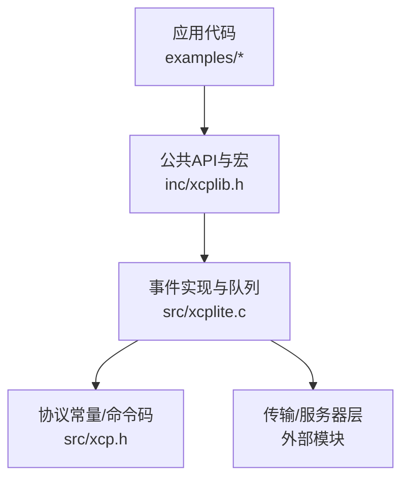
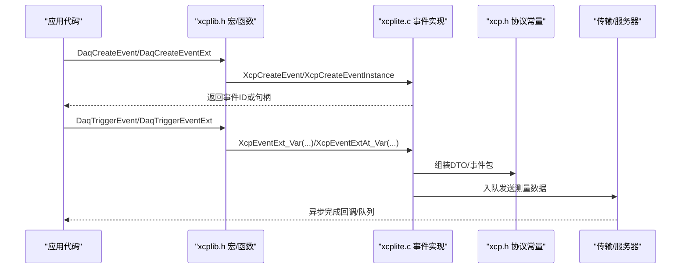
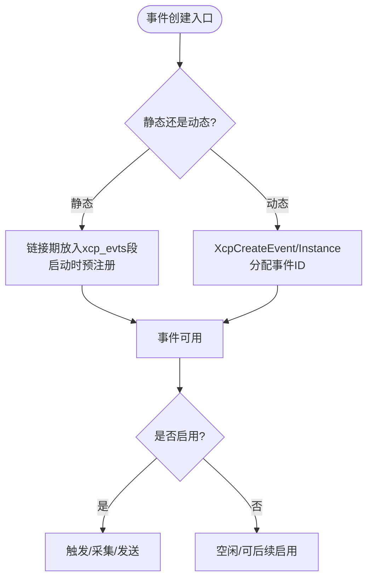
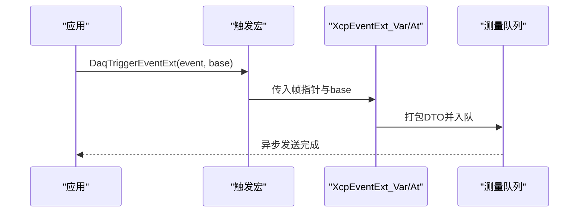
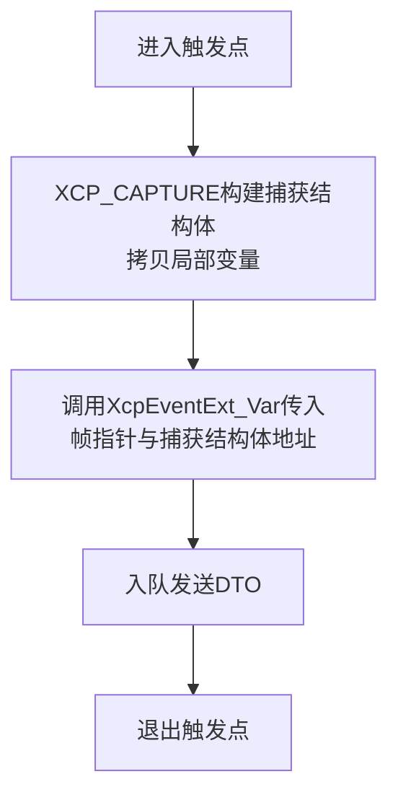
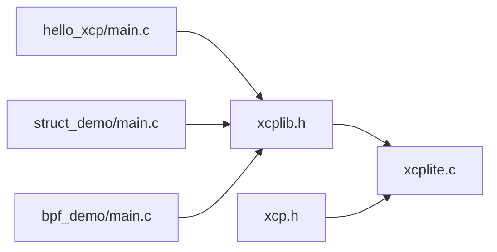

# DAQ事件管理API

<cite>
**本文引用的文件**
- [inc/xcplib.h](file://inc/xcplib.h)
- [src/xcp.h](file://src/xcp.h)
- [src/xcplite.c](file://src/xcplite.c)
- [examples/hello_xcp/src/main.c](file://examples/hello_xcp/src/main.c)
- [examples/struct_demo/src/main.c](file://examples/struct_demo/src/main.c)
- [examples/bpf_demo/src/main.c](file://examples/bpf_demo/src/main.c)
</cite>

## 目录
1. [简介](#简介)
2. [项目结构](#项目结构)
3. [核心组件](#核心组件)
4. [架构总览](#架构总览)
5. [详细组件分析](#详细组件分析)
6. [依赖关系分析](#依赖关系分析)
7. [性能考虑](#性能考虑)
8. [故障排查指南](#故障排查指南)
9. [结论](#结论)
10. [附录：示例与最佳实践](#附录示例与最佳实践)

## 简介
本文件面向使用XCPlite/libxcplite的开发者，系统化说明DAQ事件管理API，包括事件创建、触发与管理接口，覆盖XcpCreateEvent、DaqCreateEvent、DaqTriggerEvent等核心函数与宏；阐述事件生命周期、优先级设置、周期性触发机制；提供静态事件、动态事件与实例化事件的创建示例；并解释事件捕获功能与局部变量捕获机制。文档同时给出调用时序图、流程图与类图，帮助读者快速理解并正确集成。

## 项目结构
- 公共API与宏定义位于 inc/xcplib.h，涵盖事件描述符、事件创建与触发宏、本地变量捕获、AAS/AASD/AASR等地址模式支持。
- 协议层常量与DAQ相关命令码位于 src/xcp.h，用于上层工具链与协议交互。
- 事件列表管理与触发实现位于 src/xcplite.c，包含事件查找、创建、索引、触发、使能/禁用等逻辑。
- 示例代码展示了不同场景下的事件创建与触发用法，如 hello_xcp、struct_demo、bpf_demo。

**图表来源**
- [inc/xcplib.h:238-780](file://inc/xcplib.h#L238-L780)
- [src/xcplite.c:885-953](file://src/xcplite.c#L885-L953)
- [src/xcp.h:70-130](file://src/xcp.h#L70-L130)

**章节来源**
- [inc/xcplib.h:238-780](file://inc/xcplib.h#L238-L780)
- [src/xcp.h:70-130](file://src/xcp.h#L70-L130)

## 核心组件
- 事件描述符与注册
  - tXcpEventDescriptor：包含事件名、期望周期（微秒或纳秒）、优先级。
  - 通过链接器段 xcp_evts 进行静态预注册，或在运行时动态创建。
- 事件创建API
  - XcpCreateEvent(name, cycle_time_ns, priority)：动态创建事件，返回事件ID。
  - XcpCreateEventInstance(name, cycle_time_ns, priority)：同名多实例，生成递增实例后缀。
  - DaqCreateEvent(event_name) / DaqCreateEventExt(event_name, cycle_us, prio)：宏式静态/带周期优先级的创建。
  - DaqCreateEvent_s(event_name)：线程内一次性创建（线程局部存储）。
- 事件触发API
  - XcpEvent(event_id)、XcpEventAt(event_id, clock)：基础触发。
  - XcpEventExt(event_id, base)、XcpEventExtAt(event_id, base, clock)：扩展基址（绝对/相对/栈帧）。
  - XcpEventExt_Var(...) / XcpEventExtAt_Var(...)：变参形式，支持多个基址。
  - DaqTriggerEvent(event_name)、DaqTriggerEventAt(event_name, clock)：按名称触发。
  - DaqTriggerEvent_i(event_id)、DaqTriggerEventAt_i(event_id, clock)：按ID触发（无查找开销）。
  - DaqTriggerEventExt(_s/_i)(...)：支持绝对+栈+相对组合地址模式。
  - DaqCreateAndTriggerEvent(...)：创建并立即触发。
- 事件捕获与局部变量捕获
  - XCP_CAPTURE(event_name, ...)：将局部变量拷贝到捕获结构体，避免寄存器变量不可测问题。
  - DaqTriggerEventCapture(event_name, ...) / DaqTriggerEventCaptureAt(event_name, clock, ...)：触发并捕获。
  - DaqCreateAndTriggerEventCapture(event_name, ...)：创建、触发并捕获。
- 事件使能/禁用
  - DaqEventEnable(name)、DaqEventDisable(name)：按名称启用/禁用事件。
  - XcpEventEnable(event_id, enable)：按ID控制。
- 事件查询与索引
  - XcpFindEvent(name)：按名称查找事件ID。
  - XcpGetEventIndex(event_id)：获取事件实例索引（从1开始）。

**章节来源**
- [inc/xcplib.h:238-780](file://inc/xcplib.h#L238-L780)
- [src/xcplite.c:885-953](file://src/xcplite.c#L885-L953)
- [src/xcplite.c:1775-1907](file://src/xcplite.c#L1775-L1907)

## 架构总览
下图展示从应用侧调用到事件触发与数据上报的整体流程，包括事件创建、查找、触发、以及捕获结构的传递。

**图表来源**
- [inc/xcplib.h:408-757](file://inc/xcplib.h#L408-L757)
- [src/xcplite.c:1775-1907](file://src/xcplite.c#L1775-L1907)
- [src/xcp.h:70-130](file://src/xcp.h#L70-L130)

## 详细组件分析

### 事件创建与生命周期
- 静态事件（编译期/链接期）
  - 使用 DaqCreateEvent 或 DaqCreateEventExt 在 xcp_evts 段放置描述符，启动时由初始化扫描预注册，获得固定事件ID。
  - 优点：零查找开销、稳定ID、适合高频路径。
- 动态事件（运行期）
  - 使用 XcpCreateEvent/XcpCreateEventInstance 动态创建，支持命名与实例化。
  - 线程安全：内部使用互斥保护事件列表访问，原子计数保证可见性。
- 生命周期
  - 创建后事件ID有效直至进程结束；可通过 XcpEventEnable 控制是否参与DAQ。
  - 若未激活XCP（XcpIsActivated为false），所有触发将被忽略，保持最小开销。

**图表来源**
- [inc/xcplib.h:314-420](file://inc/xcplib.h#L314-L420)
- [src/xcplite.c:885-953](file://src/xcplite.c#L885-L953)

**章节来源**
- [inc/xcplib.h:314-420](file://inc/xcplib.h#L314-L420)
- [src/xcplite.c:885-953](file://src/xcplite.c#L885-L953)

### 优先级与周期性触发
- 优先级
  - priority=0为普通优先级；priority>=1为实时优先级。
  - 通过 DaqCreateEventExt 或 XcpCreateEvent 指定。
- 周期性
  - cycle_time_ns=0表示随机事件；非0值表示期望周期（纳秒），主要用于客户端估算数据率。
  - 实际调度由系统时钟与DAQ配置决定；工具链可据此优化显示与缓冲。

**章节来源**
- [inc/xcplib.h:248-265](file://inc/xcplib.h#L248-L265)
- [inc/xcplib.h:408-420](file://inc/xcplib.h#L408-L420)

### 事件触发与地址模式
- 基本触发
  - XcpEvent(event_id)：当前时间戳触发。
  - XcpEventAt(event_id, clock)：指定时间戳触发。
- 扩展基址（AAS/AASD/AASR）
  - 支持绝对地址、栈帧相对地址、以及用户提供的相对基址（例如堆对象）。
  - 变参版本 XcpEventExt_Var(...) 允许传入多个基址以支持复杂寻址。
- 便捷宏
  - DaqTriggerEvent(event_name)：按名称触发，内部缓存事件ID以减少查找。
  - DaqTriggerEvent_i(event_id)：按ID触发，无查找开销。
  - DaqTriggerEventExt(_s/_i)(...)：组合绝对+栈+相对地址模式。

**图表来源**
- [inc/xcplib.h:572-642](file://inc/xcplib.h#L572-L642)
- [src/xcplite.c:1775-1881](file://src/xcplite.c#L1775-L1881)

**章节来源**
- [inc/xcplib.h:572-642](file://inc/xcplib.h#L572-L642)
- [src/xcplite.c:1775-1881](file://src/xcplite.c#L1775-L1881)

### 事件捕获与局部变量捕获机制
- 背景
  - 编译器可能将局部变量保留在寄存器中，导致无法通过栈帧读取。
- 解决方案
  - XCP_CAPTURE(event_name, ...)：将最多16个变量拷贝到捕获结构体，并通过地址扩展3传递给XCP。
  - DaqTriggerEventCapture(event_name, ...) / At(...)：触发并捕获。
  - DaqCreateAndTriggerEventCapture(event_name, ...)：创建、触发并捕获。
- 限制
  - 不支持位域成员；C++中捕获对象需为平凡可复制类型。
  - 捕获结构体在触发期间存活，确保XCP服务端可读。

**图表来源**
- [inc/xcplib.h:661-757](file://inc/xcplib.h#L661-L757)

**章节来源**
- [inc/xcplib.h:661-757](file://inc/xcplib.h#L661-L757)

### 事件使能与禁用
- 按名称
  - DaqEventEnable(name)、DaqEventDisable(name)：内部缓存事件ID，减少重复查找。
- 按ID
  - XcpEventEnable(event_id, enable)：直接控制事件是否参与DAQ。

**章节来源**
- [inc/xcplib.h:762-780](file://inc/xcplib.h#L762-L780)
- [src/xcplite.c:1907-1915](file://src/xcplite.c#L1907-L1915)

### 事件查询与索引
- XcpFindEvent(name)：根据名称查找事件ID，若存在多个同名实例则返回第一个。
- XcpGetEventIndex(event_id)：返回事件实例索引（从1开始），用于区分同名多实例。

**章节来源**
- [inc/xcplib.h:268-277](file://inc/xcplib.h#L268-L277)
- [src/xcplite.c:885-953](file://src/xcplite.c#L885-L953)

## 依赖关系分析
- 头文件依赖
  - xcplib.h 暴露公共API与宏，依赖平台特性（ELF/Mach-O/MSCV）与配置选项（OPTION_DAQ_EVENT_LIST等）。
  - xcp.h 提供协议常量与DAQ命令码，供实现层封装DTO与响应。
- 实现依赖
  - xcplite.c 实现事件列表、查找、创建、触发、使能/禁用等核心逻辑。
  - 示例代码演示如何结合A2L生成与事件触发。

**图表来源**
- [inc/xcplib.h:238-780](file://inc/xcplib.h#L238-L780)
- [src/xcplite.c:885-953](file://src/xcplite.c#L885-L953)
- [examples/hello_xcp/src/main.c:95-135](file://examples/hello_xcp/src/main.c#L95-L135)
- [examples/struct_demo/src/main.c:128-170](file://examples/struct_demo/src/main.c#L128-L170)
- [examples/bpf_demo/src/main.c:617-665](file://examples/bpf_demo/src/main.c#L617-L665)

**章节来源**
- [inc/xcplib.h:238-780](file://inc/xcplib.h#L238-L780)
- [src/xcplite.c:885-953](file://src/xcplite.c#L885-L953)
- [examples/hello_xcp/src/main.c:95-135](file://examples/hello_xcp/src/main.c#L95-L135)
- [examples/struct_demo/src/main.c:128-170](file://examples/struct_demo/src/main.c#L128-L170)
- [examples/bpf_demo/src/main.c:617-665](file://examples/bpf_demo/src/main.c#L617-L665)

## 性能考虑
- 触发路径优化
  - 使用 DaqTriggerEvent_i 或 DaqTriggerEventExt_i 避免每次查找事件ID。
  - 使用 DaqCreateEvent 静态事件，减少运行期开销。
- 局部变量捕获
  - 相比全局 volatile 标记，捕获结构体仅在被触发时拷贝必要变量，通常更高效。
- 队列与并发
  - 事件列表访问使用互斥保护；事件计数使用原子操作保证可见性。
  - 测量数据入队为无锁或低锁设计（取决于平台与配置），降低触发延迟。
- 周期与优先级
  - 合理设置优先级与周期，有助于工具链预估带宽与优化显示。

[本节为通用指导，不直接分析具体文件]

## 故障排查指南
- 事件未生效
  - 检查XCP是否已激活（XcpIsActivated），未激活时触发会被忽略。
  - 确认事件已创建且未被禁用（DaqEventDisable）。
- 找不到事件
  - 使用 XcpFindEvent 验证名称是否存在；注意同名实例会返回第一个匹配项。
- 局部变量不可测
  - 使用 XCP_MEAS 强制变量落栈，或使用 DaqTriggerEventCapture 捕获局部变量。
- 触发路径被优化
  - 确保触发函数不被尾调用优化（使用 XCP_NO_TAIL_CALL），否则可能读到无效栈帧。
- 队列溢出
  - 增大测量队列大小，或降低触发频率；监控队列统计信息。

**章节来源**
- [inc/xcplib.h:533-545](file://inc/xcplib.h#L533-L545)
- [inc/xcplib.h:815-837](file://inc/xcplib.h#L815-L837)
- [src/xcplite.c:1907-1915](file://src/xcplite.c#L1907-L1915)

## 结论
XCPlite的DAQ事件管理API提供了灵活高效的事件创建、触发与捕获能力，支持静态与动态事件、多实例、优先级与周期配置，以及多种地址模式与局部变量捕获。通过合理的API选择与配置，可在保证低开销的同时实现精确的数据采集与调试。

[本节为总结，不直接分析具体文件]

## 附录：示例与最佳实践
- 静态事件与触发
  - 参考 hello_xcp：使用 DaqCreateEvent 与 DaqTriggerEvent 组合，配合 A2lSetStackAddrMode/A2lSetAbsoluteAddrMode 注册测量变量。
- 相对地址模式（堆对象）
  - 参考 struct_demo：使用 DaqTriggerEventExt 传入堆对象基址，实现相对寻址。
- 时间戳触发
  - 参考 bpf_demo：使用 DaqTriggerEventAt 传入时间戳，实现精确定时采集。
- 局部变量捕获
  - 使用 DaqTriggerEventCapture 或 DaqCreateAndTriggerEventCapture，避免寄存器变量不可测问题。

**章节来源**
- [examples/hello_xcp/src/main.c:95-135](file://examples/hello_xcp/src/main.c#L95-L135)
- [examples/struct_demo/src/main.c:128-170](file://examples/struct_demo/src/main.c#L128-L170)
- [examples/bpf_demo/src/main.c:617-665](file://examples/bpf_demo/src/main.c#L617-L665)