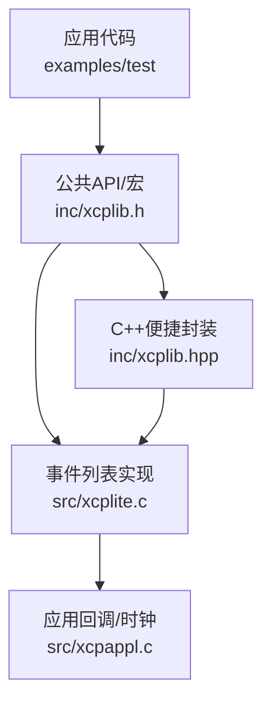
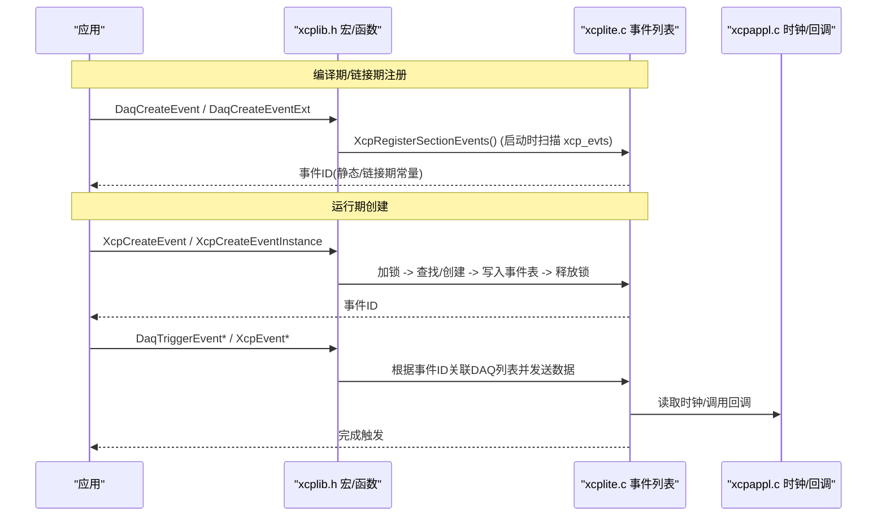
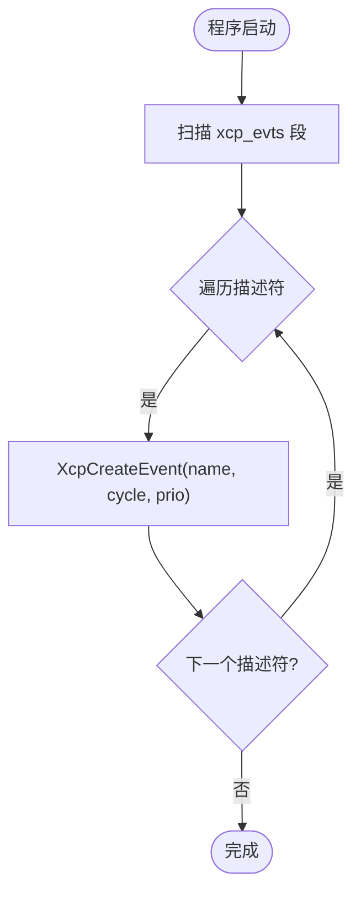
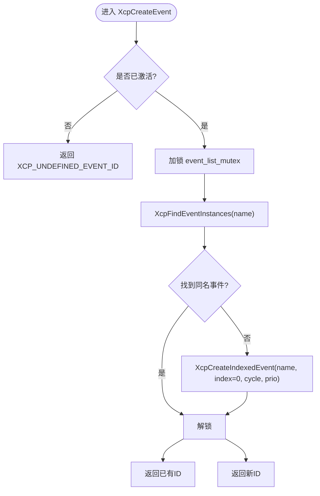
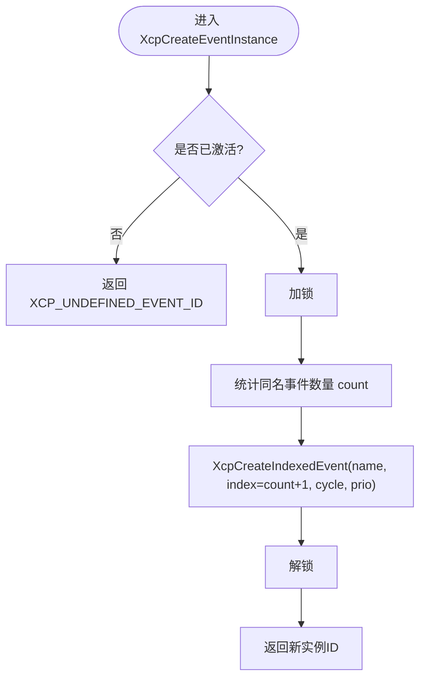
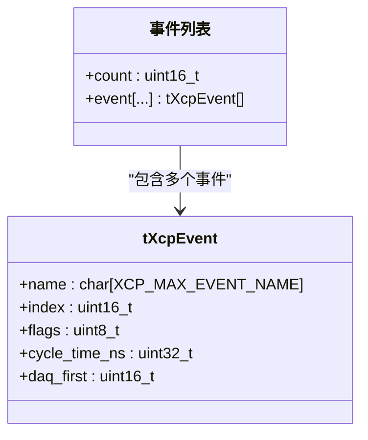
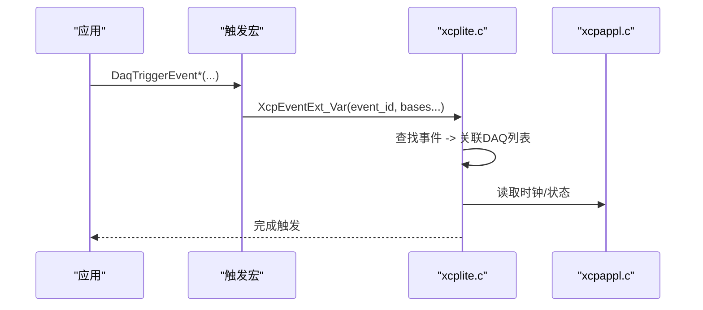
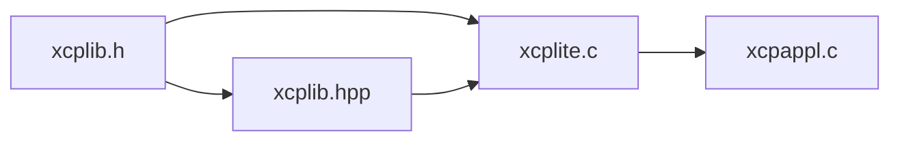

# 事件创建

<cite>
**本文引用的文件**
- [xcplib.h](file://inc/xcplib.h)
- [xcplite.c](file://src/xcplite.c)
- [xcpappl.c](file://src/xcpappl.c)
- [xcplib.hpp](file://inc/xcplib.hpp)
- [hello_xcp/main.c](file://examples/hello_xcp/src/main.c)
- [daq_test/main.c](file://test/daq_test/src/main.c)
</cite>

## 目录
1. [简介](#简介)
2. [项目结构](#项目结构)
3. [核心组件](#核心组件)
4. [架构总览](#架构总览)
5. [详细组件分析](#详细组件分析)
6. [依赖关系分析](#依赖关系分析)
7. [性能考量](#性能考量)
8. [故障排查指南](#故障排查指南)
9. [结论](#结论)
10. [附录](#附录)

## 简介
本文件系统性说明 XCPlite 中 DAQ 事件的创建与管理接口，重点覆盖：
- 运行时创建：XcpCreateEvent、XcpCreateEventInstance
- 编译时/链接时注册：DaqCreateEvent、DaqCreateEventExt
- 事件名称唯一性与实例化策略
- 周期时间（cycle_time_ns）与优先级（priority）配置
- 事件 ID 管理与查找机制
- 事件生命周期管理、内存分配策略与错误处理

## 项目结构
围绕事件创建与管理的关键代码分布在以下位置：
- 公共 API 定义与宏：inc/xcplib.h
- 事件列表实现与初始化：src/xcplite.c
- 应用回调与时钟等支撑：src/xcpappl.c
- C++ 便捷封装与模板触发：inc/xcplib.hpp
- 示例与测试用例：examples/hello_xcp/src/main.c、test/daq_test/src/main.c

图表来源
- [xcplib.h:239-453](file://inc/xcplib.h#L239-L453)
- [xcplite.c:779-1074](file://src/xcplite.c#L779-L1074)
- [xcpappl.c:125-169](file://src/xcpappl.c#L125-L169)
- [xcplib.hpp:302-498](file://inc/xcplib.hpp#L302-L498)

章节来源
- [xcplib.h:239-453](file://inc/xcplib.h#L239-L453)
- [xcplite.c:779-1074](file://src/xcplite.c#L779-L1074)
- [xcpappl.c:125-169](file://src/xcpappl.c#L125-L169)
- [xcplib.hpp:302-498](file://inc/xcplib.hpp#L302-L498)

## 核心组件
- 事件描述符与注册段
  - tXcpEventDescriptor：包含 name、cycle_time_ns、priority，用于链接期或运行期预注册。
  - XCP_EVENT_SECTION_ATTR：将事件描述符放入特定段，供启动扫描预注册。
- 动态事件列表
  - XcpCreateEvent：按名称创建事件，若同名已存在则返回已有ID（名称唯一）。
  - XcpCreateEventInstance：按名称创建事件实例，若同名存在则生成递增实例索引（A2L中显示为 name_index）。
  - XcpFindEvent：按名称查找事件ID。
  - XcpGetEventIndex：获取事件实例索引（1..），用于区分同名多实例。
- 触发与采集
  - DaqTriggerEvent/DaqTriggerEventAt_i 等宏：触发事件并采集局部变量或绝对地址数据。
  - XcpEvent/XcpEventExt/XcpEventAt 系列：底层触发函数。
- 辅助能力
  - XcpGetEventCycleTime / XcpGetEventPriority：查询事件周期与优先级。
  - XcpGetEventName：返回完整名称（含实例后缀）。
  - 线程安全：事件列表访问使用互斥锁；原子操作保证可见性。

章节来源
- [xcplib.h:239-453](file://inc/xcplib.h#L239-L453)
- [xcplite.c:800-1074](file://src/xcplite.c#L800-L1074)
- [xcplib.hpp:302-498](file://inc/xcplib.hpp#L302-L498)

## 架构总览
下图展示事件从“声明/创建”到“触发”的端到端流程，包括两种路径：编译期/链接期注册与运行期创建。

图表来源
- [xcplib.h:396-453](file://inc/xcplib.h#L396-L453)
- [xcplite.c:973-1005](file://src/xcplite.c#L973-L1005)
- [xcplite.c:929-971](file://src/xcplite.c#L929-L971)
- [xcpappl.c:125-169](file://src/xcpappl.c#L125-L169)

## 详细组件分析

### 事件描述符与段注册（编译期/链接期）
- 描述符结构：tXcpEventDescriptor(name, cycle_time_ns, priority)
- 段属性：XCP_EVENT_SECTION_ATTR 将描述符放入 xcp_evts 段
- 启动预注册：XcpRegisterSectionEvents() 在激活后扫描该段并调用 XcpCreateEvent 进行预注册
- 链接期ID：在支持的平台可通过 XCP_EVENT_SECTION_GET_LINKTIME_ID 直接获得事件ID

图表来源
- [xcplib.h:314-355](file://inc/xcplib.h#L314-L355)
- [xcplite.c:973-1005](file://src/xcplite.c#L973-L1005)

章节来源
- [xcplib.h:314-355](file://inc/xcplib.h#L314-L355)
- [xcplite.c:973-1005](file://src/xcplite.c#L973-L1005)

### 运行时创建：XcpCreateEvent
- 语义：按名称创建事件；若同名已存在，返回已有事件ID（名称唯一）
- 参数：name（字符串）、cycle_time_ns（纳秒，0表示随机/非周期）、priority（0普通，>=1实时）
- 线程安全：内部使用互斥锁保护事件列表
- 返回值：成功的事件ID，或 XCP_UNDEFINED_EVENT_ID（未初始化/内存不足/名称超长）

图表来源
- [xcplite.c:949-971](file://src/xcplite.c#L949-L971)
- [xcplite.c:856-880](file://src/xcplite.c#L856-L880)
- [xcplite.c:882-927](file://src/xcplite.c#L882-L927)

章节来源
- [xcplite.c:949-971](file://src/xcplite.c#L949-L971)
- [xcplite.c:856-880](file://src/xcplite.c#L856-L880)
- [xcplite.c:882-927](file://src/xcplite.c#L882-L927)

### 运行时实例：XcpCreateEventInstance
- 语义：按名称创建事件实例；若同名存在，自动分配递增实例索引（A2L中显示为 name_index）
- 用途：同一逻辑事件的多实例（如多线程任务各一个）
- 线程安全：同 XcpCreateEvent，使用互斥锁
- 返回值：新实例ID，或 XCP_UNDEFINED_EVENT_ID

图表来源
- [xcplite.c:929-947](file://src/xcplite.c#L929-L947)
- [xcplite.c:856-880](file://src/xcplite.c#L856-L880)
- [xcplite.c:882-927](file://src/xcplite.c#L882-L927)

章节来源
- [xcplite.c:929-947](file://src/xcplite.c#L929-L947)
- [xcplite.c:856-880](file://src/xcplite.c#L856-L880)
- [xcplite.c:882-927](file://src/xcplite.c#L882-L927)

### 事件ID管理与查找
- XcpFindEvent(name)：返回第一个匹配的名称对应的事件ID
- XcpGetEventIndex(event)：返回实例索引（1..），未实例化返回0
- XcpGetEventName(event)：返回完整名称（含实例后缀）
- 名称唯一性：XcpCreateEvent 保证名称唯一；XcpCreateEventInstance 允许同名多实例

图表来源
- [xcplite.c:800-853](file://src/xcplite.c#L800-L853)
- [xcplite.c:856-880](file://src/xcplite.c#L856-L880)

章节来源
- [xcplite.c:800-853](file://src/xcplite.c#L800-L853)
- [xcplite.c:856-880](file://src/xcplite.c#L856-L880)

### 周期时间与优先级
- 周期时间（cycle_time_ns）：以纳秒为单位；0表示非周期/随机事件
  - 作用：帮助客户端估算DAQ数据速率；不影响触发行为本身
- 优先级（priority）：0为普通，>=1为实时
  - 影响：事件标志位设置，后续调度/传输可能受益
- 查询接口：XcpGetEventCycleTime、XcpGetEventPriority

章节来源
- [xcplib.h:246-266](file://inc/xcplib.h#L246-L266)
- [xcplite.c:809-823](file://src/xcplite.c#L809-L823)
- [xcplite.c:882-927](file://src/xcplite.c#L882-L927)

### 触发与采集
- 宏：DaqTriggerEvent、DaqTriggerEventAt_i、DaqTriggerEventCapture 等
- 底层：XcpEvent、XcpEventExt、XcpEventAt、XcpEventExt_Var 等
- 栈相对/绝对/相对模式：通过基址指针和扩展地址组合实现
- 捕获局部变量：通过捕获结构体传递，避免寄存器变量不可测问题

图表来源
- [xcplib.h:455-658](file://inc/xcplib.h#L455-L658)
- [xcplite.c:1076-1200](file://src/xcplite.c#L1076-L1200)
- [xcpappl.c:125-169](file://src/xcpappl.c#L125-L169)

章节来源
- [xcplib.h:455-658](file://inc/xcplib.h#L455-L658)
- [xcplite.c:1076-1200](file://src/xcplite.c#L1076-L1200)
- [xcpappl.c:125-169](file://src/xcpappl.c#L125-L169)

### 不同场景下的事件创建示例
- 编译期/链接期注册（推荐用于全局稳定事件）
  - 使用 DaqCreateEvent("mainloop") 或 DaqCreateEventExt("task", cycle_us*1000, prio)
  - 启动时由 XcpRegisterSectionEvents 预注册，可获得链接期ID
  - 参考：[hello_xcp/main.c:201-221](file://examples/hello_xcp/src/main.c#L201-L221)
- 运行期创建（适合动态/条件创建）
  - 使用 XcpCreateEvent("calc_power", 0, 0) 或 XcpCreateEventInstance("task", 0, 0)
  - 参考：[hello_xcp/main.c:95-135](file://examples/hello_xcp/src/main.c#L95-L135)
- 多实例事件（多线程任务）
  - 每个线程调用 DaqCreateEventInstance(task)，并通过 DaqGetEventInstanceId(task) 获取实例ID
  - 使用 XcpGetEventIndex(event_id) 获取实例序号，便于命名/分组
  - 参考：[daq_test/main.c:199-218](file://test/daq_test/src/main.c#L199-L218)

章节来源
- [hello_xcp/main.c:95-135](file://examples/hello_xcp/src/main.c#L95-L135)
- [hello_xcp/main.c:201-221](file://examples/hello_xcp/src/main.c#L201-L221)
- [daq_test/main.c:199-218](file://test/daq_test/src/main.c#L199-L218)

### 事件生命周期管理
- 创建：编译期/链接期预注册或运行期创建
- 使用：通过事件ID触发采集；可启用/禁用（XcpEventEnable）
- 清理：DAQ停止时，事件关联的DAQ列表会被清空（事件本身保留，除非进程退出）
- 注意：事件列表大小受 XCP_MAX_EVENT_COUNT 限制；内存不足会失败

章节来源
- [xcplite.c:1086-1108](file://src/xcplite.c#L1086-L1108)
- [xcplite.c:882-927](file://src/xcplite.c#L882-L927)

### 内存分配策略
- 事件表：静态数组（最大 XCP_MAX_EVENT_COUNT）
- 名称长度：受 XCP_MAX_EVENT_NAME 限制
- 名称校验：超长名称直接拒绝并返回错误
- 线程安全：事件列表访问加锁；计数更新使用原子操作保证可见性

章节来源
- [xcplite.c:882-927](file://src/xcplite.c#L882-L927)
- [xcplite.c:779-797](file://src/xcplite.c#L779-L797)

### 错误处理机制
- 未激活：返回 XCP_UNDEFINED_EVENT_ID
- 名称过长：记录错误日志并返回 XCP_UNDEFINED_EVENT_ID
- 超出事件上限：记录错误日志并返回 XCP_UNDEFINED_EVENT_ID
- 查找不到：XcpFindEvent 返回 XCP_UNDEFINED_EVENT_ID

章节来源
- [xcplite.c:882-927](file://src/xcplite.c#L882-L927)
- [xcplite.c:856-880](file://src/xcplite.c#L856-L880)

## 依赖关系分析
- xcplib.h 提供对外API与宏，屏蔽平台差异
- xcplite.c 实现事件列表、查找、创建、预注册
- xcpappl.c 提供时钟与回调，供事件触发时获取时间戳
- xcplib.hpp 提供C++便捷封装与模板触发

图表来源
- [xcplib.h:239-453](file://inc/xcplib.h#L239-L453)
- [xcplite.c:779-1074](file://src/xcplite.c#L779-L1074)
- [xcpappl.c:125-169](file://src/xcpappl.c#L125-L169)
- [xcplib.hpp:302-498](file://inc/xcplib.hpp#L302-L498)

章节来源
- [xcplib.h:239-453](file://inc/xcplib.h#L239-L453)
- [xcplite.c:779-1074](file://src/xcplite.c#L779-L1074)
- [xcpappl.c:125-169](file://src/xcpappl.c#L125-L169)
- [xcplib.hpp:302-498](file://inc/xcplib.hpp#L302-L498)

## 性能考量
- 事件查找：XcpFindEvent 线性扫描，建议缓存事件ID（静态或线程局部存储）
- 触发开销：使用 DaqTriggerEvent_i 等基于ID的触发避免重复查找
- 周期时间：仅用于客户端估算，不改变触发行为
- 优先级：设置为>=1有助于在高负载下优先处理
- 捕获局部变量：使用捕获结构体减少寄存器变量不可测带来的额外开销

## 故障排查指南
- 现象：事件创建返回 XCP_UNDEFINED_EVENT_ID
  - 检查是否已调用 XcpInit 激活
  - 检查名称长度是否超过 XCP_MAX_EVENT_NAME
  - 检查是否达到 XCP_MAX_EVENT_COUNT
- 现象：找不到事件
  - 确认名称拼写一致；多实例情况下使用 XcpGetEventIndex 区分
- 现象：DAQ数据异常
  - 检查事件是否关联了正确的DAQ列表
  - 检查基址指针与地址扩展是否正确设置

章节来源
- [xcplite.c:882-927](file://src/xcplite.c#L882-L927)
- [xcplite.c:856-880](file://src/xcplite.c#L856-L880)

## 结论
XCPlite 提供了灵活且高效的事件创建与管理机制：
- 编译期/链接期注册适合全局稳定事件，具备零运行时开销优势
- 运行期创建适合动态场景，支持名称唯一与多实例
- 周期时间与优先级可配合工具链优化数据采集体验
- 完善的线程安全与错误处理保障稳定性
- 结合触发宏与捕获机制，可高效采集局部与全局变量

## 附录
- 常用API速查
  - 创建：XcpCreateEvent、XcpCreateEventInstance
  - 查找：XcpFindEvent、XcpGetEventIndex、XcpGetEventName
  - 查询：XcpGetEventCycleTime、XcpGetEventPriority
  - 触发：DaqTriggerEvent*、XcpEvent*
  - 控制：XcpEventEnable
- 参考示例
  - 编译期注册：hello_xcp/main.c
  - 运行期创建：hello_xcp/main.c
  - 多实例：daq_test/main.c