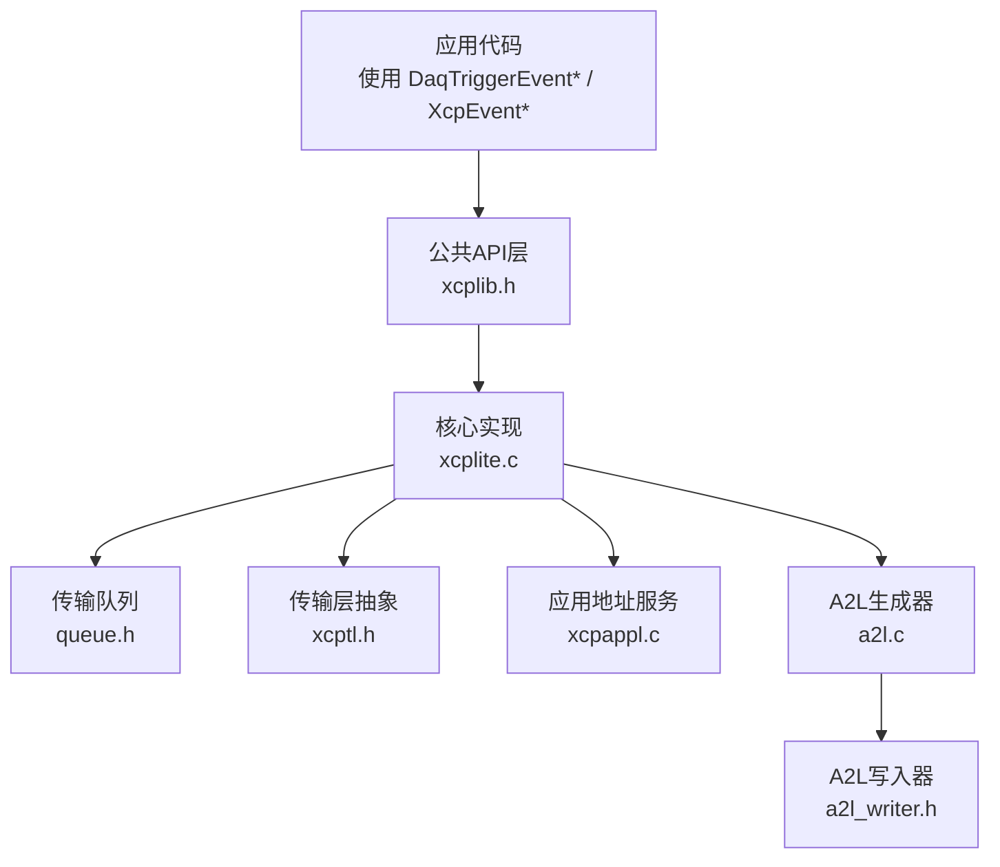
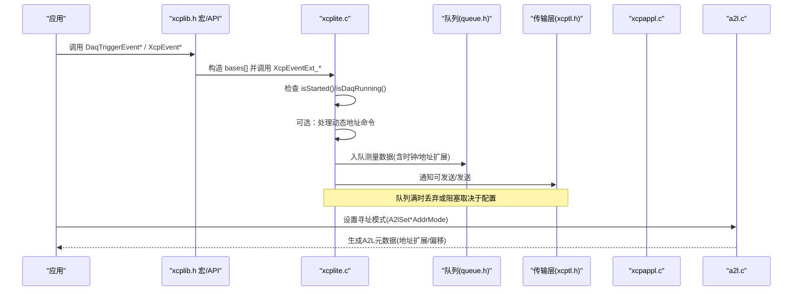
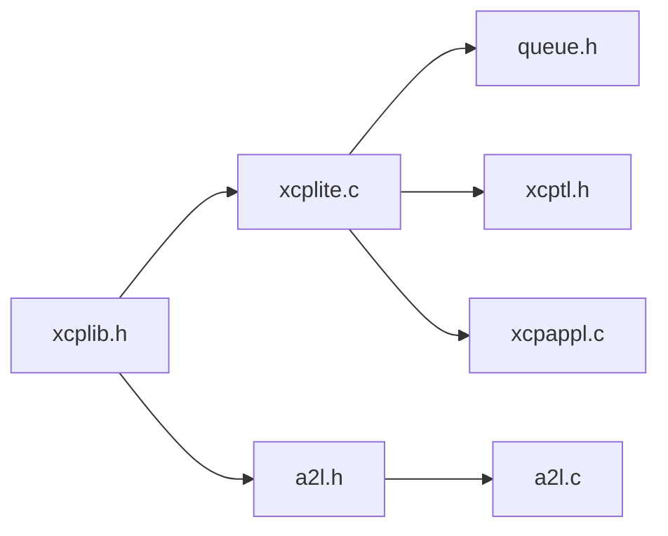

# 事件触发

<cite>
**本文引用的文件**
- [xcplib.h](file://inc/xcplib.h)
- [a2l.h](file://inc/a2l.h)
- [xcplite.c](file://src/xcplite.c)
- [xcpappl.c](file://src/xcpappl.c)
- [a2l.c](file://src/a2l.c)
- [struct_demo/main.c](file://examples/struct_demo/src/main.c)
- [multi_thread_demo/main.c](file://examples/multi_thread_demo/src/main.c)
</cite>

## 目录
1. [简介](#简介)
2. [项目结构](#项目结构)
3. [核心组件](#核心组件)
4. [架构总览](#架构总览)
5. [详细组件分析](#详细组件分析)
6. [依赖关系分析](#依赖关系分析)
7. [性能考虑](#性能考虑)
8. [故障排查指南](#故障排查指南)
9. [结论](#结论)
10. [附录](#附录)

## 简介
本文件聚焦于 XCPlite 的 DAQ 事件触发机制与相关 API，系统说明以下要点：
- 事件创建与触发：XcpEvent、XcpEventExt、XcpEventAt 等函数及 DaqTriggerEvent 系列宏。
- 寻址模式：绝对寻址、相对寻址、栈相对寻址的区别与适用场景。
- 带时间戳的事件触发方式。
- 事件队列管理、并发安全与实时性保证。
- 性能优化技巧与最佳实践。

## 项目结构
围绕事件触发的关键代码分布在公共头文件与核心实现中：
- 公共 API 与宏定义：inc/xcplib.h（事件描述符、创建与触发宏）、inc/a2l.h（A2L 生成与寻址模式设置）。
- 运行时触发与队列处理：src/xcplite.c（XcpEvent* 系列实现、事件触发入口）。
- 绝对地址基址与转换：src/xcpappl.c（模块基址、指针到 XCP 地址转换）。
- A2L 生成与寻址模式状态：src/a2l.c（A2L 生成器内部状态与模式切换）。
- 示例用法：examples/struct_demo/src/main.c、examples/multi_thread_demo/src/main.c。

图表来源
- [xcplib.h:458-483](file://inc/xcplib.h#L458-L483)
- [xcplite.c:1775-1903](file://src/xcplite.c#L1775-L1903)
- [xcpappl.c:170-226](file://src/xcpappl.c#L170-L226)
- [a2l.h:324-376](file://inc/a2l.h#L324-L376)
- [a2l.c:61-69](file://src/a2l.c#L61-L69)

章节来源
- [xcplib.h:239-483](file://inc/xcplib.h#L239-L483)
- [a2l.h:324-376](file://inc/a2l.h#L324-L376)
- [xcplite.c:1775-1903](file://src/xcplite.c#L1775-L1903)
- [xcpappl.c:170-226](file://src/xcpappl.c#L170-L226)
- [a2l.c:61-69](file://src/a2l.c#L61-L69)

## 核心组件
- 事件描述符与创建：tXcpEventDescriptor、DaqCreateEvent/DaqCreateEventExt、XcpCreateEvent/XcpCreateEventInstance。
- 触发函数：XcpEvent、XcpEventExt、XcpEventAt、XcpEventExtAt、XcpEventExt_Var、XcpEventExtAt_Var。
- 触发宏：DaqTriggerEvent、DaqTriggerEventAt、DaqTriggerEventExt、DaqTriggerEventCapture 等。
- 寻址模式设置：A2lSetAbsoluteAddrMode、A2lSetRelativeAddrMode、A2lSetStackAddrMode、A2lSetAutomaticAddrMode。
- 绝对地址服务：ApplXcpGetBaseAddr/ApplXcpGetModuleAddr/ApplXcpGetAddr/ApplXcpGetAddrExt。

章节来源
- [xcplib.h:314-483](file://inc/xcplib.h#L314-L483)
- [a2l.h:324-376](file://inc/a2l.h#L324-L376)
- [xcpappl.c:170-226](file://src/xcpappl.c#L170-L226)

## 架构总览
事件触发从应用侧通过宏或函数进入核心层，核心层根据当前 DAQ 运行状态与寻址模式，将数据拷贝到传输队列并交由传输层发送。A2L 生成器在编译/运行期根据寻址模式生成正确的地址信息，使上位机工具能正确解析测量值。

图表来源
- [xcplib.h:570-642](file://inc/xcplib.h#L570-L642)
- [xcplite.c:1775-1903](file://src/xcplite.c#L1775-L1903)
- [a2l.h:324-376](file://inc/a2l.h#L324-L376)

## 详细组件分析

### 事件创建与管理
- 静态/链接期事件：通过 DaqCreateEvent/DaqCreateEventExt 将 tXcpEventDescriptor 放入 xcp_evts 段，启动时扫描注册，获得 tXcpEventId。
- 动态事件列表：OPTION_DAQ_EVENT_LIST 启用后，支持运行时创建与实例化（XcpCreateEvent/XcpCreateEventInstance），线程安全（互斥保护）。
- 事件查找与索引：XcpFindEvent、XcpGetEventIndex。

章节来源
- [xcplib.h:239-453](file://inc/xcplib.h#L239-L453)

### 事件触发 API
- XcpEvent(event)：仅支持绝对寻址（bases 包含基址）。
- XcpEventExt(event, base)：支持绝对+动态寻址（bases 包含基址与用户提供的 base）。
- XcpEventAt(event, clock)：带时间戳的绝对寻址触发。
- XcpEventExtAt(event, base, clock)：带时间戳的绝对+动态寻址触发。
- XcpEventExt_Var(event, count, ...)：可变参数传递多个 base（用于多地址扩展）。
- XcpEventEnable(event, enable)：按事件启用/禁用。

实现要点：
- 在进入触发路径前检查 isStarted()/isDaqRunning()。
- 在动态地址模式下，先处理待处理的动态地址命令（XcpProcessPendingCommand）。
- 最终统一调用 XcpTriggerDaqEvent_ 将事件与 bases[] 入队。

章节来源
- [xcplite.c:1775-1903](file://src/xcplite.c#L1775-L1903)

### 触发宏 DaqTriggerEvent 系列
- DaqTriggerEvent(event_name)：自动获取帧指针（栈相对）并触发。
- DaqTriggerEventAt(event_name, clock)：带时间戳的栈相对触发。
- DaqTriggerEventExt(event_name, base_addr)：同时提供栈帧与相对基址（两个地址扩展）。
- DaqTriggerEvent_i(event_id)：直接使用事件句柄，避免查找开销。
- DaqTriggerEventCapture/CaptureAt：捕获局部变量到栈上结构体，再作为地址扩展传入，适合寄存器变量无法直接测量的场景。

注意：
- 若函数内联会破坏栈相对寻址的一致性，需标记 XCP_NOINLINE。
- 触发后必须调用 XCP_NO_TAIL_CALL() 防止尾调用优化导致栈帧释放。

章节来源
- [xcplib.h:558-757](file://inc/xcplib.h#L558-L757)

### 寻址模式详解
- 绝对寻址（Absolute）：以模块加载地址为基址，变量用固定偏移表示。适用于全局/静态变量。
  - 设置：A2lSetAbsoluteAddrMode(event)。
  - 触发：XcpEvent/XcpEventAt。
  - 地址转换：ApplXcpGetAddr/ApplXcpGetAddrExt。
- 相对寻址（Relative）：以用户提供的 base 为基址，变量用相对于 base 的偏移表示。适用于堆对象或类成员。
  - 设置：A2lSetRelativeAddrMode(event, base_addr)。
  - 触发：DaqTriggerEventExt / XcpEventExt。
- 栈相对寻址（Stack）：以当前栈帧为基址，变量用相对于栈帧的偏移表示。适用于局部变量。
  - 设置：A2lSetStackAddrMode(event)。
  - 触发：DaqTriggerEvent / DaqTriggerEventAt。
- 自动寻址（Automatic）：根据变量是否位于当前栈帧，自动选择栈相对或相对寻址。
  - 设置：A2lSetAutomaticAddrMode(event, base_addr)。

章节来源
- [a2l.h:324-376](file://inc/a2l.h#L324-L376)
- [xcpappl.c:170-226](file://src/xcpappl.c#L170-L226)

### 不同寻址模式下的触发示例
- 绝对寻址：对全局/静态变量使用 A2lSetAbsoluteAddrMode，并通过 XcpEvent/XcpEventAt 触发。
- 相对寻址：对堆对象使用 A2lSetRelativeAddrMode(event, heap_ptr)，并通过 DaqTriggerEventExt(event, heap_ptr) 触发。
- 栈相对寻址：对局部变量使用 A2lSetStackAddrMode(event)，并通过 DaqTriggerEvent(event) 触发。
- 混合场景：同一事件可同时提供栈帧与相对基址（两个地址扩展），如 multi_thread_demo 中使用 ctx 作为相对基址。

章节来源
- [struct_demo/main.c:130-171](file://examples/struct_demo/src/main.c#L130-L171)
- [multi_thread_demo/main.c:113-124](file://examples/multi_thread_demo/src/main.c#L113-L124)

### 带时间戳的触发
- 使用 XcpEventAt/XcpEventExtAt/XcpEventExtAt_Var 传入 uint64_t clock。
- 当 clock==0 时等价于非时间戳版本；否则由底层记录精确时间戳。
- 推荐在高优先级任务或中断上下文中使用 At 变体以获得更准确的时序。

章节来源
- [xcplib.h:475-479](file://inc/xcplib.h#L475-L479)
- [xcplite.c:1775-1853](file://src/xcplite.c#L1775-L1853)

### 事件队列管理与并发安全
- 队列接口：queue.h 提供通用队列能力，核心层将测量数据入队，传输层负责发送。
- 并发安全：
  - 事件列表（OPTION_DAQ_EVENT_LIST）使用互斥保护创建与查找。
  - 触发路径检查 isStarted()/isDaqRunning()，避免在非运行态下入队。
  - 动态地址命令处理（XcpProcessPendingCommand）确保地址更新一致性。
- 实时性：
  - 事件优先级（priority）可用于调度策略（创建时指定）。
  - 队列大小与丢弃策略影响丢包与延迟，需结合平台与负载调优。

章节来源
- [xcplib.h:246-277](file://inc/xcplib.h#L246-L277)
- [xcplite.c:1775-1903](file://src/xcplite.c#L1775-L1903)

## 依赖关系分析
- xcplib.h 暴露事件创建与触发 API，供应用与示例使用。
- xcplite.c 实现触发逻辑，依赖 queue.h 与 xcptl.h。
- xcpappl.c 提供绝对地址服务，被触发路径用于计算偏移与地址扩展。
- a2l.c 维护寻址模式状态，配合 a2l.h 的宏生成 A2L 元数据。

图表来源
- [xcplib.h:239-483](file://inc/xcplib.h#L239-L483)
- [xcplite.c:1775-1903](file://src/xcplite.c#L1775-L1903)
- [a2l.h:324-376](file://inc/a2l.h#L324-L376)
- [xcpappl.c:170-226](file://src/xcpappl.c#L170-L226)
- [a2l.c:61-69](file://src/a2l.c#L61-L69)

章节来源
- [xcplib.h:239-483](file://inc/xcplib.h#L239-L483)
- [xcplite.c:1775-1903](file://src/xcplite.c#L1775-L1903)
- [a2l.h:324-376](file://inc/a2l.h#L324-L376)
- [xcpappl.c:170-226](file://src/xcpappl.c#L170-L226)
- [a2l.c:61-69](file://src/a2l.c#L61-L69)

## 性能考虑
- 优先使用事件句柄（DaqTriggerEvent_i）避免名称查找开销。
- 减少不必要的地址扩展数量，仅在需要时使用相对/动态基址。
- 避免在高频路径中进行字符串操作或锁竞争；使用线程本地缓存事件 ID。
- 合理设置队列大小与丢弃策略，平衡吞吐与延迟。
- 使用带时间戳触发（At 变体）时，确保时钟源精度与频率满足需求。
- 对于局部变量，优先使用 DaqTriggerEventCapture 捕获寄存器变量，避免强制落栈带来的额外开销。

[本节为通用指导，不直接分析具体文件]

## 故障排查指南
- 未生效：确认已调用 A2lInit 并完成 A2L 生成；检查事件是否已创建且处于启用状态。
- 数据错位：核对寻址模式与变量位置匹配（全局用绝对、堆用相对、局部用栈相对）。
- 崩溃或断言：检查指针是否在有效范围（ApplXcpGetAddr 越界检查）；确保栈帧未被尾调用优化。
- 丢包：增大队列容量或降低触发频率；检查传输层是否及时消费。
- 时间戳不准：确认时钟源与平台实现；必要时提高事件优先级。

章节来源
- [xcpappl.c:170-226](file://src/xcpappl.c#L170-L226)
- [xcplite.c:1775-1903](file://src/xcplite.c#L1775-L1903)

## 结论
XCPlite 提供了完善的事件触发机制，覆盖绝对、相对与栈相对寻址，并支持带时间戳的高精度触发。通过 DaqTriggerEvent 系列宏与 XcpEvent* API，开发者可在不同场景下高效采集数据。结合合理的队列配置与寻址模式选择，可实现高吞吐、低延迟与实时性保障的 DAQ 方案。

[本节为总结，不直接分析具体文件]

## 附录
- 常用宏速查：
  - 事件创建：DaqCreateEvent、DaqCreateEventExt、XcpCreateEvent、XcpCreateEventInstance。
  - 事件触发：DaqTriggerEvent、DaqTriggerEventAt、DaqTriggerEventExt、DaqTriggerEventCapture。
  - 寻址模式：A2lSetAbsoluteAddrMode、A2lSetRelativeAddrMode、A2lSetStackAddrMode、A2lSetAutomaticAddrMode。
- 参考示例：
  - 绝对/相对/栈相对混用：examples/struct_demo/src/main.c。
  - 多线程上下文相对寻址：examples/multi_thread_demo/src/main.c。

章节来源
- [struct_demo/main.c:130-171](file://examples/struct_demo/src/main.c#L130-L171)
- [multi_thread_demo/main.c:113-124](file://examples/multi_thread_demo/src/main.c#L113-L124)