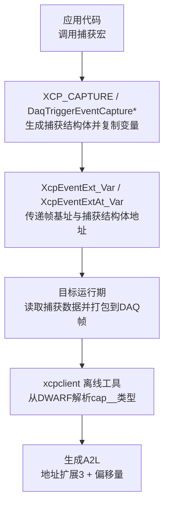
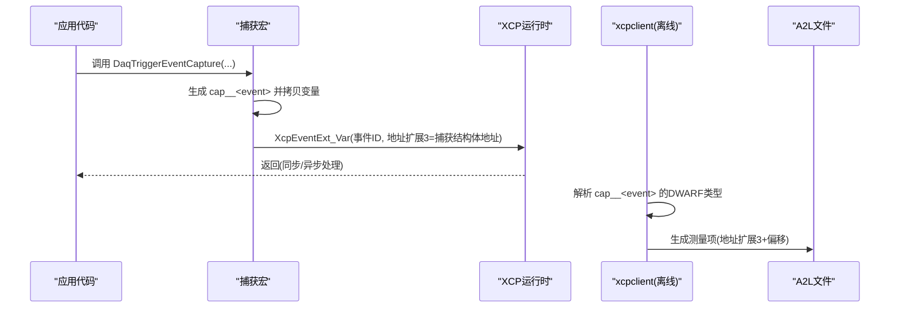
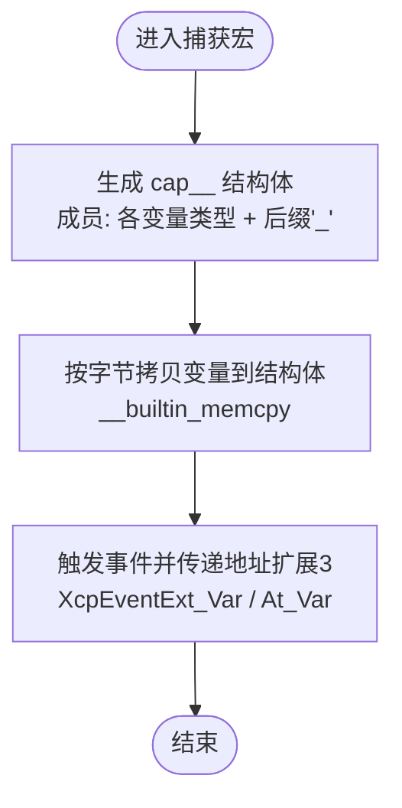
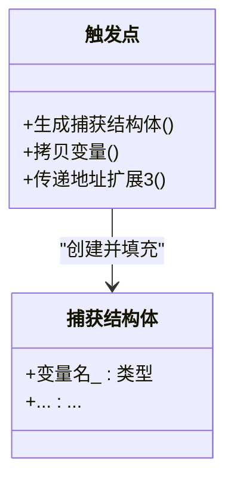
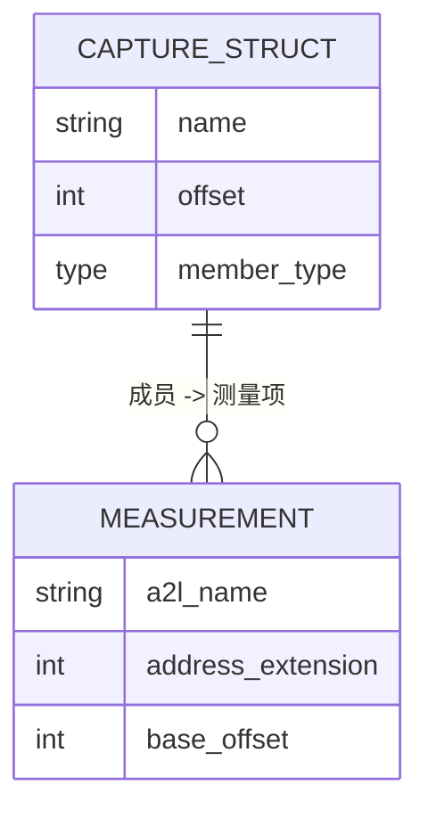
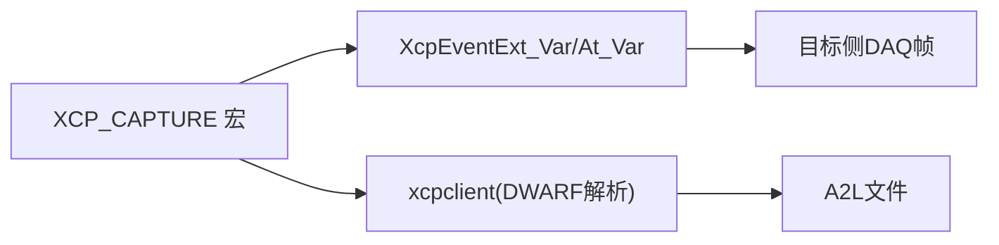

# 变量捕获

<cite>
**本文引用的文件**
- [inc/xcplib.h](file://inc/xcplib.h)
- [docs/OFFLINE_A2L.md](file://docs/OFFLINE_A2L.md)
- [tools/xcpclient/fixtures/c_captures.c](file://tools/xcpclient/fixtures/c_captures.c)
- [examples/struct_demo/src/main.c](file://examples/struct_demo/src/main.c)
</cite>

## 目录
1. [简介](#简介)
2. [项目结构](#项目结构)
3. [核心组件](#核心组件)
4. [架构总览](#架构总览)
5. [详细组件分析](#详细组件分析)
6. [依赖关系分析](#依赖关系分析)
7. [性能考虑](#性能考虑)
8. [故障排查指南](#故障排查指南)
9. [结论](#结论)
10. [附录](#附录)

## 简介
本文件聚焦于 XCPlite 的 DAQ 事件中的“变量捕获”能力，重点说明 XCP_CAPTURE 宏与 DaqTriggerEventCapture 系列函数的工作原理、局部变量捕获机制、寄存器变量的处理方式、限制条件、A2L 表示方式、内存布局以及性能优化建议。通过官方头文件、离线 A2L 文档与示例代码，帮助读者在不深入源码细节的前提下掌握该功能的使用方法与最佳实践。

## 项目结构
围绕变量捕获的关键位置如下：
- 接口与宏定义：位于 inc/xcplib.h，包含 XCP_CAPTURE、DaqTriggerEventCapture、DaqTriggerEventCaptureAt、DaqCreateAndTriggerEventCapture 等宏，以及捕获计数上限与内部辅助宏。
- 离线 A2L 生成规则：位于 docs/OFFLINE_A2L.md，描述捕获结构体 cap__<event> 的 DWARF 类型如何被 xcpclient 解析并映射为 A2L 测量项，以及地址扩展 3 的使用。
- 使用示例：tools/xcpclient/fixtures/c_captures.c 展示了捕获结构体的展开形式与触发流程；examples/struct_demo/src/main.c 展示了复杂数据类型（结构体、数组）在 A2L 中的建模与测量。

图表来源
- [inc/xcplib.h:715-757](file://inc/xcplib.h#L715-L757)
- [docs/OFFLINE_A2L.md:131-151](file://docs/OFFLINE_A2L.md#L131-L151)

章节来源
- [inc/xcplib.h:660-757](file://inc/xcplib.h#L660-L757)
- [docs/OFFLINE_A2L.md:131-151](file://docs/OFFLINE_A2L.md#L131-L151)

## 核心组件
- XCP_CAPTURE(event_name, ...)
  - 作用：在当前作用域声明一个名为 cap__<event_name> 的结构体，成员类型为各捕获变量的类型，成员名以原变量名加下划线结尾；随后将每个捕获变量按字节拷贝到该结构体中。
  - 关键点：使用 __typeof__ 推导类型，使用 __builtin_memcpy 进行高效拷贝；避免强制将寄存器变量落栈，保持原始变量可继续驻留寄存器。
- DaqTriggerEventCapture(event_name, ...)
  - 作用：先执行 XCP_CAPTURE，再获取事件ID，设置事件描述符，并通过 XcpEventExt_Var 将捕获结构体地址作为“地址扩展3”的基址传递给目标；最后阻止尾调用优化以保证生命周期。
- DaqTriggerEventCaptureAt(event_name, clock, ...)
  - 作用：与上类似，但通过 XcpEventExtAt_Var 附带时间戳。
- DaqCreateAndTriggerEventCapture(event_name, ...)
  - 作用：就地创建事件描述符并触发，同时完成变量捕获。

限制与约束（来自注释与文档）：
- 最多支持 XCP_CAPTURE_MAX_COUNT（16）个变量。
- 仅接受简单标识符（局部变量、参数或全局变量）。
- 位域成员不可捕获；C++ 中 const 成员会导致捕获结构体缺少默认构造，因此不可捕获。
- C++ 中被捕获的对象必须是 trivially copyable（按字节拷贝）。
- 函数可被内联（因为不依赖栈帧相对寻址），但触发事件的函数本身不应被内联（否则无法确定唯一的栈帧布局）。

章节来源
- [inc/xcplib.h:660-757](file://inc/xcplib.h#L660-L757)
- [docs/OFFLINE_A2L.md:131-151](file://docs/OFFLINE_A2L.md#L131-L151)

## 架构总览
变量捕获的整体流程如下：
- 编译期：宏展开生成捕获结构体 cap__<event>，并在触发点将变量值拷贝进该结构体；同时保留事件描述符与触发锚点符号。
- 运行期：触发事件时，将捕获结构体地址作为“地址扩展3”的基址传给 XCP 服务器；服务器读取该结构体内容并封装到 DAQ 帧。
- 离线 A2L 生成：xcpclient 从 ELF/DWARF 中解析 cap__<event> 的类型信息，将其成员注册为测量项，使用地址扩展3与成员偏移量定位数据；并将成员名还原为原变量名。

图表来源
- [inc/xcplib.h:715-757](file://inc/xcplib.h#L715-L757)
- [docs/OFFLINE_A2L.md:131-151](file://docs/OFFLINE_A2L.md#L131-L151)

## 详细组件分析

### XCP_CAPTURE 与 DaqTriggerEventCapture 系列
- 工作原理
  - 通过可变参数宏统计参数个数，为每个参数生成一个结构体成员（类型由 __typeof__ 推导，名称为原变量名加下划线）。
  - 使用 __builtin_memcpy 将变量值按字节拷贝到捕获结构体，避免将寄存器变量强制落栈。
  - 触发事件时，将捕获结构体地址作为“地址扩展3”的基址传入，使目标侧能直接读取该结构体。
- 关键实现要点
  - 最大捕获数量：XCP_CAPTURE_MAX_COUNT = 16。
  - 阻止尾调用：确保捕获结构体在触发期间有效。
  - 事件ID与描述符：静态获取并设置，保证链接期一致性。

图表来源
- [inc/xcplib.h:681-719](file://inc/xcplib.h#L681-L719)
- [inc/xcplib.h:724-757](file://inc/xcplib.h#L724-L757)

章节来源
- [inc/xcplib.h:681-757](file://inc/xcplib.h#L681-L757)

### 局部变量捕获机制与寄存器变量处理
- 问题背景：编译器可能将局部变量优化到寄存器，无内存地址，传统测量无法读取。
- 解决方案：捕获机制在触发点创建一个小型结构体，将变量值拷贝到其中；原始变量可继续留在寄存器，拷贝开销通常仅为一次存储指令。
- 适用场景：适用于标量、数组、结构体等可平凡拷贝的类型；C++ 要求 trivially copyable。

图表来源
- [inc/xcplib.h:704-719](file://inc/xcplib.h#L704-L719)
- [docs/OFFLINE_A2L.md:131-151](file://docs/OFFLINE_A2L.md#L131-L151)

章节来源
- [docs/OFFLINE_A2L.md:131-151](file://docs/OFFLINE_A2L.md#L131-L151)
- [inc/xcplib.h:704-719](file://inc/xcplib.h#L704-L719)

### 限制条件与注意事项
- 数量限制：最多 16 个变量。
- 类型限制：不支持位域；C++ 中 const 成员不可捕获；对象需 trivially copyable。
- 作用域限制：仅接受简单标识符（局部变量、参数、全局变量）。
- 内联限制：触发事件的函数不应被内联；捕获本身允许函数内联。
- 多触发点：同一事件若在不同函数中使用捕获，仅第一个生效，其他将被报告。

章节来源
- [inc/xcplib.h:660-757](file://inc/xcplib.h#L660-L757)
- [docs/OFFLINE_A2L.md:131-151](file://docs/OFFLINE_A2L.md#L131-L151)

### 实际使用示例
- 基本用法：在循环或任务中调用 DaqTriggerEventCapture，捕获计数器、比率、标志数组等。
- 复杂数据类型：结构体与数组可直接作为捕获项；xcpclient 会将其成员展开为测量项。
- 示例参考：
  - tools/xcpclient/fixtures/c_captures.c：展示捕获结构体展开与触发流程。
  - examples/struct_demo/src/main.c：展示结构体、数组在 A2L 中的建模与测量。

章节来源
- [tools/xcpclient/fixtures/c_captures.c:28-72](file://tools/xcpclient/fixtures/c_captures.c#L28-L72)
- [examples/struct_demo/src/main.c:32-152](file://examples/struct_demo/src/main.c#L32-L152)

### 内存布局与 A2L 表示
- 内存布局：捕获结构体 cap__<event> 的成员顺序与捕获参数顺序一致；每个成员类型为对应变量的类型，名称为原变量名加下划线。
- A2L 表示：xcpclient 解析 cap__<event> 的 DWARF 类型，将每个成员注册为测量项，使用“地址扩展3 + 成员偏移”定位数据；成员名去除末尾下划线后恢复为原变量名。
- 地址模式：捕获变量通过“地址扩展3”访问，与栈帧相对寻址不同，不依赖函数栈帧布局。

图表来源
- [docs/OFFLINE_A2L.md:131-151](file://docs/OFFLINE_A2L.md#L131-L151)
- [inc/xcplib.h:704-719](file://inc/xcplib.h#L704-L719)

章节来源
- [docs/OFFLINE_A2L.md:131-151](file://docs/OFFLINE_A2L.md#L131-L151)
- [inc/xcplib.h:704-719](file://inc/xcplib.h#L704-L719)

## 依赖关系分析
- 宏依赖：XCP_CAPTURE 依赖可变参数计数与展开宏，用于生成成员与拷贝语句。
- 运行时依赖：XcpEventExt_Var / XcpEventExtAt_Var 负责将捕获结构体地址与帧基址传递给目标侧。
- 工具链依赖：xcpclient 依赖 DWARF 调试信息解析 cap__<event> 类型，生成 A2L。

图表来源
- [inc/xcplib.h:681-757](file://inc/xcplib.h#L681-L757)
- [docs/OFFLINE_A2L.md:131-151](file://docs/OFFLINE_A2L.md#L131-L151)

章节来源
- [inc/xcplib.h:681-757](file://inc/xcplib.h#L681-L757)
- [docs/OFFLINE_A2L.md:131-151](file://docs/OFFLINE_A2L.md#L131-L151)

## 性能考虑
- 拷贝成本：标量拷贝通常为单条存储指令；数组与结构体拷贝成本与其大小成正比。
- 寄存器友好：原始变量可继续驻留寄存器，避免整生命周期落栈带来的额外读写。
- 内联策略：捕获允许函数内联；但触发事件的函数不应内联，以确保稳定的栈帧布局。
- 批量捕获：尽量在同一事件中捕获相关变量，减少多次触发开销。
- 队列与带宽：注意测量队列大小与传输带宽，避免阻塞。

[本节提供通用指导，无需特定文件引用]

## 故障排查指南
常见问题与解决思路：
- 变量未出现在 A2L：检查是否为寄存器变量且未使用捕获；必要时使用捕获或标记 volatile。
- 捕获失败或警告：确认变量为简单标识符，非位域；C++ 中对象需 trivially copyable。
- 多触发点冲突：同一事件在不同函数中使用捕获时，仅第一个生效；建议为不同捕获使用独立事件。
- 元数据不匹配：检查命名与作用域前缀，确保与注册变量一致。

章节来源
- [docs/OFFLINE_A2L.md:244-269](file://docs/OFFLINE_A2L.md#L244-L269)

## 结论
XCPlite 的变量捕获通过编译期宏生成轻量级结构体，在事件触发时将变量值拷贝至捕获结构体，并以“地址扩展3”的方式传递给目标侧。该机制避免了寄存器变量无法测量的问题，同时保持对原始变量的寄存器友好性。离线 A2L 工具能够自动解析捕获结构体类型，生成准确的测量项与地址信息。合理使用捕获宏与事件，结合性能与内存考量，可在复杂数据类型与高频率采集场景中取得良好效果。

[本节总结性内容，无需特定文件引用]

## 附录
- 快速参考
  - 捕获宏：XCP_CAPTURE、DaqTriggerEventCapture、DaqTriggerEventCaptureAt、DaqCreateAndTriggerEventCapture
  - 最大捕获数：16
  - 地址扩展：3（捕获结构体基址）
  - 典型用途：捕获寄存器变量、结构体、数组等
- 示例路径
  - 捕获示例：tools/xcpclient/fixtures/c_captures.c
  - 结构体测量示例：examples/struct_demo/src/main.c

[本节为补充信息，无需特定文件引用]