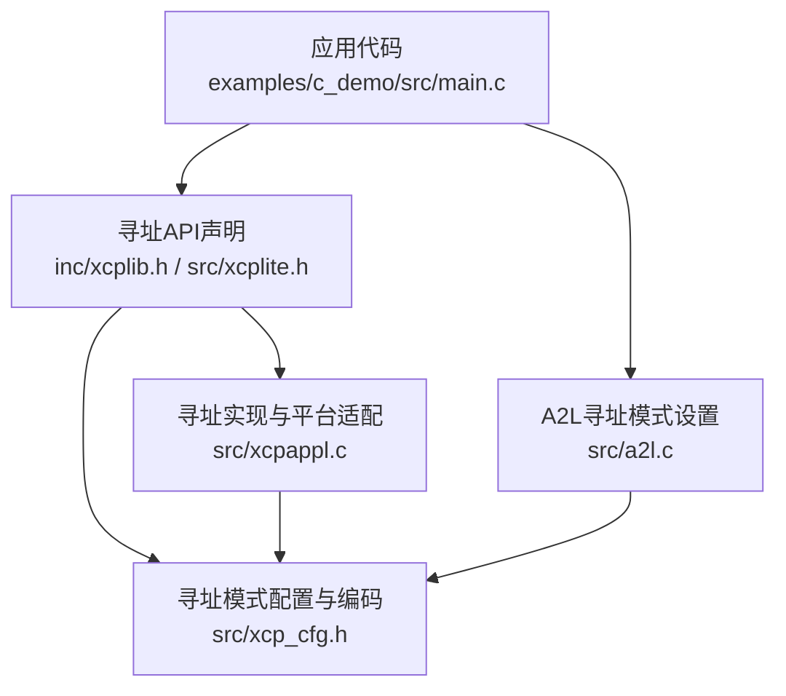
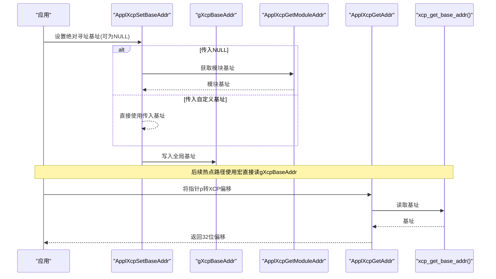
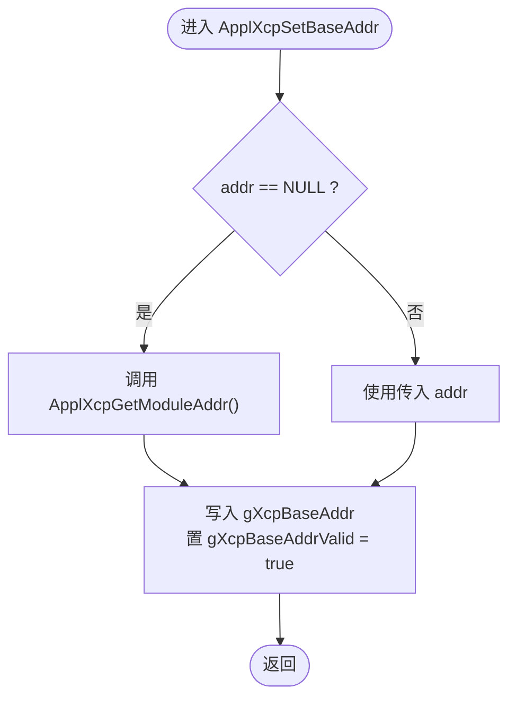
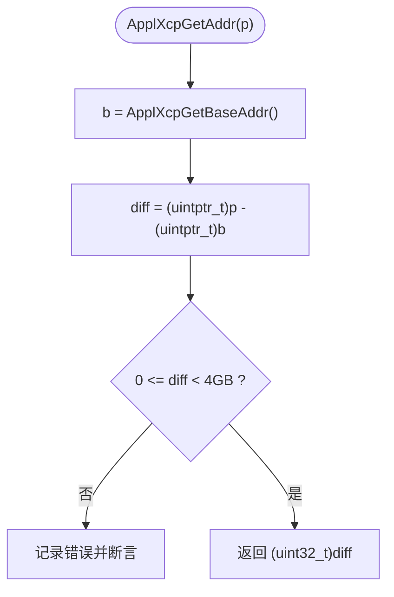
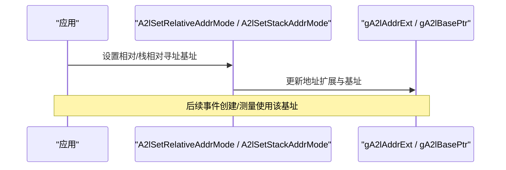
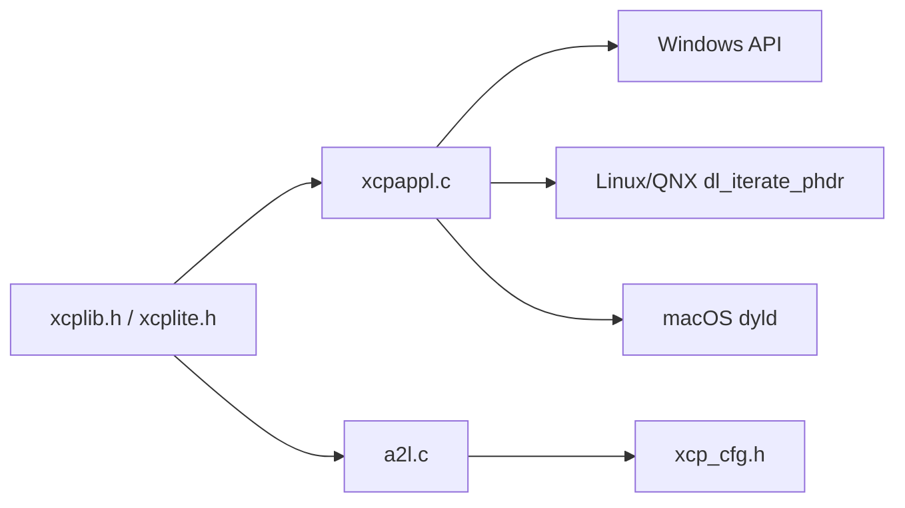

# 寻址模式API

<cite>
**本文引用的文件**
- [xcpappl.c](file://src/xcpappl.c)
- [xcplib.h](file://inc/xcplib.h)
- [xcplite.h](file://src/xcplite.h)
- [xcp_cfg.h](file://src/xcp_cfg.h)
- [a2l.c](file://src/a2l.c)
- [main.c（c_demo）](file://examples/c_demo/src/main.c)
- [TECHNICAL.md](file://docs/TECHNICAL.md)
</cite>

## 目录
1. [简介](#简介)
2. [项目结构](#项目结构)
3. [核心组件](#核心组件)
4. [架构总览](#架构总览)
5. [详细组件分析](#详细组件分析)
6. [依赖关系分析](#依赖关系分析)
7. [性能考量](#性能考量)
8. [故障排查指南](#故障排查指南)
9. [结论](#结论)
10. [附录：使用示例与最佳实践](#附录：使用示例与最佳实践)

## 简介
本文件聚焦于XCPlite中的“寻址模式API”，系统说明绝对寻址、相对寻址与栈相对寻址的实现细节，并详解以下基础地址管理函数与宏：
- ApplXcpGetBaseAddr / ApplXcpSetBaseAddr / ApplXcpGetModuleAddr
- xcp_get_base_addr 宏的作用与优化效果
同时提供不同寻址模式的使用示例、性能对比分析与选择原则、最佳实践。

## 项目结构
围绕寻址模式的实现主要分布在以下位置：
- 应用层地址管理接口与平台相关实现：src/xcpappl.c
- 公共API声明与优化宏：inc/xcplib.h、src/xcplite.h
- 寻址模式配置与编码宏：src/xcp_cfg.h
- A2L侧的相对/动态/自动寻址模式设置：src/a2l.c
- 示例工程调用方式：examples/c_demo/src/main.c
- 技术背景与开销说明：docs/TECHNICAL.md

图表来源
- [xcpappl.c:182-241](file://src/xcpappl.c#L182-L241)
- [xcplib.h:548-556](file://inc/xcplib.h#L548-L556)
- [xcplite.h:514-520](file://src/xcplite.h#L514-L520)
- [xcp_cfg.h:210-228](file://src/xcp_cfg.h#L210-L228)
- [a2l.c:480-514](file://src/a2l.c#L480-L514)

章节来源
- [xcpappl.c:182-241](file://src/xcpappl.c#L182-L241)
- [xcplib.h:548-556](file://inc/xcplib.h#L548-L556)
- [xcplite.h:514-520](file://src/xcplite.h#L514-L520)
- [xcp_cfg.h:210-228](file://src/xcp_cfg.h#L210-L228)
- [a2l.c:480-514](file://src/a2l.c#L480-L514)

## 核心组件
- 绝对寻址基址管理
  - gXcpBaseAddr：全局基址指针，供运行时快速访问
  - ApplXcpSetBaseAddr：设置绝对寻址基址；若传入NULL则回退到模块加载基址
  - ApplXcpGetBaseAddr：返回当前绝对寻址基址；首次调用时按需初始化
  - ApplXcpGetModuleAddr：获取默认模块基址（平台相关）
  - xcp_get_base_addr()：直接读取gXcpBaseAddr的宏，用于避免函数调用开销
- 地址转换
  - ApplXcpGetAddr：将C指针转换为XCP/A2L的32位偏移（基于基址）
  - ApplXcpGetAddrExt：返回绝对寻址的地址扩展字段（支持SHM多应用场景）
- A2L侧相对/动态/自动寻址
  - A2lSetRelativeAddrMode：设置相对寻址（以用户提供的base为基准）
  - A2lSetStackAddrMode：设置栈帧相对寻址（以xcp_get_frame_addr为基准）
  - A2lSetAutoAddrMode：自动判断栈内/栈外变量，选择合适的基址

章节来源
- [xcpappl.c:182-241](file://src/xcpappl.c#L182-L241)
- [xcp_cfg.h:210-228](file://src/xcp_cfg.h#L210-L228)
- [a2l.c:480-514](file://src/a2l.c#L480-L514)

## 架构总览
下图展示了绝对寻址在运行时的关键路径：应用通过ApplXcpSetBaseAddr设定基址，后续通过ApplXcpGetAddr将指针转为XCP偏移，并由xcp_get_base_addr()宏在热点路径中直接读取gXcpBaseAddr以提升性能。

图表来源
- [xcpappl.c:182-241](file://src/xcpappl.c#L182-L241)
- [xcplib.h:548-556](file://inc/xcplib.h#L548-L556)
- [xcplite.h:514-520](file://src/xcplite.h#L514-L520)

## 详细组件分析

### 绝对寻址：ApplXcpGetBaseAddr / ApplXcpSetBaseAddr / ApplXcpGetModuleAddr
- 职责与行为
  - ApplXcpSetBaseAddr：设置绝对寻址基址；当参数为NULL时，内部调用ApplXcpGetModuleAddr获取默认模块基址并设置
  - ApplXcpGetBaseAddr：若已设置有效基址则直接返回；否则调用ApplXcpSetBaseAddr进行一次性初始化
  - ApplXcpGetModuleAddr：平台相关实现，返回模块加载基址（Windows/Linux/QNX/macOS等）
- 数据结构
  - gXcpBaseAddr：全局基址指针，被xcp_get_base_addr()宏直接引用
  - gXcpBaseAddrValid：标记基址是否已初始化
- 复杂度与边界
  - 初始化一次后，查询为O(1)
  - 地址转换ApplXcpGetAddr会检查偏移是否在4GB范围内，越界将触发断言并返回0

图表来源
- [xcpappl.c:182-241](file://src/xcpappl.c#L182-L241)

章节来源
- [xcpappl.c:182-241](file://src/xcpappl.c#L182-L241)

### 地址转换与扩展：ApplXcpGetAddr / ApplXcpGetAddrExt
- 功能
  - ApplXcpGetAddr：计算指针相对于基址的32位偏移；校验范围[0, 4GB)
  - ApplXcpGetAddrExt：返回绝对寻址的地址扩展字段；在共享内存模式下按应用ID区分
- 复杂度
  - O(1) 算术运算与比较
- 错误处理
  - 超出范围时记录错误并断言，保证A2L/XCP地址一致性

图表来源
- [xcpappl.c:199-226](file://src/xcpappl.c#L199-L226)

章节来源
- [xcpappl.c:199-226](file://src/xcpappl.c#L199-L226)

### 相对寻址与栈相对寻址：A2lSetRelativeAddrMode / A2lSetStackAddrMode
- 相对寻址（Dynamic/Relative）
  - 通过A2lSetRelativeAddrMode设置一个用户提供的base指针作为基准，事件内的变量以该base为基准进行相对寻址
  - 适用于堆对象、类成员或任意可寻址区域
- 栈相对寻址
  - 通过A2lSetStackAddrMode设置栈帧基址（通常为xcp_get_frame_addr），事件内局部变量以栈帧为基准
- 自动寻址
  - A2lSetAutoAddrMode根据变量位置在栈内/栈外自动选择合适基址

图表来源
- [a2l.c:480-514](file://src/a2l.c#L480-L514)
- [a2l.c:616-672](file://src/a2l.c#L616-L672)

章节来源
- [a2l.c:480-514](file://src/a2l.c#L480-L514)
- [a2l.c:616-672](file://src/a2l.c#L616-L672)

### xcp_get_base_addr 宏：作用与优化
- 作用
  - 直接暴露gXcpBaseAddr，避免函数调用开销
  - 在热点路径（如DAQ触发、频繁地址转换）中使用，减少分支与调用成本
- 优化效果
  - 将“读取基址”从函数调用降为直接内存访问
  - 结合编译器内联与寄存器缓存，进一步降低延迟

章节来源
- [xcplib.h:548-556](file://inc/xcplib.h#L548-L556)
- [xcplite.h:514-520](file://src/xcplite.h#L514-L520)

## 依赖关系分析
- 模块耦合
  - xcpappl.c 依赖平台API获取模块基址（Windows/Linux/QNX/macOS）
  - a2l.c 依赖xcp_cfg.h中的地址扩展定义与编码宏
  - xcplib.h/xcplite.h 对外暴露API与宏，供应用与A2L侧共同使用
- 外部依赖
  - Windows: GetModuleHandle
  - Linux/QNX: dl_iterate_phdr
  - macOS: _dyld_get_image_header

图表来源
- [xcpappl.c:228-385](file://src/xcpappl.c#L228-L385)
- [a2l.c:480-514](file://src/a2l.c#L480-L514)
- [xcp_cfg.h:210-228](file://src/xcp_cfg.h#L210-L228)

章节来源
- [xcpappl.c:228-385](file://src/xcpappl.c#L228-L385)
- [a2l.c:480-514](file://src/a2l.c#L480-L514)
- [xcp_cfg.h:210-228](file://src/xcp_cfg.h#L210-L228)

## 性能考量
- 绝对寻址
  - 基址初始化一次后，ApplXcpGetBaseAddr为O(1)
  - 使用xcp_get_base_addr()宏避免函数调用，适合高频路径
  - 地址转换ApplXcpGetAddr仅做减法与范围检查，开销极低
- 相对/栈相对寻址
  - 通过A2lSetRelativeAddrMode/A2lSetStackAddrMode设置基址后，事件内变量访问为相对寻址，无需每次解析完整绝对地址
  - 自动寻址可减少手动维护基址的成本，但存在一次判断开销
- 总体开销
  - 参考技术文档对DAQ触发与测量的开销说明，合理选择寻址模式可降低CPU占用与延迟

章节来源
- [TECHNICAL.md:28-52](file://docs/TECHNICAL.md#L28-L52)

## 故障排查指南
- 地址越界
  - 现象：ApplXcpGetAddr断言失败或返回0
  - 原因：指针不在基址+4GB范围内
  - 处理：检查ApplXcpSetBaseAddr是否正确设置；确认数据位于同一模块或映射区域内
- 基址未初始化
  - 现象：首次访问出现异常
  - 原因：未调用ApplXcpSetBaseAddr且默认模块基址不可用
  - 处理：显式调用ApplXcpSetBaseAddr或使用ApplXcpGetModuleAddr结果
- 相对/栈相对寻址无效
  - 现象：事件内变量无法正确解析
  - 原因：未调用A2lSetRelativeAddrMode/A2lSetStackAddrMode或基址不正确
  - 处理：确保在事件创建/触发前设置正确的基址；必要时使用A2lSetAutoAddrMode

章节来源
- [xcpappl.c:199-226](file://src/xcpappl.c#L199-L226)
- [a2l.c:480-514](file://src/a2l.c#L480-L514)

## 结论
- 绝对寻址适合全局数据与跨模块访问，配合xcp_get_base_addr()宏可获得最优性能
- 相对/栈相对寻址适合局部数据与动态对象，简化地址管理并提升灵活性
- 通过合理的基址设置与寻址模式选择，可在保证一致性的前提下显著降低运行时开销

## 附录：使用示例与最佳实践

### 使用示例
- 绝对寻址
  - 设置基址：ApplXcpSetBaseAddr(&app_memory)
  - 重置基址：ApplXcpSetBaseAddr(NULL)
  - 事件触发时使用模块基址：DaqTriggerEventExt(mainloop, ApplXcpGetModuleAddr())
- 相对寻址
  - 设置相对基址：A2lSetRelativeAddrMode(event_name_or_id, i, base_ptr)
- 栈相对寻址
  - 设置栈帧基址：A2lSetStackAddrMode(event_name_or_id, stack_frame)

章节来源
- [main.c（c_demo）:202-205](file://examples/c_demo/src/main.c#L202-L205)
- [main.c（c_demo）:277-282](file://examples/c_demo/src/main.c#L277-L282)
- [main.c（c_demo）:324-324](file://examples/c_demo/src/main.c#L324-L324)

### 性能对比与分析
- 绝对寻址 + xcp_get_base_addr()
  - 优点：零函数调用开销，适合高频DAQ与校准
  - 注意：需确保数据在基址+4GB范围内
- 相对/栈相对寻址
  - 优点：无需全局基址，便于局部与动态对象测量
  - 注意：需在事件上下文设置正确基址；自动寻址有轻微判断开销

### 选择原则与最佳实践
- 全局静态数据、跨模块数据：优先绝对寻址，并使用xcp_get_base_addr()
- 局部变量、函数参数：优先栈相对寻址；复杂对象可使用相对寻址
- 动态分配对象：使用相对寻址，并在事件上下文中设置基址
- 多应用/共享内存：利用ApplXcpGetAddrExt的地址扩展区分应用ID
- 统一基址管理：在应用启动时集中设置基址，避免分散调用导致不一致

章节来源
- [xcp_cfg.h:210-228](file://src/xcp_cfg.h#L210-L228)
- [xcpappl.c:182-241](file://src/xcpappl.c#L182-L241)
- [a2l.c:480-514](file://src/a2l.c#L480-L514)
- [main.c（c_demo）:202-205](file://examples/c_demo/src/main.c#L202-L205)
- [main.c（c_demo）:277-282](file://examples/c_demo/src/main.c#L277-L282)
- [main.c（c_demo）:324-324](file://examples/c_demo/src/main.c#L324-L324)