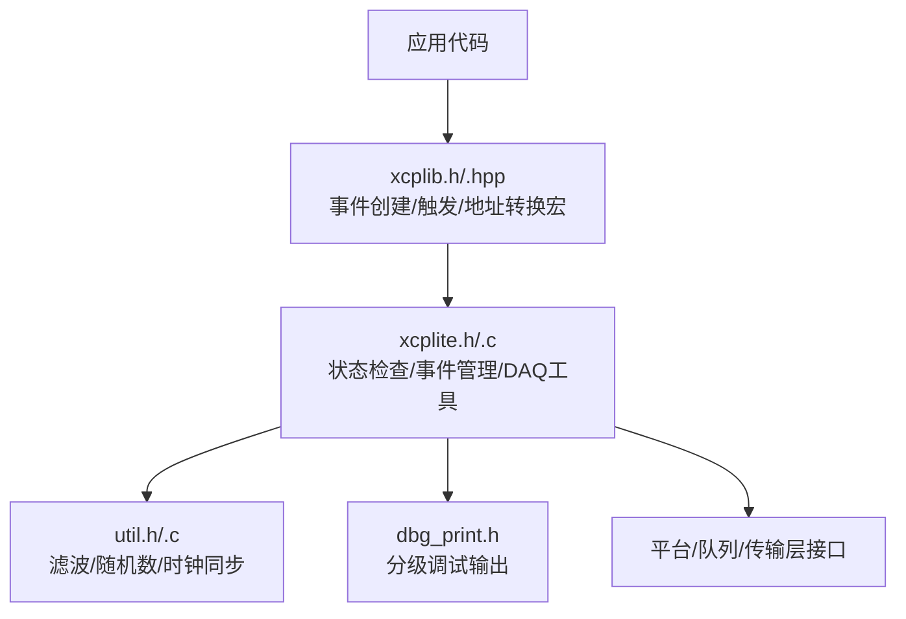
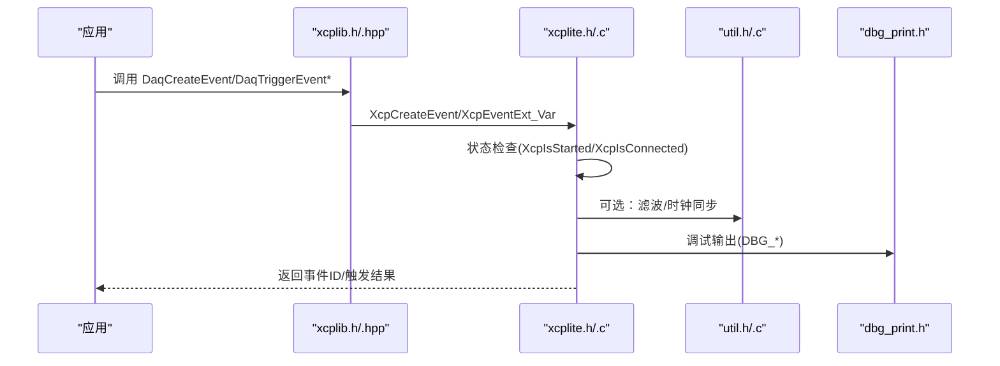
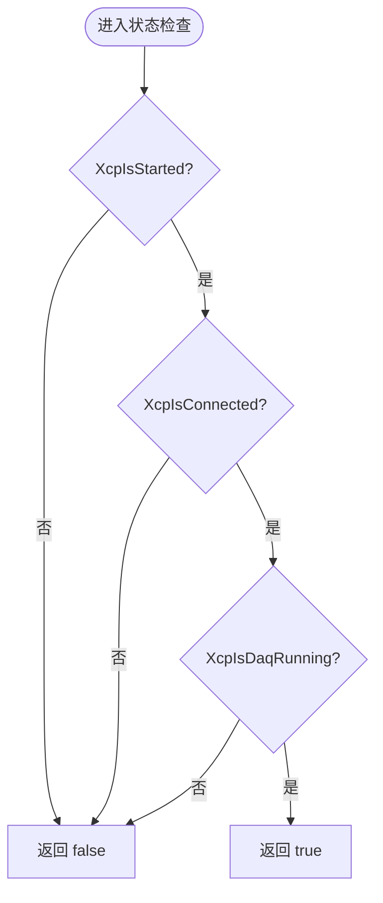
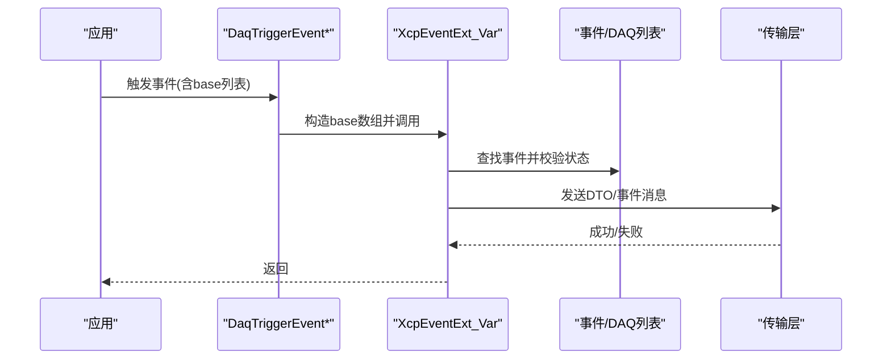
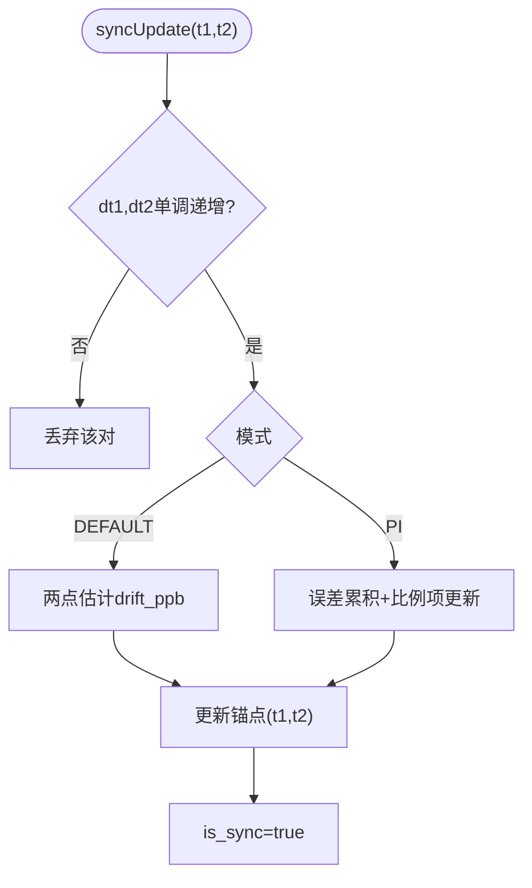
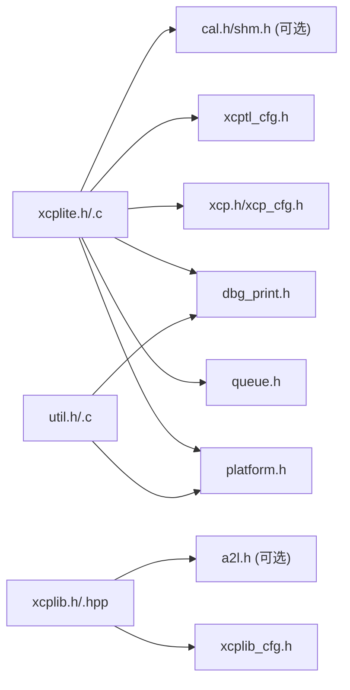

# 工具函数

<cite>
**本文引用的文件**
- [xcplite.h](file://src/xcplite.h)
- [xcplite.c](file://src/xcplite.c)
- [xcplib.h](file://inc/xcplib.h)
- [xcplib.hpp](file://inc/xcplib.hpp)
- [util.h](file://src/util.h)
- [util.c](file://src/util.c)
- [dbg_print.h](file://src/dbg_print.h)
</cite>

## 目录
1. [简介](#简介)
2. [项目结构](#项目结构)
3. [核心组件](#核心组件)
4. [架构总览](#架构总览)
5. [详细组件分析](#详细组件分析)
6. [依赖关系分析](#依赖关系分析)
7. [性能注意事项](#性能注意事项)
8. [故障排查指南](#故障排查指南)
9. [结论](#结论)
10. [附录：常用用法模式与示例路径](#附录：常用用法模式与示例路径)

## 简介
本参考文档聚焦于 XCPlite 的工具函数，包括状态检查、类型转换、调试输出以及通用算法工具（滤波、随机数、时钟同步等）。这些工具函数在整体 XCP 协议栈中承担“轻量、可复用、低开销”的支撑角色，广泛用于事件触发、DAQ 列表管理、校准段访问、日志与诊断。本文档将系统说明各工具函数的职责、使用时机、调用流程、性能特点与注意事项，并提供实际使用示例的路径指引。

## 项目结构
XCPlite 的工具能力主要分布在以下位置：
- 协议层状态与事件工具：src/xcplite.h/.c
- 公共 API 与宏（DAQ/事件/地址转换）：inc/xcplib.h/.hpp
- 通用工具（滤波、随机数、时钟同步）：src/util.h/.c
- 调试打印宏：src/dbg_print.h

图表来源
- [xcplite.h:46-108](file://src/xcplite.h#L46-L108)
- [xcplib.h:238-483](file://inc/xcplib.h#L238-L483)
- [util.h:24-259](file://src/util.h#L24-L259)
- [dbg_print.h:19-222](file://src/dbg_print.h#L19-L222)

章节来源
- [xcplite.h:46-108](file://src/xcplite.h#L46-L108)
- [xcplib.h:238-483](file://inc/xcplib.h#L238-L483)
- [util.h:24-259](file://src/util.h#L24-L259)
- [dbg_print.h:19-222](file://src/dbg_print.h#L19-L222)

## 核心组件
- 状态检查工具
  - XcpIsStarted、XcpIsConnected、XcpIsDaqRunning、XcpGetSessionStatus、XcpIsDaqEventRunning、XcpGetDaqStartTime、XcpGetDaqOverflowCount
  - 作用：快速判断协议层是否已启动、是否已连接、DAQ 是否运行、特定事件是否在运行、溢出计数等。
- 类型与地址转换工具
  - ApplXcpGetBaseAddr、ApplXcpSetBaseAddr、ApplXcpGetModuleAddr、ApplXcpGetAddr、ApplXcpGetAddrExt
  - xcp_get_base_addr() 宏优化访问
  - 作用：在绝对/相对/动态/段/应用地址模式之间进行转换，配合 DAQ/A2L 生成与事件触发。
- 事件与 DAQ 工具
  - XcpCreateEvent、XcpCreateEventInstance、XcpFindEvent、XcpGetEventIndex、XcpGetEventName、XcpGetEventCycleTime、XcpGetEventPriority、XcpEventEnable、XcpCheckDaqLists
  - DaqCreateEvent/DaqTriggerEvent* 系列宏
  - 作用：创建/查找/启用事件；以不同基址触发事件；查询 DAQ 列表状态。
- 调试与日志工具
  - DBG_PRINTF_ERROR/WARNING/INFO/TRACE/DEBUG 等宏
  - XcpSetLogLevel
  - 作用：按级别输出调试信息，支持运行时或编译期固定级别。
- 通用算法工具
  - 中值滤波、移动平均、线性回归、伪随机数、时钟同步器
  - 作用：为时间戳对齐、抖动抑制、统计滤波提供基础能力。

章节来源
- [xcplite.h:90-108](file://src/xcplite.h#L90-L108)
- [xcplite.c:396-429](file://src/xcplite.c#L396-L429)
- [xcplib.h:548-557](file://inc/xcplib.h#L548-L557)
- [xcplib.h:396-483](file://inc/xcplib.h#L396-L483)
- [dbg_print.h:19-222](file://src/dbg_print.h#L19-L222)
- [util.h:24-259](file://src/util.h#L24-L259)

## 架构总览
XCPlite 工具函数围绕“协议层状态 + 事件/DAQ + 地址转换 + 调试/算法”四个维度组织。状态检查用于控制流分支；地址转换确保在不同寻址模式下正确解析指针；事件/DAQ 工具提供高效触发与查询；调试与算法工具贯穿全链路，保障可观测性与稳定性。

图表来源
- [xcplib.h:396-483](file://inc/xcplib.h#L396-L483)
- [xcplite.c:396-429](file://src/xcplite.c#L396-L429)
- [util.c:561-739](file://src/util.c#L561-L739)
- [dbg_print.h:19-222](file://src/dbg_print.h#L19-L222)

## 详细组件分析

### 状态检查工具
- 函数
  - XcpIsStarted：判断协议层是否已启动（会话标志位检查）
  - XcpIsConnected：判断是否已建立连接
  - XcpIsDaqRunning：判断 DAQ 是否运行
  - XcpGetSessionStatus：获取会话状态字
  - XcpIsDaqEventRunning(event)：判断指定事件是否处于运行中的 DAQ 列表
  - XcpGetDaqStartTime / XcpGetDaqOverflowCount：获取 DAQ 起始时间与溢出计数
- 实现要点
  - 通过共享数据结构的 session_status 与原子变量 daq_running 进行读取
  - 在 SHM 模式下通过指针访问共享内存；非 SHM 模式直接访问全局结构
  - 线程安全：读操作使用原子加载或只读别名，避免竞争
- 使用时机
  - 在事件触发前检查 XcpIsStarted/XcpIsConnected，避免无效触发
  - 在后台任务中根据 XcpIsDaqRunning 决定是否处理 DAQ 相关逻辑
  - 监控溢出计数用于性能调优与告警

图表来源
- [xcplite.c:244-256](file://src/xcplite.c#L244-L256)
- [xcplite.c:396-429](file://src/xcplite.c#L396-L429)

章节来源
- [xcplite.c:244-256](file://src/xcplite.c#L244-L256)
- [xcplite.c:396-429](file://src/xcplite.c#L396-L429)

### 类型与地址转换工具
- 函数
  - ApplXcpGetBaseAddr / ApplXcpSetBaseAddr：设置/获取绝对寻址模式的基址
  - ApplXcpGetModuleAddr：获取模块默认基址
  - ApplXcpGetAddr / ApplXcpGetAddrExt：从指针计算绝对 XCP/A2L 地址及扩展
  - xcp_get_base_addr()：优化后的基址访问宏
- 用途
  - 在绝对/相对/动态/段/应用地址模式中，统一转换为内部表示，供 DAQ 与 A2L 生成使用
  - 事件触发时传递正确的 base 地址，使工具能定位局部变量或相对区域
- 性能
  - 宏级内联与直接访问减少函数调用开销
  - 在高频触发路径中优先使用 xcp_get_base_addr() 与事件句柄

章节来源
- [xcplite.h:513-520](file://src/xcplite.h#L513-L520)
- [xcplib.h:548-557](file://inc/xcplib.h#L548-L557)

### 事件与 DAQ 工具
- 函数
  - XcpCreateEvent / XcpCreateEventInstance：创建事件或实例化同名事件
  - XcpFindEvent / XcpGetEventIndex / XcpGetEventName / XcpGetEventCycleTime / XcpGetEventPriority：查询事件属性
  - XcpEventEnable：启用/禁用事件
  - XcpCheckDaqLists：检查 DAQ 列表状态（选中/运行）
- 宏
  - DaqCreateEvent / DaqCreateEventExt：声明并注册事件（链接期/运行期）
  - DaqTriggerEvent / DaqTriggerEventAt / DaqTriggerEventCapture：触发事件，支持时间戳与本地变量捕获
  - DaqEventEnable / DaqEventDisable：便捷启用/禁用
- 流程
  - 创建事件后，通过 XcpEventExt_Var 传入多个 base 地址（帧指针、相对基址、捕获结构体等）
  - 触发路径尽量缓存事件 ID，避免重复查找

图表来源
- [xcplib.h:396-483](file://inc/xcplib.h#L396-L483)
- [xcplib.h:559-643](file://inc/xcplib.h#L559-L643)
- [xcplib.h:644-780](file://inc/xcplib.h#L644-L780)

章节来源
- [xcplib.h:396-483](file://inc/xcplib.h#L396-L483)
- [xcplib.h:559-643](file://inc/xcplib.h#L559-L643)
- [xcplib.h:644-780](file://inc/xcplib.h#L644-L780)

### 调试工具
- 宏
  - DBG_PRINTF_ERROR / DBG_PRINTF_WARNING / DBG_PRINTF3/4/5/6：分级输出错误、警告、信息、跟踪、调试
  - 支持 ANSI 颜色与可选 stderr 输出
- 配置
  - 可通过 OPTION_FIXED_DBG_LEVEL 或 OPTION_DEFAULT_DBG_LEVEL/OPTION_MAX_DBG_LEVEL 控制级别
  - 运行时可通过 XcpSetLogLevel 调整（若未固定级别）
- 使用建议
  - 关键路径仅保留必要日志，避免 I/O 阻塞
  - 使用 DBG_PRINTF3+ 记录详细追踪，生产环境关闭或限制级别

章节来源
- [dbg_print.h:19-222](file://src/dbg_print.h#L19-L222)
- [xcplite.c:349-374](file://src/xcplite.c#L349-L374)

### 通用算法工具
- 中值滤波（tMedianFilter）
  - 维护环形缓冲区与排序索引，O(N) 插入，适合小窗口去噪
  - 适用场景：时间戳异常对、抖动抑制
- 移动平均（tAverageFilter）
  - 滑动窗口求和，O(1) 更新，适合平滑趋势
- 线性回归（tLinregFilter）
  - 滚动窗口拟合斜率与截距，支持比较两条序列差异
- 伪随机数（fast_rand/fast_rand_seed）
  - splitmix64 算法，线程局部状态，无锁，范围归一化采用 Lemire 方法
- 时钟同步器（tClockSynchronizer）
  - 支持 DEFAULT（两点估计）与 PI（比例积分）模式
  - 提供 syncInit/syncUpdate/syncInterpolateT1/syncState/syncSet
  - 支持中值预滤波与抗积分饱和

图表来源
- [util.c:561-739](file://src/util.c#L561-L739)
- [util.h:102-259](file://src/util.h#L102-L259)

章节来源
- [util.c:86-173](file://src/util.c#L86-L173)
- [util.c:175-227](file://src/util.c#L175-L227)
- [util.c:228-501](file://src/util.c#L228-L501)
- [util.c:503-739](file://src/util.c#L503-L739)
- [util.h:24-259](file://src/util.h#L24-L259)

## 依赖关系分析
- xcplite.h/.c 依赖：
  - dbg_print.h：调试输出
  - platform.h：原子量、互斥量、时钟等
  - queue.h：队列句柄
  - xcp.h/xcp_cfg.h：协议定义与配置
  - xcptl_cfg.h：传输层配置
  - cal.h/shm.h：可选功能（校准段、共享内存）
- xcplib.h/.hpp 依赖：
  - xcplib_cfg.h：配置开关
  - a2l.h：A2L 生成（可选）
  - 平台特性宏：编译器/操作系统差异处理
- util.h/.c 依赖：
  - platform.h：平台定义
  - dbg_print.h：调试输出
  - math.h：数学运算

图表来源
- [xcplite.h:17-36](file://src/xcplite.h#L17-L36)
- [xcplib.h:31-35](file://inc/xcplib.h#L31-L35)
- [util.h:16-18](file://src/util.h#L16-L18)

章节来源
- [xcplite.h:17-36](file://src/xcplite.h#L17-L36)
- [xcplib.h:31-35](file://inc/xcplib.h#L31-L35)
- [util.h:16-18](file://src/util.h#L16-L18)

## 性能注意事项
- 状态检查
  - 使用 isStarted/isConnected/isDaqRunning 等宏/函数，避免昂贵操作
  - 在高频路径中缓存事件 ID，减少查找开销
- 事件触发
  - 使用 DaqTriggerEvent_i 或带句柄的变体，避免每次字符串查找
  - 使用 XCP_NO_TAIL_CALL() 防止尾调用优化导致栈帧失效
  - 合理设置事件优先级与周期，避免过载
- 地址转换
  - 优先使用 xcp_get_base_addr() 与 ApplXcpGetAddr/Ext，减少重复计算
- 调试输出
  - 生产环境限制 DBG_LEVEL，避免 printf 阻塞
  - 仅在必要时开启高级别日志（DBG_PRINTF4/5/6）
- 算法工具
  - 中值滤波窗口不宜过大（默认最大31），否则 O(N) 成本上升
  - 移动平均适合平滑但会引入延迟
  - 线性回归需要足够样本（至少2点），注意数值稳定性
  - 时钟同步器 PI 模式需合理设置 kp_shift/ki_shift，避免过冲或收敛慢

[本节为通用指导，不直接分析具体文件]

## 故障排查指南
- 常见问题
  - 事件未触发：检查 XcpIsStarted/XcpIsConnected；确认事件已创建且未被禁用
  - DAQ 溢出：关注 XcpGetDaqOverflowCount，调整队列大小或降低触发频率
  - 地址错误：核对 ApplXcpGetBaseAddr/Addr/Ext 的使用是否正确，确保 base 有效
  - 日志过多：调整 XcpSetLogLevel 或编译期固定级别
- 定位步骤
  - 启用 DBG_PRINTF3+，记录事件创建与触发路径
  - 使用 XcpCheckDaqLists 检查 DAQ 列表状态
  - 利用 util 的时钟同步器验证时间戳单调性与漂移估计
  - 检查共享内存模式下 app_id 与地址扩展匹配

章节来源
- [xcplite.c:396-429](file://src/xcplite.c#L396-L429)
- [dbg_print.h:19-222](file://src/dbg_print.h#L19-L222)
- [util.c:561-739](file://src/util.c#L561-L739)

## 结论
XCPlite 的工具函数提供了稳定、高效的协议层支撑能力。状态检查确保控制流正确；地址转换保证多寻址模式下的兼容性；事件/DAQ 工具简化测量与数据采集；调试与算法工具提升可观测性与鲁棒性。在实际工程中，应结合性能要求与资源约束，选择合适的工具与参数，遵循最佳实践以避免常见陷阱。

[本节为总结，不直接分析具体文件]

## 附录：常用用法模式与示例路径
- 状态检查与事件触发
  - 在触发前检查 XcpIsStarted/XcpIsConnected，再调用 DaqTriggerEvent*
  - 示例路径：examples/hello_xcp/src/main.c、examples/c_demo/src/main.c
- 事件创建与启用
  - 使用 DaqCreateEvent/DaqCreateEventExt 创建事件，DaqEventEnable 启用
  - 示例路径：examples/cpp_demo/src/main.cpp、examples/fetchcontent_example/src/main.c
- 地址转换与捕获
  - 使用 xcp_get_base_addr()/ApplXcpGetAddr/Ext，配合 DaqTriggerEventCapture 捕获局部变量
  - 示例路径：examples/struct_demo/src/main.c、examples/point_cloud_demo/src/main.cpp
- 调试与日志
  - 使用 DBG_PRINTF_ERROR/WARNING/INFO/TRACE/DEBUG，按需调整级别
  - 示例路径：tools/xcpdaemon/src/main.c、examples/multi_thread_demo/src/main.c
- 算法工具
  - 使用中值滤波/移动平均/线性回归处理传感器数据或时间戳
  - 使用时钟同步器对齐硬件/软件时间戳
  - 示例路径：tools/ptptool/src/main.cpp、examples/ptp4l_demo/src/main.cpp

[本节提供路径指引，不直接分析具体文件]