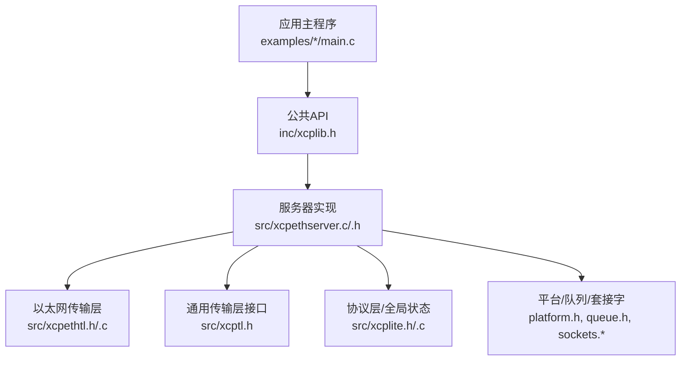
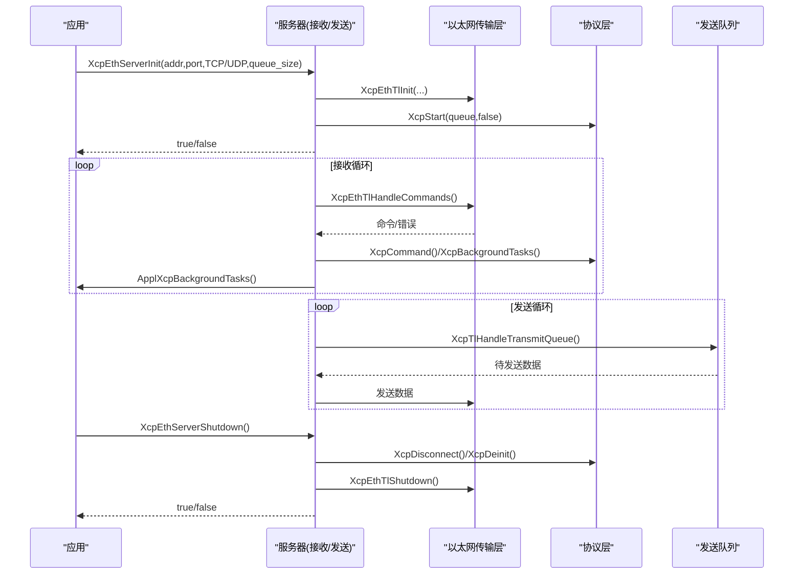
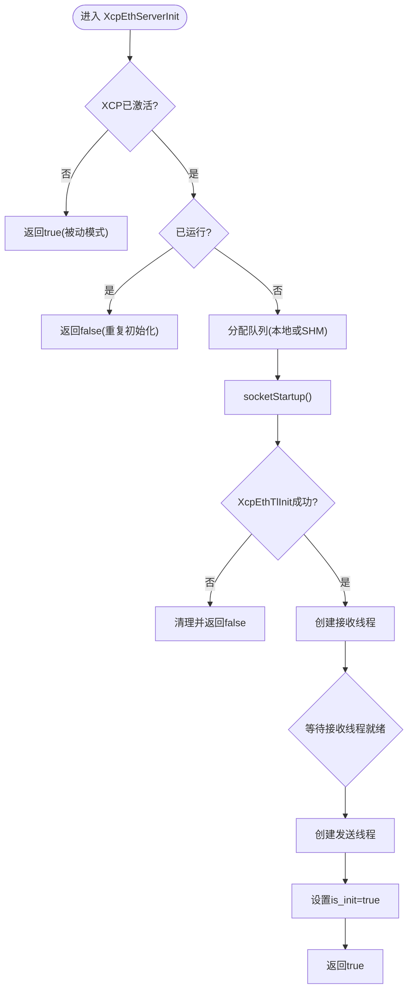
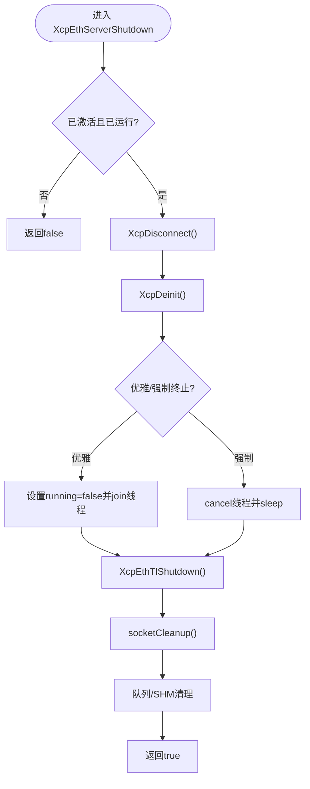
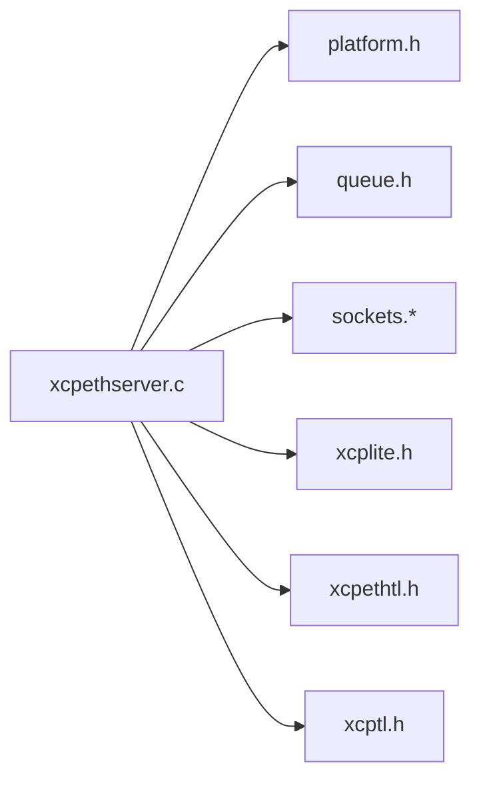

# 服务器管理API

<cite>
**本文引用的文件**
- [xcpethserver.h](file://src/xcpethserver.h)
- [xcpethserver.c](file://src/xcpethserver.c)
- [xcplib.h](file://inc/xcplib.h)
- [xcptl.h](file://src/xcptl.h)
- [xcpethtl.h](file://src/xcpethtl.h)
- [xcplite.h](file://src/xcplite.h)
- [main.c（c_demo）](file://examples/c_demo/src/main.c)
- [main.c（multi_thread_demo）](file://examples/multi_thread_demo/src/main.c)
</cite>

## 目录
1. [简介](#简介)
2. [项目结构](#项目结构)
3. [核心组件](#核心组件)
4. [架构总览](#架构总览)
5. [详细组件分析](#详细组件分析)
6. [依赖关系分析](#依赖关系分析)
7. [性能考虑](#性能考虑)
8. [故障排查指南](#故障排查指南)
9. [结论](#结论)
10. [附录：生命周期与示例流程](#附录生命周期与示例流程)

## 简介
本文件面向XCPlite的以太网服务器管理API，聚焦以下三个核心函数：
- XcpEthServerInit：初始化并启动XCP on Ethernet服务器（支持TCP/UDP、绑定地址、端口、测量队列大小）。
- XcpEthServerShutdown：优雅关闭服务器（断开连接、停止线程、释放资源）。
- XcpEthServerStatus：查询服务器运行状态。

文档将说明参数配置、状态检查、优雅关闭流程、错误处理与异常恢复策略，并提供多线程环境下的最佳实践与性能建议。所有实现细节均基于源码分析，不直接粘贴代码片段，仅以“文件:行号”形式引用关键位置。

## 项目结构
与服务器管理相关的核心文件分布如下：
- 公共API声明：inc/xcplib.h
- 服务器实现：src/xcpethserver.c/.h
- 传输层接口：src/xcpethtl.h/.c（内部）、src/xcptl.h（通用传输层接口）
- 协议层与全局状态：src/xcplite.h/.c（内部）
- 示例用法：examples/c_demo/src/main.c、examples/multi_thread_demo/src/main.c

图表来源
- [xcpethserver.c:279-386](file://src/xcpethserver.c#L279-L386)
- [xcplib.h:39-53](file://inc/xcplib.h#L39-L53)
- [xcpethtl.h:24-27](file://src/xcpethtl.h#L24-L27)
- [xcptl.h:19-25](file://src/xcptl.h#L19-L25)
- [xcplite.h:46-77](file://src/xcplite.h#L46-L77)

章节来源
- [xcplib.h:39-53](file://inc/xcplib.h#L39-L53)
- [xcpethserver.h:19-33](file://src/xcpethserver.h#L19-L33)

## 核心组件
- 服务器管理API
  - XcpEthServerInit：创建并启动接收/发送线程，初始化网络套接字与传输层，分配测量队列（本地或共享内存模式），启动XCP协议层。
  - XcpEthServerShutdown：断开客户端、重置协议层、终止线程、关闭传输层与套接字、清理队列/共享内存。
  - XcpEthServerStatus：返回服务器是否处于运行中（包含线程状态与激活状态判断）。
- 传输层
  - XcpEthTlInit/XcpEthTlHandleCommands/XcpEthTlShutdown：负责TCP/UDP监听、命令收发、统计信息。
  - XcpTlHandleTransmitQueue：从发送队列取出已提交消息进行发送。
- 协议层
  - XcpStart/XcpDisconnect/XcpDeinit：启动/停止协议事件处理、会话管理、DAQ等。
  - XcpBackgroundTasks/ApplXcpBackgroundTasks：周期性后台任务（校准发布、时钟溢出处理等）。

章节来源
- [xcpethserver.c:279-386](file://src/xcpethserver.c#L279-L386)
- [xcpethserver.c:390-463](file://src/xcpethserver.c#L390-L463)
- [xcpethserver.c:469-586](file://src/xcpethserver.c#L469-L586)
- [xcpethtl.h:24-27](file://src/xcpethtl.h#L24-L27)
- [xcptl.h:19-25](file://src/xcptl.h#L19-L25)
- [xcplite.h:46-77](file://src/xcplite.h#L46-L77)

## 架构总览
服务器由两个主要线程构成：
- 接收线程：阻塞等待XCP命令，调用传输层处理命令，执行协议层与应用的后台任务。
- 发送线程：循环处理发送队列中的已提交数据，通过传输层发出。

图表来源
- [xcpethserver.c:279-386](file://src/xcpethserver.c#L279-L386)
- [xcpethserver.c:469-586](file://src/xcpethserver.c#L469-L586)
- [xcpethtl.h:24-27](file://src/xcpethtl.h#L24-L27)
- [xcptl.h:19-25](file://src/xcptl.h#L19-L25)
- [xcplite.h:46-77](file://src/xcplite.h#L46-L77)

## 详细组件分析

### XcpEthServerInit：初始化与启动
- 前置条件：必须先调用XcpInit激活XCP单例；若未激活则忽略并返回成功（被动模式）。
- 重复初始化保护：若已运行则返回失败。
- 队列分配：
  - 非SHM模式：使用本地队列。
  - SHM模式：在共享内存中创建/附加队列，并在非服务器进程中启动后台线程维护A2L与存活计数。
- 传输层初始化：socketStartup后调用XcpEthTlInit绑定地址、端口、选择TCP/UDP，并传入发送队列句柄。
- 线程创建：
  - 先创建接收线程，设置其running标志，必要时自旋等待（FreeRTOS下跳过以避免死锁）。
  - 再创建发送线程。
- 成功标志：gXcpServer.is_init置位。

图表来源
- [xcpethserver.c:279-386](file://src/xcpethserver.c#L279-L386)

章节来源
- [xcpethserver.c:279-386](file://src/xcpethserver.c#L279-L386)
- [xcplib.h:39-53](file://inc/xcplib.h#L39-L53)

### XcpEthServerShutdown：优雅关闭
- 前置检查：必须已激活且已运行，否则返回失败。
- 断开与重置：
  - XcpDisconnect：断开当前会话、停止DAQ、刷新队列与待发布校准。
  - XcpDeinit：重置协议层（SHM模式下注销应用）。
- 线程终止：
  - 默认优雅模式：设置running=false并join线程。
  - 强制模式（编译选项开启时）：cancel线程并短暂sleep等待。
- 资源释放：
  - XcpEthTlShutdown关闭传输层。
  - socketCleanup释放套接字。
  - 清理队列或解除共享内存映射。
- 返回true表示完成。

图表来源
- [xcpethserver.c:390-463](file://src/xcpethserver.c#L390-L463)

章节来源
- [xcpethserver.c:390-463](file://src/xcpethserver.c#L390-L463)

### XcpEthServerStatus：状态检查
- 若XCP未激活，返回true（被动模式视为可用）。
- SHM模式下，若非服务器进程，则返回SHM后台线程状态。
- 正常模式：当is_init为真且接收/发送线程均运行时返回true。

章节来源
- [xcpethserver.c:265-276](file://src/xcpethserver.c#L265-L276)
- [xcplib.h:51-53](file://inc/xcplib.h#L51-L53)

### 接收线程：命令处理与后台任务
- 启动协议层：XcpStart(queue,false)。
- 循环：
  - 调用XcpEthTlHandleCommands阻塞等待命令（带超时以便处理后台任务）。
  - 调用XcpBackgroundTasks处理校准发布等。
  - 调用ApplXcpBackgroundTasks处理用户自定义任务（如时钟溢出）。
  - SHM模式：更新存活计数、轮询A2L finalize请求。
  - 每秒统计调试信息（循环次数、慢处理告警等）。

章节来源
- [xcpethserver.c:469-543](file://src/xcpethserver.c#L469-L543)

### 发送线程：队列处理与发送
- 循环：
  - 调用XcpTlHandleTransmitQueue处理发送队列。
  - 错误时记录日志并退出。
  - 调试模式下统计每秒循环次数。

章节来源
- [xcpethserver.c:545-586](file://src/xcpethserver.c#L545-L586)

### 传输层：以太网命令处理
- XcpEthTlInit：根据use_tcp选择TCP/UDP，绑定地址与端口，关联发送队列。
- XcpEthTlHandleCommands：接收并解析XCP命令，交由协议层处理。
- XcpEthTlShutdown：释放传输层资源。

章节来源
- [xcpethtl.h:24-27](file://src/xcpethtl.h#L24-L27)

### 通用传输层接口
- XcpTlHandleTransmitQueue：从队列取数据并通过底层发送。
- XcpTlWaitForTransmitQueueEmpty：等待队列清空（用于关闭场景）。
- XcpTlSendCrm：发送单个CRM响应包。
- XcpTlGetCtr：获取下一个消息计数器。

章节来源
- [xcptl.h:19-25](file://src/xcptl.h#L19-L25)

## 依赖关系分析
- 服务器模块依赖：
  - 平台抽象：platform.h（线程、时间、原子操作）。
  - 队列：queue.h（本地或共享内存队列）。
  - 套接字：sockets.*（网络初始化与清理）。
  - 协议层：xcplite.h（XcpStart/Disconnect/Deinit、后台任务）。
  - 传输层：xcpethtl.h（以太网具体实现）、xcptl.h（通用接口）。
- 耦合与内聚：
  - 服务器模块高内聚：封装了线程管理、队列、传输层与协议层的协调。
  - 低耦合：通过标准接口（XcpTl*、XcpEthTl*）与平台抽象解耦。

图表来源
- [xcpethserver.c:21-38](file://src/xcpethserver.c#L21-L38)

章节来源
- [xcpethserver.c:21-38](file://src/xcpethserver.c#L21-L38)

## 性能考虑
- 队列大小：measurement_queue_size影响吞吐与延迟。过大增加内存占用，过小可能导致丢包或溢出。示例中提供不同规模配置（如32KB、1MB）。
- 线程栈：测试模式下可监控栈水位，避免栈溢出。
- 后台任务频率：接收线程每周期调用XcpBackgroundTasks与ApplXcpBackgroundTasks，确保校准发布与用户任务及时执行。
- 传输层效率：XcpEthTlHandleCommands阻塞等待，减少CPU空转；发送线程批量处理队列，降低系统调用开销。
- SHM模式：多进程共享队列，适合复杂ECU架构；注意队列大小一致性与初始化顺序。

[本节为通用指导，不直接分析具体文件]

## 故障排查指南
- 常见错误与定位：
  - 未激活XCP：XcpEthServerInit会忽略并返回成功，但不会真正启动服务。需先调用XcpInit。
  - 重复初始化：返回false，检查是否已调用过Init或未正确Shutdown。
  - 套接字初始化失败：检查网络接口与权限。
  - 传输层初始化失败：检查地址/端口是否被占用、协议支持（TCP/UDP）。
  - 线程无法终止：优雅模式下确保running标志被设置；强制模式需确认cancel语义。
- 调试手段：
  - 日志级别：通过XcpSetLogLevel调整输出。
  - 统计信息：启用TEST_ENABLE_DBG_METRICS后可打印传输层统计。
  - 栈水位：启用TEST_STACK_SIZE可获取线程栈使用情况。
- 异常恢复策略：
  - 捕获Init/Shutdown返回值，必要时重试或降级到被动模式。
  - 在信号处理中调用XcpDisconnect与XcpEthServerShutdown保证资源释放。

章节来源
- [xcpethserver.c:279-386](file://src/xcpethserver.c#L279-L386)
- [xcpethserver.c:390-463](file://src/xcpethserver.c#L390-L463)
- [xcplib.h:39-53](file://inc/xcplib.h#L39-L53)

## 结论
XCPlite的以太网服务器管理API提供了清晰的初始化、状态查询与优雅关闭能力，支持TCP/UDP与灵活队列配置。通过分离的接收/发送线程与传输层抽象，实现了高内聚、低耦合的架构。结合示例代码，可在单线程或多线程环境中安全地管理服务器生命周期，并通过日志与统计信息进行性能调优与问题定位。

[本节为总结性内容，不直接分析具体文件]

## 附录：生命周期与示例流程
- 典型生命周期：
  1) XcpInit激活XCP。
  2) XcpEthServerInit启动服务器。
  3) 业务循环中触发测量事件、访问校准段。
  4) 退出前调用XcpDisconnect、A2lFinalize、XcpEthServerShutdown。
- 示例参考：
  - c_demo：展示基本服务器启动、A2L生成、校准段与测量事件。
  - multi_thread_demo：展示多线程环境下服务器管理与事件触发。

章节来源
- [main.c（c_demo）:139-156](file://examples/c_demo/src/main.c#L139-L156)
- [main.c（c_demo）:372-375](file://examples/c_demo/src/main.c#L372-L375)
- [main.c（multi_thread_demo）:352-367](file://examples/multi_thread_demo/src/main.c#L352-L367)
- [main.c（multi_thread_demo）:409-412](file://examples/multi_thread_demo/src/main.c#L409-L412)