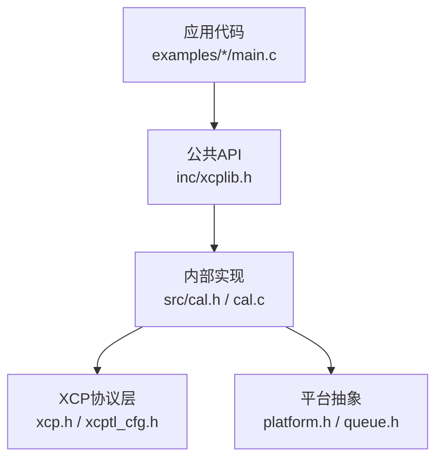
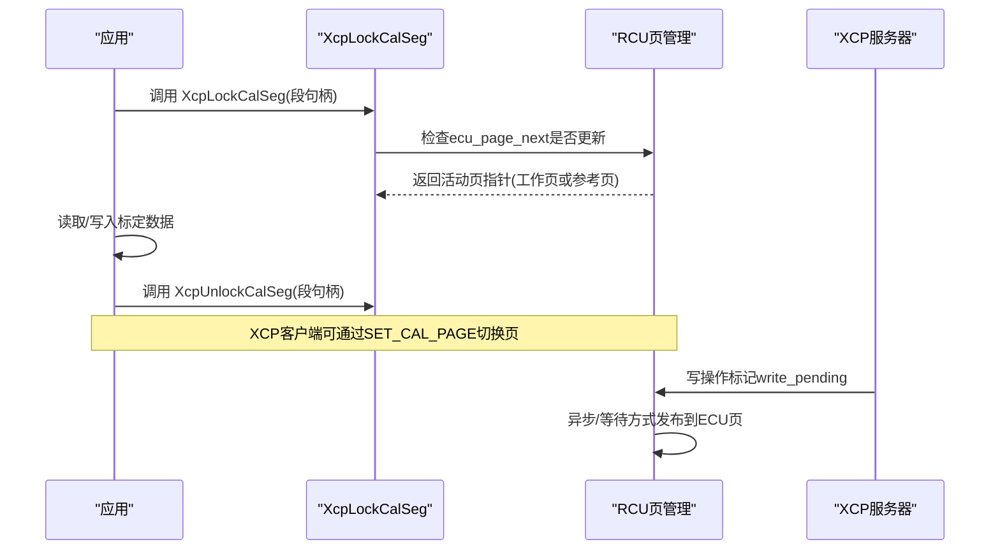
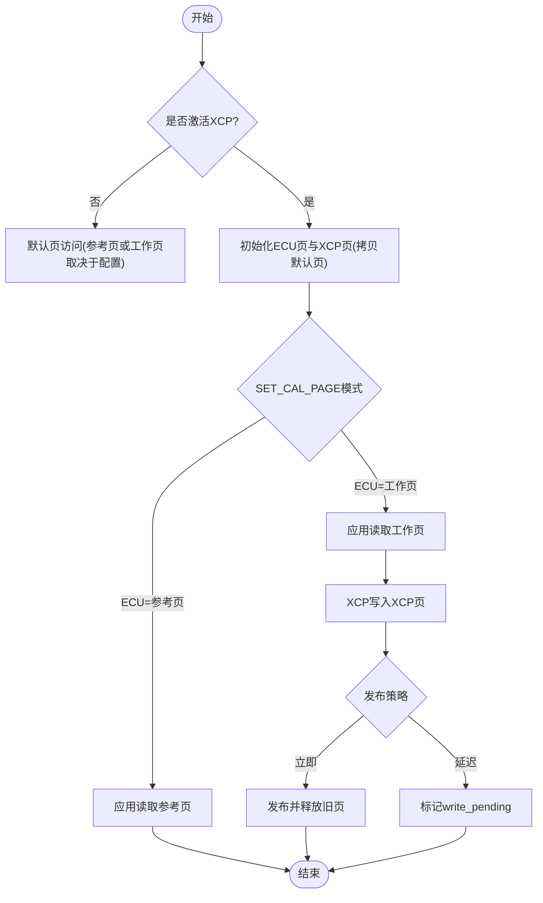
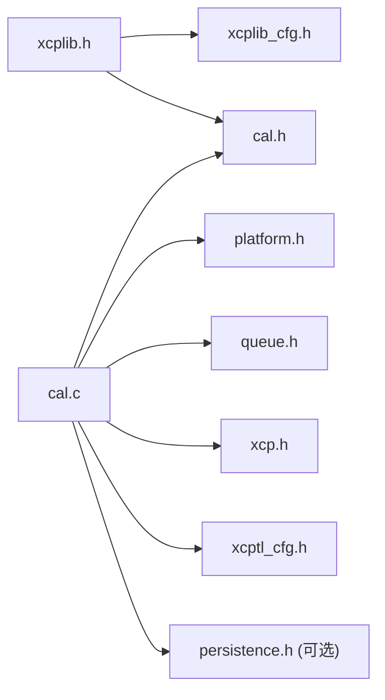
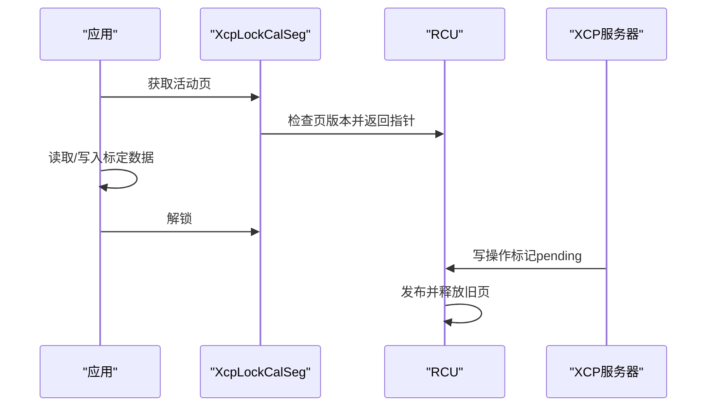

# 校准段创建

<cite>
**本文引用的文件**
- [xcplib.h](file://inc/xcplib.h)
- [cal.h](file://src/cal.h)
- [cal.c](file://src/cal.c)
- [c_demo main.c](file://examples/c_demo/src/main.c)
- [hello_xcp main.c](file://examples/hello_xcp/src/main.c)
- [no_a2l_demo main.c](file://examples/no_a2l_demo/src/main.c)
</cite>

## 目录
1. [简介](#简介)
2. [项目结构](#项目结构)
3. [核心组件](#核心组件)
4. [架构总览](#架构总览)
5. [详细组件分析](#详细组件分析)
6. [依赖关系分析](#依赖关系分析)
7. [性能考虑](#性能考虑)
8. [故障排查指南](#故障排查指南)
9. [结论](#结论)
10. [附录：代码示例与最佳实践](#附录代码示例与最佳实践)

## 简介
本章节面向使用 XCPlite 进行标定（Calibration）的开发者，系统说明校准段的创建与管理 API，重点对比 XcpCreateCalSeg 与 XcpCreateCalBlk 的差异、参数与返回值、错误条件；解释工作页（Working Page）与参考页（Reference Page）的概念及页切换机制；并提供静态声明与动态创建两种方式的完整示例路径，以及 CalSegDecl/CalBlkDecl 宏的使用方法。

## 项目结构
- 公共 API 定义位于 inc/xcplib.h，提供 XcpCreateCalSeg、XcpCreateCalBlk、锁定/解锁宏等接口。
- 内部实现位于 src/cal.h 与 src/cal.c，包含校准段数据结构、内存池、页管理、原子发布与持久化相关逻辑。
- 示例工程展示了不同场景下的用法：
  - 动态创建：examples/c_demo/src/main.c、examples/hello_xcp/src/main.c
  - 静态声明：examples/no_a2l_demo/src/main.c

图表来源
- [xcplib.h:61-139](file://inc/xcplib.h#L61-L139)
- [cal.h:152-175](file://src/cal.h#L152-L175)
- [cal.c:375-393](file://src/cal.c#L375-L393)

章节来源
- [xcplib.h:61-139](file://inc/xcplib.h#L61-L139)
- [cal.h:152-175](file://src/cal.h#L152-L175)
- [cal.c:375-393](file://src/cal.c#L375-L393)

## 核心组件
- 校准段句柄类型 tXcpCalSegIndex 与未定义常量 XCP_UNDEFINED_CALSEG。
- 校准段描述符 tXcpCalSegDescriptor，用于链接器节区预注册。
- 校准段头 tXcpCalSegHeader，维护页偏移、访问控制、锁计数、持久化标志等。
- 校准段列表 tXcpCalSegList，维护索引表、内存池、写入延迟标志等。
- 关键函数：
  - XcpCreateCalSeg：创建带 MEMORY_SEGMENT 的校准段（支持 XCP 页面操作）。
  - XcpCreateCalBlk：创建无 MEMORY_SEGMENT 的校准块（不生成 A2L 中的 MEMORY_SEGMENT）。
  - XcpLockCalSeg/XcpUnlockCalSeg：线程安全地获取当前活动页指针并加/解锁。
  - XcpGetCalSegNumber：返回段号（校准块返回未定义号）。
  - XcpRegisterSectionCalSegs：扫描 xcp_cals 节区完成预注册。

章节来源
- [xcplib.h:61-139](file://inc/xcplib.h#L61-L139)
- [cal.h:86-175](file://src/cal.h#L86-L175)
- [cal.c:122-180](file://src/cal.c#L122-L180)
- [cal.c:375-393](file://src/cal.c#L375-L393)
- [cal.c:623-689](file://src/cal.c#L623-L689)

## 架构总览
XCPlite 通过“双页+RCU”机制实现无锁且一致的标定数据访问：
- 参考页（Reference Page）：默认值或持久化的只读页（通常为 FLASH）。
- 工作页（Working Page）：可被 XCP 修改的 RAM 页。
- 页切换：XCP 客户端通过 SET_CAL_PAGE 指定 ECU/XCP 访问哪一页；应用侧通过 XcpLockCalSeg 获得当前活动页指针，保证一致性。
- 原子发布：写操作先写入当前 XCP 页，随后在合适时机将旧页释放为空闲页，并将新页作为下一版本供 ECU 读取。

图表来源
- [cal.c:623-689](file://src/cal.c#L623-L689)
- [cal.c:723-767](file://src/cal.c#L723-L767)
- [cal.c:971-1001](file://src/cal.c#L971-L1001)

## 详细组件分析

### XcpCreateCalSeg 与 XcpCreateCalBlk 的区别与使用场景
- XcpCreateCalSeg
  - 用途：创建具有 MEMORY_SEGMENT 的校准段，可在 A2L 中生成 MEMORY_SEGMENT 条目，支持 XCP 的 GET/SET/COPY CAL_PAGE 等能力。
  - 参数：name（段名）、default_page（默认/参考页指针）、size（字节数）。
  - 返回值：成功返回句柄；失败返回 XCP_UNDEFINED_CALSEG（如未初始化、内存不足、名称重复、尺寸不一致）。
  - 典型场景：需要 XCP 工具直接对整段进行页切换、校验和计算、复制参考页到工作页等高级功能。
- XcpCreateCalBlk
  - 用途：创建无 MEMORY_SEGMENT 的校准块，不在 A2L 中生成 MEMORY_SEGMENT；仍提供一致且线程安全的访问。
  - 参数：同 XcpCreateCalSeg。
  - 返回值：同上。
  - 典型场景：仅需一致访问与简单读写，不需要复杂 XCP 页管理能力时，开销更小。

章节来源
- [xcplib.h:70-88](file://inc/xcplib.h#L70-L88)
- [cal.c:375-393](file://src/cal.c#L375-L393)
- [cal.c:427-503](file://src/cal.c#L427-L503)

### 工作页与参考页概念及页切换机制
- 参考页：初始值或从二进制持久化文件加载的只读页。
- 工作页：XCP 写入的目标页；ECU 运行时通常访问工作页以获得最新标定值。
- 页切换：
  - XCP 客户端通过 SET_CAL_PAGE 设置 ECU/XCP 访问的工作页或参考页。
  - 应用侧通过 XcpLockCalSeg 获取当前活动页指针，确保读取一致性。
  - 写操作通过 XcpCalSegWriteMemory 写入当前 XCP 页，并在发布阶段将旧页释放为新空闲页，同时将新页设为下一版本供 ECU 读取。
- 默认行为：
  - 若启用 XCP_START_ON_REFERENCE_PAGE，则初始访问参考页；否则默认访问工作页。

图表来源
- [cal.c:509-615](file://src/cal.c#L509-L615)
- [cal.c:723-767](file://src/cal.c#L723-L767)
- [cal.c:971-1001](file://src/cal.c#L971-L1001)

章节来源
- [cal.c:509-615](file://src/cal.c#L509-L615)
- [cal.c:723-767](file://src/cal.c#L723-L767)
- [cal.c:971-1001](file://src/cal.c#L971-L1001)

### 锁定与解锁：XcpLockCalSeg/XcpUnlockCalSeg
- XcpLockCalSeg
  - 作用：获取当前活动页指针（工作页或参考页），内部会处理页版本更新与空闲页回收。
  - 线程安全：支持递归锁定，无锁等待（wait-free）。
  - 返回：指向活动页的 const 指针，直到解锁前有效。
- XcpUnlockCalSeg
  - 作用：递减锁计数，允许其他线程继续访问。
  - 注意：必须在同一线程内配对调用。

章节来源
- [cal.c:623-689](file://src/cal.c#L623-L689)

### 预注册与段查找
- XcpRegisterSectionCalSegs
  - 作用：扫描链接器节区 xcp_cals，自动创建所有声明的校准段/块，避免在首次使用前遗漏初始化。
  - 行为：若已存在同名段，则复用其句柄；否则创建并记录句柄到描述符的 indexp。
- XcpFindCalSeg
  - 作用：按名称查找段句柄；在共享内存模式下仅搜索当前进程内的段。

章节来源
- [cal.c:122-180](file://src/cal.c#L122-L180)
- [cal.c:236-262](file://src/cal.c#L236-L262)

### 错误条件与返回值处理
- 常见错误：
  - XCP 未激活：返回 XCP_UNDEFINED_CALSEG。
  - 内存池耗尽：分配失败，返回 XCP_UNDEFINED_CALSEG。
  - 名称重复：返回已有句柄（不会重复创建）。
  - 尺寸不一致：返回 XCP_UNDEFINED_CALSEG。
  - 非法索引或越界访问：返回 CRC_ACCESS_DENIED 或 CRC_OUT_OF_RANGE。
- 建议处理：
  - 创建后检查返回值是否为 XCP_UNDEFINED_CALSEG。
  - 访问前验证索引范围。
  - 写操作后根据返回码判断是否需要重试或等待发布。

章节来源
- [cal.c:375-393](file://src/cal.c#L375-L393)
- [cal.c:427-503](file://src/cal.c#L427-L503)
- [cal.c:698-717](file://src/cal.c#L698-L717)
- [cal.c:803-844](file://src/cal.c#L803-L844)

## 依赖关系分析
- 模块耦合：
  - xcplib.h 暴露公共 API，依赖 xcplib_cfg.h 的配置选项。
  - cal.c 依赖 platform.h（原子/互斥）、queue.h（队列）、xcp.h（协议定义）、xcptl_cfg.h（传输层配置）。
- 外部集成点：
  - 链接器节区 xcp_cals（ELF/Mach-O）用于预注册。
  - 可选持久化模块 persistence.h（冻结/加载）。
- 循环依赖：
  - 未见明显循环依赖；cal.c 通过 gXcpData/gXcpLocalData 访问全局状态。

图表来源
- [xcplib.h:31-35](file://inc/xcplib.h#L31-L35)
- [cal.c:13-38](file://src/cal.c#L13-L38)

章节来源
- [xcplib.h:31-35](file://inc/xcplib.h#L31-L35)
- [cal.c:13-38](file://src/cal.c#L13-L38)

## 性能考虑
- 无锁访问：XcpLockCalSeg 采用原子操作与RCU语义，避免互斥锁竞争。
- 对齐优化：页大小按 XCP_CALPAGE_ALIGNMENT 对齐，提升缓存与原子访问效率。
- 延迟发布：支持懒发布（XCP_ENABLE_CALSEG_LAZY_WRITE）以减少阻塞；或在原子事务中批量发布。
- 内存池：使用 bump allocator 减少碎片与分配开销。

[本节为通用指导，不直接分析具体文件]

## 故障排查指南
- 症状：创建失败返回 XCP_UNDEFINED_CALSEG
  - 检查 XCP 是否已激活（isActivated）。
  - 检查内存池是否耗尽（日志提示 pool exhausted）。
  - 检查名称是否重复或尺寸是否一致。
- 症状：读/写返回 CRC_ACCESS_DENIED
  - 检查索引是否有效、偏移是否越界。
  - 确认当前访问页是否允许写（参考页不可写）。
- 症状：标定值不一致
  - 确保在访问前后正确调用 XcpLockCalSeg/XcpUnlockCalSeg。
  - 检查是否启用了正确的页模式（工作页/参考页）。

章节来源
- [cal.c:375-393](file://src/cal.c#L375-L393)
- [cal.c:698-717](file://src/cal.c#L698-L717)
- [cal.c:803-844](file://src/cal.c#L803-L844)

## 结论
- XcpCreateCalSeg 适用于需要完整 XCP 页管理与 A2L MEMORY_SEGMENT 的场景；XcpCreateCalBlk 适用于轻量级、无需复杂页管理的场景。
- 工作页与参考页分离提供了安全、一致且高效的标定数据访问模型；配合 XcpLockCalSeg 可实现无锁、可重入的访问。
- 推荐使用 CalSegDecl/CalBlkDecl 进行静态声明，或通过 CalSegCreate/CalBlkCreate 进行动态自包含创建；两者均利用链接器节区实现预注册与幂等创建。

[本节为总结性内容，不直接分析具体文件]

## 附录：代码示例与最佳实践

### 动态创建校准段（XcpCreateCalSeg）
- 示例路径：
  - [c_demo main.c:158-163](file://examples/c_demo/src/main.c#L158-L163)
  - [hello_xcp main.c:175-186](file://examples/hello_xcp/src/main.c#L175-L186)
- 要点：
  - 创建后检查返回值是否为 XCP_UNDEFINED_CALSEG。
  - 使用 A2lSetSegmentAddrMode 将变量注册到该段，以便页切换生效。
  - 在主循环中使用 XcpLockCalSeg/XcpUnlockCalSeg 访问标定数据。

章节来源
- [c_demo main.c:158-163](file://examples/c_demo/src/main.c#L158-L163)
- [hello_xcp main.c:175-186](file://examples/hello_xcp/src/main.c#L175-L186)

### 静态声明校准段（CalSegDecl/CalBlkDecl）
- 示例路径：
  - [no_a2l_demo main.c:76-98](file://examples/no_a2l_demo/src/main.c#L76-L98)
- 要点：
  - 在文件/全局作用域使用 CalSegDecl(params) 声明段，编译器将其放入 xcp_cals 节区。
  - XcpInit 后会由 XcpRegisterSectionCalSegs 自动预注册，无需显式调用创建函数。
  - 可使用 CalSegLock/CalSegUnlock 宏便捷访问。

章节来源
- [no_a2l_demo main.c:76-98](file://examples/no_a2l_demo/src/main.c#L76-L98)

### 动态自包含创建（CalSegCreate/CalBlkCreate）
- 宏行为：
  - 在调用点同时声明描述符并立即尝试创建段；若已存在则复用句柄。
  - 适用于函数体内或循环中创建，不依赖 XcpInit 的节区扫描顺序。
- 适用场景：
  - 需要在运行时按需创建多个实例，且希望保持幂等与线程安全。

章节来源
- [xcplib.h:198-223](file://inc/xcplib.h#L198-L223)

### 页切换与一致性访问流程
- 步骤：
  - 通过 XcpLockCalSeg 获取活动页指针。
  - 读取/写入标定数据。
  - 通过 XcpUnlockCalSeg 释放锁。
  - XCP 客户端通过 SET_CAL_PAGE 切换工作页/参考页。
  - 写操作由 XcpCalSegWriteMemory 写入当前 XCP 页，并在发布阶段同步到 ECU 页。

图表来源
- [cal.c:623-689](file://src/cal.c#L623-L689)
- [cal.c:723-767](file://src/cal.c#L723-L767)

章节来源
- [cal.c:623-689](file://src/cal.c#L623-L689)
- [cal.c:723-767](file://src/cal.c#L723-L767)

### 最佳实践
- 始终检查创建返回值，避免使用未初始化的句柄。
- 在多线程环境中，务必使用 XcpLockCalSeg/XcpUnlockCalSeg 保护标定数据访问。
- 对于需要 XCP 工具直接操作的段，优先使用 XcpCreateCalSeg；否则使用 XcpCreateCalBlk 降低开销。
- 使用 CalSegDecl/CalBlkDecl 进行静态声明，简化初始化流程；如需动态创建，使用 CalSegCreate/CalBlkCreate。
- 合理配置页模式（工作页/参考页）以满足实时性与一致性需求。

[本节为通用指导，不直接分析具体文件]