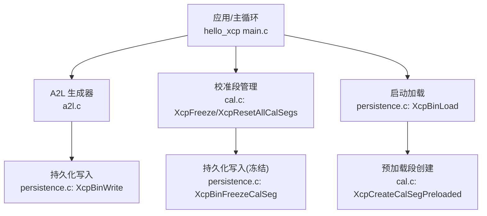
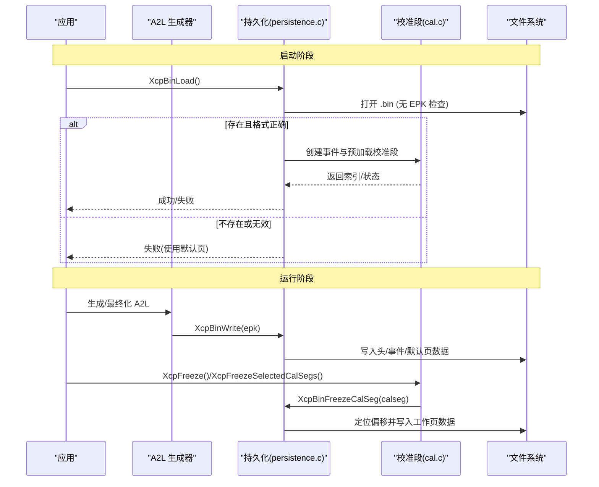
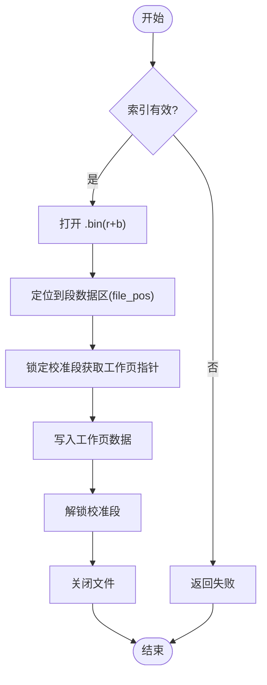
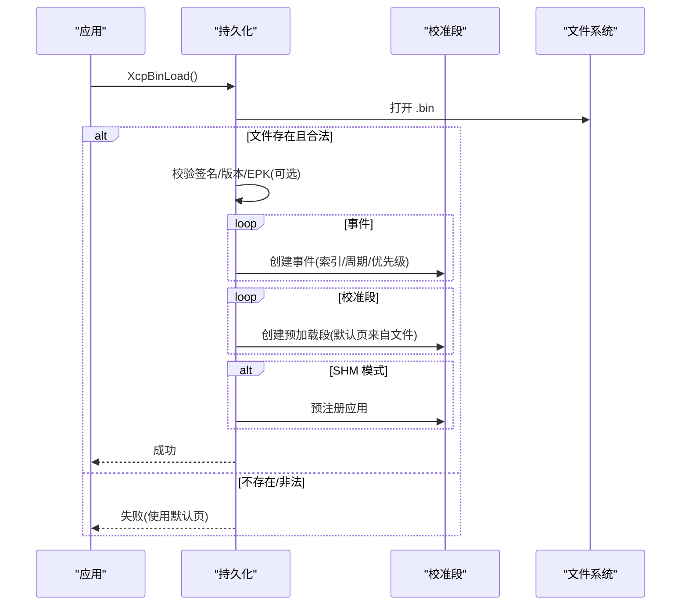
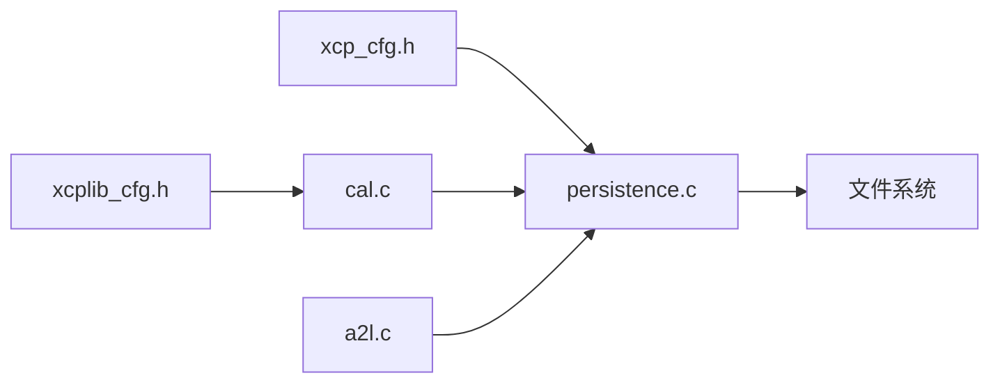

# 校准段持久化

<cite>
**本文引用的文件**
- [persistence.c](file://src/persistence.c)
- [persistence.h](file://src/persistence.h)
- [cal.c](file://src/cal.c)
- [cal.h](file://src/cal.h)
- [xcp_cfg.h](file://src/xcp_cfg.h)
- [xcplib_cfg.h](file://src/xcplib_cfg.h)
- [a2l.c](file://src/a2l.c)
- [hello_xcp main.c](file://examples/hello_xcp/src/main.c)
</cite>

## 目录
1. [简介](#简介)
2. [项目结构](#项目结构)
3. [核心组件](#核心组件)
4. [架构总览](#架构总览)
5. [详细组件分析](#详细组件分析)
6. [依赖关系分析](#依赖关系分析)
7. [性能考虑](#性能考虑)
8. [故障排查指南](#故障排查指南)
9. [结论](#结论)
10. [附录](#附录)

## 简介
本文件详细说明 XCPlite 的校准段持久化能力，重点覆盖：
- 二进制持久化文件的生成与加载流程
- XcpBinWrite、XcpBinFreezeCalSeg（对应“冻结工作页”）的使用方法与行为
- EPK 校验机制与二进制文件格式
- 工作页数据如何持久化为默认页，以及启动时如何从持久化文件恢复
- 完整的持久化流程示例（含错误处理与恢复）
- 持久化文件结构与兼容性要求
- 紧急情况下使用 XcpResetAllCalSegs 重置所有校准段

## 项目结构
持久化功能由以下模块协作实现：
- persistence.c/.h：二进制持久化文件读写、文件名生成、EPK 校验、事件与校准段描述符写入/读取
- cal.c/.h：校准段 RCU、预加载段创建、冻结命令实现、复位所有段
- xcp_cfg.h/xcplib_cfg.h：启用持久化相关编译选项
- a2l.c：A2L 生成阶段触发持久化文件创建（默认页数据）
- 示例 hello_xcp：展示初始化、A2L 生成、可选的冻结保存调用时机

图表来源
- [persistence.c:240-318](file://src/persistence.c#L240-L318)
- [persistence.c:327-365](file://src/persistence.c#L327-L365)
- [persistence.c:375-541](file://src/persistence.c#L375-L541)
- [cal.c:341-368](file://src/cal.c#L341-L368)
- [cal.c:1089-1135](file://src/cal.c#L1089-L1135)
- [a2l.c:1629-1672](file://src/a2l.c#L1629-L1672)
- [hello_xcp main.c:175-187](file://examples/hello_xcp/src/main.c#L175-L187)

章节来源
- [persistence.c:1-554](file://src/persistence.c#L1-L554)
- [cal.c:1-1140](file://src/cal.c#L1-L1140)
- [a2l.c:1629-1672](file://src/a2l.c#L1629-L1672)
- [hello_xcp main.c:175-187](file://examples/hello_xcp/src/main.c#L175-L187)

## 核心组件
- 二进制持久化接口
  - XcpBinWrite(epk)：将当前事件列表与所有校准段的默认页数据写入二进制文件；在 SHM 模式下还写入应用清单
  - XcpBinFreezeCalSeg(calseg)：将指定校准段的当前工作页数据“冻结”写入到已存在的持久化文件中
  - XcpBinLoad()：启动早期加载持久化文件，重建事件与校准段（预加载模式），并预注册应用（SHM 模式）
  - XcpBinDelete()：删除持久化文件
  - XcpBinGetFilename()：根据项目名与 EPK（或 SHM 模式下的 ECU 项目名）生成持久化文件名
- 校准段控制
  - XcpFreeze()：冻结全部校准段的工作页到持久化文件（仅服务器在 SHM 模式允许）
  - XcpFreezeSelectedCalSegs(all)：按标志或全部进行冻结
  - XcpResetAllCalSegs()：将所有校准段切换回默认页并断开会话（紧急恢复）
- 配置开关
  - OPTION_ENABLE_PERSISTENCE：启用持久化
  - XCP_ENABLE_CAL_PERSISTENCE：启用校准段工作页持久化
  - XCP_ENABLE_FREEZE_CAL_PAGE：启用 FREEZE 命令

章节来源
- [persistence.h:30-47](file://src/persistence.h#L30-L47)
- [cal.h:186-205](file://src/cal.h#L186-L205)
- [xcp_cfg.h:325-335](file://src/xcp_cfg.h#L325-L335)
- [xcplib_cfg.h:100](file://src/xcplib_cfg.h#L100)

## 架构总览
持久化涉及“写路径”和“读路径”，并通过 EPK 保证版本一致性。

图表来源
- [persistence.c:240-318](file://src/persistence.c#L240-L318)
- [persistence.c:327-365](file://src/persistence.c#L327-L365)
- [persistence.c:375-541](file://src/persistence.c#L375-L541)
- [cal.c:1089-1119](file://src/cal.c#L1089-L1119)
- [a2l.c:1629-1672](file://src/a2l.c#L1629-L1672)

## 详细组件分析

### 二进制文件格式与 EPK 验证
- 文件头 tBinHeader（固定 256 字节）
  - 签名：固定字符串标识
  - 版本：用于向前/向后兼容判断
  - 事件数量、校准段数量、应用数量（SHM 模式）
  - EPK 字符串（用于版本匹配）
- 事件描述 tBinEvent（固定 256 字节）
  - 事件 ID、索引、周期时间、优先级、应用 ID（SHM）、名称
- 校准段描述 tBinCalSeg（固定 256 字节）
  - 索引、大小、基地址、应用 ID、内存段号、名称
  - 写入时会记录该段数据在文件中的位置（file_pos），供后续“冻结”直接覆盖
- 应用描述 tBinApp（SHM 模式，固定 256 字节）
  - 项目名、EPK、XCP 初始化模式、应用 ID
- EPK 验证
  - 写入时：将当前 EPK 写入文件头
  - 加载时：若提供 EPK 则严格匹配，不匹配则拒绝加载（避免不同版本污染）
  - 启动加载：XcpBinLoad 内部以 NULL EPK 跳过校验，以便在未知 EPK 时仍能恢复结构

章节来源
- [persistence.c:40-95](file://src/persistence.c#L40-L95)
- [persistence.c:134-151](file://src/persistence.c#L134-L151)
- [persistence.c:154-210](file://src/persistence.c#L154-L210)
- [persistence.c:213-236](file://src/persistence.c#L213-L236)
- [persistence.c:375-404](file://src/persistence.c#L375-L404)

### 工作页持久化（冻结）流程
- 触发点
  - 应用层调用 XcpFreeze() 或 XcpFreezeSelectedCalSegs(true/false)
  - 内部遍历校准段，对满足条件的段调用 XcpBinFreezeCalSeg
- 写入过程
  - 打开已存在的 .bin 文件（r+b）
  - 根据段结构中的 file_pos 定位到该段数据区起始处
  - 锁定校准段获取当前工作页指针，写入文件
  - 解锁并关闭文件
- 错误处理
  - 非法索引、找不到段、无法打开文件、写入失败均返回 false 并记录日志

图表来源
- [cal.c:1089-1119](file://src/cal.c#L1089-L1119)
- [persistence.c:327-365](file://src/persistence.c#L327-L365)

章节来源
- [cal.c:1089-1119](file://src/cal.c#L1089-L1119)
- [persistence.c:327-365](file://src/persistence.c#L327-L365)

### 启动加载与预加载段
- 加载入口
  - XcpBinLoad() 在 XCP 激活后尽早调用，读取 .bin 文件
  - 先读取并校验文件头（签名、版本），再读取事件与校准段描述
- 事件恢复
  - 确保事件列表为空，按顺序重建事件，并在 SHM 模式下设置 app_id
- 校准段恢复
  - 确保校准段列表为空，按顺序创建“预加载段”
  - 通过 XcpCreateCalSegPreloaded 将文件中的数据作为默认页内容
- 应用预注册（SHM 模式）
  - 读取应用描述并预注册，若 A2L 文件已存在则标记为已最终化
- 兼容性
  - 版本不匹配或文件损坏会拒绝加载并返回失败

图表来源
- [persistence.c:375-541](file://src/persistence.c#L375-L541)
- [cal.c:341-368](file://src/cal.c#L341-L368)

章节来源
- [persistence.c:375-541](file://src/persistence.c#L375-L541)
- [cal.c:341-368](file://src/cal.c#L341-L368)

### 默认页写入与 A2L 集成
- A2L 最终化时，生成关联的二进制持久化文件，包含：
  - 文件头（含 EPK）
  - 事件描述
  - 每个校准段的描述及其默认页数据
- 在 SHM 模式下，还会写入应用清单
- 文件名规则
  - 非 SHM：项目名_版本号.bin
  - SHM：ECU 项目名.bin（由服务器统一创建）

章节来源
- [a2l.c:1629-1672](file://src/a2l.c#L1629-L1672)
- [persistence.c:104-114](file://src/persistence.c#L104-L114)
- [persistence.c:240-318](file://src/persistence.c#L240-L318)

### 使用示例与最佳实践
- 典型流程
  1) 初始化 XCP、启动服务器、初始化 A2L
  2) 创建校准段（默认页指向静态数据）
  3) 运行期间可修改工作页
  4) 退出前调用 XcpFreeze() 将工作页保存到 .bin
  5) 下次启动时自动加载 .bin（若无 EPK 校验则恢复结构）
- 注意事项
  - 仅在 XCP 激活后可执行持久化操作
  - 冻结前确保 .bin 已通过 A2L 最终化生成
  - 多进程/SHM 模式下，仅服务器可冻结全部段

章节来源
- [hello_xcp main.c:175-187](file://examples/hello_xcp/src/main.c#L175-L187)
- [hello_xcp main.c:276-279](file://examples/hello_xcp/src/main.c#L276-L279)
- [cal.c:1111-1119](file://src/cal.c#L1111-L1119)

### 紧急恢复：XcpResetAllCalSegs
- 作用：将所有校准段切换回默认页，并断开会话
- 适用场景：运行时出现不一致或需要快速恢复到已知默认状态
- 注意：不会删除 .bin 文件，也不会改变持久化内容

章节来源
- [cal.c:1122-1135](file://src/cal.c#L1122-L1135)

## 依赖关系分析
- 编译期依赖
  - OPTION_ENABLE_PERSISTENCE 开启后，启用 XCP_ENABLE_CAL_PERSISTENCE 与 XCP_ENABLE_FREEZE_CAL_PAGE
- 运行时依赖
  - persistence.c 依赖 xcp.h（CRC 码定义）、xcp_cfg.h（XCP_* 宏）、platform.h（平台抽象）、shm.h（SHM 模式）
  - cal.c 依赖 persistence.h（冻结接口）
  - a2l.c 在最终化时调用持久化写入

图表来源
- [xcp_cfg.h:325-335](file://src/xcp_cfg.h#L325-L335)
- [xcplib_cfg.h:100](file://src/xcplib_cfg.h#L100)
- [persistence.c:1-35](file://src/persistence.c#L1-L35)
- [cal.c:30-35](file://src/cal.c#L30-L35)
- [a2l.c:1629-1672](file://src/a2l.c#L1629-L1672)

章节来源
- [xcp_cfg.h:325-335](file://src/xcp_cfg.h#L325-L335)
- [xcplib_cfg.h:100](file://src/xcplib_cfg.h#L100)
- [persistence.c:1-35](file://src/persistence.c#L1-L35)
- [cal.c:30-35](file://src/cal.c#L30-L35)
- [a2l.c:1629-1672](file://src/a2l.c#L1629-L1672)

## 性能考虑
- 冻结写入为随机 I/O（基于 file_pos 定位），建议批量冻结或在低负载时段执行
- 启动加载需顺序读取大量描述符与数据块，应避免阻塞关键初始化路径
- 校准段 RCU 采用原子与延迟发布策略，冻结不受其影响（直接访问工作页）
- 大段数据写入时注意磁盘缓存与同步策略，必要时在应用层做合并写入

[本节为通用指导，无需特定文件引用]

## 故障排查指南
- 常见错误与定位
  - 文件不存在：启动加载将回退到默认页，属正常
  - 签名/版本不匹配：拒绝加载，检查构建版本与持久化文件是否一致
  - EPK 不匹配：拒绝加载，确认软件版本未变更或调整加载策略
  - 事件/段列表非空：加载前必须为空，检查初始化顺序
  - 冻结失败：检查索引有效性、文件可写权限、段是否存在
- 调试建议
  - 提高日志级别观察写入/读取过程
  - 校验 .bin 文件头签名与版本
  - 在 SHM 模式下确认仅服务器执行冻结全部段

章节来源
- [persistence.c:375-541](file://src/persistence.c#L375-L541)
- [persistence.c:327-365](file://src/persistence.c#L327-L365)
- [cal.c:1111-1135](file://src/cal.c#L1111-L1135)

## 结论
XCPlite 的校准段持久化通过二进制文件实现了事件与校准段的确定性序列化与恢复。借助 EPK 校验与版本控制，可在不同构建之间保持兼容性与安全性。配合 A2L 最终化与启动加载，形成“默认页生成—运行修改—冻结保存—启动恢复”的完整闭环。紧急情况下可通过 XcpResetAllCalSegs 快速恢复到默认状态。

[本节为总结性内容，无需特定文件引用]

## 附录

### API 速查
- 持久化
  - XcpBinWrite(epk)：生成/更新持久化文件（默认页）
  - XcpBinFreezeCalSeg(calseg)：冻结指定段的工作页
  - XcpBinLoad()：启动加载持久化文件
  - XcpBinDelete()：删除持久化文件
  - XcpBinGetFilename()：获取持久化文件名
- 校准段控制
  - XcpFreeze()：冻结全部段（SHM 下仅限服务器）
  - XcpFreezeSelectedCalSegs(all)：按条件冻结
  - XcpResetAllCalSegs()：全部复位到默认页并断开会话

章节来源
- [persistence.h:30-47](file://src/persistence.h#L30-L47)
- [cal.h:186-205](file://src/cal.h#L186-L205)
- [cal.c:1089-1135](file://src/cal.c#L1089-L1135)

### 二进制文件结构要点
- 文件头：签名、版本、计数、EPK
- 事件表：ID、索引、周期、优先级、app_id、名称
- 校准段表：索引、大小、基地址、app_id、段号、名称 + 数据区
- 应用表（SHM）：项目名、EPK、初始化模式、app_id

章节来源
- [persistence.c:40-95](file://src/persistence.c#L40-L95)
- [persistence.c:154-210](file://src/persistence.c#L154-L210)
- [persistence.c:213-236](file://src/persistence.c#L213-L236)