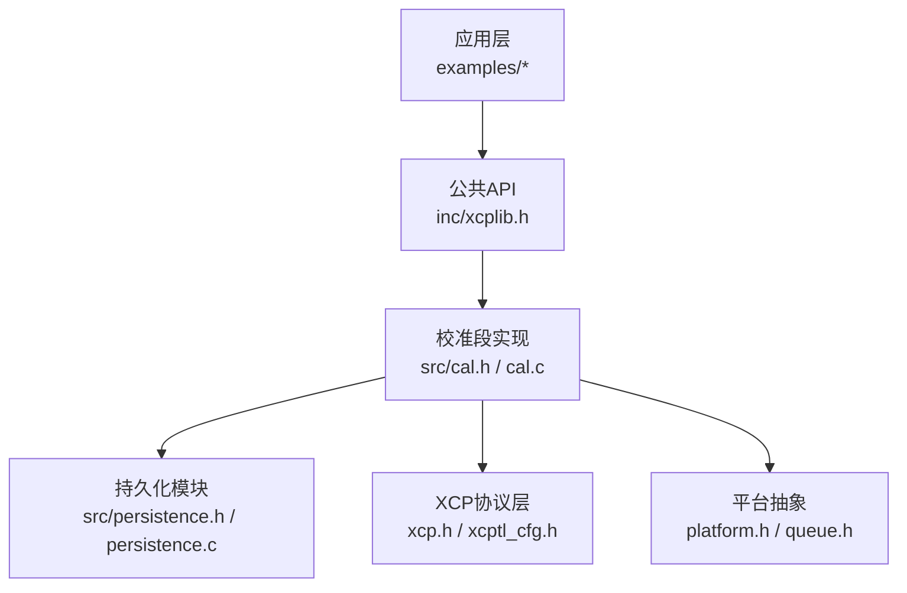
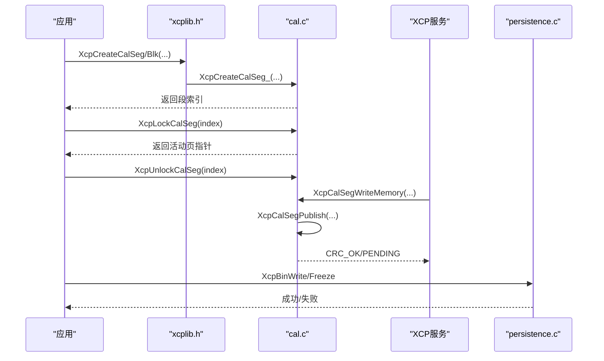
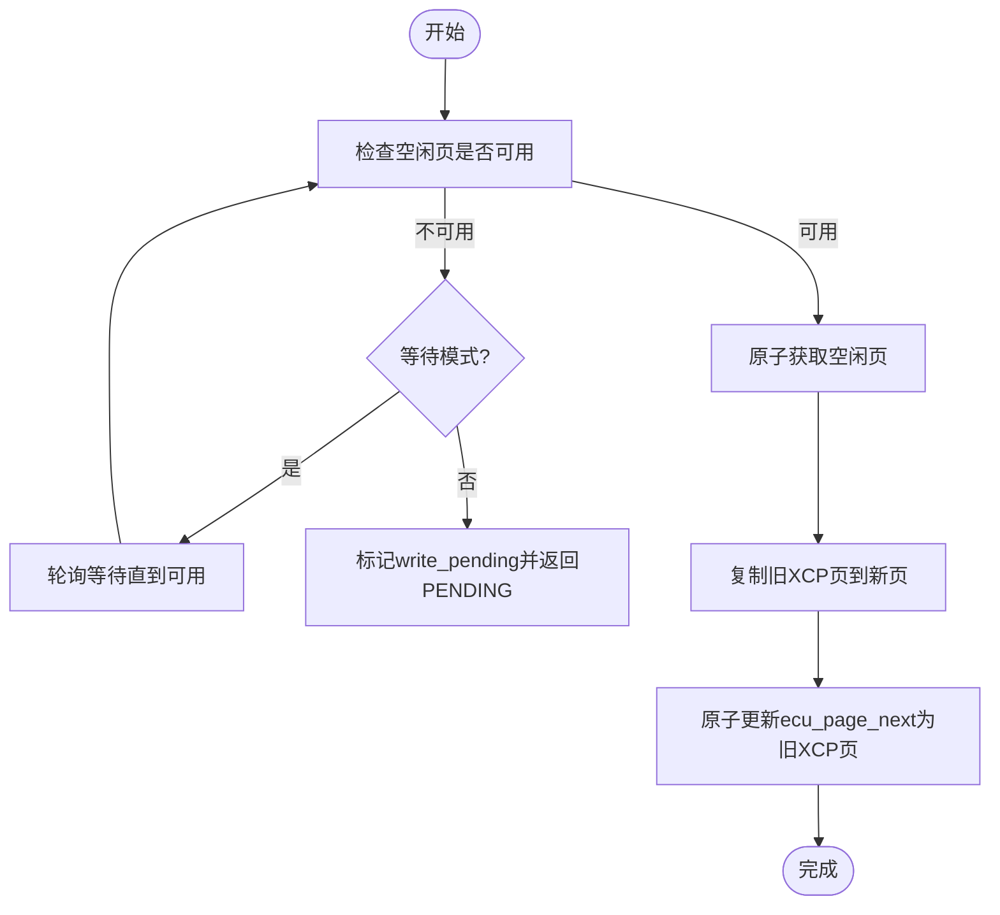
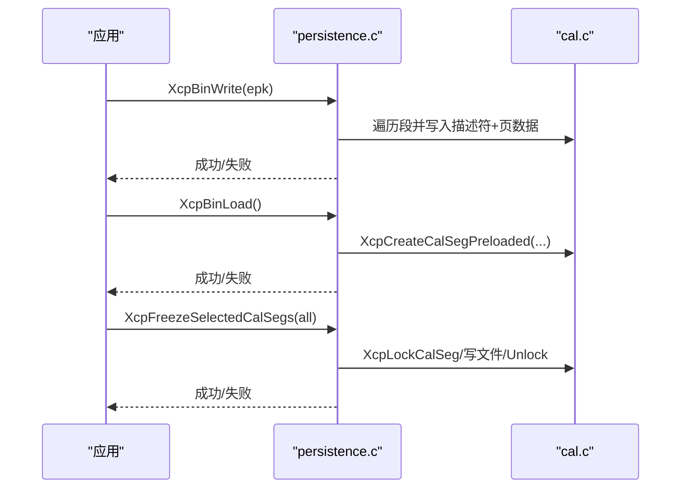
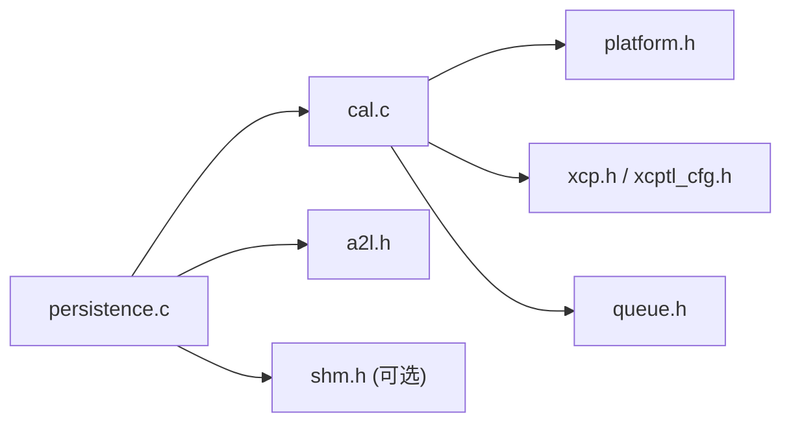

# 校准段管理API

<cite>
**本文引用的文件**
- [cal.h](file://src/cal.h)
- [cal.c](file://src/cal.c)
- [xcplib.h](file://inc/xcplib.h)
- [persistence.h](file://src/persistence.h)
- [persistence.c](file://src/persistence.c)
- [hello_xcp/main.c](file://examples/hello_xcp/src/main.c)
- [c_demo/main.c](file://examples/c_demo/src/main.c)
</cite>

## 目录
1. [简介](#简介)
2. [项目结构](#项目结构)
3. [核心组件](#核心组件)
4. [架构总览](#架构总览)
5. [详细组件分析](#详细组件分析)
6. [依赖关系分析](#依赖关系分析)
7. [性能与并发特性](#性能与并发特性)
8. [故障排查指南](#故障排查指南)
9. [结论](#结论)
10. [附录：使用示例与最佳实践](#附录使用示例与最佳实践)

## 简介
本参考文档聚焦于XCPlite的校准段管理API，覆盖校准段与校准块的概念差异、内存页切换机制、线程安全访问模式，以及完整的创建、查找、锁定/解锁、重置、持久化与EPK校验流程。文档同时提供基于CalSegDecl/CalBlkDecl等宏的声明式定义方式说明，帮助开发者以最小成本集成到现有工程中。

## 项目结构
校准段管理相关代码主要分布在以下位置：
- 公共接口与宏：inc/xcplib.h（对外API、声明式宏）
- 实现核心：src/cal.h、src/cal.c（数据结构、RCU页切换、XCP命令处理）
- 持久化：src/persistence.h、src/persistence.c（二进制文件读写、预加载、冻结）
- 示例：examples/hello_xcp/src/main.c、examples/c_demo/src/main.c（典型用法）

图表来源
- [xcplib.h:60-139](file://inc/xcplib.h#L60-L139)
- [cal.h:38-178](file://src/cal.h#L38-L178)
- [cal.c:119-180](file://src/cal.c#L119-L180)
- [persistence.c:248-318](file://src/persistence.c#L248-L318)

章节来源
- [xcplib.h:60-139](file://inc/xcplib.h#L60-L139)
- [cal.h:38-178](file://src/cal.h#L38-L178)
- [cal.c:119-180](file://src/cal.c#L119-L180)
- [persistence.c:248-318](file://src/persistence.c#L248-L318)

## 核心组件
- 校准段(tXcpCalSeg)与段头(tXcpCalSegHeader)：包含名称、大小、页指针偏移、锁计数、访问模式、持久化位置等。
- 校准段列表(tXcpCalSegList)：维护段索引表、内存池、原子计数与写延迟标志。
- RCU页模型：默认页(Reference)、ECU工作页、XCP工作页、空闲交换页；通过原子变量与发布-订阅语义保证一致性。
- 持久化模块：二进制文件写入/读取、预加载、冻结指定段、EPK校验。

章节来源
- [cal.h:79-178](file://src/cal.h#L79-L178)
- [cal.c:91-117](file://src/cal.c#L91-L117)
- [persistence.c:40-95](file://src/persistence.c#L40-L95)

## 架构总览
校准段管理的整体交互如下：
- 应用侧通过XcpCreateCalSeg/XcpCreateCalBlk创建段或块，并通过XcpLockCalSeg/XcpUnlockCalSeg进行无锁、可重入的访问。
- XCP服务端通过GET/SET CAL PAGE、COPY CAL PAGE、GET SEGMENT INFO等命令控制页访问模式与数据同步。
- 持久化模块在启动时预加载二进制文件，或在退出/冻结时将当前工作页落盘，并在加载时进行EPK校验。

图表来源
- [xcplib.h:70-139](file://inc/xcplib.h#L70-L139)
- [cal.c:375-503](file://src/cal.c#L375-L503)
- [cal.c:800-844](file://src/cal.c#L800-L844)
- [persistence.c:248-318](file://src/persistence.c#L248-L318)

## 详细组件分析

### 校准段与校准块的区别
- 校准段(Calibration Segment)：具备“内存段号”，可在A2L中作为MEMORY_SEGMENT暴露，支持XCP对段的完整操作（如GET/SET CAL PAGE、COPY CAL PAGE）。
- 校准块(Calibration Block)：不分配内存段号，不提供MEMORY_SEGMENT能力，但仍享有页切换与一致性访问。

章节来源
- [xcplib.h:70-88](file://inc/xcplib.h#L70-L88)
- [cal.c:375-393](file://src/cal.c#L375-L393)

### 内存页切换机制（RCU）
- 默认页：只读参考页，用于初始值与回滚。
- ECU工作页：应用侧修改的目标页。
- XCP工作页：XCP客户端可见的页，由发布流程更新。
- 空闲页：用于原子替换，避免竞争。
- 发布流程：当检测到空闲页可用且无竞态时，将旧XCP页复制到新页并原子更新下一版本，确保读者始终看到一致快照。

图表来源
- [cal.c:723-767](file://src/cal.c#L723-L767)

章节来源
- [cal.h:123-150](file://src/cal.h#L123-L150)
- [cal.c:505-615](file://src/cal.c#L505-L615)
- [cal.c:723-767](file://src/cal.c#L723-L767)

### 线程安全访问模式
- XcpLockCalSeg/XcpUnlockCalSeg：无锁、可重入，内部使用原子锁计数与页版本字段，保证多读一写的并发安全。
- 多线程场景下，多个线程可同时锁定同一校准段，均能看到一致的页快照。
- 单线程XCP服务端调用XcpCalSegWriteMemory进行写操作，必要时触发发布流程。

章节来源
- [cal.c:619-689](file://src/cal.c#L619-L689)
- [cal.c:800-844](file://src/cal.c#L800-L844)

### 创建、查找、锁定/解锁、重置流程
- 创建：
  - XcpCreateCalSeg：创建带内存段号的校准段。
  - XcpCreateCalBlk：创建不带内存段号的校准块。
  - XcpCreateCalSegPreloaded：从二进制文件预加载段。
- 查找：
  - XcpFindCalSeg：按名称查找（SHM模式下按app_id作用域）。
  - XcpGetCalSegIndex/Number：段号与索引互转。
- 锁定/解锁：
  - XcpLockCalSeg：返回活动页指针（默认页或工作页）。
  - XcpUnlockCalSeg：递减锁计数。
- 重置：
  - XcpResetAllCalSegs：将所有段ECU访问切回默认页并断开会话。

章节来源
- [cal.c:341-503](file://src/cal.c#L341-L503)
- [cal.c:234-339](file://src/cal.c#L234-L339)
- [cal.c:619-689](file://src/cal.c#L619-L689)
- [cal.c:1121-1135](file://src/cal.c#L1121-L1135)

### XCP命令与页控制
- GET/SET CAL PAGE：查询或设置ECU/XCP访问页。
- COPY CAL PAGE：从默认页拷贝到工作页（兼容旧版工具行为）。
- GET SEGMENT INFO：返回段地址、长度、名称等信息。
- 原子事务：Begin/End Atomic Transaction批量写后统一发布。

章节来源
- [cal.c:869-1062](file://src/cal.c#L869-L1062)

### 持久化存储与EPK验证
- 写入：XcpBinWrite将事件与校准段描述符及页面数据写入二进制文件，包含签名、版本、EPK等。
- 加载：XcpBinLoad读取文件，预注册事件与校准段，并标记预加载段。
- 冻结：XcpFreezeSelectedCalSegs将指定段的工作页写入文件；XcpFreeze可冻结所有段。
- EPK校验：加载时可传入期望EPK进行匹配，不匹配则拒绝加载。

图表来源
- [persistence.c:248-318](file://src/persistence.c#L248-L318)
- [persistence.c:322-365](file://src/persistence.c#L322-L365)
- [persistence.c:375-521](file://src/persistence.c#L375-L521)
- [cal.c:341-368](file://src/cal.c#L341-L368)

章节来源
- [persistence.c:248-318](file://src/persistence.c#L248-L318)
- [persistence.c:322-365](file://src/persistence.c#L322-L365)
- [persistence.c:375-521](file://src/persistence.c#L375-L521)
- [cal.c:341-368](file://src/cal.c#L341-L368)

## 依赖关系分析
- 校准段实现依赖：
  - 平台抽象：原子操作、互斥量、时钟等。
  - XCP协议层：地址编码/解码、命令响应缓冲。
  - 队列与共享内存（可选）：用于跨进程场景。
- 持久化依赖：
  - A2L文件名生成、项目名/EPK获取。
  - 校准段列表与事件列表状态。

图表来源
- [cal.c:13-38](file://src/cal.c#L13-L38)
- [persistence.c:13-34](file://src/persistence.c#L13-L34)

章节来源
- [cal.c:13-38](file://src/cal.c#L13-L38)
- [persistence.c:13-34](file://src/persistence.c#L13-L34)

## 性能与并发特性
- 无锁读取：XcpLockCalSeg为无锁、可重入，适合高频读取路径。
- 原子发布：页替换通过原子变量与释放语义保证可见性，避免锁竞争。
- 延迟写：支持懒发布模式，减少频繁页切换开销。
- 内存池：固定大小的嵌入式内存池，避免动态分配开销。

[本节为通用指导，无需特定文件引用]

## 故障排查指南
- 常见错误码：
  - CRC_ACCESS_DENIED：非法访问（如写默认页、越界、无效段号）。
  - CRC_CMD_PENDING：暂无空闲页，需稍后重试或启用等待模式。
  - CRC_OUT_OF_RANGE：段号或页号无效。
- 调试建议：
  - 开启日志级别，观察页切换与发布过程。
  - 检查XCP是否已激活（isActivated），未激活时创建/锁定会失败。
  - 确认段大小与默认页大小一致，避免重复创建冲突。
  - 持久化失败时检查文件权限与磁盘空间。

章节来源
- [cal.c:693-717](file://src/cal.c#L693-L717)
- [cal.c:800-844](file://src/cal.c#L800-L844)
- [persistence.c:248-318](file://src/persistence.c#L248-L318)

## 结论
XCPlite的校准段管理提供了高效、线程安全的参数访问机制，结合RCU页切换与持久化能力，满足实时性与可靠性要求。通过声明式宏与简洁API，开发者可以快速集成校准功能，并利用XCP工具进行在线标定与调试。

[本节为总结，无需特定文件引用]

## 附录：使用示例与最佳实践

### 声明式定义（CalSegDecl/CalBlkDecl）
- 用途：在编译期将校准段/块的描述放入链接器节，启动时由XcpRegisterSectionCalSegs扫描并预注册。
- 适用场景：全局静态对象，希望零运行时开销地声明校准段。
- 注意：需在XcpInit之后才可使用，因为实际创建发生在初始化阶段。

章节来源
- [xcplib.h:175-234](file://inc/xcplib.h#L175-L234)
- [cal.c:119-180](file://src/cal.c#L119-L180)

### 动态创建（CalSegCreate/CalBlkCreate）
- 用途：在任意位置（包括函数体内）立即创建段/块，若尚未存在则创建，否则复用已有索引。
- 适用场景：需要尽早可用的段，或条件化创建。

章节来源
- [xcplib.h:198-223](file://inc/xcplib.h#L198-L223)

### 典型用法示例
- 创建段并访问：
  - 参考示例：在main中创建名为“params”的校准段，随后在主循环中锁定读取参数。
- 嵌套锁定：
  - 同一线程内多次锁定同一校准段是安全的，内部维护原子锁计数。

章节来源
- [hello_xcp/main.c:175-187](file://examples/hello_xcp/src/main.c#L175-L187)
- [hello_xcp/main.c:227-251](file://examples/hello_xcp/src/main.c#L227-L251)
- [c_demo/main.c:158-182](file://examples/c_demo/src/main.c#L158-L182)
- [c_demo/main.c:287-321](file://examples/c_demo/src/main.c#L287-L321)

### 持久化与EPK校验
- 启动时加载：
  - 调用XcpBinLoad预加载二进制文件，恢复事件与校准段。
- 写入与冻结：
  - 调用XcpBinWrite保存当前状态；调用XcpFreezeSelectedCalSegs或XcpFreeze冻结工作页。
- EPK校验：
  - 加载时可传入期望EPK，若不匹配则拒绝加载，防止版本不一致导致的数据损坏。

章节来源
- [persistence.c:248-318](file://src/persistence.c#L248-L318)
- [persistence.c:322-365](file://src/persistence.c#L322-L365)
- [persistence.c:375-521](file://src/persistence.c#L375-L521)