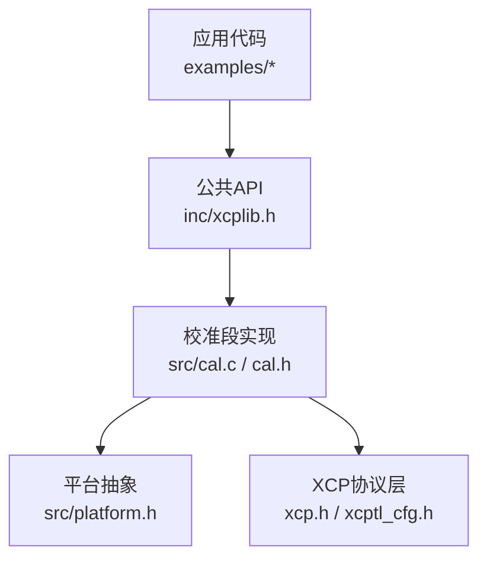
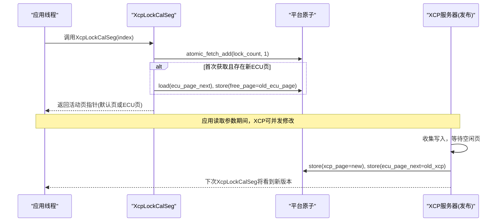
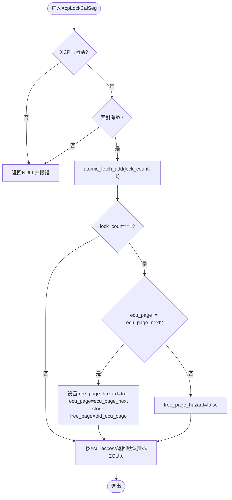
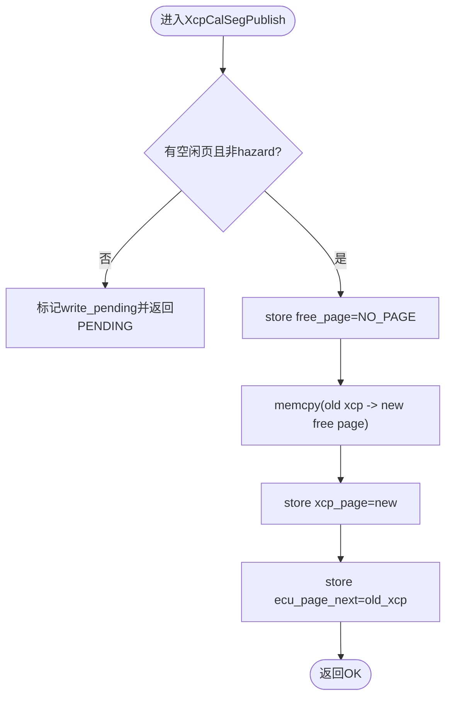
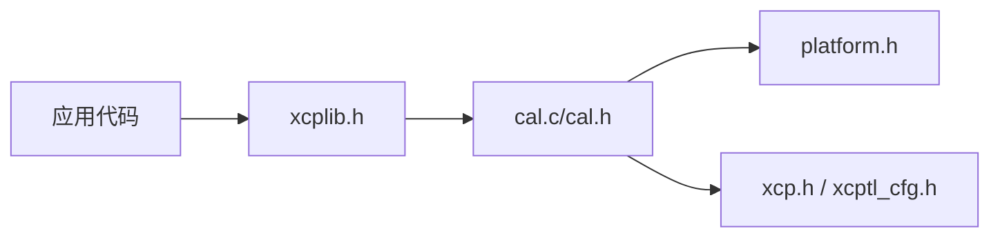

# 校准段访问控制

<cite>
**本文引用的文件**
- [cal.c](file://src/cal.c)
- [cal.h](file://src/cal.h)
- [xcplib.h](file://inc/xcplib.h)
- [platform.h](file://src/platform.h)
- [multi_thread_demo/main.c](file://examples/multi_thread_demo/src/main.c)
- [hello_xcp/main.c](file://examples/hello_xcp/src/main.c)
</cite>

## 目录
1. [简介](#简介)
2. [项目结构](#项目结构)
3. [核心组件](#核心组件)
4. [架构总览](#架构总览)
5. [详细组件分析](#详细组件分析)
6. [依赖关系分析](#依赖关系分析)
7. [性能考量](#性能考量)
8. [故障排查指南](#故障排查指南)
9. [结论](#结论)
10. [附录：使用示例与最佳实践](#附录使用示例与最佳实践)

## 简介
本文件聚焦于XCPlite中“校准段”的访问控制与同步机制，重点说明XcpLockCalSeg与XcpUnlockCalSeg的使用方法、线程安全保证、无锁设计原理与原子操作实现，并给出多线程环境下安全访问校准数据的最佳实践。同时涵盖查询函数XcpGetCalSegName、XcpGetCalSegSize等的用法，以及锁定机制的性能特点与适用场景。

## 项目结构
与校准段访问控制直接相关的代码主要位于：
- 接口定义与公共API：inc/xcplib.h
- 内部实现与数据结构：src/cal.c、src/cal.h
- 平台抽象（原子操作、互斥量等）：src/platform.h
- 典型使用示例：examples/multi_thread_demo/src/main.c、examples/hello_xcp/src/main.c

图表来源
- [xcplib.h:61-124](file://inc/xcplib.h#L61-L124)
- [cal.c:17-39](file://src/cal.c#L17-L39)
- [platform.h:177-197](file://src/platform.h#L177-L197)

章节来源
- [xcplib.h:61-124](file://inc/xcplib.h#L61-L124)
- [cal.c:17-39](file://src/cal.c#L17-L39)
- [platform.h:177-197](file://src/platform.h#L177-L197)

## 核心组件
- 校准段句柄与编号：tXcpCalSegIndex、tXcpCalSegNumber
- 创建与注册：XcpCreateCalSeg、XcpCreateCalBlk、XcpRegisterSectionCalSegs
- 访问控制：XcpLockCalSeg、XcpUnlockCalSeg
- 查询接口：XcpGetCalSegCount、XcpFindCalSeg、XcpGetCalSegName、XcpGetCalSegSize、XcpGetCalSegBaseAddress
- 发布与一致性：XcpCalSegPublishAll、内部发布流程
- 平台原子操作：C11 stdatomic或Windows Interlocked封装

章节来源
- [xcplib.h:61-124](file://inc/xcplib.h#L61-L124)
- [cal.h:159-179](file://src/cal.h#L159-L179)
- [cal.c:185-213](file://src/cal.c#L185-L213)
- [cal.c:234-322](file://src/cal.c#L234-L322)
- [cal.c:619-689](file://src/cal.c#L619-L689)

## 架构总览
校准段采用RCU（Read-Copy-Update）思想，通过多页缓冲（默认页、ECU工作页、XCP工作页、空闲页）与原子指针切换，实现读路径无锁、写路径延迟发布的一致性访问。关键要点：
- 读路径：XcpLockCalSeg仅增加每段的原子锁计数，并在首次获取时检查是否有更新的ECU页面版本；若存在新版本则释放旧页并切换到新版本，返回当前活动页指针。
- 写路径：XCP服务器侧在收到写入后标记write_pending，随后在XcpCalSegPublishAll中等待空闲页可用，复制旧XCP页到空闲页，交换XCP页并更新ECU下一页指针，完成发布。
- 线程安全：锁计数为每段原子变量，支持递归锁定；页面切换通过原子load/store与hazard标志避免竞争；列表注册使用轻量互斥保护。

图表来源
- [cal.c:619-689](file://src/cal.c#L619-L689)
- [cal.c:719-798](file://src/cal.c#L719-L798)

## 详细组件分析

### 数据结构与内存布局
- tXcpCalSegHeader包含：ecu_page_next、free_page、ecu_page、xcp_page、lock_count、ecu_access、xcp_access、write_pending、free_page_hazard等字段，用于RCU状态机与访问控制。
- 页偏移以uint32_t存储，使结构体位置无关，便于共享内存模式。
- 页数量与偏移宏根据是否启用绝对寻址而不同，确保默认页、ECU页、XCP页、空闲页的正确布局。

章节来源
- [cal.h:86-157](file://src/cal.h#L86-L157)

### 创建与注册
- XcpCreateCalSeg/XcpCreateCalBlk：创建校准段或块，分配内存池空间，初始化默认页、ECU页、XCP页及空闲页，设置访问模式。
- XcpRegisterSectionCalSegs：扫描链接器节xcp_cals，预注册所有声明的校准段/块，统一索引化。

章节来源
- [cal.c:122-180](file://src/cal.c#L122-L180)
- [cal.c:370-503](file://src/cal.c#L370-L503)

### 访问控制：XcpLockCalSeg与XcpUnlockCalSeg
- XcpLockCalSeg：
  - 校验XCP已激活与索引有效。
  - 原子递增lock_count，支持递归锁定。
  - 首次获取时检查ecu_page_next，如有更新则释放旧ECU页至free_page，并切换到新版本。
  - 根据ecu_access决定返回默认页或ECU页。
- XcpUnlockCalSeg：
  - 原子递减lock_count，断言不会下溢。
  - 不阻塞，无额外副作用。

图表来源
- [cal.c:619-689](file://src/cal.c#L619-L689)

章节来源
- [cal.c:619-689](file://src/cal.c#L619-L689)

### 发布与一致性：XcpCalSegPublishAll
- 当XCP客户端写入校准数据时，服务器侧标记write_pending，并在合适时机调用XcpCalSegPublishAll进行批量发布。
- 发布流程：
  - 等待空闲页可用（考虑free_page_hazard）。
  - 将当前XCP页复制到空闲页，交换xcp_page。
  - 将旧XCP页设为ecu_page_next，供下一次XcpLockCalSeg切换。
  - 清除write_pending。

图表来源
- [cal.c:719-798](file://src/cal.c#L719-L798)

章节来源
- [cal.c:719-798](file://src/cal.c#L719-L798)

### 查询接口
- XcpGetCalSegCount：返回当前校准段数量（原子加载count）。
- XcpFindCalSeg：按名称查找段索引（支持SHM模式下按app_id过滤）。
- XcpGetCalSegName：返回段名。
- XcpGetCalSegSize：返回段大小。
- XcpGetCalSegBaseAddress：返回A2L/XCP地址编码。

章节来源
- [cal.c:206-339](file://src/cal.c#L206-L339)

### 平台原子操作
- 在非Windows平台使用C11 stdatomic；在Windows可通过OPTION_ATOMIC_EMULATION使用Interlocked intrinsics。
- 提供load/store/fetch_add/fetch_sub/CAS等原语，配合memory_order_relaxed/acquire/release语义满足RCU可见性要求。

章节来源
- [platform.h:177-197](file://src/platform.h#L177-L197)
- [platform.h:520-672](file://src/platform.h#L520-L672)

## 依赖关系分析
- 应用代码通过公共API（xcplib.h）访问校准段，内部由cal.c实现。
- cal.c依赖platform.h提供的原子与互斥量抽象，以及xcp.h/xcptl_cfg.h中的协议配置。
- 示例代码展示了如何在多线程环境中安全地锁定与解锁校准段。

图表来源
- [xcplib.h:61-124](file://inc/xcplib.h#L61-L124)
- [cal.c:17-39](file://src/cal.c#L17-L39)
- [platform.h:177-197](file://src/platform.h#L177-L197)

章节来源
- [xcplib.h:61-124](file://inc/xcplib.h#L61-L124)
- [cal.c:17-39](file://src/cal.c#L17-L39)
- [platform.h:177-197](file://src/platform.h#L177-L197)

## 性能考量
- 读路径无锁：XcpLockCalSeg仅执行原子加法与可能的单次页面切换，避免互斥量开销，适合高频调用。
- 递归锁定：lock_count支持同一线程多次锁定，无需重入检测，降低调用复杂度。
- 写路径延迟：XCP写入不立即生效，需等待空闲页并发布，避免在读路径引入阻塞；适用于校准参数低频更新场景。
- 内存池分配：使用无锁bump allocator，减少锁竞争，提升创建性能。

[本节为通用性能讨论，不直接分析具体文件]

## 故障排查指南
- 常见错误：
  - XCP未激活：XcpLockCalSeg/XcpUnlockCalSeg会报错并返回空或0。
  - 无效索引：超出范围或尚未创建的段会导致错误。
  - 空闲页不可用：发布失败返回CRC_CMD_PENDING，需重试或等待。
- 调试建议：
  - 开启日志级别，观察“ecu_page updated”、“write pending”等信息。
  - 检查free_page_hazard标志，确认是否存在并发释放风险。
  - 验证XcpCalSegPublishAll是否被周期性调用，确保写入最终一致。

章节来源
- [cal.c:619-689](file://src/cal.c#L619-L689)
- [cal.c:719-798](file://src/cal.c#L719-L798)

## 结论
XCPlite通过RCU与原子操作实现了校准段的高性能、线程安全访问。XcpLockCalSeg/XcpUnlockCalSeg提供无锁读路径与递归锁定能力，XcpCalSegPublishAll负责延迟发布以确保一致性。该设计在高并发读、低频写的校准场景中表现优异，结合查询接口可灵活管理校准段元信息。

[本节为总结性内容，不直接分析具体文件]

## 附录：使用示例与最佳实践

### 基本用法
- 创建校准段：
  - 使用XcpCreateCalSeg或CalSegCreate宏注册并创建段。
- 安全访问：
  - 在访问前调用XcpLockCalSeg获取活动页指针，访问结束后调用XcpUnlockCalSeg释放。
  - 可在同一线程内嵌套锁定，无需担心死锁。

章节来源
- [xcplib.h:70-124](file://inc/xcplib.h#L70-L124)
- [multi_thread_demo/main.c:180-200](file://examples/multi_thread_demo/src/main.c#L180-L200)
- [hello_xcp/main.c:110-130](file://examples/hello_xcp/src/main.c#L110-L130)

### 查询接口使用
- XcpGetCalSegName：传入段索引，返回段名，用于调试或日志。
- XcpGetCalSegSize：返回段大小，可用于边界检查或拷贝长度计算。
- XcpGetCalSegBaseAddress：获取A2L/XCP地址，便于工具集成。

章节来源
- [cal.c:306-339](file://src/cal.c#L306-L339)

### 多线程环境最佳实践
- 始终在访问校准数据前后成对调用XcpLockCalSeg/XcpUnlockCalSeg。
- 避免在持有锁期间执行长时间阻塞操作（如I/O），以免延长临界区。
- 对于批量读取，尽量合并访问以减少锁定次数。
- 确保XcpCalSegPublishAll被定期调用，以保证XCP写入的最终一致性。

章节来源
- [multi_thread_demo/main.c:300-340](file://examples/multi_thread_demo/src/main.c#L300-L340)
- [hello_xcp/main.c:223-252](file://examples/hello_xcp/src/main.c#L223-L252)

### 锁定机制的性能特点与适用场景
- 读路径无锁、递归锁定，适合高频采样与控制回路。
- 写路径延迟发布，适合校准参数低频更新（如标定、参数调整）。
- 在资源受限平台（如FreeRTOS）上，原子操作基于硬件或内核原语，开销可控。

[本节为通用性能讨论，不直接分析具体文件]