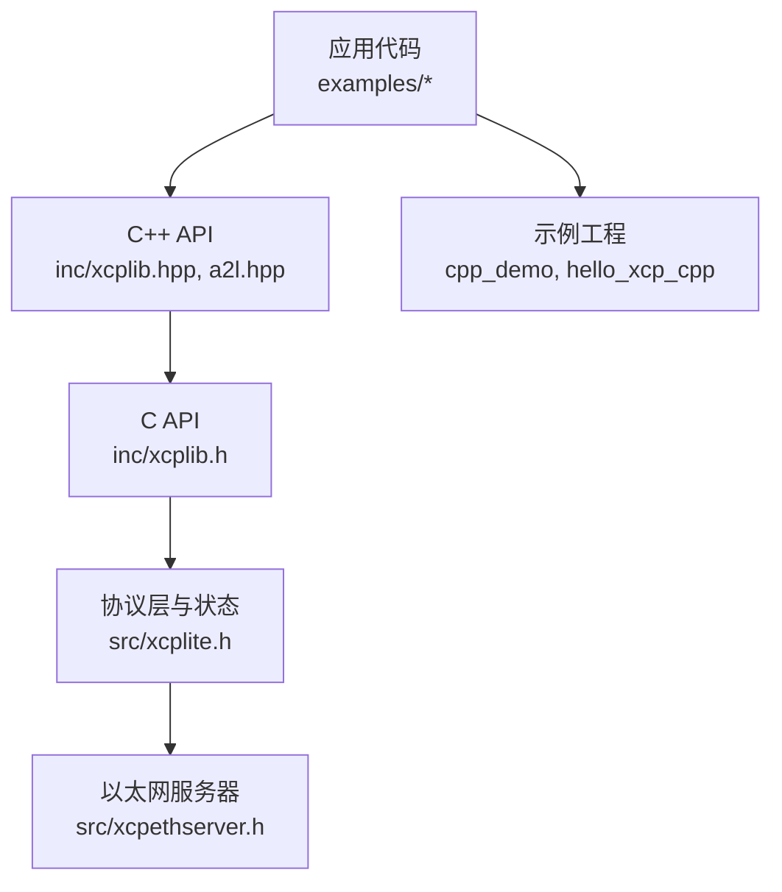
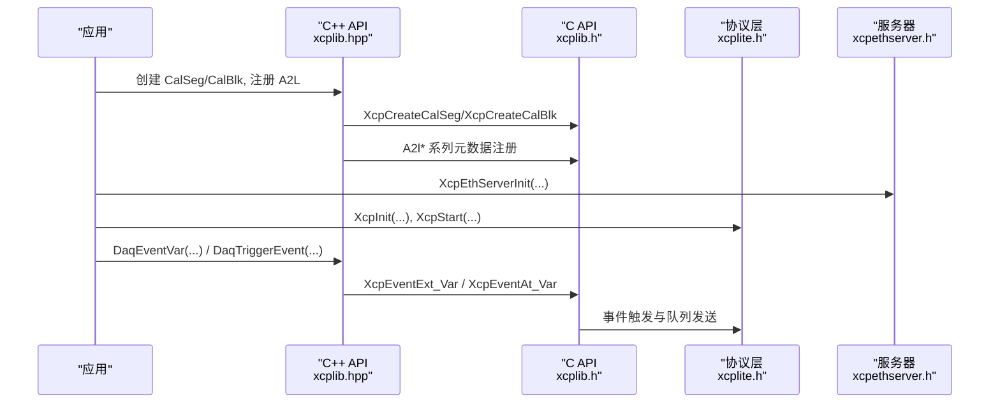
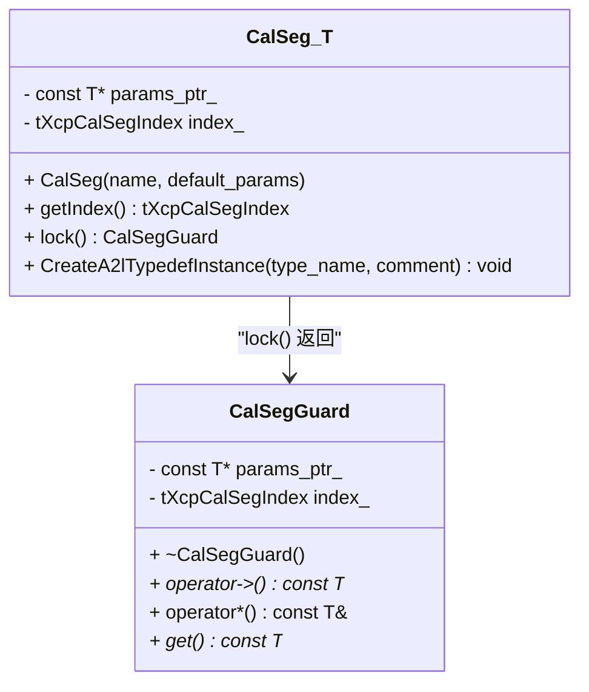
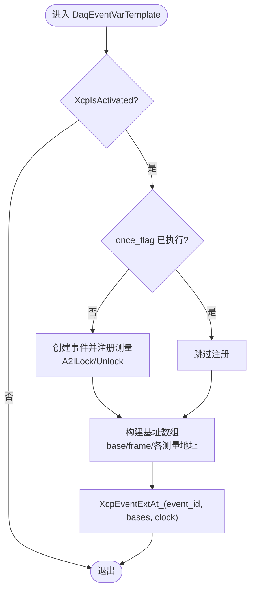
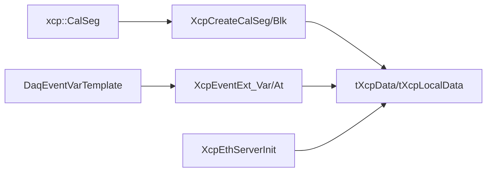

# C++ API参考

<cite>
**本文引用的文件**
- [xcplib.hpp](file://inc/xcplib.hpp)
- [a2l.hpp](file://inc/a2l.hpp)
- [xcplib.h](file://inc/xcplib.h)
- [xcplite.h](file://src/xcplite.h)
- [xcpethserver.h](file://src/xcpethserver.h)
- [main.cpp（cpp_demo）](file://examples/cpp_demo/src/main.cpp)
- [main.cpp（hello_xcp_cpp）](file://examples/hello_xcp_cpp/src/main.cpp)
- [sig_gen.hpp](file://examples/cpp_demo/src/sig_gen.hpp)
- [sig_gen.cpp](file://examples/cpp_demo/src/sig_gen.cpp)
- [lookup.hpp](file://examples/cpp_demo/src/lookup.hpp)
</cite>

## 目录
1. [简介](#简介)
2. [项目结构](#项目结构)
3. [核心组件](#核心组件)
4. [架构总览](#架构总览)
5. [详细组件分析](#详细组件分析)
6. [依赖关系分析](#依赖关系分析)
7. [性能考虑](#性能考虑)
8. [故障排查指南](#故障排查指南)
9. [结论](#结论)
10. [附录](#附录)

## 简介
本参考文档面向使用 XCPlite 的 C++ 开发者，系统化梳理并说明 C++ 封装接口与最佳实践。重点覆盖：
- RAII 资源管理：CalSeg、CalBlk、CalSegGuard 等自动加解锁与生命周期管理
- 异常处理机制：基于断言与返回值的健壮性设计
- 智能指针与现代 C++：示例中结合 std::optional、std::thread、原子类型等现代特性
- 面向对象设计与模式：以 CalSeg<T> 为核心的“可标定参数段”抽象，事件触发与 A2L 元数据注册分离
- XCP 服务器集成：XcpInit、XcpEthServerInit/A2lInit 的标准初始化流程

## 项目结构
XCPlite 提供 C/C++ 混合 API。C++ 侧通过 inc/xcplib.hpp 暴露模板类与宏，用于标定段封装、DAQ 事件触发与 A2L 元数据生成；底层协议与服务器在 src/ 下实现并通过 inc/xcplib.h 暴露 C 接口。示例位于 examples/，展示典型用法。

图表来源
- [xcplib.hpp:32-284](file://inc/xcplib.hpp#L32-L284)
- [a2l.hpp:45-323](file://inc/a2l.hpp#L45-L323)
- [xcplib.h:36-800](file://inc/xcplib.h#L36-L800)
- [xcplite.h:42-631](file://src/xcplite.h#L42-L631)
- [xcpethserver.h:19-33](file://src/xcpethserver.h#L19-L33)

章节来源
- [xcplib.hpp:32-284](file://inc/xcplib.hpp#L32-L284)
- [xcplib.h:36-800](file://inc/xcplib.h#L36-L800)
- [xcplite.h:42-631](file://src/xcplite.h#L42-L631)
- [xcpethserver.h:19-33](file://src/xcpethserver.h#L19-L33)

## 核心组件
本节聚焦 C++ 封装的核心类与关键接口：
- xcp::CalSeg<T>：RAII 标定段包装器，支持线程安全访问、A2L 实例描述生成
- xcp::CalSegRef<T>：非拥有型引用，配合链接期段扫描预注册
- xcp::CalBlk<T>：单值/块标定封装，无 MEMORY_SEGMENT 语义
- xcp::MeasurementInfo<T> / InstanceInfo<T>：A2L 测量与实例信息载体
- DaqEventVarTemplate/DaqTriggerEventVar：变参事件触发与一次性注册
- A2lOnce/A2lThreadOnce：一次执行守卫，保证 A2L 元数据注册线程安全

章节来源
- [xcplib.hpp:38-284](file://inc/xcplib.hpp#L38-L284)
- [a2l.hpp:50-110](file://inc/a2l.hpp#L50-L110)

## 架构总览
下图展示了从应用到协议层的调用链与职责划分：

图表来源
- [xcplib.hpp:307-493](file://inc/xcplib.hpp#L307-L493)
- [xcplib.h:396-780](file://inc/xcplib.h#L396-L780)
- [xcplite.h:55-98](file://src/xcplite.h#L55-L98)
- [xcpethserver.h:19-33](file://src/xcpethserver.h#L19-L33)

## 详细组件分析

### xcp::CalSeg<T> 与 xcp::CalBlk<T>
- 作用：为标定段/块提供 RAII 访问与一致性视图，内部维护索引与默认页指针
- 关键成员：
  - 构造函数：激活时创建标定段/块，否则回退到只读默认页
  - getIndex()：获取段索引，便于直接调用 C API
  - lock()：返回 CalSegGuard，析构时自动解锁
  - CreateA2lTypedefInstance(type_name, comment)：生成 A2L 实例描述（需启用 A2L 生成）
- 复杂度与性能：lock() 为无锁或等待自由（wait-free），避免阻塞 XCP 工具写操作
- 错误处理：构造后断言索引有效；未激活时仅返回默认页指针

图表来源
- [xcplib.hpp:38-110](file://inc/xcplib.hpp#L38-L110)

章节来源
- [xcplib.hpp:38-110](file://inc/xcplib.hpp#L38-L110)
- [xcplib.hpp:182-253](file://inc/xcplib.hpp#L182-L253)

### xcp::CalSegRef<T>
- 作用：对链接期段扫描预注册的标定段的非拥有型引用
- 特点：
  - 容忍 XCP_UNDEFINED_CALSEG（在 XcpInit 扫描前）
  - lock() 在无索引时直接返回默认页指针，跳过加解锁
  - 支持移动构造的 Guard，确保唯一所有权
- 适用场景：全局静态标定段，延迟到 XcpInit 完成后再使用

章节来源
- [xcplib.hpp:112-180](file://inc/xcplib.hpp#L112-L180)

### DAQ 事件与测量（DaqEventVarTemplate 等）
- 功能：一次性创建事件并注册测量变量，支持相对/绝对/栈帧地址模式
- 关键点：
  - 使用 std::once_flag 保证事件创建与 A2L 注册仅执行一次
  - 捕获调用者栈帧地址，支持局部变量测量
  - 支持带时间戳触发（At 系列）
- 性能：避免重复查找与注册开销，适合高频触发

图表来源
- [xcplib.hpp:454-476](file://inc/xcplib.hpp#L454-L476)
- [xcplib.h:458-479](file://inc/xcplib.h#L458-L479)

章节来源
- [xcplib.hpp:307-493](file://inc/xcplib.hpp#L307-L493)
- [xcplib.h:458-780](file://inc/xcplib.h#L458-L780)

### A2L 生成辅助（A2lOnce/A2lThreadOnce 与 typedef 宏）
- A2lOnce/A2lThreadOnce：一次执行守卫，分别全局一次与每线程一次
- A2lCreateTypedef：基于组件构建器（A2L_*_COMPONENT）声明结构体/类的 A2L 类型
- 线程安全：内部使用 A2lLock()/A2lUnlock() 保护注册过程

章节来源
- [a2l.hpp:50-110](file://inc/a2l.hpp#L50-L110)
- [a2l.hpp:122-320](file://inc/a2l.hpp#L122-L320)

### 示例中的面向对象模式与最佳实践
- 信号发生器 SignalGenerator：
  - 使用 xcp::CalSeg<SignalParametersT> 封装可调参数
  - 独立线程周期性计算波形值，并通过 DaqTriggerEventExt_s 触发事件
  - 使用 A2lOnce 注册类型定义，避免多线程竞争
- 查找表 LookupTableT：
  - 作为嵌套类型参与 A2L 类型系统，支持曲线/轴共享

章节来源
- [sig_gen.hpp:21-63](file://examples/cpp_demo/src/sig_gen.hpp#L21-L63)
- [sig_gen.cpp:28-126](file://examples/cpp_demo/src/sig_gen.cpp#L28-L126)
- [lookup.hpp:15-30](file://examples/cpp_demo/src/lookup.hpp#L15-L30)

## 依赖关系分析
- C++ API 依赖 C API：CalSeg/CalBlk 通过 XcpCreateCalSeg/XcpCreateCalBlk 创建段；事件触发通过 XcpEventExt_Var 等
- 协议层状态：tXcpData/tXcpLocalData 管理会话、DAQ、事件列表、标定段列表等
- 服务器：XcpEthServerInit 负责网络绑定与队列配置，必须在 XcpInit 之后调用

图表来源
- [xcplib.hpp:38-284](file://inc/xcplib.hpp#L38-L284)
- [xcplite.h:382-495](file://src/xcplite.h#L382-L495)
- [xcpethserver.h:19-33](file://src/xcpethserver.h#L19-L33)

章节来源
- [xcplite.h:382-495](file://src/xcplite.h#L382-L495)
- [xcplib.h:36-800](file://inc/xcplib.h#L36-L800)

## 性能考虑
- 标定段访问：CalSegGuard 的 lock() 为无锁或等待自由，尽量缩短持有时间，避免阻塞 XCP 工具写操作
- 事件触发：使用 once_flag 缓存事件 ID，减少查找与注册开销；使用 XCP_NO_TAIL_CALL() 防止尾调用优化破坏栈帧相对寻址
- A2L 注册：仅在首次执行时进行，使用 A2lLock/Unlock 保护，避免并发竞争
- 队列大小：根据预期流量设置 measurement_queue_size，避免丢包与溢出

[本节为通用指导，不直接分析具体文件]

## 故障排查指南
- 初始化顺序：必须先调用 XcpInit，再初始化服务器与 A2L 生成器
- 事件未触发：确认事件已通过 DaqCreateEvent/DaqCreateEventExt 创建，且未被禁用；检查 DaqEventEnable
- 标定段无效：检查 CalSeg 构造是否成功（索引非 XCP_UNDEFINED_CALSEG），并在 XcpIsActivated 为真时使用
- A2L 生成失败：确保启用了 OPTION_ENABLE_A2L_GENERATOR，并使用 A2lInit 正确初始化
- 线程安全：多线程注册 A2L 时需使用 A2lLock/Unlock 或 A2lOnce/A2lThreadOnce

章节来源
- [xcplib.h:396-780](file://inc/xcplib.h#L396-L780)
- [a2l.hpp:50-110](file://inc/a2l.hpp#L50-L110)

## 结论
XCPlite 的 C++ API 通过模板化 RAII 封装与一次性注册机制，提供了高效、安全的标定与数据采集能力。结合现代 C++ 特性与清晰的面向对象设计，开发者可以以最小开销实现稳定的 XCP 集成。建议遵循以下最佳实践：
- 使用 CalSeg/CalBlk 管理标定数据，保持锁范围最小化
- 使用 DaqEventVarTemplate 与 A2L 宏简化事件与元数据注册
- 合理配置服务器与队列，确保实时性与稳定性
- 在多环境中验证 A2L 生成与事件行为

[本节为总结，不直接分析具体文件]

## 附录

### 快速上手：初始化与基本用法
- 初始化 XCP 与服务器：
  - XcpInit(项目名称, EPK版本, 模式标志)
  - XcpEthServerInit(地址, 端口, TCP/UDP, 队列大小)
  - A2lInit(地址, 端口, TCP/UDP, A2L 模式)
- 标定段使用：
  - CalSegCreate/CalBlkCreate 创建段包装器
  - 使用 .lock() 获取安全访问句柄
- 事件触发：
  - DaqCreateEvent/DaqCreateEventExt 创建事件
  - DaqEventVar/DaqTriggerEvent 触发测量

章节来源
- [main.cpp（cpp_demo）:91-128](file://examples/cpp_demo/src/main.cpp#L91-L128)
- [main.cpp（hello_xcp_cpp）:183-233](file://examples/hello_xcp_cpp/src/main.cpp#L183-L233)

### 类与接口速查
- xcp::CalSeg<T>：标定段 RAII 包装器
- xcp::CalSegRef<T>：非拥有型引用，链接期预注册
- xcp::CalBlk<T>：单值/块标定封装
- xcp::MeasurementInfo<T> / InstanceInfo<T>：A2L 测量/实例信息
- DaqEventVarTemplate：变参事件触发与一次性注册
- A2lOnce/A2lThreadOnce：一次执行守卫

章节来源
- [xcplib.hpp:38-284](file://inc/xcplib.hpp#L38-L284)
- [a2l.hpp:50-110](file://inc/a2l.hpp#L50-L110)