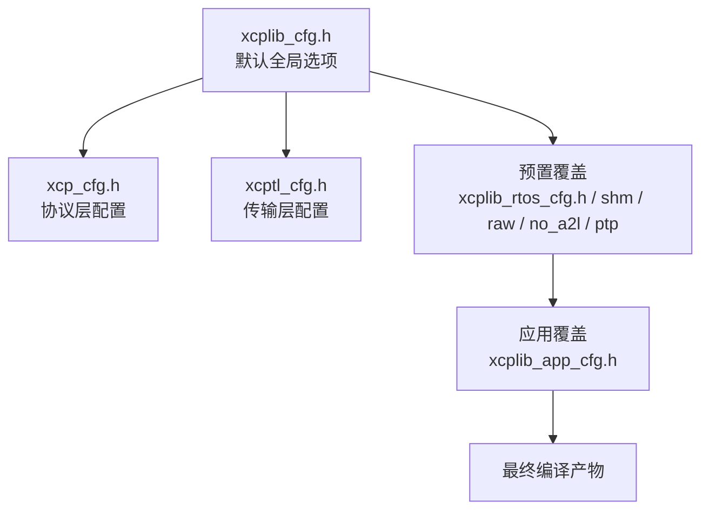
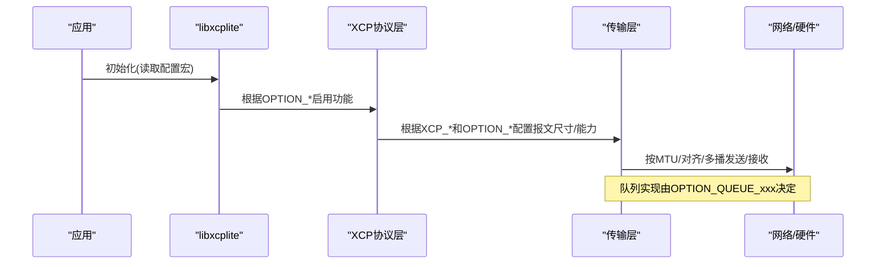

# 配置选项参考

<cite>
**本文引用的文件**
- [src/xcplib_cfg.h](file://src/xcplib_cfg.h)
- [src/xcp_cfg.h](file://src/xcp_cfg.h)
- [src/xcptl_cfg.h](file://src/xcptl_cfg.h)
- [src/xcplib_rtos_cfg.h](file://src/xcplib_rtos_cfg.h)
- [src/xcplib_shm_cfg.h](file://src/xcplib_shm_cfg.h)
- [src/xcplib_raw_cfg.h](file://src/xcplib_raw_cfg.h)
- [src/xcplib_no_a2l_cfg.h](file://src/xcplib_no_a2l_cfg.h)
- [src/xcplib_ptp_cfg.h](file://src/xcplib_ptp_cfg.h)
- [examples/fetchcontent_example/config/xcplib_app_cfg.h](file://examples/fetchcontent_example/config/xcplib_app_cfg.h)
- [docs/xcplib_cfg.md](file://docs/xcplib_cfg.md)
- [docs/BUILDING.md](file://docs/BUILDING.md)
</cite>

## 目录
1. [简介](#简介)
2. [项目结构](#项目结构)
3. [核心组件](#核心组件)
4. [架构总览](#架构总览)
5. [详细组件分析](#详细组件分析)
6. [依赖关系与兼容性](#依赖关系与兼容性)
7. [性能考量](#性能考量)
8. [故障排查指南](#故障排查指南)
9. [结论](#结论)
10. [附录：推荐配置方案](#附录推荐配置方案)

## 简介
本参考文档系统化梳理 XCPlite 的编译时配置宏、运行时参数以及平台特定设置，覆盖内存、线程、传输层、DAQ、校准、A2L/ELF、时钟与时间同步等各个方面。同时提供不同部署场景下的推荐配置与优化建议，并说明各选项之间的依赖与兼容性约束，帮助读者快速定位并正确配置 XCPlite。

## 项目结构
XCPlite 的配置体系由“默认配置 + 预置覆盖 + 应用覆盖”三层组成：
- 默认配置：src/xcplib_cfg.h（通用选项）、src/xcp_cfg.h（协议层）、src/xcptl_cfg.h（传输层）
- 预置覆盖：src/xcplib_*.cfg.h（如 rtos、shm、raw、no_a2l、ptp），通过 CMake 变量选择
- 应用覆盖：用户自定义 xcplib_app_cfg.h，通过 XCPLITE_CFG_OVERRIDE 注入

图表来源
- [src/xcplib_cfg.h:1-204](file://src/xcplib_cfg.h#L1-L204)
- [src/xcp_cfg.h:1-457](file://src/xcp_cfg.h#L1-L457)
- [src/xcptl_cfg.h:1-143](file://src/xcptl_cfg.h#L1-L143)
- [docs/BUILDING.md:12-24](file://docs/BUILDING.md#L12-L24)

章节来源
- [docs/BUILDING.md:12-24](file://docs/BUILDING.md#L12-L24)
- [docs/xcplib_cfg.md:24-28](file://docs/xcplib_cfg.md#L24-L28)

## 核心组件
- 全局配置入口：xcplib_cfg.h
  - 日志、时钟、服务器开关、校准段管理、DAQ、A2L/ELF、队列实现选择、测试开关等
- 协议层配置：xcp_cfg.h
  - 版本、地址扩展、协议特性、DAQ特性、校准段特性、时钟与PTP、调试检查
- 传输层配置：xcptl_cfg.h
  - 传输版本、CTO/DTO大小、分段大小、对齐、收发超时、多播端口、零拷贝头预留等
- 平台/场景覆盖：
  - FreeRTOS：xcplib_rtos_cfg.h
  - 共享内存多应用：xcplib_shm_cfg.h
  - 原始以太网：xcplib_raw_cfg.h
  - 无A2L生成：xcplib_no_a2l_cfg.h
  - PTP支持：xcplib_ptp_cfg.h
- 应用覆盖示例：examples/fetchcontent_example/config/xcplib_app_cfg.h

章节来源
- [src/xcplib_cfg.h:1-204](file://src/xcplib_cfg.h#L1-L204)
- [src/xcp_cfg.h:1-457](file://src/xcp_cfg.h#L1-L457)
- [src/xcptl_cfg.h:1-143](file://src/xcptl_cfg.h#L1-L143)
- [src/xcplib_rtos_cfg.h:1-142](file://src/xcplib_rtos_cfg.h#L1-L142)
- [src/xcplib_shm_cfg.h:1-38](file://src/xcplib_shm_cfg.h#L1-L38)
- [src/xcplib_raw_cfg.h:1-105](file://src/xcplib_raw_cfg.h#L1-L105)
- [src/xcplib_no_a2l_cfg.h:1-56](file://src/xcplib_no_a2l_cfg.h#L1-L56)
- [src/xcplib_ptp_cfg.h:1-31](file://src/xcplib_ptp_cfg.h#L1-L31)
- [examples/fetchcontent_example/config/xcplib_app_cfg.h:1-112](file://examples/fetchcontent_example/config/xcplib_app_cfg.h#L1-L112)

## 架构总览
XCPlite 将配置分为三层：
- 全局层（xcplib_cfg.h）：控制功能开关、内存规模、队列类型、日志级别、时钟源等
- 协议层（xcp_cfg.h）：基于全局层宏派生协议能力、地址模式、DAQ能力、校准段能力、时钟精度
- 传输层（xcptl_cfg.h）：基于全局层宏决定UDP/TCP/Raw、MTU、DTO/CTO尺寸、多播、零拷贝等

图表来源
- [src/xcplib_cfg.h:1-204](file://src/xcplib_cfg.h#L1-L204)
- [src/xcp_cfg.h:1-457](file://src/xcp_cfg.h#L1-L457)
- [src/xcptl_cfg.h:1-143](file://src/xcptl_cfg.h#L1-L143)

## 详细组件分析

### 全局配置（xcplib_cfg.h）
- 日志
  - OPTION_ENABLE_DBG_PRINTS/OPTION_ENABLE_DBG_STDERR/OPTION_DEFAULT_DBG_LEVEL/OPTION_MAX_DBG_LEVEL/OPTION_FIXED_DBG_LEVEL
- 时钟
  - OPTION_CLOCK_EPOCH_ARB/OPTION_CLOCK_EPOCH_PTP
  - OPTION_CLOCK_TICKS_1NS/OPTION_CLOCK_TICKS_1US
  - Windows原子模拟：OPTION_ATOMIC_EMULATION
- 服务器
  - OPTION_ENABLE_TCP/OPTION_ENABLE_UDP/OPTION_MTU/OPTION_SERVER_FORCEFULL_TERMINATION
- 校准段
  - OPTION_CAL_SEGMENTS/OPTION_CAL_SEGMENT_COUNT/OPTION_CAL_MEM_SIZE
  - OPTION_CAL_SEGMENTS_SINGLE_PAGE/OPTION_CAL_SEGMENT_EPK/OPTION_CAL_SEGMENTS_ABS
  - OPTION_CAL_SEGMENTS_START_ON_REFERENCE_PAGE/OPTION_CAL_PERSIST_ON_DISCONNECT
  - 持久化：OPTION_ENABLE_PERSISTENCE
- DAQ
  - OPTION_DAQ_EVENT_LIST/OPTION_DAQ_EVENT_COUNT/OPTION_DAQ_MEM_SIZE
  - 队列实现：OPTION_QUEUE_64_VAR_SIZE/OPTION_QUEUE_64_FIX_SIZE/OPTION_QUEUE_32（在32位或原子模拟时强制32位队列）
- A2L/ELF
  - OPTION_ENABLE_A2L_GENERATOR/OPTION_ENABLE_A2L_UPLOAD/OPTION_ENABLE_ELF_UPLOAD
  - OPTION_ENABLE_GET_LOCAL_ADDR
- 测试
  - 多种测试宏（NDEBUG下可选）

章节来源
- [src/xcplib_cfg.h:42-189](file://src/xcplib_cfg.h#L42-L189)

### 协议层配置（xcp_cfg.h）
- 版本与特性
  - XCP_DRIVER_VERSION/XCP_PROTOCOL_LAYER_VERSION/XCP_ENABLE_PROTOCOL_LAYER_ETH
  - EPK/项目名/A2L文件名长度限制
- 地址扩展与寻址模式
  - 绝对/相对/动态/应用/段相对等多种模式，依据是否启用校准段列表、SHM模式、绝对寻址等组合推导
  - 动态地址编码/解码宏、事件位宽与偏移位宽
- 协议命令
  - 校准页管理（GET/SET/COPY/FREEZE）、校验和、种子密钥、SERV_TEXT、IDT上传（A2L/ELF）、用户命令
- DAQ
  - 每个ODT独立地址扩展、静态表内存、事件控制、过跑指示、停止后队列刷新超时
- 校准段管理
  - 懒写模式、获取空闲页超时
- 时钟与PTP
  - 64位时间戳、单位与刻度、PTP支持、默认UUID、多播时钟（不推荐）
- 调试
  - 扩展错误检查

章节来源
- [src/xcp_cfg.h:17-457](file://src/xcp_cfg.h#L17-L457)

### 传输层配置（xcptl_cfg.h）
- 传输能力
  - 基于OPTION_ENABLE_TCP/UDP/UDP_RAW推导XCPTL_ENABLE_TCP/UDP
  - Raw与TCP/UDP互斥；Raw要求32位队列且不支持SHM模式
- 报文尺寸与分段
  - XCPTL_MAX_CTO_SIZE/XCPTL_MAX_DTO_SIZE/XCPTL_MAX_SEGMENT_SIZE
  - 分段大小由OPTION_MTU推导并对齐到8字节边界
- 对齐与头部预留
  - XCPTL_PACKET_ALIGNMENT=4
  - 零拷贝头预留：XCPTL_TX_HEADROOM（Raw+零拷贝时启用）
- 收发行为
  - 接收超时：XCPTL_RECV_TIMEOUT_MS
  - CRM走队列或低延迟路径（可选项）
  - 计数器处理（可选项）
- 多播
  - 可选开启，端口默认5557

章节来源
- [src/xcptl_cfg.h:16-143](file://src/xcptl_cfg.h#L16-L143)

### 平台/场景覆盖

#### FreeRTOS（xcplib_rtos_cfg.h）
- 任务栈与优先级、lwIP socket API
- 关闭stderr输出
- 时钟分辨率改为1us，任意epoch
- 禁用TCP，保持UDP；标准MTU 1500；禁用强制终止
- 校准段：保留管理，减少计数与内存；绝对寻址；禁用持久化
- DAQ：禁用动态事件列表，减小表内存与事件数；强制32位队列（临界区）
- 禁用在线A2L/ELF上传

章节来源
- [src/xcplib_rtos_cfg.h:44-142](file://src/xcplib_rtos_cfg.h#L44-L142)

#### 共享内存多应用（xcplib_shm_cfg.h）
- 启用OPTION_SHM_MODE，使用多应用绝对寻址模式
- 需要POSIX平台；示例包含shmtool/xcpdaemon

章节来源
- [src/xcplib_shm_cfg.h:1-38](file://src/xcplib_shm_cfg.h#L1-L38)

#### 原始以太网（xcplib_raw_cfg.h）
- 仅UDP_RAW，禁用TCP/UDP；强制32位队列
- MTU 1420，预留空间避免超帧；零拷贝头预留
- 接口名、ICMP回显、UDP校验策略、接收校验验证、可选免费ARP

章节来源
- [src/xcplib_raw_cfg.h:33-105](file://src/xcplib_raw_cfg.h#L33-L105)

#### 无A2L生成（xcplib_no_a2l_cfg.h）
- 禁用在线A2L生成与上传；可选ELF上传
- 校准段绝对寻址；禁用持久化；禁用动态事件列表

章节来源
- [src/xcplib_no_a2l_cfg.h:32-56](file://src/xcplib_no_a2l_cfg.h#L32-L56)

#### PTP支持（xcplib_ptp_cfg.h）
- 启用套接字硬件时间戳（Linux，需网卡支持）

章节来源
- [src/xcplib_ptp_cfg.h:1-31](file://src/xcplib_ptp_cfg.h#L1-L31)

### 应用覆盖示例（xcplib_app_cfg.h）
- 降低日志级别与最大级别以节省空间
- 禁用校准段管理与持久化；若启用则采用绝对寻址并限制数量/内存
- 禁用在线A2L/ELF上传；禁用动态事件列表
- 仅UDP，标准MTU 1500；强制32位队列

章节来源
- [examples/fetchcontent_example/config/xcplib_app_cfg.h:32-112](file://examples/fetchcontent_example/config/xcplib_app_cfg.h#L32-L112)

## 依赖关系与兼容性
- 队列与传输互斥
  - Raw传输必须使用32位队列；64位队列的向量化发送路径在Raw中不可用
  - Raw与TCP/UDP互斥；Raw不支持SHM模式
- 地址模式与校准段
  - 启用段相对寻址需同时启用校准段列表；EPK段仅在启用相关选项时生效
  - SHM模式使用多应用绝对寻址；非SHM模式下根据是否启用校准段列表与绝对寻址标志推导具体模式
- 时钟与时间同步
  - PTP支持需平台具备硬件时间戳能力；多播时钟同步不推荐
- 日志与调试
  - 固定日志级别会裁剪更高调试级别的代码；嵌入式目标通常关闭stderr
- 构建配置
  - 不同配置（default/no_a2l/ptp/shm/rtos/raw）相互独立，需分别构建目录

章节来源
- [src/xcptl_cfg.h:23-32](file://src/xcptl_cfg.h#L23-L32)
- [src/xcp_cfg.h:127-170](file://src/xcp_cfg.h#L127-L170)
- [src/xcp_cfg.h:436-449](file://src/xcp_cfg.h#L436-L449)
- [docs/BUILDING.md:12-24](file://docs/BUILDING.md#L12-L24)

## 性能考量
- 队列选择
  - 64位无锁可变长队列适合高性能主机；32位有锁队列用于32位平台或Raw传输
  - 固定大小队列在缓存行对齐时可获得更好吞吐，但可能浪费内存
- DTO/CTO与MTU
  - 合理设置XCPTL_MAX_DTO_SIZE与OPTION_MTU，避免分片；注意链路MTU与DF位
- 校准段懒写
  - 提升批量更新吞吐，但单次写入延迟增加；对极端低延迟场景可考虑关闭
- 日志级别
  - 生产环境建议降低日志级别与最大级别以减少开销
- 多播与PTP
  - 多播会增加额外线程与socket开销；PTP在具备硬件时间戳时更优

[本节为通用指导，不直接分析具体文件]

## 故障排查指南
- 构建期错误
  - 未定义必要宏（如CLOCK_TICKS_PER_S、XAQP_MAX_EVENT_COUNT等）会导致编译失败
  - Raw与TCP/UDP混用、Raw与SHM混用会触发编译错误
- 运行期问题
  - MTU过大导致sendto返回EMSGSIZE；需在链路允许范围内调整
  - 队列过小导致丢包或阻塞，应增大queueInit缓冲区
  - 校准段获取空闲页超时，检查并发写入与持久化配置
- 工具兼容
  - 旧版CANape可能需要COPY_CAL_PAGE兼容处理；可通过OPTION_CANAPE_24控制
  - 多播时钟同步不被所有工具支持，谨慎启用

章节来源
- [src/xcp_cfg.h:414-428](file://src/xcp_cfg.h#L414-L428)
- [src/xcptl_cfg.h:61-82](file://src/xcptl_cfg.h#L61-L82)
- [src/xcp_cfg.h:304-308](file://src/xcp_cfg.h#L304-L308)

## 结论
XCPlite 提供了高度可配置的编译时与运行时选项，适配从嵌入式FreeRTOS到高性能主机的多种部署场景。通过“默认配置 + 预置覆盖 + 应用覆盖”的分层设计，可在保证兼容性的前提下精细调优内存、吞吐、延迟与功能集。建议根据目标平台与需求选择合适的预置覆盖，并在应用覆盖中进一步收敛功能与资源占用。

[本节为总结性内容，不直接分析具体文件]

## 附录：推荐配置方案

### 典型部署场景与推荐配置
- 主机开发/测试（Linux/macOS/QNX）
  - 使用 default 配置；启用TCP/UDP；按需开启A2L/ELF上传；使用64位无锁队列；日志级别适中
  - 参考：[src/xcplib_cfg.h:74-189](file://src/xcplib_cfg.h#L74-L189)
- 嵌入式FreeRTOS
  - 使用 rtos 配置；禁用TCP与在线A2L/ELF上传；1us时钟；标准MTU；32位队列；减小DAQ与校准段规模
  - 参考：[src/xcplib_rtos_cfg.h:44-142](file://src/xcplib_rtos_cfg.h#L44-L142)
- 无TCP/IP栈（Raw以太网）
  - 使用 raw 配置；仅UDP_RAW；强制32位队列；MTU 1420；零拷贝头预留；开启ICMP回显便于联调
  - 参考：[src/xcplib_raw_cfg.h:33-105](file://src/xcplib_raw_cfg.h#L33-L105)
- 多应用共享内存
  - 使用 shm 配置；启用多应用绝对寻址；配合shmtool/xcpdaemon
  - 参考：[src/xcplib_shm_cfg.h:28-38](file://src/xcplib_shm_cfg.h#L28-L38)
- 外部A2L生成
  - 使用 no_a2l 配置；禁用在线A2L生成与上传；可选ELF上传；绝对寻址
  - 参考：[src/xcplib_no_a2l_cfg.h:32-56](file://src/xcplib_no_a2l_cfg.h#L32-L56)
- 高精度时间同步
  - 使用 ptp 配置；启用硬件时间戳；结合PTP grandmaster
  - 参考：[src/xcplib_ptp_cfg.h:1-31](file://src/xcplib_ptp_cfg.h#L1-L31)

### 关键优化建议
- 内存
  - 根据信号数量估算OPTION_DAQ_MEM_SIZE（每信号约5-6字节）；校准段内存按页面与数量估算
  - 参考：[src/xcplib_cfg.h:120-137](file://src/xcplib_cfg.h#L120-L137)
- 吞吐与延迟
  - 主机优先使用64位无锁队列；嵌入式使用32位队列并尽量提高队列缓冲
  - 合理设置XCPTL_MAX_DTO_SIZE与OPTION_MTU，避免分片
  - 参考：[src/xcptl_cfg.h:37-59](file://src/xcptl_cfg.h#L37-L59)
- 可靠性
  - 启用扩展错误检查；在生产环境降低日志级别；必要时启用持久化
  - 参考：[src/xcp_cfg.h:454-457](file://src/xcp_cfg.h#L454-L457)
- 兼容性
  - 针对旧版CANape启用兼容处理；多播时钟同步谨慎启用
  - 参考：[src/xcp_cfg.h:304-308](file://src/xcp_cfg.h#L304-L308), [src/xcp_cfg.h:443-449](file://src/xcp_cfg.h#L443-L449)

章节来源
- [docs/xcplib_cfg.md:30-64](file://docs/xcplib_cfg.md#L30-L64)
- [docs/xcplib_cfg.md:66-94](file://docs/xcplib_cfg.md#L66-L94)
- [docs/xcplib_cfg.md:96-175](file://docs/xcplib_cfg.md#L96-L175)