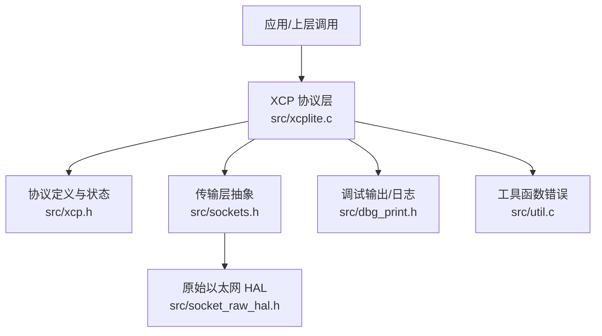
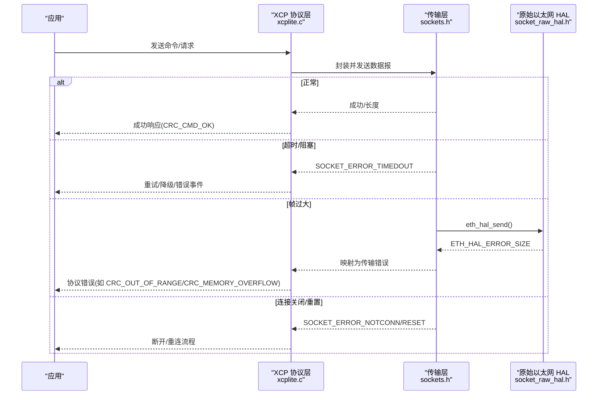
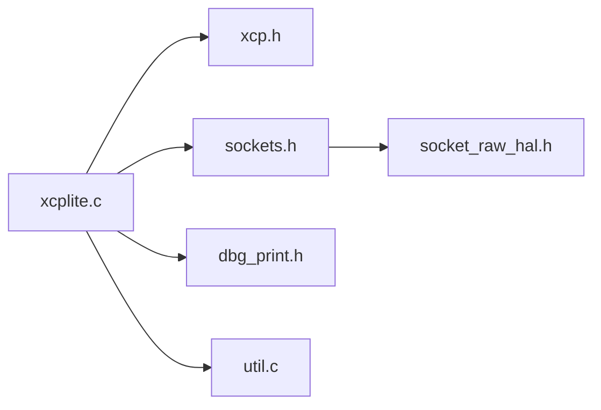
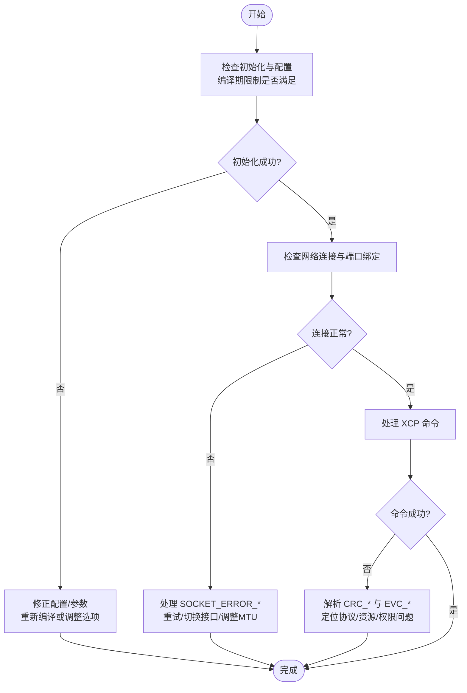

# 错误码和状态

<cite>
**本文引用的文件**
- [xcp.h](file://src/xcp.h)
- [sockets.h](file://src/sockets.h)
- [socket_raw_hal.h](file://src/socket_raw_hal.h)
- [dbg_print.h](file://src/dbg_print.h)
- [xcplite.c](file://src/xcplite.c)
- [util.c](file://src/util.c)
</cite>

## 目录
1. [简介](#简介)
2. [项目结构](#项目结构)
3. [核心组件](#核心组件)
4. [架构总览](#架构总览)
5. [详细组件分析](#详细组件分析)
6. [依赖关系分析](#依赖关系分析)
7. [性能考虑](#性能考虑)
8. [故障排查指南](#故障排查指南)
9. [结论](#结论)
10. [附录](#附录)

## 简介
本参考文档聚焦于 XCPlite 的错误码与状态管理，覆盖协议层、传输层、原始以太网 HAL 以及调试输出等关键路径。内容包含：
- XCP 协议命令返回码（CRC_*）与事件码（EVC_*）
- 会话状态位（SS_*）与 DAQ/PAG/PGM 相关状态
- 网络通信错误（SOCKET_ERROR_*）与原始以太网 HAL 错误（ETH_HAL_ERROR*）
- 初始化与配置校验错误、内存与资源限制、超时与阻塞处理
- 错误诊断流程、常见原因分析与恢复策略
- 调试技巧与日志级别控制

## 项目结构
围绕错误与状态的关键头文件与实现分布如下：
- 协议定义与状态：src/xcp.h
- 传输层抽象与平台错误：src/sockets.h
- 原始以太网 HAL 接口与错误：src/socket_raw_hal.h
- 调试打印与日志级别：src/dbg_print.h
- 协议层主循环与错误分发：src/xcplite.c
- 工具函数中的特定错误码：src/util.c

**图示来源**
- [xcplite.c:185-200](file://src/xcplite.c#L185-L200)
- [xcp.h:132-183](file://src/xcp.h#L132-L183)
- [sockets.h:87-112](file://src/sockets.h#L87-L112)
- [socket_raw_hal.h:65-100](file://src/socket_raw_hal.h#L65-L100)
- [dbg_print.h:19-85](file://src/dbg_print.h#L19-L85)

**章节来源**
- [xcp.h:132-183](file://src/xcp.h#L132-L183)
- [sockets.h:87-112](file://src/sockets.h#L87-L112)
- [socket_raw_hal.h:65-100](file://src/socket_raw_hal.h#L65-L100)
- [dbg_print.h:19-85](file://src/dbg_print.h#L19-L85)
- [xcplite.c:185-200](file://src/xcplite.c#L185-L200)

## 核心组件
- XCP 协议层：定义命令、响应、错误码、事件码、会话状态、DAQ/PAG/PGM 模式与属性等。
- 传输层抽象：统一 TCP/UDP/原始以太网在不同平台的错误语义，提供错误字符串与宏判断。
- 原始以太网 HAL：面向无协议栈目标的最小帧收发接口，明确帧大小限制与错误分类。
- 调试输出：可配置的日志级别与错误/警告输出宏，支持运行时或编译时固定级别。
- 工具函数：线性回归等算法的输入/数值错误码。

**章节来源**
- [xcp.h:132-183](file://src/xcp.h#L132-L183)
- [sockets.h:87-112](file://src/sockets.h#L87-L112)
- [socket_raw_hal.h:65-100](file://src/socket_raw_hal.h#L65-L100)
- [dbg_print.h:19-85](file://src/dbg_print.h#L19-L85)
- [util.c:270-299](file://src/util.c#L270-L299)

## 架构总览
下图展示从应用到协议层再到传输层/HAL 的错误传播路径，以及关键错误类型在链路中的定位。

**图示来源**
- [sockets.h:97-112](file://src/sockets.h#L97-L112)
- [socket_raw_hal.h:65-100](file://src/socket_raw_hal.h#L65-L100)
- [xcp.h:140-166](file://src/xcp.h#L140-L166)

## 详细组件分析

### XCP 协议错误码与事件码
- 命令返回码（CRC_*）：涵盖成功、忙、未知命令、语法错误、越界、写保护、访问拒绝、锁定、页/段无效、序列错误、DAQ 配置错误、内存溢出、通用错误、校验失败、资源暂时不可用、子命令未知、时间关联状态变更等。
- 事件码（EVC_*）：用于异步通知，如恢复模式、清空/存储 DAQ、存储校准、命令挂起、DAQ 过载、会话终止、时间同步、刺激超时、休眠/唤醒、ECU 状态、用户事件、传输事件等。
- 服务请求码（SERV_*）：服务器请求复位、文本消息等。

典型使用场景：
- 命令执行失败时返回对应 CRC_*，由上层转换为应用可读的错误信息。
- 异步事件通过 PID_EV 上报，触发上层状态机调整（如暂停/恢复采集）。

**章节来源**
- [xcp.h:132-183](file://src/xcp.h#L132-L183)

### 会话与模块状态（SS_*、DAQ/PAG/PGM）
- 会话状态位（SS_*）：低字节表示请求/标志（如存储校准/DAQ、清除 DAQ、配置丢失），高字节表示内部状态（块上传中、遗留模式、已启动/已连接/已激活）。
- DAQ 列表模式与状态：交替显示、方向、DTO CTR、时间戳、PID 开关、运行/停止/选择/溢出等。
- PAG/PGM 属性与访问模式：压缩/加密/非顺序编程支持、页面/段模式等。

这些状态影响命令合法性检查与资源分配策略，例如在 SS_DAQ 或 PGM_ACTIVE 时某些写入操作可能被拒绝。

**章节来源**
- [xcp.h:226-464](file://src/xcp.h#L226-L464)

### 传输层错误（SOCKET_ERROR_*）
- 自包含错误码（原始以太网路径）：NONE、TIMEDOUT、BADF、NOTCONN、HAL、TOOBIG、NOPEER、MSGSIZE。
- POSIX/Windows 错误映射：ABORT、RESET、INTR、TIMEDOUT、WBLOCK、PIPE、BADF、NOTCONN、MSGSIZE。
- 辅助宏：socketIsClosed、socketWouldBlock、socketTimeout，便于统一处理不同平台的差异。
- 错误字符串：socketGetErrorString 提供人类可读描述。

处理要点：
- 超时（TIMEDOUT/WOULD_BLOCK）应允许后台任务继续，避免死锁。
- 连接关闭/重置（NOTCONN/ABORT/RESET/BADF）需退出接收循环并清理资源。
- 报文过大（MSGSIZE/TOOBIG）需降低 MTU 或分片策略（若支持）。

**章节来源**
- [sockets.h:97-112](file://src/sockets.h#L97-L112)
- [sockets.h:152-192](file://src/sockets.h#L152-L192)
- [sockets.h:217-219](file://src/sockets.h#L217-L219)

### 原始以太网 HAL 错误（ETH_HAL_ERROR*）
- ETH_HAL_ERROR：通用硬件/后端错误。
- ETH_HAL_ERROR_SIZE：帧超过链路承载能力，属于配置问题而非瞬时错误；无分片机制。

HAL 收发的线程契约与帧尺寸约束确保错误可追溯至具体后端（Linux AF_PACKET 等）。

**章节来源**
- [socket_raw_hal.h:65-100](file://src/socket_raw_hal.h#L65-L100)

### 调试输出与日志级别（DBG_*）
- 日志级别：错误(1)、警告(2)、信息(3)、跟踪(4)、调试(5/6)。
- 运行时或编译时固定级别：可通过 OPTION_FIXED_DBG_LEVEL 或默认级别控制。
- 错误/警告宏：支持标准输出或 stderr，可选包含文件与行号。
- 条件编译：当未启用调试输出时，所有 DBG_* 宏为空实现，零开销。

建议：
- 生产环境使用较低日志级别，仅保留错误与警告。
- 定位问题时临时提升级别，结合错误码快速收敛问题域。

**章节来源**
- [dbg_print.h:19-85](file://src/dbg_print.h#L19-L85)
- [dbg_print.h:97-147](file://src/dbg_print.h#L97-L147)
- [dbg_print.h:196-243](file://src/dbg_print.h#L196-L243)

### 初始化与配置校验错误
- 编译期限制检查：CTO/DTO 最大尺寸、DAQ 内存大小、名称长度奇偶性等。
- 地址模式必须显式定义，否则编译失败。
- 这些检查在 xcplite.c 中集中进行，确保构建时即发现不合法配置。

**章节来源**
- [xcplite.c:95-158](file://src/xcplite.c#L95-L158)

### 工具函数错误（线性回归）
- 输入值错误：输入值非法导致无法计算。
- 数值错误：数值范围或精度问题。
- 适用于信号处理与滤波场景的错误反馈。

**章节来源**
- [util.c:270-299](file://src/util.c#L270-L299)

## 依赖关系分析
错误码与状态的依赖关系如下：
- 协议层（xcplite.c）依赖 xcp.h 的状态与错误码，驱动命令处理与响应生成。
- 传输层（sockets.h）屏蔽平台差异，向上提供一致的错误语义。
- 原始以太网 HAL（socket_raw_hal.h）作为底层接口，将物理链路限制转化为错误码。
- 调试输出（dbg_print.h）贯穿各层，提供一致的日志格式与级别控制。
- 工具函数（util.c）在数据处理路径中返回细粒度错误，供上层决策。

**图示来源**
- [xcplite.c:185-200](file://src/xcplite.c#L185-L200)
- [xcp.h:132-183](file://src/xcp.h#L132-L183)
- [sockets.h:87-112](file://src/sockets.h#L87-L112)
- [socket_raw_hal.h:65-100](file://src/socket_raw_hal.h#L65-L100)
- [dbg_print.h:19-85](file://src/dbg_print.h#L19-L85)
- [util.c:270-299](file://src/util.c#L270-L299)

**章节来源**
- [xcplite.c:185-200](file://src/xcplite.c#L185-L200)
- [xcp.h:132-183](file://src/xcp.h#L132-L183)
- [sockets.h:87-112](file://src/sockets.h#L87-L112)
- [socket_raw_hal.h:65-100](file://src/socket_raw_hal.h#L65-L100)
- [dbg_print.h:19-85](file://src/dbg_print.h#L19-L85)
- [util.c:270-299](file://src/util.c#L270-L299)

## 性能考虑
- 超时与阻塞：合理设置 socketSetTimeout，避免长时间阻塞导致吞吐下降；在超时时执行后台任务保持系统响应性。
- 帧大小与 MTU：原始以太网路径下，ETH_HAL_ERROR_SIZE 表明链路无法承载当前帧，需调整 MTU 或优化数据包结构。
- 日志级别：生产环境降低日志级别以减少 I/O 开销；仅在调试阶段开启更详细日志。
- 资源限制：遵循编译期检查的 CTO/DTO 与 DAQ 内存限制，避免运行时内存溢出。

[本节为通用指导，不直接分析具体文件]

## 故障排查指南

### 错误诊断流程图

**图示来源**
- [sockets.h:97-112](file://src/sockets.h#L97-L112)
- [xcp.h:132-183](file://src/xcp.h#L132-L183)
- [xcplite.c:95-158](file://src/xcplite.c#L95-L158)

### 常见错误原因与解决方案
- 初始化错误
  - 现象：编译期报错或运行时初始化失败。
  - 原因：CTO/DTO 尺寸不合法、DAQ 内存不足、名称长度不符合要求、地址模式未定义。
  - 解决：依据编译期检查修正配置，确保满足最小/最大限制。
  - 参考：[xcplite.c:95-158](file://src/xcplite.c#L95-L158)

- 内存分配/资源限制错误
  - 现象：CRC_MEMORY_OVERFLOW、资源暂时不可用。
  - 原因：DAQ/校准区容量不足、页/段资源耗尽。
  - 解决：增大内存池、减少 ODT/条目数量、释放未使用资源。
  - 参考：[xcp.h:140-166](file://src/xcp.h#L140-L166)

- 网络通信错误
  - 现象：SOCKET_ERROR_TIMEDOUT、NOTCONN、RESET、MSGSIZE。
  - 原因：对端断开、链路拥塞、MTU 过大、防火墙拦截。
  - 解决：调整超时、重连、降低 MTU、检查路由与防火墙。
  - 参考：[sockets.h:97-112](file://src/sockets.h#L97-L112), [sockets.h:152-192](file://src/sockets.h#L152-L192)

- 原始以太网 HAL 错误
  - 现象：ETH_HAL_ERROR、ETH_HAL_ERROR_SIZE。
  - 原因：后端不可用、帧超过链路承载能力。
  - 解决：检查后端状态、调整 MTU、确认网卡驱动支持。
  - 参考：[socket_raw_hal.h:65-100](file://src/socket_raw_hal.h#L65-L100)

- 协议错误
  - 现象：CRC_CMD_UNKNOWN、CRC_CMD_SYNTAX、CRC_OUT_OF_RANGE、CRC_WRITE_PROTECTED、CRC_ACCESS_DENIED、CRC_SEQUENCE。
  - 原因：未知命令、参数非法、越界、写保护、访问被拒、序列错乱。
  - 解决：核对命令与参数、检查会话状态（SS_*）、解锁/授权、重同步。
  - 参考：[xcp.h:140-166](file://src/xcp.h#L140-L166)

- 事件与状态异常
  - 现象：EVC_DAQ_OVERLOAD、EVC_SESSION_TERMINATED、EVC_STIM_TIMEOUT。
  - 原因：DAQ 过载、会话结束、刺激超时。
  - 解决：降低采集频率、延长超时、检查会话生命周期。
  - 参考：[xcp.h:168-183](file://src/xcp.h#L168-L183)

- 工具函数错误
  - 现象：线性回归输入/数值错误。
  - 原因：输入超出范围或数值不稳定。
  - 解决：预处理数据、增加滤波窗口、检查采样源。
  - 参考：[util.c:270-299](file://src/util.c#L270-L299)

### 错误恢复策略
- 超时重试：对 SOCKET_ERROR_TIMEDOUT 采用指数退避重试，避免风暴。
- 连接重建：对 NOTCONN/RESET/BADF 自动重连，必要时切换接口或端口。
- 帧大小调整：对 MSGBIG/ETH_HAL_ERROR_SIZE 动态降低 MTU 或拆分数据。
- 协议重同步：对序列错误（CRC_SEQUENCE）执行 SYNCH 或重新建立会话。
- 资源回收：释放 DAQ/PAG/PGM 资源，避免长期占用。

### 调试技巧
- 提升日志级别：临时提高 DBG_LEVEL 以捕获更多上下文。
- 启用错误位置：编译时启用 DBG_PRINT_ERROR_LOCATION 以包含文件与行号。
- 使用错误字符串：调用 socketGetErrorString 获取可读描述。
- 关注状态位：读取 SS_* 与 DAQ/PAG/PGM 状态，理解当前模式限制。

**章节来源**
- [xcplite.c:95-158](file://src/xcplite.c#L95-L158)
- [xcp.h:140-183](file://src/xcp.h#L140-L183)
- [sockets.h:97-112](file://src/sockets.h#L97-L112)
- [sockets.h:152-192](file://src/sockets.h#L152-L192)
- [socket_raw_hal.h:65-100](file://src/socket_raw_hal.h#L65-L100)
- [dbg_print.h:87-94](file://src/dbg_print.h#L87-L94)
- [dbg_print.h:217-243](file://src/dbg_print.h#L217-L243)
- [util.c:270-299](file://src/util.c#L270-L299)

## 结论
XCPlite 通过分层设计将协议错误、传输错误与底层 HAL 错误清晰分离，并提供统一的错误语义与调试接口。借助编译期检查、运行时状态位与事件机制，开发者可以快速定位问题并采取恢复措施。建议在工程中：
- 严格遵循配置限制与状态约定
- 合理使用超时与重试策略
- 在生产环境控制日志级别
- 针对原始以太网路径关注帧大小与链路能力

[本节为总结，不直接分析具体文件]

## 附录

### 错误码与状态速查表
- 协议返回码（CRC_*）：成功、忙、未知命令、语法错误、越界、写保护、访问拒绝/锁定、页/段无效、序列错误、DAQ 配置错误、内存溢出、通用错误、校验失败、资源暂时不可用、子命令未知、时间关联状态变更。
- 事件码（EVC_*）：恢复模式、清空/存储 DAQ、存储校准、命令挂起、DAQ 过载、会话终止、时间同步、刺激超时、休眠/唤醒、ECU 状态、用户事件、传输事件。
- 会话状态（SS_*）：存储/清除请求、配置丢失、DAQ 活动、内部状态（块上传、遗留模式、已启动/连接/激活）。
- 传输错误（SOCKET_ERROR_*）：NONE、TIMEDOUT、BADF、NOTCONN、HAL、TOOBIG、NOPEER、MSGSIZE；POSIX/Windows 映射 ABORT、RESET、INTR、WBLOCK、PIPE 等。
- HAL 错误（ETH_HAL_ERROR*）：通用错误、帧过大。
- 工具错误：线性回归输入/数值错误。

**章节来源**
- [xcp.h:140-183](file://src/xcp.h#L140-L183)
- [sockets.h:97-112](file://src/sockets.h#L97-L112)
- [sockets.h:152-192](file://src/sockets.h#L152-L192)
- [socket_raw_hal.h:65-100](file://src/socket_raw_hal.h#L65-L100)
- [util.c:270-299](file://src/util.c#L270-L299)