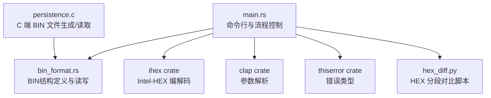
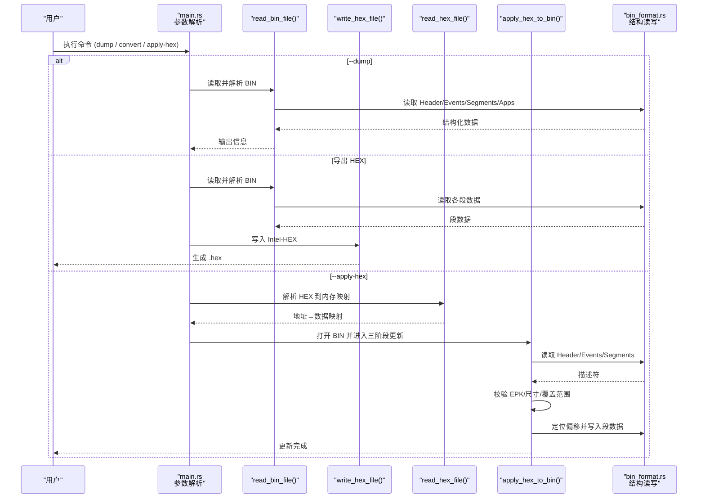
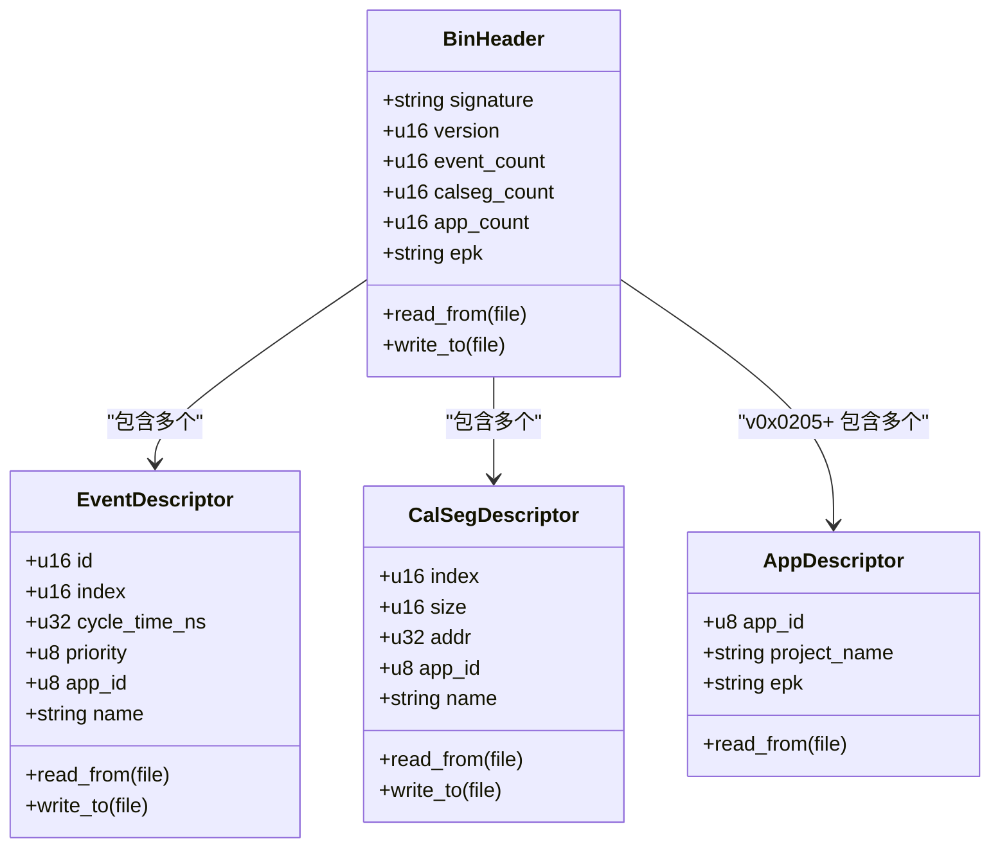
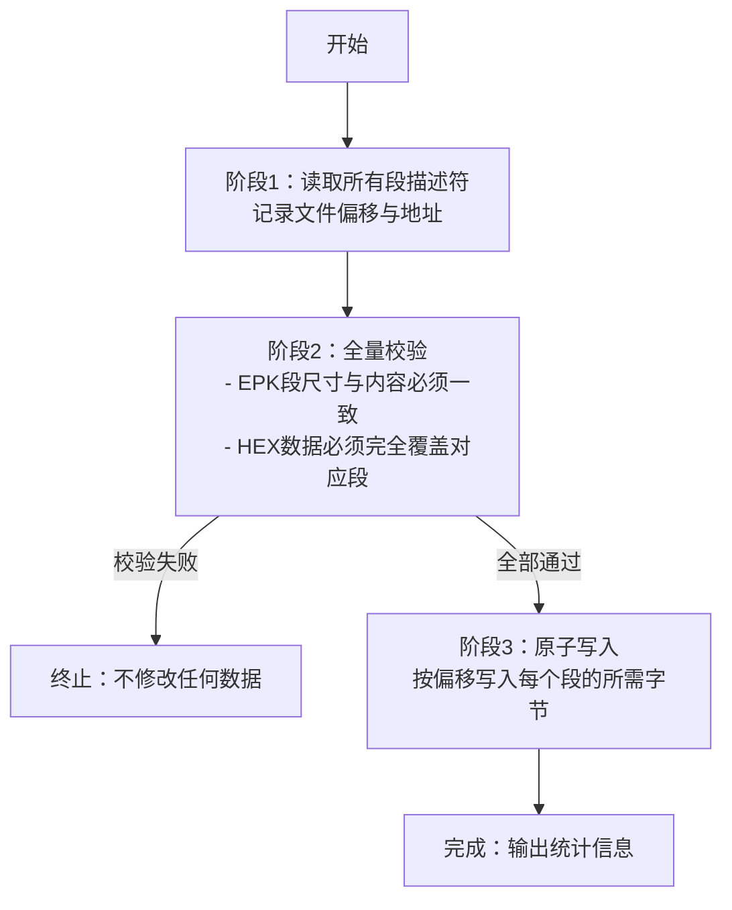
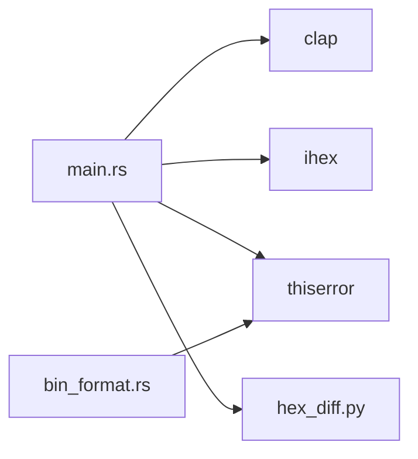

# bintool二进制工具

<cite>
**本文引用的文件**
- [tools/bintool/README.md](file://tools/bintool/README.md)
- [tools/bintool/src/main.rs](file://tools/bintool/src/main.rs)
- [tools/bintool/src/bin_format.rs](file://tools/bintool/src/bin_format.rs)
- [tools/bintool/Cargo.toml](file://tools/bintool/Cargo.toml)
- [tools/bintool/hex_diff.py](file://tools/bintool/hex_diff.py)
- [test/test_bintool.sh](file://test/test_bintool.sh)
- [src/persistence.c](file://src/persistence.c)
</cite>

## 目录
1. [简介](#简介)
2. [项目结构](#项目结构)
3. [核心组件](#核心组件)
4. [架构总览](#架构总览)
5. [详细组件分析](#详细组件分析)
6. [依赖关系分析](#依赖关系分析)
7. [性能与安全性考量](#性能与安全性考量)
8. [故障排查指南](#故障排查指南)
9. [结论](#结论)
10. [附录：命令行参考与使用案例](#附录命令行参考与使用案例)

## 简介
bintool 是 XCPlite 项目的命令行工具，用于处理 XCPlite 的持久化 BIN 文件。它支持以下能力：
- 将 BIN 文件中的校准段数据导出为 Intel-HEX 格式（便于烧录、版本管理）
- 将 Intel-HEX 文件的数据安全地写回 BIN 文件（更新校准段）
- 查看/转储 BIN 文件的头部、事件、校准段信息及十六进制内容
- 提供 HEX 文件对比脚本，辅助差异分析与回归验证

该工具在“应用侧”与“目标端生成的 BIN 文件”之间建立可逆的数据通道，确保校准数据的导入导出、批量处理与完整性校验。

**章节来源**
- [tools/bintool/README.md:1-218](file://tools/bintool/README.md#L1-L218)

## 项目结构
bintool 采用 Rust 实现，核心由两个模块组成：
- main.rs：命令行解析、流程编排、BIN/HEX 读写逻辑
- bin_format.rs：与 C 端一致的 BIN 文件格式定义与读写封装

此外包含：
- Cargo.toml：构建配置与依赖声明
- hex_diff.py：Python 脚本，用于两份 HEX 文件的分段对比
- README.md：使用说明与示例
- test/test_bintool.sh：端到端测试脚本，覆盖从目标设备生成 BIN、通过 XCP 获取 HEX、bintool 转换、回写验证等流程

**图表来源**
- [tools/bintool/src/main.rs:14-21](file://tools/bintool/src/main.rs#L14-L21)
- [tools/bintool/src/bin_format.rs:12-14](file://tools/bintool/src/bin_format.rs#L12-L14)
- [tools/bintool/Cargo.toml:9-12](file://tools/bintool/Cargo.toml#L9-L12)
- [src/persistence.c:40-93](file://src/persistence.c#L40-L93)

**章节来源**
- [tools/bintool/Cargo.toml:1-17](file://tools/bintool/Cargo.toml#L1-L17)
- [tools/bintool/README.md:54-61](file://tools/bintool/README.md#L54-L61)

## 核心组件
- BIN 文件头与描述符：BinHeader、EventDescriptor、CalSegDescriptor、AppDescriptor（v0x0205+）
- 模式切换：
  - 查看模式：--dump [--verbose]
  - 导出模式：默认或指定 --hex
  - 更新模式：--apply-hex <HEX>
- 安全更新机制：三阶段原子更新（读描述符→全量校验→写入），EPK 段保护，完整覆盖校验

**章节来源**
- [tools/bintool/src/bin_format.rs:16-127](file://tools/bintool/src/bin_format.rs#L16-L127)
- [tools/bintool/src/bin_format.rs:129-213](file://tools/bintool/src/bin_format.rs#L129-L213)
- [tools/bintool/src/bin_format.rs:215-294](file://tools/bintool/src/bin_format.rs#L215-L294)
- [tools/bintool/src/bin_format.rs:296-343](file://tools/bintool/src/bin_format.rs#L296-L343)
- [tools/bintool/src/main.rs:440-595](file://tools/bintool/src/main.rs#L440-L595)

## 架构总览
下图展示了 bintool 的核心调用链与数据流：

**图表来源**
- [tools/bintool/src/main.rs:74-172](file://tools/bintool/src/main.rs#L74-L172)
- [tools/bintool/src/main.rs:299-356](file://tools/bintool/src/main.rs#L299-L356)
- [tools/bintool/src/main.rs:358-438](file://tools/bintool/src/main.rs#L358-L438)
- [tools/bintool/src/main.rs:440-595](file://tools/bintool/src/main.rs#L440-L595)
- [tools/bintool/src/bin_format.rs:40-127](file://tools/bintool/src/bin_format.rs#L40-L127)

## 详细组件分析

### BIN 文件格式与数据结构
- 文件头 BinHeader：包含签名、版本、事件数、校准段数、应用数、EPK 字符串等
- 事件 EventDescriptor：事件 ID、索引、周期时间、优先级、所属应用 ID、名称
- 校准段 CalSegDescriptor：段索引、大小、地址、所属应用 ID、名称
- 应用 AppDescriptor（v0x0205+）：应用 ID、项目名称、EPK

这些结构与 C 端 persistence.c 中的 tBinHeader/tBinEvent/tBinCalSeg/tBinApp 一一对应，保证跨语言一致性。

**图表来源**
- [tools/bintool/src/bin_format.rs:16-127](file://tools/bintool/src/bin_format.rs#L16-L127)
- [tools/bintool/src/bin_format.rs:129-213](file://tools/bintool/src/bin_format.rs#L129-L213)
- [tools/bintool/src/bin_format.rs:215-294](file://tools/bintool/src/bin_format.rs#L215-L294)
- [tools/bintool/src/bin_format.rs:296-343](file://tools/bintool/src/bin_format.rs#L296-L343)
- [src/persistence.c:40-93](file://src/persistence.c#L40-L93)

**章节来源**
- [tools/bintool/src/bin_format.rs:16-343](file://tools/bintool/src/bin_format.rs#L16-L343)
- [src/persistence.c:40-93](file://src/persistence.c#L40-L93)

### 字节序与对齐
- 所有结构体使用紧凑布局（packed），避免未对齐访问问题
- 字段按 C 端定义顺序与宽度存储，确保跨平台一致
- 工具通过直接读取原始字节并拷贝到安全包装结构，规避未对齐风险

**章节来源**
- [tools/bintool/src/bin_format.rs:16-27](file://tools/bintool/src/bin_format.rs#L16-L27)
- [tools/bintool/src/bin_format.rs:40-95](file://tools/bintool/src/bin_format.rs#L40-L95)
- [tools/bintool/src/bin_format.rs:152-184](file://tools/bintool/src/bin_format.rs#L152-L184)
- [tools/bintool/src/bin_format.rs:236-266](file://tools/bintool/src/bin_format.rs#L236-L266)

### Intel-HEX 输出规范
- 使用扩展线性地址记录以支持 32 位寻址
- 数据记录按固定块大小（如 32 字节）拆分
- 末尾添加结束记录
- 地址计算基于校准段地址与偏移，保证与目标内存布局一致

**章节来源**
- [tools/bintool/src/main.rs:299-356](file://tools/bintool/src/main.rs#L299-L356)
- [tools/bintool/README.md:174-179](file://tools/bintool/README.md#L174-L179)

### 更新流程与安全策略（HEX → BIN）

**图表来源**
- [tools/bintool/src/main.rs:440-595](file://tools/bintool/src/main.rs#L440-L595)

**章节来源**
- [tools/bintool/src/main.rs:440-595](file://tools/bintool/src/main.rs#L440-L595)
- [tools/bintool/README.md:183-201](file://tools/bintool/README.md#L183-L201)

### 与 XCPlite 校准系统的集成
- 目标端通过 persistence.c 生成/加载 BIN 文件，包含事件与校准段
- bintool 解析同一份 BIN 结构，导出/更新校准段数据
- 支持多应用（app_id）场景下的段归属识别（v0x0205+）
- 可通过 xcpclient 与 bintool 配合，形成“在线采集→离线编辑→回写验证”的闭环

**章节来源**
- [src/persistence.c:133-200](file://src/persistence.c#L133-L200)
- [test/test_bintool.sh:163-203](file://test/test_bintool.sh#L163-L203)
- [test/test_bintool.sh:258-324](file://test/test_bintool.sh#L258-L324)

## 依赖关系分析
- clap：命令行参数解析
- ihex：Intel-HEX 编解码
- thiserror：统一错误类型
- Python 脚本 hex_diff.py：辅助对比两份 HEX 的分段差异

**图表来源**
- [tools/bintool/Cargo.toml:9-12](file://tools/bintool/Cargo.toml#L9-L12)
- [tools/bintool/src/main.rs:14-18](file://tools/bintool/src/main.rs#L14-L18)
- [tools/bintool/src/bin_format.rs:7](file://tools/bintool/src/bin_format.rs#L7)

**章节来源**
- [tools/bintool/Cargo.toml:1-17](file://tools/bintool/Cargo.toml#L1-L17)

## 性能与安全性考量
- 性能
  - 分块写入 Intel-HEX，减少单次 I/O 压力
  - HEX 解析时按地址聚合为段映射，避免重复分配
  - 仅对需要更新的段进行定位与写入，降低磁盘操作
- 安全性
  - 三阶段原子更新：先读后验再写，任一校验失败均不回写
  - EPK 段保护：首段名为 “epk” 时必须尺寸与内容完全匹配
  - 完整覆盖校验：HEX 数据不得小于对应段大小，防止部分更新导致损坏
  - 版本兼容：仅支持当前与遗留版本，拒绝未知格式

**章节来源**
- [tools/bintool/src/main.rs:440-595](file://tools/bintool/src/main.rs#L440-L595)
- [tools/bintool/src/bin_format.rs:72-85](file://tools/bintool/src/bin_format.rs#L72-L85)
- [tools/bintool/README.md:183-201](file://tools/bintool/README.md#L183-L201)

## 故障排查指南
- 常见错误
  - 非法签名或版本：检查 BIN 是否来自正确版本的 XCPlite
  - 段尺寸不匹配：确认 HEX 中对应段数据长度不小于 BIN 段大小
  - EPK 不一致：确保 HEX 中 EPK 段与 BIN 完全一致
  - 无数据：HEX 为空或未包含任何段
- 诊断方法
  - 使用 --dump --verbose 查看 BIN 内部结构与数据
  - 使用 hex_diff.py 对比两份 HEX 的差异，定位具体偏移
  - 检查日志输出，关注阶段2校验失败的具体原因

**章节来源**
- [tools/bintool/src/main.rs:23-39](file://tools/bintool/src/main.rs#L23-L39)
- [tools/bintool/src/main.rs:174-253](file://tools/bintool/src/main.rs#L174-L253)
- [tools/bintool/hex_diff.py:79-177](file://tools/bintool/hex_diff.py#L79-L177)

## 结论
bintool 提供了稳定、安全的 XCPlite 校准数据管理手段，既能将目标端生成的 BIN 导出为标准 Intel-HEX，又能将经过编辑的 HEX 安全回写到 BIN。其严格的三段式更新与 EPK 保护机制，有效避免了误操作导致的校准数据损坏。结合 xcpclient 与 hex_diff.py，可形成完整的“在线采集—离线编辑—回写验证”工作流，适用于校准数据导入导出、固件比较分析、批量数据处理等场景。

[本节为总结性内容，不直接引用具体文件]

## 附录：命令行参考与使用案例

### 命令行选项
- 输入 BIN 文件
  - 位置参数或 --bin
- 输出 HEX 文件
  - --hex（可选，默认派生自输入文件名）
- 查看模式
  - --dump（可搭配 --verbose 显示十六进制数据）
- 更新模式
  - --apply-hex <HEX>（将 HEX 数据写回 BIN）
- 其他
  - --help、--version

注意：--hex、--apply-hex、--dump 互斥。

**章节来源**
- [tools/bintool/README.md:39-50](file://tools/bintool/README.md#L39-L50)
- [tools/bintool/src/main.rs:41-72](file://tools/bintool/src/main.rs#L41-L72)

### 典型用例
- 快速导出 HEX
  - bintool input.bin
  - 自动生成 input.hex
- 查看 BIN 内容
  - bintool input.bin --dump
  - bintool input.bin --dump --verbose
- 将 HEX 更新回 BIN
  - bintool input.bin --apply-hex changes.hex
- 与 xcpclient 联用
  - 通过 xcpclient 从目标设备上传校准段生成 HEX
  - 下载目标端生成的 BIN
  - 使用 bintool 将 BIN 转为 HEX，并与 xcpclient 生成的 HEX 对比
  - 使用 bintool 将 HEX 回写至 BIN，验证往返一致性

**章节来源**
- [tools/bintool/README.md:19-48](file://tools/bintool/README.md#L19-L48)
- [test/test_bintool.sh:163-203](file://test/test_bintool.sh#L163-L203)
- [test/test_bintool.sh:258-324](file://test/test_bintool.sh#L258-L324)
- [test/test_bintool.sh:345-426](file://test/test_bintool.sh#L345-L426)

### 与 XCPlite 校准系统集成的关键点
- 目标端 persistence.c 负责创建/加载 BIN，包含事件与校准段
- bintool 解析同一结构，导出/更新校准段
- 支持多应用（app_id）场景，便于区分不同进程/模块的校准段
- 推荐流程：在线采集（xcpclient）→ 离线编辑（文本/工具）→ 回写验证（bintool）

**章节来源**
- [src/persistence.c:133-200](file://src/persistence.c#L133-L200)
- [tools/bintool/README.md:183-201](file://tools/bintool/README.md#L183-L201)