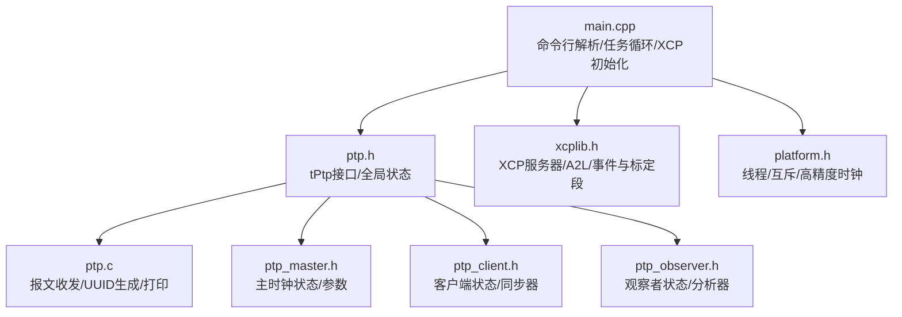
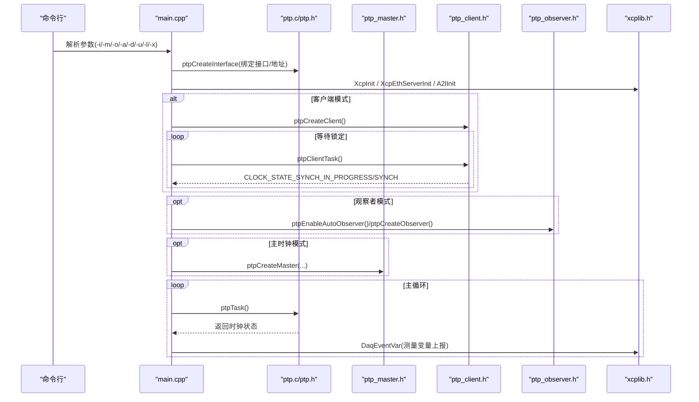
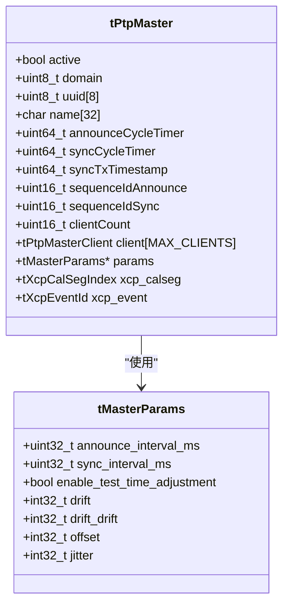
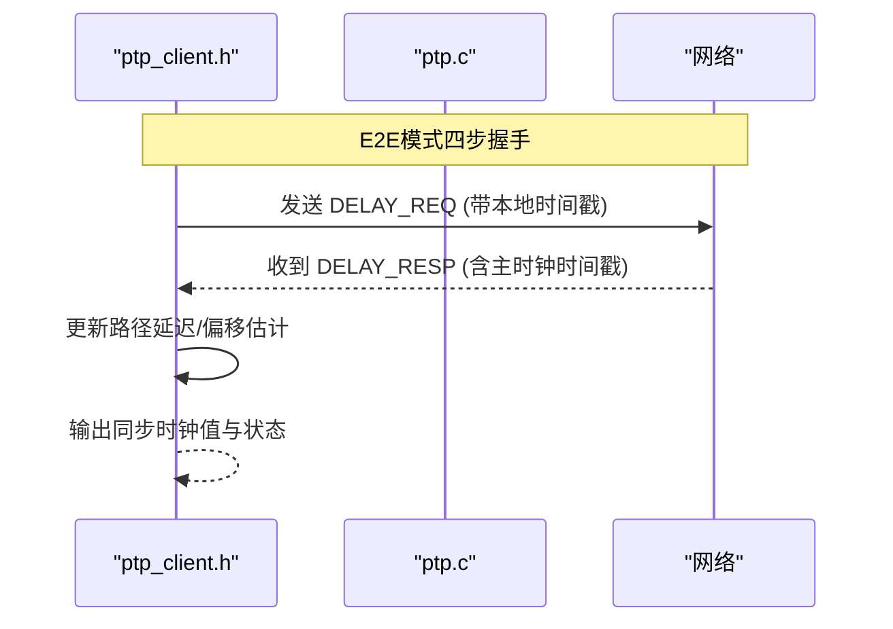
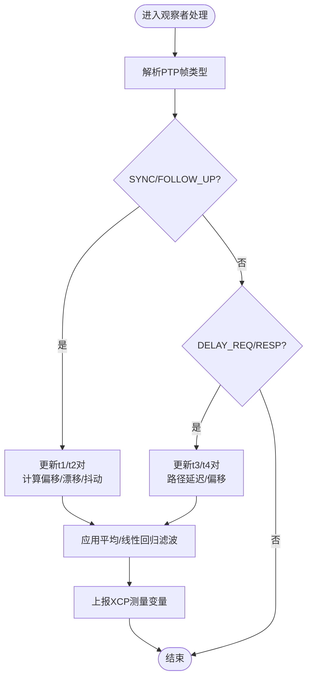
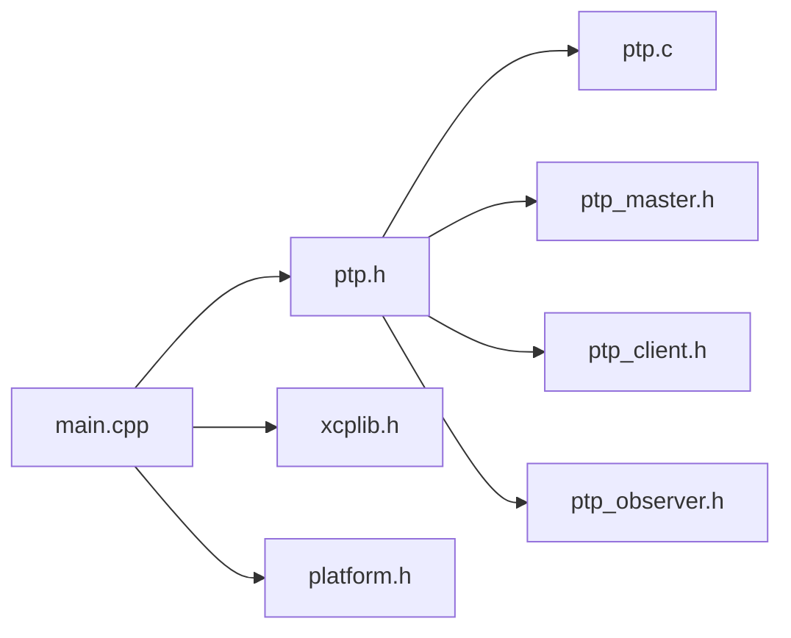
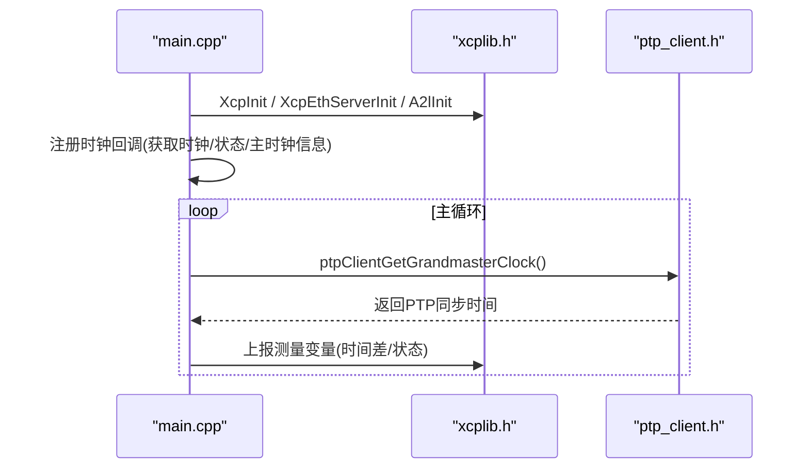

# ptptool时间同步工具

<cite>
**本文引用的文件**
- [tools/ptptool/README.md](file://tools/ptptool/README.md)
- [tools/ptptool/src/main.cpp](file://tools/ptptool/src/main.cpp)
- [tools/ptptool/src/ptp/ptp.h](file://tools/ptptool/src/ptp/ptp.h)
- [tools/ptptool/src/ptp/ptp.c](file://tools/ptptool/src/ptp/ptp.c)
- [tools/ptptool/src/ptp/ptpHdr.h](file://tools/ptptool/src/ptp/ptpHdr.h)
- [tools/ptptool/src/ptp/ptp_master.h](file://tools/ptptool/src/ptp/ptp_master.h)
- [tools/ptptool/src/ptp/ptp_client.h](file://tools/ptptool/src/ptp/ptp_client.h)
- [tools/ptptool/src/ptp/ptp_observer.h](file://tools/ptptool/src/ptp/ptp_observer.h)
- [inc/xcplib.h](file://inc/xcplib.h)
- [src/platform.h](file://src/platform.h)
</cite>

## 目录
1. [简介](#简介)
2. [项目结构](#项目结构)
3. [核心组件](#核心组件)
4. [架构总览](#架构总览)
5. [详细组件分析](#详细组件分析)
6. [依赖关系分析](#依赖关系分析)
7. [性能与精度优化](#性能与精度优化)
8. [部署指南（Linux）](#部署指南linux)
9. [典型使用场景](#典型使用场景)
10. [与XCPlite集成](#与xcplite集成)
11. [故障排查](#故障排查)
12. [结论](#结论)

## 简介
ptptool是一个基于PTP（IEEE 1588-2008 PTPv2，UDP/IPv4 E2E模式）的命令行工具，支持主时钟、从时钟（客户端）、观察者三种角色，并内置XCP测量接口，便于在CANape等上位机中观测和调试PTP同步质量。其能力包括：
- 作为简易PTP主时钟周期性发送SYNC/FOLLOW_UP，响应DELAY_REQUEST，并可注入偏移、漂移、抖动以测试客户端稳定性
- 作为观察者监听网络中的PTP消息，计算主时钟相对本地时钟的漂移与抖动，支持主动/被动模式
- 作为PTP客户端获取主时钟信息并与XCP集成，提供纳秒级时间戳与同步状态上报
- 多节点自动发现与持久化观察列表，便于跨设备对比不同PTP源的质量

该工具适用于分布式测量系统、多设备数据对齐、PTP链路质量评估与校准参数调优等场景。

## 项目结构
ptptool位于tools/ptptool目录，核心由入口main.cpp与ptp子模块组成；ptp子模块包含协议头定义、通用接口、以及主时钟/客户端/观察者三类实现。XCP集成通过libxcplite提供的以太网服务器与A2L生成能力完成。

图表来源
- [tools/ptptool/src/main.cpp:216-617](file://tools/ptptool/src/main.cpp#L216-L617)
- [tools/ptptool/src/ptp/ptp.h:53-103](file://tools/ptptool/src/ptp/ptp.h#L53-L103)
- [tools/ptptool/src/ptp/ptp.c:57-200](file://tools/ptptool/src/ptp/ptp.c#L57-L200)
- [tools/ptptool/src/ptp/ptp_master.h:60-127](file://tools/ptptool/src/ptp/ptp_master.h#L60-L127)
- [tools/ptptool/src/ptp/ptp_client.h:27-72](file://tools/ptptool/src/ptp/ptp_client.h#L27-L72)
- [tools/ptptool/src/ptp/ptp_observer.h:93-163](file://tools/ptptool/src/ptp/ptp_observer.h#L93-L163)
- [inc/xcplib.h:39-58](file://inc/xcplib.h#L39-L58)
- [src/platform.h:470-506](file://src/platform.h#L470-L506)

章节来源
- [tools/ptptool/README.md:1-240](file://tools/ptptool/README.md#L1-L240)
- [tools/ptptool/src/main.cpp:216-617](file://tools/ptptool/src/main.cpp#L216-L617)

## 核心组件
- tPtp接口与任务调度：封装网络套接字、线程、互斥量，统一处理PTP消息分发到各角色处理器，并提供状态打印与关闭流程
- PTP主时钟：按配置周期发送ANNOUNCE/SYNC/FOLLOW_UP，维护连接客户端列表，支持通过XCP动态调整偏移、漂移、漂移变化率、抖动
- PTP客户端：实现E2E模式下的SYNC/FOLLOW_UP与DELAY_REQ/RESP交互，维护路径延迟、主时钟偏移估计，输出同步后的时钟值与状态
- PTP观察者：被动或主动捕获SYNC/FOLLOW_UP（及可选DELAY_REQ），计算漂移、抖动、偏移，支持多主时钟比较与持久化观察列表
- XCP集成：注册时钟回调（当前时钟、状态、主时钟信息），启动以太网服务器与A2L生成，暴露测量变量与标定段供上位机观测/调参

章节来源
- [tools/ptptool/src/ptp/ptp.h:53-103](file://tools/ptptool/src/ptp/ptp.h#L53-L103)
- [tools/ptptool/src/ptp/ptp_master.h:60-127](file://tools/ptptool/src/ptp/ptp_master.h#L60-L127)
- [tools/ptptool/src/ptp/ptp_client.h:27-72](file://tools/ptptool/src/ptp/ptp_client.h#L27-L72)
- [tools/ptptool/src/ptp/ptp_observer.h:93-163](file://tools/ptptool/src/ptp/ptp_observer.h#L93-L163)
- [inc/xcplib.h:39-58](file://inc/xcplib.h#L39-L58)

## 架构总览
ptptool以单进程多线程方式运行：主线程负责命令解析、XCP/A2L初始化、主循环；ptpTask驱动底层收发，将到达的PTP帧分发给主时钟/客户端/观察者处理器。XCP服务器独立线程接收上位机请求，触发测量与标定段更新。

图表来源
- [tools/ptptool/src/main.cpp:216-617](file://tools/ptptool/src/main.cpp#L216-L617)
- [tools/ptptool/src/ptp/ptp.h:86-103](file://tools/ptptool/src/ptp/ptp.h#L86-L103)
- [tools/ptptool/src/ptp/ptp.c:57-200](file://tools/ptptool/src/ptp/ptp.c#L57-L200)
- [inc/xcplib.h:39-58](file://inc/xcplib.h#L39-L58)

## 详细组件分析

### PTP主时钟（Master）
- 功能：周期性发送ANNOUNCE/SYNC/FOLLOW_UP，响应DELAY_REQUEST；维护客户端列表与序列号；支持通过XCP标定段动态调整offset/drift/drift_drift/jitter
- 关键数据结构：announce_parameters_t（ANNOUNCE质量参数）、tMasterParams（周期与可调参数）、tPtpMaster（状态、定时器、XCP事件/标定段句柄）
- 与XCP集成：通过标定段暴露可调参数，使上位机可在线调节主时钟行为，用于压力测试与稳定性验证

图表来源
- [tools/ptptool/src/ptp/ptp_master.h:60-127](file://tools/ptptool/src/ptp/ptp_master.h#L60-L127)

章节来源
- [tools/ptptool/src/ptp/ptp_master.h:60-127](file://tools/ptptool/src/ptp/ptp_master.h#L60-L127)

### PTP客户端（Client）
- 功能：实现E2E模式的四步握手（SYNC/FOLLOW_UP/DELAY_REQ/DELAY_RESP），维护路径延迟与主时钟偏移估计，提供同步后的时钟值与状态
- 关键数据结构：tPtpClientMaster（主时钟描述）、tPtpClient（协议状态、同步器s12/s34/ssw、滤波器等）
- 与XCP集成：通过回调向XCP提供当前时钟、状态、主时钟UUID与时标信息

图表来源
- [tools/ptptool/src/ptp/ptp_client.h:27-72](file://tools/ptptool/src/ptp/ptp_client.h#L27-L72)
- [tools/ptptool/src/ptp/ptp.c:57-200](file://tools/ptptool/src/ptp/ptp.c#L57-L200)

章节来源
- [tools/ptptool/src/ptp/ptp_client.h:27-72](file://tools/ptptool/src/ptp/ptp_client.h#L27-L72)

### PTP观察者（Observer）
- 功能：被动或主动监听PTP消息，计算主时钟相对本地时钟的漂移、抖动、偏移；支持多主时钟比较与持久化观察列表
- 关键数据结构：tPtpObserverParameters（滤波器大小、延时突发长度等）、tPtpClockAnalyzer（两种方法：平均滤波与线性回归）、tPtpObserver（协议状态、分析器实例、XCP事件/标定段）
- 与XCP集成：通过标定段暴露滤波器参数，通过事件触发上报测量结果

图表来源
- [tools/ptptool/src/ptp/ptp_observer.h:30-91](file://tools/ptptool/src/ptp/ptp_observer.h#L30-L91)
- [tools/ptptool/src/ptp/ptp_observer.h:93-163](file://tools/ptptool/src/ptp/ptp_observer.h#L93-L163)

章节来源
- [tools/ptptool/src/ptp/ptp_observer.h:30-91](file://tools/ptptool/src/ptp/ptp_observer.h#L30-L91)
- [tools/ptptool/src/ptp/ptp_observer.h:93-163](file://tools/ptptool/src/ptp/ptp_observer.h#L93-L163)

### 协议与报文（ptpHdr.h）
- 定义了PTPv2常用报文类型、标志位、时钟精度与时间源常量，以及announce与ptphdr结构体布局，确保跨平台一致的二进制格式

章节来源
- [tools/ptptool/src/ptp/ptpHdr.h:1-109](file://tools/ptptool/src/ptp/ptpHdr.h#L1-L109)

## 依赖关系分析
- main.cpp依赖ptp.h提供的接口创建/管理PTP上下文，并根据编译选项启用master/client/observer
- ptp.c实现通用报文构造与发送，调用sockets抽象层进行UDP收发
- master/client/observer各自维护状态机与滤波器，并通过XCP标定段/事件与上层工具交互
- platform.h提供跨平台线程、互斥、高精度时钟等基础能力

图表来源
- [tools/ptptool/src/main.cpp:216-617](file://tools/ptptool/src/main.cpp#L216-L617)
- [tools/ptptool/src/ptp/ptp.h:53-103](file://tools/ptptool/src/ptp/ptp.h#L53-L103)
- [inc/xcplib.h:39-58](file://inc/xcplib.h#L39-L58)
- [src/platform.h:470-506](file://src/platform.h#L470-L506)

章节来源
- [tools/ptptool/src/main.cpp:216-617](file://tools/ptptool/src/main.cpp#L216-L617)
- [tools/ptptool/src/ptp/ptp.h:53-103](file://tools/ptptool/src/ptp/ptp.h#L53-L103)

## 性能与精度优化
- 硬件时间戳：建议启用网卡硬件时间戳与PHC（PTP Hardware Clock），以获得纳秒级精度；可通过ethtool -T与/dev/ptp*检查
- PHC同步：使用ptp4l与phc2sys将系统实时时钟与PHC对齐，或在主时钟模式下由ptptool初始化PHC
- 滤波器选择：观察者支持平均滤波与线性回归滤波，针对高漂移/高抖动环境需增大窗口或降低更新频率以稳定估计
- 主时钟参数：通过XCP标定段调节offset/drift/drift_drift/jitter，避免过大扰动导致客户端失锁
- 日志级别：合理设置PTP与XCP日志级别，生产环境建议仅保留必要信息以降低开销

章节来源
- [tools/ptptool/README.md:172-220](file://tools/ptptool/README.md#L172-L220)
- [tools/ptptool/src/ptp/ptp_observer.h:30-91](file://tools/ptptool/src/ptp/ptp_observer.h#L30-L91)
- [tools/ptptool/src/ptp/ptp_master.h:60-127](file://tools/ptptool/src/ptp/ptp_master.h#L60-L127)

## 部署指南（Linux）
- 构建与运行
  - 使用cmake构建目标ptptool，启用PTP工具选项
  - 以root权限运行以访问硬件时间戳与PTP端口
- 网络接口与PHC
  - 确认网卡支持硬件时间戳：ethtool -T <iface>
  - 查看PHC设备：ls -l /dev/ptp*
  - 使用ptp4l与phc2sys同步PHC与系统时钟
- 防火墙规则
  - 放行PTP UDP端口319/320（控制/数据通道）
  - 若使用XCP over TCP/UDP，放行对应端口（默认TCP 5555）
- 典型启动示例
  - 作为主时钟：指定接口、域、UUID
  - 作为观察者：主动/被动模式，自动发现多主
  - 作为客户端：等待锁定后上报XCP测量

章节来源
- [tools/ptptool/README.md:11-49](file://tools/ptptool/README.md#L11-L49)
- [tools/ptptool/README.md:103-162](file://tools/ptptool/README.md#L103-L162)
- [tools/ptptool/README.md:172-220](file://tools/ptptool/README.md#L172-L220)
- [tools/ptptool/src/main.cpp:216-617](file://tools/ptptool/src/main.cpp#L216-L617)

## 典型使用场景
- 分布式测量系统时间同步：多台设备通过PTP对齐采集时间戳，利用观察者评估各主时钟质量，选择最优源
- 多设备数据对齐：在主时钟模式下注入可控漂移/抖动，验证下游设备的时间对齐算法鲁棒性
- 链路质量评估：通过观察者统计漂移与抖动，定位网络拥塞或交换机转发问题
- 与XCPlite集成：将ptptool作为时间源或被测对象，通过XCP实时观测同步状态与测量数据

章节来源
- [tools/ptptool/README.md:53-76](file://tools/ptptool/README.md#L53-L76)
- [tools/ptptool/src/main.cpp:216-617](file://tools/ptptool/src/main.cpp#L216-L617)

## 与XCPlite集成
- 时钟回调：注册获取当前时钟、时钟状态、主时钟信息的回调，使XCP能获取PTP同步后的时间戳与身份
- 以太网服务器与A2L：初始化XCP以太网服务器与A2L生成，暴露测量变量（如计数器、PTP/系统时间差）与标定段（主时钟可调参数、观察者滤波器参数）
- 时间戳转换：回调中根据是否启用内置PTP客户端，返回PTP主时钟插值时间或系统实时时间；同时上报epoch与时钟层级信息
- 同步验证：通过XCP观测“已同步/同步中/自由运行”状态，结合漂移/抖动指标判断同步质量

图表来源
- [tools/ptptool/src/main.cpp:76-174](file://tools/ptptool/src/main.cpp#L76-L174)
- [tools/ptptool/src/main.cpp:439-498](file://tools/ptptool/src/main.cpp#L439-L498)
- [inc/xcplib.h:39-58](file://inc/xcplib.h#L39-L58)

章节来源
- [tools/ptptool/src/main.cpp:76-174](file://tools/ptptool/src/main.cpp#L76-L174)
- [tools/ptptool/src/main.cpp:439-498](file://tools/ptptool/src/main.cpp#L439-L498)
- [inc/xcplib.h:39-58](file://inc/xcplib.h#L39-L58)

## 故障排查
- 无法启用硬件时间戳：检查内核配置与网卡驱动支持；使用strace跟踪setsockopt调用确认
- PHC未同步：先运行ptp4l/phc2sys或将ptptool置于主时钟模式初始化PHC；某些平台驱动会锁定PHC，需通过PTP同步更新
- 日志过多或过少：调整PTP与XCP日志级别，生产环境建议仅保留错误与警告
- 多主冲突：为不同接口/域分配不同domain与uuid，避免混淆
- 上位机无法连接：确认防火墙放行PTP端口与XCP端口；检查XCP服务器状态

章节来源
- [tools/ptptool/README.md:215-229](file://tools/ptptool/README.md#L215-L229)
- [tools/ptptool/src/main.cpp:347-387](file://tools/ptptool/src/main.cpp#L347-L387)

## 结论
ptptool提供了轻量而完整的PTP主/从/观察者实现，并结合XCP实现了可观测、可调优的时间同步方案。通过合理的网络与PHC配置、滤波器调参与XCP可视化，可在分布式测量系统中实现高精度、可验证的时间对齐。对于复杂网络环境，建议结合ptp4l/phc2sys与多主比较策略，持续评估并优化同步质量。