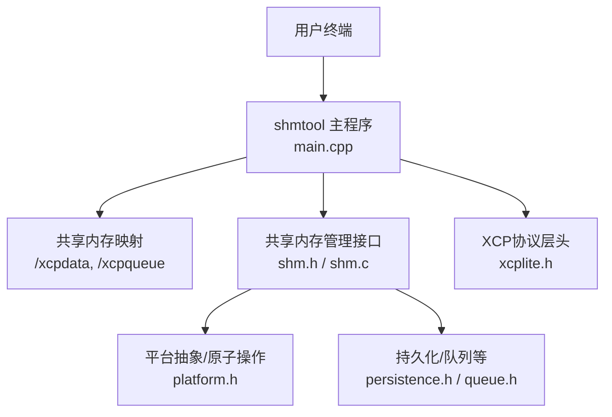
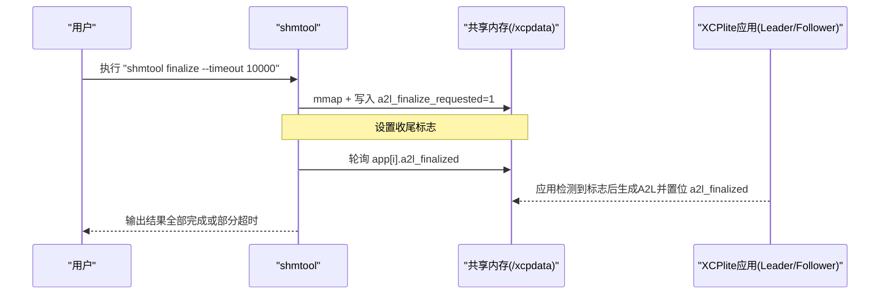
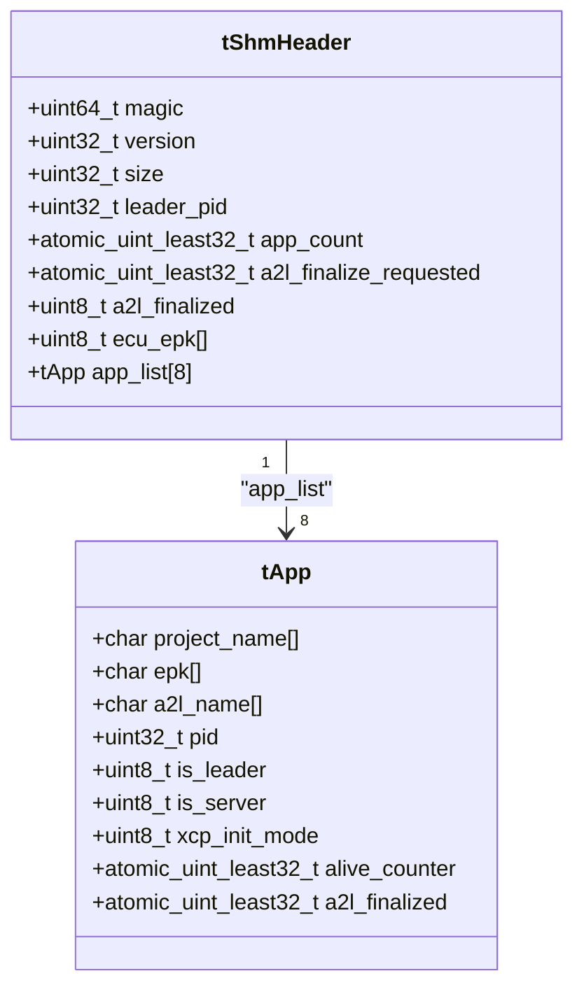
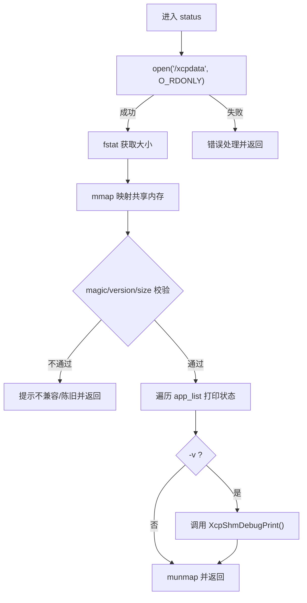
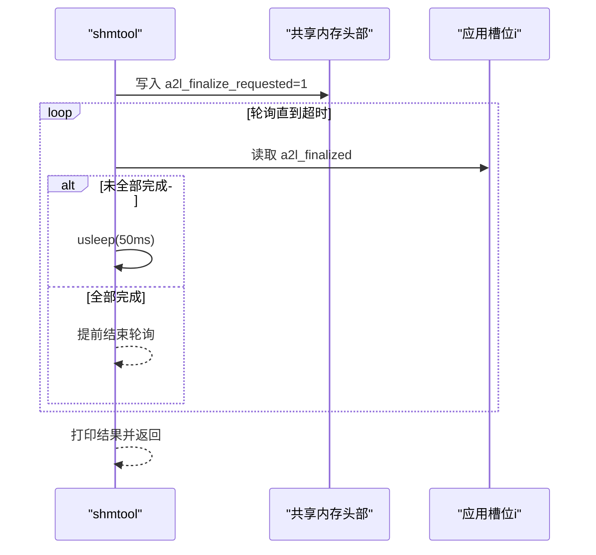
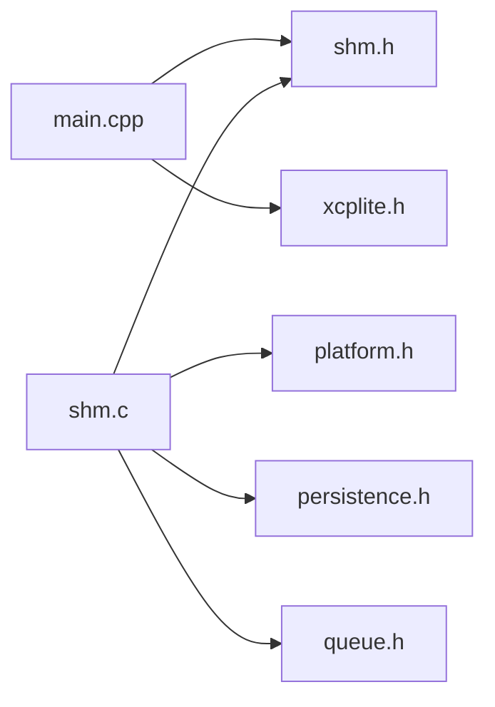

# shmtool共享内存工具

<cite>
**本文引用的文件**
- [tools/shmtool/README.md](file://tools/shmtool/README.md)
- [tools/shmtool/src/main.cpp](file://tools/shmtool/src/main.cpp)
- [src/shm.h](file://src/shm.h)
- [src/shm.c](file://src/shm.c)
- [docs/SHM.md](file://docs/SHM.md)
- [tools/shm_clean.sh](file://tools/shm_clean.sh)
- [tools/shm_cleanup.sh](file://tools/shm_cleanup.sh)
- [tools/shm_finalize.sh](file://tools/shm_finalize.sh)
- [tools/shm_status.sh](file://tools/shm_status.sh)
- [src/xcplite.h](file://src/xcplite.h)
</cite>

## 目录
1. [简介](#简介)
2. [项目结构](#项目结构)
3. [核心组件](#核心组件)
4. [架构总览](#架构总览)
5. [详细组件分析](#详细组件分析)
6. [依赖关系分析](#依赖关系分析)
7. [性能考虑](#性能考虑)
8. [故障排除指南](#故障排除指南)
9. [结论](#结论)
10. [附录](#附录)

## 简介
shmtool是XCPlite在多进程共享内存（SHM）模式下的诊断与运维工具，用于查看、验证和清理POSIX共享内存区域。它通过读取由XCPlite应用创建的/xcpdata与/xcpqueue共享内存段，提供以下能力：
- 状态查询：显示共享内存头部信息、已注册应用列表、A2L生成状态等
- A2L收尾触发：设置全局标志并轮询等待各应用确认完成
- 清理残留：移除共享内存段与锁文件，便于崩溃或异常退出后的恢复
- 辅助脚本：配合shell脚本实现一键状态查看、收尾与清理

该工具要求XCPlite库以OPTION_SHM_MODE编译；status与finalize命令仅在启用SHM模式时可用，clean始终可用。

**章节来源**
- [tools/shmtool/README.md:1-111](file://tools/shmtool/README.md#L1-L111)

## 项目结构
与shmtool相关的代码与脚本分布如下：
- tools/shmtool/src/main.cpp：命令行解析与各命令实现（status/finalize/clean/help）
- src/shm.h / src/shm.c：共享内存数据结构定义与管理接口（tShmHeader、tApp、生命周期与A2L协作）
- docs/SHM.md：多进程SHM模式的总体说明与工具链介绍
- tools/shm_*.sh：便捷脚本封装常用操作（status/finalize/cleanup/clean）

**图表来源**
- [tools/shmtool/src/main.cpp:30-48](file://tools/shmtool/src/main.cpp#L30-L48)
- [src/shm.h:65-81](file://src/shm.h#L65-L81)
- [src/shm.c:15-37](file://src/shm.c#L15-L37)
- [src/xcplite.h:46-57](file://src/xcplite.h#L46-L57)

**章节来源**
- [tools/shmtool/README.md:89-111](file://tools/shmtool/README.md#L89-L111)
- [docs/SHM.md:61-69](file://docs/SHM.md#L61-L69)

## 核心组件
- 共享内存布局
  - tShmHeader：包含magic/version/size/leader_pid/app_count/a2l相关标志/ECU EPK哈希与应用列表
  - tApp：每个应用一个槽位，记录project_name/epk/a2l_name/pid/角色标识/alive_counter/a2l_finalized等
- 工具命令
  - status：只读映射/xcpdata，校验magic与版本，打印头部与所有应用槽位信息
  - finalize：写回a2l_finalize_requested，轮询各应用的a2l_finalized直至全部完成或超时
  - clean：unlink /xcpdata、/xcpqueue及/tmp下对应锁文件
- 辅助脚本
  - shm_status.sh：调用status -v
  - shm_finalize.sh：调用finalize -v
  - shm_cleanup.sh：优先使用shmtool clean，否则回退到内联C片段清理
  - shm_clean.sh：调用clean并删除生成的.a2l/.bin

**章节来源**
- [src/shm.h:45-81](file://src/shm.h#L45-L81)
- [tools/shmtool/src/main.cpp:71-167](file://tools/shmtool/src/main.cpp#L71-L167)
- [tools/shmtool/src/main.cpp:173-266](file://tools/shmtool/src/main.cpp#L173-L266)
- [tools/shmtool/src/main.cpp:272-302](file://tools/shmtool/src/main.cpp#L272-L302)
- [tools/shm_status.sh:1-5](file://tools/shm_status.sh#L1-L5)
- [tools/shm_finalize.sh:1-5](file://tools/shm_finalize.sh#L1-L5)
- [tools/shm_cleanup.sh:1-50](file://tools/shm_cleanup.sh#L1-L50)
- [tools/shm_clean.sh:1-8](file://tools/shm_clean.sh#L1-L8)

## 架构总览
shmtool通过POSIX共享内存API直接访问XCPlite维护的共享内存段，遵循“只读查看”“写标志触发”“清理资源”三类职责。与XCPlite内部模块交互如下：
- 读取/写入共享内存头部字段（如a2l_finalize_requested、a2l_finalized）
- 依赖tXcpData/tShmHeader布局保证二进制兼容（magic/version/size）
- 借助平台原子操作确保跨进程可见性

**图表来源**
- [tools/shmtool/src/main.cpp:173-266](file://tools/shmtool/src/main.cpp#L173-L266)
- [src/shm.c:283-369](file://src/shm.c#L283-L369)

**章节来源**
- [docs/SHM.md:6-26](file://docs/SHM.md#L6-L26)
- [src/shm.c:69-80](file://src/shm.c#L69-L80)

## 详细组件分析

### 共享内存数据模型
- tShmHeader
  - magic/version/size：用于识别与兼容性检查
  - leader_pid：创建共享内存的进程ID
  - app_count：当前已注册应用数量
  - a2l_finalize_requested/a2l_finalized：A2L收尾流程控制位
  - ecu_epk：由各应用EPK计算的ECU级唯一标识
  - app_list[SHM_MAX_APP_COUNT]：应用槽位数组
- tApp
  - project_name/epk/a2l_name：应用标识与A2L文件名
  - pid/is_leader/is_server：进程角色与存活标识
  - alive_counter：心跳计数，用于检测僵尸进程
  - a2l_finalized：本应用A2L是否已完成

**图表来源**
- [src/shm.h:45-81](file://src/shm.h#L45-L81)

**章节来源**
- [src/shm.h:45-81](file://src/shm.h#L45-L81)

### 命令实现与流程

#### status命令
- 打开/xcpdata为只读，fstat获取大小，mmap映射
- 校验magic与version，比较声明size与当前sizeof(tXcpData)
- 打印头部信息与每个应用槽位的关键字段
- 可选-v输出更详细的调试信息（调用XcpShmDebugPrint）

**图表来源**
- [tools/shmtool/src/main.cpp:71-167](file://tools/shmtool/src/main.cpp#L71-L167)
- [src/shm.c:221-277](file://src/shm.c#L221-L277)

**章节来源**
- [tools/shmtool/src/main.cpp:71-167](file://tools/shmtool/src/main.cpp#L71-L167)

#### finalize命令
- 以读写方式打开/xcpdata，写入a2l_finalize_requested=1
- 每50ms轮询各应用的a2l_finalized，直到全部置位或达到超时
- 输出汇总结果，返回码：0表示全部完成，2表示部分超时

**图表来源**
- [tools/shmtool/src/main.cpp:173-266](file://tools/shmtool/src/main.cpp#L173-L266)

**章节来源**
- [tools/shmtool/src/main.cpp:173-266](file://tools/shmtool/src/main.cpp#L173-L266)

#### clean命令
- 依次unlink /xcpdata、/xcpqueue
- 删除/tmp/xcpdata.lock、/tmp/xcpqueue.lock
- 报告每个对象是否被移除或不存在

**章节来源**
- [tools/shmtool/src/main.cpp:272-302](file://tools/shmtool/src/main.cpp#L272-L302)

### 与XCPlite的集成点
- 共享内存初始化与附加：XcpShmAttachOrCreate负责创建或附加共享内存，处理leader/follower逻辑
- A2L收尾协作：XcpShmRequestA2lFinalize设置请求标志；应用侧轮询并生成A2L后置位a2l_finalized；XcpShmCollectA2lFiles收集完成的A2L文件名
- 存活检测：XcpShmCheckAliveCounters定期扫描alive_counter，清理僵尸进程槽位
- 模式标志：XCP_MODE_SHM/AUTO/SERVER在xcplite.h中定义，决定SHM行为

**章节来源**
- [src/shm.c:162-215](file://src/shm.c#L162-L215)
- [src/shm.c:283-369](file://src/shm.c#L283-L369)
- [src/shm.c:464-517](file://src/shm.c#L464-L517)
- [src/xcplite.h:46-57](file://src/xcplite.h#L46-L57)

## 依赖关系分析
- 外部系统调用
  - POSIX共享内存：shm_open/mmap/unmap/shm_unlink
  - 文件系统：unlink删除锁文件
- 内部依赖
  - xcplite.h：XCP模式标志与公共接口
  - shm.h/shm.c：共享内存结构与生命周期管理
  - platform.h：原子操作与延时函数
  - persistence.h/queue.h：持久化与队列（在共享内存模式下被引用）

**图表来源**
- [tools/shmtool/src/main.cpp:30-48](file://tools/shmtool/src/main.cpp#L30-L48)
- [src/shm.c:15-37](file://src/shm.c#L15-L37)

**章节来源**
- [tools/shmtool/src/main.cpp:30-48](file://tools/shmtool/src/main.cpp#L30-L48)
- [src/shm.c:15-37](file://src/shm.c#L15-L37)

## 性能考虑
- 轮询间隔与超时
  - finalize默认50ms轮询，可通过--timeout调整；过短会增加CPU占用，过长影响响应
- 共享内存访问
  - 使用原子变量避免额外锁竞争；仅必要字段写回（如a2l_finalize_requested）
- 存活检测
  - 应用需周期性递增alive_counter；服务端每秒检查，及时回收僵尸进程
- 页面大小与对齐
  - 某些平台会按页对齐分配，注意hdr->size与实际映射大小的差异

**章节来源**
- [tools/shmtool/src/main.cpp:219-245](file://tools/shmtool/src/main.cpp#L219-L245)
- [src/shm.c:464-517](file://src/shm.c#L464-L517)

## 故障排除指南
常见问题与定位方法：
- 无活动会话
  - 现象：status提示未找到/xcpdata
  - 处理：确认XCPlite应用已启动且以SHM模式运行；必要时先执行cleanup
- 二进制不兼容
  - 现象：警告声明size与当前sizeof(tXcpData)不一致
  - 处理：重新构建工具与目标应用，或执行clean清理陈旧段
- A2L收尾超时
  - 现象：finalize返回部分超时
  - 处理：检查应用是否正确轮询a2l_finalize_requested并生成A2L；增大--timeout；查看-a2l_name是否为pending
- 僵尸进程残留
  - 现象：应用已崩溃但槽位仍显示pid非零
  - 处理：运行cleanup或重启服务；确认XcpShmCheckAliveCounters正常工作
- 权限问题
  - 现象：无法unlink锁文件或共享内存
  - 处理：确保以正确用户运行；清理前确认无其他进程持有句柄

实用命令参考：
- 查看状态：./build/shmtool status -v
- 触发A2L收尾：./build/shmtool finalize --timeout 10000
- 清理残留：./build/shmtool clean
- 脚本化：tools/shm_status.sh / tools/shm_finalize.sh / tools/shm_cleanup.sh / tools/shm_clean.sh

**章节来源**
- [tools/shmtool/src/main.cpp:71-167](file://tools/shmtool/src/main.cpp#L71-L167)
- [tools/shmtool/src/main.cpp:173-266](file://tools/shmtool/src/main.cpp#L173-L266)
- [tools/shmtool/src/main.cpp:272-302](file://tools/shmtool/src/main.cpp#L272-L302)
- [tools/shm_cleanup.sh:1-50](file://tools/shm_cleanup.sh#L1-L50)

## 结论
shmtool提供了对XCPlite共享内存区域的直观可视化和可控操作，结合A2L收尾流程与存活检测机制，有效支撑多进程XCP会话的运维与排障。建议在生产环境中：
- 统一以SHM模式构建并启用必要的配置项
- 将status/finalize/clean纳入监控与自动化脚本
- 合理设置finalize超时与轮询间隔，平衡实时性与资源占用
- 建立规范的清理策略，避免遗留共享内存导致后续启动失败

## 附录

### 命令选项速查
- 命令
  - status：显示共享内存头部与已注册应用信息
  - finalize：设置A2L收尾标志并轮询确认
  - clean：删除共享内存段与锁文件
  - help：显示帮助
- 选项
  - -v/--verbose：输出更多底层细节
  - --timeout <ms>：finalize轮询超时时间（默认5000ms）

**章节来源**
- [tools/shmtool/README.md:14-29](file://tools/shmtool/README.md#L14-L29)
- [tools/shmtool/src/main.cpp:307-320](file://tools/shmtool/src/main.cpp#L307-L320)

### 与其他工具的配合
- xcpdaemon：作为XCP on Ethernet服务器，可附着到多个SHM应用；与shmtool协同完成A2L收尾与状态管理
- xcpclient：测试与测量客户端，支持ETH与SHM传输；可用于验证A2L与DAQ功能
- 脚本组合：
  - 启动应用后执行shm_status.sh查看状态
  - 需要合并A2L时执行shm_finalize.sh
  - 异常或切换版本后执行shm_cleanup.sh或shm_clean.sh

**章节来源**
- [docs/SHM.md:61-69](file://docs/SHM.md#L61-L69)
- [tools/shm_status.sh:1-5](file://tools/shm_status.sh#L1-L5)
- [tools/shm_finalize.sh:1-5](file://tools/shm_finalize.sh#L1-L5)
- [tools/shm_cleanup.sh:1-50](file://tools/shm_cleanup.sh#L1-L50)
- [tools/shm_clean.sh:1-8](file://tools/shm_clean.sh#L1-L8)