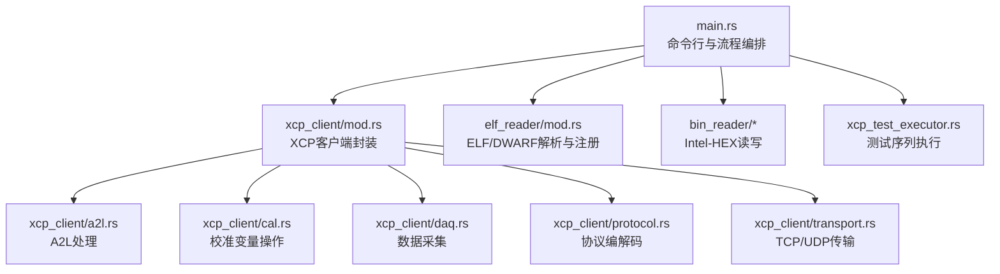
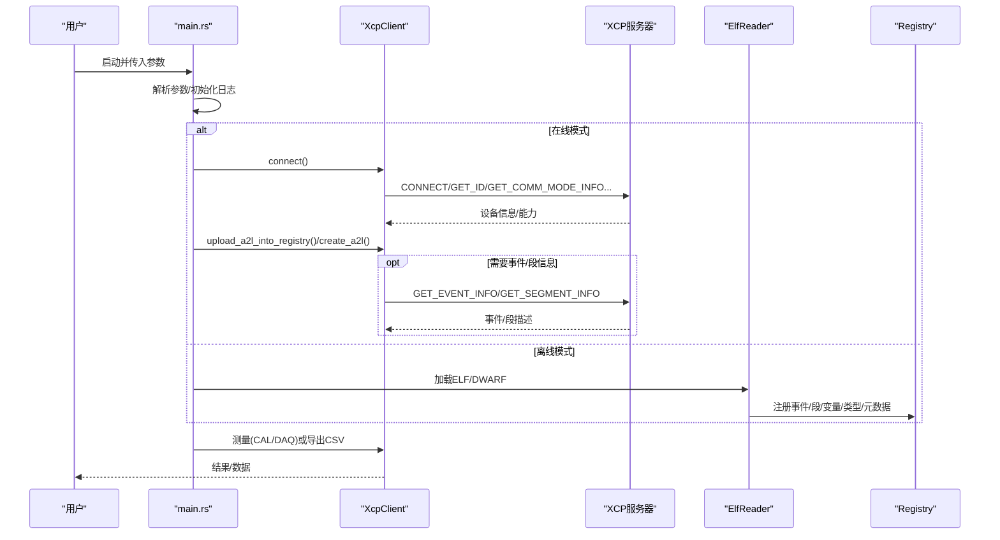
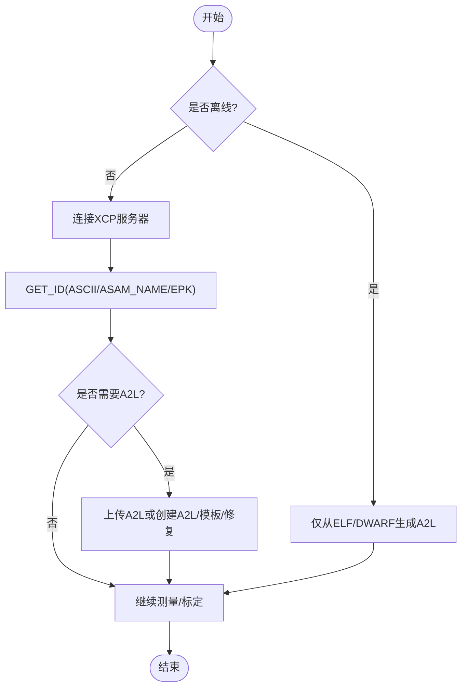
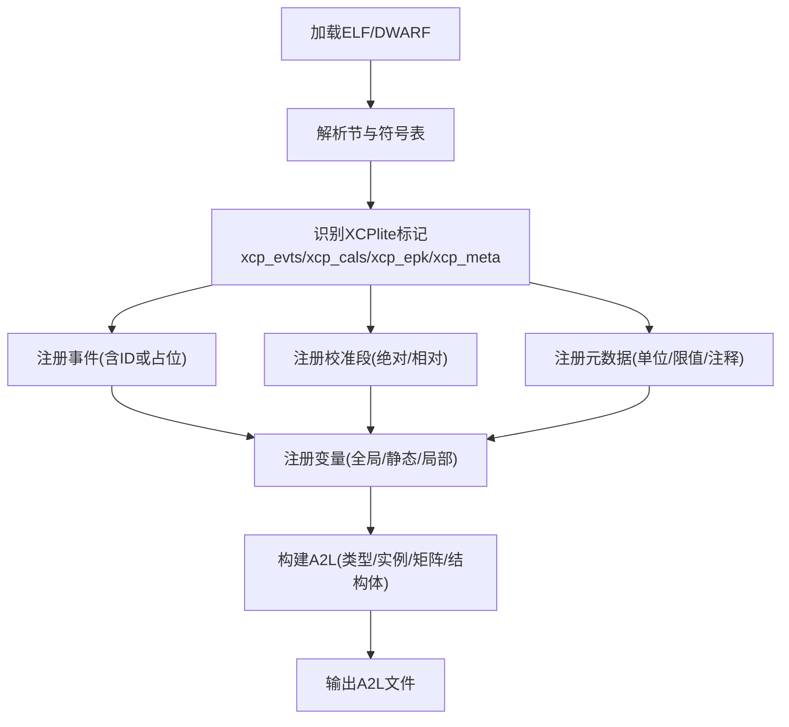
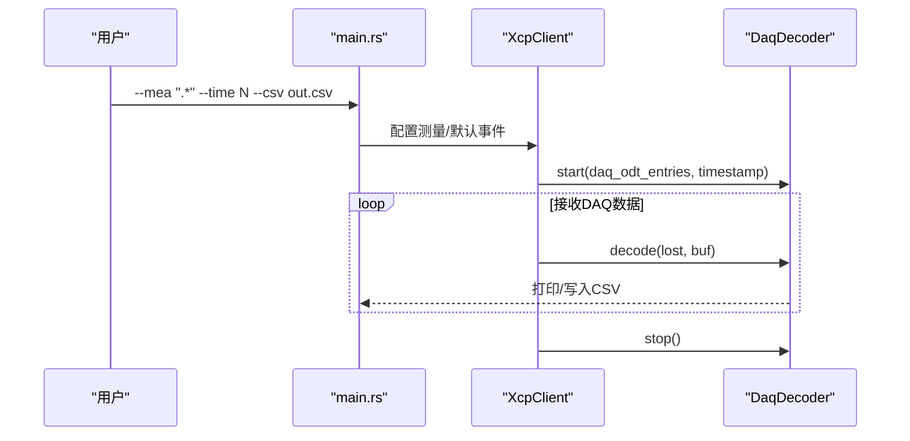
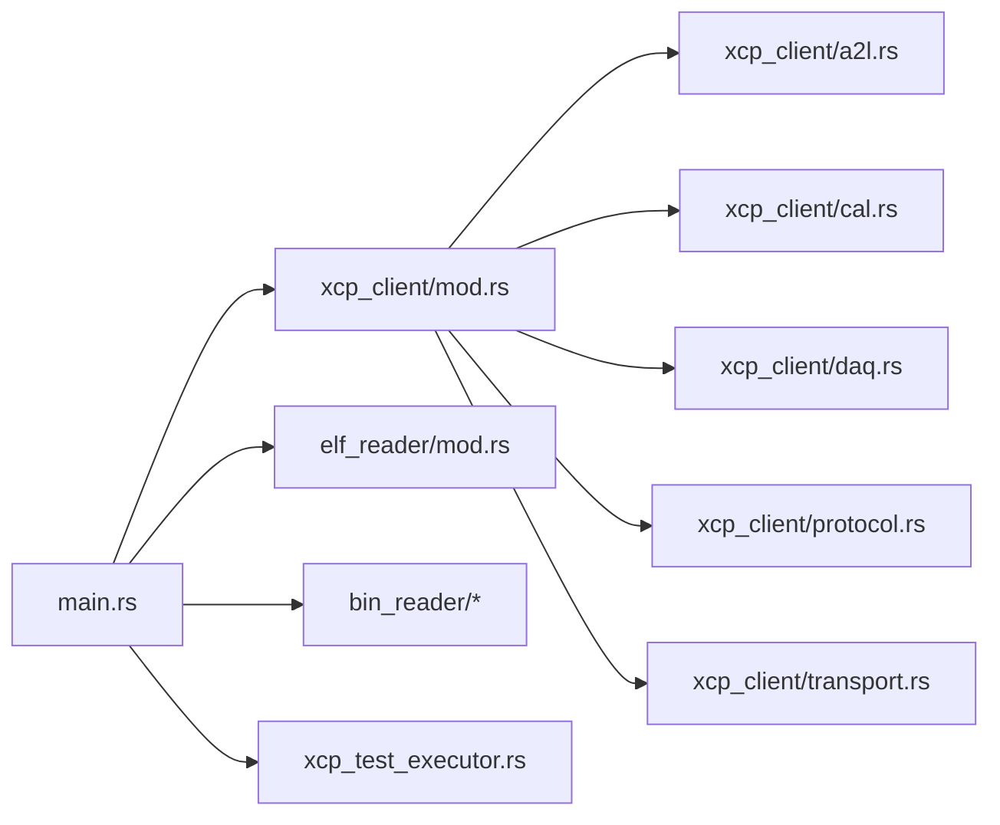

# xcpclient工具

<cite>
**本文引用的文件**
- [tools/xcpclient/README.md](file://tools/xcpclient/README.md)
- [tools/xcpclient/Cargo.toml](file://tools/xcpclient/Cargo.toml)
- [tools/xcpclient/src/main.rs](file://tools/xcpclient/src/main.rs)
- [tools/xcpclient/xcpclient.toml](file://tools/xcpclient/xcpclient.toml)
- [tools/xcpclient/src/lib.rs](file://tools/xcpclient/src/lib.rs)
- [tools/xcpclient/src/elf_reader/mod.rs](file://tools/xcpclient/src/elf_reader/mod.rs)
- [tools/xcpclient/src/xcp_client/mod.rs](file://tools/xcpclient/src/xcp_client/mod.rs)
- [docs/OFFLINE_A2L.md](file://docs/OFFLINE_A2L.md)
- [docs/TECHNICAL.md](file://docs/TECHNICAL.md)
- [examples/hello_xcp/README.md](file://examples/hello_xcp/README.md)
- [examples/no_a2l_demo/README.md](file://examples/no_a2l_demo/README.md)
</cite>

## 目录
1. [简介](#简介)
2. [项目结构](#项目结构)
3. [核心组件](#核心组件)
4. [架构总览](#架构总览)
5. [详细组件分析](#详细组件分析)
6. [依赖关系分析](#依赖关系分析)
7. [性能与使用建议](#性能与使用建议)
8. [故障排查指南](#故障排查指南)
9. [结论](#结论)
10. [附录：命令行参数与TOML配置](#附录命令行参数与toml配置)

## 简介
xcpclient是XCPlite的Rust实现测试客户端与A2L生成器，支持以太网TCP/UDP连接、从XCP服务器上传A2L或ELF、基于ELF/DWARF调试信息离线生成A2L、校准变量读写（CAL）、数据采集测试（DAQ）、执行内置测试序列、校验A2L EPK等。它既可作为在线工具直接连接目标ECU进行测量与标定，也可在离线模式下仅凭ELF文件生成完整A2L，便于在无文件系统或资源受限的目标上使用。

## 项目结构
xcpclient位于tools/xcpclient目录，采用Rust crate组织，包含CLI入口、XCP客户端库、ELF/DWARF解析器、二进制文件读写、以及测试执行器等模块。

图表来源
- [tools/xcpclient/src/main.rs:1-120](file://tools/xcpclient/src/main.rs#L1-L120)
- [tools/xcpclient/src/xcp_client/mod.rs:105-235](file://tools/xcpclient/src/xcp_client/mod.rs#L105-L235)
- [tools/xcpclient/src/elf_reader/mod.rs:155-180](file://tools/xcpclient/src/elf_reader/mod.rs#L155-L180)

章节来源
- [tools/xcpclient/README.md:1-38](file://tools/xcpclient/README.md#L1-L38)
- [tools/xcpclient/Cargo.toml:1-59](file://tools/xcpclient/Cargo.toml#L1-L59)

## 核心组件
- 命令行与流程编排：负责参数解析、日志初始化、连接决策、A2L路径确定、在线/离线模式分支、事件与段信息获取、变量注册、测量与标定操作、CSV输出与测试执行。
- XCP客户端：封装TCP/UDP通信、CONNECT/GET_*命令、资源能力查询、DAQ数据接收与解码、文本消息处理、默认事件设置、注册表集成。
- ELF/DWARF解析器：读取ELF节与符号表、解析DWARF调试信息，识别XCPlite标记（事件、校准段、EPK、元数据、触发点），将事件、段、变量、类型、元数据注册到xcp_registry。
- 二进制文件读写：用于校准段工作页数据的Intel-HEX上传/下载。
- 测试执行器：执行内置的CAL/DAQ测试序列。

章节来源
- [tools/xcpclient/src/main.rs:119-322](file://tools/xcpclient/src/main.rs#L119-L322)
- [tools/xcpclient/src/xcp_client/mod.rs:107-235](file://tools/xcpclient/src/xcp_client/mod.rs#L107-L235)
- [tools/xcpclient/src/elf_reader/mod.rs:155-180](file://tools/xcpclient/src/elf_reader/mod.rs#L155-L180)

## 架构总览
xcpclient以CLI为入口，根据参数决定在线或离线模式：
- 在线模式：建立TCP/UDP连接，读取目标设备信息（GET_ID），获取事件与段信息（GET_EVENT_INFO/GET_SEGMENT_INFO），结合本地ELF/DWARF信息生成或修复A2L，执行测量或标定。
- 离线模式：不连接网络，仅从ELF/DWARF与命令行参数生成A2L模板或完整A2L。

图表来源
- [tools/xcpclient/src/main.rs:579-800](file://tools/xcpclient/src/main.rs#L579-L800)
- [tools/xcpclient/src/xcp_client/mod.rs:147-235](file://tools/xcpclient/src/xcp_client/mod.rs#L147-L235)
- [tools/xcpclient/src/elf_reader/mod.rs:617-720](file://tools/xcpclient/src/elf_reader/mod.rs#L617-L720)

## 详细组件分析

### 命令行参数与配置
- 支持通过命令行参数或TOML配置文件（--config）提供参数，命令行优先。
- 关键参数包括：
  - 连接：--dest-addr, --port, --bind-addr, --baud-rate, --tcp/--udp/--sxi, --connect-mode, --offline
  - A2L/ELF：--a2l, --upload-a2l, --create-a2l, --create-a2l-template, --fix-a2l, --upload-elf, --elf, --elf-unit-limit, --elf-var-filter, --elf-skip-no-metadata, --elf-unit-filter
  - 校准：--bin, --upload-bin, --download-bin, --list-cal, --cal <NAME> <VALUE>
  - 测量：--list-mea, --mea, --default-event, --time, --csv
  - 其他：--test, --yes, --log-level, --verbose

章节来源
- [tools/xcpclient/README.md:41-191](file://tools/xcpclient/README.md#L41-L191)
- [tools/xcpclient/src/main.rs:119-322](file://tools/xcpclient/src/main.rs#L119-L322)
- [tools/xcpclient/xcpclient.toml:1-136](file://tools/xcpclient/xcpclient.toml#L1-L136)

### 日志级别
- --log-level：Off=0, Error=1, Warn=2, Info=3, Debug=4, Trace=5
- --verbose：内容详细度，控制DAQ解码输出与调试信息

章节来源
- [tools/xcpclient/src/main.rs:324-346](file://tools/xcpclient/src/main.rs#L324-L346)

### 在线工作流（连接XCP服务器）
- 连接后读取设备名、A2L名称、EPK等信息，设置A2L输出路径。
- 可选择上传A2L到本地、创建A2L模板或完整A2L、修复现有A2L的事件/段信息。
- 支持从目标上传ELF（需目标支持专有GET_ID扩展）。

图表来源
- [tools/xcpclient/src/main.rs:579-800](file://tools/xcpclient/src/main.rs#L579-L800)

章节来源
- [tools/xcpclient/src/main.rs:632-800](file://tools/xcpclient/src/main.rs#L632-L800)

### 离线A2L生成功能
- 从ELF/DWARF提取事件、校准段、EPK、元数据、触发点与作用域信息，结合XCPlite特定命名约定与地址扩展，生成完整A2L。
- 支持过滤编译单元与变量名、跳过无元数据变量、限定解析单元数量以提升大二进制处理速度。
- 当连接目标时，可进一步用目标的事件/段信息修正A2L中的占位ID与地址。

图表来源
- [tools/xcpclient/src/elf_reader/mod.rs:617-720](file://tools/xcpclient/src/elf_reader/mod.rs#L617-L720)
- [tools/xcpclient/src/elf_reader/mod.rs:379-615](file://tools/xcpclient/src/elf_reader/mod.rs#L379-L615)
- [docs/OFFLINE_A2L.md:13-68](file://docs/OFFLINE_A2L.md#L13-L68)

章节来源
- [docs/OFFLINE_A2L.md:13-68](file://docs/OFFLINE_A2L.md#L13-L68)
- [tools/xcpclient/src/elf_reader/mod.rs:155-180](file://tools/xcpclient/src/elf_reader/mod.rs#L155-L180)

### 校准变量读写（CAL）
- 列出匹配正则的校准变量，设置变量值，上传/下载校准段工作页数据（Intel-HEX）。
- 支持绝对地址或段相对地址两种寻址模式，取决于目标签名（XCPLITE__CASDD/ACSDD/AXSDD/CXSDD）。

章节来源
- [tools/xcpclient/README.md:140-180](file://tools/xcpclient/README.md#L140-L180)
- [docs/OFFLINE_A2L.md:72-84](file://docs/OFFLINE_A2L.md#L72-L84)

### 数据采集测试（DAQ）
- 指定变量列表或正则表达式进行测量，支持时间限制与CSV输出。
- 对无固定事件的变量，可通过--default-event分配默认事件进行同步采集。
- 支持不同DAQ头大小与时间戳分辨率，自动拼接64位时间戳。

图表来源
- [tools/xcpclient/src/main.rs:361-549](file://tools/xcpclient/src/main.rs#L361-L549)

章节来源
- [tools/xcpclient/src/main.rs:361-549](file://tools/xcpclient/src/main.rs#L361-L549)

### 与CANape等ASAM工具的集成
- 示例工程提供CANape项目与自动检测A2L模板，支持XCP on Ethernet UDP/TCP。
- 可在CANape中打开设备配置，启用ELF文件以补充测量与校准对象；或使用xcpclient生成的A2L直接导入。

章节来源
- [examples/hello_xcp/README.md:52-58](file://examples/hello_xcp/README.md#L52-L58)
- [docs/OFFLINE_A2L.md:271-285](file://docs/OFFLINE_A2L.md#L271-L285)

## 依赖关系分析
- 外部依赖：tokio（异步IO）、clap（CLI）、figment（TOML配置）、regex（变量过滤）、ihex（Intel-HEX）、object/gimli（ELF/DWARF解析）、xcp_registry（A2L注册表）。
- 内部模块：main.rs协调各子模块；xcp_client封装协议与传输；elf_reader负责ELF/DWARF解析；bin_reader处理HEX；xcp_test_executor执行测试。

图表来源
- [tools/xcpclient/src/lib.rs:1-13](file://tools/xcpclient/src/lib.rs#L1-L13)
- [tools/xcpclient/Cargo.toml:16-46](file://tools/xcpclient/Cargo.toml#L16-L46)

章节来源
- [tools/xcpclient/Cargo.toml:16-46](file://tools/xcpclient/Cargo.toml#L16-L46)
- [tools/xcpclient/src/lib.rs:1-13](file://tools/xcpclient/src/lib.rs#L1-L13)

## 性能与使用建议
- 大ELF解析优化：使用--elf-unit-limit限制编译单元数量，提升处理速度。
- 变量过滤：通过--elf-var-filter与--elf-unit-filter减少注册对象数量，降低A2L体积与工具负担。
- 无元数据变量：使用--elf-skip-no-metadata仅发布显式标注的信号，避免无关变量污染。
- 默认事件：为无固定事件的变量设置--default-event，确保DAQ同步采集一致性。
- CSV输出：大数据量测量建议使用--csv保存，避免控制台I/O瓶颈。

[本节为通用指导，无需具体文件引用]

## 故障排查指南
- 连接失败：检查--dest-addr与--port，确认目标服务监听端口与防火墙策略。
- A2L生成失败：确认ELF包含DWARF调试信息（-g），macOS Mach-O不被支持，需在Linux或嵌入式ELF目标上构建。
- 变量缺失：检查变量是否为volatile或已捕获（capture），否则可能位于寄存器且无法测量。
- 校准段地址错误：确认目标签名（XCPLITE__CASDD/ACSDD等）与寻址模式一致，必要时连接目标以修正段号与地址。
- EPK不匹配：A2L与目标版本不一致，可使用--yes忽略警告或在脚本中处理。

章节来源
- [docs/OFFLINE_A2L.md:244-269](file://docs/OFFLINE_A2L.md#L244-L269)
- [tools/xcpclient/README.md:36-38](file://tools/xcpclient/README.md#L36-L38)

## 结论
xcpclient提供了完整的XCP在线测试与离线A2L生成能力，覆盖连接、A2L管理、校准、测量、测试执行与CSV导出等场景。其ELF/DWARF解析器针对XCPlite标记进行了深度适配，能够在无运行时A2L生成的目标上快速产出可用A2L，并与CANape等ASAM工具无缝集成。通过灵活的命令行与TOML配置，用户可高效完成从开发到验证的全流程。

[本节为总结性内容，无需具体文件引用]

## 附录：命令行参数与TOML配置
- 命令行参数详见帮助输出与README示例，涵盖连接、A2L/ELF、校准、测量、测试等选项。
- TOML配置键与默认值见xcpclient.toml，支持日志、传输、A2L、ELF、校准、测量、测试等分组配置。

章节来源
- [tools/xcpclient/README.md:41-191](file://tools/xcpclient/README.md#L41-L191)
- [tools/xcpclient/xcpclient.toml:1-136](file://tools/xcpclient/xcpclient.toml#L1-L136)