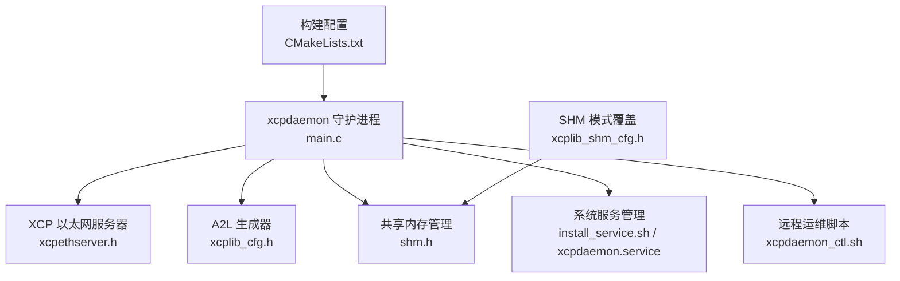
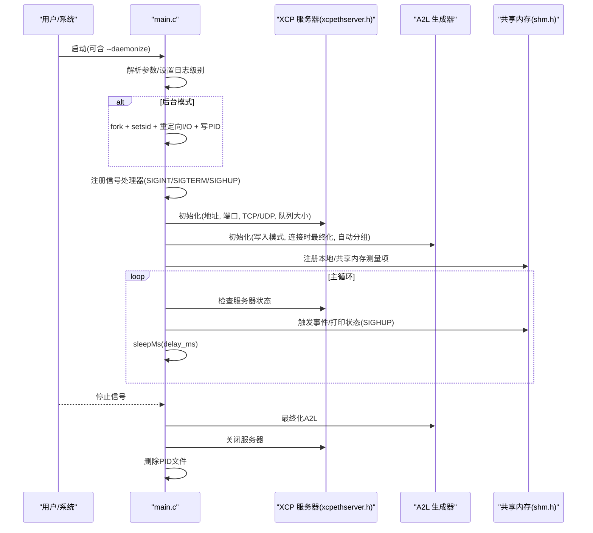
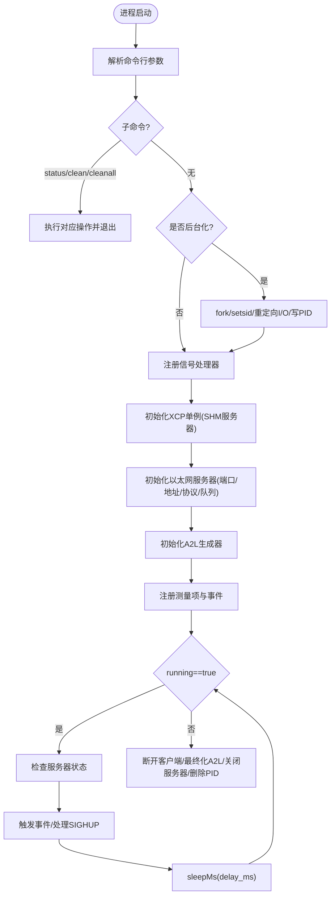
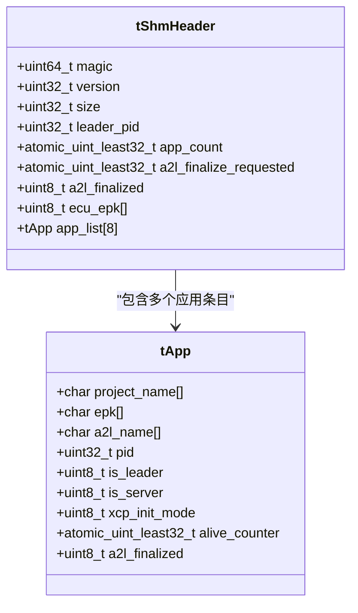
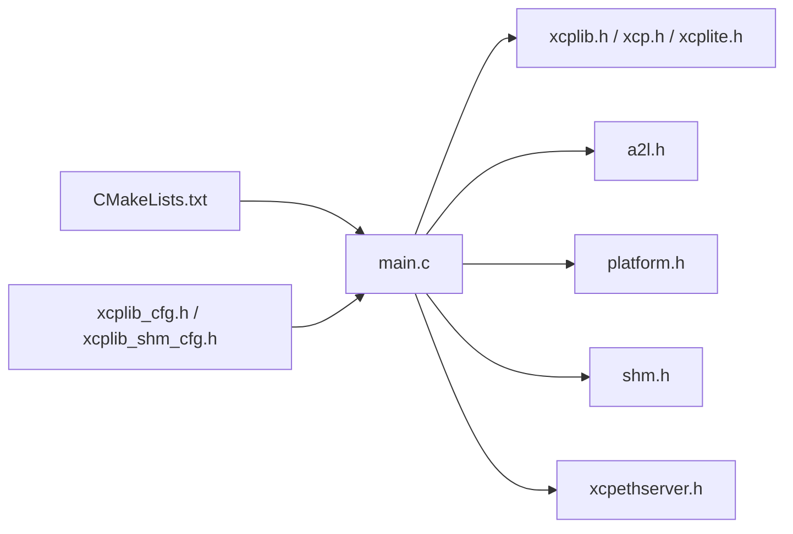

# xcpdaemon守护进程

<cite>
**本文引用的文件**
- [tools/xcpdaemon/src/main.c](file://tools/xcpdaemon/src/main.c)
- [tools/xcpdaemon/README.md](file://tools/xcpdaemon/README.md)
- [tools/xcpdaemon/install_service.sh](file://tools/xcpdaemon/install_service.sh)
- [tools/xcpdaemon/xcpdaemon.service](file://tools/xcpdaemon/xcpdaemon.service)
- [tools/xcpdaemon/xcpdaemon_ctl.sh](file://tools/xcpdaemon/xcpdaemon_ctl.sh)
- [src/xcplib_cfg.h](file://src/xcplib_cfg.h)
- [src/xcplib_shm_cfg.h](file://src/xcplib_shm_cfg.h)
- [src/xcpethserver.h](file://src/xcpethserver.h)
- [src/shm.h](file://src/shm.h)
- [CMakeLists.txt](file://CMakeLists.txt)
</cite>

## 目录
1. [简介](#简介)
2. [项目结构](#项目结构)
3. [核心组件](#核心组件)
4. [架构总览](#架构总览)
5. [详细组件分析](#详细组件分析)
6. [依赖关系分析](#依赖关系分析)
7. [性能与资源管理](#性能与资源管理)
8. [安装与部署](#安装与部署)
9. [配置选项详解](#配置选项详解)
10. [进程管理与运维命令](#进程管理与运维命令)
11. [故障排除指南](#故障排除指南)
12. [结论](#结论)

## 简介
xcpdaemon 是 XCPlite 的守护进程工具，用于将 XCPlite XCP 服务器作为系统服务运行。它支持后台自动启动、进程管理、日志记录、多应用共享内存（SHM）模式下的主 A2L 生成与二进制校准数据持久化，并提供测量队列、事件触发等能力。通过 systemd 集成，可在 Linux 上实现开机自启、崩溃重启、集中日志采集等生产级特性。

## 项目结构
围绕 xcpdaemon 的关键文件与职责如下：
- tools/xcpdaemon/src/main.c：守护进程入口、命令行解析、信号处理、XCP/A2L 初始化、主循环、清理与退出流程。
- tools/xcpdaemon/xcpdaemon.service：systemd 单元文件模板，定义服务类型、用户、工作目录、启动/停止/重载命令、重启策略与日志输出。
- tools/xcpdaemon/install_service.sh：一键安装脚本，生成并启用 systemd 服务。
- tools/xcpdaemon/xcpdaemon_ctl.sh：远程管理脚本，封装 start/stop/restart/status/log/run/clean/cleanall/install 等操作。
- src/xcplib_cfg.h：XCPlite 库通用编译期配置（日志、时钟、DAQ、传输层队列、A2L 生成开关等）。
- src/xcplib_shm_cfg.h：多应用 SHM 模式覆盖配置，启用 OPTION_SHM_MODE。
- src/xcpethserver.h：以太网 XCP 服务器接口声明（初始化、状态、关闭）。
- src/shm.h：共享内存数据结构与 API（应用注册表、主从角色、A2L 最终化标志、存活计数器等）。
- CMakeLists.txt：构建配置选择（default/no_a2l/ptp/shm/rtos/raw），工具目标控制（XCPLITE_BUILD_TOOLS=ON 构建 shmtool、xcpdaemon）。

图表来源
- [tools/xcpdaemon/src/main.c:209-449](file://tools/xcpdaemon/src/main.c#L209-L449)
- [src/xcpethserver.h:19-33](file://src/xcpethserver.h#L19-L33)
- [src/shm.h:38-124](file://src/shm.h#L38-L124)
- [tools/xcpdaemon/install_service.sh:30-41](file://tools/xcpdaemon/install_service.sh#L30-L41)
- [tools/xcpdaemon/xcpdaemon.service:6-17](file://tools/xcpdaemon/xcpdaemon.service#L6-L17)
- [CMakeLists.txt:17-35](file://CMakeLists.txt#L17-L35)

章节来源
- [tools/xcpdaemon/src/main.c:1-450](file://tools/xcpdaemon/src/main.c#L1-L450)
- [tools/xcpdaemon/README.md:12-43](file://tools/xcpdaemon/README.md#L12-L43)
- [tools/xcpdaemon/install_service.sh:1-47](file://tools/xcpdaemon/install_service.sh#L1-L47)
- [tools/xcpdaemon/xcpdaemon.service:1-21](file://tools/xcpdaemon/xcpdaemon.service#L1-L21)
- [tools/xcpdaemon/xcpdaemon_ctl.sh:1-79](file://tools/xcpdaemon/xcpdaemon_ctl.sh#L1-L79)
- [src/xcplib_cfg.h:42-169](file://src/xcplib_cfg.h#L42-L169)
- [src/xcplib_shm_cfg.h:28-38](file://src/xcplib_shm_cfg.h#L28-L38)
- [src/xcpethserver.h:19-33](file://src/xcpethserver.h#L19-L33)
- [src/shm.h:38-124](file://src/shm.h#L38-L124)
- [CMakeLists.txt:17-35](file://CMakeLists.txt#L17-L35)

## 核心组件
- 守护进程主程序（main.c）：负责参数解析、后台化、信号处理、XCP 初始化、A2L 初始化、事件/测量对象注册、主循环、优雅退出。
- 以太网 XCP 服务器（xcpethserver.h）：提供监听端口、协议栈初始化、状态查询与关闭。
- 共享内存子系统（shm.h）：维护多应用注册表、主从角色、A2L 最终化标志、存活计数器、调试打印等。
- 构建与配置（CMakeLists.txt、xcplib_cfg.h、xcplib_shm_cfg.h）：选择构建配置（如 shm）、开启 SHM 模式、控制 DAQ/队列/A2L 生成等。
- 服务与运维（install_service.sh、xcpdaemon.service、xcpdaemon_ctl.sh）：安装 systemd 服务、远程管理、日志跟踪。

章节来源
- [tools/xcpdaemon/src/main.c:209-449](file://tools/xcpdaemon/src/main.c#L209-L449)
- [src/xcpethserver.h:19-33](file://src/xcpethserver.h#L19-L33)
- [src/shm.h:38-124](file://src/shm.h#L38-L124)
- [CMakeLists.txt:17-35](file://CMakeLists.txt#L17-L35)
- [src/xcplib_cfg.h:42-169](file://src/xcplib_cfg.h#L42-L169)
- [src/xcplib_shm_cfg.h:28-38](file://src/xcplib_shm_cfg.h#L28-L38)

## 架构总览
xcpdaemon 在启动时完成以下关键步骤：
- 解析命令行参数（日志级别、端口、绑定地址、传输协议、队列大小、是否后台化）。
- 可选进入后台模式（fork+setsid+重定向 I/O+写 PID 文件）。
- 设置信号处理器（SIGINT/SIGTERM 停止；SIGHUP 打印共享内存状态）。
- 初始化 XCP 单例（启用 SHM 服务器模式）。
- 初始化以太网 XCP 服务器（绑定地址/端口/TCP或UDP、测量队列大小）。
- 初始化 A2L 生成器（写入模式、连接时最终化、自动分组）。
- 注册测量变量与事件（包括本地与共享内存中的状态字段）。
- 主循环中轮询服务器状态、触发事件、处理 SIGHUP、按延迟休眠。
- 退出时断开客户端、最终化 A2L、关闭服务器、删除 PID 文件。

图表来源
- [tools/xcpdaemon/src/main.c:75-119](file://tools/xcpdaemon/src/main.c#L75-L119)
- [tools/xcpdaemon/src/main.c:209-359](file://tools/xcpdaemon/src/main.c#L209-L359)
- [tools/xcpdaemon/src/main.c:364-449](file://tools/xcpdaemon/src/main.c#L364-L449)
- [src/xcpethserver.h:19-33](file://src/xcpethserver.h#L19-L33)
- [src/shm.h:38-124](file://src/shm.h#L38-L124)

## 详细组件分析

### 守护进程主程序（main.c）
- 参数解析：支持日志级别、端口、绑定地址、TCP/UDP、队列大小、后台化、帮助。
- 子命令：status、clean、cleanall、help（执行后退出）。
- 后台化：双 fork、脱离终端、重定向标准流、写 PID 文件。
- 信号处理：SIGINT/SIGTERM 置 running=false；SIGHUP 请求打印共享内存状态。
- 初始化：XcpInit（启用 SHM 服务器）、XcpEthServerInit（网络/队列）、A2lInit（A2L 生成）。
- 测量与事件：创建事件、设置栈/绝对地址模式、注册测量项（包含共享内存结构体成员）。
- 主循环：检查服务器状态、周期性触发事件、处理 SIGHUP、sleepMs。
- 退出：断开客户端、最终化 A2L、关闭服务器、删除 PID。

图表来源
- [tools/xcpdaemon/src/main.c:209-359](file://tools/xcpdaemon/src/main.c#L209-L359)
- [tools/xcpdaemon/src/main.c:364-449](file://tools/xcpdaemon/src/main.c#L364-L449)

章节来源
- [tools/xcpdaemon/src/main.c:1-450](file://tools/xcpdaemon/src/main.c#L1-L450)

### 共享内存子系统（shm.h）
- 应用注册表：tShmHeader.app_list 维护最多 SHM_MAX_APP_COUNT 个应用条目，包含项目名、EPK、A2L文件名、PID、主从/服务器角色、初始化模式、存活计数、A2L最终化标志。
- 主从与服务器：leader 创建共享内存段，server 处理客户端连接与 DAQ；follower 定期递增存活计数。
- A2L 最终化：当首个客户端 CONNECT 时，server 设置 finalize 标志，各应用轮询并调用 A2lFinalize()。
- 调试与统计：提供 DebugPrint、获取应用数量/活跃数量/服务器/leader 等信息。

图表来源
- [src/shm.h:38-81](file://src/shm.h#L38-L81)

章节来源
- [src/shm.h:38-124](file://src/shm.h#L38-L124)

### 以太网 XCP 服务器（xcpethserver.h）
- 初始化：指定绑定地址、端口、是否使用 TCP、测量队列大小。
- 状态查询：返回服务器是否仍在运行。
- 关闭：释放资源并停止接收/发送线程。

章节来源
- [src/xcpethserver.h:19-33](file://src/xcpethserver.h#L19-L33)

### 构建与配置（CMakeLists.txt、xcplib_cfg.h、xcplib_shm_cfg.h）
- 构建配置：可选择 default/no_a2l/ptp/shm/rtos/raw；对于 xcpdaemon 需启用 shm 配置以支持多应用共享内存。
- 工具目标：XCPLITE_BUILD_TOOLS=ON 时构建 shmtool 与 xcpdaemon。
- 默认配置：xcplib_cfg.h 定义日志、时钟、DAQ、队列、A2L 生成等开关；xcplib_shm_cfg.h 覆盖启用 OPTION_SHM_MODE。

章节来源
- [CMakeLists.txt:17-35](file://CMakeLists.txt#L17-L35)
- [src/xcplib_cfg.h:42-169](file://src/xcplib_cfg.h#L42-L169)
- [src/xcplib_shm_cfg.h:28-38](file://src/xcplib_shm_cfg.h#L28-L38)

## 依赖关系分析
- main.c 依赖：
  - XCP 协议层与库（xcplib.h、xcp.h、xcplite.h）。
  - A2L 生成（a2l.h）。
  - 平台抽象（platform.h）。
  - 共享内存（shm.h）。
  - 以太网服务器（xcpethserver.h）。
- 构建期依赖：
  - CMake 配置选择（XCPLITE_CONFIGURATION=shm）。
  - 工具构建开关（XCPLITE_BUILD_TOOLS=ON）。

图表来源
- [tools/xcpdaemon/src/main.c:17-24](file://tools/xcpdaemon/src/main.c#L17-L24)
- [CMakeLists.txt:17-35](file://CMakeLists.txt#L17-L35)
- [src/xcplib_cfg.h:42-169](file://src/xcplib_cfg.h#L42-L169)
- [src/xcplib_shm_cfg.h:28-38](file://src/xcplib_shm_cfg.h#L28-L38)

章节来源
- [tools/xcpdaemon/src/main.c:17-24](file://tools/xcpdaemon/src/main.c#L17-L24)
- [CMakeLists.txt:17-35](file://CMakeLists.txt#L17-L35)

## 性能与资源管理
- 日志级别：可通过命令行 -l/--log-level 调整（0=关闭，1=错误，2=警告，3=信息，4=调试）。默认来自 xcplib_cfg.h 的 OPTION_DEFAULT_DBG_LEVEL。
- 传输层队列：XcpEthServerInit 的 measurement_queue_size 决定测量队列大小（字节），影响吞吐与内存占用。
- DAQ 事件与内存：OPTION_DAQ_EVENT_LIST、OPTION_DAQ_EVENT_COUNT、OPTION_DAQ_MEM_SIZE 控制事件表与 ODT 条目内存。
- 队列实现：OPTION_QUEUE_64_VAR_SIZE（64位锁无关可变条目）或 OPTION_QUEUE_32（32位/Windows 互斥量同步）。
- A2L 生成：OPTION_ENABLE_A2L_GENERATOR、OPTION_ENABLE_A2L_UPLOAD、OPTION_ENABLE_ELF_UPLOAD 控制 A2L 相关功能。
- 超时与终止：OPTION_SERVER_FORCEFULL_TERMINATION 允许强制终止收发线程（非优雅关闭）。

章节来源
- [tools/xcpdaemon/src/main.c:216-283](file://tools/xcpdaemon/src/main.c#L216-L283)
- [src/xcplib_cfg.h:42-169](file://src/xcplib_cfg.h#L42-L169)

## 安装与部署
- 前置条件：
  - 已构建 xcpdaemon 二进制（例如 ./build/xcpdaemon）。
  - 目标 Linux 系统具备 systemd。
  - 具有 sudo 权限以安装服务。
- 安装 systemd 服务：
  - 运行安装脚本：bash tools/xcpdaemon/install_service.sh [安装目录]
  - 脚本会生成 /etc/systemd/system/xcpdaemon.service，替换 User、WorkingDirectory、ExecStart，并执行 daemon-reload 与 enable。
- 手动安装：
  - 编辑 tools/xcpdaemon/xcpdaemon.service 中的 User、WorkingDirectory、ExecStart。
  - 复制到 /etc/systemd/system/，执行 systemctl daemon-reload、enable、start。
- 容器环境建议：
  - 若容器内运行 systemd 受限，可使用前台模式运行 xcpdaemon 并通过容器编排（如 Docker/Kubernetes）管理生命周期与日志收集。
  - 如需共享内存，确保容器间共享命名空间或使用主机命名空间挂载必要路径。
- 嵌入式系统：
  - 在无 systemd 的环境中，可将 xcpdaemon 加入 init 脚本或自定义守护进程管理器；注意后台化与 PID 文件路径。

章节来源
- [tools/xcpdaemon/install_service.sh:1-47](file://tools/xcpdaemon/install_service.sh#L1-L47)
- [tools/xcpdaemon/xcpdaemon.service:1-21](file://tools/xcpdaemon/xcpdaemon.service#L1-L21)
- [tools/xcpdaemon/README.md:76-142](file://tools/xcpdaemon/README.md#L76-L142)

## 配置选项详解
- 命令行选项：
  - -l/--log-level <0-4>：日志级别（默认来自 xcplib_cfg.h）。
  - -p/--port <port>：XCP 服务器端口（默认 5555）。
  - -a/--addr <ip>：绑定地址（默认 0.0.0.0）。
  - --tcp/--udp：传输协议（默认 UDP）。
  - -q/--queue-size <n>：测量队列大小（字节，默认 32768）。
  - -d/--daemonize：后台化并写 PID 到 /tmp/xcpdaemon.pid。
  - -h/--help：显示帮助。
- 子命令：
  - status：打印共享内存状态并退出。
  - clean：解除共享内存（/xcpdata、/xcpqueue）并删除 main.bin/main.a2l。
  - cleanall：删除所有已最终化的应用 A2L 文件，然后 clean。
  - help：显示帮助。
- 系统服务配置（systemd）：
  - Type=simple，Restart=on-failure，RestartSec=5。
  - StandardOutput/StandardError=journal，便于集中日志。
  - ExecReload 映射为发送 SIGHUP，用于打印共享内存状态。

章节来源
- [tools/xcpdaemon/src/main.c:53-69](file://tools/xcpdaemon/src/main.c#L53-L69)
- [tools/xcpdaemon/src/main.c:216-310](file://tools/xcpdaemon/src/main.c#L216-L310)
- [tools/xcpdaemon/xcpdaemon.service:6-17](file://tools/xcpdaemon/xcpdaemon.service#L6-L17)
- [tools/xcpdaemon/README.md:22-43](file://tools/xcpdaemon/README.md#L22-L43)

## 进程管理与运维命令
- 本地管理（systemd）：
  - 启动：sudo systemctl start xcpdaemon
  - 停止：sudo systemctl stop xcpdaemon
  - 重启：sudo systemctl restart xcpdaemon
  - 状态：systemctl status xcpdaemon
  - 重载（打印共享内存状态）：systemctl reload xcpdaemon
  - 日志：journalctl -u xcpdaemon -f
- 远程管理（SSH）：
  - 使用 tools/xcpdaemon/xcpdaemon_ctl.sh 在开发机远程操控目标机器上的 xcpdaemon 服务。
  - 支持 start/stop/restart/status/reload/log/run/clean/cleanall/install。
- 前台运行（测试）：
  - 直接运行 ./build/xcpdaemon，Ctrl-C 优雅停止。
  - 可附加参数如 --port 5556 --log-level 4。

章节来源
- [tools/xcpdaemon/xcpdaemon_ctl.sh:1-79](file://tools/xcpdaemon/xcpdaemon_ctl.sh#L1-L79)
- [tools/xcpdaemon/README.md:47-73](file://tools/xcpdaemon/README.md#L47-L73)
- [tools/xcpdaemon/README.md:129-142](file://tools/xcpdaemon/README.md#L129-L142)

## 故障排除指南
- 服务无法启动：
  - 检查二进制是否存在且可执行（install_service.sh 会校验）。
  - 确认 systemd 单元文件中的 User、WorkingDirectory、ExecStart 正确。
  - 查看 journal 日志：journalctl -u xcpdaemon -f。
- 端口冲突或网络问题：
  - 修改 -p/--port 避免占用；确认防火墙放行。
  - 使用 --addr 绑定特定网卡地址；必要时切换 --tcp/--udp。
- 共享内存残留：
  - 使用 xcpdaemon clean 解除 /xcpdata、/xcpqueue 并删除 main.bin/main.a2l。
  - 使用 xcpdaemon cleanall 删除所有已最终化的应用 A2L 文件后再 clean。
  - 注意：仅在全部应用与守护进程停止后执行清理。
- 权限问题：
  - systemd 服务以指定 User 运行，确保该用户对 /tmp 与安装目录有读写权限。
  - 安装服务需要 sudo；远程管理脚本通过 ssh_run 调用 sudo。
- 性能调优：
  - 调整 -q/--queue-size 增大测量队列以提升吞吐。
  - 根据平台选择队列实现（64位优先使用 OPTION_QUEUE_64_VAR_SIZE）。
  - 合理设置日志级别，避免过高日志开销。

章节来源
- [tools/xcpdaemon/install_service.sh:19-41](file://tools/xcpdaemon/install_service.sh#L19-L41)
- [tools/xcpdaemon/src/main.c:121-204](file://tools/xcpdaemon/src/main.c#L121-L204)
- [tools/xcpdaemon/README.md:43-73](file://tools/xcpdaemon/README.md#L43-L73)
- [src/xcplib_cfg.h:143-169](file://src/xcplib_cfg.h#L143-L169)

## 结论
xcpdaemon 提供了生产级的 XCPlite XCP 服务器守护进程能力，结合 systemd 可实现可靠的后台运行、自动重启与集中日志。其共享内存机制支持多应用协同，主 A2L 生成与持久化简化了工程流程。通过灵活的命令行参数与系统服务配置，可在嵌入式、Linux 服务器与容器环境中稳定部署。配合故障排除与性能调优建议，可有效保障测量与标定任务的连续性与可靠性。