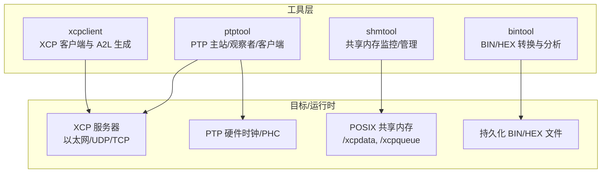
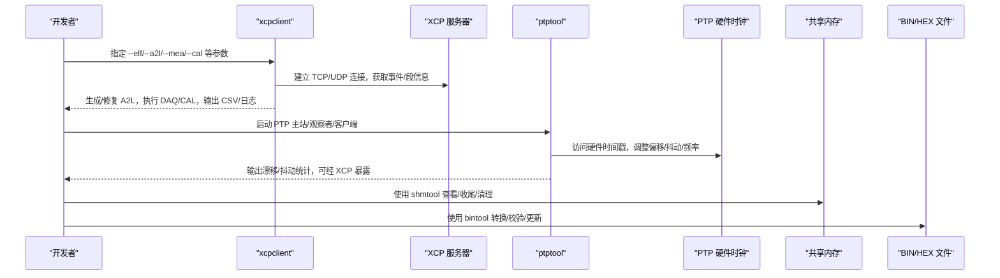
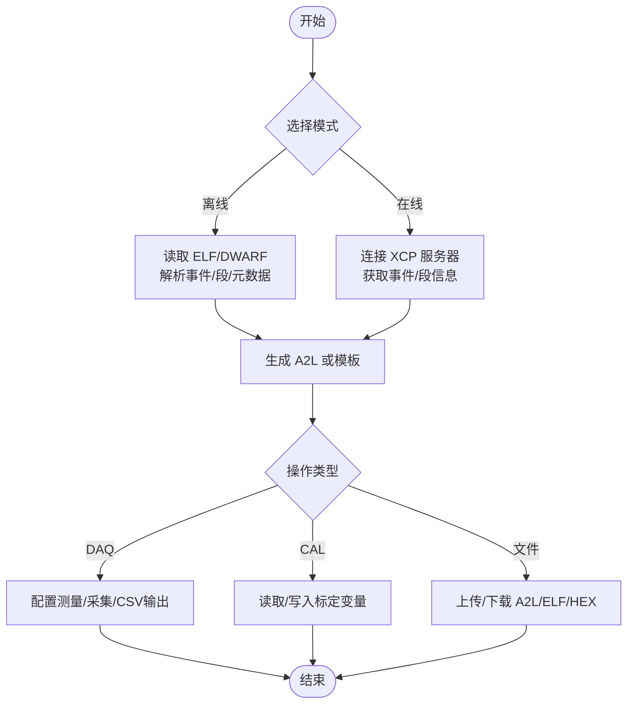
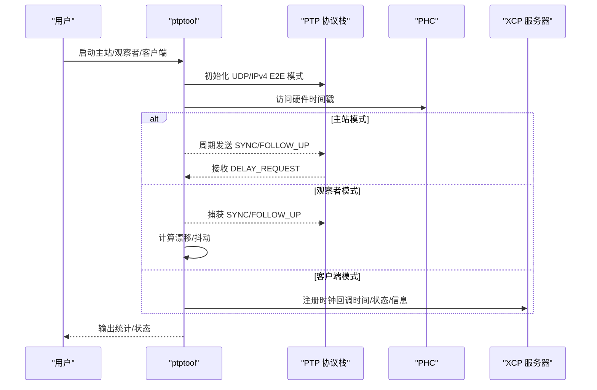
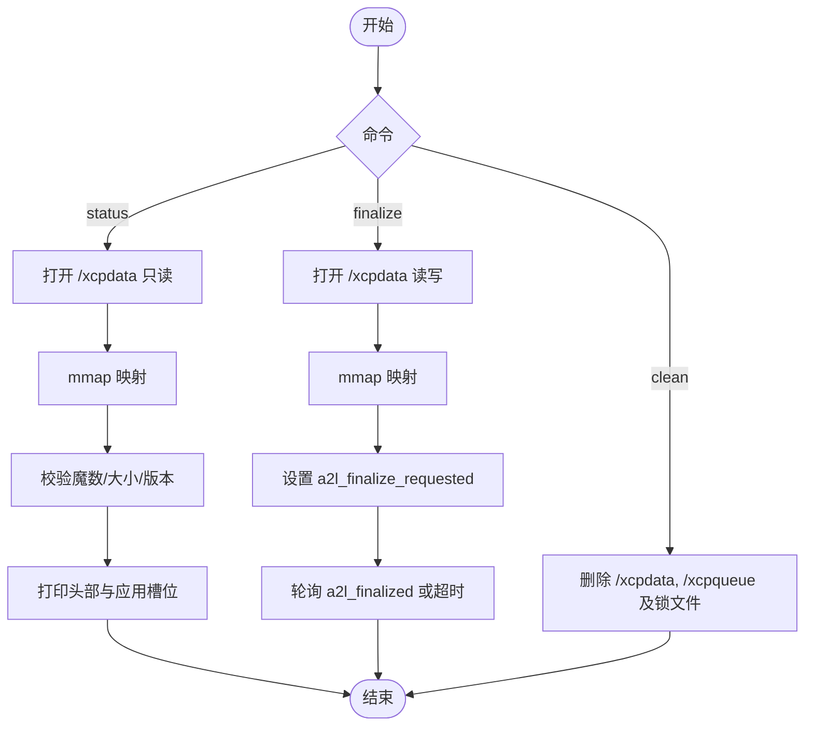
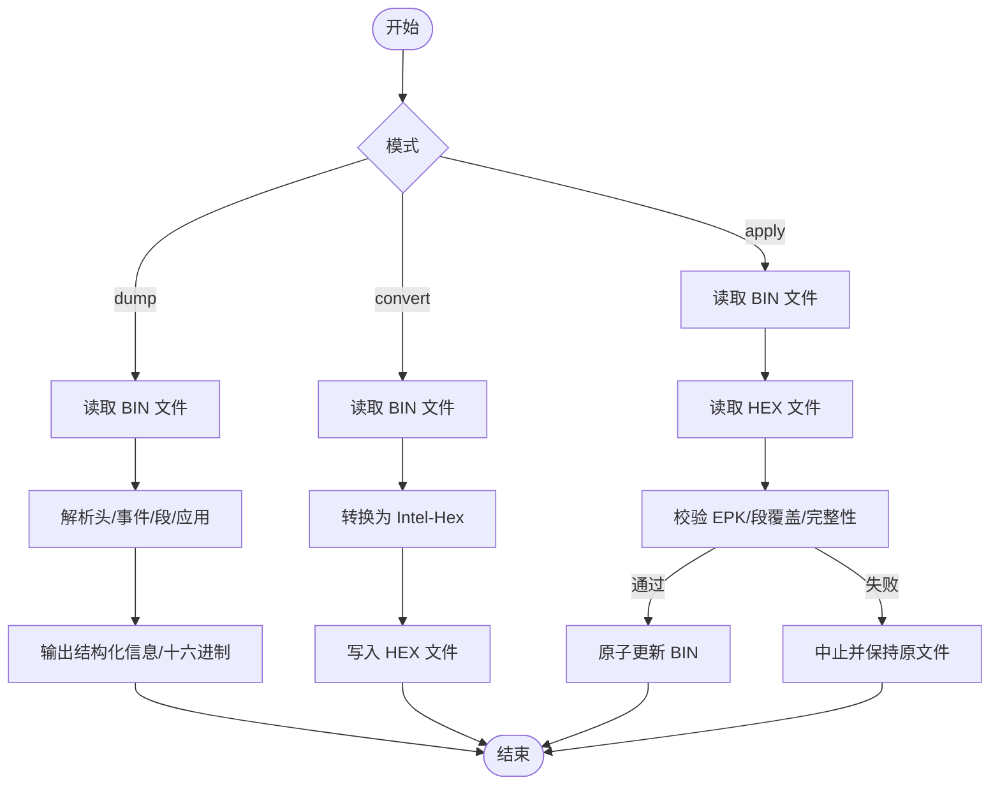
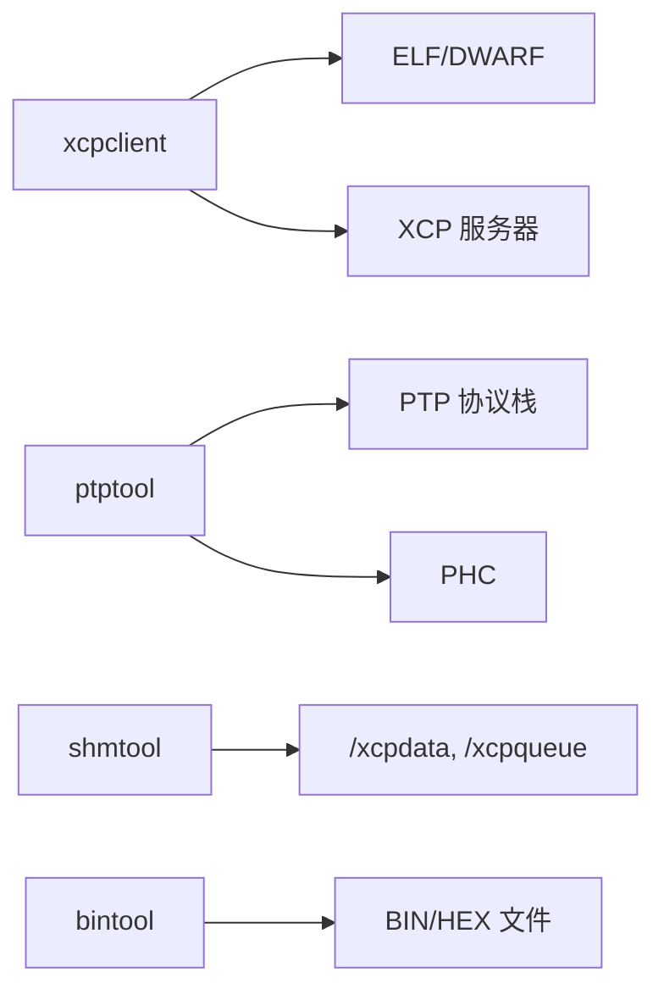

# 工具和实用程序

<cite>
**本文引用的文件**
- [tools/xcpclient/README.md](file://tools/xcpclient/README.md)
- [tools/xcpclient/src/main.rs](file://tools/xcpclient/src/main.rs)
- [docs/OFFLINE_A2L.md](file://docs/OFFLINE_A2L.md)
- [tools/ptptool/README.md](file://tools/ptptool/README.md)
- [tools/ptptool/src/main.cpp](file://tools/ptptool/src/main.cpp)
- [tools/shmtool/README.md](file://tools/shmtool/README.md)
- [tools/shmtool/src/main.cpp](file://tools/shmtool/src/main.cpp)
- [tools/bintool/README.md](file://tools/bintool/README.md)
- [tools/bintool/src/main.rs](file://tools/bintool/src/main.rs)
</cite>

## 目录
1. [简介](#简介)
2. [项目结构](#项目结构)
3. [核心组件](#核心组件)
4. [架构总览](#架构总览)
5. [详细组件分析](#详细组件分析)
6. [依赖关系分析](#依赖关系分析)
7. [性能注意事项](#性能注意事项)
8. [故障排查指南](#故障排查指南)
9. [结论](#结论)
10. [附录](#附录)

## 简介
本章节面向使用 XCPlite 的开发者与测试工程师，系统介绍工具链中的四个关键工具：xcpclient、ptptool、shmtool、bintool。重点覆盖：
- xcpclient 的离线 A2L 生成功能、调试与分析能力（连接 XCP 服务器、上传/下载 A2L/ELF/HEX、DAQ/CAL、A2L 模板生成与修复）
- ptptool 的时间同步工具配置与使用场景（PTP 主站、观察者、客户端模式，结合 XCP 进行稳定性测试）
- shmtool 的共享内存监控与管理（状态查看、A2L 收尾触发、清理残留）
- bintool 的二进制数据格式转换与分析（BIN↔HEX、结构检查、EPK 保护）

这些工具共同构成从构建产物到在线调试、时间同步、持久化数据管理的完整闭环，显著提升开发与调试效率。

## 项目结构
XCPlite 的工具位于 tools 目录下，每个工具独立实现并自带 README 与源码：
- xcpclient：Rust 实现的 XCP 测试客户端与 A2L 生成器，支持离线/在线两种工作流
- ptptool：C++ 实现的 PTP 工具，支持主站/观察者/客户端三种模式，并可集成 XCP 进行时钟校准
- shmtool：C++ 实现的 POSIX 共享内存诊断工具，用于多进程 SHM 模式的监控与清理
- bintool：Rust 实现的 BIN/HEX 转换器，提供持久化数据的读取、校验与更新

图表来源
- [tools/xcpclient/README.md:1-30](file://tools/xcpclient/README.md#L1-L30)
- [tools/ptptool/README.md:1-36](file://tools/ptptool/README.md#L1-L36)
- [tools/shmtool/README.md:1-30](file://tools/shmtool/README.md#L1-L30)
- [tools/bintool/README.md:1-20](file://tools/bintool/README.md#L1-L20)

章节来源
- [tools/xcpclient/README.md:1-30](file://tools/xcpclient/README.md#L1-L30)
- [tools/ptptool/README.md:1-36](file://tools/ptptool/README.md#L1-L36)
- [tools/shmtool/README.md:1-30](file://tools/shmtool/README.md#L1-L30)
- [tools/bintool/README.md:1-20](file://tools/bintool/README.md#L1-L20)

## 核心组件
本节概述各工具的核心职责与典型用法，便于快速定位所需功能。

- xcpclient
  - 离线 A2L 生成：从 ELF/DWARF 与可选的 XCP 服务器事件/段信息生成完整 A2L
  - 在线交互：连接 XCP 服务器，上传/下载 A2L/ELF/HEX，执行 DAQ/CAL，运行测试序列
  - 配置加载：支持 TOML 配置文件合并命令行参数
  - 参考：[tools/xcpclient/README.md:24-191](file://tools/xcpclient/README.md#L24-L191)、[tools/xcpclient/src/main.rs:119-200](file://tools/xcpclient/src/main.rs#L119-L200)

- ptptool
  - PTP 主站：周期性发送 SYNC/FOLLOW_UP，响应 DELAY_REQUEST，支持通过 XCP 调整偏移/抖动/频率
  - PTP 观察者：捕获 PTP 消息，计算漂移与抖动，支持多主站比较
  - PTP 客户端：与外部 ptp4l/phc2sys 配合，提供 PTP 同步时钟给 XCP
  - 参考：[tools/ptptool/README.md:1-36](file://tools/ptptool/README.md#L1-L36)、[tools/ptptool/src/main.cpp:1-55](file://tools/ptptool/src/main.cpp#L1-L55)

- shmtool
  - 状态查看：打印 /xcpdata 与 /xcpqueue 的摘要与详细信息
  - A2L 收尾：设置 a2l_finalize_requested 并轮询确认
  - 清理：移除共享内存与锁文件，避免僵尸资源
  - 参考：[tools/shmtool/README.md:14-86](file://tools/shmtool/README.md#L14-L86)、[tools/shmtool/src/main.cpp:71-200](file://tools/shmtool/src/main.cpp#L71-L200)

- bintool
  - BIN→HEX：提取校准段数据为 Intel-Hex
  - HEX→BIN：安全地将 HEX 数据写回 BIN，包含 EPK 保护与原子更新
  - 转储：查看文件头、事件、段信息与十六进制数据
  - 参考：[tools/bintool/README.md:17-50](file://tools/bintool/README.md#L17-L50)、[tools/bintool/src/main.rs:41-72](file://tools/bintool/src/main.rs#L41-L72)

章节来源
- [tools/xcpclient/README.md:24-191](file://tools/xcpclient/README.md#L24-L191)
- [tools/xcpclient/src/main.rs:119-200](file://tools/xcpclient/src/main.rs#L119-L200)
- [tools/ptptool/README.md:1-36](file://tools/ptptool/README.md#L1-L36)
- [tools/ptptool/src/main.cpp:1-55](file://tools/ptptool/src/main.cpp#L1-L55)
- [tools/shmtool/README.md:14-86](file://tools/shmtool/README.md#L14-L86)
- [tools/shmtool/src/main.cpp:71-200](file://tools/shmtool/src/main.cpp#L71-L200)
- [tools/bintool/README.md:17-50](file://tools/bintool/README.md#L17-L50)
- [tools/bintool/src/main.rs:41-72](file://tools/bintool/src/main.rs#L41-L72)

## 架构总览
下图展示工具与目标系统的交互关系，以及数据与控制流向。

图表来源
- [tools/xcpclient/README.md:24-191](file://tools/xcpclient/README.md#L24-L191)
- [tools/ptptool/README.md:1-36](file://tools/ptptool/README.md#L1-L36)
- [tools/shmtool/README.md:14-86](file://tools/shmtool/README.md#L14-L86)
- [tools/bintool/README.md:17-50](file://tools/bintool/README.md#L17-L50)

## 详细组件分析

### xcpclient：离线 A2L 生成与调试分析
- 离线 A2L 生成
  - 从 ELF/DWARF 解析事件、校准段、元数据与类型信息，结合可选的 XCP 服务器事件/段信息，生成完整 A2L
  - 支持仅生成模板（事件/段/IF_DATA），便于后续工具补全
  - 支持变量过滤（编译单元/名称正则）、跳过无元数据变量、默认事件分配
  - 参考：[docs/OFFLINE_A2L.md:1-63](file://docs/OFFLINE_A2L.md#L1-L63)、[tools/xcpclient/README.md:24-191](file://tools/xcpclient/README.md#L24-L191)

- 在线调试与分析
  - 连接 XCP 服务器（TCP/UDP/SxI），上传/下载 A2L/ELF/HEX
  - 执行 DAQ（测量）与 CAL（标定），支持 CSV 输出与超时控制
  - 执行测试序列，校验 EPK 一致性，失败时中止或强制继续
  - 参考：[tools/xcpclient/README.md:10-23](file://tools/xcpclient/README.md#L10-L23)、[tools/xcpclient/src/main.rs:119-200](file://tools/xcpclient/src/main.rs#L119-L200)

- 安装与构建
  - 使用 Cargo 安装与测试
  - 参考：[tools/xcpclient/README.md:194-206](file://tools/xcpclient/README.md#L194-L206)

- 命令行参数（节选）
  - 网络与协议：--dest-addr, --port, --tcp, --udp, --sxi, --connect-mode
  - A2L/ELF：--create-a2l, --create-a2l-template, --fix-a2l, --upload-a2l, --upload-elf, --elf, --a2l
  - 数据操作：--mea, --list-mea, --cal, --list-cal, --bin, --upload-bin, --download-bin
  - 其他：--offline, --time, --csv, --default-event, --config, --log-level, --verbose, --yes
  - 参考：[tools/xcpclient/README.md:41-191](file://tools/xcpclient/README.md#L41-L191)

- 实际使用示例（路径引用）
  - 列出所有标定/测量变量：[tools/xcpclient/README.md:211-216](file://tools/xcpclient/README.md#L211-L216)
  - 设置标定变量：[tools/xcpclient/README.md:218-223](file://tools/xcpclient/README.md#L218-L223)
  - 测量变量（上传 A2L/给定 A2L/从 ELF 生成）：[tools/xcpclient/README.md:225-250](file://tools/xcpclient/README.md#L225-L250)
  - 从 ELF 离线生成 A2L：[tools/xcpclient/README.md:259-270](file://tools/xcpclient/README.md#L259-L270)
  - 上传标定数据至 HEX：[tools/xcpclient/README.md:277-281](file://tools/xcpclient/README.md#L277-L281)

图表来源
- [tools/xcpclient/README.md:24-191](file://tools/xcpclient/README.md#L24-L191)
- [docs/OFFLINE_A2L.md:35-63](file://docs/OFFLINE_A2L.md#L35-L63)

章节来源
- [tools/xcpclient/README.md:24-191](file://tools/xcpclient/README.md#L24-L191)
- [tools/xcpclient/src/main.rs:119-200](file://tools/xcpclient/src/main.rs#L119-L200)
- [docs/OFFLINE_A2L.md:1-63](file://docs/OFFLINE_A2L.md#L1-L63)

### ptptool：时间同步工具的配置与使用
- 模式与用途
  - PTP 主站：周期性发送 SYNC/FOLLOW_UP，响应 DELAY_REQUEST；可通过 XCP 调整偏移/抖动/频率，用于测试客户端稳定性
  - PTP 观察者：监听 PTP 消息，计算漂移与抖动，支持多主站对比
  - PTP 客户端：与 ptp4l/phc2sys 协同，提供 PTP 同步时钟给 XCP
  - 参考：[tools/ptptool/README.md:1-36](file://tools/ptptool/README.md#L1-L36)、[tools/ptptool/README.md:53-76](file://tools/ptptool/README.md#L53-L76)

- 构建与选项
  - CMake 构建目标 ptptool，启用 PTP 工具开关
  - 命令行选项：接口、主站/观察者/自动模式、被动模式、域号、UUID、日志级别
  - 参考：[tools/ptptool/README.md:11-36](file://tools/ptptool/README.md#L11-L36)

- 典型场景
  - 在 Linux 上启动 ptp4l/phc2sys 后，以客户端模式运行 ptptool，将 PTP 同步时钟接入 XCP
  - 在多网卡设备上启动多个主站实例，使用自动观察者模式比较不同主站的时钟质量
  - 参考：[tools/ptptool/README.md:38-49](file://tools/ptptool/README.md#L38-L49)、[tools/ptptool/README.md:79-147](file://tools/ptptool/README.md#L79-L147)

- 硬件要求与调试
  - 检查网卡硬件时间戳支持与 PHC 设备
  - 使用 strace 追踪 setsockopt 调用，验证硬件时间戳启用
  - 参考：[tools/ptptool/README.md:172-188](file://tools/ptptool/README.md#L172-L188)、[tools/ptptool/README.md:215-229](file://tools/ptptool/README.md#L215-L229)

图表来源
- [tools/ptptool/src/main.cpp:1-55](file://tools/ptptool/src/main.cpp#L1-L55)
- [tools/ptptool/README.md:1-36](file://tools/ptptool/README.md#L1-L36)

章节来源
- [tools/ptptool/README.md:1-36](file://tools/ptptool/README.md#L1-L36)
- [tools/ptptool/src/main.cpp:1-55](file://tools/ptptool/src/main.cpp#L1-L55)

### shmtool：共享内存监控与管理
- 功能概览
  - status：打印 /xcpdata 与 /xcpqueue 的摘要与详细信息（版本、leader pid、应用计数、A2L finalize 状态等）
  - finalize：设置 a2l_finalize_requested，轮询直到所有应用确认 finalized 或超时
  - clean：移除共享内存与锁文件，避免僵尸资源
  - 参考：[tools/shmtool/README.md:14-86](file://tools/shmtool/README.md#L14-L86)

- 构建与依赖
  - 作为 XCPlite CMake 项目的一部分构建，需启用 OPTION_SHM_MODE
  - 参考：[tools/shmtool/README.md:89-100](file://tools/shmtool/README.md#L89-L100)

- 内部流程（status/finalize）
  - 打开并映射 /xcpdata，校验魔数与大小，打印头部与应用槽位信息
  - finalize 以读写方式映射，设置标志位并轮询确认
  - 参考：[tools/shmtool/src/main.cpp:71-200](file://tools/shmtool/src/main.cpp#L71-L200)

图表来源
- [tools/shmtool/src/main.cpp:71-200](file://tools/shmtool/src/main.cpp#L71-L200)

章节来源
- [tools/shmtool/README.md:14-86](file://tools/shmtool/README.md#L14-L86)
- [tools/shmtool/src/main.cpp:71-200](file://tools/shmtool/src/main.cpp#L71-L200)

### bintool：二进制工具的数据格式转换与分析
- 功能概览
  - BIN→HEX：提取校准段数据为 Intel-Hex（含扩展线性地址记录）
  - HEX→BIN：安全地将 HEX 数据写回 BIN，包含 EPK 保护与原子更新
  - 转储：查看文件头、事件、段信息与十六进制数据
  - 参考：[tools/bintool/README.md:17-50](file://tools/bintool/README.md#L17-L50)

- 构建与安装
  - 使用 Cargo 构建与安装，输出二进制位于 target/release 或 ~/.cargo/bin
  - 参考：[tools/bintool/README.md:54-61](file://tools/bintool/README.md#L54-L61)

- 安全特性（HEX→BIN）
  - EPK 段保护：首段名为 epk 时，尺寸与内容必须完全匹配
  - 完整段覆盖：HEX 数据必须完全覆盖每个 BIN 段，拒绝部分更新
  - 原子更新：先全部验证再写入，确保原文件不被破坏
  - 参考：[tools/bintool/README.md:183-201](file://tools/bintool/README.md#L183-L201)

- 数据结构与流程
  - 读取 BIN 头、事件描述符、校准段描述符与数据、应用描述符
  - 根据模式输出 HEX 或应用 HEX 更新
  - 参考：[tools/bintool/src/main.rs:74-172](file://tools/bintool/src/main.rs#L74-L172)

图表来源
- [tools/bintool/src/main.rs:74-172](file://tools/bintool/src/main.rs#L74-L172)
- [tools/bintool/README.md:183-201](file://tools/bintool/README.md#L183-L201)

章节来源
- [tools/bintool/README.md:17-50](file://tools/bintool/README.md#L17-L50)
- [tools/bintool/src/main.rs:74-172](file://tools/bintool/src/main.rs#L74-L172)

## 依赖关系分析
- xcpclient
  - 依赖 Rust 生态：clap（参数解析）、figment（TOML 配置）、elf_reader（ELF/DWARF 解析）、xcp_client（XCP 协议实现）
  - 与目标系统交互：TCP/UDP 连接 XCP 服务器，读取/写入 A2L/ELF/HEX
  - 参考：[tools/xcpclient/src/main.rs:16-39](file://tools/xcpclient/src/main.rs#L16-L39)、[tools/xcpclient/README.md:194-206](file://tools/xcpclient/README.md#L194-L206)

- ptptool
  - 依赖 C++ 标准库与平台抽象（platform.h），可选集成 XCP 客户端/主站/观察者模块
  - 与硬件交互：PTP 协议栈、PHC 设备、网络接口
  - 参考：[tools/ptptool/src/main.cpp:1-55](file://tools/ptptool/src/main.cpp#L1-L55)、[tools/ptptool/README.md:172-188](file://tools/ptptool/README.md#L172-L188)

- shmtool
  - 依赖 POSIX 共享内存 API（shm_open/mmap），直接访问 /xcpdata 与 /xcpqueue
  - 与 XCPlite 结构体布局保持同步（xcplite.h）
  - 参考：[tools/shmtool/src/main.cpp:30-48](file://tools/shmtool/src/main.cpp#L30-L48)、[tools/shmtool/README.md:89-100](file://tools/shmtool/README.md#L89-L100)

- bintool
  - 依赖 Rust 生态：clap、ihex（Intel-Hex 支持）、thiserror（错误处理）
  - 与持久化文件格式交互：BIN 头/事件/校准段/应用描述符
  - 参考：[tools/bintool/README.md:203-208](file://tools/bintool/README.md#L203-L208)、[tools/bintool/src/main.rs:74-172](file://tools/bintool/src/main.rs#L74-L172)

图表来源
- [tools/xcpclient/src/main.rs:16-39](file://tools/xcpclient/src/main.rs#L16-L39)
- [tools/ptptool/src/main.cpp:1-55](file://tools/ptptool/src/main.cpp#L1-L55)
- [tools/shmtool/src/main.cpp:30-48](file://tools/shmtool/src/main.cpp#L30-L48)
- [tools/bintool/src/main.rs:74-172](file://tools/bintool/src/main.rs#L74-L172)

章节来源
- [tools/xcpclient/src/main.rs:16-39](file://tools/xcpclient/src/main.rs#L16-L39)
- [tools/ptptool/src/main.cpp:1-55](file://tools/ptptool/src/main.cpp#L1-L55)
- [tools/shmtool/src/main.cpp:30-48](file://tools/shmtool/src/main.cpp#L30-L48)
- [tools/bintool/src/main.rs:74-172](file://tools/bintool/src/main.rs#L74-L172)

## 性能注意事项
- xcpclient
  - 大量变量测量时建议限制范围（正则过滤、单位过滤），减少 CPU 与 I/O 压力
  - CSV 输出适合自动化分析，但需注意磁盘写入速率与文件大小
  - 参考：[tools/xcpclient/README.md:127-169](file://tools/xcpclient/README.md#L127-L169)

- ptptool
  - 高漂移/抖动环境下，基础滤波算法需要较长时间稳定，测量值可能不可靠
  - 建议使用具备良好硬件时间戳的系统，并确保 PHC 已同步
  - 参考：[tools/ptptool/README.md:63-76](file://tools/ptptool/README.md#L63-L76)、[tools/ptptool/README.md:172-188](file://tools/ptptool/README.md#L172-L188)

- shmtool
  - 轮询 finalize 时需合理设置超时，避免长时间阻塞
  - 清理操作应在所有应用停止后进行，防止误删活跃资源
  - 参考：[tools/shmtool/README.md:61-86](file://tools/shmtool/README.md#L61-L86)

- bintool
  - 大文件转换时注意内存占用与磁盘空间
  - HEX→BIN 更新前进行完整校验，避免部分更新导致数据损坏
  - 参考：[tools/bintool/README.md:183-201](file://tools/bintool/README.md#L183-L201)

## 故障排查指南
- xcpclient
  - 常见错误：连接失败、ELF/A2L 文件不可用、测试失败；退出码 1 表示错误
  - 诊断要点：检查 DWARF 调试信息是否完整、macOS Mach-O 不支持、EPK 不匹配
  - 参考：[tools/xcpclient/README.md:32-37](file://tools/xcpclient/README.md#L32-L37)、[docs/OFFLINE_A2L.md:244-269](file://docs/OFFLINE_A2L.md#L244-L269)

- ptptool
  - 常见问题：PHC 未同步、硬件时间戳未启用、驱动锁定 PHC
  - 调试方法：strace 追踪 setsockopt，检查 /dev/ptp* 设备，验证内核时间戳支持
  - 参考：[tools/ptptool/README.md:86-99](file://tools/ptptool/README.md#L86-L99)、[tools/ptptool/README.md:215-229](file://tools/ptptool/README.md#L215-L229)

- shmtool
  - 常见问题：共享内存不存在、版本不匹配、僵尸锁文件
  - 处理方法：使用 clean 清理残留，确保所有应用停止后再清理
  - 参考：[tools/shmtool/README.md:72-86](file://tools/shmtool/README.md#L72-L86)、[tools/shmtool/src/main.cpp:71-132](file://tools/shmtool/src/main.cpp#L71-L132)

- bintool
  - 常见问题：EPK 不匹配、段覆盖不完整、文件格式无效
  - 处理方法：校验 HEX 与 BIN 的 EPK 与段尺寸，确保原子更新前全部验证通过
  - 参考：[tools/bintool/README.md:183-201](file://tools/bintool/README.md#L183-L201)

章节来源
- [tools/xcpclient/README.md:32-37](file://tools/xcpclient/README.md#L32-L37)
- [docs/OFFLINE_A2L.md:244-269](file://docs/OFFLINE_A2L.md#L244-L269)
- [tools/ptptool/README.md:86-99](file://tools/ptptool/README.md#L86-L99)
- [tools/ptptool/README.md:215-229](file://tools/ptptool/README.md#L215-L229)
- [tools/shmtool/README.md:72-86](file://tools/shmtool/README.md#L72-L86)
- [tools/shmtool/src/main.cpp:71-132](file://tools/shmtool/src/main.cpp#L71-L132)
- [tools/bintool/README.md:183-201](file://tools/bintool/README.md#L183-L201)

## 结论
XCPlite 的工具链提供了从构建产物到在线调试、时间同步、持久化数据管理的完整支持：
- xcpclient 是核心调试与分析工具，支持离线 A2L 生成与在线交互，显著提升开发效率
- ptptool 提供 PTP 主站/观察者/客户端模式，结合 XCP 进行时钟稳定性测试
- shmtool 保障多进程 SHM 模式的可靠运行，提供状态查看、收尾与清理能力
- bintool 确保持久化数据的正确性与安全性，支持 BIN/HEX 转换与安全更新

通过合理使用这些工具，开发者可以高效完成 A2L 管理、数据采集、标定、时间同步与数据持久化等任务，缩短迭代周期，提高系统可靠性。

## 附录
- 快速上手清单
  - 安装 xcpclient：[tools/xcpclient/README.md:194-206](file://tools/xcpclient/README.md#L194-L206)
  - 构建 ptptool：[tools/ptptool/README.md:11-16](file://tools/ptptool/README.md#L11-L16)
  - 构建 shmtool：[tools/shmtool/README.md:89-96](file://tools/shmtool/README.md#L89-L96)
  - 安装 bintool：[tools/bintool/README.md:54-61](file://tools/bintool/README.md#L54-L61)

- 常用命令路径
  - xcpclient 示例：[tools/xcpclient/README.md:211-296](file://tools/xcpclient/README.md#L211-L296)
  - ptptool 示例：[tools/ptptool/README.md:38-147](file://tools/ptptool/README.md#L38-L147)
  - shmtool 命令：[tools/shmtool/README.md:31-86](file://tools/shmtool/README.md#L31-L86)
  - bintool 示例：[tools/bintool/README.md:63-170](file://tools/bintool/README.md#L63-L170)