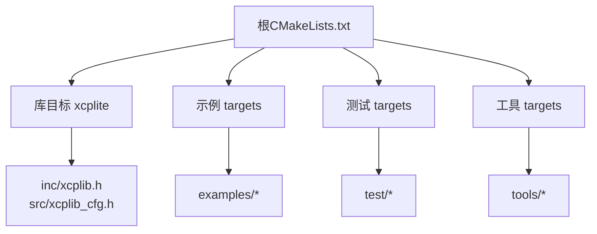
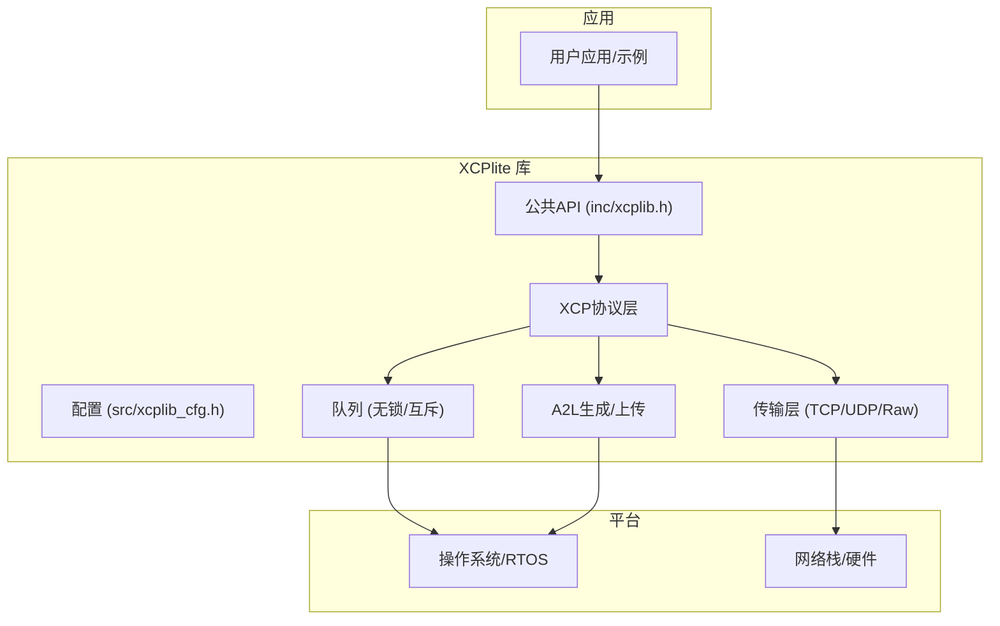
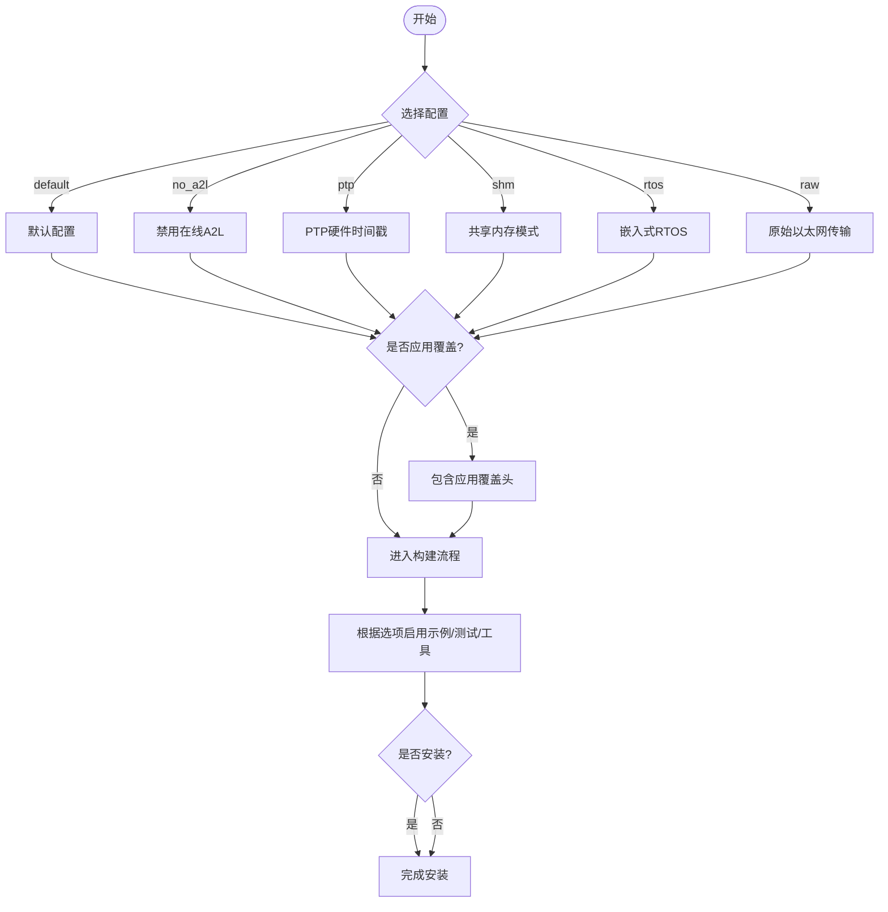
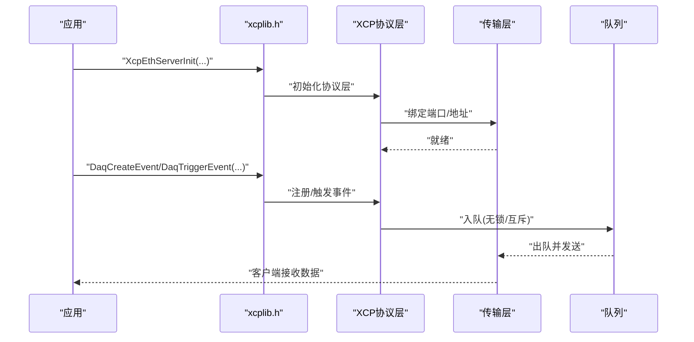
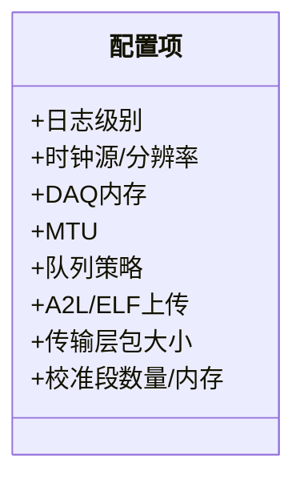
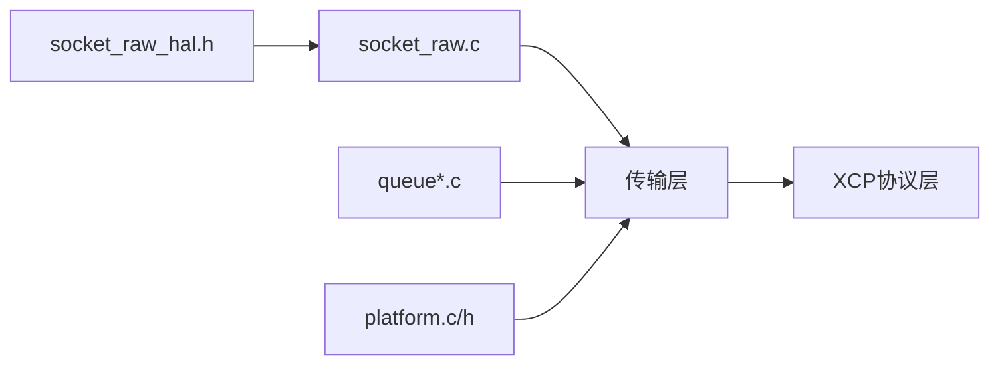
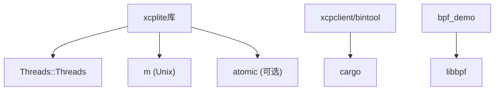

# 开发指南

<cite>
**本文引用的文件**
- [README.md](file://README.md)
- [CMakeLists.txt](file://CMakeLists.txt)
- [.clang-format](file://.clang-format)
- [.clang-tidy](file://.clang-tidy)
- [docs/BUILDING.md](file://docs/BUILDING.md)
- [src/xcplib_cfg.h](file://src/xcplib_cfg.h)
- [inc/xcplib.h](file://inc/xcplib.h)
- [examples/fetchcontent_example/config/xcplib_app_cfg.h](file://examples/fetchcontent_example/config/xcplib_app_cfg.h)
- [docs/xcplib_cfg.md](file://docs/xcplib_cfg.md)
</cite>

## 目录
1. [简介](#简介)
2. [项目结构](#项目结构)
3. [核心组件](#核心组件)
4. [架构总览](#架构总览)
5. [详细组件分析](#详细组件分析)
6. [依赖关系分析](#依赖关系分析)
7. [性能考量](#性能考量)
8. [故障排查指南](#故障排查指南)
9. [结论](#结论)
10. [附录](#附录)

## 简介
本指南面向开源贡献者与企业开发者，提供XCPlite的标准化开发工作流程与规范。内容涵盖：
- 代码风格与静态分析配置（C/C++格式化、Clang-Tidy规则）
- 构建系统与多配置管理（CMake、构建选项、安装与使用）
- 提交流程、分支管理与版本控制最佳实践
- 新功能开发流程、测试要求与文档更新规范
- 扩展点设计与插件开发方法（自定义传输层与平台适配）
- 代码审查清单、质量保证标准与发布流程

XCPlite是面向现代多核处理器与POSIX/RTOS平台的XCP on Ethernet实现，支持相对寻址、无锁队列、运行时A2L生成、复杂类型与PTP时间戳等特性。

**章节来源**
- [README.md:1-130](file://README.md#L1-L130)

## 项目结构
仓库采用分层组织：
- inc/src：公共API与库实现
- examples：示例应用（C/C++、FreeRTOS、SILKit、PTP、BPF等）
- test：单元与集成测试
- tools：辅助工具（xcpclient、bintool、ptptool、shmtool、xcpdaemon）
- docs：构建、配置与技术文档
- cmake：包配置模板
- 根级：CMakeLists.txt、.clang-format/.clang-tidy、README等

**图示来源**
- [CMakeLists.txt:245-259](file://CMakeLists.txt#L245-L259)
- [CMakeLists.txt:318-423](file://CMakeLists.txt#L318-L423)
- [CMakeLists.txt:430-502](file://CMakeLists.txt#L430-L502)
- [CMakeLists.txt:509-586](file://CMakeLists.txt#L509-L586)

**章节来源**
- [CMakeLists.txt:1-162](file://CMakeLists.txt#L1-L162)
- [docs/BUILDING.md:11-84](file://docs/BUILDING.md#L11-L84)

## 核心组件
- 公共API与事件/校准段接口：inc/xcplib.h
- 默认配置与可覆盖选项：src/xcplib_cfg.h
- 构建配置与目标管理：CMakeLists.txt
- 应用级配置覆盖示例：examples/fetchcontent_example/config/xcplib_app_cfg.h
- 配置参考说明：docs/xcplib_cfg.md

关键职责：
- API层定义事件创建/触发、校准段管理、服务器初始化等
- 配置层通过OPTION_*宏开关功能、内存与网络参数
- CMake层按配置选择编译集、启用示例/测试/工具并处理安装

**章节来源**
- [inc/xcplib.h:31-57](file://inc/xcplib.h#L31-L57)
- [src/xcplib_cfg.h:18-23](file://src/xcplib_cfg.h#L18-L23)
- [CMakeLists.txt:15-108](file://CMakeLists.txt#L15-L108)
- [examples/fetchcontent_example/config/xcplib_app_cfg.h:1-30](file://examples/fetchcontent_example/config/xcplib_app_cfg.h#L1-L30)
- [docs/xcplib_cfg.md:1-24](file://docs/xcplib_cfg.md#L1-L24)

## 架构总览
XCPlite以“协议层 + 传输层 + 平台抽象”的分层架构组织，配合可插拔的队列与A2L生成机制。

**图示来源**
- [inc/xcplib.h:39-57](file://inc/xcplib.h#L39-L57)
- [src/xcplib_cfg.h:73-168](file://src/xcplib_cfg.h#L73-L168)
- [CMakeLists.txt:245-259](file://CMakeLists.txt#L245-L259)

## 详细组件分析

### 构建系统与配置
- 构建配置：通过XCPLITE_CONFIGURATION选择default/no_a2l/ptp/shm/rtos/raw，各配置互斥且需独立构建目录
- 应用覆盖：XCPLITE_CFG_OVERRIDE在default配置下引入应用级覆盖头，统一传播给库与消费者
- 构建选项：XCPLITE_BUILD_EXAMPLES/TESTS/TOOLS/RUST_TOOLS/BPF_DEMO/INSTALL控制目标
- 安装：顶层项目默认开启安装，子项目默认关闭以避免污染消费方

**图示来源**
- [CMakeLists.txt:15-108](file://CMakeLists.txt#L15-L108)
- [CMakeLists.txt:111-155](file://CMakeLists.txt#L111-L155)
- [CMakeLists.txt:593-656](file://CMakeLists.txt#L593-L656)
- [docs/BUILDING.md:11-61](file://docs/BUILDING.md#L11-L61)

**章节来源**
- [CMakeLists.txt:15-108](file://CMakeLists.txt#L15-L108)
- [docs/BUILDING.md:11-61](file://docs/BUILDING.md#L11-L61)

### 公共API与事件/校准段
- 事件系统：支持链接期/运行期事件注册、线程本地缓存、捕获局部变量测量
- 校准段：工作页/参考页切换、原子访问、持久化、EPK校验
- 服务器：以太网TCP/UDP初始化、状态查询、线程安全

**图示来源**
- [inc/xcplib.h:39-57](file://inc/xcplib.h#L39-L57)
- [inc/xcplib.h:238-453](file://inc/xcplib.h#L238-L453)
- [inc/xcplib.h:456-757](file://inc/xcplib.h#L456-L757)

**章节来源**
- [inc/xcplib.h:39-57](file://inc/xcplib.h#L39-L57)
- [inc/xcplib.h:238-453](file://inc/xcplib.h#L238-L453)
- [inc/xcplib.h:456-757](file://inc/xcplib.h#L456-L757)

### 配置项与可调参数
- 日志级别、时钟源/分辨率、DAQ内存、MTU、队列策略、A2L/ELF上传开关
- 传输层包大小、对齐、多播端口等
- 校准段数量与内存、延迟写、超时等

**图示来源**
- [src/xcplib_cfg.h:42-168](file://src/xcplib_cfg.h#L42-L168)
- [docs/xcplib_cfg.md:30-187](file://docs/xcplib_cfg.md#L30-L187)

**章节来源**
- [src/xcplib_cfg.h:42-168](file://src/xcplib_cfg.h#L42-L168)
- [docs/xcplib_cfg.md:30-187](file://docs/xcplib_cfg.md#L30-L187)

### 扩展点与插件开发（传输层与平台适配）
- 原始以太网HAL：提供socket_raw_hal.h接口，允许外部实现AF_PACKET或CMP后端
- 队列策略：可选无锁64位变长/定长或32位互斥队列，依据平台自动选择
- 传输层：TCP/UDP内置；raw模式在库内封装UDP/IPv4，无需完整TCP/IP栈
- 平台抽象：platform.c/h提供时钟、线程、内存等抽象

**图示来源**
- [CMakeLists.txt:245-259](file://CMakeLists.txt#L245-L259)
- [CMakeLists.txt:477-496](file://CMakeLists.txt#L477-L496)

**章节来源**
- [CMakeLists.txt:245-259](file://CMakeLists.txt#L245-L259)
- [CMakeLists.txt:477-496](file://CMakeLists.txt#L477-L496)

## 依赖关系分析
- 编译器与标准：C11、C++17（Windows为C++20）
- 平台库：Threads、math、atomic（部分ARM Clang需要）
- 工具链：cargo（Rust工具）、libbpf（BPF演示）
- 外部依赖：CANape（示例与A2L验证）

**图示来源**
- [CMakeLists.txt:157-162](file://CMakeLists.txt#L157-L162)
- [CMakeLists.txt:297-311](file://CMakeLists.txt#L297-L311)
- [CMakeLists.txt:348-356](file://CMakeLists.txt#L348-L356)
- [CMakeLists.txt:556-586](file://CMakeLists.txt#L556-L586)

**章节来源**
- [CMakeLists.txt:157-162](file://CMakeLists.txt#L157-L162)
- [CMakeLists.txt:297-311](file://CMakeLists.txt#L297-L311)
- [CMakeLists.txt:348-356](file://CMakeLists.txt#L348-L356)
- [CMakeLists.txt:556-586](file://CMakeLists.txt#L556-L586)

## 性能考量
- 队列选择：64位无锁优先，32位/Windows回退到互斥队列
- DAQ表内存与事件数量：合理设置OPTION_DAQ_MEM_SIZE与OPTION_DAQ_EVENT_COUNT
- MTU与分片：确保路径支持Jumbo帧，避免分片导致丢包
- 日志级别：生产环境降低日志开销
- 优化等级：Release/RelWithDebInfo已预设优化与调试符号策略

[本节为通用指导，不直接分析具体文件]

## 故障排查指南
- 构建失败：确认C/C++标准、编译器、依赖库；必要时清理构建目录后重试
- 原子库缺失：ARM Clang可能需要-latomic，CMake已自动检测
- 权限问题：raw模式需CAP_NET_RAW；Linux下注意网络权限
- 工具链缺失：Rust工具需cargo；BPF演示需libbpf
- 配置冲突：不同配置必须使用独立构建目录；应用覆盖仅适用于default

**章节来源**
- [docs/BUILDING.md:364-416](file://docs/BUILDING.md#L364-L416)

## 结论
本指南提供了从编码风格、构建配置到扩展开发与质量保障的完整流程。遵循本指南可确保跨平台一致性、可维护性与高性能交付。建议团队将本指南纳入开发规范，并在CI中强制执行格式与静态检查。

[本节为总结性内容，不直接分析具体文件]

## 附录

### 代码风格与静态分析
- 格式化：基于LLVM风格，缩进4空格，列宽180
- 静态检查：启用clang-analyzer、readability、bugprone、modernize、concurrency、performance、cert、cppcoreguidelines、hicpp、portability等规则集，并对命名、宏、移动语义等进行细化配置

**章节来源**
- [.clang-format:1-12](file://.clang-format#L1-L12)
- [.clang-tidy:1-136](file://.clang-tidy#L1-L136)

### 构建与安装速查
- 快速构建：使用build.sh或直接cmake命令
- 配置选择：default/no_a2l/ptp/shm/rtos/raw
- 安装：顶层默认开启，子项目默认关闭；可通过CMAKE_INSTALL_PREFIX指定路径

**章节来源**
- [docs/BUILDING.md:85-218](file://docs/BUILDING.md#L85-L218)
- [docs/BUILDING.md:267-341](file://docs/BUILDING.md#L267-L341)

### 新功能的开发流程
- 需求分析与设计：明确影响范围（API/配置/传输层/平台）
- 实现与配置：在对应模块添加实现，必要时新增OPTION_*并通过覆盖头启用
- 单元测试与集成测试：补充test/*用例，确保覆盖关键路径
- 文档更新：同步docs与示例说明
- 提交与审查：遵循分支策略与审查清单

[本节为流程性指导，不直接分析具体文件]

### 提交流程与分支管理
- 分支模型：建议使用feature/xxx、fix/xxx、release/xxx分支
- 提交信息：清晰描述变更动机与影响
- 合并前检查：格式、静态检查、测试通过
- 版本标记：按语义化版本打标签

[本节为流程性指导，不直接分析具体文件]

### 测试要求
- 必测项：构建所有配置下的示例/测试；覆盖关键API调用路径
- 回归测试：针对历史缺陷增加用例
- 性能基准：对队列、DAQ吞吐进行基准测试

[本节为流程性指导，不直接分析具体文件]

### 文档更新规范
- 变更同步：API/配置/构建变化需更新对应文档
- 示例更新：示例行为变化需更新README与配置文件
- 术语一致：保持与xcplib_cfg.md一致的术语

[本节为流程性指导，不直接分析具体文件]

### 扩展点与插件开发方法
- 自定义传输层：实现socket_raw_hal.h接口，替换底层收发逻辑
- 平台适配：在platform.c/h中实现时钟、线程、内存等抽象
- 队列策略：根据平台选择合适队列实现
- 配置覆盖：通过应用覆盖头精确控制功能与资源

**章节来源**
- [CMakeLists.txt:245-259](file://CMakeLists.txt#L245-L259)
- [CMakeLists.txt:477-496](file://CMakeLists.txt#L477-L496)

### 代码审查清单
- 正确性：边界条件、并发安全、错误处理
- 性能：内存分配、拷贝、队列深度、日志开销
- 可移植性：跨平台宏、编译器差异、依赖声明
- 可维护性：命名、注释、模块化、配置项合理性
- 安全性：输入校验、缓冲区溢出、权限控制

[本节为流程性指导，不直接分析具体文件]

### 质量保证标准
- 静态检查：CI中执行clang-tidy与格式化检查
- 单元测试：覆盖率阈值与关键路径覆盖
- 集成测试：端到端场景验证（A2L、DAQ、校准段）
- 性能基线：吞吐与时延监控

[本节为流程性指导，不直接分析具体文件]

### 发布流程
- 版本规划：确定版本号与变更范围
- 预发布检查：全配置构建、测试、文档校验
- 打包与安装：生成安装包与CMake包配置
- 发布说明：记录变更、已知问题与升级指引

[本节为流程性指导，不直接分析具体文件]