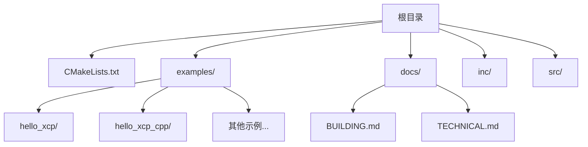
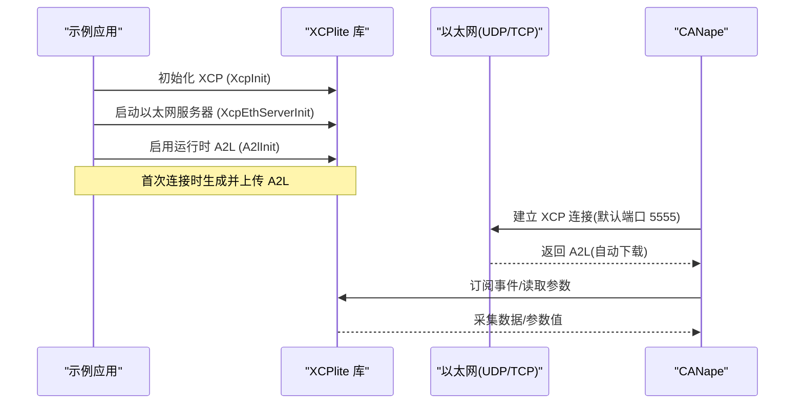
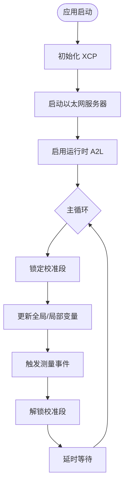
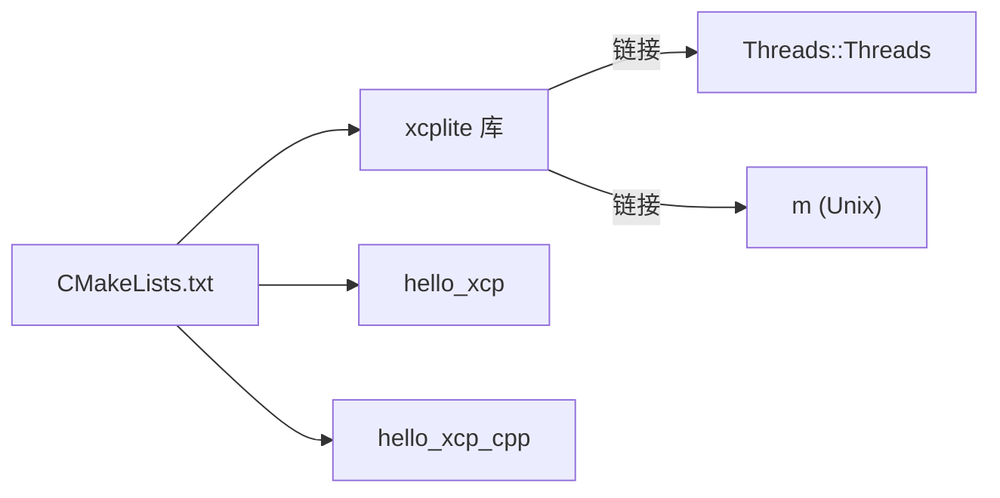

# 快速开始

<cite>
**本文引用的文件**
- [README.md](file://README.md)
- [CMakeLists.txt](file://CMakeLists.txt)
- [docs/BUILDING.md](file://docs/BUILDING.md)
- [examples/README.md](file://examples/README.md)
- [examples/hello_xcp/README.md](file://examples/hello_xcp/README.md)
- [examples/hello_xcp_cpp/README.md](file://examples/hello_xcp_cpp/README.md)
- [examples/hello_xcp/src/main.c](file://examples/hello_xcp/src/main.c)
- [examples/hello_xcp_cpp/src/main.cpp](file://examples/hello_xcp_cpp/src/main.cpp)
- [examples/hello_xcp/CANape/CANape.ini](file://examples/hello_xcp/CANape/CANape.ini)
- [examples/hello_xcp_cpp/CANape/CANape.ini](file://examples/hello_xcp_cpp/CANape/CANape.ini)
</cite>

## 目录
1. [简介](#简介)
2. [项目结构](#项目结构)
3. [核心组件](#核心组件)
4. [架构总览](#架构总览)
5. [详细组件分析](#详细组件分析)
6. [依赖关系分析](#依赖关系分析)
7. [性能注意事项](#性能注意事项)
8. [故障排除指南](#故障排除指南)
9. [结论](#结论)
10. [附录](#附录)

## 简介
本指南面向初学者，帮助你在最短时间内搭建并运行第一个 XCP 服务器示例（hello_xcp 与 hello_xcp_cpp），完成 CANape 工具的连接与配置，并提供常见问题排查建议。XCPlite 基于 CMake 构建，支持 Linux、macOS、QNX、Windows（有限制）等平台，默认使用以太网传输层（TCP/UDP）。

## 项目结构
仓库采用“库 + 示例 + 文档”的组织方式：
- 顶层 CMakeLists.txt 定义库目标、可选的示例、测试与工具，以及安装规则。
- examples 下包含多个可独立运行的示例，其中 hello_xcp（C）与 hello_xcp_cpp（C++）是入门首选。
- docs 提供构建说明、技术细节与 A2L 相关文档。
- inc 与 src 为公共头文件与库实现。

图表来源
- [CMakeLists.txt:1-656](file://CMakeLists.txt#L1-L656)
- [examples/README.md:1-273](file://examples/README.md#L1-L273)

章节来源
- [README.md:1-130](file://README.md#L1-L130)
- [CMakeLists.txt:1-656](file://CMakeLists.txt#L1-L656)
- [examples/README.md:1-273](file://examples/README.md#L1-L273)

## 核心组件
- 构建系统：CMake（最低版本要求见根 CMakeLists.txt），通过选项控制是否编译示例、测试与工具。
- 运行时：XCP on Ethernet（UDP/TCP），默认端口 5555；支持运行时 A2L 生成与自动上传。
- 示例程序：
  - hello_xcp：纯 C 示例，展示基础 XCP 服务器启动、校准段、事件测量、函数内局部变量测量等。
  - hello_xcp_cpp：C++ 示例，展示 RAII 校准段封装、类成员测量、模板/变参宏 API。
- 工具链：CANape（推荐 23+，部分高级特性需 24+），用于连接、A2L 自动下载与数据可视化。

章节来源
- [docs/BUILDING.md:1-416](file://docs/BUILDING.md#L1-L416)
- [examples/hello_xcp/README.md:1-72](file://examples/hello_xcp/README.md#L1-L72)
- [examples/hello_xcp_cpp/README.md:1-67](file://examples/hello_xcp_cpp/README.md#L1-L67)

## 架构总览
下图展示了从应用到工具的通信流程：应用初始化 XCP 与以太网服务器，运行时生成 A2L；CANape 通过 XCP over Ethernet 连接并自动获取 A2L，随后进行数据采集与参数标定。

图表来源
- [examples/hello_xcp/src/main.c:146-177](file://examples/hello_xcp/src/main.c#L146-L177)
- [examples/hello_xcp_cpp/src/main.cpp:183-210](file://examples/hello_xcp_cpp/src/main.cpp#L183-L210)
- [examples/hello_xcp/CANape/CANape.ini:1-800](file://examples/hello_xcp/CANape/CANape.ini#L1-L800)
- [examples/hello_xcp_cpp/CANape/CANape.ini:1-800](file://examples/hello_xcp_cpp/CANape/CANape.ini#L1-L800)

## 详细组件分析

### 环境要求与依赖
- 编译器标准：C11，C++17（Windows 上为 C++20）。
- 平台：Linux、macOS、QNX、FreeRTOS、Windows（有限制）。
- 构建系统：CMake（>= 指定版本，见根 CMakeLists.txt）。
- 线程库：POSIX 线程（Threads::Threads），在 Unix-like 平台还需数学库 m。
- 可选：Rust 工具链（若需要 xcpclient/bintool）、libbpf（仅 Linux，bpf_demo）。
- 工具：CANape 23+（部分高级特性需 24+）。

章节来源
- [docs/BUILDING.md:1-416](file://docs/BUILDING.md#L1-L416)
- [CMakeLists.txt:157-311](file://CMakeLists.txt#L157-L311)
- [README.md:78-99](file://README.md#L78-L99)

### 构建与运行第一个示例（hello_xcp 与 hello_xcp_cpp）
- 使用 CMake 直接构建（推荐）：
  - 配置并构建示例：cmake -B build -S . -DXCPLITE_BUILD_EXAMPLES=ON -DCMAKE_BUILD_TYPE=Debug
  - 构建目标：cmake --build build --target hello_xcp 或 hello_xcp_cpp
  - 运行：./build/hello_xcp 或 ./build/hello_xcp_cpp
- 使用脚本（如存在）：./build.sh examples
- 注意：不同配置（default/no_a2l/ptp/shm/raw/rtos）对应不同的示例集合，请根据需求选择构建目录。

章节来源
- [examples/hello_xcp/README.md:35-48](file://examples/hello_xcp/README.md#L35-L48)
- [examples/hello_xcp_cpp/README.md:31-44](file://examples/hello_xcp_cpp/README.md#L31-L44)
- [docs/BUILDING.md:85-218](file://docs/BUILDING.md#L85-L218)
- [CMakeLists.txt:318-423](file://CMakeLists.txt#L318-L423)

### CANape 配置与连接
- 打开示例中的 CANape 工程文件：examples/hello_xcp/CANape/CANape.ini 或 examples/hello_xcp_cpp/CANape/CANape.ini。
- 默认使用 XCP over Ethernet（UDP），端口 5555，并开启 A2L 自动上传。
- 若无法连接，检查设备配置中的 IP 地址与传输层设置（Device Configuration / Devices / XCP / Protocol / Transport Layer）。
- 首次连接后，CANape 会从目标自动下载 A2L 并完成信号/参数树加载。

章节来源
- [examples/hello_xcp/README.md:52-58](file://examples/hello_xcp/README.md#L52-L58)
- [examples/hello_xcp_cpp/README.md:48-54](file://examples/hello_xcp_cpp/README.md#L48-L54)
- [examples/hello_xcp/CANape/CANape.ini:1-800](file://examples/hello_xcp/CANape/CANape.ini#L1-L800)
- [examples/hello_xcp_cpp/CANape/CANape.ini:1-800](file://examples/hello_xcp_cpp/CANape/CANape.ini#L1-L800)

### 示例程序行为概览
- hello_xcp（C）：
  - 初始化 XCP 与以太网服务器，启用运行时 A2L。
  - 创建校准段并注册参数，支持绝对地址、栈帧相对地址、校准段相对地址。
  - 在主循环中触发事件，采集全局与局部变量。
- hello_xcp_cpp（C++）：
  - 使用 RAII 校准段封装，简化锁管理。
  - 演示类实例成员测量、模板/变参宏 API。
  - 主循环中触发事件，采集全局、局部与堆对象实例。

章节来源
- [examples/hello_xcp/src/main.c:146-282](file://examples/hello_xcp/src/main.c#L146-L282)
- [examples/hello_xcp_cpp/src/main.cpp:183-298](file://examples/hello_xcp_cpp/src/main.cpp#L183-L298)

### 关键流程图（以 hello_xcp 为例）

图表来源
- [examples/hello_xcp/src/main.c:199-273](file://examples/hello_xcp/src/main.c#L199-L273)

## 依赖关系分析
- 库目标 xcplite 由 CMake 定义，链接 Threads 与 math 库（Unix-like）。
- 示例目标（hello_xcp、hello_xcp_cpp）链接 xcplite。
- 不同 XCPLITE_CONFIGURATION 会启用/禁用特定示例与工具。

图表来源
- [CMakeLists.txt:245-311](file://CMakeLists.txt#L245-L311)
- [CMakeLists.txt:318-423](file://CMakeLists.txt#L318-L423)

章节来源
- [CMakeLists.txt:157-311](file://CMakeLists.txt#L157-L311)
- [CMakeLists.txt:318-423](file://CMakeLists.txt#L318-L423)

## 性能注意事项
- 队列大小：示例中测量队列大小应足够覆盖预期流量（至少 10ms 的缓冲）。
- 日志级别：调试时可提高日志级别观察 XCP 命令交互，生产环境建议降低日志开销。
- 校准段访问：尽量缩短锁定时间，避免阻塞 XCP 写入操作。
- 优化等级：Release/RelWithDebInfo 已内置优化策略，便于调试与发布。

章节来源
- [examples/hello_xcp/src/main.c:17-23](file://examples/hello_xcp/src/main.c#L17-L23)
- [examples/hello_xcp_cpp/src/main.cpp:17-23](file://examples/hello_xcp_cpp/src/main.cpp#L17-L23)
- [CMakeLists.txt:218-243](file://CMakeLists.txt#L218-L243)

## 故障排除指南
- 无法连接 CANape：
  - 确认示例进程已启动且监听端口 5555。
  - 检查 CANape 设备配置中的 IP 地址与传输层设置。
  - 防火墙或网络隔离可能导致连接失败。
- A2L 未自动下载：
  - 确保启用了运行时 A2L（A2lInit）。
  - 首次连接时会生成并上传 A2L；若本地已有 A2L 且版本匹配，可能不会重复上传。
- 构建失败：
  - 确认编译器满足 C11/C++17（Windows C++20）。
  - 清理旧构建目录后重新配置（切换编译器时需新建构建目录）。
  - 如需 Rust 工具（xcpclient/bintool），需安装 cargo。
- 权限问题（raw 模式）：
  - raw 以太网传输需要 CAP_NET_RAW（Linux），按文档要求配置网络环境。

章节来源
- [examples/hello_xcp/README.md:52-58](file://examples/hello_xcp/README.md#L52-L58)
- [examples/hello_xcp_cpp/README.md:48-54](file://examples/hello_xcp_cpp/README.md#L48-L54)
- [docs/BUILDING.md:364-416](file://docs/BUILDING.md#L364-L416)
- [examples/README.md:85-93](file://examples/README.md#L85-L93)

## 结论
通过本指南，你已了解 XCPlite 的环境要求、构建方式、首个示例的运行步骤以及 CANape 的连接与配置方法。建议在掌握 hello_xcp 与 hello_xcp_cpp 的基础上，逐步探索更复杂的示例（如 c_demo、cpp_demo、multi_thread_demo），以获得对 XCP 测量与标定的深入理解。

## 附录
- 常用构建命令参考：
  - 构建示例：cmake -B build -S . -DXCPLITE_BUILD_EXAMPLES=ON -DCMAKE_BUILD_TYPE=Debug
  - 构建目标：cmake --build build --target hello_xcp
  - 运行示例：./build/hello_xcp
- 更多示例与 CANape 项目说明参见 examples/README.md。

章节来源
- [examples/README.md:1-273](file://examples/README.md#L1-L273)
- [docs/BUILDING.md:85-218](file://docs/BUILDING.md#L85-L218)