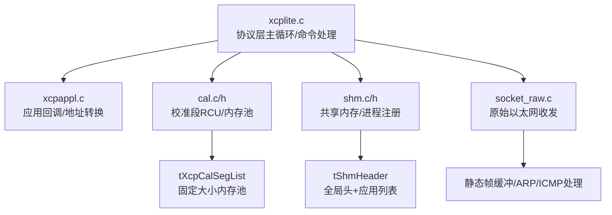
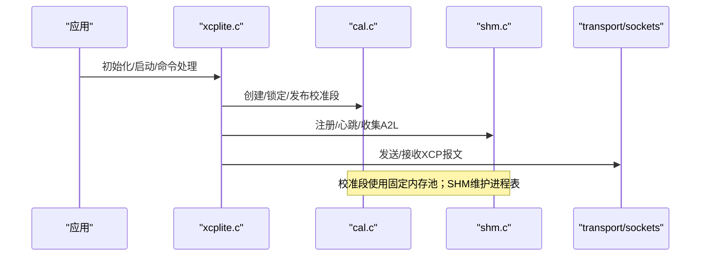
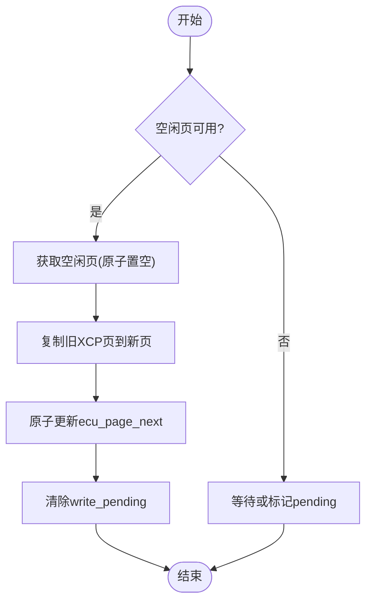
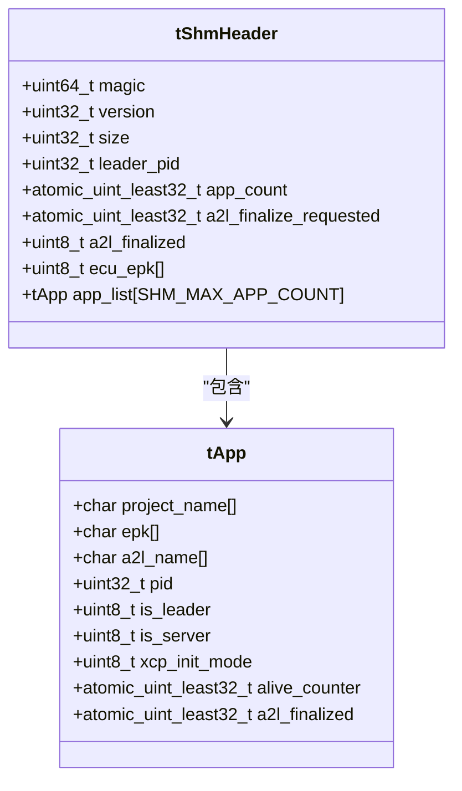
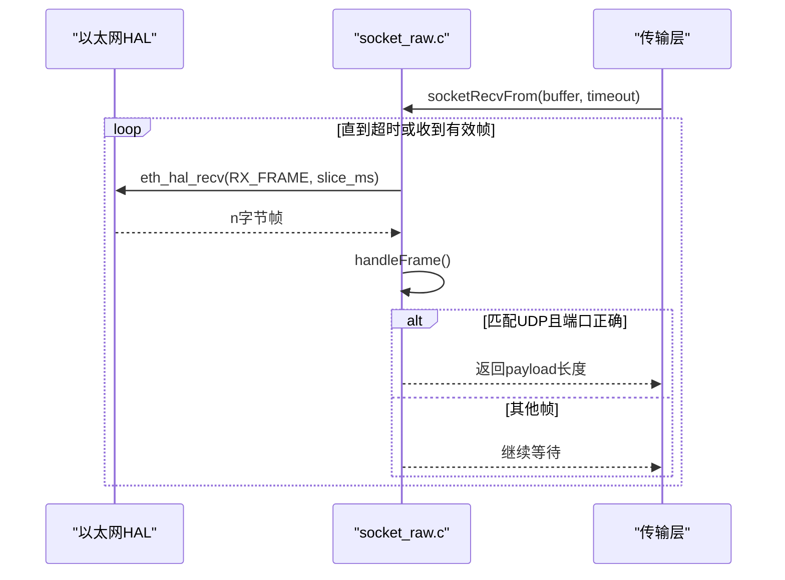
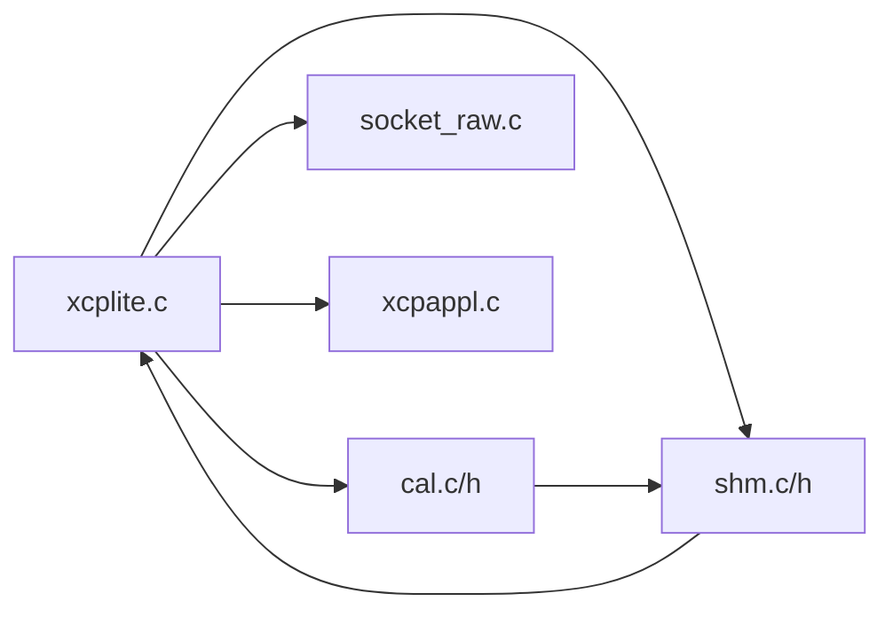

# 内存泄漏检测和诊断

<cite>
**本文引用的文件**
- [src/xcplite.c](file://src/xcplite.c)
- [src/xcplite.h](file://src/xcplite.h)
- [src/xcpappl.c](file://src/xcpappl.c)
- [src/cal.c](file://src/cal.c)
- [src/cal.h](file://src/cal.h)
- [src/shm.c](file://src/shm.c)
- [src/shm.h](file://src/shm.h)
- [src/socket_raw.c](file://src/socket_raw.c)
</cite>

## 目录
1. [简介](#简介)
2. [项目结构](#项目结构)
3. [核心组件](#核心组件)
4. [架构总览](#架构总览)
5. [详细组件分析](#详细组件分析)
6. [依赖关系分析](#依赖关系分析)
7. [性能考量](#性能考量)
8. [故障排查指南](#故障排查指南)
9. [结论](#结论)
10. [附录](#附录)

## 简介
本指南面向在嵌入式与类Unix环境中使用XCPlite的工程师，提供系统化的内存泄漏检测与诊断方法。内容涵盖：
- 如何使用Valgrind、AddressSanitizer等工具定位XCPlite中的内存问题
- 常见内存泄漏模式及修复策略（动态分配、缓冲区管理、对象生命周期）
- 嵌入式环境调试技巧（堆栈跟踪、内存映射检查）
- 校准段与DAQ事件系统的内存管理最佳实践
- 内存使用模式分析与性能影响评估方法

## 项目结构
XCPlite将协议层、应用回调、校准段管理、共享内存以及原始以太网传输解耦为多个模块，便于在不同平台与配置下独立编译与测试。与内存相关的关键路径包括：
- 协议层状态与命令处理：xcplite.c/h
- 应用回调与地址转换：xcpappl.c
- 校准段RCU与内存池：cal.c/h
- 多进程共享内存：shm.c/h
- 无IP栈的原始以太网收发：socket_raw.c

图表来源
- [src/xcplite.c:188-241](file://src/xcplite.c#L188-L241)
- [src/cal.c:91-117](file://src/cal.c#L91-L117)
- [src/shm.c:67-80](file://src/shm.c#L67-L80)
- [src/socket_raw.c:136-166](file://src/socket_raw.c#L136-L166)

章节来源
- [src/xcplite.c:188-241](file://src/xcplite.c#L188-L241)
- [src/cal.c:91-117](file://src/cal.c#L91-L117)
- [src/shm.c:67-80](file://src/shm.c#L67-L80)
- [src/socket_raw.c:136-166](file://src/socket_raw.c#L136-L166)

## 核心组件
- 协议层单例与本地状态
  - tXcpData：跨进程共享或进程内全局的状态块，包含会话状态、响应缓冲、DAQ列表、事件列表、校准段列表等
  - tXcpLocalData：进程本地状态，如MTA、队列句柄、线程互斥量、项目名/EPK等
- 校准段RCU
  - 通过固定大小的内存池（XCP_CAL_MEM_SIZE）以“bump allocator”方式分配tXcpCalSeg，避免频繁malloc/free
  - 页级RCU：默认页、ECU工作页、XCP工作页、空闲页，原子更新ecu_page_next/free_page实现无锁发布
- 共享内存（SHM）
  - tShmHeader：控制区与应用列表，维护leader/server角色、A2L最终化标志、存活计数器等
  - 进程注册/注销、A2L收集、存活检测
- 原始以太网传输
  - 静态接收/发送缓冲，避免运行时堆分配；ARP/ICMP处理在控制缓冲中完成

章节来源
- [src/xcplite.h:382-495](file://src/xcplite.h#L382-L495)
- [src/cal.c:91-117](file://src/cal.c#L91-L117)
- [src/shm.h:67-81](file://src/shm.h#L67-L81)
- [src/socket_raw.c:136-166](file://src/socket_raw.c#L136-L166)

## 架构总览
下图展示关键组件间的依赖与数据流，突出内存相关路径：

图表来源
- [src/xcplite.c:188-241](file://src/xcplite.c#L188-L241)
- [src/cal.c:427-503](file://src/cal.c#L427-L503)
- [src/shm.c:526-608](file://src/shm.c#L526-L608)
- [src/socket_raw.c:672-720](file://src/socket_raw.c#L672-L720)

## 详细组件分析

### 校准段RCU与内存池（cal.c/h）
- 内存池与分配
  - 使用XCP_CAL_MEM_SIZE作为固定大小池，XcpCalMemAlloc_通过CAS自旋分配对齐块，失败时返回NULL并记录错误
  - 所有tXcpCalSeg从池中按偏移索引访问，避免跨进程指针失效
- RCU发布流程
  - 写路径标记write_pending，发布时等待free_page可用，复制旧XCP页到空闲页，原子更新ecu_page_next释放旧页
  - 支持延迟发布（用户命令Begin/End Atomic），批量提交减少竞争
- 生命周期
  - 创建：XcpCreateCalSeg_/XcpCreateCalBlk，初始化默认页/工作页/空闲页
  - 访问：XcpLockCalSeg/XcpUnlockCalSeg保证ECU页一致性
  - 销毁：Deinit仅销毁本地互斥，池不释放（符合设计）

图表来源
- [src/cal.c:723-767](file://src/cal.c#L723-L767)
- [src/cal.c:427-503](file://src/cal.c#L427-L503)

章节来源
- [src/cal.c:91-117](file://src/cal.c#L91-L117)
- [src/cal.c:427-503](file://src/cal.c#L427-L503)
- [src/cal.c:619-689](file://src/cal.c#L619-L689)
- [src/cal.c:723-798](file://src/cal.c#L723-L798)
- [src/cal.h:159-175](file://src/cal.h#L159-L175)

### 共享内存与进程管理（shm.c/h）
- 头结构与进程表
  - tShmHeader包含magic/version/size/leader_pid/app_count/a2l标志/ECU EPK哈希等
  - app_list每项保存项目名、EPK、PID、角色、A2L文件名、存活计数器等
- 生命周期
  - 附加/创建：XcpShmAttachOrCreate负责打开/重建共享内存，非leader等待激活
  - 注册：XcpShmRegisterApp查找复用或新增槽位，更新ECU EPK哈希
  - 存活检测：周期调用XcpShmCheckAliveCounters，清理stale follower
  - 终结：XcpShmUnlink解除链接，允许下一轮leader重建
- 风险点
  - 版本变化会删除持久化状态并unlink SHM，需确保客户端重试逻辑健壮

图表来源
- [src/shm.h:67-81](file://src/shm.h#L67-L81)
- [src/shm.h:48-63](file://src/shm.h#L48-L63)

章节来源
- [src/shm.c:67-80](file://src/shm.c#L67-L80)
- [src/shm.c:162-208](file://src/shm.c#L162-L208)
- [src/shm.c:526-608](file://src/shm.c#L526-L608)
- [src/shm.c:433-517](file://src/shm.c#L433-L517)
- [src/shm.h:67-81](file://src/shm.h#L67-L81)

### 原始以太网传输（socket_raw.c）
- 静态缓冲与零堆分配
  - 接收缓冲sRxBuf与发送控制缓冲sCtrlBuf均为静态数组，避免运行时堆分配
  - 最大帧长受XCPTL_MAX_SEGMENT_SIZE限制，防止溢出
- 收发流程
  - socketRecvFrom循环读取HAL帧，过滤非目标包，解析IPv4/UDP后拷贝至上层
  - 发送路径构建ETH/IP/UDP头，必要时计算校验和，经eth_hal_send发送
- 风险点
  - 若上层传入bufferSize超限或peer MAC未学习，将返回错误并设置sLastError

图表来源
- [src/socket_raw.c:672-720](file://src/socket_raw.c#L672-L720)
- [src/socket_raw.c:413-526](file://src/socket_raw.c#L413-L526)

章节来源
- [src/socket_raw.c:136-166](file://src/socket_raw.c#L136-L166)
- [src/socket_raw.c:672-720](file://src/socket_raw.c#L672-L720)
- [src/socket_raw.c:413-526](file://src/socket_raw.c#L413-L526)

### 协议层与回调（xcplite.c / xcpappl.c）
- 协议层
  - 单例gXcpData与本地gXcpLocalData，提供命令处理、DAQ、事件、校准段访问接口
  - MTA读写根据扩展类型路由到校准段、应用地址或文件上传
- 应用回调
  - 连接/断开、DAQ准备/启停、时钟、A2L/ELF上传、内存检查/读写等回调由应用注册
  - 绝对地址模式下，ApplXcpGetBaseAddr/ApplXcpGetModuleAddr用于地址转换

章节来源
- [src/xcplite.c:188-241](file://src/xcplite.c#L188-L241)
- [src/xcplite.c:509-711](file://src/xcplite.c#L509-L711)
- [src/xcpappl.c:182-335](file://src/xcpappl.c#L182-L335)
- [src/xcpappl.c:500-598](file://src/xcpappl.c#L500-L598)

## 依赖关系分析
- 低耦合高内聚
  - xcplite.c依赖cal.c/shm.c/socket_raw.c提供的能力，但不直接持有其内部细节
  - cal.c通过共享内存布局与offset访问，避免跨进程指针
  - shm.c通过原子变量与轮询机制协调多进程
- 潜在循环依赖
  - 通过头文件前向声明与条件编译规避，未见直接循环引用
- 外部依赖
  - 平台抽象（platform.h）、队列（queue.h）、调试打印（dbg_print.h）

图表来源
- [src/xcplite.c:188-241](file://src/xcplite.c#L188-L241)
- [src/cal.c:91-117](file://src/cal.c#L91-L117)
- [src/shm.c:67-80](file://src/shm.c#L67-L80)
- [src/socket_raw.c:136-166](file://src/socket_raw.c#L136-L166)

章节来源
- [src/xcplite.c:188-241](file://src/xcplite.c#L188-L241)
- [src/cal.c:91-117](file://src/cal.c#L91-L117)
- [src/shm.c:67-80](file://src/shm.c#L67-L80)
- [src/socket_raw.c:136-166](file://src/socket_raw.c#L136-L166)

## 性能考量
- 校准段RCU
  - 使用原子操作与忙等/超时策略平衡一致性与延迟；批量发布降低竞争
- 共享内存
  - 原子计数器与轻量轮询，避免重锁；存活检测周期性执行
- 原始以太网
  - 静态缓冲与最小拷贝；分片等待避免长时间阻塞
- 建议
  - 合理设置XCP_DAQ_MEM_SIZE与XCP_CAL_MEM_SIZE，避免过大浪费或过小导致失败
  - 在高负载场景启用延迟发布与批量提交，减少CPU抖动

## 故障排查指南
- 常见问题与定位
  - 校准段池耗尽：检查XCP_CAL_MEM_SIZE与创建数量；关注日志“calibration memory pool exhausted”
  - 共享内存版本不匹配：重启或清理持久化状态；注意版本变化会unlink SHM
  - 原始以太网帧过大：确认XCPTL_MAX_SEGMENT_SIZE与链路MTU匹配
- 工具与方法
  - Valgrind（Linux/桌面）：运行完整会话，捕获leak-check=full输出，结合XA/LT/DAQ压测复现
  - AddressSanitizer（ASan）：编译开启-fsanitize=address，快速定位越界/重复释放
  - 嵌入式调试：
    - 堆栈跟踪：在异常路径添加断点，导出寄存器与回溯信息
    - 内存映射检查：查看/proc/<pid>/maps或使用平台工具确认共享内存区域与权限
    - 日志级别：提升DBG_LEVEL观察关键路径（如发布、注册、收发）
- 代码级检查点
  - 校准段：XcpCalMemAlloc_失败分支、XcpCalSegPublish超时分支
  - 共享内存：XcpShmRegisterApp失败、XcpShmCheckAliveCounters清理逻辑
  - 原始以太网：handleFrame丢弃条件、socketRecvFrom超时与错误码

章节来源
- [src/cal.c:91-117](file://src/cal.c#L91-L117)
- [src/cal.c:723-767](file://src/cal.c#L723-L767)
- [src/shm.c:526-608](file://src/shm.c#L526-L608)
- [src/shm.c:433-517](file://src/shm.c#L433-L517)
- [src/socket_raw.c:413-526](file://src/socket_raw.c#L413-L526)
- [src/socket_raw.c:672-720](file://src/socket_raw.c#L672-L720)

## 结论
XCPlite在设计上尽量避免运行时堆分配，采用固定内存池、静态缓冲与原子RCU等手段提升可预测性与稳定性。通过合理的配置与工具链（Valgrind/ASan/嵌入式调试），可有效识别并修复潜在的内存问题。校准段与DAQ事件系统在共享内存与进程协作方面提供了清晰的边界与生命周期管理，建议在工程中遵循本文的最佳实践进行内存使用与性能调优。

## 附录
- 常用配置项
  - XCP_DAQ_MEM_SIZE：DAQ列表与ODT等动态结构的总大小
  - XCP_CAL_MEM_SIZE：校准段内存池大小
  - XCPTL_MAX_SEGMENT_SIZE：传输层最大段大小，影响以太网帧尺寸
- 推荐流程
  - 开发期：启用ASan与详细日志，覆盖正常/异常路径
  - 集成期：Valgrind全量回归，关注泄漏与越界
  - 现场：结合共享内存快照与内存映射，定位多进程问题