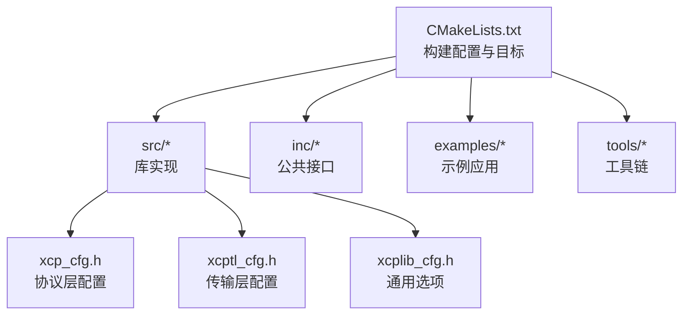
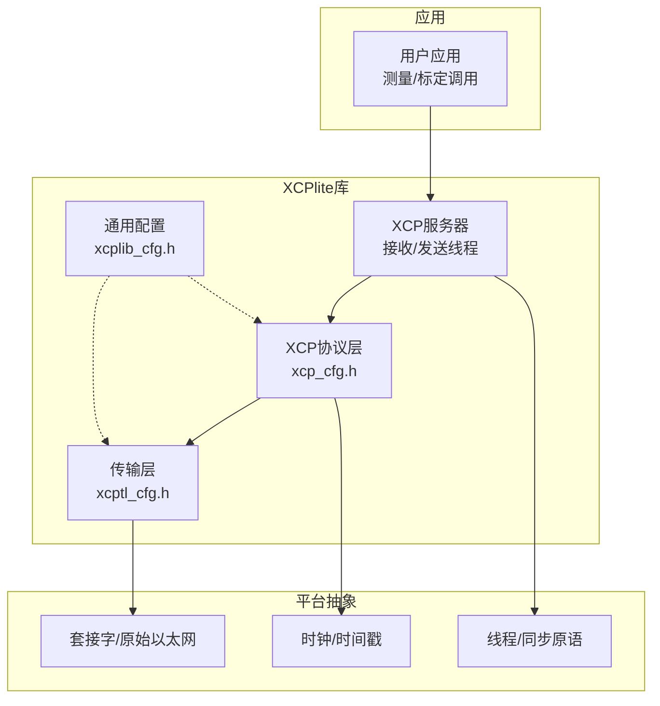
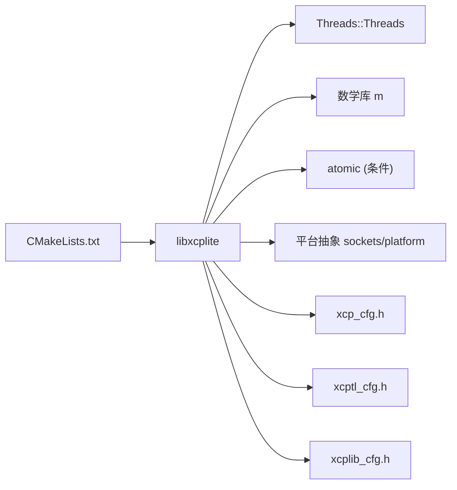

# 常见问题及解决方案

<cite>
**本文引用的文件**
- [CMakeLists.txt](file://CMakeLists.txt)
- [README.md](file://README.md)
- [docs/BUILDING.md](file://docs/BUILDING.md)
- [src/xcplib_cfg.h](file://src/xcplib_cfg.h)
- [src/xcp_cfg.h](file://src/xcp_cfg.h)
- [src/xcptl_cfg.h](file://src/xcptl_cfg.h)
- [inc/xcplib.h](file://inc/xcplib.h)
- [examples/freertos_demo/README.md](file://examples/freertos_demo/README.md)
</cite>

## 目录
1. [简介](#简介)
2. [项目结构](#项目结构)
3. [核心组件](#核心组件)
4. [架构总览](#架构总览)
5. [详细组件分析](#详细组件分析)
6. [依赖关系分析](#依赖关系分析)
7. [性能注意事项](#性能注意事项)
8. [故障排查指南](#故障排查指南)
9. [结论](#结论)
10. [附录](#附录)

## 简介
本文件面向XCPlite在构建、运行与部署阶段的常见问题，提供根因分析、症状描述、解决步骤与预防措施。覆盖编译错误、链接问题、配置错误、XCP协议相关问题（连接失败、数据传输错误、A2L解析问题）、CANape工具集成问题以及FreeRTOS移植问题。内容基于仓库中的构建脚本、配置头文件、示例与文档整理而成。

## 项目结构
XCPlite采用CMake构建系统，通过“互斥的构建配置”选择不同功能集：default、no_a2l、ptp、shm、rtos、raw。每个配置对应不同的编译定义与可选目标（示例、测试、工具）。库源码位于src/，公共接口在inc/，示例与工具分别在examples/和tools/。

**图表来源**
- [CMakeLists.txt:15-108](file://CMakeLists.txt#L15-L108)
- [docs/BUILDING.md:11-24](file://docs/BUILDING.md#L11-L24)

**章节来源**
- [CMakeLists.txt:15-108](file://CMakeLists.txt#L15-L108)
- [docs/BUILDING.md:11-24](file://docs/BUILDING.md#L11-L24)

## 核心组件
- 构建系统与配置：通过XCPLITE_CONFIGURATION选择功能集；支持应用级覆盖头XCPLITE_CFG_OVERRIDE；按平台设置标准、编译器标志与依赖。
- XCP协议层配置：地址扩展模式、DAQ事件管理、校准段管理、时间戳单位、PTP支持等。
- 传输层配置：UDP/TCP/Raw以太网、MTU与分片策略、队列与对齐、多播端口等。
- 公共接口与编译期检查：强制要求配置宏、平台限制与错误提示。

**章节来源**
- [CMakeLists.txt:15-108](file://CMakeLists.txt#L15-L108)
- [src/xcplib_cfg.h:41-168](file://src/xcplib_cfg.h#L41-L168)
- [src/xcp_cfg.h:101-177](file://src/xcp_cfg.h#L101-L177)
- [src/xcptl_cfg.h:16-33](file://src/xcptl_cfg.h#L16-L33)
- [inc/xcplib.h:30-40](file://inc/xcplib.h#L30-L40)

## 架构总览
XCPlite将XCP协议与传输层解耦，并通过可插拔的平台抽象（线程、时钟、套接字）适配POSIX/RTOS。构建时根据配置启用或禁用特性（如A2L生成、持久化、PTP、Raw以太网），并在运行时由服务器线程处理命令与数据流。

**图表来源**
- [src/xcplib_cfg.h:41-168](file://src/xcplib_cfg.h#L41-L168)
- [src/xcp_cfg.h:294-359](file://src/xcp_cfg.h#L294-L359)
- [src/xcptl_cfg.h:34-114](file://src/xcptl_cfg.h#L34-L114)
- [CMakeLists.txt:245-298](file://CMakeLists.txt#L245-L298)

## 详细组件分析

### 构建阶段常见问题
- 现象：切换编译器或配置后仍报旧错误；某些平台缺少原子库导致链接失败；Windows下原子操作回退为互斥量影响性能。
- 根因：
  - CMake缓存了编译器与配置，需清理重建。
  - 64位原子队列需要atomic_uint_least64_t，部分ARM Clang需-latomic。
  - Windows使用模拟原子，队列改用互斥量。
- 解决步骤：
  - 清理并重新配置构建目录，显式指定CC/CXX。
  - 确保已安装所需依赖（Threads、m、atomic等）。
  - 在Windows上接受性能回退或使用非Windows平台进行性能敏感场景。
- 预防：
  - 每次切换编译器或配置都新建独立构建目录。
  - 使用提供的build.sh统一流程，便于诊断。

**章节来源**
- [docs/BUILDING.md:364-393](file://docs/BUILDING.md#L364-L393)
- [CMakeLists.txt:157-162](file://CMakeLists.txt#L157-L162)
- [CMakeLists.txt:297-311](file://CMakeLists.txt#L297-L311)
- [CMakeLists.txt:234-243](file://CMakeLists.txt#L234-L243)

### 配置错误与编译期断言
- 现象：编译时报错要求定义特定宏或数量范围不合法；无法混用互斥配置。
- 根因：
  - 未定义必要宏（如OPTION_DAQ_EVENT_COUNT、CLOCK_TICKS_PER_S）。
  - 配置冲突（如RAW与UDP/TCP互斥；RAW与SHM互斥；RAW需32位队列）。
  - 事件计数过大导致编码位宽不足。
- 解决步骤：
  - 依据所选配置正确设置XCPLITE_CONFIGURATION与XCPLITE_CFG_OVERRIDE。
  - 调整OPTION_*宏以满足约束（事件数、内存大小、队列粒度等）。
  - 避免在同一构建目录混合不同配置。
- 预防：
  - 严格遵循每配置一构建目录的原则。
  - 参考各配置覆盖头说明与文档表。

**章节来源**
- [src/xcptl_cfg.h:23-32](file://src/xcptl_cfg.h#L23-L32)
- [src/xcp_cfg.h:51-58](file://src/xcp_cfg.h#L51-L58)
- [src/xcp_cfg.h:414-419](file://src/xcp_cfg.h#L414-L419)
- [docs/BUILDING.md:11-24](file://docs/BUILDING.md#L11-L24)

### XCP协议相关问题
- 连接失败（TCP/UDP）
  - 症状：客户端无法建立连接或频繁超时。
  - 根因：MTU设置过大导致分片被丢弃；网络路径不支持Jumbo帧；防火墙/路由拦截；lwIP未设置DF导致静默分片或丢包。
  - 解决：
    - 降低OPTION_MTU至链路MTU以内（默认1500）。
    - 确认网络设备允许大包；必要时关闭Jumbo帧。
    - 检查防火墙与路由策略。
  - 预防：在部署前验证端到端MTU；对嵌入式目标使用lwIP时务必正确设置MTU。
- 数据传输错误（DAQ/STIM）
  - 症状：数据丢失、乱序或计数器跳变。
  - 根因：队列容量不足；传输层消息累积策略不当；客户端工具未正确处理地址扩展与相对寻址。
  - 解决：
    - 增大OPTION_DAQ_MEM_SIZE与队列段数。
    - 调整XCPTL_MAX_DTO_SIZE与队列对齐。
    - 确保客户端工具尊重XCPlite的地址扩展与相对寻址。
  - 预防：在高负载场景压测队列与吞吐；监控日志级别以定位瓶颈。
- A2L文件解析问题
  - 症状：CANape无法识别变量、类型或地址更新失败。
  - 根因：使用了相对寻址但工具未理解地址扩展；离线A2L生成未包含DWARF信息；EPK版本不一致。
  - 解决：
    - 使用xcpclient从ELF生成A2L并确保包含调试信息。
    - 保持A2L与固件版本一致（EPK）。
    - 对复杂类型与嵌套结构，确保工具支持ABI细节。
  - 预防：固定构建版本的A2L；在CI中校验A2L与ELF一致性。

**章节来源**
- [src/xcptl_cfg.h:51-81](file://src/xcptl_cfg.h#L51-L81)
- [src/xcptl_cfg.h:83-114](file://src/xcptl_cfg.h#L83-L114)
- [src/xcp_cfg.h:101-177](file://src/xcp_cfg.h#L101-L177)
- [README.md:38-50](file://README.md#L38-L50)

### CANape工具集成问题
- 现象：COPY_CAL_PAGE行为异常；共享轴引用this.不可用；A2L编辑器无法自动推断相对寻址。
- 根因：旧版CANape兼容性问题；高级A2L特性需新版本；通用编辑器不了解XCPlite相对寻址编码。
- 解决：
  - 使用CANape 24+以获得完整特性支持。
  - 对于相对寻址，优先使用xcpclient生成的A2L或在线生成。
  - 避免手动编辑A2L破坏地址扩展。
- 预防：在团队内统一工具版本与工作流；在CI中验证A2L兼容性。

**章节来源**
- [src/xcplib_cfg.h:25-28](file://src/xcplib_cfg.h#L25-L28)
- [src/xcp_cfg.h:296-308](file://src/xcp_cfg.h#L296-L308)
- [README.md:38-50](file://README.md#L38-L50)

### FreeRTOS移植问题
- 现象：堆栈溢出、任务创建失败、时间戳精度低、队列内存不足。
- 根因：未启用-FreeRTOS路径或未应用RTOS配置覆盖；时钟分辨率不足；队列与校准段内存过小；RX/TX任务栈分配不合理。
- 解决：
  - 定义_FREE_RTOS并设置XCPLIB_CFG_OVERRIDE="xcplib_rtos_cfg.h"。
  - 提供FreeRTOSConfig.h与合适的时钟源（如DWT）。
  - 调整OPTION_QUEUE_32_SEGMENT_COUNT、OPTION_CAL_MEM_SIZE、OPTION_DAQ_MEM_SIZE。
  - 分别调优RX/TX任务栈大小（典型RX约4KB，TX约2KB）。
- 预防：在目标板上进行压力测试；开启日志级别5观察内存与队列使用；使用静态分配减少动态分配风险。

**章节来源**
- [examples/freertos_demo/README.md:42-66](file://examples/freertos_demo/README.md#L42-L66)
- [examples/freertos_demo/README.md:193-251](file://examples/freertos_demo/README.md#L193-L251)
- [examples/freertos_demo/README.md:305-387](file://examples/freertos_demo/README.md#L305-L387)

## 依赖关系分析
- 构建依赖：Threads、math、atomic（按需）；Rust工具需cargo。
- 平台依赖：Linux/macOS/QNX/Windows；RTOS需FreeRTOS/lwIP。
- 配置依赖：各配置头覆盖默认选项，形成编译期特征开关。

**图表来源**
- [CMakeLists.txt:245-311](file://CMakeLists.txt#L245-L311)
- [src/xcptl_cfg.h:16-21](file://src/xcptl_cfg.h#L16-L21)
- [src/xcptl_cfg.h:51-81](file://src/xcptl_cfg.h#L51-L81)

**章节来源**
- [CMakeLists.txt:245-311](file://CMakeLists.txt#L245-L311)
- [docs/BUILDING.md:267-341](file://docs/BUILDING.md#L267-L341)

## 性能注意事项
- 队列与DTO：固定大小队列适合高性能但内存利用率较低；可变大小队列更灵活。合理设置XCPTL_MAX_DTO_SIZE与队列段数以匹配峰值吞吐。
- MTU与分片：过大的MTU会导致分片或丢包；在支持Jumbo帧的网络中可提升吞吐，但需端到端一致。
- 时间戳：高精度时间戳需合适时钟源（PTP或硬件时间戳）；RTOS上使用tick-based时钟需注意粒度。
- 校准写入：RCU懒写可降低锁延迟但单次写入延迟增加；根据业务权衡。

[本节为通用指导，不直接分析具体文件]

## 故障排查指南
- 构建问题
  - 清理并重建：删除构建目录，重新cmake配置。
  - 检查编译器与标准：确保C11/C++17或Windows C++20。
  - 查看依赖：Threads、m、atomic是否可用。
- 配置问题
  - 核对XCPLITE_CONFIGURATION与XCPLITE_CFG_OVERRIDE。
  - 检查互斥配置（RAW与UDP/TCP、RAW与SHM）。
  - 调整事件数、内存与队列参数满足约束。
- 运行问题
  - 降低MTU，验证链路MTU。
  - 增大队列与DAQ内存，监控日志级别。
  - 校验A2L与ELF版本一致性，确保DWARF信息存在。
- FreeRTOS问题
  - 启用-FreeRTOS与RTOS覆盖头。
  - 提供高解析度时钟；调整任务栈与队列段数。
  - 使用静态分配与压测验证稳定性。

**章节来源**
- [docs/BUILDING.md:364-416](file://docs/BUILDING.md#L364-L416)
- [src/xcptl_cfg.h:51-81](file://src/xcptl_cfg.h#L51-L81)
- [src/xcp_cfg.h:414-419](file://src/xcp_cfg.h#L414-L419)
- [examples/freertos_demo/README.md:193-251](file://examples/freertos_demo/README.md#L193-L251)

## 结论
通过严格的构建配置管理、合理的MTU与队列调优、正确的A2L工作流与工具版本控制，以及针对FreeRTOS的适配与压测，可以显著降低XCPlite在构建、运行与部署阶段的故障率。建议在CI中固化构建与A2L校验流程，并在目标平台上进行端到端性能与稳定性验证。

[本节为总结性内容，不直接分析具体文件]

## 附录
- 快速构建与目标选择：参考docs/BUILDING.md中的表格与命令。
- 配置覆盖头：参考src/xcplib_<name>_cfg.h与示例config/xcplib_app_cfg.h。
- 离线A2L生成：使用xcpclient从ELF生成A2L，确保包含DWARF与正确命名约定。

[本节为补充信息，不直接分析具体文件]