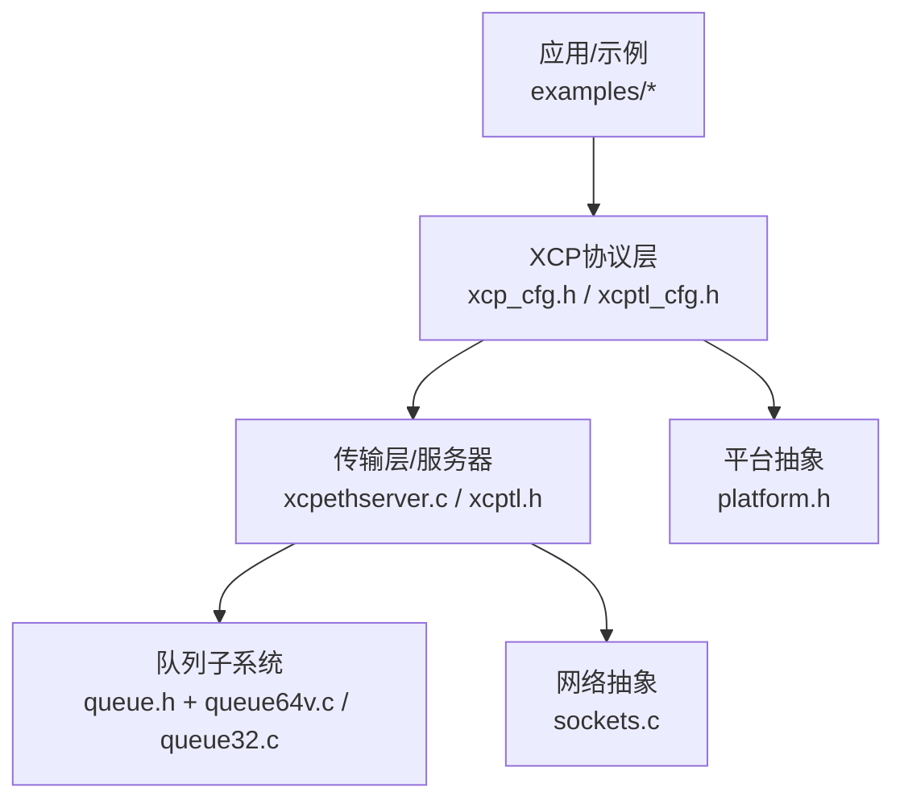
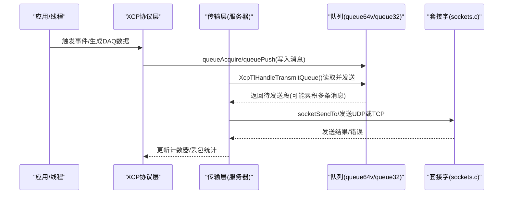
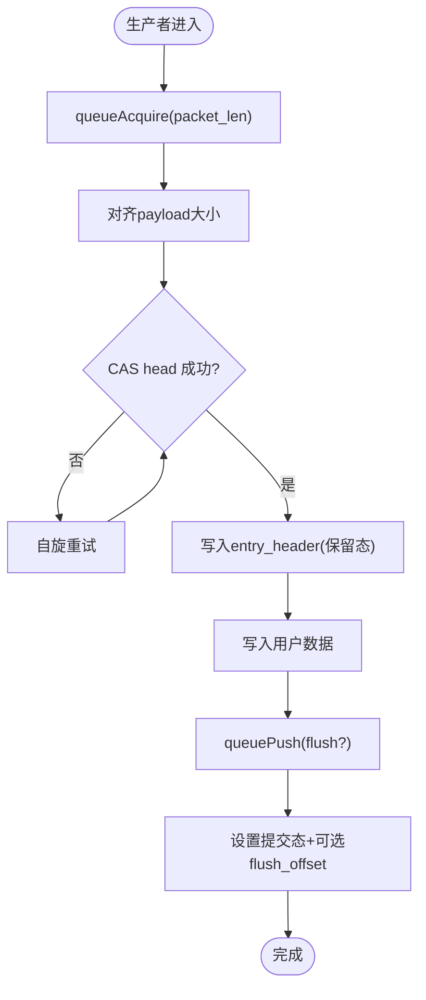
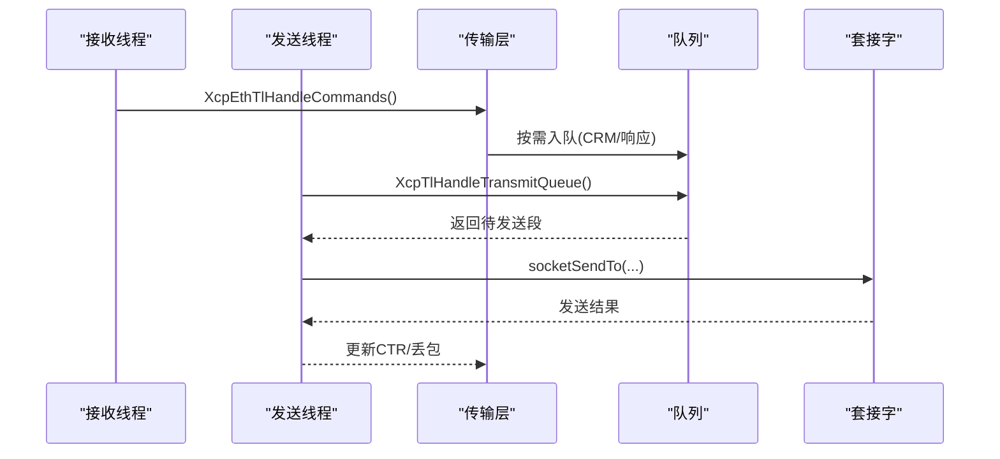
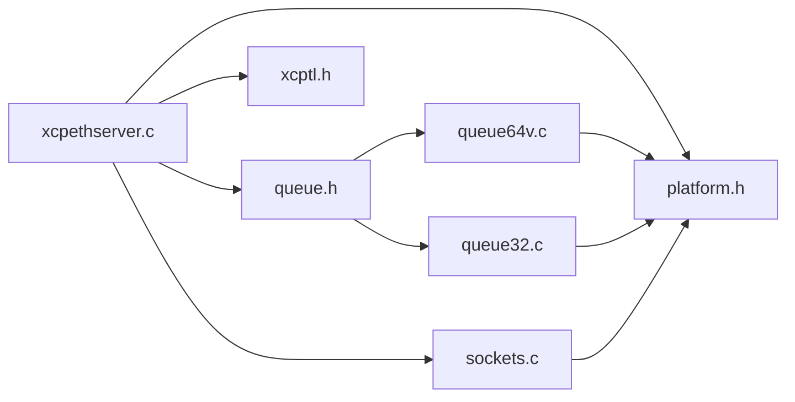

# 性能分析和优化

<cite>
**本文引用的文件**
- [README.md](file://README.md)
- [TECHNICAL.md](file://docs/TECHNICAL.md)
- [queue.h](file://src/queue.h)
- [queue64v.c](file://src/queue64v.c)
- [queue32.c](file://src/queue32.c)
- [xcp_cfg.h](file://src/xcp_cfg.h)
- [xcptl_cfg.h](file://src/xcptl_cfg.h)
- [platform.h](file://src/platform.h)
- [xcpethserver.c](file://src/xcpethserver.c)
- [xcptl.h](file://src/xcptl.h)
- [sockets.c](file://src/sockets.c)
- [main.c（多线程示例）](file://examples/multi_thread_demo/src/main.c)
</cite>

## 目录
1. [简介](#简介)
2. [项目结构](#项目结构)
3. [核心组件](#核心组件)
4. [架构总览](#架构总览)
5. [详细组件分析](#详细组件分析)
6. [依赖关系分析](#依赖关系分析)
7. [性能考量与调优](#性能考量与调优)
8. [故障排查指南](#故障排查指南)
9. [结论](#结论)
10. [附录](#附录)

## 简介
本指南面向XCP服务器（XCPlite）的性能分析与优化，聚焦以下目标：
- 识别与分析CPU、内存、网络带宽瓶颈的方法
- 使用系统级监控工具与自定义计数器的实践
- 队列实现的性能特征与优化策略（含无锁队列的使用场景与注意事项）
- 多线程环境下的调优技巧（最小化同步开销、缓存友好性）
- 内存管理、网络传输与实时性保证的最佳实践

XCPlite针对多核/SoC和POSIX/RTOS平台，提供线程安全且无阻塞的数据采集与参数修改能力，强调确定性运行时与低资源占用。其以太网传输层基于TCP/UDP套接字，支持巨型帧；通过无锁队列、原子操作与事件驱动访问降低延迟与抖动。

**章节来源**
- [README.md:7-29](file://README.md#L7-L29)

## 项目结构
本项目按功能分层组织：
- 协议与配置：xcp_cfg.h、xcptl_cfg.h等集中定义协议特性、DAQ、校准段、时钟、地址扩展等
- 传输层与网络：xcpethserver.c、xcptl.h、sockets.c负责以太网收发、线程调度与套接字抽象
- 队列子系统：queue.h及多种实现（queue64v.c、queue32.c），提供高性能生产者-消费者缓冲
- 平台抽象：platform.h封装线程、互斥量、时钟、共享内存等
- 示例与测试：examples下包含多线程、PTP、BPF等演示

**图示来源**
- [xcpethserver.c:279-387](file://src/xcpethserver.c#L279-L387)
- [xcptl.h:19-26](file://src/xcptl.h#L19-L26)
- [queue.h:29-55](file://src/queue.h#L29-L55)
- [xcptl_cfg.h:37-92](file://src/xcptl_cfg.h#L37-L92)
- [platform.h:301-467](file://src/platform.h#L301-L467)

**章节来源**
- [xcpethserver.c:279-387](file://src/xcpethserver.c#L279-L387)
- [xcptl_cfg.h:37-92](file://src/xcptl_cfg.h#L37-L92)
- [queue.h:29-55](file://src/queue.h#L29-L55)
- [platform.h:301-467](file://src/platform.h#L301-L467)

## 核心组件
- 传输层服务器：维护接收/发送线程，处理XCP命令与数据流，协调队列与套接字
- 队列子系统：提供多实现（64位无锁可变长、32位带互斥的段累积），支撑高吞吐低延迟
- 平台抽象：线程、互斥、时钟、共享内存、原子操作的跨平台封装
- 配置层：协议版本、MTU、对齐、超时、DAQ/CAL特性开关等

关键要点：
- 队列头与缓冲区对齐到缓存行，减少伪共享
- 无锁队列在64位非Windows平台启用，避免互斥开销
- 传输层消息计数器与丢包统计便于定位拥塞点
- 套接字禁用分片，结合MTU配置避免路径MTU问题

**章节来源**
- [xcpethserver.c:468-586](file://src/xcpethserver.c#L468-L586)
- [queue64v.c:216-261](file://src/queue64v.c#L216-L261)
- [queue32.c:85-100](file://src/queue32.c#L85-L100)
- [xcptl_cfg.h:51-92](file://src/xcptl_cfg.h#L51-L92)

## 架构总览
下图展示从应用触发测量到网络发送的关键路径，以及队列在其中的作用。

**图示来源**
- [xcpethserver.c:545-586](file://src/xcpethserver.c#L545-L586)
- [xcptl.h:19-26](file://src/xcptl.h#L19-L26)
- [queue64v.c:366-485](file://src/queue64v.c#L366-L485)
- [queue32.c:207-304](file://src/queue32.c#L207-L304)
- [sockets.c:307-443](file://src/sockets.c#L307-L443)

## 详细组件分析

### 队列子系统（无锁与有锁实现）
- 64位无锁可变长队列（queue64v.c）
  - 多生产者单消费者，entry_header编码长度与提交状态
  - 释放时清零已用区域，确保后续生产者可见性
  - 支持peek优化缓存索引与尾部偏移，减少重复计算
  - 丢包计数与flush请求字段用于优先级控制
- 32位/Windows队列（queue32.c）
  - 使用互斥保护，支持段累积（将多条消息拼接为一段UDP载荷）
  - 消息头包含CTR/LEN，消费时填充CTR
  - 溢出时记录packets_lost，便于诊断

**图示来源**
- [queue64v.c:366-485](file://src/queue64v.c#L366-L485)

**章节来源**
- [queue.h:29-55](file://src/queue.h#L29-L55)
- [queue64v.c:216-261](file://src/queue64v.c#L216-L261)
- [queue64v.c:366-485](file://src/queue64v.c#L366-L485)
- [queue32.c:207-304](file://src/queue32.c#L207-L304)

### 传输层与服务器线程
- 接收线程：处理XCP命令，周期性调用后台任务与用户后台任务
- 发送线程：循环处理传输队列，批量发送，更新计数器
- 共享内存模式：在非服务器进程中启动后台线程，轮询A2L最终化标志与存活计数

**图示来源**
- [xcpethserver.c:468-586](file://src/xcpethserver.c#L468-L586)
- [xcptl.h:19-26](file://src/xcptl.h#L19-L26)
- [sockets.c:307-443](file://src/sockets.c#L307-L443)

**章节来源**
- [xcpethserver.c:468-586](file://src/xcpethserver.c#L468-L586)
- [xcptl.h:19-26](file://src/xcptl.h#L19-L26)

### 平台抽象与原子/线程
- 线程创建/销毁、互斥量、时钟、共享内存统一封装
- 原子操作在Windows下通过Interlocked intrinsics模拟，保证RMW语义
- FreeRTOS路径提供静态任务分配与栈深度宏

**章节来源**
- [platform.h:301-467](file://src/platform.h#L301-L467)
- [platform.h:520-672](file://src/platform.h#L520-L672)

### 配置与协议特性
- MTU与段大小：根据OPTION_MTU计算XCPTL_MAX_SEGMENT_SIZE，确保不超链路MTU
- 数据包对齐：XCPTL_PACKET_ALIGNMENT=4，保证消息头按字访问
- 传输层头部：固定4字节（ctr+len），用于消息累积与计数
- 超时与轮询：接收线程周期检查，避免忙等过高CPU占用

**章节来源**
- [xcptl_cfg.h:37-92](file://src/xcptl_cfg.h#L37-L92)
- [xcp_cfg.h:361-412](file://src/xcp_cfg.h#L361-L412)

## 依赖关系分析
- xcpethserver.c依赖queue.h及其具体实现、xcptl.h、sockets.c、platform.h
- queue64v.c/queue32.c依赖平台原子与内存分配
- sockets.c在不同平台实现套接字选项（如DF禁止分片、时间戳）
- 配置头文件贯穿各模块，决定行为与性能特性

**图示来源**
- [xcpethserver.c:14-39](file://src/xcpethserver.c#L14-L39)
- [queue.h:29-55](file://src/queue.h#L29-L55)
- [xcptl.h:19-26](file://src/xcptl.h#L19-L26)
- [sockets.c:307-443](file://src/sockets.c#L307-L443)
- [platform.h:301-467](file://src/platform.h#L301-L467)

**章节来源**
- [xcpethserver.c:14-39](file://src/xcpethserver.c#L14-L39)
- [queue.h:29-55](file://src/queue.h#L29-L55)
- [xcptl.h:19-26](file://src/xcptl.h#L19-L26)
- [sockets.c:307-443](file://src/sockets.c#L307-L443)
- [platform.h:301-467](file://src/platform.h#L301-L467)

## 性能考量与调优

### CPU使用率与热点识别
- 关注发送/接收线程循环频率与耗时，避免忙等导致CPU飙升
- 使用平台高精度时钟统计获取锁时间与自旋次数（可在队列实现中开启测试宏）
- 对DAQ触发路径进行采样，评估事件注册与懒查找的开销

建议方法：
- 使用perf/top/htop观察线程CPU占比
- 在关键路径插入轻量计时（如clock_gettime或平台单调时钟）
- 利用队列内部统计（packets_lost、最大水位）判断拥塞

**章节来源**
- [queue64v.c:108-210](file://src/queue64v.c#L108-L210)
- [xcpethserver.c:513-586](file://src/xcpethserver.c#L513-L586)

### 内存占用与分配
- 传输队列堆分配大小应覆盖至少10ms预期流量，避免频繁溢出
- DAQ表与校准段页采用静态/预分配，减少运行时分配
- 共享内存模式下，队列位于共享区，避免进程间拷贝

优化要点：
- 合理设置OPTION_QUEUE_64_FIX_SIZE以匹配缓存行，提升cache locality
- 调整XCPTL_MAX_DTO_SIZE与XCPTL_MAX_SEGMENT_SIZE，平衡吞吐与延迟
- 使用queueLevel监控队列水位，动态调整生产速率

**章节来源**
- [TECHNICAL.md:5-24](file://docs/TECHNICAL.md#L5-L24)
- [xcptl_cfg.h:37-92](file://src/xcptl_cfg.h#L37-L92)
- [queue64v.c:265-326](file://src/queue64v.c#L265-L326)

### 网络带宽与MTU
- 禁用UDP分片，避免丢包与重传抖动；确保OPTION_MTU不超过链路MTU
- 在Linux/macOS/QNX/Windows上设置DF/DONTFRAGMENT，失败时立即报错而非静默降级
- lwIP平台需自行检查netif->mtu并告警

优化要点：
- 选择合适段大小（固定大小队列可对齐缓存行）
- 使用零拷贝或头预留（RAW模式）减少拷贝
- 监控socketSendTo返回值与错误码，及时定位拥塞

**章节来源**
- [sockets.c:345-371](file://src/sockets.c#L345-L371)
- [sockets.c:200-248](file://src/sockets.c#L200-L248)
- [xcptl_cfg.h:51-92](file://src/xcptl_cfg.h#L51-L92)

### 队列性能特征与优化策略
- 无锁队列（queue64v.c）
  - 适用场景：64位POSIX平台，高并发生产者，低延迟需求
  - 注意事项：释放时需清零已用区域；峰值负载下注意缓存一致性流量
  - 优化：固定大小队列可减少写放大；合理设置对齐与段大小
- 有锁队列（queue32.c）
  - 适用场景：32位/Windows/FreeRTOS，需要段累积以降低系统调用次数
  - 注意事项：互斥粒度与累积策略影响吞吐与尾延迟
  - 优化：增大段容量、减少频繁flush；监控packets_lost

**章节来源**
- [queue64v.c:16-34](file://src/queue64v.c#L16-L34)
- [queue32.c:37-49](file://src/queue32.c#L37-L49)
- [queue32.c:333-403](file://src/queue32.c#L333-L403)

### 多线程调优与缓存友好性
- 最小化同步开销：优先无锁队列；必要时缩小互斥范围
- 缓存友好：对齐数据结构到缓存行；避免伪共享（头与数据分离）
- 线程栈与优先级：根据平台调整栈大小与优先级，避免抢占抖动

实践参考：
- 平台抽象提供线程创建、互斥、时钟接口
- 示例中使用线程本地上下文与事件实例，隔离测量域

**章节来源**
- [platform.h:301-467](file://src/platform.h#L301-L467)
- [main.c（多线程示例）:75-168](file://examples/multi_thread_demo/src/main.c#L75-L168)

### 内存管理与实时性保证
- 静态/预分配为主，避免运行时malloc/free抖动
- 校准段读写采用RCU/懒写，降低临界区持有时间
- 使用高精度时钟与PTP时间戳（若启用）保证时序一致性

**章节来源**
- [TECHNICAL.md:28-52](file://docs/TECHNICAL.md#L28-L52)
- [xcp_cfg.h:394-406](file://src/xcp_cfg.h#L394-L406)
- [xcp_cfg.h:412-441](file://src/xcp_cfg.h#L412-L441)

## 故障排查指南
- 队列溢出与丢包
  - 检查packets_lost增长趋势，适当增大队列或降低生产速率
  - 确认XCPTL_MAX_SEGMENT_SIZE与OPTION_MTU匹配链路能力
- 套接字错误与分片
  - 查看socketSendTo返回值与错误码；确认DF/DONTFRAGMENT设置
  - 在lwIP平台检查netif->mtu并调整OPTION_MTU
- 线程卡顿与CPU占用异常
  - 观察接收/发送线程循环频率；必要时增加休眠或降低轮询频率
  - 使用平台工具（perf/top）定位热点函数

**章节来源**
- [queue64v.c:446-455](file://src/queue64v.c#L446-L455)
- [queue32.c:260-264](file://src/queue32.c#L260-L264)
- [sockets.c:345-371](file://src/sockets.c#L345-L371)
- [xcpethserver.c:513-586](file://src/xcpethserver.c#L513-L586)

## 结论
XCPlite通过无锁队列、平台抽象与严格的配置管理，在高并发、低延迟场景中提供稳定可靠的XCP服务。性能优化的关键在于：
- 合理配置队列大小与段大小，匹配链路MTU与应用流量
- 选择合适的队列实现（无锁/有锁）与对齐策略
- 监控CPU、内存与网络指标，及时识别瓶颈
- 遵循缓存友好与最小同步原则，保障实时性

## 附录
- 资源消耗参考：静态内存约10KB，堆内存约32KB（传输队列），每线程栈约1KB
- 工具链要求：C11/C++17，原子操作、线程本地存储、文件系统（A2L生成）

**章节来源**
- [TECHNICAL.md:5-24](file://docs/TECHNICAL.md#L5-L24)
- [platform.h:470-506](file://src/platform.h#L470-L506)