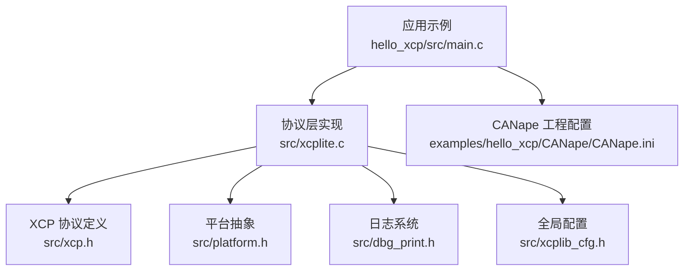
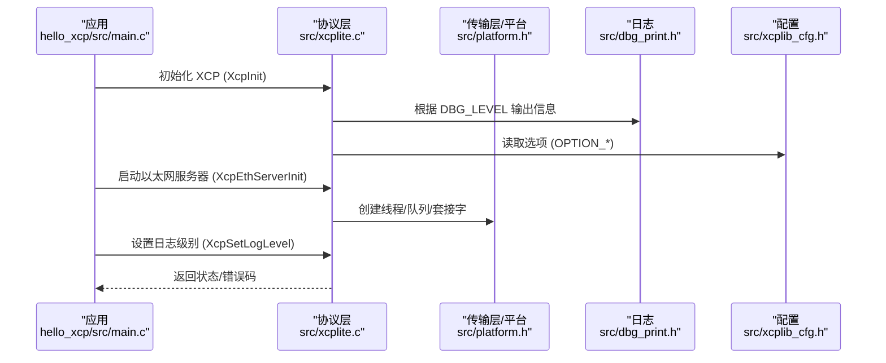
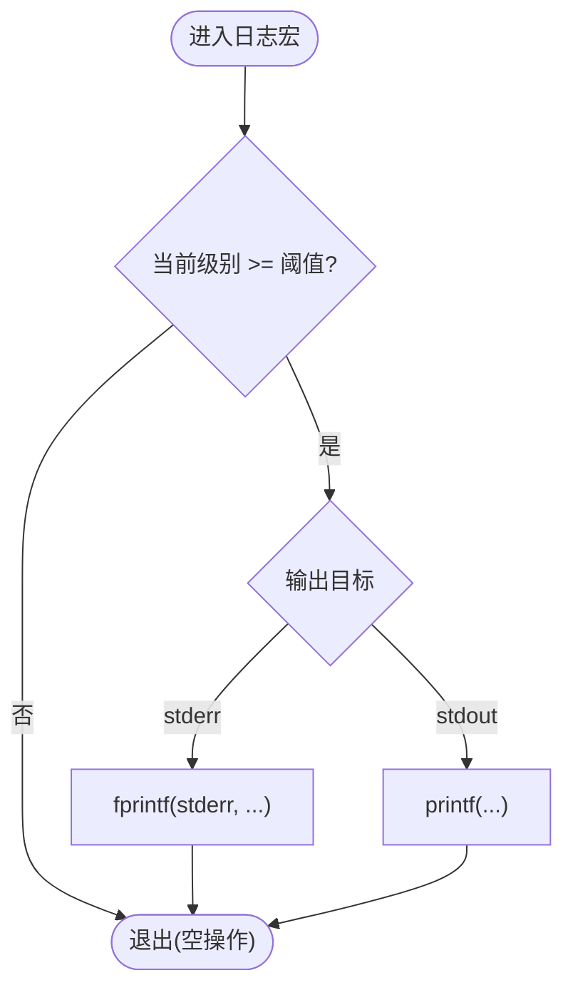
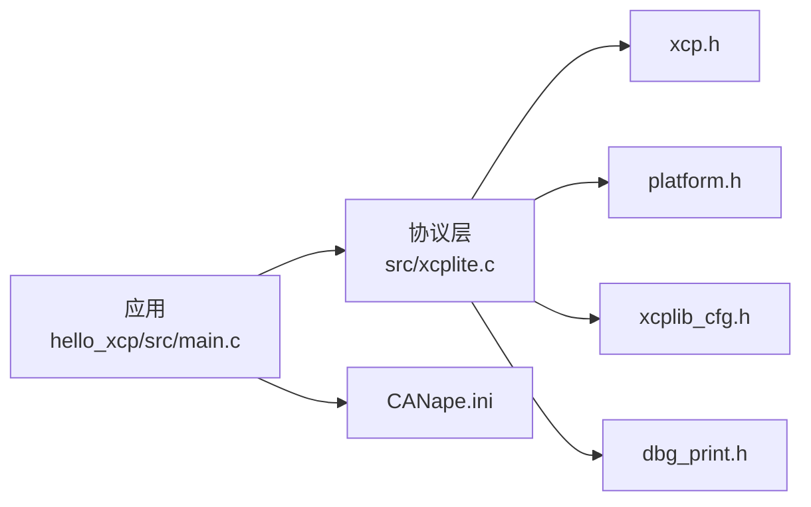

# 故障排除和调试

<cite>
**本文引用的文件**
- [dbg_print.h](file://src/dbg_print.h)
- [xcp.h](file://src/xcp.h)
- [xcplib_cfg.h](file://src/xcplib_cfg.h)
- [TECHNICAL.md](file://docs/TECHNICAL.md)
- [BUILDING.md](file://docs/BUILDING.md)
- [xcplite.c](file://src/xcplite.c)
- [platform.h](file://src/platform.h)
- [hello_xcp main.c](file://examples/hello_xcp/src/main.c)
- [CANape.ini](file://examples/hello_xcp/CANape/CANape.ini)
</cite>

## 目录
1. [简介](#简介)
2. [项目结构](#项目结构)
3. [核心组件](#核心组件)
4. [架构总览](#架构总览)
5. [详细组件分析](#详细组件分析)
6. [依赖关系分析](#依赖关系分析)
7. [性能注意事项](#性能注意事项)
8. [故障排除指南](#故障排除指南)
9. [结论](#结论)
10. [附录](#附录)

## 简介
本指南面向使用 XCPlite 的开发者与测试工程师，系统化地提供构建、运行期与性能问题的定位与解决思路。内容涵盖：
- 日志与调试输出配置（级别、输出目标、编译期裁剪）
- XCP 协议错误码含义与处理策略
- 常见构建问题与平台差异
- 运行时异常排查（连接、DAQ/STIM、校准段、持久化）
- 性能分析与瓶颈识别（队列、线程、内存、时间戳）
- 高级调试技术（内存泄漏检测、死锁诊断）
- CANape 工具链的调试功能与数据分析方法

## 项目结构
XCPlite 将协议层、传输层、平台抽象、A2L 生成与示例工程分层组织。调试相关的关键位置包括：
- 日志宏与级别控制：src/dbg_print.h
- XCP 协议常量与错误码：src/xcp.h
- 全局配置与特性开关：src/xcplib_cfg.h
- 平台抽象（线程、时钟、原子、共享内存等）：src/platform.h
- 协议层实现与状态管理：src/xcplite.c
- 示例应用（含日志设置与初始化流程）：examples/hello_xcp/src/main.c
- CANape 工程配置（写窗口、消息显示等）：examples/hello_xcp/CANape/CANape.ini

图表来源
- [xcplite.c:1-200](file://src/xcplite.c#L1-L200)
- [xcp.h:140-184](file://src/xcp.h#L140-L184)
- [dbg_print.h:19-85](file://src/dbg_print.h#L19-L85)
- [xcplib_cfg.h:42-53](file://src/xcplib_cfg.h#L42-L53)
- [platform.h:300-450](file://src/platform.h#L300-L450)
- [hello_xcp main.c:146-173](file://examples/hello_xcp/src/main.c#L146-L173)
- [CANape.ini:395-418](file://examples/hello_xcp/CANape/CANape.ini#L395-L418)

章节来源
- [xcplite.c:1-200](file://src/xcplite.c#L1-L200)
- [xcp.h:140-184](file://src/xcp.h#L140-L184)
- [dbg_print.h:19-85](file://src/dbg_print.h#L19-L85)
- [xcplib_cfg.h:42-53](file://src/xcplib_cfg.h#L42-L53)
- [platform.h:300-450](file://src/platform.h#L300-L450)
- [hello_xcp main.c:146-173](file://examples/hello_xcp/src/main.c#L146-L173)
- [CANape.ini:395-418](file://examples/hello_xcp/CANape/CANape.ini#L395-L418)

## 核心组件
- 日志子系统：提供可配置的日志级别（错误、警告、信息、跟踪、调试），支持输出到 stdout 或 stderr，并可在编译期裁剪以优化体积。
- XCP 协议层：定义命令、响应、错误码、事件码与服务请求码，贯穿连接、上传/下载、DAQ/STIM、PAG、PGM 等流程。
- 平台抽象：封装线程、互斥量、时钟、原子操作、共享内存、睡眠等，确保跨平台一致性。
- 配置系统：通过 xcplib_cfg.h 启用/禁用特性（如 DAQ、校准段、A2L 生成、传输层队列等），影响行为与资源占用。
- 示例应用：演示如何初始化 XCP、设置日志级别、创建校准段与测量事件、启动服务器与最终化 A2L。

章节来源
- [dbg_print.h:19-85](file://src/dbg_print.h#L19-L85)
- [xcp.h:140-184](file://src/xcp.h#L140-L184)
- [platform.h:300-450](file://src/platform.h#L300-L450)
- [xcplib_cfg.h:42-53](file://src/xcplib_cfg.h#L42-L53)
- [hello_xcp main.c:146-173](file://examples/hello_xcp/src/main.c#L146-L173)

## 架构总览
下图展示从应用到协议层再到平台层的调用关系，以及日志与配置在其中的作用点。

图表来源
- [hello_xcp main.c:146-173](file://examples/hello_xcp/src/main.c#L146-L173)
- [xcplite.c:1-200](file://src/xcplite.c#L1-L200)
- [platform.h:300-450](file://src/platform.h#L300-L450)
- [dbg_print.h:19-85](file://src/dbg_print.h#L19-L85)
- [xcplib_cfg.h:42-53](file://src/xcplib_cfg.h#L42-L53)

## 详细组件分析

### 日志与调试输出
- 日志级别：1=错误，2=警告，3=信息，4=跟踪（打印 XCP 命令），5=调试，6=更详细。默认级别与最大级别由配置决定。
- 输出目标：可选择标准输出或标准错误；支持 ANSI 颜色与可选前缀。
- 编译期裁剪：当未启用调试打印时，所有日志宏被替换为空操作，避免运行时开销。
- 运行时调整：可通过全局变量或 API 调整日志级别（示例中通过应用设置）。

图表来源
- [dbg_print.h:97-147](file://src/dbg_print.h#L97-L147)
- [dbg_print.h:196-222](file://src/dbg_print.h#L196-L222)
- [xcplib_cfg.h:42-53](file://src/xcplib_cfg.h#L42-L53)

章节来源
- [dbg_print.h:19-85](file://src/dbg_print.h#L19-L85)
- [dbg_print.h:97-147](file://src/dbg_print.h#L97-L147)
- [dbg_print.h:196-222](file://src/dbg_print.h#L196-L222)
- [xcplib_cfg.h:42-53](file://src/xcplib_cfg.h#L42-L53)
- [hello_xcp main.c:153-155](file://examples/hello_xcp/src/main.c#L153-L155)

### XCP 错误码与事件码
- 命令返回码（CRC_*）：用于指示成功、忙、未知命令、语法错误、越界、写保护、访问拒绝、锁定、页无效、模式无效、段无效、序列错误、DAQ 配置错误、内存溢出、通用错误、校验失败、资源暂时不可用、子命令未知、时间关联状态变化等。
- 事件码（EVC_*）：用于通知恢复模式、清空/存储 DAQ、存储校准、命令挂起、DAQ 过载、会话终止、时间同步、刺激超时、休眠/唤醒、ECU 状态、用户事件、传输事件等。
- 服务请求码（SERV_*）：如复位请求、文本消息等。

章节来源
- [xcp.h:140-184](file://src/xcp.h#L140-L184)

### 平台抽象与并发
- 线程与互斥：跨平台线程创建、加入、取消与 ID 获取；互斥量在不同平台上的实现（Windows CRITICAL_SECTION、POSIX pthread_mutex_t、FreeRTOS Semaphore）。
- 原子操作：C11 stdatomic 或 Windows Interlocked 模拟，用于无锁队列、DAQ 状态、校准段访问等。
- 时钟：高精度时钟（纳秒/微秒）、单调时钟、实时时钟，用于 DAQ 时间戳与网络时间戳。
- 共享内存：POSIX 命名共享内存打开/关闭/卸载，多进程协作。

章节来源
- [platform.h:300-450](file://src/platform.h#L300-L450)
- [platform.h:470-510](file://src/platform.h#L470-L510)
- [platform.h:520-672](file://src/platform.h#L520-L672)

### 配置系统与特性开关
- 日志：是否启用调试打印、默认级别、最大级别、固定级别。
- 传输层：TCP/UDP 支持、MTU、强制终止选项。
- 校准段：数量、内存池大小、持久化、EPK 检查、绝对/相对寻址。
- DAQ：事件列表、事件数量、内存大小、队列类型。
- A2L：在线生成、上传、ELF 上传。
- 测试：统计、直方图、栈大小测量等（仅在非发布构建下可用）。

章节来源
- [xcplib_cfg.h:42-53](file://src/xcplib_cfg.h#L42-L53)
- [xcplib_cfg.h:74-118](file://src/xcplib_cfg.h#L74-L118)
- [xcplib_cfg.h:120-163](file://src/xcplib_cfg.h#L120-L163)
- [xcplib_cfg.h:165-189](file://src/xcplib_cfg.h#L165-L189)

### 示例应用中的调试入口
- 设置日志级别：在应用主函数中调用设置接口，便于快速切换输出粒度。
- 初始化顺序：先初始化 XCP，再启动服务器与 A2L 生成，最后创建校准段与测量事件。
- 信号处理：注册信号处理器以优雅退出，确保断开与最终化。

章节来源
- [hello_xcp main.c:146-173](file://examples/hello_xcp/src/main.c#L146-L173)
- [hello_xcp main.c:276-280](file://examples/hello_xcp/src/main.c#L276-L280)

## 依赖关系分析
- 协议层依赖：xcp.h（协议常量）、platform.h（平台能力）、xcplib_cfg.h（特性开关）、dbg_print.h（日志）。
- 应用依赖：示例应用依赖协议层 API 与 A2L 生成接口。
- 工具链依赖：CANape 工程配置文件控制写窗口与消息显示，便于观察 XCP 交互。

图表来源
- [xcplite.c:1-200](file://src/xcplite.c#L1-L200)
- [xcp.h:140-184](file://src/xcp.h#L140-L184)
- [platform.h:300-450](file://src/platform.h#L300-L450)
- [xcplib_cfg.h:42-53](file://src/xcplib_cfg.h#L42-L53)
- [dbg_print.h:19-85](file://src/dbg_print.h#L19-L85)
- [CANape.ini:395-418](file://examples/hello_xcp/CANape/CANape.ini#L395-L418)

章节来源
- [xcplite.c:1-200](file://src/xcplite.c#L1-L200)
- [xcp.h:140-184](file://src/xcp.h#L140-L184)
- [platform.h:300-450](file://src/platform.h#L300-L450)
- [xcplib_cfg.h:42-53](file://src/xcplib_cfg.h#L42-L53)
- [dbg_print.h:19-85](file://src/dbg_print.h#L19-L85)
- [CANape.ini:395-418](file://examples/hello_xcp/CANape/CANape.ini#L395-L418)

## 性能注意事项
- 资源消耗：静态内存约 10KB（DAQ 表、校准段页），堆内存约 32KB（传输层队列），每线程栈约 1KB（收发线程）。
- 队列与线程：发送队列需足够大以覆盖预期流量的至少 10ms；接收/发送线程各自独立。
- 触发与转移：DAQ 触发与数据转移采用无锁生产者路径；首次按名称查找事件可能缓存结果。
- 校准段访问：线程安全且无等待；创建过程可能加锁。
- 平台差异：Windows 上原子操作为模拟实现，发送队列生产者侧使用互斥；Linux/macOS/QNX 更优。

章节来源
- [TECHNICAL.md:5-24](file://docs/TECHNICAL.md#L5-L24)
- [TECHNICAL.md:28-52](file://docs/TECHNICAL.md#L28-L52)
- [BUILDING.md:239-249](file://docs/BUILDING.md#L239-L249)

## 故障排除指南

### 构建问题
- 编译器与标准：需要 C11，C++ 支持需要 C++17（Windows 上为 C++20）。
- 原子库链接：某些 ARM Clang 对 64 位原子需要 -latomic；CMake 自动检测并链接。
- 配置隔离：不同配置必须使用独立构建目录，避免混用导致不一致。
- 工具链选择：可通过环境变量 CC/CXX 指定 GCC/Clang；必要时清理构建目录后重试。
- 目标选择：根据配置启用 examples/tests/tools/rust_tools；raw 配置仅 Linux 且需要 CAP_NET_RAW。

章节来源
- [BUILDING.md:3-9](file://docs/BUILDING.md#L3-L9)
- [BUILDING.md:11-27](file://docs/BUILDING.md#L11-L27)
- [BUILDING.md:49-73](file://docs/BUILDING.md#L49-L73)
- [BUILDING.md:85-170](file://docs/BUILDING.md#L85-L170)
- [BUILDING.md:220-249](file://docs/BUILDING.md#L220-L249)
- [BUILDING.md:364-416](file://docs/BUILDING.md#L364-L416)

### 运行时错误与错误码
- 连接阶段：若 CONNECT 返回错误码，检查通信模式、资源掩码、最大 CTO/DTO 尺寸配置。
- 命令执行：遇到 CRC_CMD_UNKNOWN/CRC_CMD_SYNTAX 表示命令未知或参数语法错误；CRC_OUT_OF_RANGE 表示地址/长度越界。
- 权限与保护：CRC_WRITE_PROTECTED/CRC_ACCESS_DENIED/CRC_ACCESS_LOCKED 提示写保护或访问受限；需解锁或调整权限。
- 配置与状态：CRC_DAQ_CONFIG 表示 DAQ 配置错误；CRC_SEQUENCE 表示序列错误；CRC_MEMORY_OVERFLOW 表示内存溢出。
- 事件与通知：EVC_DAQ_OVERLOAD 表示 DAQ 过载；EVC_SESSION_TERMINATED 表示会话终止；EVC_STIM_TIMEOUT 表示刺激超时。

章节来源
- [xcp.h:140-184](file://src/xcp.h#L140-L184)

### 日志与调试输出使用
- 设置日志级别：在应用初始化阶段调用设置接口，逐步提高级别以捕获更多细节（例如 3=信息，4=跟踪命令）。
- 输出目标：如需分离错误与常规输出，启用 stderr 输出；生产环境建议降低级别以减少 I/O。
- 编译期裁剪：发布构建可关闭调试打印或使用固定级别，减少体积与开销。

章节来源
- [dbg_print.h:19-85](file://src/dbg_print.h#L19-L85)
- [dbg_print.h:97-147](file://src/dbg_print.h#L97-L147)
- [xcplib_cfg.h:42-53](file://src/xcplib_cfg.h#L42-L53)
- [hello_xcp main.c:153-155](file://examples/hello_xcp/src/main.c#L153-L155)

### 性能问题定位
- 队列容量不足：增大发送队列以覆盖峰值流量；监控队列使用直方图（测试选项）评估瓶颈。
- 线程栈与 CPU：检查收发线程栈大小；在高负载下关注上下文切换与调度。
- DAQ 触发频率：降低事件频率或批量采集；避免频繁函数参数/局部变量测量带来的寄存器溢出。
- 校准段访问：确保合理加锁范围，避免长时间持有锁；利用无等待访问优势。
- 时间戳精度：确认时钟分辨率与 epoch 配置；PTP 场景需硬件时间戳支持。

章节来源
- [TECHNICAL.md:5-24](file://docs/TECHNICAL.md#L5-L24)
- [TECHNICAL.md:28-52](file://docs/TECHNICAL.md#L28-L52)
- [xcplib_cfg.h:120-163](file://src/xcplib_cfg.h#L120-L163)
- [platform.h:470-510](file://src/platform.h#L470-L510)

### 内存泄漏检测
- 工具推荐：Valgrind（Linux）、AddressSanitizer（GCC/Clang）、Visual Studio 诊断工具（Windows）。
- 关注点：动态分配的传输队列、DAQ 表、校准段页、套接字对象；确保在退出路径释放。
- 实践建议：在示例应用中增加断言与日志，记录分配/释放配对；使用工具扫描关键路径。

[本节为通用指导，不直接分析具体文件]

### 线程死锁诊断
- 工具推荐：Helgrind、ThreadSanitizer、Windows Concurrency Visualizer。
- 关注点：互斥量嵌套、长临界区、条件变量等待；校准段与事件创建过程中的加锁顺序。
- 实践建议：最小化锁粒度；优先使用无等待访问；在测试中启用递归互斥与自旋计数统计。

章节来源
- [platform.h:300-450](file://src/platform.h#L300-L450)
- [xcplib_cfg.h:176-189](file://src/xcplib_cfg.h#L176-L189)

### CANape 调试功能与数据分析
- 写窗口与消息：通过 CANape.ini 的 WRITEWINDOW 配置控制显示的消息类型与日志文件；便于观察 XCP 交互与错误。
- 常见问题：COPY_CAL_PAGE 仅对首个内存段执行 RAM 初始化；GET_ID 5（EPK）部分版本忽略 mode=0x01；地址扩展在某些场景被忽略。
- 工作建议：始终复制所有段；通过下载提供 EPK；使用段相对寻址兼容旧版 CANape；为每个 ODT 项存储地址扩展。

章节来源
- [CANape.ini:395-418](file://examples/hello_xcp/CANape/CANape.ini#L395-L418)
- [TECHNICAL.md:396-412](file://docs/TECHNICAL.md#L396-L412)

## 结论
通过合理的日志配置、错误码理解、性能调优与工具链配合，可以高效定位与解决 XCPlite 在构建与运行期的各类问题。建议：
- 在开发阶段开启较高日志级别，逐步收敛至发布级别
- 针对高负载场景优化队列与 DAQ 配置
- 使用平台工具进行内存与线程问题诊断
- 结合 CANape 写窗口与已知兼容性说明进行联调

[本节为总结性内容，不直接分析具体文件]

## 附录
- 构建脚本与目标：参考 BUILDING.md 中的 build.sh 用法与目标矩阵，选择合适的配置与目标。
- 技术细节：参考 TECHNICAL.md 了解资源消耗、A2L 生成、寻址模式与已知问题。

章节来源
- [BUILDING.md:85-170](file://docs/BUILDING.md#L85-L170)
- [TECHNICAL.md:5-24](file://docs/TECHNICAL.md#L5-L24)
- [TECHNICAL.md:28-52](file://docs/TECHNICAL.md#L28-L52)
- [TECHNICAL.md:396-412](file://docs/TECHNICAL.md#L396-L412)