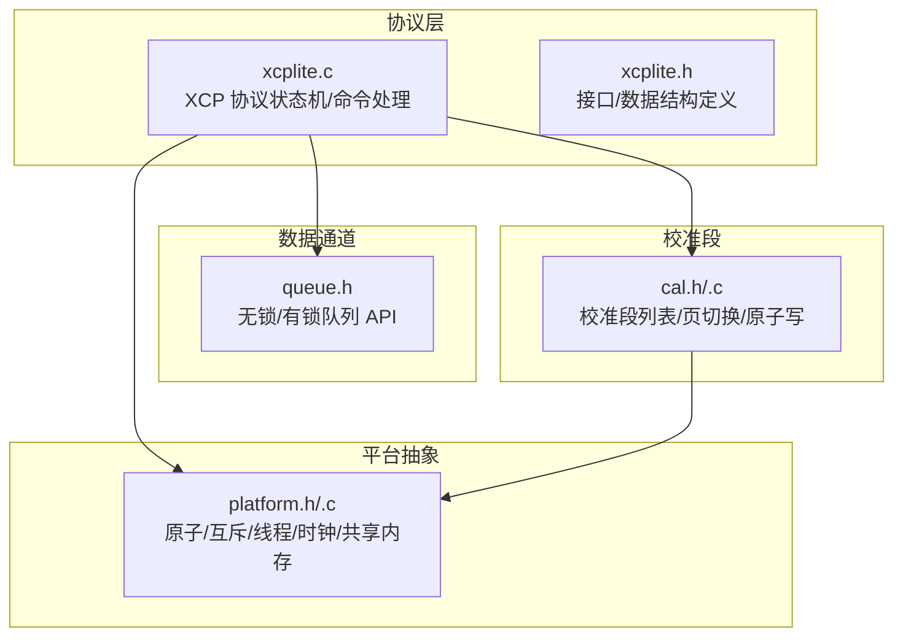
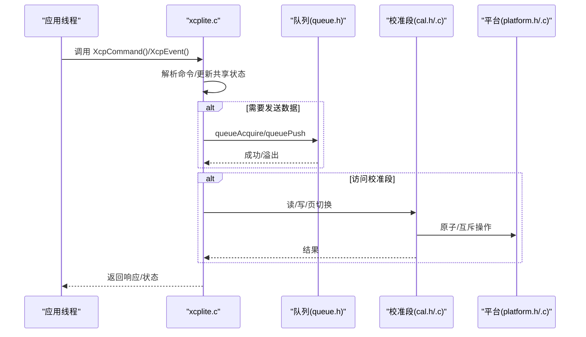
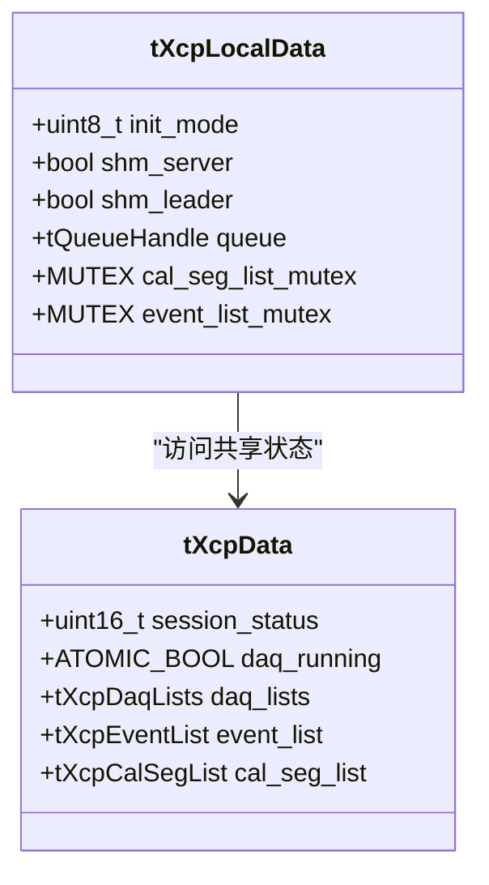
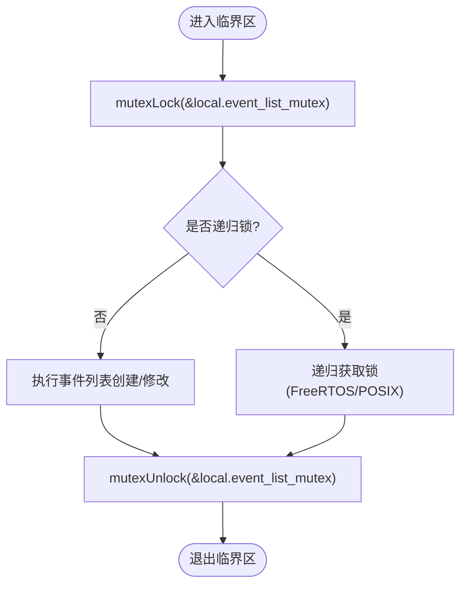
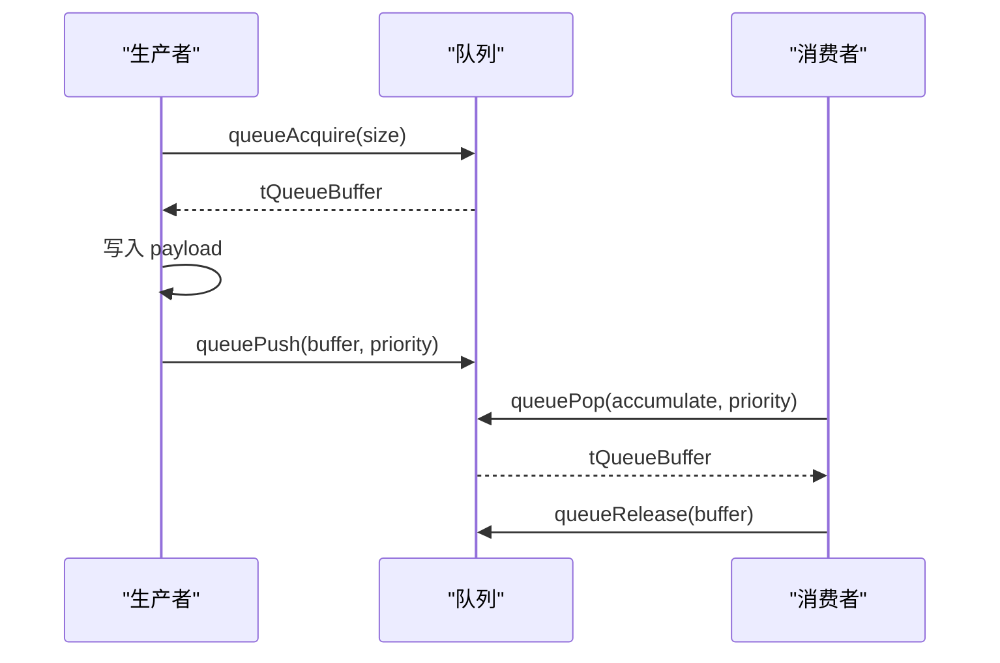
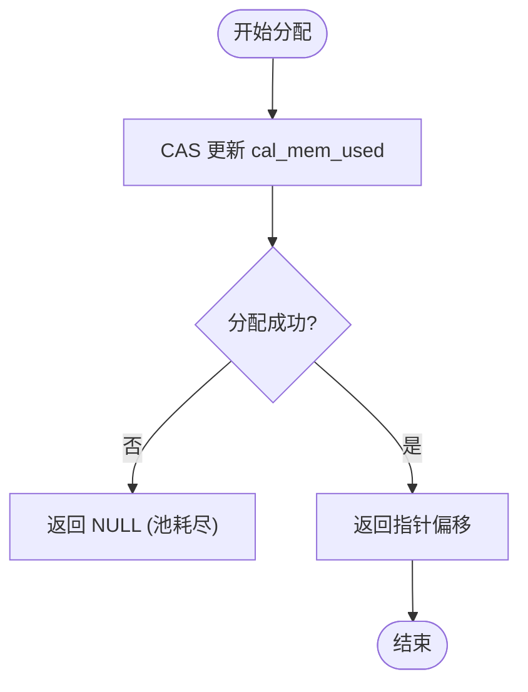
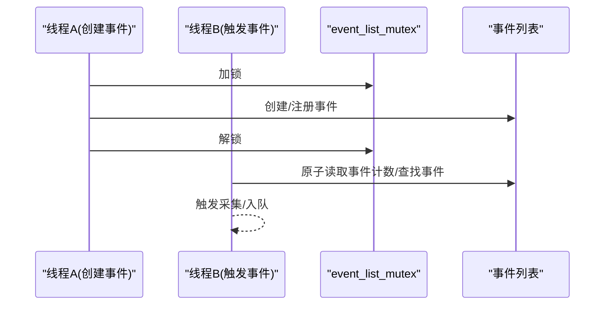
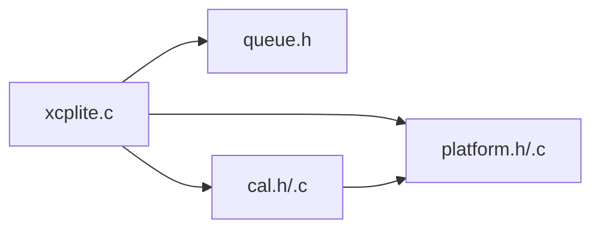

# 线程死锁诊断和预防

<cite>
**本文引用的文件**
- [xcplite.h](file://src/xcplite.h)
- [xcplite.c](file://src/xcplite.c)
- [platform.h](file://src/platform.h)
- [platform.c](file://src/platform.c)
- [cal.h](file://src/cal.h)
- [cal.c](file://src/cal.c)
- [queue.h](file://src/queue.h)
</cite>

## 目录
1. [简介](#简介)
2. [项目结构](#项目结构)
3. [核心组件](#核心组件)
4. [架构总览](#架构总览)
5. [详细组件分析](#详细组件分析)
6. [依赖关系分析](#依赖关系分析)
7. [性能与并发特性](#性能与并发特性)
8. [故障排查指南](#故障排查指南)
9. [结论](#结论)
10. [附录：实践案例与清单](#附录实践案例与清单)

## 简介
本指南面向在多线程环境中使用 XCPlite 的工程师，聚焦于“如何识别、诊断并预防死锁”，并结合 XCPlite 的并发安全机制和无锁设计原理，给出互斥锁与条件变量的正确使用方式、线程优先级设置与调度优化建议，以及 DAQ 事件系统与校准段访问的线程安全保证。文档同时提供实际死锁场景的分析与解决方案，帮助读者在生产环境中快速定位问题并制定稳健的并发策略。

## 项目结构
XCPlite 将协议层、平台抽象、队列与校准段管理解耦，关键并发原语集中在平台抽象层（mutex、原子操作、时钟），协议层通过共享状态与进程本地状态协作，配合无锁队列实现高吞吐的数据采集与传输。

图表来源
- [xcplite.c:188-256](file://src/xcplite.c#L188-L256)
- [platform.h:300-433](file://src/platform.h#L300-L433)
- [queue.h:101-187](file://src/queue.h#L101-L187)
- [cal.h:159-175](file://src/cal.h#L159-L175)

章节来源
- [xcplite.h:382-495](file://src/xcplite.h#L382-L495)
- [platform.h:300-433](file://src/platform.h#L300-L433)
- [queue.h:101-187](file://src/queue.h#L101-L187)
- [cal.h:159-175](file://src/cal.h#L159-L175)

## 核心组件
- 共享状态 tXcpData：包含会话状态、DAQ 列表、事件列表、可选校准段列表等，字段设计为跨进程/线程可安全访问（部分使用原子类型）。
- 进程本地状态 tXcpLocalData：保存初始化模式、SHM 角色、队列句柄、局部互斥量（用于事件与校准段创建）、每进程标识等。
- 平台抽象：提供跨平台的原子、互斥、线程、时钟、共享内存能力。
- 队列：提供无锁或基于互斥的队列实现，支持生产者/消费者模型。
- 校准段：提供线程安全的段分配、页切换与原子写入机制。

章节来源
- [xcplite.h:382-495](file://src/xcplite.h#L382-L495)
- [platform.h:300-433](file://src/platform.h#L300-L433)
- [queue.h:101-187](file://src/queue.h#L101-L187)
- [cal.h:159-175](file://src/cal.h#L159-L175)

## 架构总览
XCPlite 的核心流程是：应用线程调用 XCP 命令处理函数，协议层读取/更新共享状态，必要时通过队列发送/接收消息；DAQ 事件触发时，采集线程将数据入队；校准段访问通过原子与互斥保护，确保多生产者/消费者一致性。

图表来源
- [xcplite.c:188-256](file://src/xcplite.c#L188-L256)
- [queue.h:122-168](file://src/queue.h#L122-L168)
- [cal.c:99-117](file://src/cal.c#L99-L117)
- [platform.h:300-433](file://src/platform.h#L300-L433)

## 详细组件分析

### 共享状态与本地状态
- tXcpData 中的 daq_running、event_list.count 等使用原子类型，避免额外锁开销。
- tXcpLocalData 中维护 event_list_mutex 与 cal_seg_list_mutex，分别保护事件列表与校准段列表的创建与注册过程。
- 在 SHM 模式下，gXcpData 指向共享内存区域，所有进程共享同一份状态；非 SHM 模式下为进程内静态对象。

图表来源
- [xcplite.h:382-495](file://src/xcplite.h#L382-L495)

章节来源
- [xcplite.h:382-495](file://src/xcplite.h#L382-L495)

### 平台抽象：互斥、原子、线程、时钟
- 互斥：跨平台封装 pthread_mutex_t / Windows CRITICAL_SECTION / FreeRTOS 信号量，提供 mutexInit/mutexLock/mutexUnlock。
- 原子：C11 stdatomic 或 Windows Interlocked 模拟，提供 load/store/CAS/fetch_add 等。
- 线程：create_thread/join_thread/cancel_thread/get_thread_id 统一接口。
- 时钟：高精度单调时钟与实时时钟，支持不同分辨率与 epoch。

图表来源
- [platform.h:300-348](file://src/platform.h#L300-L348)
- [platform.c:370-432](file://src/platform.c#L370-L432)

章节来源
- [platform.h:300-433](file://src/platform.h#L300-L433)
- [platform.c:370-432](file://src/platform.c#L370-L432)

### 队列：无锁与有锁路径
- 64 位平台默认使用无锁队列（queue64v.c/queue64f.c），减少锁竞争。
- 32 位平台或 Windows 使用基于互斥的队列（queue32.c/queue32m.c），支持消息累积。
- 生产者通过 queueAcquire/queuePush 提交数据，消费者通过 queuePop/queuePeek 消费。

图表来源
- [queue.h:122-168](file://src/queue.h#L122-L168)

章节来源
- [queue.h:101-187](file://src/queue.h#L101-L187)

### 校准段：线程安全与无锁设计
- 校准段列表采用无锁 bump allocator，通过 CAS 更新 cal_mem_used，避免全局锁。
- 段头字段（如 ecu_page_next、free_page、ecu_access、lock_count）使用原子类型，保证跨线程可见性。
- 创建/注册阶段使用互斥锁保护，防止重复注册与竞态。

图表来源
- [cal.c:99-117](file://src/cal.c#L99-L117)
- [cal.h:159-175](file://src/cal.h#L159-L175)

章节来源
- [cal.h:159-175](file://src/cal.h#L159-L175)
- [cal.c:99-117](file://src/cal.c#L99-L117)

### DAQ 事件系统：线程安全保证
- 事件计数使用原子变量，提供 relaxed/acquire/release 语义以平衡性能与可见性。
- 事件列表创建/实例化受 event_list_mutex 保护，确保多生产者安全。
- 事件触发路径尽量无锁，降低延迟。

图表来源
- [xcplite.h:224-251](file://src/xcplite.h#L224-L251)
- [xcplite.c:787-797](file://src/xcplite.c#L787-L797)

章节来源
- [xcplite.h:224-251](file://src/xcplite.h#L224-L251)
- [xcplite.c:787-797](file://src/xcplite.c#L787-L797)

## 依赖关系分析
- xcplite.c 依赖 platform.h/.c 提供的原子与互斥，依赖 queue.h 进行数据传输，依赖 cal.h/.c 进行校准段管理。
- 平台抽象屏蔽了 OS 差异，使上层逻辑专注于协议与数据流。
- 队列实现根据平台选择无锁或有锁路径，影响整体吞吐与延迟。

图表来源
- [xcplite.c:188-256](file://src/xcplite.c#L188-L256)
- [platform.h:300-433](file://src/platform.h#L300-L433)
- [queue.h:101-187](file://src/queue.h#L101-L187)
- [cal.h:159-175](file://src/cal.h#L159-L175)

章节来源
- [xcplite.c:188-256](file://src/xcplite.c#L188-L256)
- [platform.h:300-433](file://src/platform.h#L300-L433)
- [queue.h:101-187](file://src/queue.h#L101-L187)
- [cal.h:159-175](file://src/cal.h#L159-L175)

## 性能与并发特性
- 无锁优先：DAQ 事件计数、校准段分配大量使用原子操作，减少锁竞争。
- 队列分层：64 位平台无锁队列提升吞吐；32 位/Windows 使用互斥队列保证兼容性。
- 锁粒度：仅对创建/注册等低频操作加锁，高频路径保持无锁。
- 内存对齐：校准段头部固定 64 字节并对齐 8 字节，便于原子访问。

[本节为通用指导，不直接分析具体文件]

## 故障排查指南
- 死锁检测工具
  - Linux: 使用 glibc 的 ThreadSanitizer (-fsanitize=thread)、Valgrind Helgrind、或 perf 结合内核锁追踪。
  - Windows: 使用 Visual Studio 并发调试器、ThreadSanitizer for MSVC、或 WinDbg 查看线程堆栈与锁持有者。
  - macOS: 使用 ThreadSanitizer、Instruments Deadlock Detector。
- 调试技术
  - 打印锁持有者与等待线程信息（在 mutexLock 前后记录线程 ID）。
  - 使用断言检查锁的递归性与顺序（例如先事件锁再校准段锁）。
  - 启用日志级别，观察事件创建与校准段分配的时序。
- 常见问题定位
  - 事件列表与校准段列表锁的顺序不一致导致死锁。
  - 生产者/消费者未正确释放队列缓冲区导致资源泄漏。
  - 原子变量内存序选择不当导致可见性问题。

章节来源
- [platform.h:300-433](file://src/platform.h#L300-L433)
- [queue.h:122-168](file://src/queue.h#L122-L168)
- [xcplite.c:787-797](file://src/xcplite.c#L787-L797)

## 结论
XCPlite 通过原子操作与细粒度互斥锁的组合，实现了高性能且线程安全的 DAQ 事件与校准段管理。理解其共享状态与本地状态的职责划分、队列的无锁/有锁路径、以及平台抽象提供的并发原语，是诊断与预防死锁的关键。遵循一致的锁顺序、最小化锁范围、合理使用原子内存序，可有效避免死锁与性能退化。

[本节为总结，不直接分析具体文件]

## 附录：实践案例与清单

### 实际死锁案例与分析
- 案例一：事件创建与校准段注册交叉加锁
  - 现象：线程 A 持有事件锁并等待校准段锁，线程 B 持有校准段锁并等待事件锁。
  - 根因：锁顺序不一致。
  - 解决：统一先事件锁后校准段锁，或在同一临界区内完成相关操作。
  - 参考位置
    - [xcplite.h:455-458](file://src/xcplite.h#L455-L458)
    - [cal.c:185-193](file://src/cal.c#L185-L193)

- 案例二：队列缓冲区未释放
  - 现象：队列长度持续增长，最终溢出。
  - 根因：消费者未调用 queueRelease。
  - 解决：确保每次 queuePop/queuePeek 后按序释放。
  - 参考位置
    - [queue.h:156-176](file://src/queue.h#L156-L176)

- 案例三：原子变量内存序不当
  - 现象：其他线程未及时看到事件计数更新。
  - 根因：使用 relaxed 语义但未建立必要的 happens-before。
  - 解决：在发布端使用 release，在消费端使用 acquire。
  - 参考位置
    - [xcplite.c:787-789](file://src/xcplite.c#L787-L789)

### 死锁预防策略
- 固定锁顺序：始终按相同顺序获取多个锁（如先事件锁，再校准段锁）。
- 缩小临界区：仅在必要范围内加锁，避免长时间持有锁。
- 避免嵌套锁：尽量将复杂逻辑拆分为单锁临界区。
- 使用超时与重试：在可能阻塞的地方设置超时，避免永久等待。
- 监控与告警：统计锁等待时间、队列长度、溢出计数，异常时告警。

### 线程优先级与调度优化
- 事件优先级：在队列 push 时标记 priority，消费者可按优先级处理。
- 任务优先级：在 FreeRTOS 上配置任务优先级，确保 DAQ 采集与传输的高优先级。
- 时钟精度：选择合适的时钟分辨率（ns/us），减少抖动。
- 参考位置
  - [queue.h:137-139](file://src/queue.h#L137-L139)
  - [platform.h:383-391](file://src/platform.h#L383-L391)
  - [platform.c:455-500](file://src/platform.c#L455-L500)

### 最佳实践清单
- 明确共享与本地状态边界，避免跨进程错误引用。
- 使用原子操作替代粗粒度锁，减少竞争。
- 严格遵循锁顺序，避免循环等待。
- 合理配置队列大小与优先级，防止溢出与饥饿。
- 定期清理共享内存与队列资源，避免泄漏。
- 在测试中启用并发检测工具，尽早发现潜在问题。

[本节为通用指导，不直接分析具体文件]