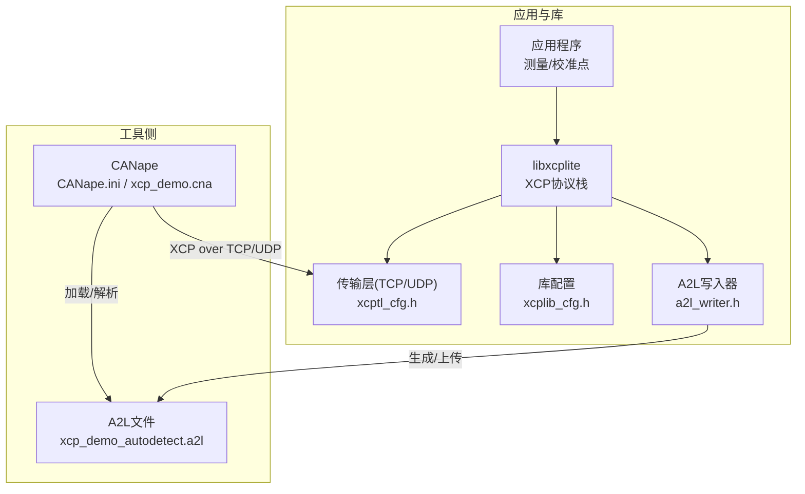
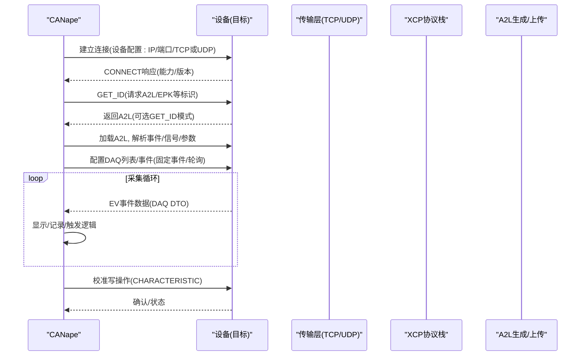
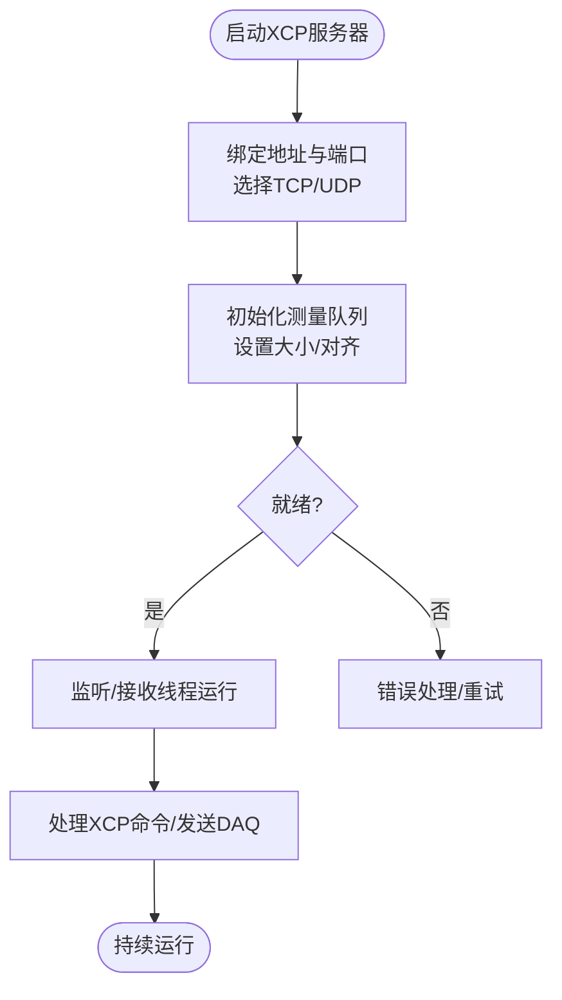
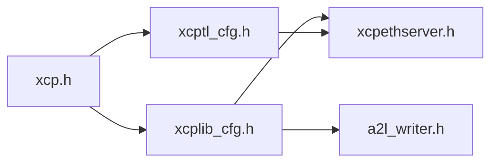

# CANape集成调试

<cite>
**本文引用的文件**
- [README.md](file://README.md)
- [XCP_INTRODUCTION.md](file://docs/XCP_INTRODUCTION.md)
- [OFFLINE_A2L.md](file://docs/OFFLINE_A2L.md)
- [xcp.h](file://src/xcp.h)
- [xcptl_cfg.h](file://src/xcptl_cfg.h)
- [xcplib_cfg.h](file://src/xcplib_cfg.h)
- [a2l_writer.h](file://src/a2l_writer.h)
- [xcpethserver.h](file://src/xcpethserver.h)
- [CANape.ini](file://examples/hello_xcp/CANape/CANape.ini)
- [xcp_demo.cna](file://examples/hello_xcp/CANape/xcp_demo.cna)
- [xcp_demo_autodetect.a2l](file://examples/hello_xcp/CANape/xcp_demo_autodetect.a2l)
</cite>

## 目录
1. [简介](#简介)
2. [项目结构](#项目结构)
3. [核心组件](#核心组件)
4. [架构总览](#架构总览)
5. [详细组件分析](#详细组件分析)
6. [依赖关系分析](#依赖关系分析)
7. [性能考虑](#性能考虑)
8. [故障排查指南](#故障排查指南)
9. [结论](#结论)
10. [附录](#附录)

## 简介
本指南面向使用 CANape 对基于 XCPlite 的 XCP on Ethernet 目标进行实时监控与数据采集的工程师。内容涵盖：
- 通过 CANape 连接并监控 XCP 服务器（TCP/UDP）
- CANape 配置文件（CANape.ini）与 CNA 项目配置要点
- A2L 文件的自动生成与手动配置方法，数据类型与内存地址映射
- 从项目设置到数据采集的完整工作流程
- 常见问题排查与性能优化建议

XCPlite 支持 XCP >1.4，兼容 CANape、CANoe 等 ASAM 工具，示例默认使用 XCP on Ethernet（TCP/UDP），并支持运行时 A2L 生成与上传。

**章节来源**
- [README.md:7-22](file://README.md#L7-L22)
- [XCP_INTRODUCTION.md:1-25](file://docs/XCP_INTRODUCTION.md#L1-L25)

## 项目结构
围绕 CANape 集成的关键文件与职责：
- 传输层与协议层配置：xcptl_cfg.h、xcplib_cfg.h、xcp.h
- XCP 以太网服务器初始化接口：xcpethserver.h
- A2L 写入器接口：a2l_writer.h
- CANape 工程与配置：CANape.ini、xcp_demo.cna、xcp_demo_autodetect.a2l
- 离线 A2L 生成文档：OFFLINE_A2L.md

**图示来源**
- [xcptl_cfg.h:14-59](file://src/xcptl_cfg.h#L14-L59)
- [xcplib_cfg.h:74-173](file://src/xcplib_cfg.h#L74-L173)
- [a2l_writer.h:19-21](file://src/a2l_writer.h#L19-L21)
- [xcpethserver.h:19-26](file://src/xcpethserver.h#L19-L26)

**章节来源**
- [xcptl_cfg.h:14-59](file://src/xcptl_cfg.h#L14-L59)
- [xcplib_cfg.h:74-173](file://src/xcplib_cfg.h#L74-L173)
- [a2l_writer.h:19-21](file://src/a2l_writer.h#L19-L21)
- [xcpethserver.h:19-26](file://src/xcpethserver.h#L19-L26)

## 核心组件
- XCP 协议定义与命令/事件码：xcp.h
- 传输层参数（MTU、CTO/DTO大小、队列与对齐）：xcptl_cfg.h
- 库级选项（TCP/UDP启用、DAQ事件、A2L生成与上传、持久化等）：xcplib_cfg.h
- A2L 写入器接口（生成主骨架与包含片段）：a2l_writer.h
- XCP 以太网服务器初始化（绑定地址、端口、TCP/UDP选择、测量队列大小）：xcpethserver.h

这些组件共同构成“应用→XCP协议栈→传输层→CANape”的数据通路，并通过 A2L 描述信号、参数与事件。

**章节来源**
- [xcp.h:16-130](file://src/xcp.h#L16-L130)
- [xcptl_cfg.h:34-92](file://src/xcptl_cfg.h#L34-L92)
- [xcplib_cfg.h:74-173](file://src/xcplib_cfg.h#L74-L173)
- [a2l_writer.h:19-21](file://src/a2l_writer.h#L19-L21)
- [xcpethserver.h:19-26](file://src/xcpethserver.h#L19-L26)

## 架构总览
下图展示 CANape 通过 XCP over Ethernet 与目标系统交互的整体流程，包括 A2L 的自动发现与下载。

**图示来源**
- [xcp.h:245-259](file://src/xcp.h#L245-L259)
- [xcp.h:509-525](file://src/xcp.h#L509-L525)
- [xcp.h:683-729](file://src/xcp.h#L683-L729)
- [a2l_writer.h:19-21](file://src/a2l_writer.h#L19-L21)

## 详细组件分析

### CANape 配置文件（CANape.ini）与 CNA 项目
- CANape.ini：全局运行参数、MDF/BLF 输出、刷新策略、颜色与打印布局等；示例中大量开关用于控制绘图、缓存、日志与性能。
- xcp_demo.cna：测量对象、校准对象、显示页、函数、事件通道等具体配置；包含模块名、信号名、采样模式、显示窗口等。
- 典型要点：
  - 设备配置中的传输层选择（TCP/UDP）、服务器地址与端口需与应用一致
  - 测量对象 Mode/Rate 决定轮询或事件驱动采集
  - 校准对象用于在线修改参数（CHARACTERISTIC）
  - 事件通道与 DAQ 事件 ID 对应，确保一致性

**章节来源**
- [CANape.ini:22-130](file://examples/hello_xcp/CANape/CANape.ini#L22-L130)
- [xcp_demo.cna:35-101](file://examples/hello_xcp/CANape/xcp_demo.cna#L35-L101)
- [xcp_demo.cna:314-334](file://examples/hello_xcp/CANape/xcp_demo.cna#L314-L334)
- [xcp_demo.cna:797-800](file://examples/hello_xcp/CANape/xcp_demo.cna#L797-L800)

### A2L 文件结构与映射
- 自动生成的 A2L（xcp_demo_autodetect.a2l）包含：
  - 模块头、字节序与对齐
  - 基础类型与复合类型的 TYPEDEF_MEASUREMENT/TYPEDEF_CHARACTERISTIC
  - MEASUREMENT/CHARACTERISTIC 定义，含 ECU_ADDRESS 与 ECU_ADDRESS_EXTENSION
  - IF_DATA XCP 中的 PROTOCOL_LAYER、DAQ 事件定义（EVENT）
  - MEMORY_SEGMENT 与 PAGE 信息（校准段）
- 地址与扩展：
  - 绝对地址（如全局变量）与相对地址（栈帧相对、校准段相对）通过 ECU_ADDRESS_EXTENSION 区分
  - 事件绑定：MEASUREMENT 通过 IF_DATA XCP DAQ_EVENT 关联固定事件 ID
- 数据类型映射：
  - 基本类型（U8/U16/U32/I8/I16/I32/F32/F64）与自定义结构体映射为 A2L 类型
  - 物理单位、范围、转换表在 COMPU_METHOD/COMPU_VTAB 中体现

**章节来源**
- [xcp_demo_autodetect.a2l:1-20](file://examples/hello_xcp/CANape/xcp_demo_autodetect.a2l#L1-L20)
- [xcp_demo_autodetect.a2l:22-64](file://examples/hello_xcp/CANape/xcp_demo_autodetect.a2l#L22-L64)
- [xcp_demo_autodetect.a2l:69-87](file://examples/hello_xcp/CANape/xcp_demo_autodetect.a2l#L69-L87)
- [xcp_demo_autodetect.a2l:97-117](file://examples/hello_xcp/CANape/xcp_demo_autodetect.a2l#L97-L117)
- [xcp_demo_autodetect.a2l:120-165](file://examples/hello_xcp/CANape/xcp_demo_autodetect.a2l#L120-L165)

### 传输层与服务器配置
- 传输层（xcptl_cfg.h）：
  - 启用 TCP/UDP（OPTION_ENABLE_TCP/OPTION_ENABLE_UDP）
  - MTU、最大 CTO/DTO、段大小与对齐、接收超时、多播端口等
- 库配置（xcplib_cfg.h）：
  - 启用 A2L 生成与上传（OPTION_ENABLE_A2L_GENERATOR/OPTION_ENABLE_A2L_UPLOAD）
  - 启用 EPK/持久化/DAQ 事件管理等
- 服务器初始化（xcpethserver.h）：
  - 指定绑定地址、端口、是否 TCP、测量队列大小

**图示来源**
- [xcpethserver.h:19-26](file://src/xcpethserver.h#L19-L26)
- [xcptl_cfg.h:34-92](file://src/xcptl_cfg.h#L34-L92)
- [xcptl_cfg.h:83-143](file://src/xcptl_cfg.h#L83-L143)
- [xcplib_cfg.h:74-173](file://src/xcplib_cfg.h#L74-L173)

**章节来源**
- [xcptl_cfg.h:34-92](file://src/xcptl_cfg.h#L34-L92)
- [xcptl_cfg.h:83-143](file://src/xcptl_cfg.h#L83-L143)
- [xcplib_cfg.h:74-173](file://src/xcplib_cfg.h#L74-L173)
- [xcpethserver.h:19-26](file://src/xcpethserver.h#L19-L26)

### 完整调试工作流程（从项目设置到数据采集）
1. 构建与部署
   - 启用所需传输层（TCP/UDP）与 A2L 生成/上传
   - 编译并运行目标程序，确保服务器绑定正确地址与端口
2. 准备 CANape 工程
   - 打开 CANape.ini，检查设备配置（IP/端口/传输层）
   - 加载 CNA 项目（xcp_demo.cna），确认测量/校准对象已出现
3. 连接与 A2L
   - 建立 XCP 连接，获取设备标识（GET_ID），必要时下载 A2L
   - 若使用离线 A2L，按 OFFLINE_A2L.md 流程生成并加载
4. 配置 DAQ 与事件
   - 在 CNA 中设置测量对象的 Mode/Rate，绑定到固定事件或轮询
   - 校验事件通道与 A2L 中的 EVENT ID 一致
5. 开始采集与校准
   - 启动测量，观察实时曲线与数值
   - 通过校准对象修改参数，验证原子性与一致性
6. 保存与分析
   - 配置 MDF/BLF 输出路径与格式，停止后导出分析

**章节来源**
- [README.md:53-91](file://README.md#L53-L91)
- [OFFLINE_A2L.md:35-68](file://docs/OFFLINE_A2L.md#L35-L68)
- [xcp_demo.cna:314-334](file://examples/hello_xcp/CANape/xcp_demo.cna#L314-L334)
- [xcp_demo_autodetect.a2l:120-165](file://examples/hello_xcp/CANape/xcp_demo_autodetect.a2l#L120-L165)

## 依赖关系分析
- 协议层依赖：xcp.h 定义了命令、响应、事件码及 DAQ 相关字段
- 传输层依赖：xcptl_cfg.h 提供 MTU、CTO/DTO、队列与对齐等参数
- 库配置依赖：xcplib_cfg.h 控制 A2L 生成/上传、DAQ 事件、持久化等
- A2L 生成依赖：a2l_writer.h 暴露写入接口，结合目标元数据生成 A2L
- 服务器依赖：xcpethserver.h 提供初始化与状态查询

**图示来源**
- [xcp.h:16-130](file://src/xcp.h#L16-L130)
- [xcptl_cfg.h:14-59](file://src/xcptl_cfg.h#L14-L59)
- [xcplib_cfg.h:74-173](file://src/xcplib_cfg.h#L74-L173)
- [a2l_writer.h:19-21](file://src/a2l_writer.h#L19-L21)
- [xcpethserver.h:19-26](file://src/xcpethserver.h#L19-L26)

**章节来源**
- [xcp.h:16-130](file://src/xcp.h#L16-L130)
- [xcptl_cfg.h:14-59](file://src/xcptl_cfg.h#L14-L59)
- [xcplib_cfg.h:74-173](file://src/xcplib_cfg.h#L74-L173)
- [a2l_writer.h:19-21](file://src/a2l_writer.h#L19-L21)
- [xcpethserver.h:19-26](file://src/xcpethserver.h#L19-L26)

## 性能考虑
- 传输层 MTU 与段大小：根据链路 MTU 合理设置 OPTION_MTU，避免分片与丢包
- CTO/DTO 大小：平衡带宽与延迟，注意队列对齐与缓存行对齐
- 队列模式：固定大小队列可能更高效但占用更多内存；可变大小更灵活
- DAQ 事件与轮询：优先使用固定事件减少总线负载；轮询适用于低频信号
- 日志级别：降低日志开销以提升实时性
- MDF/BLF 写入：调整缓冲区大小与异步写入策略，避免阻塞

**章节来源**
- [xcptl_cfg.h:34-92](file://src/xcptl_cfg.h#L34-L92)
- [xcptl_cfg.h:83-143](file://src/xcptl_cfg.h#L83-L143)
- [xcplib_cfg.h:121-153](file://src/xcplib_cfg.h#L121-L153)
- [CANape.ini:48-75](file://examples/hello_xcp/CANape/CANape.ini#L48-L75)

## 故障排查指南
- 无法连接
  - 检查设备配置中的 IP/端口/传输层是否与服务器一致
  - 确认防火墙与网络可达
- A2L 不匹配或丢失
  - 使用 GET_ID 下载最新 A2L；或使用离线 A2L 生成流程
  - 核对 EPK 与目标版本一致
- 信号未出现或地址错误
  - 检查 ECU_ADDRESS 与 ECU_ADDRESS_EXTENSION 是否正确
  - 对于栈帧相对地址，确保事件触发点与捕获结构有效
- 采集卡顿或丢包
  - 调整 MTU/段大小，检查队列大小与对齐
  - 降低日志级别，减少 MDF/BLF 写入压力
- 校准写入失败
  - 检查校准段权限（PAGE 读写属性）与段模式
  - 确认原子更新与持久化配置

**章节来源**
- [OFFLINE_A2L.md:244-269](file://docs/OFFLINE_A2L.md#L244-L269)
- [xcp_demo_autodetect.a2l:97-117](file://examples/hello_xcp/CANape/xcp_demo_autodetect.a2l#L97-L117)
- [xcptl_cfg.h:34-92](file://src/xcptl_cfg.h#L34-L92)
- [xcptl_cfg.h:83-143](file://src/xcptl_cfg.h#L83-L143)

## 结论
通过 XCPlite 与 CANape 的协同，可实现高效、低开销的 XCP 实时数据采集与校准。关键在于：
- 正确配置传输层与服务器（地址/端口/TCP或UDP）
- 使用 A2L 准确描述信号、参数与事件
- 合理设置 DAQ 模式与性能参数
- 遵循离线/在线 A2L 生成流程，保证版本一致
- 遇到问题时依据日志与配置逐项排查

## 附录
- 快速参考：
  - 传输层配置：xcptl_cfg.h
  - 库配置：xcplib_cfg.h
  - 服务器接口：xcpethserver.h
  - A2L 写入器：a2l_writer.h
  - 协议定义：xcp.h
  - CANape 工程：CANape.ini、xcp_demo.cna
  - 自动 A2L：xcp_demo_autodetect.a2l
  - 离线 A2L 流程：OFFLINE_A2L.md

**章节来源**
- [xcptl_cfg.h:34-92](file://src/xcptl_cfg.h#L34-L92)
- [xcplib_cfg.h:74-173](file://src/xcplib_cfg.h#L74-L173)
- [xcpethserver.h:19-26](file://src/xcpethserver.h#L19-L26)
- [a2l_writer.h:19-21](file://src/a2l_writer.h#L19-L21)
- [xcp.h:16-130](file://src/xcp.h#L16-L130)
- [CANape.ini:22-130](file://examples/hello_xcp/CANape/CANape.ini#L22-L130)
- [xcp_demo.cna:35-101](file://examples/hello_xcp/CANape/xcp_demo.cna#L35-L101)
- [xcp_demo_autodetect.a2l:1-20](file://examples/hello_xcp/CANape/xcp_demo_autodetect.a2l#L1-L20)
- [OFFLINE_A2L.md:35-68](file://docs/OFFLINE_A2L.md#L35-L68)