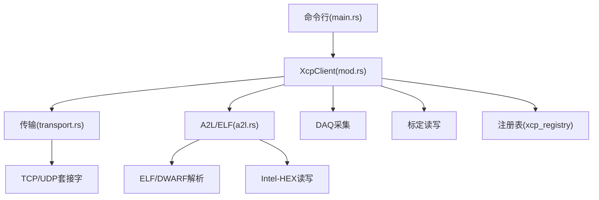
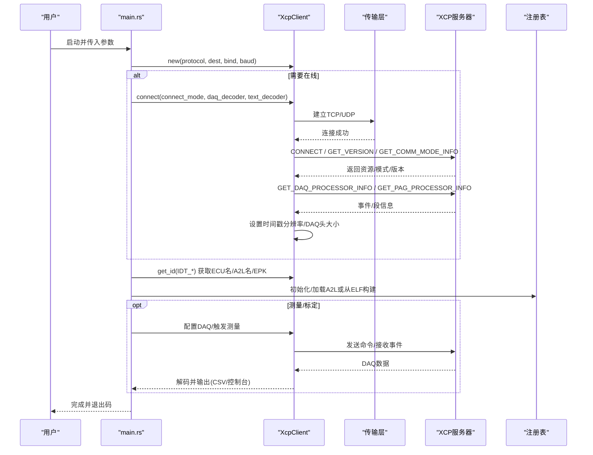
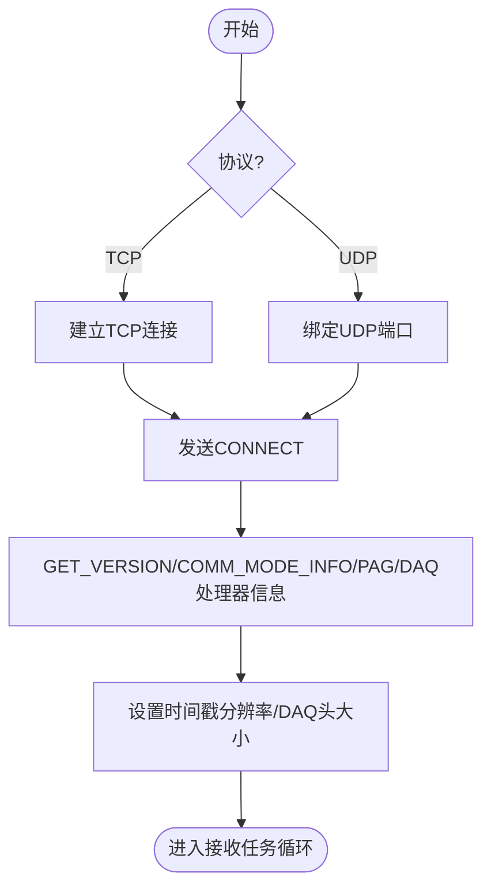
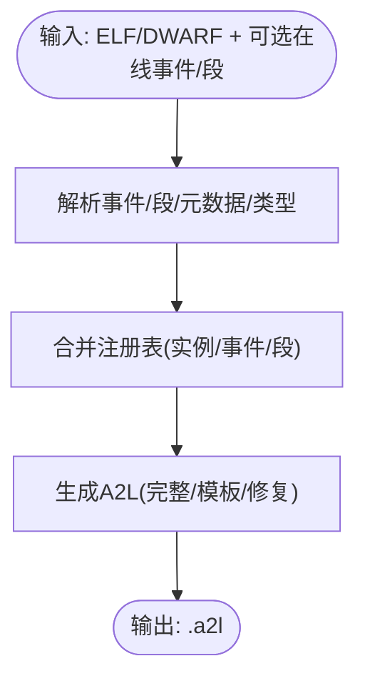
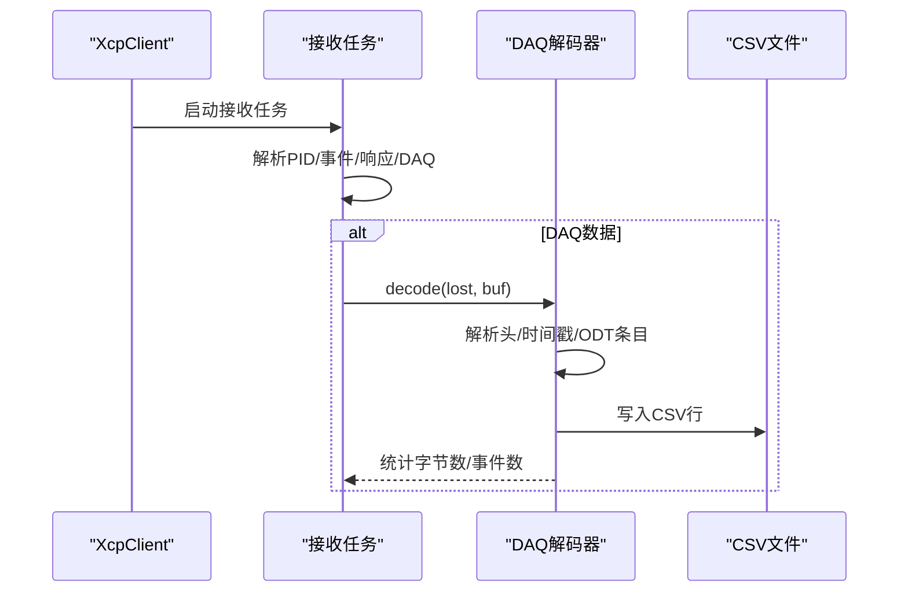
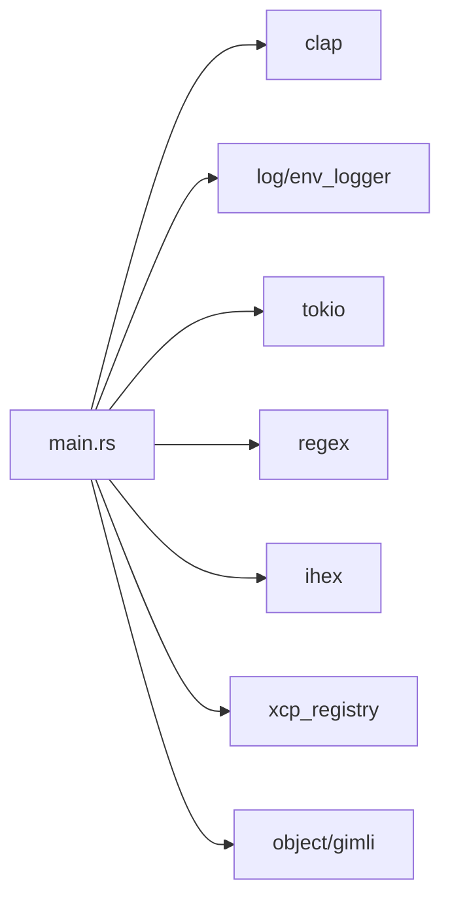

# xcpclient调试工具

<cite>
**本文引用的文件**
- [tools/xcpclient/README.md](file://tools/xcpclient/README.md)
- [tools/xcpclient/Cargo.toml](file://tools/xcpclient/Cargo.toml)
- [tools/xcpclient/src/main.rs](file://tools/xcpclient/src/main.rs)
- [tools/xcpclient/src/xcp_client/mod.rs](file://tools/xcpclient/src/xcp_client/mod.rs)
- [tools/xcpclient/src/xcp_client/transport.rs](file://tools/xcpclient/src/xcp_client/transport.rs)
- [tools/xcpclient/src/xcp_client/a2l.rs](file://tools/xcpclient/src/xcp_client/a2l.rs)
- [tools/xcpclient/xcpclient.toml](file://tools/xcpclient/xcpclient.toml)
- [docs/OFFLINE_A2L.md](file://docs/OFFLINE_A2L.md)
- [docs/XCP_INTRODUCTION.md](file://docs/XCP_INTRODUCTION.md)
- [docs/TECHNICAL.md](file://docs/TECHNICAL.md)
- [examples/README.md](file://examples/README.md)
</cite>

## 目录
1. [简介](#简介)
2. [项目结构](#项目结构)
3. [核心组件](#核心组件)
4. [架构总览](#架构总览)
5. [详细组件分析](#详细组件分析)
6. [依赖关系分析](#依赖关系分析)
7. [性能与可靠性](#性能与可靠性)
8. [故障诊断与排错](#故障诊断与排错)
9. [结论](#结论)
10. [附录：命令行参数详解](#附录命令行参数详解)

## 简介
xcpclient 是 XCPlite 工程中的 Rust 实现 XCP 测试客户端与 A2L 生成器。它支持通过 TCP/UDP/SxI 连接 XCP 服务器，进行数据采集（DAQ）、标定（CAL）读写、A2L/ELF 上传下载、离线 A2L 生成（基于 ELF/DWARF 与目标事件/段信息），以及执行内置测试序列。其日志级别、输出格式、传输层选择、超时与重试等均可配置，便于在 CANape 等工具链中集成使用。

本文件面向“离线 A2L 生成器 + 调试工具”的使用场景，覆盖数据包捕获、协议分析与数据可视化、连接与日志配置、A2L 生成流程、命令行参数、实际用例以及与 CANape 的集成方法。

**章节来源**
- [docs/XCP_INTRODUCTION.md:1-41](file://docs/XCP_INTRODUCTION.md#L1-L41)
- [tools/xcpclient/README.md:1-38](file://tools/xcpclient/README.md#L1-L38)

## 项目结构
xcpclient 位于 tools/xcpclient 下，采用模块化组织：
- main.rs：命令行解析、日志初始化、主流程编排（连接、获取信息、创建/修复 A2L、测量/标定、CSV 输出、测试）。
- xcp_client/*：XCP 客户端核心
  - mod.rs：XcpClient 结构与能力声明（资源、通信模式、事件/段计数、默认事件等）。
  - transport.rs：TCP/UDP 收发、接收任务、命令/响应通道、CONNECT/GET_* 流程、错误处理。
  - a2l.rs：A2L/ELF 上传、从服务器读取事件/段信息并填充注册表、正则匹配变量列表。
  - types/decoder/protocol/daq/cal：类型定义、解码器、协议封装、DAQ 采集与标定操作。
- elf_reader/bin_reader：ELF/DWARF 解析与 Intel-HEX 读写。
- xcp_test_executor：内置测试序列执行器。
- Cargo.toml：依赖与版本信息。
- xcpclient.toml：TOML 配置文件，可被 --config 加载，命令行优先。

**图表来源**
- [tools/xcpclient/src/main.rs:1-120](file://tools/xcpclient/src/main.rs#L1-L120)
- [tools/xcpclient/src/xcp_client/mod.rs:107-235](file://tools/xcpclient/src/xcp_client/mod.rs#L107-L235)
- [tools/xcpclient/src/xcp_client/transport.rs:21-485](file://tools/xcpclient/src/xcp_client/transport.rs#L21-L485)
- [tools/xcpclient/src/xcp_client/a2l.rs:1-163](file://tools/xcpclient/src/xcp_client/a2l.rs#L1-L163)

**章节来源**
- [tools/xcpclient/Cargo.toml:1-59](file://tools/xcpclient/Cargo.toml#L1-L59)
- [tools/xcpclient/xcpclient.toml:1-136](file://tools/xcpclient/xcpclient.toml#L1-L136)

## 核心组件
- XcpClient：封装协议能力、资源信息与通信状态，提供 connect/disconnect、get_id、事件/段信息查询、DAQ 属性设置等。
- 传输层：统一 TCP/UDP 抽象，包含接收任务、命令/响应通道、超时控制、错误分类。
- A2L/ELF 模块：支持从目标上传 A2L/ELF，或从本地 ELF/DWARF 构建 A2L；可从在线目标补充事件/段信息到注册表。
- DAQ 解码器：解析事件头、时间戳、ODT 条目，按 A2L 类型编码输出数值，支持 CSV 持久化。
- 配置系统：TOML + 命令行合并，命令行优先级最高。

**章节来源**
- [tools/xcpclient/src/xcp_client/mod.rs:107-235](file://tools/xcpclient/src/xcp_client/mod.rs#L107-L235)
- [tools/xcpclient/src/xcp_client/transport.rs:21-485](file://tools/xcpclient/src/xcp_client/transport.rs#L21-L485)
- [tools/xcpclient/src/xcp_client/a2l.rs:1-163](file://tools/xcpclient/src/xcp_client/a2l.rs#L1-L163)
- [tools/xcpclient/src/main.rs:324-346](file://tools/xcpclient/src/main.rs#L324-L346)

## 架构总览
下图展示了 xcpclient 的典型工作流：命令行驱动 -> 建立连接 -> 获取设备信息 -> 构建/加载 A2L -> 可选的 DAQ/CAL 操作 -> 结果输出（控制台/CSV/A2L/HEX）。

**图表来源**
- [tools/xcpclient/src/main.rs:579-800](file://tools/xcpclient/src/main.rs#L579-L800)
- [tools/xcpclient/src/xcp_client/transport.rs:269-396](file://tools/xcpclient/src/xcp_client/transport.rs#L269-L396)
- [tools/xcpclient/src/xcp_client/a2l.rs:86-143](file://tools/xcpclient/src/xcp_client/a2l.rs#L86-L143)

## 详细组件分析

### 连接与传输层
- 支持 TCP 与 UDP，SxI 通过波特率参数注入注册表。
- 接收任务独立运行，解析 PID（响应/错误/事件/服务/DAQ），维护计数器丢失统计，将响应投递到命令通道。
- 超时：命令等待默认 3 秒；UDP 在 macOS 上对 EHOSTUNREACH 做指数退避重试以等待 ARP 解析完成。
- 连接后自动查询资源、通信模式、最大 DTO/CTO、事件/段数量、冻结支持等，并设置 DAQ 时间戳分辨率与头大小。

**图表来源**
- [tools/xcpclient/src/xcp_client/transport.rs:269-396](file://tools/xcpclient/src/xcp_client/transport.rs#L269-L396)
- [tools/xcpclient/src/xcp_client/mod.rs:57-100](file://tools/xcpclient/src/xcp_client/mod.rs#L57-L100)

**章节来源**
- [tools/xcpclient/src/xcp_client/transport.rs:21-485](file://tools/xcpclient/src/xcp_client/transport.rs#L21-L485)
- [tools/xcpclient/src/xcp_client/mod.rs:36-145](file://tools/xcpclient/src/xcp_client/mod.rs#L36-L145)

### A2L 生成与元数据处理
- 在线模式：从 XCP 服务器读取事件与段信息，写入注册表；结合 ELF/DWARF 变量与类型信息生成完整 A2L。
- 离线模式：仅解析 ELF/DWARF 与 XCPlite 标记（事件段、校准段、EPK、元数据、触发点作用域），生成 A2L。
- 模板模式：仅生成事件/段与 IF_DATA 骨架，供其他工具继续完善。
- 修复模式：用在线目标的事件/段信息更新已有 A2L。
- 元数据：XCPlite 宏在 ELF 中留下 xcp_meta 段常量，用于标注单位、上下限、注释、读写权限等，生成时匹配到对应对象。

**图表来源**
- [tools/xcpclient/src/xcp_client/a2l.rs:86-143](file://tools/xcpclient/src/xcp_client/a2l.rs#L86-L143)
- [docs/OFFLINE_A2L.md:15-63](file://docs/OFFLINE_A2L.md#L15-L63)
- [docs/TECHNICAL.md:96-142](file://docs/TECHNICAL.md#L96-L142)

**章节来源**
- [docs/OFFLINE_A2L.md:1-289](file://docs/OFFLINE_A2L.md#L1-L289)
- [tools/xcpclient/src/xcp_client/a2l.rs:1-163](file://tools/xcpclient/src/xcp_client/a2l.rs#L1-L163)
- [docs/TECHNICAL.md:96-200](file://docs/TECHNICAL.md#L96-L200)

### DAQ 数据采集与可视化
- 支持 CSV 输出（time_ns, daq, name, value），控制台打印，以及通过 verbose 控制详细程度。
- 解码逻辑根据 DAQ 头大小与 ODT 条目，按 A2lTypeEncoding（有符号/无符号/浮点/Blob）解析值。
- 时间戳：支持 64 位累积时间戳，按分辨率换算为纳秒；记录丢包计数。

**图表来源**
- [tools/xcpclient/src/main.rs:361-549](file://tools/xcpclient/src/main.rs#L361-L549)
- [tools/xcpclient/src/xcp_client/transport.rs:124-217](file://tools/xcpclient/src/xcp_client/transport.rs#L124-L217)

**章节来源**
- [tools/xcpclient/src/main.rs:361-549](file://tools/xcpclient/src/main.rs#L361-L549)

### 标定（CAL）与二进制文件
- 支持列出/设置标定变量，上传/下载校准段工作页数据至 Intel-HEX 文件。
- 通过注册表匹配 CHARACTERISTIC 对象，调用底层 XCP 命令完成读写。

**章节来源**
- [tools/xcpclient/src/xcp_client/a2l.rs:1-163](file://tools/xcpclient/src/xcp_client/a2l.rs#L1-L163)
- [tools/xcpclient/README.md:140-180](file://tools/xcpclient/README.md#L140-L180)

### 配置系统与日志
- 支持 TOML 配置文件（--config），所有键可选；命令行参数优先于配置文件。
- 日志级别：Off=0, Error=1, Warn=2, Info=3, Debug=4, Trace=5；内容详细度由 --verbose 控制。
- 传输层参数：dest_addr/port/bind_addr/baud_rate/tcp/udp/sxi/connect_mode/offline。

**章节来源**
- [tools/xcpclient/xcpclient.toml:1-136](file://tools/xcpclient/xcpclient.toml#L1-L136)
- [tools/xcpclient/src/main.rs:119-322](file://tools/xcpclient/src/main.rs#L119-L322)
- [tools/xcpclient/src/main.rs:324-346](file://tools/xcpclient/src/main.rs#L324-L346)

## 依赖关系分析
- 运行时依赖：tokio（异步网络）、clap（命令行）、log/env_logger（日志）、regex（变量过滤）、ihex（HEX 文件）、parking_lot（锁）。
- 调试信息解析：object/gimli/memmap2/cpp_demangle/indexmap。
- 注册表：xcp_registry（A2L 读写、实例/事件/段管理）。

**图表来源**
- [tools/xcpclient/Cargo.toml:16-46](file://tools/xcpclient/Cargo.toml#L16-L46)

**章节来源**
- [tools/xcpclient/Cargo.toml:1-59](file://tools/xcpclient/Cargo.toml#L1-L59)

## 性能与可靠性
- 超时与重试：命令默认 3 秒超时；UDP 在 macOS 遇到 EHOSTUNREACH 时指数退避重试，提升首次连通成功率。
- 队列与缓冲：接收缓冲区固定大小，适合典型以太网帧；可根据负载调整应用侧策略。
- 时间戳精度：支持 64 位时间戳与分辨率换算，确保时序一致性。
- 丢包检测：维护计数器差值统计，便于定位网络抖动或目标过载。

[本节为通用指导，不直接分析具体文件]

## 故障诊断与排错
- 连接失败：检查 dest_addr/port、防火墙、ARP 缓存（macOS 会延迟报错）；查看日志级别提高至 Debug/Trace。
- A2L 生成失败：确认 ELF 带 DWARF 调试信息；macOS Mach-O 不被支持，需 Linux 构建产物；必要时使用 --elf-unit-filter 缩小范围。
- EPK 不匹配：目标固件与 A2L 版本不一致，可使用 --yes 强制继续（脚本环境慎用）。
- 变量未出现：检查是否缺少元数据注解（XCP_UNIT/LIMITS/COMMENT），或使用 --elf-skip-no-metadata 仅发布显式标注的信号。
- DAQ 无数据：确认已正确配置事件与 ODT，检查时间戳分辨率与头大小设置，观察丢包计数。

**章节来源**
- [docs/OFFLINE_A2L.md:244-269](file://docs/OFFLINE_A2L.md#L244-L269)
- [tools/xcpclient/src/xcp_client/transport.rs:63-81](file://tools/xcpclient/src/xcp_client/transport.rs#L63-L81)
- [tools/xcpclient/src/main.rs:324-346](file://tools/xcpclient/src/main.rs#L324-L346)

## 结论
xcpclient 提供了完整的 XCP 调试与离线 A2L 生成能力，覆盖连接、协议交互、数据采集、标定、A2L/ELF 管理与可视化输出。通过灵活的配置与丰富的命令行选项，能够适配多种目标与工具链，尤其在与 CANape 集成时，能显著降低 A2L 准备成本并提升调试效率。

[本节为总结性内容，不直接分析具体文件]

## 附录：命令行参数详解
以下为主要参数分组与说明（节选，详见 README）：
- 配置与日志
  - --config：加载 TOML 配置文件（命令行优先）
  - --log-level：日志级别（0-5）
  - --verbose：内容详细度
- 传输与连接
  - --dest-addr：目标地址（IP 或 IP:port）
  - --port：端口（当 --dest-addr 不含端口时使用）
  - --bind-addr：本地绑定地址
  - --baud-rate：SxI 波特率
  - --tcp/--udp/--sxi：选择传输层
  - --connect-mode：CONNECT 模式字节
  - --offline：强制离线模式（仅生成 A2L 时使用通信参数）
- A2L/ELF 处理
  - --a2l：指定/覆盖 A2L 文件名
  - --upload-a2l：从目标上传 A2L
  - --create-a2l/--create-a2l-template/--fix-a2l：生成/模板/修复 A2L
  - --upload-elf：从目标上传 ELF
  - --elf：指定 ELF 路径（含 DWARF）
  - --elf-unit-limit/--elf-var-filter/--elf-unit-filter/--elf-skip-no-metadata：ELF 解析与过滤
- 标定与二进制
  - --bin：Intel-HEX 文件路径
  - --upload-bin/--download-bin：上传/下载校准段数据
- 测量（DAQ）
  - --list-mea/--mea：列出/测量变量（支持正则）
  - --default-event：为无固定事件的变量分配默认事件（id 或名称）
  - --time：测量时长（秒，0 表示无限）
  - --csv：保存 CSV 输出
- 测试与安全
  - --test：执行内置测试序列
  - --yes：自动确认 EPK 不匹配等安全提示

实际用例（来自 README）：
- 列出标定/测量变量：xcpclient --dest-addr 192.168.0.206 --udp --list-cal . / --list-mea .
- 设置标定变量：xcpclient --dest-addr 192.168.0.206 --port 5555 --tcp --cal counter_max 1000
- 测量全部变量 5 秒：xcpclient --dest-addr=127.0.0.1 --udp --upload-a2l --mea ".*" --time 5 --verbose 2
- 离线生成 A2L：xcpclient --offline --udp --dest-addr 192.168.0.206 --elf build/no_a2l_demo --create-a2l --a2l no_a2l_demo.a2l
- 在线生成 A2L（结合目标事件/段信息）：xcpclient --udp --dest-addr 192.168.0.206 --elf no_a2l_demo.elf --create-a2l --a2l no_a2l_demo.a2l

**章节来源**
- [tools/xcpclient/README.md:41-191](file://tools/xcpclient/README.md#L41-L191)
- [tools/xcpclient/README.md:209-296](file://tools/xcpclient/README.md#L209-L296)
- [tools/xcpclient/xcpclient.toml:1-136](file://tools/xcpclient/xcpclient.toml#L1-L136)

## 与 CANape 的集成使用方法
- 示例工程均提供 CANape 项目（CANape.ini 等），可直接加载。
- 若无法连接，检查设备配置中的传输层地址与端口是否与目标一致。
- 对于 no_a2l/freertos 等离线 A2L 场景，可在构建阶段用 xcpclient 生成 A2L，再导入 CANape 项目。
- 可通过 A2L 编辑器或命令行工具进一步补充对象与转换规则。

**章节来源**
- [examples/README.md:10-20](file://examples/README.md#L10-L20)
- [examples/README.md:188-206](file://examples/README.md#L188-L206)
- [docs/OFFLINE_A2L.md:271-289](file://docs/OFFLINE_A2L.md#L271-L289)