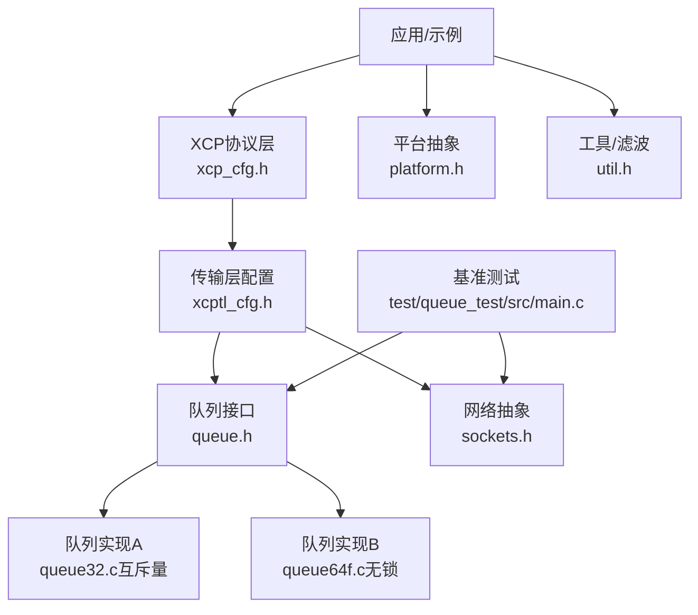
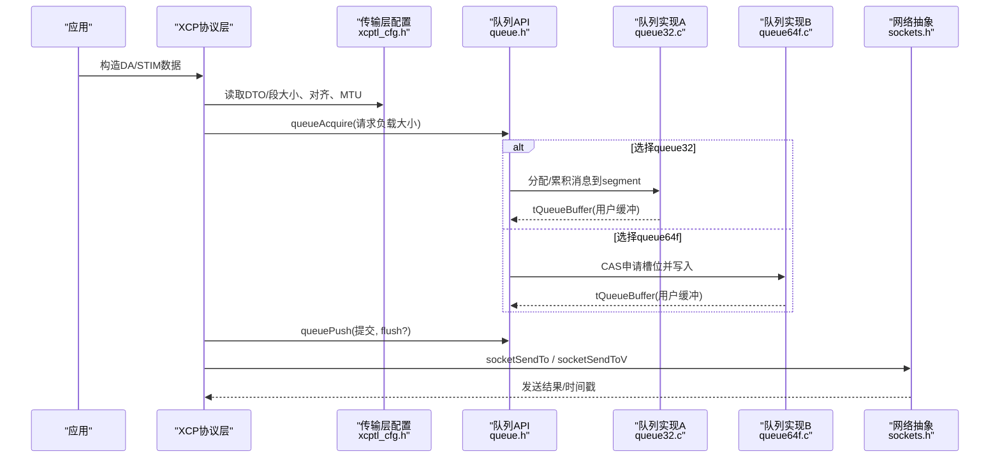
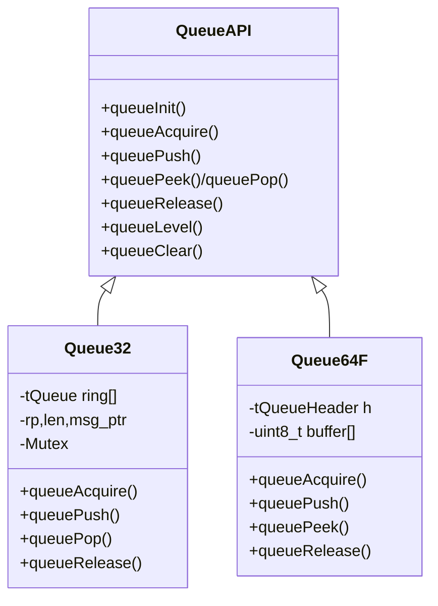
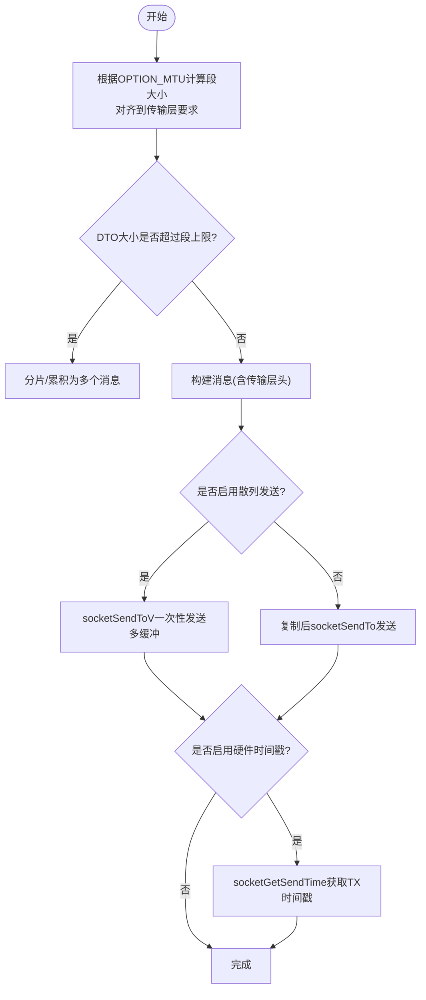
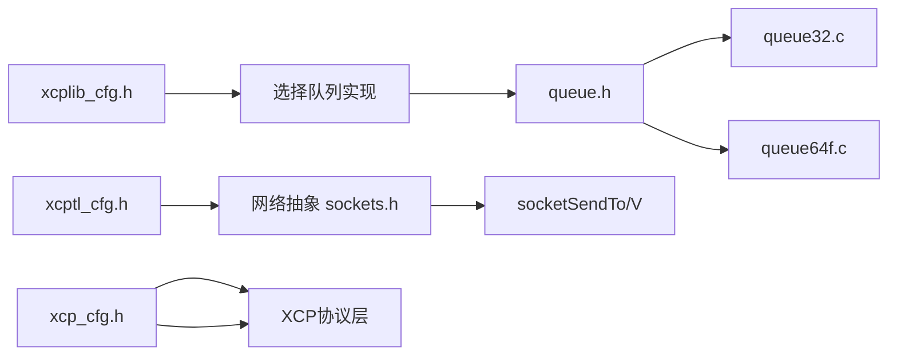

# 性能分析和优化

<cite>
**本文引用的文件**
- [queue.h](file://src/queue.h)
- [queue32.c](file://src/queue32.c)
- [queue64f.c](file://src/queue64f.c)
- [xcptl_cfg.h](file://src/xcptl_cfg.h)
- [xcplib_cfg.h](file://src/xcplib_cfg.h)
- [xcp_cfg.h](file://src/xcp_cfg.h)
- [platform.h](file://src/platform.h)
- [sockets.h](file://src/sockets.h)
- [util.h](file://src/util.h)
- [main.c（队列测试）](file://test/queue_test/src/main.c)
</cite>

## 目录
1. [简介](#简介)
2. [项目结构](#项目结构)
3. [核心组件](#核心组件)
4. [架构总览](#架构总览)
5. [详细组件分析](#详细组件分析)
6. [依赖关系分析](#依赖关系分析)
7. [性能考量与优化建议](#性能考量与优化建议)
8. [故障排查指南](#故障排查指南)
9. [结论](#结论)
10. [附录：基准测试与用例](#附录：基准测试与用例)

## 简介
本指南面向XCP服务器开发者，聚焦于运行期性能分析与优化。内容涵盖：
- 如何使用内置监控能力观察XCP服务器状态与队列行为
- 队列实现的性能特点、无锁设计原理与适用场景
- 内存分配策略对吞吐与延迟的影响及配置优化
- CPU占用率分析方法，包括线程调度与中断/时间戳处理
- 基准测试工具与用例使用方法，用于评估不同配置下的表现
- 常见瓶颈识别与优化技巧（网络I/O、内存管理、算法复杂度）

## 项目结构
XCPlite将传输层、协议层、平台抽象、队列与测试工具分层组织，便于按模块进行性能调优：
- 传输层与协议层配置：xcptl_cfg.h、xcp_cfg.h、xcplib_cfg.h
- 队列实现：queue.h + queue32.c（互斥量）、queue64f.c（固定大小无锁）
- 平台抽象：platform.h（时钟、线程、原子、共享内存等）
- 网络抽象：sockets.h（UDP/TCP/Raw以太网、散列发送、硬件时间戳）
- 工具与滤波：util.h（中值/均值/线性回归滤波器、时钟同步器）
- 基准测试：test/queue_test/src/main.c（多生产者/消费者、峰值统计、可选共享内存模式）

图表来源
- [xcptl_cfg.h:16-114](file://src/xcptl_cfg.h#L16-L114)
- [xcplib_cfg.h:143-162](file://src/xcplib_cfg.h#L143-L162)
- [queue.h:29-55](file://src/queue.h#L29-L55)
- [queue32.c:85-100](file://src/queue32.c#L85-L100)
- [queue64f.c:270-294](file://src/queue64f.c#L270-L294)
- [sockets.h:207-318](file://src/sockets.h#L207-L318)
- [platform.h:470-506](file://src/platform.h#L470-L506)
- [util.h:102-250](file://src/util.h#L102-L250)

章节来源
- [xcptl_cfg.h:16-114](file://src/xcptl_cfg.h#L16-L114)
- [xcplib_cfg.h:143-162](file://src/xcplib_cfg.h#L143-L162)
- [queue.h:29-55](file://src/queue.h#L29-L55)
- [sockets.h:207-318](file://src/sockets.h#L207-L318)
- [platform.h:470-506](file://src/platform.h#L470-L506)
- [util.h:102-250](file://src/util.h#L102-L250)

## 核心组件
- 队列抽象与API：提供统一接口，支持可变/固定条目、消息累积、peek/pop/release、丢包计数、flush请求等。
- 队列实现：
  - queue32.c：多生产者单消费者，基于互斥量；支持将多条消息累积为一段（segment），适合原始以太网零拷贝路径。
  - queue64f.c：多生产者单消费者，固定条目大小，无锁CAS；通过entry_header发布数据，tail作为容量元信息，避免在共享尾指针上引入强顺序。
- 传输层配置：定义最大DTO/段大小、对齐、MTU、接收超时、是否使用CRM走队列等。
- 平台抽象：高精度时钟、线程/互斥、原子操作（含Windows模拟）、共享内存、硬件时间戳开关。
- 网络抽象：UDP/TCP/Raw以太网、散列发送（sendmsg）、硬件时间戳获取、错误码封装。
- 工具：中值/均值/线性回归滤波器，轻量级时钟同步器（PI控制）。

章节来源
- [queue.h:88-186](file://src/queue.h#L88-L186)
- [queue32.c:85-100](file://src/queue32.c#L85-L100)
- [queue64f.c:250-294](file://src/queue64f.c#L250-L294)
- [xcptl_cfg.h:37-114](file://src/xcptl_cfg.h#L37-L114)
- [platform.h:470-506](file://src/platform.h#L470-L506)
- [sockets.h:207-318](file://src/sockets.h#L207-L318)
- [util.h:26-88](file://src/util.h#L26-L88)

## 架构总览
下图展示从应用到队列再到网络的典型发送路径，以及关键配置点。

图表来源
- [xcptl_cfg.h:37-114](file://src/xcptl_cfg.h#L37-L114)
- [queue.h:122-168](file://src/queue.h#L122-L168)
- [queue32.c:206-304](file://src/queue32.c#L206-L304)
- [queue64f.c:399-519](file://src/queue64f.c#L399-L519)
- [sockets.h:279-318](file://src/sockets.h#L279-L318)

## 详细组件分析

### 队列实现与无锁设计
- 通用接口（queue.h）
  - 提供queueInit/queueDeinit、queueAcquire/queuePush、queuePeek/queuePop、queueRelease、queueLevel、queueClear等。
  - 支持“每消息用户头空间”和“每段头部预留”，以便零拷贝附加链路头（如Raw以太网）。
  - 对齐要求严格，确保原子头与消息边界对齐。
- queue32.c（互斥量+消息累积）
  - 多生产者单消费者，使用互斥量保护环形缓冲区。
  - 将多条消息累积为一个segment，减少系统调用次数，适合Raw以太网零拷贝路径。
  - 消费者在pop时填充CTR，支持packets_lost统计与flush语义。
- queue64f.c（固定大小无锁）
  - 每个槽位包含一个原子entry_header，编码“提交状态+长度”。
  - 生产者通过CAS推进head，release-store entry_header发布数据；消费者acquire-load entry_header读取数据。
  - tail仅作为容量元信息，避免在共享尾指针上引入额外顺序，降低竞争开销。
  - 支持flush_offset机制，消费者可优先处理高优先级数据包。

图表来源
- [queue.h:88-186](file://src/queue.h#L88-L186)
- [queue32.c:85-100](file://src/queue32.c#L85-L100)
- [queue64f.c:270-294](file://src/queue64f.c#L270-L294)

章节来源
- [queue.h:29-55](file://src/queue.h#L29-L55)
- [queue32.c:206-417](file://src/queue32.c#L206-L417)
- [queue64f.c:399-660](file://src/queue64f.c#L399-L660)

### 传输层与网络I/O
- 传输层参数（xcptl_cfg.h）
  - 最大CRO/CRM尺寸、最大DTO尺寸、段大小（受MTU限制并对齐）、接收超时、报文对齐、发送头预留（Raw以太网零拷贝）。
  - 可选择是否让CRM走传输队列（权衡整体吞吐与命令响应延迟）。
- 网络抽象（sockets.h）
  - 支持UDP/TCP/Raw以太网；POSIX下支持scatter-gather发送（socketSendToV/socketSendV）以降低拷贝。
  - Linux下支持硬件时间戳（socketEnableTimestamps/socketGetSendTime），可用于精确测量发送时延。
  - 错误码与阻塞/超时语义统一封装，便于跨平台处理。

图表来源
- [xcptl_cfg.h:51-114](file://src/xcptl_cfg.h#L51-L114)
- [sockets.h:279-318](file://src/sockets.h#L279-L318)

章节来源
- [xcptl_cfg.h:37-114](file://src/xcptl_cfg.h#L37-L114)
- [sockets.h:207-318](file://src/sockets.h#L207-L318)

### 平台与时钟/原子
- 高精度时钟：提供单调时钟、实时时钟、最后值缓存以减少系统调用开销。
- 原子操作：POSIX使用stdatomic；Windows通过Interlocked intrinsics模拟，保证RMW的完整屏障。
- 线程/互斥：跨平台封装，FreeRTOS下支持静态任务/栈分配。
- 共享内存：POSIX shm_open/mmap，支持主从进程协作初始化队列。

章节来源
- [platform.h:470-506](file://src/platform.h#L470-L506)
- [platform.h:520-672](file://src/platform.h#L520-L672)
- [platform.h:301-433](file://src/platform.h#L301-L433)

### 工具与滤波
- 中值/均值/线性回归滤波器：用于平滑抖动、估计漂移或趋势。
- 时钟同步器：基于PI控制的轻量同步，支持中值预滤波与抗积分饱和，适用于硬件时间戳与参考时钟的对齐。

章节来源
- [util.h:26-88](file://src/util.h#L26-L88)
- [util.h:102-250](file://src/util.h#L102-L250)

## 依赖关系分析
- 编译期选项决定具体实现：
  - xcplib_cfg.h选择队列实现（64位变长/固定/32位互斥量）。
  - xcptl_cfg.h约束队列与传输层的组合（例如Raw以太网需要queue32）。
  - xcp_cfg.h导出协议层特性（事件列表、校准段、地址模式等）。
- 运行时依赖：
  - 队列与网络抽象解耦，便于替换底层实现。
  - 平台抽象屏蔽差异，保证时钟、线程、原子的一致性。

图表来源
- [xcplib_cfg.h:143-162](file://src/xcplib_cfg.h#L143-L162)
- [xcptl_cfg.h:16-32](file://src/xcptl_cfg.h#L16-L32)
- [xcp_cfg.h:41-96](file://src/xcp_cfg.h#L41-L96)
- [queue.h:29-55](file://src/queue.h#L29-L55)
- [sockets.h:207-318](file://src/sockets.h#L207-L318)

章节来源
- [xcplib_cfg.h:143-162](file://src/xcplib_cfg.h#L143-L162)
- [xcptl_cfg.h:16-32](file://src/xcptl_cfg.h#L16-L32)
- [xcp_cfg.h:41-96](file://src/xcp_cfg.h#L41-L96)

## 性能考量与优化建议
- 队列选择与配置
  - 64位目标优先使用无锁队列（queue64f.c）以获得更低延迟与更高吞吐；固定条目可减少碎片并利于缓存友好布局。
  - 若需Raw以太网零拷贝或消息累积，选择queue32.c；注意其互斥量开销。
  - 合理设置XCPTL_MAX_DTO_SIZE与XCPTL_MAX_SEGMENT_SIZE，使段大小接近链路MTU但避免分片。
- 内存分配策略
  - 尽量使用静态/共享内存放置队列（queueInitFromMemory），减少动态分配抖动。
  - 调整队列缓冲区大小以匹配负载峰值，避免频繁溢出导致丢包。
  - 利用“每段头部预留”实现零拷贝附加链路头，减少拷贝与分配。
- 网络I/O优化
  - 启用散列发送（socketSendToV/socketSendV）减少拷贝。
  - 在Linux上启用硬件时间戳，结合clockGetMonotonicNsLast等快速时钟查询，降低测量开销。
  - 合理设置接收超时（XCPTL_RECV_TIMEOUT_MS），平衡后台任务执行与响应延迟。
- CPU占用率分析
  - 使用高精度单调时钟统计热点路径耗时；队列测试内置采集与直方图统计。
  - 关注生产者CAS自旋与消费者acquire-load频率；在高竞争下考虑增大队列或降低生产速率。
  - 对于FreeRTOS目标，注意原子操作的实现成本（LDREX/STREX或CAS循环），必要时降低并发度。
- 算法复杂度改进
  - 消息累积减少系统调用次数，提升整体吞吐。
  - 使用滤波器（中值/均值/线性回归）平滑抖动，辅助稳定控制环路。
  - 避免在热路径中进行字符串格式化与大对象拷贝。

[本节为通用指导，不直接分析具体文件]

## 故障排查指南
- 队列溢出与丢包
  - 检查queueLevel与packets_lost；适当增大队列或降低生产速率。
  - 确认段大小与MTU匹配，避免EMSGSIZE错误。
- 网络发送失败
  - 检查socketSendTo返回值与错误码；在Linux上确认DF标志与路径MTU。
  - 若启用硬件时间戳，确保已调用socketEnableTimestamps并在发送后及时获取时间戳。
- 时钟与同步问题
  - 使用util.h中的时钟同步器校正目标时钟与参考时钟漂移；必要时开启中值预滤波。
  - 在高抖动环境下，调整PI增益与中值窗口大小。
- 平台相关
  - Windows下原子操作通过Interlocked实现，注意其屏障语义；FreeRTOS下注意原子指令成本。

章节来源
- [queue32.c:333-417](file://src/queue32.c#L333-L417)
- [queue64f.c:557-660](file://src/queue64f.c#L557-L660)
- [sockets.h:279-318](file://src/sockets.h#L279-L318)
- [util.h:102-250](file://src/util.h#L102-L250)

## 结论
XCPlite通过可插拔队列、传输层与平台抽象，提供了高性能、可扩展的XCP服务器基础。针对性能优化，应优先选择合适的队列实现与传输层配置，结合零拷贝与散列发送降低开销，并使用高精度时钟与滤波器进行测量与控制。通过基准测试与监控指标持续评估不同配置下的表现，逐步收敛至最优方案。

[本节为总结性内容，不直接分析具体文件]

## 附录：基准测试与用例
- 队列基准测试（test/queue_test/src/main.c）
  - 多生产者/消费者模型，支持随机负载大小与突发发送。
  - 可选共享内存模式，跨进程验证队列稳定性。
  - 内置锁时间直方图与统计输出，便于定位竞争热点。
  - 可通过命令行切换模式与打印帮助。
- 使用建议
  - 在不同队列实现与DTO/段大小组合下运行测试，比较吞吐与延迟分布。
  - 结合网络层发送路径（UDP/TCP/Raw）与硬件时间戳，端到端评估性能。
  - 调整队列缓冲区与线程数，寻找最佳平衡点。

章节来源
- [main.c（队列测试）:40-80](file://test/queue_test/src/main.c#L40-L80)
- [main.c（队列测试）:440-517](file://test/queue_test/src/main.c#L440-L517)
- [main.c（队列测试）:519-599](file://test/queue_test/src/main.c#L519-L599)
- [main.c（队列测试）:600-799](file://test/queue_test/src/main.c#L600-L799)