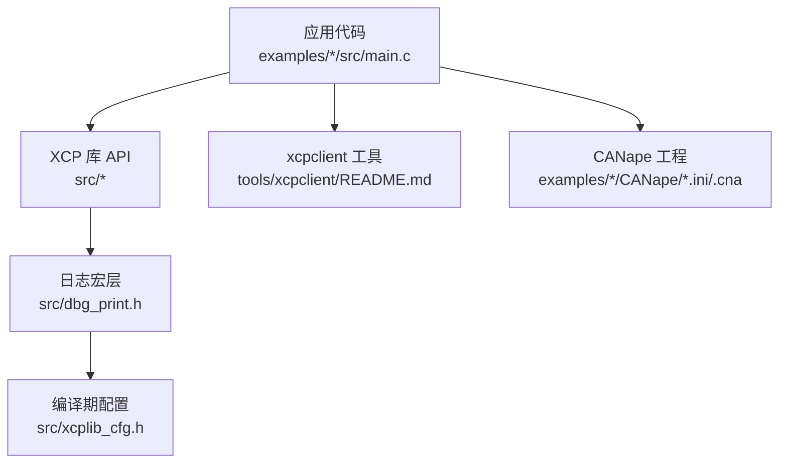
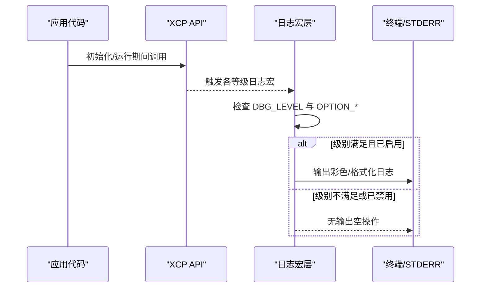
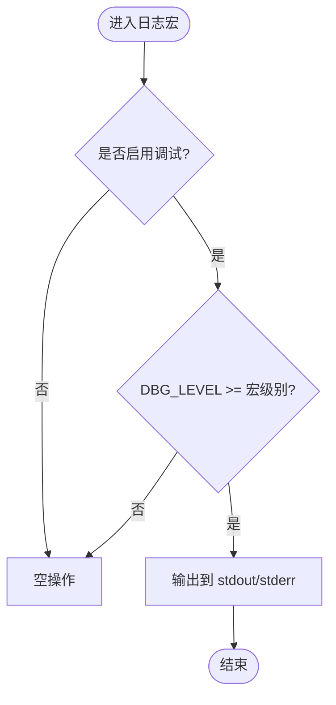
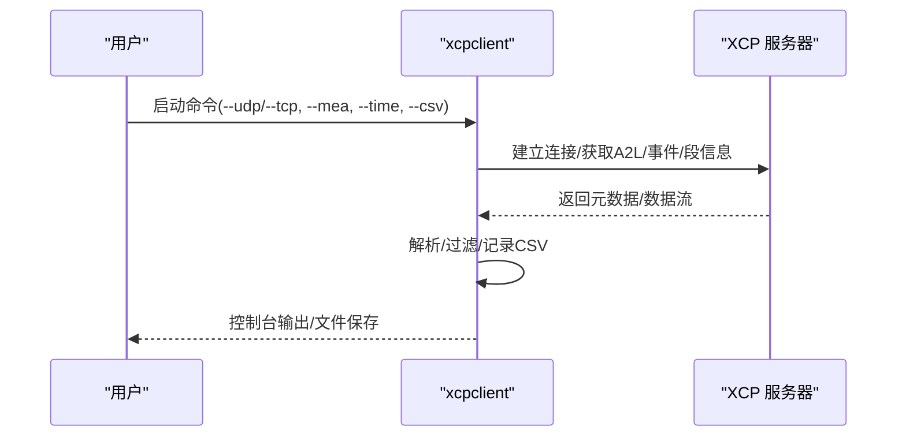
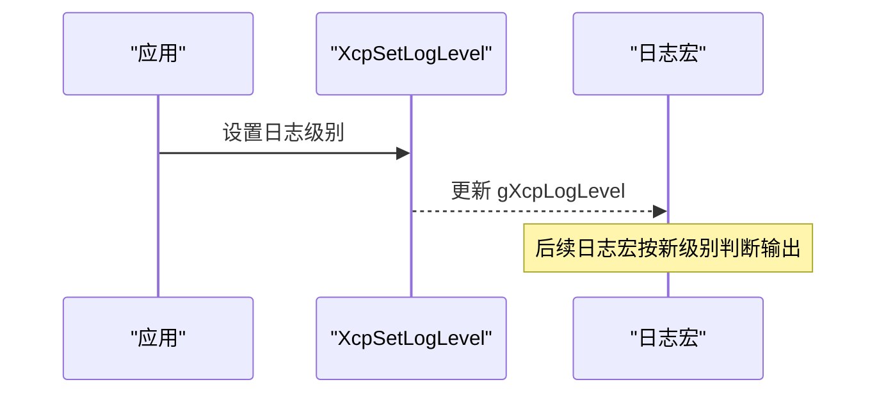
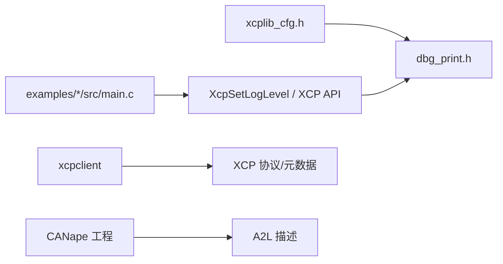

# 调试工具和日志系统

<cite>
**本文引用的文件**
- [dbg_print.h](file://src/dbg_print.h)
- [xcplib_cfg.h](file://src/xcplib_cfg.h)
- [xcplib.md](file://docs/xcplib.md)
- [xcplib_cfg.md](file://docs/xcplib_cfg.md)
- [README.md（xcpclient）](file://tools/xcpclient/README.md)
- [main.c（c_demo）](file://examples/c_demo/src/main.c)
- [TECHNICAL.md](file://docs/TECHNICAL.md)
</cite>

## 目录
1. [简介](#简介)
2. [项目结构](#项目结构)
3. [核心组件](#核心组件)
4. [架构总览](#架构总览)
5. [详细组件分析](#详细组件分析)
6. [依赖关系分析](#依赖关系分析)
7. [性能注意事项](#性能注意事项)
8. [故障排查指南](#故障排查指南)
9. [结论](#结论)
10. [附录](#附录)

## 简介
本指南面向使用 XCPlite 的工程师，系统化说明内置调试输出机制、日志级别与配置方法，并给出 xcpclient 与 CANape 在调试中的实用技巧。内容覆盖：
- 编译时启用/禁用调试功能
- 运行时动态调整日志级别
- xcpclient 的数据包捕获、协议分析与数据可视化
- CANape 的信号监控、校准参数查看与数据采集
- 日志分析与性能分析方法

## 项目结构
XCPlite 的调试能力由“库内日志宏 + 配置头 + 工具链”共同构成：
- 库内日志宏位于 src/dbg_print.h，提供 ERROR/WARNING/INFO/TRACE/DEBUG 等分级输出
- 全局配置位于 src/xcplib_cfg.h，控制是否启用调试、默认级别、最大级别以及是否固定级别
- 应用示例通过调用 XcpSetLogLevel 设置运行时日志级别
- xcpclient 提供命令行日志级别与详细输出选项，便于调试连接与协议交互
- CANape 工程配置文件用于信号监控、校准与采集

图表来源
- [dbg_print.h:1-244](file://src/dbg_print.h#L1-L244)
- [xcplib_cfg.h:41-54](file://src/xcplib_cfg.h#L41-L54)
- [README.md（xcpclient）:40-191](file://tools/xcpclient/README.md#L40-L191)
- [main.c（c_demo）:130-156](file://examples/c_demo/src/main.c#L130-L156)

章节来源
- [dbg_print.h:1-244](file://src/dbg_print.h#L1-L244)
- [xcplib_cfg.h:41-54](file://src/xcplib_cfg.h#L41-L54)
- [xcplib.md:50-73](file://docs/xcplib.md#L50-L73)
- [xcplib_cfg.md:57-65](file://docs/xcplib_cfg.md#L57-L65)
- [README.md（xcpclient）:40-191](file://tools/xcpclient/README.md#L40-L191)
- [main.c（c_demo）:130-156](file://examples/c_demo/src/main.c#L130-L156)

## 核心组件
- 日志宏与级别控制
  - 支持 ERROR(1)、WARNING(2)、INFO(3)、TRACE(4)、DEBUG(5/6) 多级输出
  - 可通过 OPTION_ENABLE_DBG_PRINTS 开启/关闭全部调试输出
  - 可通过 OPTION_FIXED_DBG_LEVEL 固定级别（不可运行时修改），或通过 OPTION_MAX_DBG_LEVEL 限制最大可调级别
  - 未定义 DBG_LEVEL 时，默认使用 gXcpLogLevel 作为运行时级别
- 配置项
  - OPTION_DEFAULT_DBG_LEVEL：默认日志级别
  - OPTION_MAX_DBG_LEVEL：最大可调级别，高于该级别的宏将被优化为空操作
  - OPTION_ENABLE_DBG_STDERR：错误/警告输出到 stderr
- 应用集成
  - 通过 XcpSetLogLevel(level) 在运行时设置日志级别
  - 示例中通过 OPTION_LOG_LEVEL 传入具体值

章节来源
- [dbg_print.h:21-85](file://src/dbg_print.h#L21-L85)
- [dbg_print.h:99-222](file://src/dbg_print.h#L99-L222)
- [xcplib_cfg.h:41-54](file://src/xcplib_cfg.h#L41-L54)
- [xcplib.md:50-73](file://docs/xcplib.md#L50-L73)
- [xcplib_cfg.md:57-65](file://docs/xcplib_cfg.md#L57-L65)
- [main.c（c_demo）:130-156](file://examples/c_demo/src/main.c#L130-L156)

## 架构总览
下图展示了从应用代码到日志输出的完整链路，包括编译期开关与运行时级别控制。

图表来源
- [dbg_print.h:21-85](file://src/dbg_print.h#L21-L85)
- [dbg_print.h:99-222](file://src/dbg_print.h#L99-L222)
- [xcplib_cfg.h:41-54](file://src/xcplib_cfg.h#L41-L54)

## 详细组件分析

### 日志系统与级别管理
- 编译期开关
  - 若未定义 OPTION_ENABLE_DBG_PRINTS，所有日志宏均被替换为空操作，零开销
  - 若定义 OPTION_FIXED_DBG_LEVEL，则级别固定为常量，无法运行时修改
  - 否则，级别受 OPTION_MAX_DBG_LEVEL 限制，并通过 gXcpLogLevel 动态读取
- 运行时级别
  - 通过 XcpSetLogLevel(level) 设置当前级别；低于该级别的日志不会输出
  - 建议生产环境将级别固定为最小必要级别，以减少开销
- 输出目标
  - 可选将错误/警告输出至 stderr（OPTION_ENABLE_DBG_STDERR）
  - 支持 ANSI 颜色标记，便于区分级别

图表来源
- [dbg_print.h:21-85](file://src/dbg_print.h#L21-L85)
- [dbg_print.h:99-222](file://src/dbg_print.h#L99-L222)

章节来源
- [dbg_print.h:21-85](file://src/dbg_print.h#L21-L85)
- [dbg_print.h:99-222](file://src/dbg_print.h#L99-L222)
- [xcplib_cfg.h:41-54](file://src/xcplib_cfg.h#L41-L54)
- [xcplib.md:50-73](file://docs/xcplib.md#L50-L73)

### xcpclient 调试功能
- 日志与详细度
  - --log-level：程序流程日志级别（Off=0, Error=1, Warn=2, Info=3, Debug=4, Trace=5）
  - --verbose：内容信息详细度，便于观察协议交互细节
- 连接与协议
  - 支持 TCP/UDP/SxI 等传输方式
  - 可上传/下载 A2L/ELF/BIN，创建离线 A2L，修复 A2L
- 数据采集与可视化
  - --mea：指定测量变量（支持正则）
  - --time：限定采集时长
  - --csv：导出 CSV（时间戳、DAQ、名称、值）
  - --list-mea/--list-cal：列出测量/校准变量
- 典型用法
  - 从目标上传 A2L 后采集全部变量
  - 基于 ELF 生成 A2L 模板并在线补全事件/段信息
  - 仅列出特定变量或执行测试序列

图表来源
- [README.md（xcpclient）:40-191](file://tools/xcpclient/README.md#L40-L191)
- [README.md（xcpclient）:209-296](file://tools/xcpclient/README.md#L209-L296)

章节来源
- [README.md（xcpclient）:40-191](file://tools/xcpclient/README.md#L40-L191)
- [README.md（xcpclient）:209-296](file://tools/xcpclient/README.md#L209-L296)

### CANape 调试功能
- 信号监控与采集
  - 通过 .cna 工程加载 A2L，选择测量信号进行实时波形显示
  - 可在 CANape.ini 中配置 MDF/BLF 写入、采样率、缓冲等
- 校准参数查看与修改
  - 利用 MEMORY_SEGMENT 映射校准段，支持读写与一致性校验
  - 结合示例工程中的 A2L/CANape 配置快速上手
- 数据回放与分析
  - 支持 MDF/BLF 格式记录与回放
  - 可使用过滤器、标记、统计等功能进行分析

章节来源
- [main.c（c_demo）:130-156](file://examples/c_demo/src/main.c#L130-L156)
- [xcplib.md:88-125](file://docs/xcplib.md#L88-L125)

### 运行时日志级别设置流程

图表来源
- [xcplib.md:50-73](file://docs/xcplib.md#L50-L73)
- [dbg_print.h:73-85](file://src/dbg_print.h#L73-L85)

章节来源
- [xcplib.md:50-73](file://docs/xcplib.md#L50-L73)
- [dbg_print.h:73-85](file://src/dbg_print.h#L73-L85)

## 依赖关系分析
- 日志宏依赖配置头
  - dbg_print.h 包含 xcplib_cfg.h，读取 OPTION_* 以决定行为
- 应用代码依赖 API
  - 示例 main.c 调用 XcpSetLogLevel 设置级别
- 工具链依赖协议与元数据
  - xcpclient 通过 XCP 协议获取事件/段信息，结合 ELF/DWARF 生成 A2L
  - CANape 依赖 A2L 描述进行信号绑定与采集

图表来源
- [xcplib_cfg.h:41-54](file://src/xcplib_cfg.h#L41-L54)
- [dbg_print.h:15-18](file://src/dbg_print.h#L15-L18)
- [main.c（c_demo）:130-156](file://examples/c_demo/src/main.c#L130-L156)
- [README.md（xcpclient）:24-37](file://tools/xcpclient/README.md#L24-L37)

章节来源
- [xcplib_cfg.h:41-54](file://src/xcplib_cfg.h#L41-L54)
- [dbg_print.h:15-18](file://src/dbg_print.h#L15-L18)
- [main.c（c_demo）:130-156](file://examples/c_demo/src/main.c#L130-L156)
- [README.md（xcpclient）:24-37](file://tools/xcpclient/README.md#L24-L37)

## 性能注意事项
- 资源占用
  - 发布版库大小约 160 KB（不含调试输出）
  - 静态内存约 10 KB（DAQ 表、校准页），堆内存约 32 KB（传输队列），每线程栈约 1 KB
- 注入成本
  - DAQ 触发与数据传输采用无锁实现，避免阻塞
  - 局部变量/函数参数的测量会促使编译器将参数压栈并保持局部变量在栈帧中
  - 事件创建可能使用互斥锁，但访问校准段是无锁的
- 建议
  - 生产环境固定最低日志级别或完全禁用调试输出
  - 合理设置传输队列大小，覆盖预期峰值流量（至少 10ms）
  - 谨慎使用高详细度日志，避免影响实时性

章节来源
- [TECHNICAL.md:5-24](file://docs/TECHNICAL.md#L5-L24)
- [TECHNICAL.md:28-52](file://docs/TECHNICAL.md#L28-L52)
- [xcplib_cfg.h:143-162](file://src/xcplib_cfg.h#L143-L162)

## 故障排查指南
- 无日志输出
  - 确认已定义 OPTION_ENABLE_DBG_PRINTS
  - 检查 OPTION_FIXED_DBG_LEVEL 或 OPTION_MAX_DBG_LEVEL 是否限制了级别
  - 确认 XcpSetLogLevel 设置的级别不低于宏级别
- 日志过多影响性能
  - 降低默认级别或固定为最小级别
  - 仅在开发阶段启用 TRACE/DEBUG
- xcpclient 连接失败
  - 检查 IP/端口/TCP/UDP 参数
  - 使用 --verbose 提高详细度定位问题
  - 确认目标支持所需命令（如 GET_EVENT_INFO/GET_SEGMENT_INFO）
- CANape 无法识别信号
  - 确保 A2L 正确生成并已上传或本地可用
  - 检查事件/段信息与目标一致（EPK 版本匹配）

章节来源
- [dbg_print.h:21-85](file://src/dbg_print.h#L21-L85)
- [xcplib_cfg.h:41-54](file://src/xcplib_cfg.h#L41-L54)
- [README.md（xcpclient）:40-191](file://tools/xcpclient/README.md#L40-L191)
- [xcplib.md:547-605](file://docs/xcplib.md#L547-L605)

## 结论
XCPlite 提供了完善的调试与日志体系：编译期可完全裁剪调试开销，运行时可灵活调整级别；配合 xcpclient 与 CANape，可实现从协议级到信号级的端到端调试与数据分析。建议在开发阶段充分利用详细日志与工具链，在生产环境收敛至最小必要级别，以获得最佳性能与稳定性。

## 附录
- 常用配置速查
  - 启用调试：定义 OPTION_ENABLE_DBG_PRINTS
  - 默认级别：OPTION_DEFAULT_DBG_LEVEL
  - 最大可调级别：OPTION_MAX_DBG_LEVEL
  - 固定级别：OPTION_FIXED_DBG_LEVEL
  - 错误/警告到 stderr：OPTION_ENABLE_DBG_STDERR
- xcpclient 常用参数
  - --log-level、--verbose、--udp/--tcp、--mea、--time、--csv、--upload-a2l、--create-a2l、--fix-a2l
- 参考路径
  - 日志宏：src/dbg_print.h
  - 配置头：src/xcplib_cfg.h
  - API 文档：docs/xcplib.md
  - 配置指南：docs/xcplib_cfg.md
  - xcpclient 说明：tools/xcpclient/README.md
  - 技术细节：docs/TECHNICAL.md
  - 示例入口：examples/c_demo/src/main.c