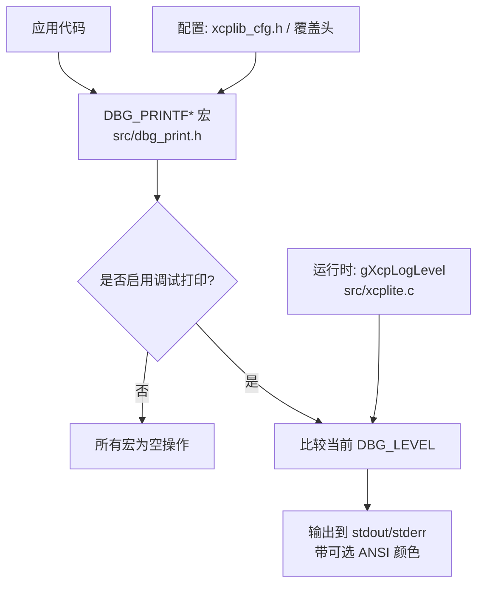
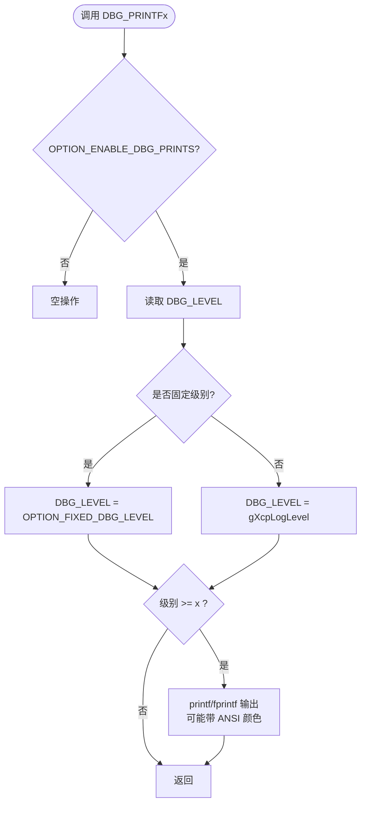
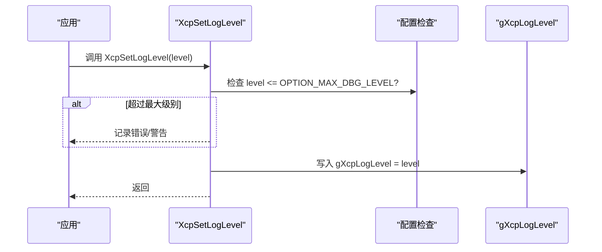
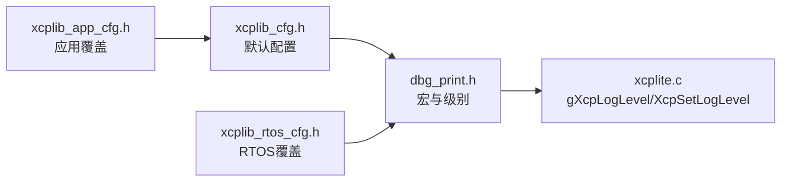

# 调试日志系统

<cite>
**本文引用的文件**
- [dbg_print.h](file://src/dbg_print.h)
- [xcplib_cfg.h](file://src/xcplib_cfg.h)
- [xcplite.c](file://src/xcplite.c)
- [xcplib_rtos_cfg.h](file://src/xcplib_rtos_cfg.h)
- [xcplib_app_cfg.h](file://examples/fetchcontent_example/config/xcplib_app_cfg.h)
</cite>

## 目录
1. [简介](#简介)
2. [项目结构](#项目结构)
3. [核心组件](#核心组件)
4. [架构总览](#架构总览)
5. [详细组件分析](#详细组件分析)
6. [依赖关系分析](#依赖关系分析)
7. [性能考虑](#性能考虑)
8. [故障排查指南](#故障排查指南)
9. [结论](#结论)
10. [附录：使用示例与最佳实践](#附录使用示例与最佳实践)

## 简介
本指南面向需要在嵌入式或桌面环境中集成和使用 XCPlite 内置调试输出机制的开发者。文档围绕以下目标展开：
- 解释 5 个日志级别（ERROR、WARNING、INFO、TRACE、DEBUG）的定义与使用方式
- 说明编译时配置选项：OPTION_ENABLE_DBG_PRINTS、OPTION_FIXED_DBG_LEVEL、OPTION_DEFAULT_DBG_LEVEL、OPTION_MAX_DBG_LEVEL 的作用与配置方法
- 阐述运行时动态调整日志级别的机制，包括全局变量 gXcpLogLevel 的使用
- 说明不同平台下的 ANSI 颜色代码支持，以及 FreeRTOS 环境下的特殊处理
- 提供完整的使用指引与示例路径，展示如何在不同场景下正确使用 DBG_PRINTF 系列宏

## 项目结构
XCPlite 的调试日志系统由头文件与实现共同构成：
- 头文件 src/dbg_print.h：定义日志级别、宏、ANSI 颜色、编译期裁剪策略
- 配置头文件 src/xcplib_cfg.h：默认启用调试打印、默认日志级别、最大级别等
- 运行时实现 src/xcplite.c：维护全局日志级别 gXcpLogLevel 并提供设置接口 XcpSetLogLevel
- 平台/RTOS 覆盖配置：
  - src/xcplib_rtos_cfg.h：FreeRTOS 环境下关闭 stderr 输出、调整时钟分辨率等
  - examples/fetchcontent_example/config/xcplib_app_cfg.h：应用级覆盖默认配置（例如限制日志级别以节省空间）

图表来源
- [dbg_print.h:19-243](file://src/dbg_print.h#L19-L243)
- [xcplib_cfg.h:44-53](file://src/xcplib_cfg.h#L44-L53)
- [xcplite.c:351-374](file://src/xcplite.c#L351-L374)

章节来源
- [dbg_print.h:19-243](file://src/dbg_print.h#L19-L243)
- [xcplib_cfg.h:44-53](file://src/xcplib_cfg.h#L44-L53)
- [xcplite.c:351-374](file://src/xcplite.c#L351-L374)

## 核心组件
- 日志级别与宏
  - 级别：1=ERROR, 2=WARNING, 3=INFO, 4=TRACE, 5=DEBUG（更高为更详细）
  - 宏：
    - 错误/警告：DBG_PRINTF_ERROR/DBG_PRINT_ERROR、DBG_PRINTF_WARNING/DBG_PRINT_WARNING
    - 信息/跟踪/调试：DBG_PRINTF3/DBG_PRINT3、DBG_PRINTF4/DBG_PRINT4、DBG_PRINTF5/DBG_PRINT5、DBG_PRINTF6/DBG_PRINT6
    - 通用：DBG_PRINTF、DBG_PRINT
- 编译期开关
  - OPTION_ENABLE_DBG_PRINTS：开启/关闭全部调试输出
  - OPTION_FIXED_DBG_LEVEL：固定日志级别（不可运行时更改）
  - OPTION_DEFAULT_DBG_LEVEL：默认日志级别
  - OPTION_MAX_DBG_LEVEL：允许编译的最高级别（高于该级别的宏将被裁剪为空）
- 运行时级别
  - gXcpLogLevel：运行时当前日志级别
  - XcpSetLogLevel(level)：设置日志级别（受 OPTION_MAX_DBG_LEVEL 限制）
- 平台差异
  - 非 FreeRTOS：启用 ANSI 颜色
  - FreeRTOS：禁用 ANSI 颜色，且默认关闭 stderr 输出

章节来源
- [dbg_print.h:21-27](file://src/dbg_print.h#L21-L27)
- [dbg_print.h:38-57](file://src/dbg_print.h#L38-L57)
- [dbg_print.h:59-85](file://src/dbg_print.h#L59-L85)
- [dbg_print.h:97-222](file://src/dbg_print.h#L97-L222)
- [xcplib_cfg.h:44-53](file://src/xcplib_cfg.h#L44-L53)
- [xcplite.c:351-374](file://src/xcplite.c#L351-L374)
- [xcplib_rtos_cfg.h:58-61](file://src/xcplib_rtos_cfg.h#L58-L61)

## 架构总览
调试输出在编译期与运行期两层控制：
- 编译期：通过 OPTION_* 决定哪些宏有效、是否裁剪高级别输出、是否固定级别
- 运行期：通过 gXcpLogLevel 决定实际输出的最低阈值

图表来源
- [dbg_print.h:59-85](file://src/dbg_print.h#L59-L85)
- [dbg_print.h:97-222](file://src/dbg_print.h#L97-L222)
- [xcplite.c:351-374](file://src/xcplite.c#L351-L374)

## 详细组件分析

### 日志级别与宏
- 级别映射
  - 1: ERROR
  - 2: WARNING
  - 3: INFO
  - 4: TRACE
  - 5: DEBUG（更高为更详细）
- 宏行为
  - 错误/警告：根据级别判断后输出到 stderr（若启用）或 stdout（默认），并附带颜色前缀
  - 信息/跟踪/调试：按级别阈值决定是否输出；级别 5/6 默认带灰色颜色
  - 当 OPTION_MAX_DBG_LEVEL < x 时，对应 DBG_PRINTFx/DBG_PRINTx 被替换为空宏，零开销

章节来源
- [dbg_print.h:21-27](file://src/dbg_print.h#L21-L27)
- [dbg_print.h:97-222](file://src/dbg_print.h#L97-L222)

### 编译时配置选项
- OPTION_ENABLE_DBG_PRINTS
  - 控制是否启用调试输出；未定义时所有 DBG_* 宏均为空
- OPTION_FIXED_DBG_LEVEL
  - 固定日志级别，禁止运行时修改；同时会覆盖 OPTION_MAX_DBG_LEVEL
- OPTION_DEFAULT_DBG_LEVEL
  - 初始日志级别（启动时 gXcpLogLevel 的默认值）
- OPTION_MAX_DBG_LEVEL
  - 最高允许级别；高于此级别的宏在编译期被裁剪为空，减小体积

章节来源
- [xcplib_cfg.h:44-53](file://src/xcplib_cfg.h#L44-L53)
- [dbg_print.h:59-85](file://src/dbg_print.h#L59-L85)
- [dbg_print.h:196-222](file://src/dbg_print.h#L196-L222)

### 运行时动态调整日志级别
- 全局变量 gXcpLogLevel
  - 保存当前生效的日志级别
- 设置接口 XcpSetLogLevel(level)
  - 将 level 写入 gXcpLogLevel
  - 若 level > OPTION_MAX_DBG_LEVEL，会记录错误/警告提示
  - 若启用固定级别，则忽略设置并报错提示

图表来源
- [xcplite.c:351-374](file://src/xcplite.c#L351-L374)

章节来源
- [xcplite.c:351-374](file://src/xcplite.c#L351-L374)

### 平台与 FreeRTOS 的特殊处理
- ANSI 颜色
  - 非 FreeRTOS：启用 ANSI 颜色码（红、黄、灰等）
  - FreeRTOS：禁用 ANSI 颜色（避免终端不支持导致乱码）
- 输出目标
  - 默认：stdout
  - 启用 OPTION_ENABLE_DBG_STDERR：错误/警告输出到 stderr
  - FreeRTOS：默认关闭 stderr 输出（无标准错误流）
- 时钟与日志
  - FreeRTOS 默认使用 1us 分辨率时钟（可自定义）

章节来源
- [dbg_print.h:38-57](file://src/dbg_print.h#L38-L57)
- [dbg_print.h:97-147](file://src/dbg_print.h#L97-L147)
- [xcplib_rtos_cfg.h:58-61](file://src/xcplib_rtos_cfg.h#L58-L61)
- [xcplib_rtos_cfg.h:65-78](file://src/xcplib_rtos_cfg.h#L65-L78)

### 应用级覆盖与裁剪
- 应用可通过覆盖头文件调整默认配置，例如限制日志级别以节省程序空间
- 常见做法：
  - 重新定义 OPTION_DEFAULT_DBG_LEVEL 和 OPTION_MAX_DBG_LEVEL
  - 保持 OPTION_ENABLE_DBG_PRINTS 开启以便调试

章节来源
- [xcplib_app_cfg.h:33-37](file://examples/fetchcontent_example/config/xcplib_app_cfg.h#L33-L37)

## 依赖关系分析
- dbg_print.h 依赖 xcplib_cfg.h 提供的 OPTION_* 配置
- xcplite.c 暴露 gXcpLogLevel 与 XcpSetLogLevel，供应用层在运行时调整
- 平台/RTOS 覆盖头可进一步调整默认行为（如关闭 stderr、禁用 ANSI）

图表来源
- [xcplib_cfg.h:44-53](file://src/xcplib_cfg.h#L44-L53)
- [dbg_print.h:17-85](file://src/dbg_print.h#L17-L85)
- [xcplite.c:351-374](file://src/xcplite.c#L351-L374)
- [xcplib_rtos_cfg.h:58-61](file://src/xcplib_rtos_cfg.h#L58-L61)
- [xcplib_app_cfg.h:33-37](file://examples/fetchcontent_example/config/xcplib_app_cfg.h#L33-L37)

章节来源
- [dbg_print.h:17-85](file://src/dbg_print.h#L17-L85)
- [xcplib_cfg.h:44-53](file://src/xcplib_cfg.h#L44-L53)
- [xcplite.c:351-374](file://src/xcplite.c#L351-L374)
- [xcplib_rtos_cfg.h:58-61](file://src/xcplib_rtos_cfg.h#L58-L61)
- [xcplib_app_cfg.h:33-37](file://examples/fetchcontent_example/config/xcplib_app_cfg.h#L33-L37)

## 性能考虑
- 编译期裁剪：将 OPTION_MAX_DBG_LEVEL 设置为最小可用级别，可显著减少二进制体积与分支开销
- 固定级别模式：使用 OPTION_FIXED_DBG_LEVEL 可消除运行时级别判断，进一步提升性能
- 输出目标选择：在资源受限平台优先使用 stdout，避免 stderr 带来的额外开销
- 避免过度日志：仅在关键路径与异常路径使用高频率日志

[本节为通用指导，不直接分析具体文件]

## 故障排查指南
- 编译期错误
  - 未定义必要选项：若启用调试但未定义 OPTION_DEFAULT_DBG_LEVEL 或 OPTION_FIXED_DBG_LEVEL，将触发编译错误
  - 最大级别小于默认级别：若 OPTION_MAX_DBG_LEVEL < OPTION_DEFAULT_DBG_LEVEL，将触发编译错误
- 运行时问题
  - 设置级别无效：若启用固定级别，XcpSetLogLevel 会被忽略并记录错误
  - 颜色乱码：在 FreeRTOS 或某些终端中，ANSI 颜色可能导致显示异常；确保已禁用颜色或使用支持的环境
- 建议
  - 先以较低级别（如 INFO）验证功能，再逐步提高至 TRACE/DEBUG
  - 在生产构建中关闭调试或限制最大级别

章节来源
- [dbg_print.h:30-32](file://src/dbg_print.h#L30-L32)
- [dbg_print.h:68-71](file://src/dbg_print.h#L68-L71)
- [xcplite.c:355-372](file://src/xcplite.c#L355-L372)
- [dbg_print.h:38-57](file://src/dbg_print.h#L38-L57)

## 结论
XCPlite 的调试日志系统在编译期与运行期提供了灵活的控制点：
- 通过 OPTION_* 可在构建阶段精确裁剪输出与行为
- 通过 gXcpLogLevel 与 XcpSetLogLevel 可在运行期动态调整
- 针对不同平台（含 FreeRTOS）提供了合理的默认与覆盖机制
合理配置这些选项，可以在开发调试与生产部署之间取得良好平衡。

[本节为总结性内容，不直接分析具体文件]

## 附录：使用示例与最佳实践
- 初始化与设置日志级别
  - 在应用启动处调用 XcpSetLogLevel(期望级别)，参考示例中的用法
  - 参考路径：examples/*/src/main.c 中对 XcpSetLogLevel 的调用
- 常用宏选择
  - 错误/警告：使用 DBG_PRINTF_ERROR/DBG_PRINTF_WARNING
  - 常规信息：使用 DBG_PRINTF3（INFO）
  - 详细跟踪：使用 DBG_PRINTF4（TRACE）
  - 深度调试：使用 DBG_PRINTF5/DBG_PRINTF6（DEBUG）
- 平台注意事项
  - FreeRTOS：默认关闭 stderr 与 ANSI 颜色；如需输出到串口，请确保重定向 stdout/stderr 到合适设备
  - 桌面/POSIX：可使用 ANSI 颜色增强可读性
- 优化建议
  - 生产构建：限制 OPTION_MAX_DBG_LEVEL 或启用 OPTION_FIXED_DBG_LEVEL
  - 开发构建：适当提高默认级别以获得更多信息

章节来源
- [xcplite.c:351-374](file://src/xcplite.c#L351-L374)
- [dbg_print.h:97-222](file://src/dbg_print.h#L97-L222)
- [xcplib_rtos_cfg.h:58-61](file://src/xcplib_rtos_cfg.h#L58-L61)
- [xcplib_app_cfg.h:33-37](file://examples/fetchcontent_example/config/xcplib_app_cfg.h#L33-L37)