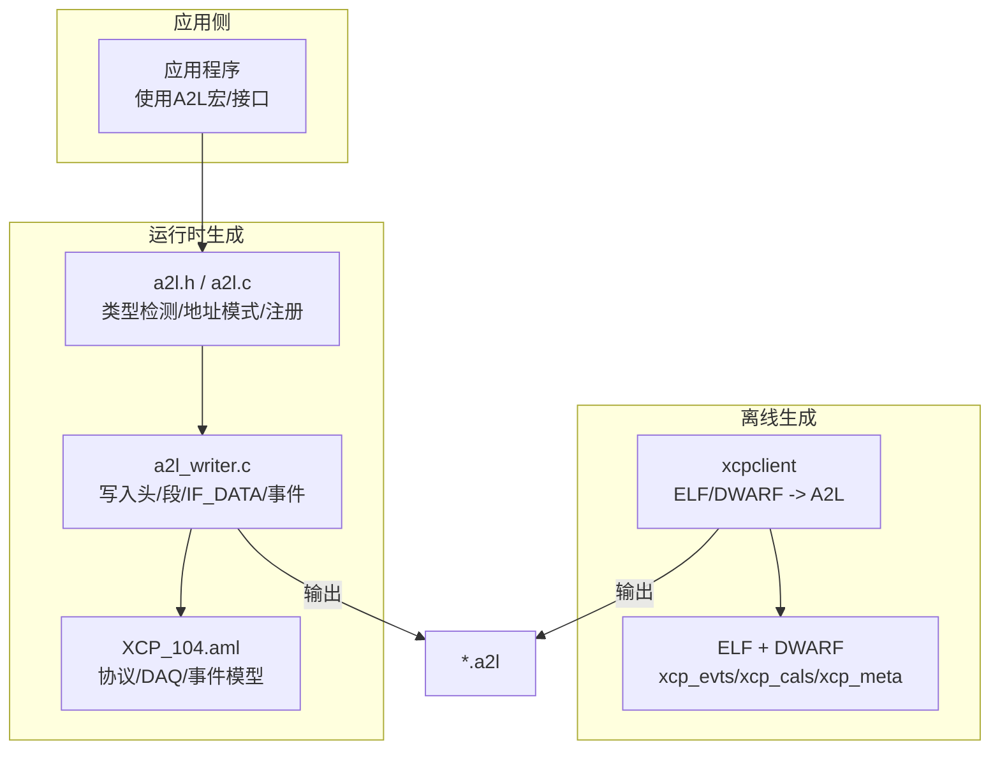
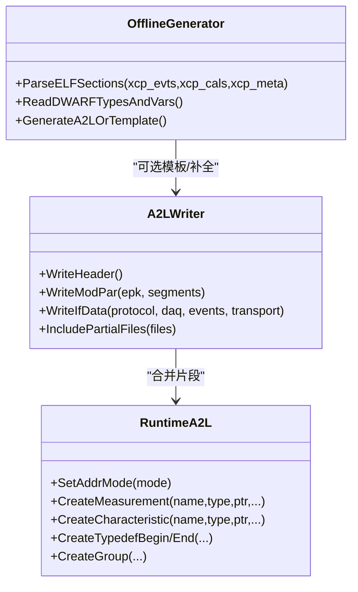
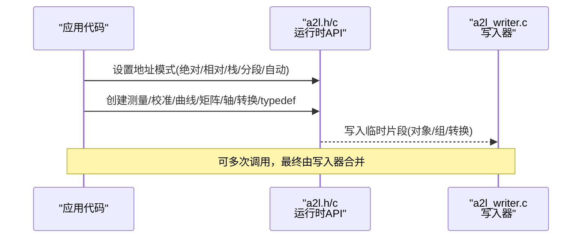
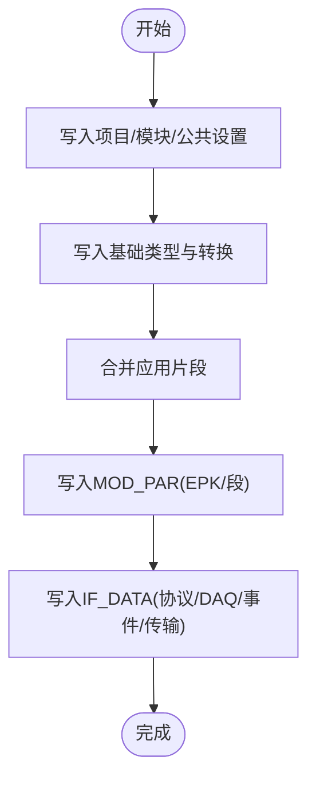
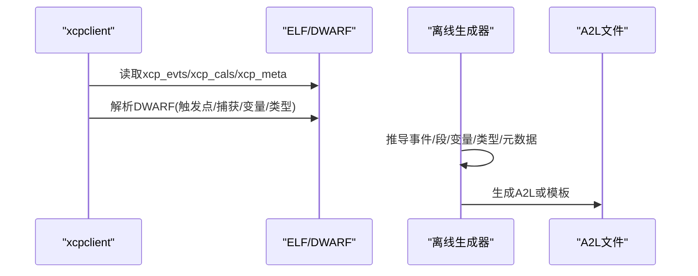
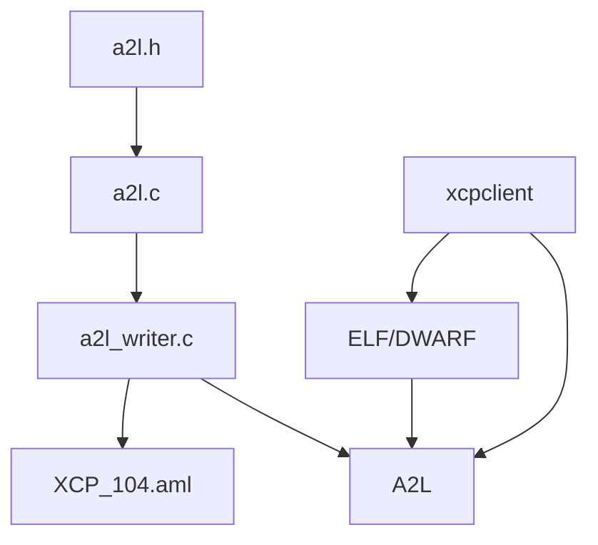

# A2L文件格式

<cite>
**本文引用的文件**
- [a2l.h](file://inc/a2l.h)
- [a2l.c](file://src/a2l.c)
- [a2l_writer.c](file://src/a2l_writer.c)
- [XCP_104.aml](file://XCP_104.aml)
- [OFFLINE_A2L.md](file://docs/OFFLINE_A2L.md)
- [TECHNICAL.md](file://docs/TECHNICAL.md)
- [xcpclient README.md](file://tools/xcpclient/README.md)
- [hello_xcp_autodetect.a2l](file://examples/hello_xcp/CANape/xcp_demo_autodetect.a2l)
- [hello_xcp_fixture.a2l](file://test/fixtures/hello_xcp.a2l)
</cite>

## 目录
1. [简介](#简介)
2. [项目结构](#项目结构)
3. [核心组件](#核心组件)
4. [架构总览](#架构总览)
5. [详细组件分析](#详细组件分析)
6. [依赖关系分析](#依赖关系分析)
7. [性能考量](#性能考量)
8. [故障排查指南](#故障排查指南)
9. [结论](#结论)
10. [附录](#附录)

## 简介
本文件面向使用XCPlite的开发者，系统性阐述A2L（ASAM MCD-2 MC）描述文件的结构、语法与语义，覆盖测量变量、校准参数、数据类型定义与元数据信息；解释运行时生成与构建时（离线）生成的实现方式；说明A2L与ELF/DWARF调试信息的关联；并提供工具链集成、编辑验证与分析的使用指南。

## 项目结构
XCPlite在A2L相关方面由“运行时生成器”和“离线生成器”两部分组成：
- 运行时生成器：应用侧通过宏与API在目标上动态生成A2L片段，最终由写入器合并为主A2L文件。
- 离线生成器：xcpclient工具从ELF/DWARF中解析标记与调试信息，直接生成完整A2L或模板。

图表来源
- [a2l.h:56-67](file://inc/a2l.h#L56-L67)
- [a2l.c:36-80](file://src/a2l.c#L36-L80)
- [a2l_writer.c:42-57](file://src/a2l_writer.c#L42-L57)
- [XCP_104.aml:30-197](file://XCP_104.aml#L30-L197)
- [OFFLINE_A2L.md:13-34](file://docs/OFFLINE_A2L.md#L13-L34)

章节来源
- [a2l.h:56-67](file://inc/a2l.h#L56-L67)
- [a2l.c:36-80](file://src/a2l.c#L36-L80)
- [a2l_writer.c:42-57](file://src/a2l_writer.c#L42-L57)
- [XCP_104.aml:30-197](file://XCP_104.aml#L30-L197)
- [OFFLINE_A2L.md:13-34](file://docs/OFFLINE_A2L.md#L13-L34)

## 核心组件
- 运行时A2L生成API与宏
  - 类型检测：C/C++自动推导基本类型、数组元素类型，映射到A2L数据类型。
  - 地址模式：绝对、相对、栈帧相对、分段、自动选择等，决定ECU_ADDRESS与ECU_ADDRESS_EXTENSION。
  - 对象创建：MEASUREMENT、CHARACTERISTIC、曲线/矩阵、轴、转换方法、typedef实例与分组。
  - 线程安全：once/lock/unlock辅助，避免重复注册。
- A2L写入器
  - 生成项目/模块头部、MOD_COMMON、RECORD_LAYOUT/TYPEDEF_*基础类型。
  - 生成MOD_PAR（EPK、MEMORY_SEGMENT）、IF_DATA（协议层、DAQ、事件列表、传输层）。
  - 合并应用侧生成的部分A2L片段为最终文件。
- 离线生成器（xcpclient）
  - 从ELF/DWARF解析xcp_evts、xcp_cals、xcp_meta、触发点锚点、捕获结构体等。
  - 生成完整A2L或仅含IF_DATA/事件的模板，支持过滤与默认事件分配。

章节来源
- [a2l.h:77-318](file://inc/a2l.h#L77-L318)
- [a2l.h:323-726](file://inc/a2l.h#L323-L726)
- [a2l_writer.c:42-57](file://src/a2l_writer.c#L42-L57)
- [a2l_writer.c:251-363](file://src/a2l_writer.c#L251-L363)
- [a2l_writer.c:451-530](file://src/a2l_writer.c#L451-L530)
- [OFFLINE_A2L.md:13-34](file://docs/OFFLINE_A2L.md#L13-L34)

## 架构总览
A2L文件由三部分构成：
- 项目/模块与公共设置：PROJECT/MODULE/MOD_COMMON，字节序与对齐。
- 数据模型：MEASUREMENT/CHARACTERISTIC、TYPEDEF_*、RECORD_LAYOUT、COMPU_METHOD/VTAB。
- IF_DATA：XCP协议能力、DAQ事件、传输层配置、内存段与页。

图表来源
- [a2l_writer.c:451-530](file://src/a2l_writer.c#L451-L530)
- [a2l.c:456-708](file://src/a2l.c#L456-L708)
- [OFFLINE_A2L.md:97-213](file://docs/OFFLINE_A2L.md#L97-L213)

## 详细组件分析

### 运行时A2L生成（API与宏）
- 类型系统
  - C/C++类型到A2L类型的映射，提供名称与记录布局名称，便于生成标准RECORD_LAYOUT与TYPEDEF_*。
- 地址模式
  - 绝对/相对/栈帧/分段/自动：决定ECU_ADDRESS与ECU_ADDRESS_EXTENSION，并影响IF_DATA中的固定事件或默认事件列表。
- 对象注册
  - 测量与校准：标量、一维/二维数组、曲线/矩阵、共享轴。
  - 转换：线性与枚举转换，供unit_or_conversion引用。
  - 复杂类型：typedef开始/结束，组件声明，实例化与数组。
  - 分组：按事件或校准段自动/手动分组。

图表来源
- [a2l.h:323-726](file://inc/a2l.h#L323-L726)
- [a2l.c:456-708](file://src/a2l.c#L456-L708)
- [a2l_writer.c:451-530](file://src/a2l_writer.c#L451-L530)

章节来源
- [a2l.h:77-318](file://inc/a2l.h#L77-L318)
- [a2l.h:323-726](file://inc/a2l.h#L323-L726)
- [a2l.c:456-708](file://src/a2l.c#L456-L708)

### A2L写入器（主文件组装）
- 生成头部与公共设置（字节序、对齐）。
- 预定义转换与基础类型（RECORD_LAYOUT/TYPEDEF_*）。
- 合并应用侧生成的部分A2L片段。
- 生成MOD_PAR（EPK、MEMORY_SEGMENT），IF_DATA（协议层、DAQ、事件列表、传输层）。
- 输出最终A2L文件。

图表来源
- [a2l_writer.c:42-57](file://src/a2l_writer.c#L42-L57)
- [a2l_writer.c:251-363](file://src/a2l_writer.c#L251-L363)
- [a2l_writer.c:451-530](file://src/a2l_writer.c#L451-L530)

章节来源
- [a2l_writer.c:42-57](file://src/a2l_writer.c#L42-L57)
- [a2l_writer.c:251-363](file://src/a2l_writer.c#L251-L363)
- [a2l_writer.c:451-530](file://src/a2l_writer.c#L451-L530)

### 离线A2L生成（ELF/DWARF -> A2L）
- 解析ELF节：xcp_evts（事件）、xcp_cals（校准段）、xcp_epk（软件版本）、xcp_meta（元数据）。
- 解析DWARF：触发点锚点trg__...__event、捕获结构cap__event、变量与类型信息。
- 生成A2L或模板：包含事件、段、变量、类型、IF_DATA；支持过滤、默认事件、跳过无元数据变量。

图表来源
- [OFFLINE_A2L.md:13-34](file://docs/OFFLINE_A2L.md#L13-L34)
- [OFFLINE_A2L.md:97-213](file://docs/OFFLINE_A2L.md#L97-L213)
- [OFFLINE_A2L.md:215-265](file://docs/OFFLINE_A2L.md#L215-L265)
- [TECHNICAL.md:96-200](file://docs/TECHNICAL.md#L96-L200)

章节来源
- [OFFLINE_A2L.md:13-34](file://docs/OFFLINE_A2L.md#L13-L34)
- [OFFLINE_A2L.md:97-213](file://docs/OFFLINE_A2L.md#L97-L213)
- [OFFLINE_A2L.md:215-265](file://docs/OFFLINE_A2L.md#L215-L265)
- [TECHNICAL.md:96-200](file://docs/TECHNICAL.md#L96-L200)

### A2L文件结构与示例
- 头部与公共设置：ASAP2_VERSION、PROJECT、HEADER、MODULE、MOD_COMMON。
- 数据模型：MEASUREMENT/CHARACTERISTIC、TYPEDEF_*、RECORD_LAYOUT、COMPU_METHOD/VTAB。
- IF_DATA：协议层、DAQ事件、传输层（TCP/UDP）、内存段与页。
- 示例参考：hello_xcp_autodetect.a2l与测试夹具hello_xcp.a2l展示了典型结构。

图表来源
- [hello_xcp_autodetect.a2l:1-169](file://examples/hello_xcp/CANape/xcp_demo_autodetect.a2l#L1-L169)
- [hello_xcp_fixture.a2l:1-165](file://test/fixtures/hello_xcp.a2l#L1-L165)

章节来源
- [hello_xcp_autodetect.a2l:1-169](file://examples/hello_xcp/CANape/xcp_demo_autodetect.a2l#L1-L169)
- [hello_xcp_fixture.a2l:1-165](file://test/fixtures/hello_xcp.a2l#L1-L165)

## 依赖关系分析
- 运行时生成器依赖：
  - a2l.h：API与宏、类型检测、地址模式、对象创建。
  - a2l.c：地址模式管理、统计、文件名与临时文件处理。
  - a2l_writer.c：写入器，负责主文件组装与IF_DATA生成。
  - XCP_104.aml：协议与DAQ模型定义，被include引用。
- 离线生成器依赖：
  - xcpclient：ELF/DWARF解析与A2L生成。
  - OFFLINE_A2L.md/TECHNICAL.md：约定与规则说明。

图表来源
- [a2l.h:56-67](file://inc/a2l.h#L56-L67)
- [a2l.c:36-80](file://src/a2l.c#L36-L80)
- [a2l_writer.c:42-57](file://src/a2l_writer.c#L42-L57)
- [XCP_104.aml:30-197](file://XCP_104.aml#L30-L197)
- [OFFLINE_A2L.md:13-34](file://docs/OFFLINE_A2L.md#L13-L34)

章节来源
- [a2l.h:56-67](file://inc/a2l.h#L56-L67)
- [a2l.c:36-80](file://src/a2l.c#L36-L80)
- [a2l_writer.c:42-57](file://src/a2l_writer.c#L42-L57)
- [XCP_104.aml:30-197](file://XCP_104.aml#L30-L197)
- [OFFLINE_A2L.md:13-34](file://docs/OFFLINE_A2L.md#L13-L34)

## 性能考量
- 运行时生成开销小：仅文件I/O与少量状态维护，适合嵌入式环境。
- 地址模式选择：自动模式在溢出时回退到绝对/应用特定模式，避免错误编码。
- 批量写入：写入器将多个片段合并为主文件，减少磁盘操作次数。
- 离线生成：基于ELF/DWARF解析，适用于CI/CD流水线，不依赖目标运行态。

[本节为通用指导，无需具体文件引用]

## 故障排查指南
常见问题与定位要点：
- 变量未出现在A2L：检查是否volatile或已捕获；确认触发点函数未被内联；确保有事件或默认事件。
- 地址范围错误：全局变量超出32位XCP地址范围；确认地址模式与目标架构匹配。
- 元数据未生效：检查命名与作用域前缀；确认变量已被注册。
- EPK不匹配：A2L与目标固件版本不一致；使用--yes强制或重新生成。
- macOS不支持：Mach-O不含DWARF；需在Linux或嵌入式ELF目标上生成。

章节来源
- [OFFLINE_A2L.md:244-265](file://docs/OFFLINE_A2L.md#L244-L265)
- [TECHNICAL.md:96-200](file://docs/TECHNICAL.md#L96-L200)

## 结论
XCPlite提供了完整的A2L生成体系：运行时宏与API用于灵活注册测量与校准对象，写入器负责标准化输出；离线生成器借助ELF/DWARF实现零侵入式A2L生成，适配现代工具链。通过合理选择地址模式、利用元数据标注与分组，开发者可以高效构建可维护、可验证的A2L文件，并与CANape等工具无缝集成。

[本节为总结性内容，无需具体文件引用]

## 附录

### A2L文件编辑、验证与分析工具使用指南
- 运行时生成
  - 初始化与模式：A2lInit(addr, port, useTCP, mode)，支持一次性写入、连接后完成、自动分组、符号前缀等。
  - 地址模式：A2lSetAbsolute/Relative/Stack/Segment/AutomaticAddrMode，配合事件名或ID。
  - 对象创建：A2lCreateMeasurement/PhysMeasurement、A2lCreateParameter/Curve/Map/Axis、A2lCreateLinear/EnumConversion、A2lTypedefBegin/End与组件。
  - 线程安全：A2lOnce/A2lThreadOnce、A2lLock/Unlock。
- 离线生成（xcpclient）
  - 命令示例：--offline --elf <binary> --create-a2l --a2l <out>.a2l；--create-a2l-template生成模板；--default-event指定无固定事件变量的默认事件。
  - 过滤与约束：--elf-unit-filter/--elf-var-filter/--elf-skip-no-metadata控制参与生成的单元与变量。
  - 校验：--upload-elf结合目标信息修正A2L；--yes跳过EPK不匹配提示。

章节来源
- [a2l.h:644-726](file://inc/a2l.h#L644-L726)
- [a2l.h:323-618](file://inc/a2l.h#L323-L618)
- [xcpclient README.md:24-37](file://tools/xcpclient/README.md#L24-L37)
- [xcpclient README.md:94-160](file://tools/xcpclient/README.md#L94-L160)
- [xcpclient README.md:253-296](file://tools/xcpclient/README.md#L253-L296)