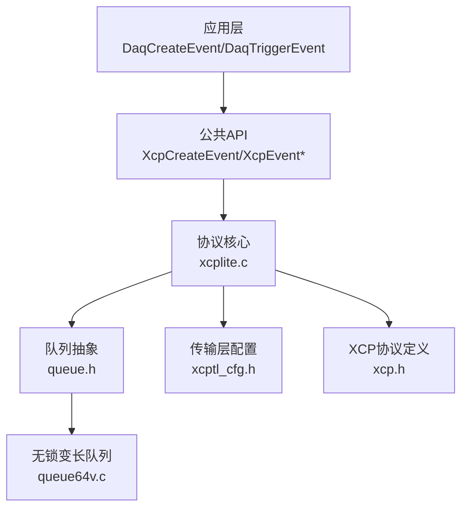
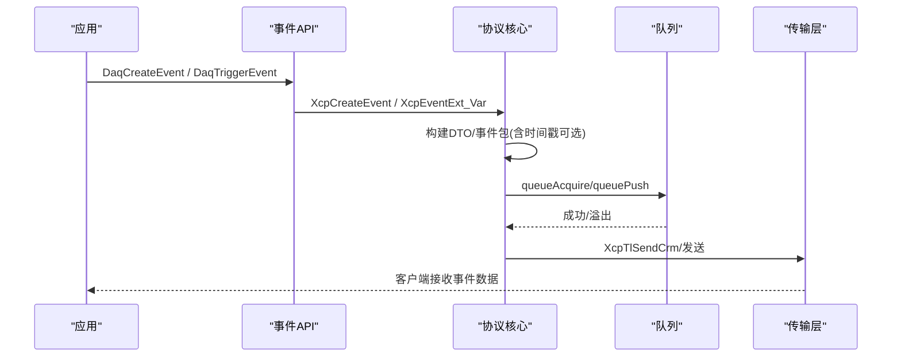
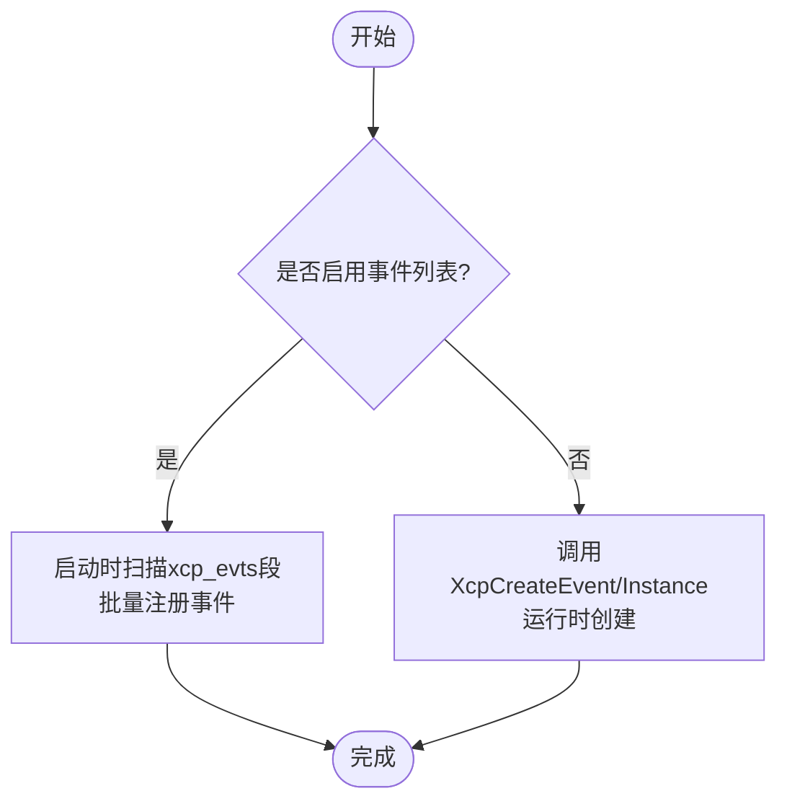
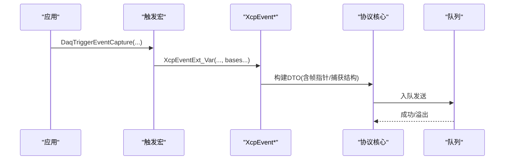
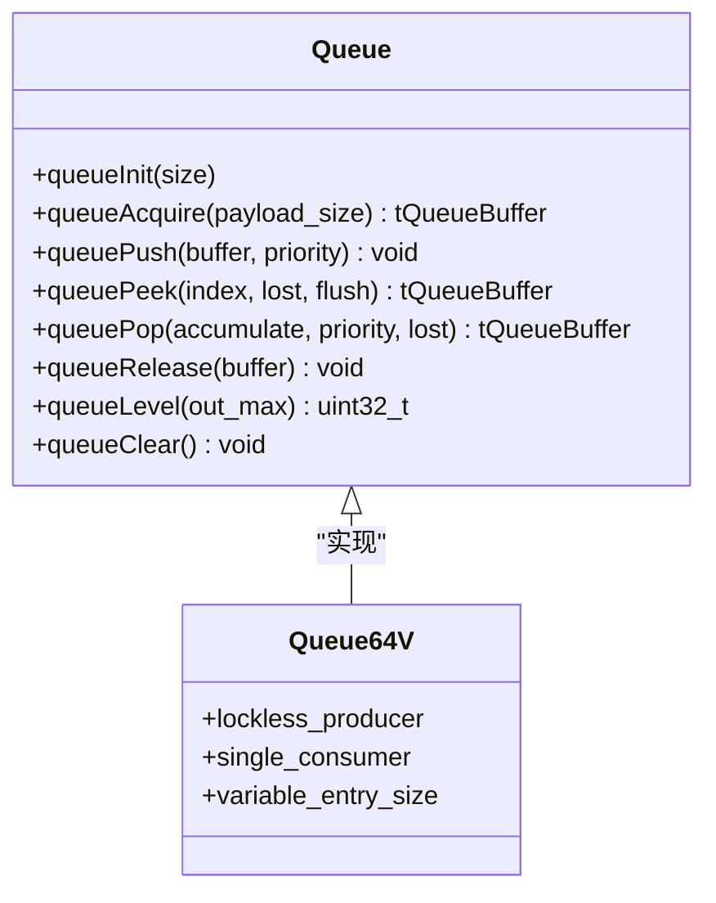
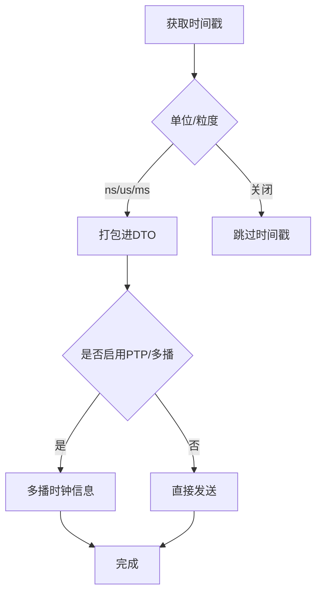
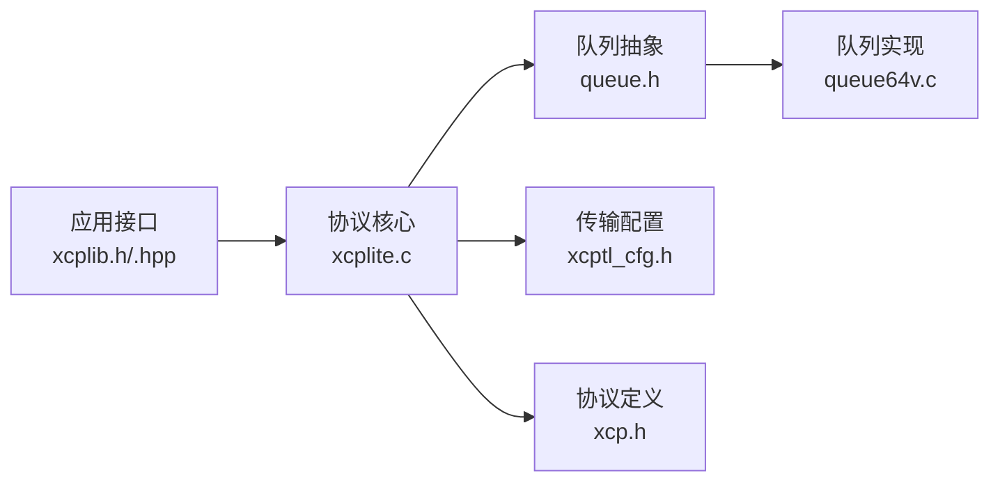

# DAQ事件系统

<cite>
**本文引用的文件**
- [xcplib.h](file://inc/xcplib.h)
- [xcplib.hpp](file://inc/xcplib.hpp)
- [xcp.h](file://src/xcp.h)
- [xcptl_cfg.h](file://src/xcptl_cfg.h)
- [queue.h](file://src/queue.h)
- [queue64v.c](file://src/queue64v.c)
- [xcplite.c](file://src/xcplite.c)
</cite>

## 目录
1. [简介](#简介)
2. [项目结构](#项目结构)
3. [核心组件](#核心组件)
4. [架构总览](#架构总览)
5. [详细组件分析](#详细组件分析)
6. [依赖关系分析](#依赖关系分析)
7. [性能考量](#性能考量)
8. [故障排除指南](#故障排除指南)
9. [结论](#结论)
10. [附录](#附录)

## 简介
本技术文档聚焦于XCPlite中的DAQ（数据采集）事件系统，系统性阐述事件驱动模型的设计与实现：事件的创建、注册、触发与管理流程；时间戳机制与数据同步方案；事件队列管理、内存分配策略与并发访问控制；以及面向高性能采集的调优与排障方法。文档兼顾初学者与高级开发者，提供从高层概念到代码级实现的完整视图。

## 项目结构
DAQ事件系统横跨应用接口层、协议层与传输/队列层：
- 应用接口层：提供事件创建、触发、启停等宏与API（C/C++），支持链接期预注册与运行时动态创建两种模式。
- 协议层：实现XCP协议命令处理、事件信息上报、DAQ列表管理与事件调度。
- 传输/队列层：基于无锁或互斥队列将事件数据低延迟地推送到传输层发送。

**图示来源**
- [xcplib.h:239-483](file://inc/xcplib.h#L239-L483)
- [xcplite.c:933-1000](file://src/xcplite.c#L933-L1000)
- [queue.h:1-187](file://src/queue.h#L1-L187)
- [xcptl_cfg.h:34-143](file://src/xcptl_cfg.h#L34-L143)
- [xcp.h:168-183](file://src/xcp.h#L168-L183)

**章节来源**
- [xcplib.h:239-483](file://inc/xcplib.h#L239-L483)
- [xcplite.c:3049-3281](file://src/xcplite.c#L3049-L3281)
- [queue.h:1-187](file://src/queue.h#L1-L187)
- [xcptl_cfg.h:34-143](file://src/xcptl_cfg.h#L34-L143)
- [xcp.h:168-183](file://src/xcp.h#L168-L183)

## 核心组件
- 事件描述符与注册
  - 通过链接期段（xcp_evts）或运行时API进行事件预注册与查找，支持多实例命名与优先级/周期配置。
- 事件触发
  - 提供多种触发API与宏，支持栈相对、绝对、相对地址扩展，以及带时间戳触发。
- 事件队列
  - 使用可配置的队列实现（64位无锁变长/固定大小，32位互斥累积），保证生产者侧线程安全与低延迟消费。
- 协议集成
  - 事件数据封装为XCP DTO/事件包，结合时间戳与DAQ列表模式，交由传输层发送。

**章节来源**
- [xcplib.h:314-483](file://inc/xcplib.h#L314-L483)
- [xcplite.c:933-1000](file://src/xcplite.c#L933-L1000)
- [xcplite.c:1775-1907](file://src/xcplite.c#L1775-L1907)
- [queue.h:101-187](file://src/queue.h#L101-L187)

## 架构总览
DAQ事件系统采用“事件驱动 + 队列缓冲 + 协议封装”的分层架构：
- 应用层通过宏或API创建并触发事件，捕获局部变量或指定基址。
- 协议层将事件转换为XCP事件包，必要时附加时间戳，入队至传输队列。
- 传输层按配置（UDP/TCP/Raw Ethernet）发送，支持多播时钟同步。

**图示来源**
- [xcplib.h:408-483](file://inc/xcplib.h#L408-L483)
- [xcplite.c:1775-1907](file://src/xcplite.c#L1775-L1907)
- [queue.h:122-187](file://src/queue.h#L122-L187)
- [xcptl_cfg.h:116-126](file://src/xcptl_cfg.h#L116-L126)

## 详细组件分析

### 事件创建与注册
- 链接期预注册
  - 通过tXcpEventDescriptor放入xcp_evts段，启动时扫描并批量注册，避免首次触发的开销。
- 运行时动态创建
  - 支持XcpCreateEvent与XcpCreateEventInstance，前者返回唯一ID，后者对同名生成实例索引。
- 线程安全
  - 事件列表访问使用互斥保护；静态once模式用于一次性查找/创建。

**图示来源**
- [xcplib.h:314-420](file://inc/xcplib.h#L314-L420)
- [xcplite.c:933-1000](file://src/xcplite.c#L933-L1000)
- [xcplite.c:3210-3281](file://src/xcplite.c#L3210-L3281)

**章节来源**
- [xcplib.h:314-420](file://inc/xcplib.h#L314-L420)
- [xcplite.c:933-1000](file://src/xcplite.c#L933-L1000)
- [xcplite.c:3210-3281](file://src/xcplite.c#L3210-L3281)

### 事件触发与数据捕获
- 触发方式
  - 支持绝对、栈相对、相对地址扩展；支持带时间戳触发。
- 局部变量捕获
  - 通过捕获结构体拷贝寄存器变量，避免强制volatile带来的性能损失。
- 基址传递
  - 通过多个base指针组合，灵活适配不同寻址模式。

**图示来源**
- [xcplib.h:570-757](file://inc/xcplib.h#L570-L757)
- [xcplite.c:1775-1907](file://src/xcplite.c#L1775-L1907)

**章节来源**
- [xcplib.h:570-757](file://inc/xcplib.h#L570-L757)
- [xcplite.c:1775-1907](file://src/xcplite.c#L1775-L1907)

### 事件队列与内存分配
- 队列实现选择
  - 64位平台优先使用无锁变长队列（queue64v.c），生产者线程安全、消费者单线程高效。
  - 32位/Windows使用互斥/临界区累积队列，支持消息聚合减少系统调用。
- 内存布局
  - 每个队列项包含用户负载与可选头部空间；对齐与最大尺寸由配置约束。
- 溢出处理
  - 队列满时记录丢包计数并告警，上层可据此调整采集频率或增大队列。

**图示来源**
- [queue.h:101-187](file://src/queue.h#L101-L187)
- [queue64v.c:1-200](file://src/queue64v.c#L1-L200)

**章节来源**
- [queue.h:101-187](file://src/queue.h#L101-L187)
- [queue64v.c:1-200](file://src/queue64v.c#L1-L200)

### 时间戳机制与数据同步
- 时间戳粒度与单位
  - 支持关闭、字节/字/双字时间戳，单位涵盖纳秒至秒。
- 服务器时钟与PTP
  - 可配置服务器时钟属性，支持PTP主时钟信息广播与多播时钟同步。
- 同步方案
  - 在事件触发时携带本地时间戳；在多设备场景可通过多播或PTP对齐。

**图示来源**
- [xcp.h:390-415](file://src/xcp.h#L390-L415)
- [xcptl_cfg.h:128-143](file://src/xcptl_cfg.h#L128-L143)
- [xcplite.c:3389-3433](file://src/xcplite.c#L3389-L3433)

**章节来源**
- [xcp.h:390-415](file://src/xcp.h#L390-L415)
- [xcptl_cfg.h:128-143](file://src/xcptl_cfg.h#L128-L143)
- [xcplite.c:3389-3433](file://src/xcplite.c#L3389-L3433)

### 并发访问控制
- 事件列表访问
  - 使用互斥保护事件列表插入/查找，确保多线程安全。
- 队列并发
  - 生产者侧无锁（64位）或临界区（32位），消费者单线程顺序释放，避免竞争。
- 尾部调用防护
  - 触发后使用禁止尾调用优化，确保栈帧有效，避免捕获数据失效。

**章节来源**
- [xcplib.h:282-301](file://inc/xcplib.h#L282-L301)
- [xcplib.h:533-545](file://inc/xcplib.h#L533-L545)
- [queue64v.c:15-34](file://src/queue64v.c#L15-L34)

## 依赖关系分析
- 模块耦合
  - 应用接口依赖协议核心；协议核心依赖队列抽象与传输配置；队列实现依赖平台原子能力。
- 外部依赖
  - 传输层支持UDP/TCP/Raw Ethernet；可选PTP多播；共享内存模式（SHM）下跨进程协作。
- 循环依赖
  - 通过头文件分层与内联宏避免循环引用；队列与协议层解耦。

**图示来源**
- [xcplib.h:239-483](file://inc/xcplib.h#L239-L483)
- [xcplite.c:933-1000](file://src/xcplite.c#L933-L1000)
- [queue.h:1-187](file://src/queue.h#L1-L187)
- [xcptl_cfg.h:34-143](file://src/xcptl_cfg.h#L34-L143)
- [xcp.h:168-183](file://src/xcp.h#L168-L183)

**章节来源**
- [xcplib.h:239-483](file://inc/xcplib.h#L239-L483)
- [xcplite.c:933-1000](file://src/xcplite.c#L933-L1000)
- [queue.h:1-187](file://src/queue.h#L1-L187)
- [xcptl_cfg.h:34-143](file://src/xcptl_cfg.h#L34-L143)
- [xcp.h:168-183](file://src/xcp.h#L168-L183)

## 性能考量
- 事件创建优化
  - 优先使用链接期预注册，避免首次触发时的查找与创建开销。
- 触发路径优化
  - 使用无锁队列（64位）减少锁竞争；合理设置队列大小与对齐，降低缓存抖动。
- 数据传输优化
  - 根据链路MTU与传输类型调整段大小；必要时启用消息累积以减少系统调用。
- 时间戳与同步
  - 在高精度需求场景启用纳秒级时间戳；多设备场景使用PTP或多播对齐。

[本节为通用指导，不直接分析具体文件]

## 故障排除指南
- 事件未生效
  - 检查事件是否已预注册或动态创建成功；确认事件ID非未定义值。
- 队列溢出
  - 观察丢包计数与告警日志；增大队列容量或降低采集频率。
- 时间戳异常
  - 校验时间戳单位与粒度配置；确认PTP/多播同步是否启用且正确。
- 触发无效
  - 确认函数未被内联导致栈帧问题；检查禁止尾调用优化是否正确放置。

**章节来源**
- [xcplite.c:3000-3009](file://src/xcplite.c#L3000-L3009)
- [xcplib.h:533-545](file://inc/xcplib.h#L533-L545)
- [queue64v.c:15-34](file://src/queue64v.c#L15-L34)

## 结论
DAQ事件系统通过链接期预注册与运行时动态创建相结合，提供了灵活高效的事件管理能力；无锁队列与合理的内存对齐保障了高吞吐低延迟的数据采集；时间戳与PTP/多播同步满足高精度与多设备协同需求。遵循本文的调优与排障建议，可构建稳定高效的采集系统。

[本节为总结性内容，不直接分析具体文件]

## 附录
- 常用宏与API速查
  - 事件创建：DaqCreateEvent、DaqCreateEventExt、XcpCreateEvent、XcpCreateEventInstance
  - 事件触发：XcpEvent、XcpEventExt、XcpEventAt、XcpEventExt_Var、XcpEventExtAt_Var
  - 事件启停：DaqEventEnable、DaqEventDisable、XcpEventEnable
  - 捕获局部变量：DaqTriggerEventCapture、DaqTriggerEventCaptureAt
- 配置要点
  - 队列参数：QUEUE_PAYLOAD_SIZE_ALIGNMENT、QUEUE_MAX_ENTRY_SIZE
  - 传输参数：XCPTL_MAX_DTO_SIZE、XCPTL_MAX_SEGMENT_SIZE、OPTION_MTU
  - 时间戳：DAQ_TIMESTAMP_* 单位与粒度

[本节为参考信息，不直接分析具体文件]