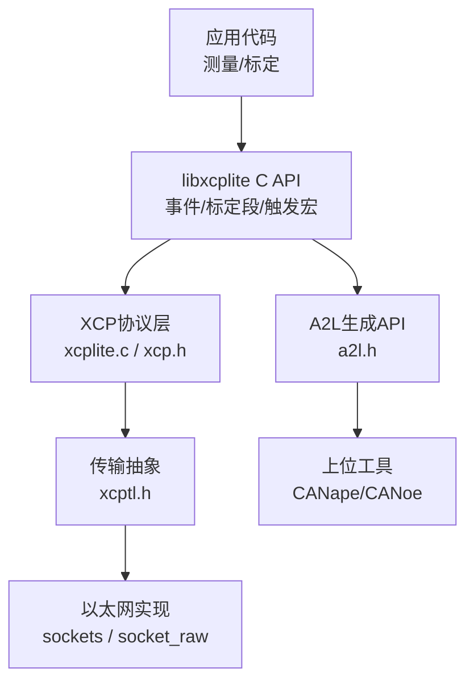
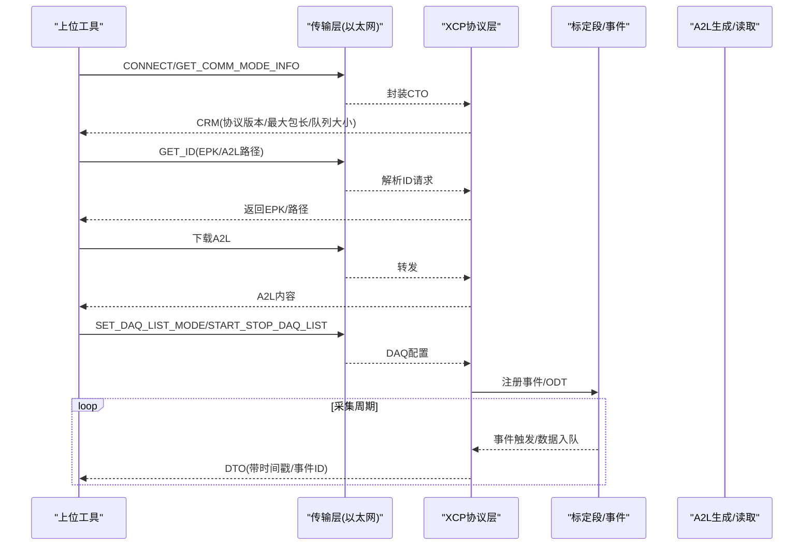
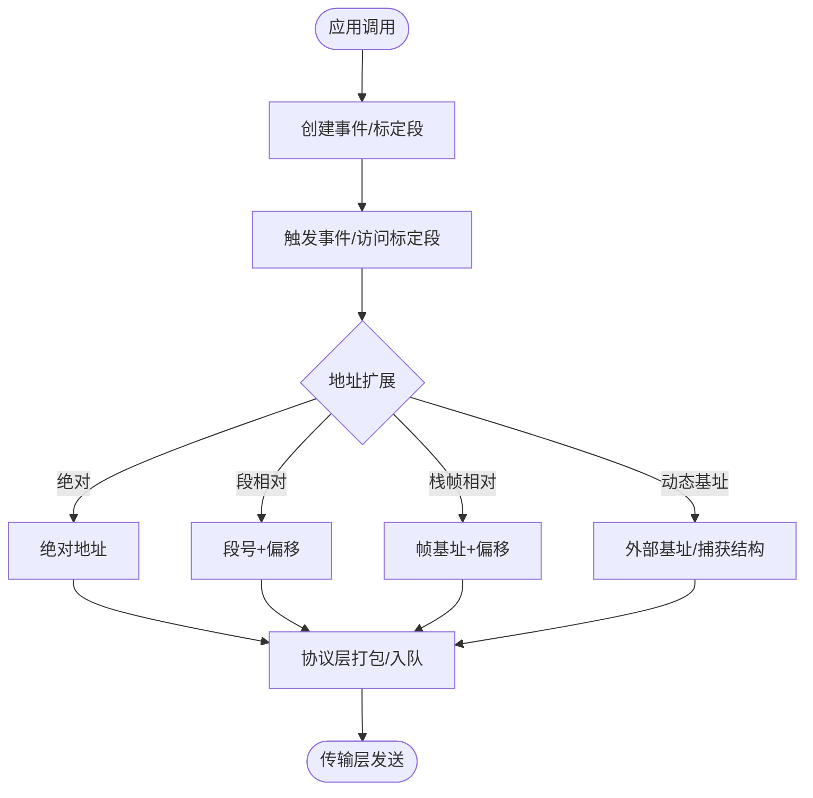
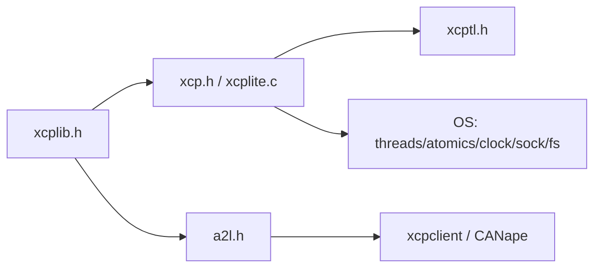

# XCP协议基础

<cite>
**本文引用的文件**
- [README.md](file://README.md)
- [XCP_INTRODUCTION.md](file://docs/XCP_INTRODUCTION.md)
- [TECHNICAL.md](file://docs/TECHNICAL.md)
- [OFFLINE_A2L.md](file://docs/OFFLINE_A2L.md)
- [xcplib.h](file://inc/xcplib.h)
- [a2l.h](file://inc/a2l.h)
- [xcp.h](file://src/xcp.h)
- [xcptl.h](file://src/xcptl.h)
- [xcplite.c](file://src/xcplite.c)
</cite>

## 目录
1. [简介](#简介)
2. [项目结构](#项目结构)
3. [核心组件](#核心组件)
4. [架构总览](#架构总览)
5. [详细组件分析](#详细组件分析)
6. [依赖关系分析](#依赖关系分析)
7. [性能考量](#性能考量)
8. [故障排查指南](#故障排查指南)
9. [结论](#结论)
10. [附录](#附录)

## 简介
XCP（通用测量与校准协议）是汽车电子中广泛采用的ASAM标准，用于对ECU进行实时信号采集（测量/记录）和参数标定（校准）。它通过描述文件A2L将目标系统中的测量变量、标定参数、数据类型与元信息暴露给上位工具（如CANape/CANoe），并基于多种传输层（以太网、CAN等）完成数据交换。XCPlite在保持XCP兼容性的同时，面向现代多核微处理器与RTOS，提供线程安全、无锁、低开销的测量与标定能力，并支持运行时或离线生成A2L。

- XCP是什么：ASAM标准的测量与标定协议，提供实时数据采集与参数修改能力。
- A2L的作用：以人类可读的ASCII格式描述ECU中的测量点、标定段、数据类型、单位、限值、转换规则及XCP配置，供工具识别与使用。
- 传输层：XCP标准定义协议与传输层；常见包括CAN、CAN-FD、FlexRay、SPI、以太网等。XCPlite专注于XCP on Ethernet（TCP/UDP）。
- 开发者视角：可将XCP视为高频应用级追踪方案，事件可动态启停与重配，未配置项不占用带宽与资源，上下文一致且时间戳精确。

**章节来源**
- [XCP_INTRODUCTION.md:3-24](file://docs/XCP_INTRODUCTION.md#L3-L24)
- [README.md:3-28](file://README.md#L3-L28)

## 项目结构
本仓库围绕“协议层 + 传输抽象 + A2L生成 + 示例与工具”组织：
- 协议层与API：src/xcp.h 定义命令、响应、事件码、状态位等；inc/xcplib.h 提供应用侧API（事件、标定段、触发宏、地址扩展等）。
- 传输抽象：src/xcptl.h 抽象发送队列、等待空队列、发送CRM等；具体以太实现位于src/sockets.c、src/socket_raw.c等。
- 协议实现：src/xcplite.c 实现XCP协议层V1.4，包含状态机、DAQ/PAG/PGM等处理。
- A2L相关：inc/a2l.h 提供A2L生成API与类型检测；docs/OFFLINE_A2L.md 说明离线A2L生成流程与ELF/DWARF标记约定。
- 文档与示例：docs/* 提供技术细节与入门指引；examples/* 展示不同平台与特性用法。

**图示来源**
- [xcplite.c:1-47](file://src/xcplite.c#L1-L47)
- [xcp.h:18-138](file://src/xcp.h#L18-L138)
- [xcptl.h:19-26](file://src/xcptl.h#L19-L26)
- [a2l.h:19-47](file://inc/a2l.h#L19-L47)

**章节来源**
- [README.md:9-28](file://README.md#L9-L28)
- [TECHNICAL.md:5-27](file://docs/TECHNICAL.md#L5-L27)

## 核心组件
- XCP协议层（xcp.h, xcplite.c）
  - 命令集：连接/断开、获取通信模式、上传/下载、校验和、页切换、DAQ/STIM、PGM等。
  - 事件与错误码：EV_*、CRC_*、服务请求等。
  - 状态与资源掩码：会话状态、资源占用、通信粒度等。
- 应用API（inc/xcplib.h）
  - 事件创建/触发：DaqCreateEvent*、DaqTriggerEvent*、捕获局部变量等。
  - 标定段管理：XcpCreateCalSeg/Blk、锁定/解锁、冻结/持久化。
  - 地址扩展：绝对、校准段相对、栈帧相对、动态基址等。
- 传输抽象（src/xcptl.h）
  - 发送队列处理、等待队列空、发送CRM、计数器获取。
- A2L生成（inc/a2l.h, docs/OFFLINE_A2L.md）
  - 运行时/离线生成A2L，类型推断，复杂结构支持，元数据标注。

**章节来源**
- [xcp.h:18-138](file://src/xcp.h#L18-L138)
- [xcplib.h:39-139](file://inc/xcplib.h#L39-L139)
- [xcptl.h:19-26](file://src/xcptl.h#L19-L26)
- [a2l.h:19-47](file://inc/a2l.h#L19-L47)

## 架构总览
XCPlite采用分层设计：应用通过libxcplite API注册事件与标定段，协议层按XCP V1.4处理命令与消息，传输层负责报文收发。A2L可在目标运行时生成或通过xcpclient从ELF离线生成，供上位工具解析。

**图示来源**
- [xcp.h:18-138](file://src/xcp.h#L18-L138)
- [xcptl.h:19-26](file://src/xcptl.h#L19-L26)
- [xcplib.h:39-139](file://inc/xcplib.h#L39-L139)
- [OFFLINE_A2L.md:35-67](file://docs/OFFLINE_A2L.md#L35-L67)

## 详细组件分析

### XCP协议层与消息类型
- 命令分类
  - 标准命令：CONNECT/DISCONNECT/GET_STATUS/SYNCH/GET_COMM_MODE_INFO/GET_ID/SET_REQUEST/GET_SEED/UNLOCK/SET_MTA/UPLOAD/SHORT_UPLOAD/BUILD_CHECKSUM/TRANSPORT_LAYER_CMD/USER_CMD
  - 标定命令：DOWNLOAD/DOWNLOAD_NEXT/DOWNLOAD_MAX/SHORT_DOWNLOAD/MODIFY_BITS
  - 页切换：SET_CAL_PAGE/GET_CAL_PAGE/GET_PAG_PROCESSOR_INFO/GET_SEGMENT_INFO/GET_PAGE_INFO/SET_SEGMENT_MODE/GET_SEGMENT_MODE/COPY_CAL_PAGE
  - DAQ/STIM：CLEAR_DAQ_LIST/SET_DAQ_PTR/WRITE_DAQ/SET_DAQ_LIST_MODE/GET_DAQ_LIST_MODE/START_STOP_DAQ_LIST/START_STOP_SYNCH/GET_DAQ_CLOCK/READ_DAQ/GET_DAQ_PROCESSOR_INFO/GET_DAQ_RESOLUTION_INFO/GET_DAQ_LIST_INFO/GET_DAQ_EVENT_INFO/FREE_DAQ/ALLOC_DAQ/ALLOC_ODT/ALLOC_ODT_ENTRY
  - PGM：PROGRAM_START/PROGRAM_CLEAR/PROGRAM/PROGRAM_RESET/GET_PGM_PROCESSOR_INFO/GET_SECTOR_INFO/PROGRAM_PREPARE/PROGRAM_FORMAT/PROGRAM_NEXT/PROGRAM_MAX/PROGRAM_VERIFY
  - 扩展：WRITE_DAQ_MULTIPLE、TIME_CORRELATION_PROPERTIES、DTO_CTR_PROPERTIES、LEVEL_1_COMMAND等
- 数据包标识：RES/ERR/EV/SERV
- 错误码：CRC_*系列
- 事件码：EVC_*系列
- 服务请求：SERV_*

这些定义构成了XCP协议的消息骨架，上层据此实现状态机与数据处理。

**章节来源**
- [xcp.h:18-138](file://src/xcp.h#L18-L138)
- [xcp.h:139-184](file://src/xcp.h#L139-L184)
- [xcp.h:185-465](file://src/xcp.h#L185-L465)

### 应用API：事件与标定段
- 事件
  - 创建：XcpCreateEvent/XcpCreateEventInstance，或宏DaqCreateEvent/DaqCreateEventExt/DaqCreateAndTriggerEvent
  - 触发：XcpEvent/XcpEventAt/XcpEventExt/XcpEventExt_Var，以及便捷宏DaqTriggerEvent*/DaqTriggerEventCapture*
  - 启用/禁用：XcpEventEnable，宏DaqEventEnable/DaqEventDisable
- 标定段
  - 创建：XcpCreateCalSeg（含MEMORY_SEGMENT）、XcpCreateCalBlk（无MEMORY_SEGMENT）
  - 访问：XcpLockCalSeg/XcpUnlockCalSeg，原子、无锁、线程安全
  - 持久化：XcpFreeze/XcpBinWrite
- 地址扩展
  - 绝对、校准段相对、栈帧相对、动态基址（捕获/指针）
  - 通过AddrExt字段区分，配合A2L与工具正确解码

**图示来源**
- [xcplib.h:39-139](file://inc/xcplib.h#L39-L139)
- [xcplib.h:239-480](file://inc/xcplib.h#L239-L480)
- [xcplib.h:547-757](file://inc/xcplib.h#L547-L757)

**章节来源**
- [xcplib.h:39-139](file://inc/xcplib.h#L39-L139)
- [xcplib.h:239-480](file://inc/xcplib.h#L239-L480)
- [xcplib.h:547-757](file://inc/xcplib.h#L547-L757)

### A2L与ASAM关系
- ASAM标准：XCP为ASAM标准；A2L为ASAM-2 MCD-2 MC描述文件格式。
- A2L作用：描述测量/标定对象、数据类型、单位、限值、转换、XCP配置等，供工具识别与交互。
- 生成方式：
  - 运行时生成：目标端写入文件系统，客户端下载。
  - 离线生成：xcpclient从ELF/DWARF提取标记与类型信息，生成完整A2L。
- 关键约定：xcp_evts、xcp_cals、xcp_epk、xcp_meta等ELF段与锚点变量命名规范，确保工具能稳定解析。

**章节来源**
- [XCP_INTRODUCTION.md:9-16](file://docs/XCP_INTRODUCTION.md#L9-L16)
- [OFFLINE_A2L.md:1-34](file://docs/OFFLINE_A2L.md#L1-L34)
- [OFFLINE_A2L.md:96-117](file://docs/OFFLINE_A2L.md#L96-L117)
- [a2l.h:19-47](file://inc/a2l.h#L19-L47)

### 传输层与历史演进
- 传输层：XCP标准定义协议与传输层；常见包括CAN、CAN-FD、FlexRay、SPI、以太网。
- XCPlite聚焦XCP on Ethernet（TCP/UDP），通过socket_raw/sockets实现。
- 历史与兼容性：XCPlite实现XCP V1.4，兼容主流工具（CANape 23+），并提供多平台与多语言支持。

**章节来源**
- [XCP_INTRODUCTION.md:21-24](file://docs/XCP_INTRODUCTION.md#L21-L24)
- [README.md:38-41](file://README.md#L38-L41)
- [xcptl.h:19-26](file://src/xcptl.h#L19-L26)

## 依赖关系分析
- 模块耦合
  - 应用API（xcplib.h）依赖协议层（xcp.h）与传输抽象（xcptl.h）。
  - 协议层（xcplite.c）依赖xcp.h、xcptl.h，可选依赖cal/persistence/shm等。
  - A2L生成（a2l.h）与工具链（xcpclient）通过ELF/DWARF标记解耦。
- 外部依赖
  - 操作系统：线程、原子、时钟、套接字、文件系统（A2L持久化）。
  - 工具：CANape/CANoe等符合ASAM的工具。

**图示来源**
- [xcplib.h:39-139](file://inc/xcplib.h#L39-L139)
- [xcp.h:18-138](file://src/xcp.h#L18-L138)
- [xcptl.h:19-26](file://src/xcptl.h#L19-L26)
- [a2l.h:19-47](file://inc/a2l.h#L19-L47)

**章节来源**
- [xcplite.c:49-89](file://src/xcplite.c#L49-L89)
- [TECHNICAL.md:356-394](file://docs/TECHNICAL.md#L356-L394)

## 性能考量
- 资源消耗
  - 静态内存：约10KB（DAQ表、标定段页等）。
  - 堆内存：约32KB（传输队列，可配置）。
  - 栈内存：每线程约1KB（收发线程）。
- 触发与传输
  - 生产者侧无锁实现，避免阻塞与竞争；必要时可切换为互斥实现。
  - 事件查找可能首次延迟（名称到句柄缓存于静态/线程本地存储）。
- 标定段访问
  - 线程安全且无锁；创建过程可能使用互斥。
- 时间戳
  - 支持高精度PTP时间戳；DAQ时间戳源可配置。
- 优化建议
  - 合理设置传输队列大小，覆盖峰值流量（至少10ms）。
  - 使用捕获结构减少寄存器变量不可测问题。
  - 避免内联函数中使用栈帧相对测量（需XCP_NOINLINE）。

**章节来源**
- [TECHNICAL.md:5-27](file://docs/TECHNICAL.md#L5-L27)
- [TECHNICAL.md:28-53](file://docs/TECHNICAL.md#L28-L53)
- [TECHNICAL.md:356-394](file://docs/TECHNICAL.md#L356-L394)

## 故障排查指南
- 常见问题
  - 变量未出现在A2L：检查是否volatile或使用捕获；确认事件锚点与作用域。
  - EPK不匹配：确保A2L与目标固件版本一致，或通过GET_ID(EPK)校验。
  - 工具兼容：某些CANape行为差异（如COPY_CAL_PAGE、GET_ID模式、地址扩展忽略等），参考已知问题与变通方案。
- 诊断要点
  - 查看xcpclient日志与警告；确认ELF调试信息完整。
  - 核对地址扩展与寻址模式（CASDD/ACSDD/AXSDD/CXSDD）。
  - 检查传输队列与超时设置，避免丢包或拥塞。

**章节来源**
- [OFFLINE_A2L.md:244-269](file://docs/OFFLINE_A2L.md#L244-L269)
- [TECHNICAL.md:396-412](file://docs/TECHNICAL.md#L396-L412)

## 结论
XCPlite在保持XCP V1.4兼容性的基础上，面向现代多核系统与RTOS提供了高效、线程安全、低开销的测量与标定能力。通过A2L（运行时/离线）与丰富的API，开发者可以灵活地定义事件、标定段与元数据，并与主流工具无缝集成。理解XCP协议层次、消息类型、地址扩展与A2L约定，是正确使用与优化系统的关键。

## 附录
- 快速开始
  - 示例：hello_xcp、hello_xcp_cpp、no_a2l_demo等。
  - 构建：CMake；详见docs/BUILDING.md。
- 学习资源
  - Vector XCP Book、VectorAcademy E-Learning。
- 其他实现
  - XCPbasic（免费，适合小MCU，CAN优化）、XCPprof（商业产品）。

**章节来源**
- [README.md:53-76](file://README.md#L53-L76)
- [XCP_INTRODUCTION.md:25-41](file://docs/XCP_INTRODUCTION.md#L25-L41)