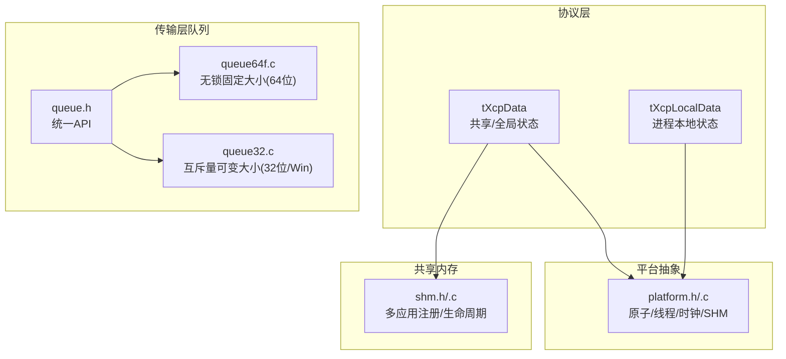
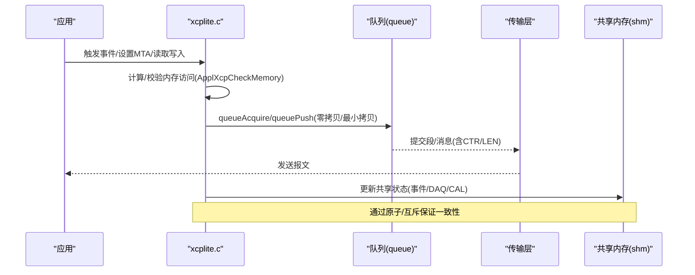
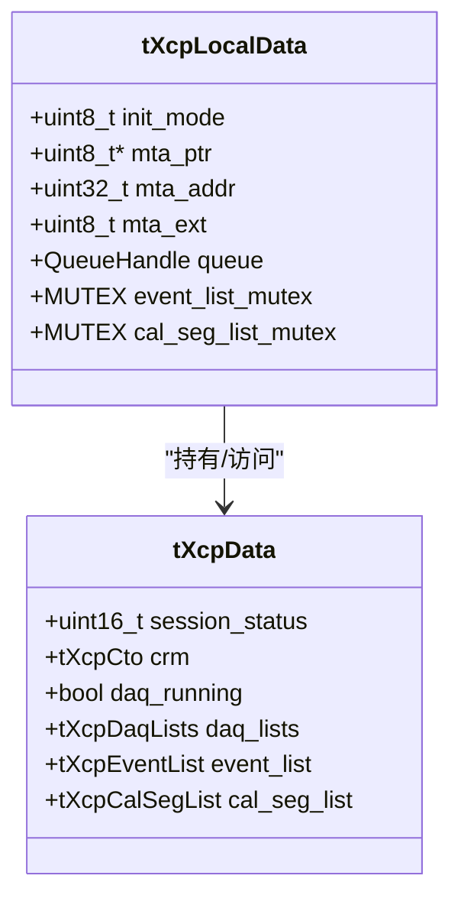
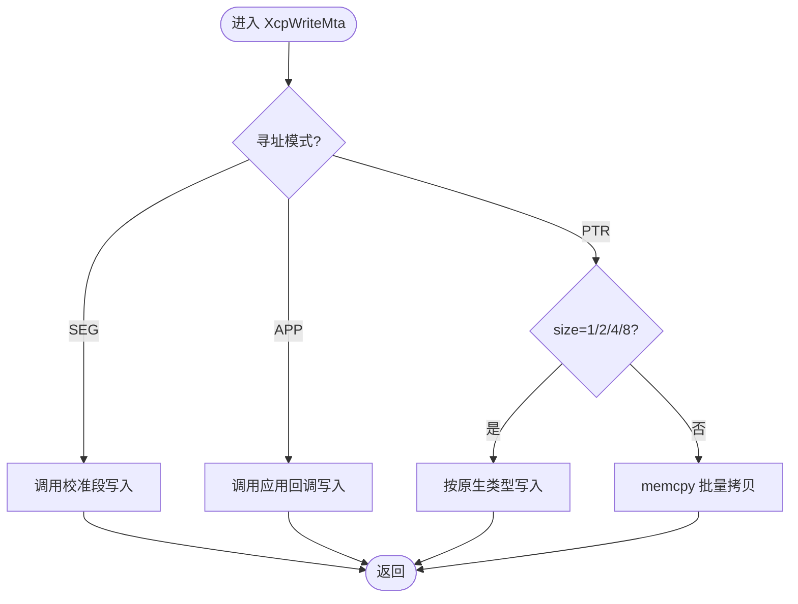
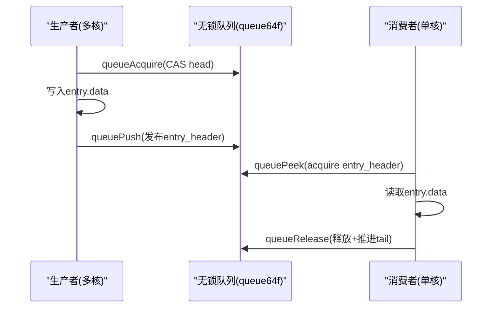
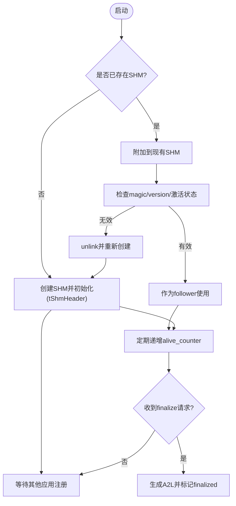
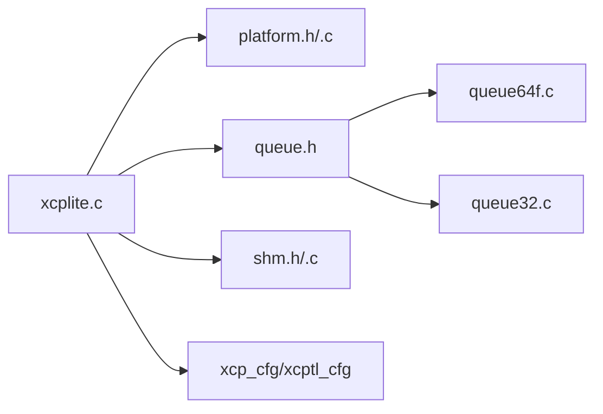

# 内存管理策略

<cite>
**本文引用的文件**
- [src/xcplite.h](file://src/xcplite.h)
- [src/xcplite.c](file://src/xcplite.c)
- [src/platform.h](file://src/platform.h)
- [src/platform.c](file://src/platform.c)
- [src/shm.h](file://src/shm.h)
- [src/shm.c](file://src/shm.c)
- [src/queue.h](file://src/queue.h)
- [src/queue32.c](file://src/queue32.c)
- [src/queue64f.c](file://src/queue64f.c)
</cite>

## 目录
1. [简介](#简介)
2. [项目结构](#项目结构)
3. [核心组件](#核心组件)
4. [架构总览](#架构总览)
5. [详细组件分析](#详细组件分析)
6. [依赖关系分析](#依赖关系分析)
7. [性能考量](#性能考量)
8. [故障排查指南](#故障排查指南)
9. [结论](#结论)
10. [附录](#附录)

## 简介
本技术文档聚焦于 XCPlite 的内存管理策略，系统性阐述静态与动态内存分配、共享内存（跨进程）状态布局、队列缓冲与零拷贝路径、内存对齐与缓存优化、多线程同步与原子操作、以及泄漏防护与性能监控方法。目标是帮助开发者在嵌入式与通用操作系统环境中构建高效、可预测且健壮的内存管理系统。

## 项目结构
XCPlite 将协议层状态分为“全局/共享状态”和“进程本地状态”，并通过平台抽象提供原子、线程、时钟、共享内存等能力；传输层使用多种队列实现以适配不同平台与性能需求。

图表来源
- [src/xcplite.h:385-495](file://src/xcplite.h#L385-L495)
- [src/platform.h:268-298](file://src/platform.h#L268-L298)
- [src/queue.h:101-187](file://src/queue.h#L101-L187)
- [src/shm.h:65-124](file://src/shm.h#L65-L124)

章节来源
- [src/xcplite.h:385-495](file://src/xcplite.h#L385-L495)
- [src/platform.h:268-298](file://src/platform.h#L268-L298)
- [src/queue.h:101-187](file://src/queue.h#L101-L187)
- [src/shm.h:65-124](file://src/shm.h#L65-L124)

## 核心组件
- 共享/全局状态 tXcpData：包含会话状态、响应缓冲区、DAQ列表、事件列表、校准段列表等，可在共享内存中由多进程访问。
- 进程本地状态 tXcpLocalData：保存初始化模式、MTA指针/地址、队列句柄、局部互斥量、时钟信息等，不放入共享内存。
- 平台抽象：提供原子、线程、时钟、共享内存映射、互斥量等。
- 队列子系统：提供固定大小无锁队列（64位）与互斥量队列（32位/Windows），支持零拷贝或最小拷贝的数据面。
- 共享内存管理：多应用注册表、存活计数、A2L最终化协调、主从角色协商。

章节来源
- [src/xcplite.h:385-495](file://src/xcplite.h#L385-L495)
- [src/platform.h:268-298](file://src/platform.h#L268-L298)
- [src/queue.h:101-187](file://src/queue.h#L101-L187)
- [src/shm.h:65-124](file://src/shm.h#L65-L124)

## 架构总览
下图展示内存与数据流的关键路径：命令处理与响应缓冲、DAQ采集与队列发送、共享内存中的多进程状态协作。

图表来源
- [src/xcplite.c:508-608](file://src/xcplite.c#L508-L608)
- [src/queue32.c:207-304](file://src/queue32.c#L207-L304)
- [src/queue64f.c:399-519](file://src/queue64f.c#L399-L519)
- [src/shm.c:162-215](file://src/shm.c#L162-L215)

## 详细组件分析

### 共享/全局状态与内存布局
- tXcpData 作为单例状态，支持驻留在共享内存（OPTION_SHM_MODE）或进程内静态/堆内存。字段设计避免跨进程指针，采用偏移/索引。
- tXcpLocalData 为进程本地，包含队列句柄、MTA指针、局部互斥量等。
- 关键缓冲区：
  - tXcpCto crm：响应消息缓冲，按配置对齐到8字节，减少跨总线/网络打包开销。
  - DAQ列表数组：tXcpDaqLists 使用紧凑布局与对齐，支持 ODT/Entry 地址与尺寸表复用同一块线性内存，降低碎片与拷贝。

图表来源
- [src/xcplite.h:385-495](file://src/xcplite.h#L385-L495)

章节来源
- [src/xcplite.h:385-495](file://src/xcplite.h#L385-L495)

### 静态与动态内存分配
- 静态分配：
  - tXcpData 在非 SHM 模式下为静态实例 gXcpData，避免运行时分配与碎片。
  - 事件描述符通过链接器节（xcp_evts）静态注册，减少运行期分配。
- 动态分配：
  - 队列缓冲在初始化时按需分配（queueInit/queueInitFromMemory），支持用户提供的内存区域（便于放入共享内存）。
  - 共享内存通过 platformShmOpen 使用 mmap/VirtualAlloc 创建并映射，支持 leader/follower 协作。

章节来源
- [src/xcplite.c:188-194](file://src/xcplite.c#L188-L194)
- [src/xcplite.h:139-177](file://src/xcplite.h#L139-L177)
- [src/queue.h:101-114](file://src/queue.h#L101-L114)
- [src/platform.c:167-187](file://src/platform.c#L167-L187)
- [src/platform.c:201-319](file://src/platform.c#L201-L319)

### 零拷贝与最小拷贝路径
- 队列零拷贝：
  - 64位无锁队列（queue64f.c）：生产者直接写入 entry.data，消费者通过 queuePeek 获取同一块内存，避免复制。
  - 32位/Windows 队列（queue32.c）：累积多个消息到一个 segment，消费者直接遍历 segment 内的消息头与载荷，仅填充必要的传输层计数器。
- MTA 写路径：
  - 针对 1/2/4/8 字节采用原生类型写入，避免逐字节 memcpy，提升吞吐并减少中间缓冲。

图表来源
- [src/xcplite.c:508-565](file://src/xcplite.c#L508-L565)
- [src/queue64f.c:399-519](file://src/queue64f.c#L399-L519)
- [src/queue32.c:207-304](file://src/queue32.c#L207-L304)

章节来源
- [src/xcplite.c:508-565](file://src/xcplite.c#L508-L565)
- [src/queue64f.c:399-519](file://src/queue64f.c#L399-L519)
- [src/queue32.c:207-304](file://src/queue32.c#L207-L304)

### 内存对齐与缓存优化
- 对齐要求：
  - tXcpCto 强制对齐至 8 字节，确保响应缓冲与后续打包对齐。
  - 队列 payload 对齐到配置的 QUEUE_PAYLOAD_SIZE_ALIGNMENT，避免跨总线/网络分片带来的额外拷贝。
  - 32位队列中 tXcpMessage 头为 WORD 字段，要求包对齐为偶数。
- 缓存友好：
  - 队列头部与共享内存控制区按缓存行（通常 64B）对齐，减少伪共享。
  - 无锁队列 entry_header 与 head/tail 分离在不同缓存行，降低竞争抖动。

章节来源
- [src/xcplite.h:114-120](file://src/xcplite.h#L114-L120)
- [src/queue.h:66-82](file://src/queue.h#L66-L82)
- [src/queue32.c:54-83](file://src/queue32.c#L54-L83)
- [src/queue64f.c:77-93](file://src/queue64f.c#L77-L93)
- [src/shm.h:67-81](file://src/shm.h#L67-L81)

### 多线程同步、原子与锁-free
- 原子操作：
  - 事件计数、DAQ运行标志、共享内存 app_count、alive_counter 等使用 C11 原子或平台模拟（Windows 下 Interlocked）。
  - 无锁队列使用 CAS 与 acquire/release 语义保证可见性与顺序。
- 互斥量：
  - 事件列表与校准段列表创建时使用进程本地互斥量保护。
  - 32位队列使用互斥量保护 segment 写入与消费。
- 所有权模型：
  - 非 SHM 模式：gXcpData 为进程内静态对象，读写受限于调用上下文。
  - SHM 模式：gXcpData 指向共享内存，所有跨进程字段必须安全并发访问。

图表来源
- [src/queue64f.c:430-519](file://src/queue64f.c#L430-L519)
- [src/platform.h:520-672](file://src/platform.h#L520-L672)

章节来源
- [src/xcplite.c:779-797](file://src/xcplite.c#L779-L797)
- [src/platform.h:520-672](file://src/platform.h#L520-L672)
- [src/queue64f.c:430-519](file://src/queue64f.c#L430-L519)

### 共享内存与多进程协作
- 共享内存布局：
  - tShmHeader 控制区（首 64B，单缓存行）存放 magic/version/leader_pid/app_count/a2l 标志等。
  - 应用列表 tApp 每项 512B，记录 project_name/epk/pid/角色/存活计数/A2L文件名等。
- 生命周期：
  - 首个进程成为 leader，创建并零初始化共享内存；follower 附加并等待激活。
  - 通过 alive_counter 检测僵尸进程，必要时回收槽位。
- A2L 最终化：
  - server 请求 finalize，各应用完成 A2L 生成后标记 a2l_finalized，leader 收集并合并。

图表来源
- [src/shm.c:69-80](file://src/shm.c#L69-L80)
- [src/shm.c:162-215](file://src/shm.c#L162-L215)
- [src/shm.c:283-369](file://src/shm.c#L283-L369)
- [src/shm.c:433-517](file://src/shm.c#L433-L517)

章节来源
- [src/shm.h:65-124](file://src/shm.h#L65-L124)
- [src/shm.c:69-80](file://src/shm.c#L69-L80)
- [src/shm.c:162-215](file://src/shm.c#L162-L215)
- [src/shm.c:283-369](file://src/shm.c#L283-L369)
- [src/shm.c:433-517](file://src/shm.c#L433-L517)

### 内存泄漏防护与健壮性
- 边界检查与断言：
  - 队列参数对齐与上限编译期检查，防止越界与未定义行为。
  - 队列 entry 状态机严格校验（保留/已提交/已释放），异常时断言。
- 资源清理：
  - 队列 deinit 释放内部缓冲并销毁互斥量。
  - 共享内存关闭时 unlink 名称，避免残留对象。
- 版本兼容：
  - SHM 通过 magic/version 校验，发现不匹配则拒绝或重建，避免旧二进制污染新实例。

章节来源
- [src/queue.h:66-82](file://src/queue.h#L66-L82)
- [src/queue32.c:146-200](file://src/queue32.c#L146-L200)
- [src/queue64f.c:360-391](file://src/queue64f.c#L360-L391)
- [src/platform.c:344-360](file://src/platform.c#L344-L360)
- [src/shm.c:162-215](file://src/shm.c#L162-L215)

## 依赖关系分析
- xcplite.c 依赖：
  - platform.h/.c：原子、线程、时钟、共享内存。
  - queue.h/.c：传输队列 API 与具体实现。
  - shm.h/.c：共享内存多进程管理。
  - xcp_cfg/xcptl_cfg：协议与传输层配置常量（如最大 DTO/CTO、对齐）。
- 队列实现选择：
  - 64位 POSIX：优先 queue64f.c（无锁、固定大小）。
  - 32位/Windows：queue32.c（互斥量、可变大小、消息累积）。

图表来源
- [src/xcplite.c:49-85](file://src/xcplite.c#L49-L85)
- [src/queue.h:10-23](file://src/queue.h#L10-L23)

章节来源
- [src/xcplite.c:49-85](file://src/xcplite.c#L49-L85)
- [src/queue.h:10-23](file://src/queue.h#L10-L23)

## 性能考量
- 队列选择建议：
  - 高吞吐低延迟场景（64位POSIX）：使用 queue64f.c 无锁路径，减少锁竞争与上下文切换。
  - 32位/Windows：使用 queue32.c，利用消息累积减少系统调用次数。
- 对齐与缓存：
  - 保持 packet alignment 为 2/4/8 的幂次，避免跨缓存行与总线分片。
  - 将频繁读写的头信息（如 tShmHeader 控制区）置于独立缓存行。
- 零拷贝优先：
  - 尽量使用 queuePeek 直接消费，避免二次拷贝。
  - MTA 写路径优先使用原生类型写入。
- 监控指标：
  - 启用 TEST_ENABLE_DBG_METRICS 统计 TX/RX 包数、事件计数、待处理写入数等。
  - 队列丢包计数 packets_lost 用于评估拥塞与容量规划。

章节来源
- [src/xcplite.h:637-652](file://src/xcplite.h#L637-L652)
- [src/queue64f.c:430-519](file://src/queue64f.c#L430-L519)
- [src/queue32.c:207-304](file://src/queue32.c#L207-L304)

## 故障排查指南
- 常见问题定位：
  - 队列溢出：检查 queueLevel 与 packets_lost，增大队列容量或降低生产速率。
  - 共享内存不一致：核对 magic/version，必要时清理残留对象（tools/shm_cleanup.sh）。
  - 僵尸应用：检查 alive_counter 与 kill 探测结果，必要时手动重置槽位。
- 调试工具：
  - XcpShmDebugPrint 输出 SHM 头与应用列表状态。
  - 日志级别 XcpSetLogLevel 调整输出粒度。
  - 队列测试示例（queue_test）验证并发与性能。

章节来源
- [src/shm.c:221-277](file://src/shm.c#L221-L277)
- [src/xcplite.c:349-374](file://src/xcplite.c#L349-L374)
- [src/platform.c:344-360](file://src/platform.c#L344-L360)

## 结论
XCPlite 通过清晰的内存分层（共享/本地）、严格的对齐与缓存友好布局、以及针对不同平台的队列实现（无锁/互斥量），实现了高效、可扩展且健壮的内存管理。结合共享内存的多进程协作机制与完善的监控/诊断接口，开发者可以在多种目标平台上构建高性能的 XCP 数据采集与标定系统。

## 附录
- 配置要点：
  - 合理设置 XCP_DAQ_MEM_SIZE、XCPTL_MAX_DTO_SIZE、QUEUE_PAYLOAD_SIZE_ALIGNMENT。
  - 根据平台选择队列实现（64位 POSIX 优先无锁队列）。
- 最佳实践：
  - 优先使用零拷贝路径，减少中间缓冲。
  - 对共享内存进行版本与完整性校验，避免脏数据。
  - 定期监控队列占用与丢包率，及时扩容或限流。