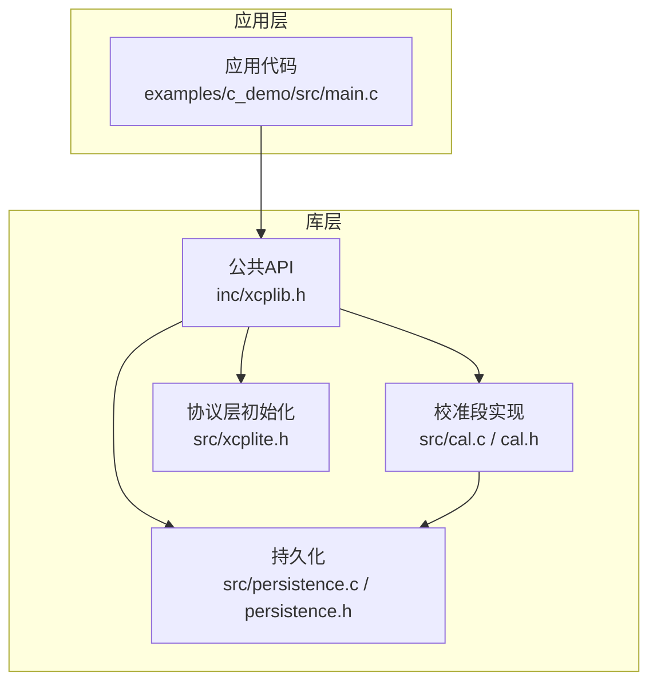
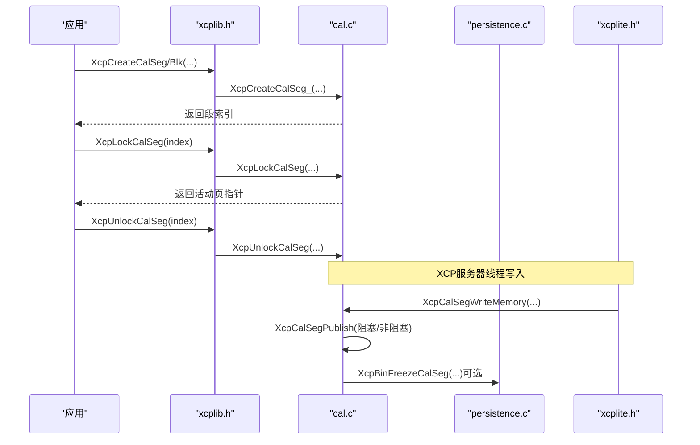
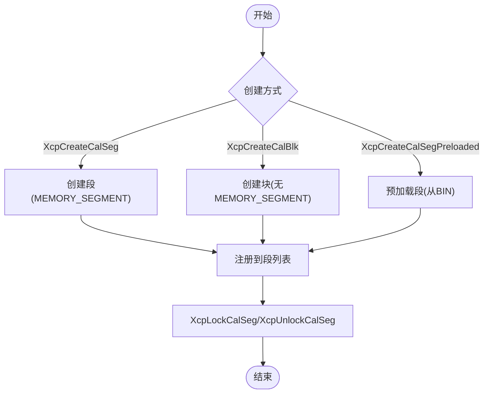
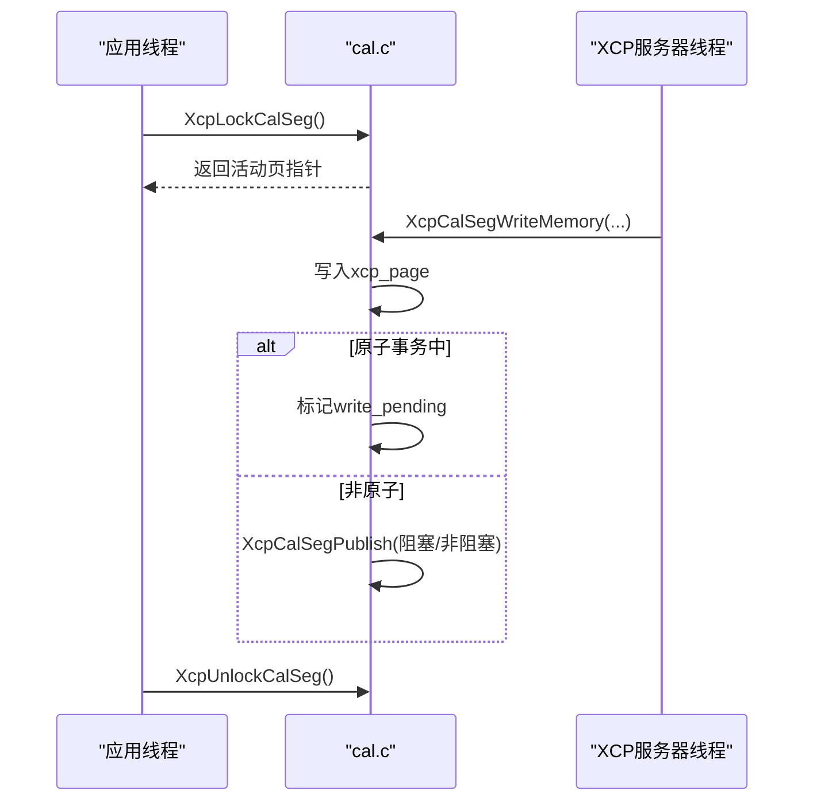
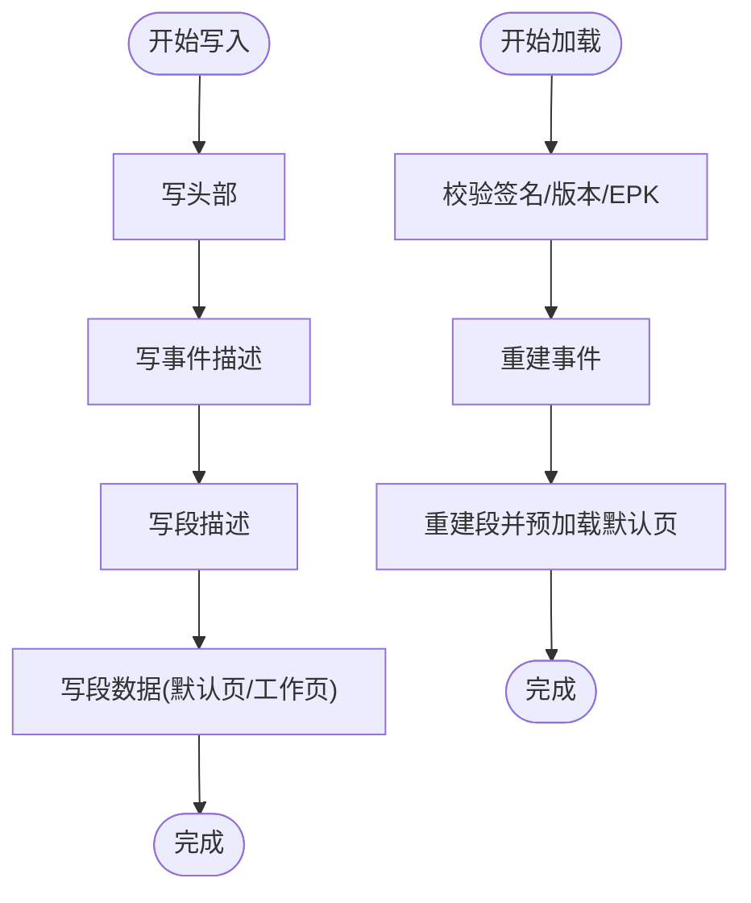
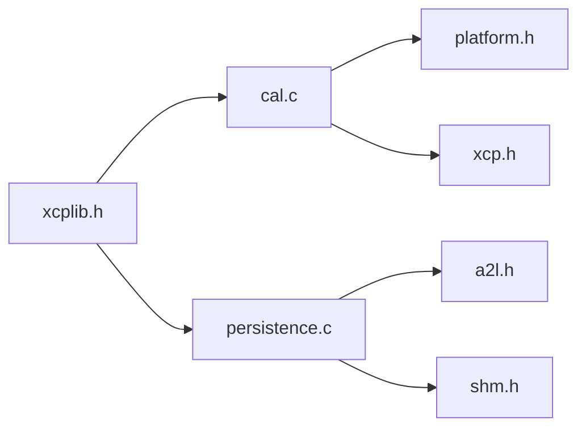

# 校准段管理

<cite>
**本文引用的文件**
- [cal.h](file://src/cal.h)
- [cal.c](file://src/cal.c)
- [persistence.h](file://src/persistence.h)
- [persistence.c](file://src/persistence.c)
- [xcplib.h](file://inc/xcplib.h)
- [xcplite.h](file://src/xcplite.h)
- [CAL_RCU.md](file://docs/CAL_RCU.md)
- [main.c（C示例）](file://examples/c_demo/src/main.c)
</cite>

## 目录
1. [简介](#简介)
2. [项目结构](#项目结构)
3. [核心组件](#核心组件)
4. [架构总览](#架构总览)
5. [详细组件分析](#详细组件分析)
6. [依赖关系分析](#依赖关系分析)
7. [性能与一致性](#性能与一致性)
8. [故障排查指南](#故障排查指南)
9. [结论](#结论)
10. [附录：API使用示例与最佳实践](#附录api使用示例与最佳实践)

## 简介
本文件系统性阐述 XCPlite 的“校准段”管理机制，覆盖概念、数据结构、生命周期、线程安全访问、持久化存储、数据类型映射与验证规则，以及完整的 API 使用示例与最佳实践。校准段是 XCP 协议中用于参数标定与数据采样的核心抽象，XCPlite 通过无锁、等待自由的 RCU（Read-Copy-Update）机制，为多读单写场景提供内存安全与一致性的保障。

## 项目结构
围绕校准段管理的核心代码主要分布在以下位置：
- 头文件定义与公共 API：
  - src/cal.h：校准段内部类型、列表、页管理与服务端/应用端接口声明
  - inc/xcplib.h：对外 C API（创建、锁定、解锁、冻结、持久化等）
  - src/xcplite.h：协议层初始化模式与状态查询
- 实现文件：
  - src/cal.c：校准段创建、注册、RCU 发布、原子事务、页面切换、XCP 命令处理
  - src/persistence.c/.h：二进制持久化文件的读写、冻结、加载
- 文档与示例：
  - docs/CAL_RCU.md：RCU 算法说明、权衡与测试
  - examples/c_demo/src/main.c：完整的使用示例（创建段、A2L 描述、锁定访问、事件触发）

图表来源
- [cal.h:42-179](file://src/cal.h#L42-L179)
- [cal.c:122-180](file://src/cal.c#L122-L180)
- [persistence.c:248-318](file://src/persistence.c#L248-L318)
- [xcplib.h:70-139](file://inc/xcplib.h#L70-L139)
- [xcplite.h:46-59](file://src/xcplite.h#L46-L59)

章节来源
- [cal.h:42-179](file://src/cal.h#L42-L179)
- [cal.c:122-180](file://src/cal.c#L122-L180)
- [persistence.c:248-318](file://src/persistence.c#L248-L318)
- [xcplib.h:70-139](file://inc/xcplib.h#L70-L139)
- [xcplite.h:46-59](file://src/xcplite.h#L46-L59)

## 核心组件
- 校准段与段列表
  - tXcpCalSegHeader：64字节对齐的段头，包含页偏移、访问控制、持久化位置、名称等
  - tXcpCalSeg：段头 + 可变长度页数据区（默认页、ECU工作页、XCP工作页、空闲交换页）
  - tXcpCalSegList：全局段列表，含原子计数、内存池、延迟写标志
- 页面模型
  - 默认页（Reference Page）：只读或作为初始值源
  - ECU 工作页（RAM）：应用侧读取的当前有效页
  - XCP 工作页：写入目标页，随后通过 RCU 发布到 ECU 页
  - 空闲页：用于交换与拷贝
- 线程安全与原子性
  - lock_count、ecu_page_next、free_page 等字段使用原子操作
  - 列表注册阶段使用互斥量保护
- 持久化
  - 二进制 BIN 文件保存事件与校准段描述及数据
  - 支持启动时预加载（Preloaded）与运行期冻结（Freeze）

章节来源
- [cal.h:86-179](file://src/cal.h#L86-L179)
- [cal.c:184-222](file://src/cal.c#L184-L222)
- [persistence.c:45-95](file://src/persistence.c#L45-L95)

## 架构总览
校准段管理由“应用调用 -> 公共API -> 校准段实现 -> 持久化/协议层”构成。应用通过 xcplib.h 暴露的 API 创建和访问校准段；cal.c 实现 RCU 页面切换与发布；persistence.c 负责持久化；xcplite.h 提供初始化与状态查询。

图表来源
- [xcplib.h:70-139](file://inc/xcplib.h#L70-L139)
- [cal.c:375-503](file://src/cal.c#L375-L503)
- [cal.c:623-689](file://src/cal.c#L623-L689)
- [cal.c:800-844](file://src/cal.c#L800-L844)
- [persistence.c:327-365](file://src/persistence.c#L327-L365)

## 详细组件分析

### 数据结构与内存布局
- 段头 tXcpCalSegHeader（64字节）
  - 关键成员：default_page_ptr（绝对寻址模式）、ecu_page_next、free_page、ecu_page、xcp_page、file_pos、size、ecu_access、lock_count、xcp_access、write_pending、free_page_hazard、calseg_number、app_id、mode、name
  - 所有页引用以 uint32_t 字节偏移表示，保证跨进程共享内存无需指针修正
- 段体 tXcpCalSeg
  - 首字段为段头，其后为连续页数据区，大小为 page_size * CALSEG_PAGE_COUNT（按 8 字节对齐）
- 段列表 tXcpCalSegList
  - offset[]：每个段的内存池偏移
  - count：已注册段数量
  - memory_segment_count：内存段编号计数（XCP/MEMORY_SEGMENT）
  - write_delayed：原子写事务进行中
  - cal_mem_used：内存池已用字节数（原子 bump allocator）
  - pool[]：平坦内存池，存放所有段实例

复杂度与空间占用
- 每段额外开销：64 字节头 + 4 个对齐页（默认页、ECU页、XCP页、空闲页）
- 查找：线性扫描段列表 O(N)，N 为段数量
- 分配：bump allocator 近似 O(1)，但存在 CAS 重试

章节来源
- [cal.h:86-179](file://src/cal.h#L86-L179)
- [cal.c:101-117](file://src/cal.c#L101-L117)

### 生命周期管理
- 创建
  - XcpCreateCalSeg：创建带 MEMORY_SEGMENT 能力的校准段（可被 XCP 工具直接管理）
  - XcpCreateCalBlk：仅封装参数块，不生成 MEMORY_SEGMENT
  - XcpCreateCalSegPreloaded：从二进制持久化文件预加载默认页内容并标记为预加载
- 注册与发现
  - XcpRegisterSectionCalSegs：扫描链接器段 xcp_cals，自动预注册段/块
  - XcpFindCalSeg：按名称查找段（SHM 模式下按 app_id 过滤）
- 访问
  - XcpLockCalSeg/XcpUnlockCalSeg：获取/释放对活动页的访问，保证一致性
- 销毁
  - 段内存池整体在列表销毁时回收；当前实现未逐段释放
  - SHM 模式下需清理待处理状态（TODO）

图表来源
- [cal.c:375-503](file://src/cal.c#L375-L503)
- [cal.c:122-180](file://src/cal.c#L122-L180)
- [cal.c:234-262](file://src/cal.c#L234-L262)

章节来源
- [cal.c:375-503](file://src/cal.c#L375-L503)
- [cal.c:122-180](file://src/cal.c#L122-L180)
- [cal.c:234-262](file://src/cal.c#L234-L262)

### 线程安全与一致性
- 读路径（应用线程）
  - 通过 XcpLockCalSeg 获取活动页指针，无锁、等待自由
  - 首次进入临界区时可能更新 ecu_page 并释放旧页至 free_page
- 写路径（XCP服务器线程）
  - XcpCalSegWriteMemory 写入当前 xcp_page
  - 若处于原子事务（write_delayed），仅标记 write_pending
  - 否则尝试发布：若无空闲页则阻塞等待或返回待定（取决于配置）
- 发布（RCU）
  - 将旧 xcp_page 复制到新空闲页，然后交换 xcp_page
  - 通过 ecu_page_next 通知读者在下一次锁定时切换
- 原子事务
  - XcpCalSegBeginAtomicTransaction 开启延迟写
  - XcpCalSegEndAtomicTransaction 关闭延迟并批量发布

图表来源
- [cal.c:623-689](file://src/cal.c#L623-L689)
- [cal.c:800-844](file://src/cal.c#L800-L844)
- [cal.c:1047-1062](file://src/cal.c#L1047-L1062)

章节来源
- [cal.c:623-689](file://src/cal.c#L623-L689)
- [cal.c:800-844](file://src/cal.c#L800-L844)
- [cal.c:1047-1062](file://src/cal.c#L1047-L1062)

### 持久化存储机制
- 文件格式
  - 头部：签名、版本、事件数、段数、应用数、EPK
  - 事件描述：名称、周期、优先级、app_id
  - 段描述：索引、大小、地址、app_id、段号、名称
  - 段数据：默认页或工作页数据（根据写入时机）
- 写入
  - XcpBinWrite：遍历事件与段，写出描述与数据（默认页）
  - XcpBinFreezeCalSeg：将指定段的工作页数据写回 BIN 文件
- 加载
  - XcpBinLoad：校验签名与版本，按顺序重建事件与段，预加载默认页
  - 在 SHM 模式下还会预注册应用信息

图表来源
- [persistence.c:134-210](file://src/persistence.c#L134-L210)
- [persistence.c:248-318](file://src/persistence.c#L248-L318)
- [persistence.c:327-365](file://src/persistence.c#L327-L365)
- [persistence.c:375-521](file://src/persistence.c#L375-L521)

章节来源
- [persistence.c:134-210](file://src/persistence.c#L134-L210)
- [persistence.c:248-318](file://src/persistence.c#L248-L318)
- [persistence.c:327-365](file://src/persistence.c#L327-L365)
- [persistence.c:375-521](file://src/persistence.c#L375-L521)

### 数据类型映射与验证
- 支持的标量与复合类型
  - 标量：int8_t、uint8_t、int16_t、uint16_t、int32_t、uint32_t、int64_t、uint64_t、float、double
  - 数组与多维数组：通过 A2L 宏创建曲线/地图/矩阵
  - 结构体：通过 typedef 与组件宏组合，形成结构化参数集
- 映射与验证
  - A2lCreateParameter/A2lCreateCurve/A2lCreateMap/A2lCreateMeasurement 等宏负责在 A2L 中声明类型与范围
  - 运行时通过 XcpLockCalSeg 获得活动页指针后，按原结构体布局访问，确保类型一致性与边界安全
  - 越界访问会在 XcpCalSegRead/WriteMemory 中检测并返回错误码

章节来源
- [xcplib.h:176-234](file://inc/xcplib.h#L176-L234)
- [main.c:158-190](file://examples/c_demo/src/main.c#L158-L190)
- [cal.c:698-717](file://src/cal.c#L698-L717)
- [cal.c:800-844](file://src/cal.c#L800-L844)

## 依赖关系分析
- 模块耦合
  - xcplib.h 暴露稳定 API，屏蔽内部实现细节
  - cal.c 依赖 platform.h（原子/互斥）、xcp.h（协议常量）、xcptl_cfg.h（传输层配置）
  - persistence.c 依赖 a2l.h、shm.h、platform.h
- 外部集成点
  - XCP 协议层：GET/SET CAL PAGE、COPY CAL PAGE、GET SEGMENT INFO 等命令
  - 共享内存模式（OPTION_SHM_MODE）：按 app_id 隔离段与事件
- 潜在循环依赖
  - 通过头文件守卫避免重复包含；各模块职责清晰，未见循环依赖迹象

图表来源
- [cal.c:13-38](file://src/cal.c#L13-L38)
- [persistence.c:13-35](file://src/persistence.c#L13-L35)
- [xcplib.h:70-139](file://inc/xcplib.h#L70-L139)

章节来源
- [cal.c:13-38](file://src/cal.c#L13-L38)
- [persistence.c:13-35](file://src/persistence.c#L13-L35)
- [xcplib.h:70-139](file://inc/xcplib.h#L70-L139)

## 性能与一致性
- 性能特性
  - 读路径无锁、等待自由，典型锁时间亚微秒级（见测试统计）
  - 写路径在原子事务中延迟发布，减少频繁同步开销
  - 内存分配采用 bump allocator，近似 O(1)
- 一致性保证
  - 第一次进入锁时更新 ecu_page，确保读到最新一致视图
  - 原子事务内累积修改，结束时批量发布，保证多参数变更的一致性
- 权衡与限制
  - 仅允许单一写线程（XCP服务器线程）
  - 可见性延迟：第二次锁才看到更新（定义上的“第二序”）
  - 极端情况下可能出现饥饿或超时（无空闲页）

章节来源
- [CAL_RCU.md:63-92](file://docs/CAL_RCU.md#L63-L92)
- [CAL_RCU.md:187-321](file://docs/CAL_RCU.md#L187-L321)
- [cal.c:723-767](file://src/cal.c#L723-L767)

## 故障排查指南
- 常见问题
  - 段不存在或索引无效：检查是否已创建并激活 XCP；确认名称唯一
  - 越界访问：确保 size 与 offset 计算正确，避免超出段大小
  - 无法发布：检查是否有空闲页可用；必要时调整 XCP_CALSEG_AQUIRE_FREE_PAGE_TIMEOUT
  - 持久化失败：确认 BIN 文件权限、磁盘空间与 EPK 匹配
- 诊断手段
  - 启用调试日志（XcpSetLogLevel）观察命令与状态
  - 使用 XcpGetCalSegCount、XcpGetCalSegName 等查询函数定位问题
  - 通过 XcpBinFreezeCalSeg 手动冻结特定段，检查写入结果

章节来源
- [cal.c:207-222](file://src/cal.c#L207-L222)
- [cal.c:698-717](file://src/cal.c#L698-L717)
- [cal.c:800-844](file://src/cal.c#L800-L844)
- [persistence.c:248-318](file://src/persistence.c#L248-L318)

## 结论
XCPlite 的校准段管理以 RCU 为核心，提供了高效、安全且一致的参数标定能力。通过明确的段/块抽象、严格的页面模型、原子化的并发控制与完善的持久化机制，开发者可以可靠地在多读单写场景下管理校准数据。结合 A2L 自动生成与工具链集成，能够显著提升标定效率与系统可维护性。

## 附录：API使用示例与最佳实践
- 基本流程
  - 初始化：XcpInit(..., XCP_MODE_PERSISTENCE | XCP_MODE_LOCAL)
  - 创建段：XcpCreateCalSeg("params", &params, sizeof(params))
  - 锁定访问：const params_t* p = (params_t*)XcpLockCalSeg(calseg); ...; XcpUnlockCalSeg(calseg)
  - 事件触发：DaqCreateEvent(mainloop); DaqTriggerEventExt(mainloop, base)
  - 持久化：XcpBinWrite(epk); XcpFreeze(); XcpBinLoad()
- 最佳实践
  - 始终使用 XcpLockCalSeg/XcpUnlockCalSeg 访问校准数据，保证一致性
  - 将大对象放入段中，利用 RCU 避免锁竞争
  - 合理使用原子事务（Begin/End）保证多参数变更的一致性
  - 在 SHM 模式下注意 app_id 隔离与服务器角色
  - 定期冻结工作页到 BIN 文件，确保重启后可恢复

章节来源
- [main.c:130-190](file://examples/c_demo/src/main.c#L130-L190)
- [main.c:286-324](file://examples/c_demo/src/main.c#L286-L324)
- [xcplib.h:70-139](file://inc/xcplib.h#L70-L139)
- [cal.c:1047-1062](file://src/cal.c#L1047-L1062)
- [persistence.c:248-318](file://src/persistence.c#L248-L318)