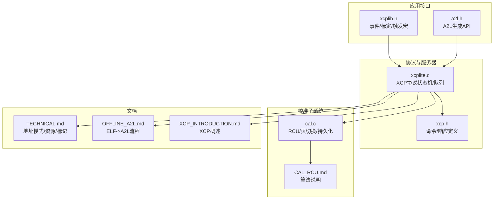
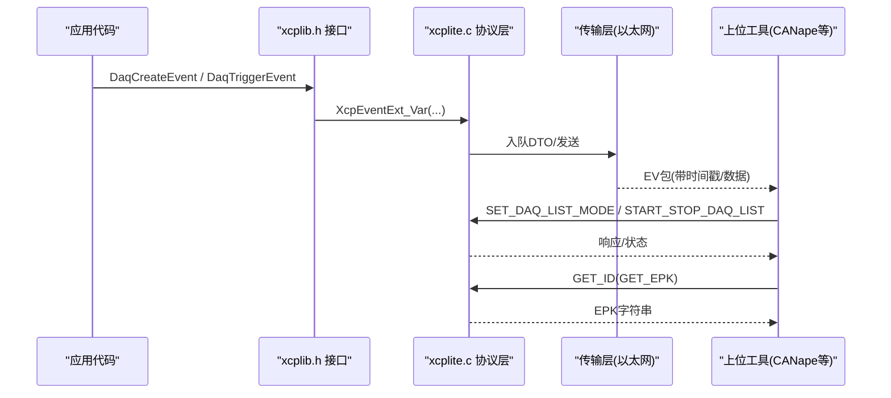
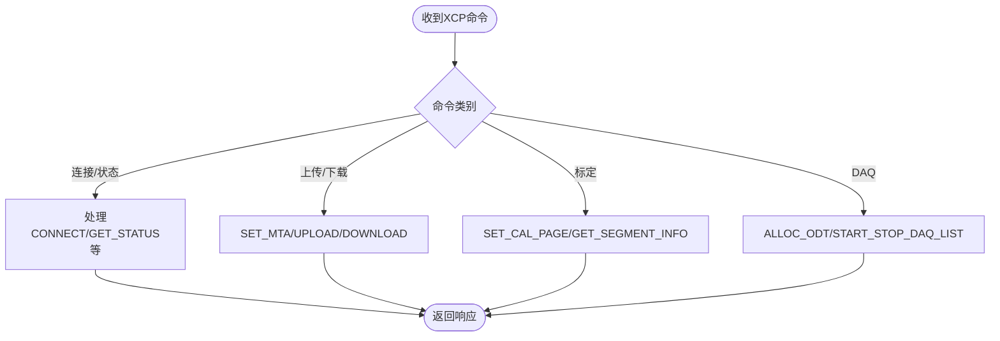
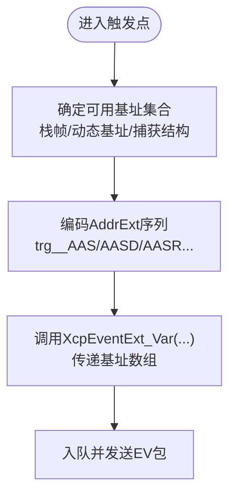
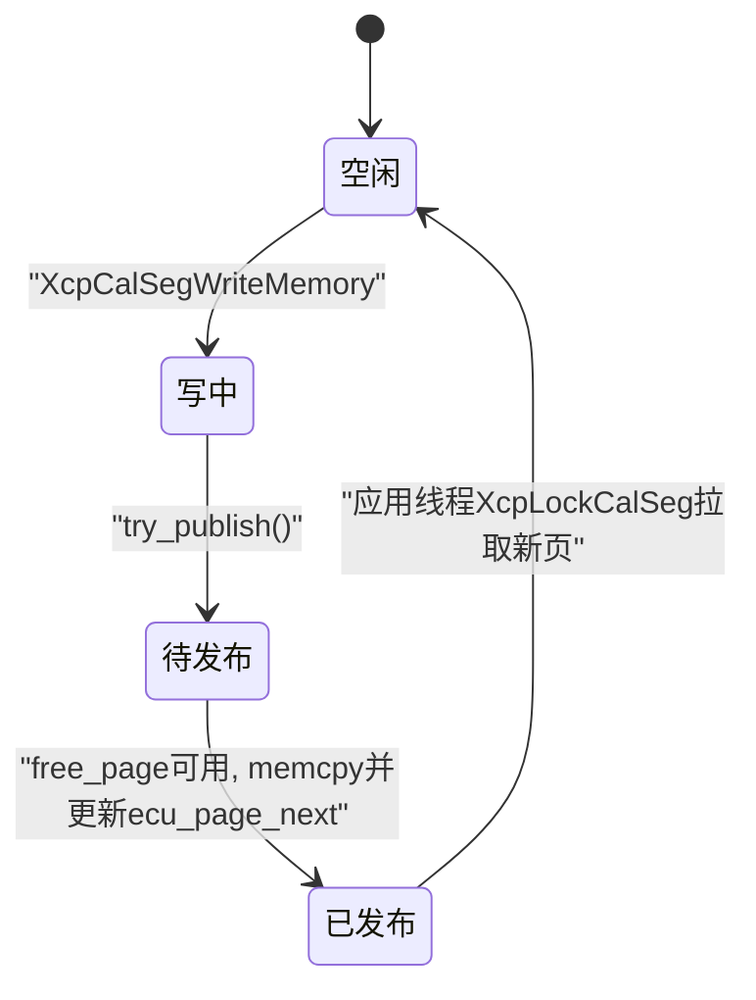
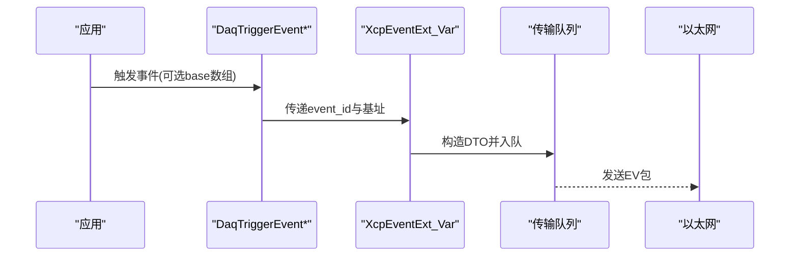
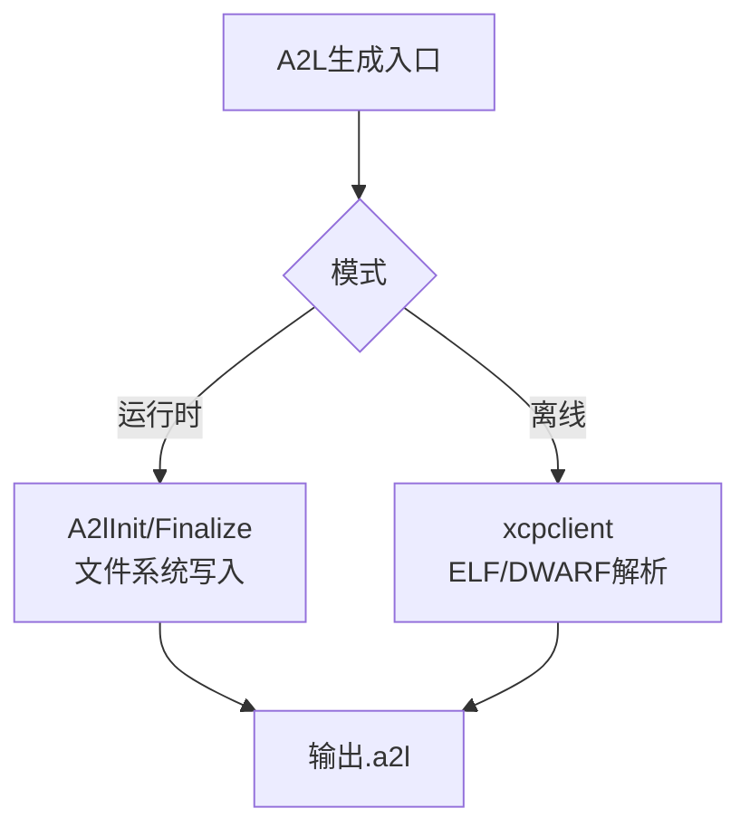
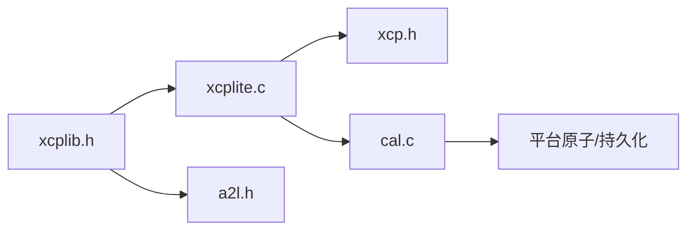

# 核心概念

<cite>
**本文引用的文件**
- [README.md](file://README.md)
- [TECHNICAL.md](file://docs/TECHNICAL.md)
- [XCP_INTRODUCTION.md](file://docs/XCP_INTRODUCTION.md)
- [CAL_RCU.md](file://docs/CAL_RCU.md)
- [OFFLINE_A2L.md](file://docs/OFFLINE_A2L.md)
- [xcplib.h](file://inc/xcplib.h)
- [a2l.h](file://inc/a2l.h)
- [xcp.h](file://src/xcp.h)
- [xcplite.c](file://src/xcplite.c)
- [cal.c](file://src/cal.c)
</cite>

## 目录
1. [简介](#简介)
2. [项目结构](#项目结构)
3. [核心组件](#核心组件)
4. [架构总览](#架构总览)
5. [详细组件分析](#详细组件分析)
6. [依赖关系分析](#依赖关系分析)
7. [性能与资源特性](#性能与资源特性)
8. [故障排查指南](#故障排查指南)
9. [结论](#结论)
10. [附录](#附录)

## 简介
XCPlite 是面向现代多核处理器与实时系统的 XCP on Ethernet 实现，提供高并发、低开销的测量（DAQ）与标定（Calibration）能力。其核心思想是通过相对寻址直接访问全局、栈、线程局部与堆内存中的原始数据，避免拷贝与序列化；通过无锁/等待自由的 RCU 机制保证多线程下参数修改的一致性；通过运行时或离线 A2L 生成将事件、测量与参数描述给上位工具；并通过页切换、持久化等高级特性满足工程化需求。

**章节来源**
- [README.md:7-29](file://README.md#L7-L29)
- [XCP_INTRODUCTION.md:3-19](file://docs/XCP_INTRODUCTION.md#L3-L19)

## 项目结构
- 公共 API：inc/xcplib.h、inc/a2l.h
- 协议层与服务器：src/xcplite.c、src/xcp.h
- 校准段与 RCU：src/cal.c、docs/CAL_RCU.md
- 技术细节与地址模式：docs/TECHNICAL.md
- 离线 A2L 生成：docs/OFFLINE_A2L.md

**图示来源**
- [xcplib.h:39-58](file://inc/xcplib.h#L39-L58)
- [a2l.h:56-67](file://inc/a2l.h#L56-L67)
- [xcplite.c:161-182](file://src/xcplite.c#L161-L182)
- [xcp.h:25-130](file://src/xcp.h#L25-L130)
- [cal.c:119-180](file://src/cal.c#L119-L180)

**章节来源**
- [xcplib.h:39-58](file://inc/xcplib.h#L39-L58)
- [a2l.h:56-67](file://inc/a2l.h#L56-L67)
- [xcplite.c:161-182](file://src/xcplite.c#L161-L182)
- [xcp.h:25-130](file://src/xcp.h#L25-L130)
- [cal.c:119-180](file://src/cal.c#L119-L180)

## 核心组件
- XCP 协议层：命令/响应、状态机、传输队列抽象、以太网服务器初始化与状态查询。
- DAQ 事件系统：事件创建、触发、捕获、时间戳与优先级；支持绝对/栈帧/动态基址/捕获结构等多种相对寻址。
- 校准段（Calibration Segment）：工作页/参考页/冻结/复制/页切换；RCU 无锁读取、单写者一致性发布。
- A2L 生成：运行时文件写入与一次性生成；离线 ELF/DWARF 解析生成；类型检测、组与转换、复杂类型实例。
- 平台与配置：原子操作、线程、时钟、套接字、共享内存模式、EPK 版本校验。

**章节来源**
- [xcp.h:25-130](file://src/xcp.h#L25-L130)
- [xcplib.h:239-480](file://inc/xcplib.h#L239-L480)
- [a2l.h:323-476](file://inc/a2l.h#L323-L476)
- [TECHNICAL.md:356-394](file://docs/TECHNICAL.md#L356-L394)

## 架构总览
XCPlite 以“事件驱动 + 相对寻址”为核心，结合 RCU 校准段与 A2L 描述，形成从采集到标定的闭环。

**图示来源**
- [xcplib.h:408-480](file://inc/xcplib.h#L408-L480)
- [xcp.h:683-740](file://src/xcp.h#L683-L740)
- [xcplite.c:161-182](file://src/xcplite.c#L161-L182)

## 详细组件分析

### XCP 协议工作机制与地址扩展
- 命令集覆盖连接、上传/下载、标定页切换、DAQ/STIM、PGM、Level 1 扩展等。
- 地址扩展（AddrExt）用于区分不同寻址模式：绝对、校准段相对、栈帧相对、动态基址、捕获结构相对、文件空间、MTA指针空间等。
- 目标端通过导出符号标识当前地址方案（CASDD/ACSDD/AXSDD/CXSDD），供工具正确解码。

**图示来源**
- [xcp.h:25-130](file://src/xcp.h#L25-L130)
- [xcp.h:612-681](file://src/xcp.h#L612-L681)
- [xcp.h:683-740](file://src/xcp.h#L683-L740)

**章节来源**
- [xcp.h:25-130](file://src/xcp.h#L25-L130)
- [TECHNICAL.md:269-313](file://docs/TECHNICAL.md#L269-L313)
- [xcplite.c:161-182](file://src/xcplite.c#L161-L182)

### 相对寻址模式的实现原理
- 绝对寻址：基于模块基址的全局静态变量。
- 栈帧相对：通过 xcp_get_frame_addr() 获取 DWARF 一致的帧基，配合触发点锚点变量名编码可用模式位。
- 动态基址：为堆对象/类实例传入 base 指针，作为 AddrExt 的高位槽。
- 捕获结构：将寄存器变量复制到栈上捕获结构，使用 AddrExt=3 指向该结构。
- 校准段相对：在段内按偏移寻址，支持页切换与一致性发布。

**图示来源**
- [xcplib.h:485-545](file://inc/xcplib.h#L485-L545)
- [xcplib.h:570-658](file://inc/xcplib.h#L570-L658)
- [xcplib.h:714-757](file://inc/xcplib.h#L714-L757)
- [TECHNICAL.md:179-266](file://docs/TECHNICAL.md#L179-L266)

**章节来源**
- [xcplib.h:485-545](file://inc/xcplib.h#L485-L545)
- [xcplib.h:570-658](file://inc/xcplib.h#L570-L658)
- [xcplib.h:714-757](file://inc/xcplib.h#L714-L757)
- [TECHNICAL.md:179-266](file://docs/TECHNICAL.md#L179-L266)

### 校准段与页切换机制（RCU）
- 单写者（XCP命令线程）+ 多读者（应用线程）模型。
- 三页模型：ecu_page（当前读）、xcp_page（当前写）、free_page（交换缓冲）。
- 发布策略：写者在 xcp_page 累积变更，try_publish 在 free_page 可用时拷贝并更新 ecu_page_next；应用线程在 XcpLockCalSeg 时按需拉取新页。
- 一致性：BEGIN/END 原子事务可延迟发布，确保多字段一致可见。
- 页切换：SET_CAL_PAGE 控制 ECU/XCP 访问模式，COPY_CAL_PAGE 支持参考/工作页同步。

**图示来源**
- [CAL_RCU.md:94-183](file://docs/CAL_RCU.md#L94-L183)
- [cal.c:119-180](file://src/cal.c#L119-L180)
- [xcp.h:612-681](file://src/xcp.h#L612-L681)

**章节来源**
- [CAL_RCU.md:14-89](file://docs/CAL_RCU.md#L14-L89)
- [CAL_RCU.md:94-183](file://docs/CAL_RCU.md#L94-L183)
- [cal.c:119-180](file://src/cal.c#L119-L180)
- [xcp.h:612-681](file://src/xcp.h#L612-L681)

### DAQ 事件系统设计与触发流程
- 事件创建：链接期段扫描或运行时列表管理，支持周期/优先级。
- 触发：宏封装基址选择与尾部调用保护，确保本地变量可见。
- 捕获：对寄存器变量进行轻量拷贝，避免强制落栈。
- 时间戳：支持固定/单位时间戳，兼容 PTP 场景。

**图示来源**
- [xcplib.h:408-480](file://inc/xcplib.h#L408-L480)
- [xcplib.h:570-658](file://inc/xcplib.h#L570-L658)
- [xcplib.h:714-757](file://inc/xcplib.h#L714-L757)

**章节来源**
- [xcplib.h:408-480](file://inc/xcplib.h#L408-L480)
- [xcplib.h:570-658](file://inc/xcplib.h#L570-L658)
- [xcplib.h:714-757](file://inc/xcplib.h#L714-L757)

### A2L 文件格式的结构与作用
- 运行时生成：A2lInit/Finalize，支持一次生成/连接时生成/模板模式；自动分组、类型检测、复杂类型实例。
- 离线生成：xcpclient 读取 ELF/DWARF，根据 xcp_evts/xcp_cals/xcp_meta 与触发点锚点重建完整 A2L。
- 地址方案：PROJECT_NO 指示 CASDD/ACSDD，影响标定参数寻址方式。
- 元数据：XCP_UNIT/LIMITS/COMMENT/READ_WRITE 注解映射到 A2L 属性。

**图示来源**
- [a2l.h:56-67](file://inc/a2l.h#L56-L67)
- [a2l.h:644-669](file://inc/a2l.h#L644-L669)
- [OFFLINE_A2L.md:13-33](file://docs/OFFLINE_A2L.md#L13-L33)
- [OFFLINE_A2L.md:72-84](file://docs/OFFLINE_A2L.md#L72-L84)

**章节来源**
- [a2l.h:56-67](file://inc/a2l.h#L56-L67)
- [a2l.h:644-669](file://inc/a2l.h#L644-L669)
- [OFFLINE_A2L.md:13-33](file://docs/OFFLINE_A2L.md#L13-L33)
- [OFFLINE_A2L.md:72-84](file://docs/OFFLINE_A2L.md#L72-L84)

### 多线程一致性、内存管理与性能优化
- 一致性：RCU 单写者+多读者，发布延迟但无锁读取；事务 BEGIN/END 保障多字段一致性。
- 内存：静态为主，传输队列与部分表按需分配；对齐与缓存友好布局。
- 性能：无锁/等待自由路径、零拷贝、最小化触发开销；尾部调用保护避免帧释放导致的数据丢失。
- 平台：原子、线程、时钟、套接字抽象，支持 POSIX/RTOS 环境。

**章节来源**
- [CAL_RCU.md:63-89](file://docs/CAL_RCU.md#L63-L89)
- [TECHNICAL.md:5-24](file://docs/TECHNICAL.md#L5-L24)
- [TECHNICAL.md:356-394](file://docs/TECHNICAL.md#L356-L394)
- [xcplib.h:533-545](file://inc/xcplib.h#L533-L545)

### 复杂数据类型支持与页切换、持久化
- 复杂类型：typedef 结构/嵌套/数组/矩阵；C/C++ 类型检测与记录布局名称。
- 页切换：SET_CAL_PAGE/COPY_CAL_PAGE/GET_PAGE_INFO 等命令；ECU/XCP 访问模式控制。
- 持久化：XcpFreeze/XcpBinWrite 将工作页保存为二进制，下次启动加载默认页；EPK 校验保证兼容性。

**章节来源**
- [a2l.h:472-577](file://inc/a2l.h#L472-L577)
- [xcp.h:612-681](file://src/xcp.h#L612-L681)
- [xcplib.h:126-139](file://inc/xcplib.h#L126-L139)
- [TECHNICAL.md:342-353](file://docs/TECHNICAL.md#L342-L353)

## 依赖关系分析
- xcplib.h 暴露事件/标定/触发宏与基础类型，被上层应用与 a2l.h 使用。
- xcplite.c 实现协议状态机，依赖 xcp.h 的命令定义与传输层抽象。
- cal.c 实现校准段 RCU，依赖平台原子与持久化接口。
- 文档串联了地址模式、离线生成与 RCU 算法，指导正确使用。

**图示来源**
- [xcplib.h:39-58](file://inc/xcplib.h#L39-L58)
- [xcplite.c:161-182](file://src/xcplite.c#L161-L182)
- [xcp.h:25-130](file://src/xcp.h#L25-L130)
- [cal.c:119-180](file://src/cal.c#L119-L180)

**章节来源**
- [xcplib.h:39-58](file://inc/xcplib.h#L39-L58)
- [xcplite.c:161-182](file://src/xcplite.c#L161-L182)
- [xcp.h:25-130](file://src/xcp.h#L25-L130)
- [cal.c:119-180](file://src/cal.c#L119-L180)

## 性能与资源特性
- 静态内存约 ~10KB（DAQ表、校准段页），堆内存约 ~32KB（传输队列），每线程栈约 ~1KB。
- 触发与传输采用无锁实现；DAQ 触发可能需外部时钟；事件创建/段创建存在互斥保护。
- 函数参数/局部变量测量会迫使编译器将变量落到栈帧，但不引入未定义行为。
- 传输队列大小应至少覆盖预期流量的 10ms。

**章节来源**
- [TECHNICAL.md:5-24](file://docs/TECHNICAL.md#L5-L24)
- [TECHNICAL.md:28-52](file://docs/TECHNICAL.md#L28-L52)

## 故障排查指南
- 若 A2L 不稳定或每次重启变化，需确保事件/段注册顺序确定性，或提供 EPK 版本字符串。
- CANape 特定问题：COPY_CAL_PAGE 仅对首个段执行；GET_ID 5 模式 0x01 被忽略；地址扩展在某些场景被忽略。
- 若变量未出现在 A2L：检查是否 volatile、是否在 inlined 函数触发、是否超出 32 位地址范围、是否缺少事件锚点。
- 校准可见性延迟：第二次 XcpLockCalSeg 后才可见；必要时调用发布函数或开启周期性发布。

**章节来源**
- [TECHNICAL.md:396-412](file://docs/TECHNICAL.md#L396-L412)
- [OFFLINE_A2L.md:244-269](file://docs/OFFLINE_A2L.md#L244-L269)
- [CAL_RCU.md:63-89](file://docs/CAL_RCU.md#L63-L89)

## 结论
XCPlite 通过相对寻址、事件驱动与 RCU 校准段，实现了在高并发、多核环境下的高效测量与标定。结合运行时/离线 A2L 生成、复杂类型支持与页切换/持久化，覆盖了从嵌入式到现代 SoC 的广泛场景。开发者应重点关注触发点的基址选择、事件锚点与地址扩展、校准段的发布时机与一致性事务，以获得稳定且高性能的集成体验。

## 附录
- 快速开始：参考示例与构建说明。
- 学习资源：XCP 书籍与在线课程。
- 其他实现：XCPbasic、XCPprof。

**章节来源**
- [README.md:53-112](file://README.md#L53-L112)
- [README.md:120-125](file://README.md#L120-L125)