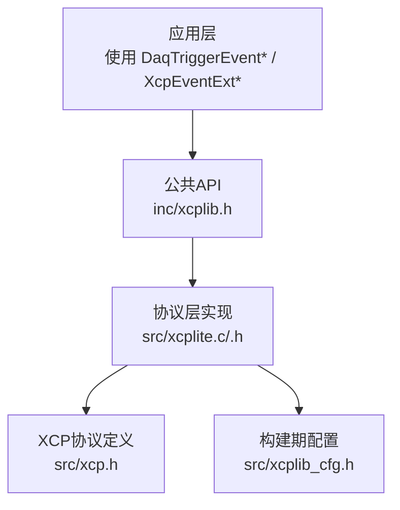
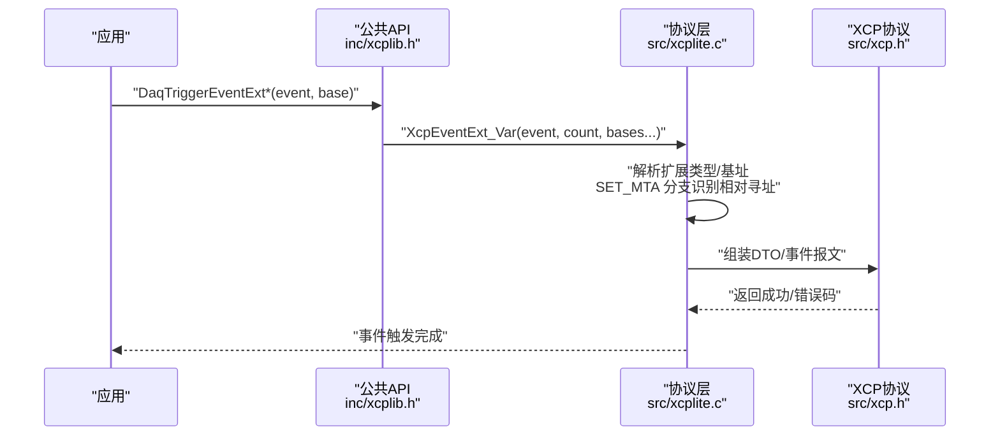
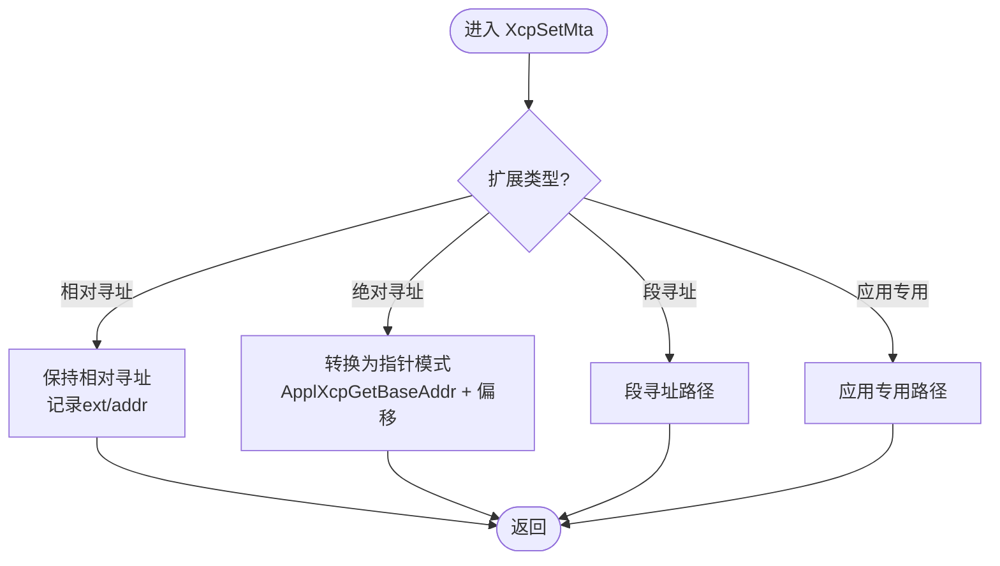
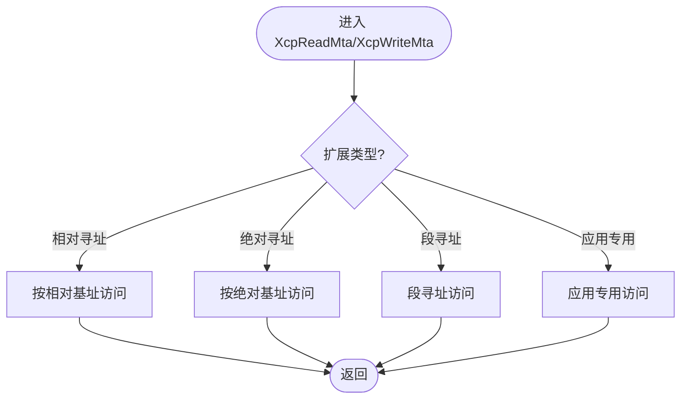
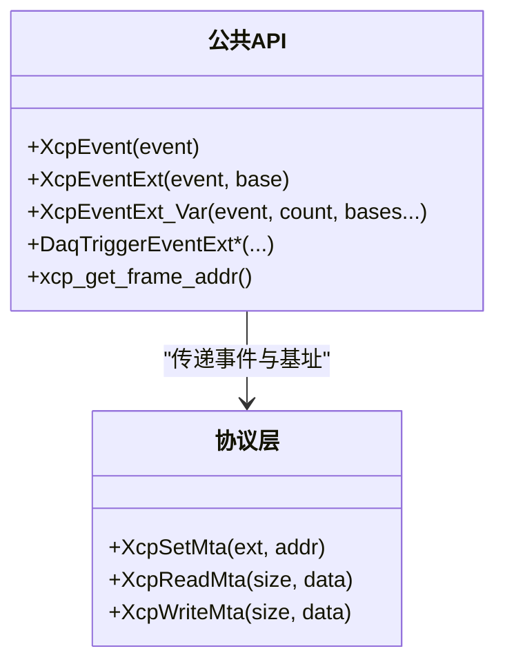
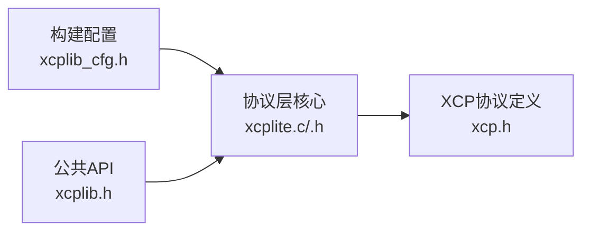

# 相对寻址模式

<cite>
**本文引用的文件**
- [src/xcplite.c](file://src/xcplite.c)
- [src/xcplite.h](file://src/xcplite.h)
- [inc/xcplib.h](file://inc/xcplib.h)
- [src/xcp.h](file://src/xcp.h)
- [src/xcplib_cfg.h](file://src/xcplib_cfg.h)
</cite>

## 目录
1. [简介](#简介)
2. [项目结构](#项目结构)
3. [核心组件](#核心组件)
4. [架构总览](#架构总览)
5. [详细组件分析](#详细组件分析)
6. [依赖关系分析](#依赖关系分析)
7. [性能考量](#性能考量)
8. [故障排查指南](#故障排查指南)
9. [结论](#结论)
10. [附录](#附录)

## 简介
本文件聚焦于 XCPlite 中的“相对寻址模式”，系统阐述其实现原理、地址计算与内存映射机制、与传统绝对寻址的差异、在嵌入式系统中的适用场景，以及与页切换、地址转换和内存管理策略的协同方式。文档面向希望正确理解并应用相对寻址功能的开发者，提供从概念到代码级实现的渐进式说明，并辅以流程图与时序图帮助快速掌握关键路径。

## 项目结构
XCPlite 将协议层与传输层解耦，并通过可配置选项启用不同寻址模式。与相对寻址直接相关的核心位置包括：
- 协议层状态与命令处理：src/xcplite.c、src/xcplite.h
- 公共 API（事件触发、帧指针获取等）：inc/xcplib.h
- XCP 协议定义（命令码、响应码、DAQ 字段等）：src/xcp.h
- 构建期配置（是否启用相对寻址、段寻址、绝对寻址等）：src/xcplib_cfg.h

**图表来源**
- [inc/xcplib.h:455-643](file://inc/xcplib.h#L455-L643)
- [src/xcplite.c:618-711](file://src/xcplite.c#L618-L711)
- [src/xcp.h:548-603](file://src/xcp.h#L548-L603)
- [src/xcplib_cfg.h:82-118](file://src/xcplib_cfg.h#L82-L118)

**章节来源**
- [src/xcplite.c:618-711](file://src/xcplite.c#L618-L711)
- [inc/xcplib.h:455-643](file://inc/xcplib.h#L455-L643)
- [src/xcp.h:548-603](file://src/xcp.h#L548-L603)
- [src/xcplib_cfg.h:82-118](file://src/xcplib_cfg.h#L82-L118)

## 核心组件
- 相对寻址入口与上下文
  - 通过事件触发宏或函数传入“基址”（通常为栈帧基址或自定义相对基址），配合扩展类型标识相对寻址空间。
  - 相关接口与宏：XcpEventExt、XcpEventExt_Var、DaqTriggerEventExt*、xcp_get_frame_addr()。
- 地址设置与解析
  - SET_MTA 命令进入 XcpSetMta，根据扩展类型区分绝对、相对、段、应用专用等寻址；相对寻址在此处被识别并保留至后续读取/写入阶段。
- 数据读写
  - XcpReadMta/XcpWriteMta 依据当前 MTA 的扩展类型选择具体访问路径；相对寻址通常由上层以“动态基址+偏移”的方式组织数据，协议层负责按扩展类型路由。
- 配置开关
  - 通过 xcplib_cfg.h 控制是否启用相对寻址、段寻址、绝对寻址等能力，以及 DAQ/事件列表、队列等配套特性。

**章节来源**
- [inc/xcplib.h:455-643](file://inc/xcplib.h#L455-L643)
- [src/xcplite.c:508-608](file://src/xcplite.c#L508-L608)
- [src/xcplite.c:618-711](file://src/xcplite.c#L618-L711)
- [src/xcplib_cfg.h:82-118](file://src/xcplib_cfg.h#L82-L118)

## 架构总览
相对寻址在 XCPlite 中贯穿“事件触发—地址传递—协议处理—数据访问”的全链路。下图展示典型的数据采集流程：应用侧通过宏/函数触发事件并携带相对基址，协议层根据扩展类型进行路由，最终完成数据打包与发送。

**图表来源**
- [inc/xcplib.h:570-643](file://inc/xcplib.h#L570-L643)
- [src/xcplite.c:618-711](file://src/xcplite.c#L618-L711)
- [src/xcp.h:688-703](file://src/xcp.h#L688-L703)

## 详细组件分析

### 相对寻址的地址设置与路由（SET_MTA）
- 当客户端下发 SET_MTA 时，协议层根据扩展类型判断寻址模式：
  - 若为相对寻址扩展类型，则记录扩展与地址，并在后续读/写中按相对模式处理。
  - 对于绝对寻址，会转换为指针模式或直接检查权限；对于段寻址与应用专用寻址，分别走对应路径。
- 该分支确保相对寻址不被误转成其他模式，保持“相对基址+偏移”的一致性。

**图表来源**
- [src/xcplite.c:618-711](file://src/xcplite.c#L618-L711)

**章节来源**
- [src/xcplite.c:618-711](file://src/xcplite.c#L618-L711)

### 相对寻址的数据读取与写入（XcpReadMta/XcpWriteMta）
- 读取/写入时，协议层再次依据扩展类型选择目标：
  - 相对寻址：按“基址+偏移”访问；实际基址通常在事件触发时由上层提供或通过特定扩展类型绑定。
  - 绝对寻址：基于全局基址与偏移计算指针后访问。
  - 段寻址/应用专用：调用相应回调或模块内部逻辑。
- 此设计使相对寻址与绝对寻址在同一套读写路径下统一处理，降低复杂度。

**图表来源**
- [src/xcplite.c:508-608](file://src/xcplite.c#L508-L608)

**章节来源**
- [src/xcplite.c:508-608](file://src/xcplite.c#L508-L608)

### 事件触发与相对基址传递（公共API）
- 公共 API 提供多种触发方式：
  - 仅栈帧基址：XcpEvent/DaqTriggerEvent（默认相对基址为栈帧）。
  - 显式基址：XcpEventExt/DaqTriggerEventExt（支持相对基址）。
  - 多基址变参：XcpEventExt_Var/DaqTriggerEventExt_Var（可同时传递多个基址，用于混合寻址场景）。
- 这些接口将“事件ID + 基址列表”传递给协议层，协议层据此决定如何组织 DTO/事件载荷。

**图表来源**
- [inc/xcplib.h:455-643](file://inc/xcplib.h#L455-L643)
- [src/xcplite.c:508-608](file://src/xcplite.c#L508-L608)
- [src/xcplite.c:618-711](file://src/xcplite.c#L618-L711)

**章节来源**
- [inc/xcplib.h:455-643](file://inc/xcplib.h#L455-L643)
- [src/xcplite.c:508-608](file://src/xcplite.c#L508-L608)
- [src/xcplite.c:618-711](file://src/xcplite.c#L618-L711)

### 页切换机制与相对寻址的协同
- 页切换（PAG）通过 SET_CAL_PAGE/GET_CAL_PAGE 等命令管理校准页，影响段寻址下的可见页面。
- 相对寻址本身不直接操作页切换，但在“段内相对偏移”的场景中，需确保基址指向正确的页内容；页切换完成后，相对偏移仍有效，但物理页已变化。
- 建议：在页切换后重新评估相对基址的有效性，或在段寻址中使用页感知型基址。

**章节来源**
- [src/xcp.h:59-67](file://src/xcp.h#L59-L67)
- [src/xcplite.c:618-711](file://src/xcplite.c#L618-L711)

### 地址转换算法与内存管理策略
- 绝对寻址：ApplXcpGetBaseAddr() + 偏移 → 指针；适用于静态映射或固定基址场景。
- 相对寻址：由上层提供基址（如栈帧基址或自定义缓冲区基址），协议层按扩展类型路由访问；适合局部变量捕获、临时缓冲等动态场景。
- 段寻址：结合页切换，通过段号与偏移定位；适合校准参数的大块数据管理。
- 内存管理：相对寻址避免了对全局基址的强依赖，减少跨进程/跨页的复杂性；同时可与队列/共享内存等机制配合，提升吞吐与灵活性。

**章节来源**
- [inc/xcplib.h:548-556](file://inc/xcplib.h#L548-L556)
- [src/xcplite.c:618-711](file://src/xcplite.c#L618-L711)

## 依赖关系分析
- 构建期配置对寻址能力的控制：
  - 通过 xcplib_cfg.h 的选项启用/禁用相对寻址、段寻址、绝对寻址及相关特性（如事件列表、队列）。
- 运行时依赖：
  - 协议层依赖 xcp.h 的命令/响应定义；公共 API 依赖 xcplib.h 的事件触发与基址获取接口。
- 耦合与内聚：
  - 相对寻址在协议层集中处理，对外暴露统一的 API；通过扩展类型解耦不同寻址模式，提高内聚性。

**图表来源**
- [src/xcplib_cfg.h:82-118](file://src/xcplib_cfg.h#L82-L118)
- [src/xcplite.c:618-711](file://src/xcplite.c#L618-L711)
- [inc/xcplib.h:455-643](file://inc/xcplib.h#L455-L643)
- [src/xcp.h:548-603](file://src/xcp.h#L548-L603)

**章节来源**
- [src/xcplib_cfg.h:82-118](file://src/xcplib_cfg.h#L82-L118)
- [src/xcplite.c:618-711](file://src/xcplite.c#L618-L711)
- [inc/xcplib.h:455-643](file://inc/xcplib.h#L455-L643)
- [src/xcp.h:548-603](file://src/xcp.h#L548-L603)

## 性能考量
- 相对寻址的优势
  - 避免全局基址查找与页切换开销，适合高频事件触发与局部数据捕获。
  - 与栈帧基址结合，可直接捕获局部变量，减少额外拷贝。
- 优化建议
  - 尽量使用批量事件触发与变参接口，减少多次调用开销。
  - 合理设置队列大小与 DTO 大小，平衡内存占用与吞吐。
  - 在页切换频繁的场景，优先使用段寻址或确保相对基址始终指向有效页。

[本节为通用指导，无需特定文件引用]

## 故障排查指南
- 常见问题
  - 相对寻址未生效：确认构建配置启用了相对寻址相关选项；检查事件触发时是否正确传递基址。
  - 访问越界：检查相对基址与偏移范围，确保目标内存有效且对齐。
  - 页切换导致数据异常：在页切换后重新验证相对基址有效性，或改用段寻址。
- 调试手段
  - 使用日志级别调整输出，观察 SET_MTA 分支与读写路径。
  - 通过事件 ID 与 DAQ 列表信息定位问题链路。

**章节来源**
- [src/xcplite.c:618-711](file://src/xcplite.c#L618-L711)
- [src/xcplite.c:508-608](file://src/xcplite.c#L508-L608)

## 结论
XCPlite 的相对寻址模式通过扩展类型与统一的路由机制，实现了与绝对寻址、段寻址的无缝协作。其优势在于灵活、低开销、易于与栈帧/局部变量结合，特别适合嵌入式系统中对实时性与内存效率敏感的场景。结合页切换与内存管理策略，开发者可在保证一致性的前提下，获得更高的吞吐与更低的延迟。

[本节为总结，无需特定文件引用]

## 附录
- 使用模式示例（以路径代替代码片段）
  - 事件触发与相对基址传递：[inc/xcplib.h:570-643](file://inc/xcplib.h#L570-L643)
  - 相对寻址在 SET_MTA 中的识别：[src/xcplite.c:618-711](file://src/xcplite.c#L618-L711)
  - 相对寻址在读写路径中的路由：[src/xcplite.c:508-608](file://src/xcplite.c#L508-L608)
  - 构建期配置开关：[src/xcplib_cfg.h:82-118](file://src/xcplib_cfg.h#L82-L118)
  - XCP 命令与响应定义（参考）：[src/xcp.h:548-603](file://src/xcp.h#L548-L603)

[本节为参考索引，无需特定文件引用]