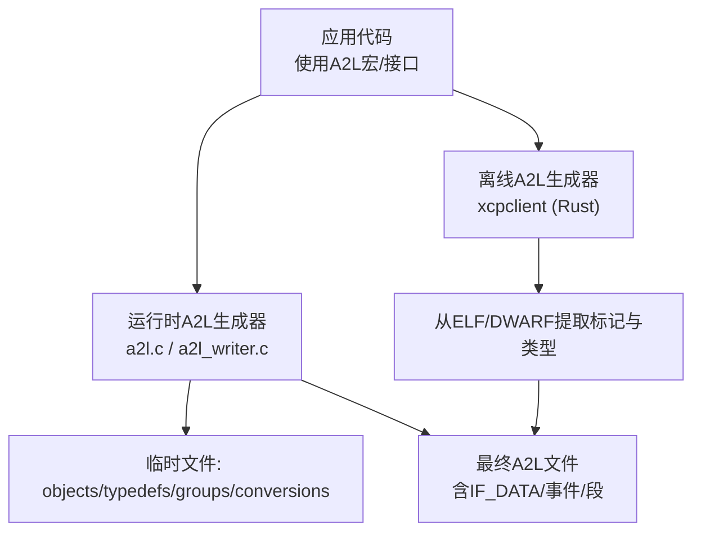
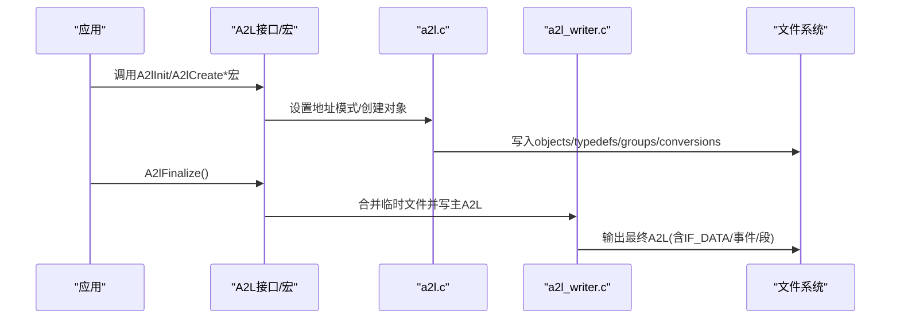
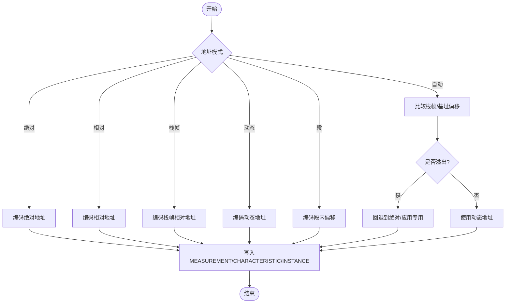
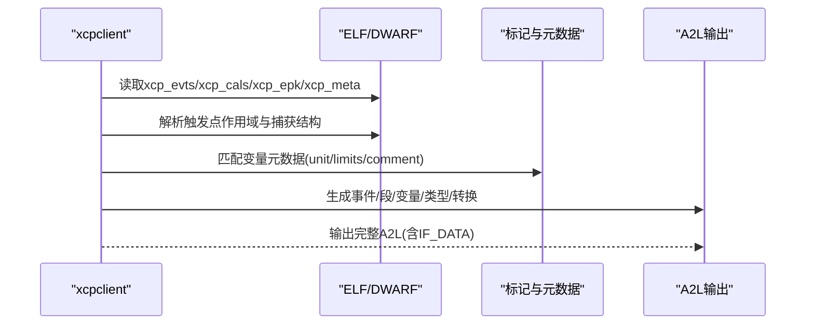
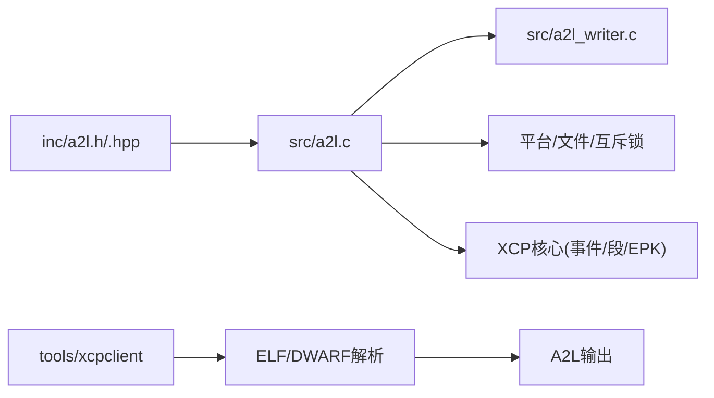

# A2L生成器

<cite>
**本文引用的文件**
- [inc/a2l.h](file://inc/a2l.h)
- [inc/a2l.hpp](file://inc/a2l.hpp)
- [src/a2l.c](file://src/a2l.c)
- [src/a2l_writer.c](file://src/a2l_writer.c)
- [docs/OFFLINE_A2L.md](file://docs/OFFLINE_A2L.md)
- [docs/TECHNICAL.md](file://docs/TECHNICAL.md)
- [tools/xcpclient/README.md](file://tools/xcpclient/README.md)
</cite>

## 目录
1. [简介](#简介)
2. [项目结构](#项目结构)
3. [核心组件](#核心组件)
4. [架构总览](#架构总览)
5. [详细组件分析](#详细组件分析)
6. [依赖关系分析](#依赖关系分析)
7. [性能考量](#性能考量)
8. [故障排查指南](#故障排查指南)
9. [结论](#结论)
10. [附录](#附录)

## 简介
本文件深入解析XCPlite的A2L（ASAM MCD-2 MC）描述文件生成器实现，覆盖运行时与构建时两种生成路径：
- 运行时A2L生成：在目标设备上通过宏与API注册测量、标定参数、类型定义与组，动态写出A2L片段并在连接或最终化阶段合并为完整A2L。
- 构建时A2L生成：通过xcpclient工具读取应用ELF/DWARF中的标记段与调试信息，离线生成完整A2L，无需目标设备运行时的A2L代码。

文档同时阐述元数据处理、类型推断、结构体解析、地址模式选择、A2L格式规范与版本兼容、扩展机制，以及离线工具的用法与高级配置、模板定制与自定义类型支持。

## 项目结构
围绕A2L生成的关键源码与文档分布如下：
- 公共接口与类型推断
  - C接口与宏：inc/a2l.h
  - C++接口与RAII封装：inc/a2l.hpp
- 运行时生成实现
  - 核心逻辑与地址编码：src/a2l.c
  - A2L写入与IF_DATA组装：src/a2l_writer.c
- 离线生成与规范
  - 离线生成说明与规则：docs/OFFLINE_A2L.md
  - 技术细节与标记约定：docs/TECHNICAL.md
  - xcpclient工具使用：tools/xcpclient/README.md

**图示来源**
- [src/a2l.c:1496-1579](file://src/a2l.c#L1496-L1579)
- [src/a2l_writer.c:451-530](file://src/a2l_writer.c#L451-L530)
- [docs/OFFLINE_A2L.md:35-70](file://docs/OFFLINE_A2L.md#L35-L70)

**章节来源**
- [inc/a2l.h:1-730](file://inc/a2l.h#L1-L730)
- [inc/a2l.hpp:1-326](file://inc/a2l.hpp#L1-L326)
- [src/a2l.c:1-800](file://src/a2l.c#L1-L800)
- [src/a2l_writer.c:1-536](file://src/a2l_writer.c#L1-L536)
- [docs/OFFLINE_A2L.md:1-289](file://docs/OFFLINE_A2L.md#L1-L289)
- [docs/TECHNICAL.md:1-200](file://docs/TECHNICAL.md#L1-L200)
- [tools/xcpclient/README.md:1-200](file://tools/xcpclient/README.md#L1-L200)

## 核心组件
- 类型推断与名称映射
  - C/C++编译期类型到A2L类型ID的映射；数组元素类型推导；类型名与记录布局名转换。
- 地址模式与编码
  - 绝对/相对/栈帧/动态/校准段/应用专用等模式的设置与运行时自动选择；溢出检测与回退策略。
- 对象创建与分组
  - 测量、曲线、地图、轴、实例、类型定义、转换方法；自动分组与手动分组。
- 文件组织与合并
  - 多临时文件并行写入，最终化时合并为主A2L；可选模板模式与持久化。
- 离线生成
  - ELF/DWARF解析、事件与段发现、本地变量与捕获变量处理、元数据匹配、类型命名与合并。

**章节来源**
- [inc/a2l.h:77-322](file://inc/a2l.h#L77-L322)
- [src/a2l.c:125-285](file://src/a2l.c#L125-L285)
- [src/a2l.c:456-708](file://src/a2l.c#L456-L708)
- [src/a2l.c:1122-1320](file://src/a2l.c#L1122-L1320)
- [src/a2l_writer.c:451-530](file://src/a2l_writer.c#L451-L530)
- [docs/OFFLINE_A2L.md:97-213](file://docs/OFFLINE_A2L.md#L97-L213)

## 架构总览
运行时A2L生成由“宏/接口 -> 地址模式 -> 对象注册 -> 临时文件 -> 最终化合并”构成；离线生成由“ELF/DWARF解析 -> 事件/段/变量/类型发现 -> A2L输出”构成。两者共享A2L语义与格式约束。

**图示来源**
- [src/a2l.c:1496-1579](file://src/a2l.c#L1496-L1579)
- [src/a2l_writer.c:451-530](file://src/a2l_writer.c#L451-L530)

## 详细组件分析

### 运行时A2L生成器（C/C++接口与实现）
- 类型推断
  - C++：模板特化将基础类型映射为tA2lTypeId；提供GetTypeId/GetTypeIdFromExpr及数组元素类型推导宏。
  - C：_Generic按指针类型分支返回对应类型ID；提供数组元素推导宏。
  - 类型名与记录布局名：A2lGetA2lTypeName_*系列函数将类型ID映射为A2L字符串。
- 地址模式
  - 设置接口：绝对/相对/栈帧/动态/自动/校准段/应用专用；支持按事件名或事件ID设置。
  - 自动模式：比较当前指针相对于栈帧与基址的偏移，优先选择较小且可表示的动态模式；溢出时回退到绝对或应用专用模式。
  - 编码：根据模式计算ECU_ADDRESS与地址扩展，并写入MEASUREMENT/CHARACTERISTIC/INSTANCE等对象。
- 对象创建
  - 标量/数组测量：MEASUREMENT或CHARACTERISTIC VAL_BLK/MAP/CURVE；支持物理单位与转换引用。
  - 标定参数：VALUE/CURVE/MAP；支持共享轴与输入量。
  - 类型定义：TYPEDEF_STRUCTURE + STRUCTURE_COMPONENT；TYPEDEF_MEASUREMENT/CHARACTERISTIC用于字段。
  - 实例：INSTANCE引用已定义的TYPEDEF，带矩阵维度与读写标志。
- 分组与转换
  - 自动分组：按事件或段自动创建GROUP并添加REF_MEASUREMENT/REF_CHARACTERISTIC。
  - 转换：线性转换与枚举转换，统一以“conv.<name>”形式引用。
- 文件与生命周期
  - 初始化：打开objects/typedefs/groups/conversions四个临时文件；注册XCP连接回调以按需最终化。
  - 最终化：合并临时文件到主A2L，写入IF_DATA（协议层、DAQ事件列表、传输层信息）、MOD_PAR（EPK与内存段），关闭文件。

**图示来源**
- [src/a2l.c:713-876](file://src/a2l.c#L713-L876)
- [src/a2l.c:1122-1320](file://src/a2l.c#L1122-L1320)

**章节来源**
- [inc/a2l.h:99-322](file://inc/a2l.h#L99-L322)
- [src/a2l.c:125-285](file://src/a2l.c#L125-L285)
- [src/a2l.c:456-708](file://src/a2l.c#L456-L708)
- [src/a2l.c:889-1080](file://src/a2l.c#L889-L1080)
- [src/a2l.c:1122-1320](file://src/a2l.c#L1122-L1320)
- [src/a2l.c:1496-1579](file://src/a2l.c#L1496-L1579)
- [src/a2l_writer.c:451-530](file://src/a2l_writer.c#L451-L530)

### 构建时A2L生成（xcpclient离线生成）
- 工作原理
  - 从ELF/DWARF中读取事件段xcp_evts、校准段xcp_cals、EPK段xcp_epk、元数据段xcp_meta，以及触发点trg__<modes>__<event>的作用域与捕获结构cap__<event>。
  - 解析局部变量与全局变量的DWARF位置与类型，结合触发点的地址模式，生成MEASUREMENT/CHARACTERISTIC/INSTANCE等对象。
  - 类型命名与合并：对同名但不同内容的类型进行限定或加后缀；嵌套结构与类成员扁平化；枚举生成转换表。
- 工作流与选项
  - 离线模式：仅从ELF/DWARF生成A2L；在线模式：连接目标校验事件与段信息。
  - 过滤与限制：按编译单元、变量名正则、是否仅包含带元数据的变量等。
  - 默认事件：为无固定事件的变量分配默认事件，便于同步采集。
- 兼容性
  - 目标地址方案签名（XCPLITE__CASDD/ACSDD/AXSDD/CXSDD）决定校准段的寻址方式，并写入A2L头部PROJECT_NO。
  - 事件与段顺序稳定，确保A2L与目标一致。

**图示来源**
- [docs/OFFLINE_A2L.md:15-33](file://docs/OFFLINE_A2L.md#L15-L33)
- [docs/OFFLINE_A2L.md:97-213](file://docs/OFFLINE_A2L.md#L97-L213)
- [docs/TECHNICAL.md:96-200](file://docs/TECHNICAL.md#L96-L200)
- [tools/xcpclient/README.md:24-37](file://tools/xcpclient/README.md#L24-L37)

**章节来源**
- [docs/OFFLINE_A2L.md:35-70](file://docs/OFFLINE_A2L.md#L35-L70)
- [docs/OFFLINE_A2L.md:97-213](file://docs/OFFLINE_A2L.md#L97-L213)
- [docs/TECHNICAL.md:96-200](file://docs/TECHNICAL.md#L96-L200)
- [tools/xcpclient/README.md:24-37](file://tools/xcpclient/README.md#L24-L37)

### A2L文件格式、版本与扩展
- 格式要点
  - 头部：ASAP2_VERSION、PROJECT、MODULE、HEADER（含PROJECT_NO）。
  - 模块通用：字节序、对齐、ALIGNMENT_*。
  - IF_DATA XCP：PROTOCOL_LAYER、DAQ事件列表、XCP_ON_TCP_IP/XCP_ON_UDP_IP传输层信息。
  - MOD_PAR：EPK与MEMORY_SEGMENT（支持页切换、校验和、访问权限）。
  - 对象：MEASUREMENT/CHARACTERISTIC/AXIS_PTS/INSTANCE/TYPEDEF_*等。
- 版本兼容
  - 协议层版本与可选命令集随配置变化；时间戳单位与粒度；打包模式与Level1命令。
- 扩展机制
  - 符号前缀：A2L_MODE_SYMBOL_PREFIX在项目名与符号间加点分隔，避免冲突。
  - 自动分组：A2L_MODE_AUTO_GROUPS按事件/段自动生成GROUP。
  - 模板模式：A2L_MODE_WRITE_TEMPLATE仅输出骨架（事件/段/IF_DATA），供其他工具补充。
  - 嵌入AML：A2L_MODE_EMBED_AML_FILE预留选项，当前示例使用/include指令引用外部AML。

**章节来源**
- [src/a2l_writer.c:42-57](file://src/a2l_writer.c#L42-L57)
- [src/a2l_writer.c:94-177](file://src/a2l_writer.c#L94-L177)
- [src/a2l_writer.c:180-207](file://src/a2l_writer.c#L180-L207)
- [src/a2l_writer.c:251-289](file://src/a2l_writer.c#L251-L289)
- [src/a2l_writer.c:329-363](file://src/a2l_writer.c#L329-L363)
- [src/a2l_writer.c:451-530](file://src/a2l_writer.c#L451-L530)
- [inc/a2l.h:55-67](file://inc/a2l.h#L55-L67)

### 离线A2L生成工具使用方法与高级配置
- 基本流程
  - 构建应用并保留调试信息（-g，Debug/RelWithDebInfo）。
  - 离线生成：xcpclient --offline --elf <binary> --create-a2l --a2l <output.a2l>。
  - 在线生成：连接目标后，从目标获取事件与段信息，再插入ELF中的变量与类型。
- 高级选项
  - 过滤：--elf-unit-filter、--elf-var-filter、--elf-skip-no-metadata。
  - 默认事件：--default-event <id|name>为无固定事件变量分配事件。
  - 模板：--create-a2l-template生成仅含IF_DATA/事件/段的骨架A2L。
  - EPK检查：与目标报告不一致时中止，可用-y跳过。
- 注意事项
  - macOS Mach-O不支持（无DWARF）；需Linux或嵌入式ELF目标。
  - 触发函数不可内联；寄存器变量需volatile或捕获。

**章节来源**
- [docs/OFFLINE_A2L.md:35-70](file://docs/OFFLINE_A2L.md#L35-L70)
- [docs/OFFLINE_A2L.md:85-95](file://docs/OFFLINE_A2L.md#L85-L95)
- [docs/OFFLINE_A2L.md:117-163](file://docs/OFFLINE_A2L.md#L117-L163)
- [docs/OFFLINE_A2L.md:215-269](file://docs/OFFLINE_A2L.md#L215-L269)
- [tools/xcpclient/README.md:24-37](file://tools/xcpclient/README.md#L24-L37)
- [tools/xcpclient/README.md:94-161](file://tools/xcpclient/README.md#L94-L161)

### A2L模板定制与自定义类型支持
- 模板定制
  - 使用--create-a2l-template生成骨架，再用A2L编辑器或a2ltool补充变量与类型。
  - 通过A2L_MODE_WRITE_TEMPLATE在运行时仅输出骨架，便于CI流水线集成。
- 自定义类型
  - 运行时：通过A2lTypedefBegin_/A2lTypedefComponent_等接口定义TYPEDEF_STRUCTURE与STRUCTURE_COMPONENT；字段可使用TYPEDEF_MEASUREMENT/CHARACTERISTIC。
  - 构建时：xcpclient从DWARF结构/类类型推导TYPEDEF_STRUCTURE，字段命名与嵌套结构自动处理；枚举生成COMPU_VTAB。
  - 扩展建议：保持类型布局稳定；复杂容器（std::vector等）需显式标注或黑名单排除。

**章节来源**
- [src/a2l.c:955-1080](file://src/a2l.c#L955-L1080)
- [docs/OFFLINE_A2L.md:177-195](file://docs/OFFLINE_A2L.md#L177-L195)
- [docs/OFFLINE_A2L.md:215-239](file://docs/OFFLINE_A2L.md#L215-L239)
- [tools/xcpclient/README.md:108-113](file://tools/xcpclient/README.md#L108-L113)

## 依赖关系分析
- 运行时生成器依赖
  - XCP核心：事件、段、EPK、地址编码/解码、平台互斥锁与文件操作。
  - 配置宏：XCP_ENABLE_*控制地址模式与功能开关；OPTION_*控制SHM模式、持久化等。
- 离线生成器依赖
  - ELF/DWARF解析库；正则表达式过滤；网络通信（在线模式）。
- 耦合与内聚
  - a2l.c负责状态机与对象注册，a2l_writer.c专注A2L文本输出；职责清晰，内聚度高。
  - 接口集中在inc/a2l.h/.hpp，降低耦合。

**图示来源**
- [src/a2l.c:1-33](file://src/a2l.c#L1-L33)
- [src/a2l_writer.c:1-34](file://src/a2l_writer.c#L1-L34)
- [docs/TECHNICAL.md:96-200](file://docs/TECHNICAL.md#L96-L200)

**章节来源**
- [src/a2l.c:1-33](file://src/a2l.c#L1-L33)
- [src/a2l_writer.c:1-34](file://src/a2l_writer.c#L1-L34)
- [docs/TECHNICAL.md:96-200](file://docs/TECHNICAL.md#L96-L200)

## 性能考量
- 运行时开销
  - A2L生成主要涉及文件I/O与少量字符串格式化；临时文件分片写入减少锁竞争。
  - 自动地址模式在首次使用时进行偏移比较与溢出检查，后续复用缓存的地址扩展。
- 离线生成开销
  - DWARF解析与正则过滤可能耗时；可通过--elf-unit-limit与过滤器缩小范围。
- 优化建议
  - 启用A2L_MODE_WRITE_ONCE配合持久化，避免重复生成。
  - 合理设置事件优先级与周期，减少A2L中DAQ事件数量。
  - 使用共享轴减少重复轴定义。

[本节为通用指导，不直接分析具体文件]

## 故障排查指南
- 常见问题
  - 地址溢出：动态/相对模式下偏移超出位宽，检查基址与栈帧是否正确传递。
  - 未找到事件：自动/相对模式需要有效事件名或ID；确认事件已创建且名称正确。
  - 变量缺失：局部变量被优化至寄存器，需volatile或使用捕获；无DWARF位置的变量无法注册。
  - EPK不匹配：A2L与目标版本不一致，重新生成或允许覆盖。
  - macOS二进制：Mach-O不含DWARF，需在Linux或嵌入式ELF目标上生成。
- 诊断信息
  - 日志级别与消息：xcpclient与运行时DBG_PRINT_*提供详细上下文。
  - 警告与错误：类型冲突、重复事件捕获、元数据未匹配等。

**章节来源**
- [src/a2l.c:713-876](file://src/a2l.c#L713-L876)
- [src/a2l.c:1463-1478](file://src/a2l.c#L1463-L1478)
- [docs/OFFLINE_A2L.md:244-269](file://docs/OFFLINE_A2L.md#L244-L269)
- [tools/xcpclient/README.md:35-37](file://tools/xcpclient/README.md#L35-L37)

## 结论
XCPlite的A2L生成器提供了完整的运行时与构建时双路径：
- 运行时：通过宏与API灵活注册测量与标定对象，支持多种地址模式与自动选择，适合资源受限或需动态生成的场景。
- 构建时：xcpclient基于ELF/DWARF离线生成，保证A2L稳定性与可重复性，适合CI/CD与跨平台开发。
二者共同遵循A2L标准与XCPlite约定，支持模板定制与扩展，满足多样化工程需求。

[本节为总结，不直接分析具体文件]

## 附录
- 快速参考
  - 运行时初始化：A2lInit(addr, port, useTCP, mode)
  - 最终化：A2lFinalize()
  - 离线生成：xcpclient --offline --elf <bin> --create-a2l --a2l <out.a2l>
- 常用模式
  - A2L_MODE_WRITE_ALWAYS：强制重写A2L
  - A2L_MODE_WRITE_ONCE：仅在新构建时生成一次
  - A2L_MODE_FINALIZE_ON_CONNECT：连接时最终化
  - A2L_MODE_AUTO_GROUPS：自动分组
  - A2L_MODE_SYMBOL_PREFIX：符号前缀
  - A2L_MODE_WRITE_TEMPLATE：仅输出模板
  - A2L_MODE_EVENT_CONVERSION：事件枚举转换
  - A2L_MODE_EMBED_AML_FILE：嵌入AML（预留）

**章节来源**
- [inc/a2l.h:55-67](file://inc/a2l.h#L55-L67)
- [src/a2l.c:1496-1579](file://src/a2l.c#L1496-L1579)
- [tools/xcpclient/README.md:94-113](file://tools/xcpclient/README.md#L94-L113)