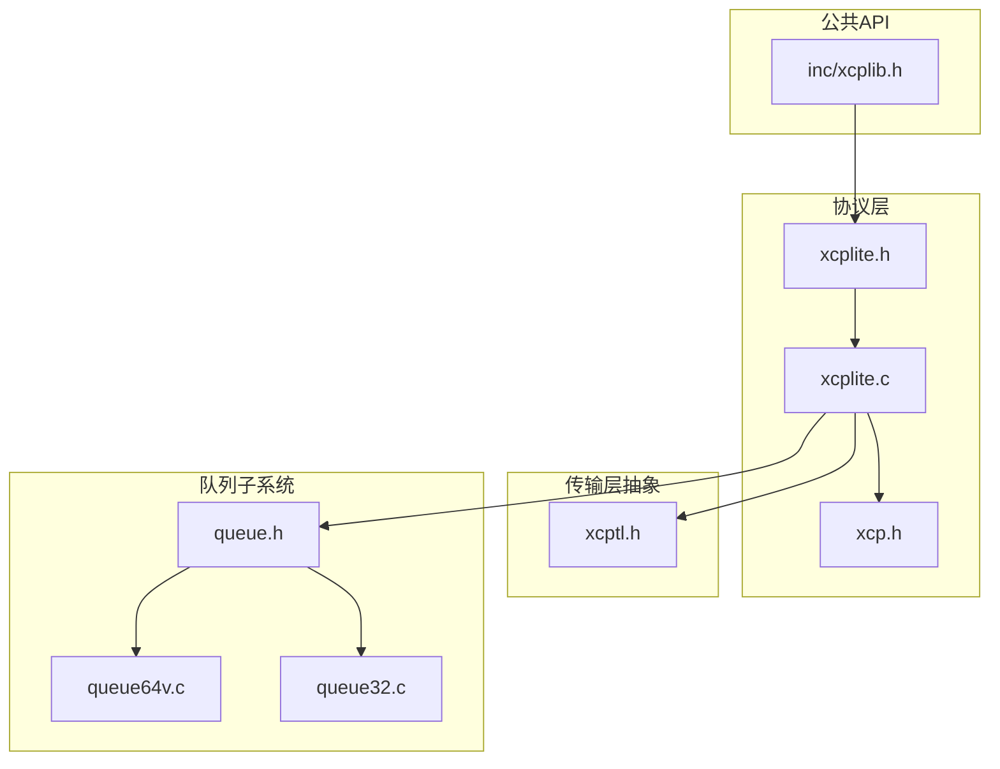
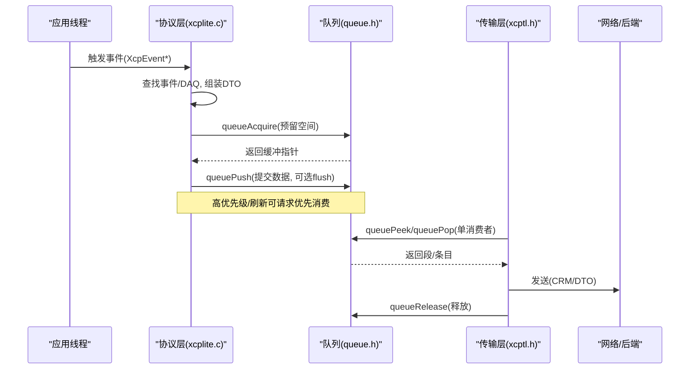
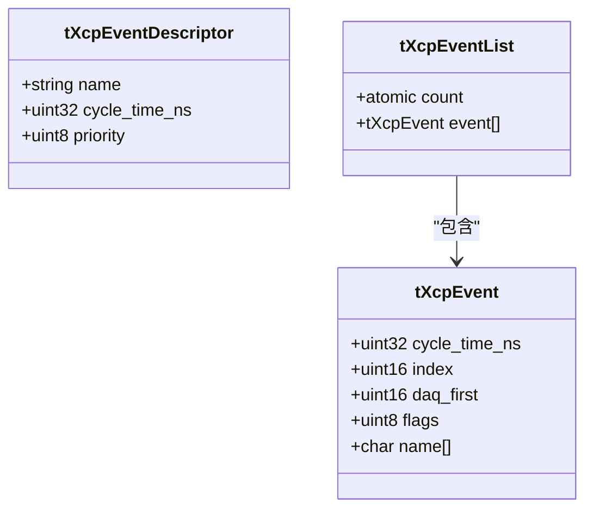
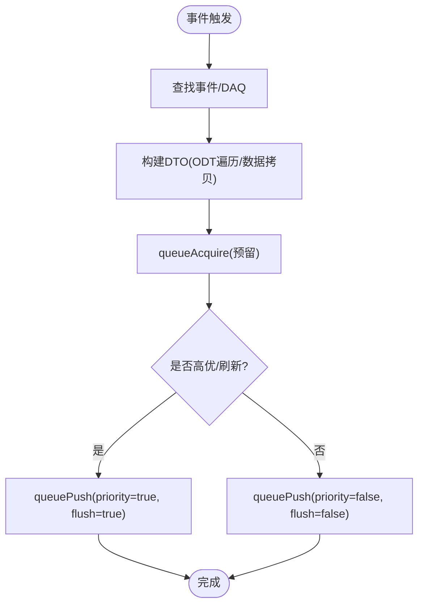
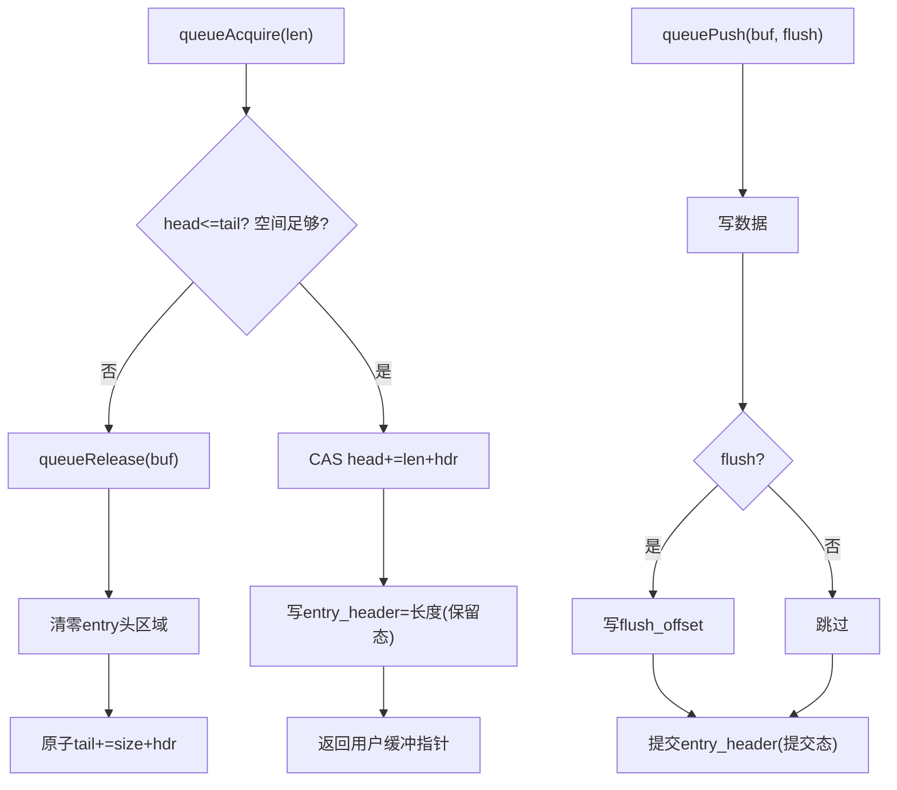
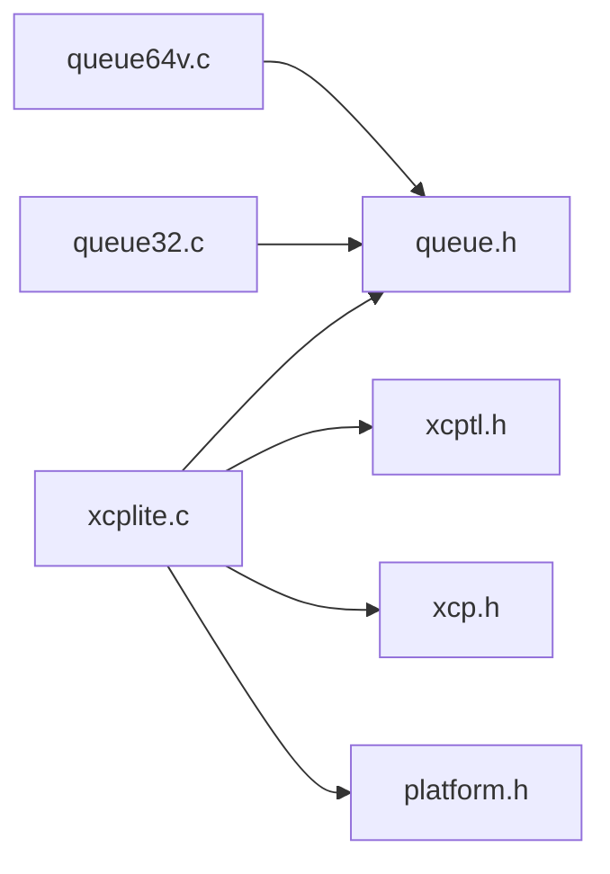

# DAQ事件系统

<cite>
**本文引用的文件**
- [src/xcplite.h](file://src/xcplite.h)
- [src/xcplite.c](file://src/xcplite.c)
- [src/xcp.h](file://src/xcp.h)
- [inc/xcplib.h](file://inc/xcplib.h)
- [src/queue.h](file://src/queue.h)
- [src/queue64v.c](file://src/queue64v.c)
- [src/queue32.c](file://src/queue32.c)
- [src/xcptl.h](file://src/xcptl.h)
</cite>

## 目录
1. [简介](#简介)
2. [项目结构](#项目结构)
3. [核心组件](#核心组件)
4. [架构总览](#架构总览)
5. [详细组件分析](#详细组件分析)
6. [依赖关系分析](#依赖关系分析)
7. [性能考量](#性能考量)
8. [故障排查指南](#故障排查指南)
9. [结论](#结论)
10. [附录：开发指南](#附录开发指南)

## 简介
本文件系统性解析XCPlite的DAQ事件系统，围绕事件驱动的数据采集模型展开，涵盖事件注册、触发机制与数据队列管理；深入说明无锁队列实现原理、内存池分配与缓冲区管理策略；阐述多线程数据采集的并发控制、优先级调度与实时性保证；并提供性能优化、内存使用分析与调试支持建议，以及自定义事件处理器和采集后端的开发指引。

## 项目结构
- 协议层与状态：xcplite.h/c 定义XCP协议层接口、全局共享状态（tXcpData）与进程本地状态（tXcpLocalData），并集中管理DAQ列表、事件表、溢出计数等。
- 传输层抽象：xcptl.h 提供发送队列处理、等待队列空、发送CRM、获取消息计数器等接口。
- 队列子系统：queue.h 为统一API；queue64v.c 为64位平台无锁可变长队列；queue32.c 为32位/Windows/原子模拟场景下的互斥量队列，支持段累积。
- 协议常量：xcp.h 定义命令、响应、事件码、DAQ模式/状态等。
- 公共API：inc/xcplib.h 暴露事件创建、查找、索引等对外能力。

**图示来源**
- [src/xcplite.h:385-423](file://src/xcplite.h#L385-L423)
- [src/xcplite.c:188-241](file://src/xcplite.c#L188-L241)
- [src/xcptl.h:19-26](file://src/xcptl.h#L19-L26)
- [src/queue.h:88-187](file://src/queue.h#L88-L187)
- [src/queue64v.c:233-261](file://src/queue64v.c#L233-L261)
- [src/queue32.c:85-100](file://src/queue32.c#L85-L100)
- [src/xcp.h:132-183](file://src/xcp.h#L132-L183)

**章节来源**
- [src/xcplite.h:385-423](file://src/xcplite.h#L385-L423)
- [src/xcplite.c:188-241](file://src/xcplite.c#L188-L241)
- [src/xcptl.h:19-26](file://src/xcptl.h#L19-L26)
- [src/queue.h:88-187](file://src/queue.h#L88-L187)
- [src/queue64v.c:233-261](file://src/queue64v.c#L233-L261)
- [src/queue32.c:85-100](file://src/queue32.c#L85-L100)
- [src/xcp.h:132-183](file://src/xcp.h#L132-L183)

## 核心组件
- 事件描述符与事件表：tXcpEventDescriptor/tXcpEvent/tXcpEventList，支持静态链接期预注册或运行时动态创建，维护周期时间、优先级、名称、关联DAQ链表等。
- DAQ列表与ODT：tXcpDaqLists/tXcpDaqList/tXcpOdt，以紧凑布局存储DAQ列表、ODT、地址/尺寸表，支持事件到DAQ的映射。
- 全局与本地状态：tXcpData（跨进程共享）包含daq_running、daq_lists、overflow_count、event_list等；tXcpLocalData（进程内）包含队列句柄、MTA、时钟信息等。
- 队列抽象：queue.h 统一acquire/push/peek/pop/release接口，屏蔽底层无锁/有锁差异。
- 传输层：xcptl.h 提供发送队列处理、等待空、发送CRM、计数器获取等。

**章节来源**
- [src/xcplite.h:126-177](file://src/xcplite.h#L126-L177)
- [src/xcplite.h:224-242](file://src/xcplite.h#L224-L242)
- [src/xcplite.h:301-376](file://src/xcplite.h#L301-L376)
- [src/xcplite.h:385-423](file://src/xcplite.h#L385-L423)
- [src/xcplite.h:427-495](file://src/xcplite.h#L427-L495)
- [src/queue.h:88-187](file://src/queue.h#L88-L187)
- [src/xcptl.h:19-26](file://src/xcptl.h#L19-L26)

## 架构总览
事件驱动采集的核心流程：
- 事件注册：通过链接期section扫描或运行时创建，将事件加入事件表，建立事件到DAQ列表的映射。
- 事件触发：应用侧在合适时机调用XcpEvent系列函数，封装数据基址与时钟，进入协议层处理。
- 数据入队：协议层根据事件配置生成DTO，写入传输层队列（无锁或互斥）。
- 消费发送：传输层消费者循环取出队列项，填充CTR/LEN等头部，发送到网络或后端。

**图示来源**
- [src/xcplite.h:183-195](file://src/xcplite.h#L183-L195)
- [src/xcplite.c:776-800](file://src/xcplite.c#L776-L800)
- [src/queue.h:122-176](file://src/queue.h#L122-L176)
- [src/xcptl.h:19-26](file://src/xcptl.h#L19-L26)

## 详细组件分析

### 事件系统与事件表
- 事件描述符：tXcpEventDescriptor用于链接期预注册，包含名称、周期(ns)、优先级等。
- 事件表：tXcpEventList维护事件数组与原子计数，支持多实例命名（自动追加索引）。
- 事件创建：XcpCreateEvent/XcpCreateEventInstance提供线程安全创建；XcpGetEventIndex/XcpFindEvent用于查询。
- 事件启用/检查：XcpEventEnable控制启停；XcpCheckDaqLists结合ApplXcpCheckMemory检查运行/选择状态。

**图示来源**
- [src/xcplite.h:126-177](file://src/xcplite.h#L126-L177)
- [src/xcplite.h:224-242](file://src/xcplite.h#L224-L242)

**章节来源**
- [src/xcplite.h:126-177](file://src/xcplite.h#L126-L177)
- [src/xcplite.h:224-242](file://src/xcplite.h#L224-L242)
- [inc/xcplib.h:246-272](file://inc/xcplib.h#L246-L272)

### 触发机制与数据路径
- 触发入口：XcpEvent/XcpEventAt/XcpEventExt*系列，支持绝对基址、动态基址、显式基址列表、变参列表及带时钟触发。
- 协议层处理：根据事件找到关联DAQ列表，遍历ODT，拷贝数据至传输层队列；必要时设置时间戳与标志。
- 优先级与刷新：queuePush支持priority/flush标记，促使消费者优先处理或立即刷新段。

**图示来源**
- [src/xcplite.h:183-195](file://src/xcplite.h#L183-L195)
- [src/queue.h:122-139](file://src/queue.h#L122-L139)

**章节来源**
- [src/xcplite.h:183-195](file://src/xcplite.h#L183-L195)
- [src/xcplite.c:776-800](file://src/xcplite.c#L776-L800)

### 无锁队列实现原理（64位可变长）
- 设计要点：多生产者单消费者；entry_header为原子32位，编码长度与提交状态；head/tail为原子64位；支持packets_lost统计与flush_offset优先消费提示。
- 关键操作：
  - queueAcquire：CAS推进head，预留entry，写长度到entry_header（保留态）。
  - queuePush：写完整数据后，提交entry_header（高位置提交标志），可选设置flush_offset。
  - queuePeek：按index顺序读取已提交entry，缓存优化peek循环。
  - queueRelease：清零entry头区域，原子推进tail，使producer可见可用空间。
- 内存布局：队列头对齐缓存行，buffer_size预留尾部wrap-around空间，避免越界。

**图示来源**
- [src/queue64v.c:216-261](file://src/queue64v.c#L216-L261)
- [src/queue64v.c:366-485](file://src/queue64v.c#L366-L485)
- [src/queue64v.c:512-658](file://src/queue64v.c#L512-L658)

**章节来源**
- [src/queue64v.c:216-261](file://src/queue64v.c#L216-L261)
- [src/queue64v.c:366-485](file://src/queue64v.c#L366-L485)
- [src/queue64v.c:512-658](file://src/queue64v.c#L512-L658)

### 有锁队列实现（32位/Windows/原子模拟）
- 设计要点：多生产者单消费者；以“段”为单位累积多个消息，减少系统调用开销；每个消息携带CTR/LEN头部；使用互斥量保护段队列。
- 关键操作：
  - queueAcquire：在当前段中预留消息空间，若不足则申请新段；未提交时CTR占位。
  - queuePush：标记消息提交，CTR待消费者设置；支持flush强制切分新段。
  - queuePop：一次性返回完整段，消费者遍历消息设置CTR并发送。
  - queueRelease：移动读指针，释放段。
- 优势：适合小消息高频场景，降低发送次数；劣势：需互斥，延迟略高于无锁。

**章节来源**
- [src/queue32.c:37-84](file://src/queue32.c#L37-L84)
- [src/queue32.c:146-200](file://src/queue32.c#L146-L200)
- [src/queue32.c:206-304](file://src/queue32.c#L206-L304)
- [src/queue32.c:333-417](file://src/queue32.c#L333-L417)

### 内存池分配与缓冲区管理
- 队列内存：
  - 64位无锁：可选择堆分配或用户提供的内存（queueInitFromMemory），支持在共享内存中放置队列。
  - 32位有锁：固定大小的段数组，每段承载多个消息，最大段大小受配置限制。
- 对齐与边界：所有实现均对payload进行对齐，确保原子访问与网络栈要求；预留尾部空间避免环形缓冲越界。
- 溢出处理：packets_lost计数用于监控丢包；应用可通过queueLevel观察队列水位。

**章节来源**
- [src/queue.h:101-114](file://src/queue.h#L101-L114)
- [src/queue64v.c:265-326](file://src/queue64v.c#L265-L326)
- [src/queue32.c:146-200](file://src/queue32.c#L146-L200)

### 多线程并发控制与优先级调度
- 事件表访问：创建事件时使用互斥量保护；事件计数使用原子acquire/release保证可见性。
- 队列并发：
  - 64位无锁：生产者线程安全，消费者单线程；entry_header原子保证提交一致性。
  - 32位有锁：互斥量保护段队列，消费者单线程。
- 优先级与实时性：
  - 事件优先级：事件描述符中的priority字段影响DAQ列表优先级。
  - 队列优先级：queuePush支持priority/flush，促使消费者优先处理或立即刷新段。
  - 消费者侧：传输层循环调用XcpTlHandleTransmitQueue，配合flush请求快速发送高优数据。

**章节来源**
- [src/xcplite.c:776-800](file://src/xcplite.c#L776-L800)
- [src/queue64v.c:465-485](file://src/queue64v.c#L465-L485)
- [src/queue32.c:283-304](file://src/queue32.c#L283-L304)
- [src/xcptl.h:19-26](file://src/xcptl.h#L19-L26)

### 实时性保证与时钟
- 时钟源：ApplXcpGetClock64提供高精度时钟；部分事件支持带时钟触发（XcpEventAt*）。
- 同步：GET_DAQ_CLOCK支持32/64位时间戳与同步状态；可选多播时钟同步。
- 时间戳嵌入：DAQ列表模式可启用时间戳字段，便于下游对齐与分析。

**章节来源**
- [src/xcplite.h:558-577](file://src/xcplite.h#L558-L577)
- [src/xcp.h:742-778](file://src/xcp.h#L742-L778)

## 依赖关系分析
- 协议层依赖：
  - 队列抽象：queue.h 统一API，具体实现由编译选项决定。
  - 传输层：xcptl.h 提供发送队列处理与CRM发送。
  - 平台原语：platform.h 提供原子与互斥量。
- 模块耦合：
  - xcplite.c 作为核心，协调事件、DAQ、队列与传输层。
  - xcp.h 提供协议常量，被多处引用。
  - queue64v.c/queue32.c 分别针对目标平台优化。

**图示来源**
- [src/xcplite.c:49-85](file://src/xcplite.c#L49-L85)
- [src/queue.h:1-23](file://src/queue.h#L1-L23)
- [src/xcptl.h:1-26](file://src/xcptl.h#L1-L26)
- [src/xcp.h:1-20](file://src/xcp.h#L1-L20)

**章节来源**
- [src/xcplite.c:49-85](file://src/xcplite.c#L49-L85)
- [src/queue.h:1-23](file://src/queue.h#L1-L23)
- [src/xcptl.h:1-26](file://src/xcptl.h#L1-L26)
- [src/xcp.h:1-20](file://src/xcp.h#L1-L20)

## 性能考量
- 队列选择：
  - 64位无锁队列适合高吞吐、低延迟场景；注意变量长度带来的内存清理开销。
  - 32位有锁队列通过段累积减少系统调用，适合小消息高频。
- 对齐与拷贝：
  - 合理设置QUEUE_PAYLOAD_SIZE_ALIGNMENT以减少拷贝与对齐损失。
  - ODT尺寸尽量对齐以提升批量拷贝效率。
- 溢出与丢包：
  - 监控packets_lost与queueLevel，调整队列大小或降低事件频率。
- 优先级与刷新：
  - 对关键事件使用priority/flush，确保及时发送。
- 内存占用：
  - 评估XCP_DAQ_MEM_SIZE与队列buffer_size，避免过大导致资源紧张。

[本节为通用指导，不直接分析具体文件]

## 故障排查指南
- 常见问题定位：
  - 事件未触发：检查事件是否存在（XcpFindEvent）、是否启用（XcpEventEnable）、DAQ是否运行（XcpIsDaqRunning）。
  - 队列溢出：观察packets_lost与queueLevel，增大队列或降低事件频率。
  - 数据不一致：确认事件数据基址有效，避免在触发期间修改共享数据。
- 调试支持：
  - 日志级别：XcpSetLogLevel控制输出。
  - 指标：TEST_ENABLE_DBG_METRICS下可统计事件数、发送包数等。
  - 队列统计：queueLevel可获取当前队列长度与最大容量。

**章节来源**
- [src/xcplite.h:107-108](file://src/xcplite.h#L107-L108)
- [src/xcplite.c:335-343](file://src/xcplite.c#L335-L343)
- [src/queue64v.c:512-525](file://src/queue64v.c#L512-L525)
- [src/queue32.c:313-326](file://src/queue32.c#L313-L326)

## 结论
XCPlite的DAQ事件系统以事件为中心，结合灵活的队列抽象与高效的无锁/有锁实现，提供了高性能、可扩展的数据采集能力。通过事件表、DAQ列表与ODT的紧密协作，系统能够支持多种触发模式、优先级调度与实时性保证。合理的内存管理与溢出监控确保了在高负载下的稳定性。开发者可基于此框架扩展自定义事件处理器与采集后端。

[本节为总结，不直接分析具体文件]

## 附录：开发指南

### 自定义事件处理器
- 步骤：
  1. 创建事件：使用XcpCreateEvent或XcpCreateEventInstance注册事件，指定周期与优先级。
  2. 绑定DAQ：通过SET_DAQ_PTR/WRITE_DAQ配置ODT与地址，将事件与DAQ列表关联。
  3. 触发事件：在合适时机调用XcpEvent*系列函数，传入数据基址与时钟。
  4. 监控与调优：使用queueLevel与packets_lost监控队列，调整参数。
- 注意事项：
  - 确保数据基址有效且生命周期覆盖触发时刻。
  - 高优先级事件建议使用priority/flush提升实时性。

**章节来源**
- [inc/xcplib.h:246-272](file://inc/xcplib.h#L246-L272)
- [src/xcplite.h:183-195](file://src/xcplite.h#L183-L195)
- [src/queue.h:122-139](file://src/queue.h#L122-L139)

### 自定义采集后端
- 步骤：
  1. 实现传输层回调：注册ApplXcpRegister*系列回调，如StartDaq/StopDaq等。
  2. 集成队列：在消费者循环中调用XcpTlHandleTransmitQueue，处理队列项并发送到后端。
  3. 时钟与同步：提供ApplXcpGetClock64与相关状态，支持时间戳与同步。
- 注意事项：
  - 确保单消费者模型，避免竞争。
  - 合理设置队列大小与对齐，平衡延迟与吞吐。

**章节来源**
- [src/xcplite.h:606-627](file://src/xcplite.h#L606-L627)
- [src/xcptl.h:19-26](file://src/xcptl.h#L19-L26)
- [src/xcplite.h:558-577](file://src/xcplite.h#L558-L577)