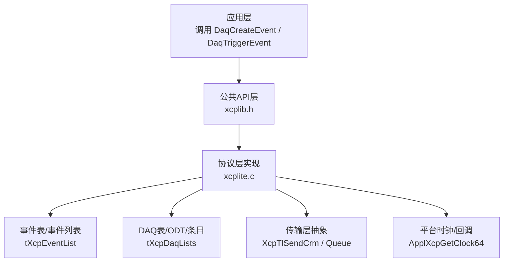
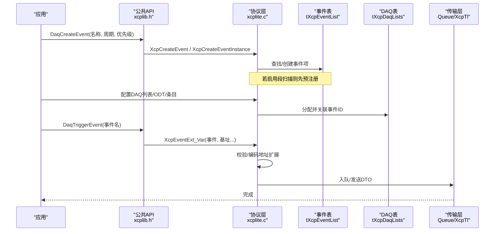
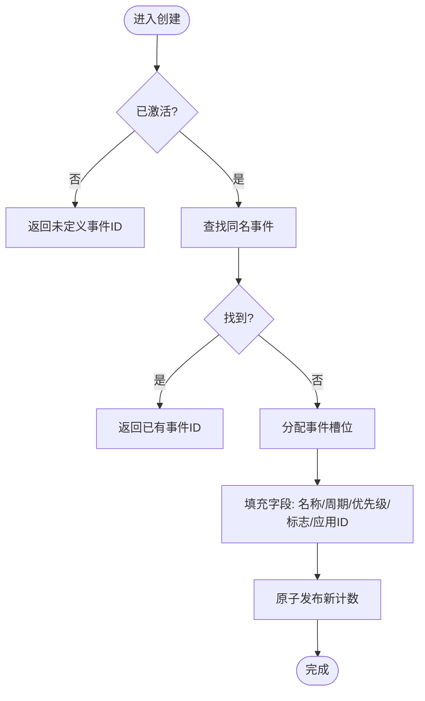
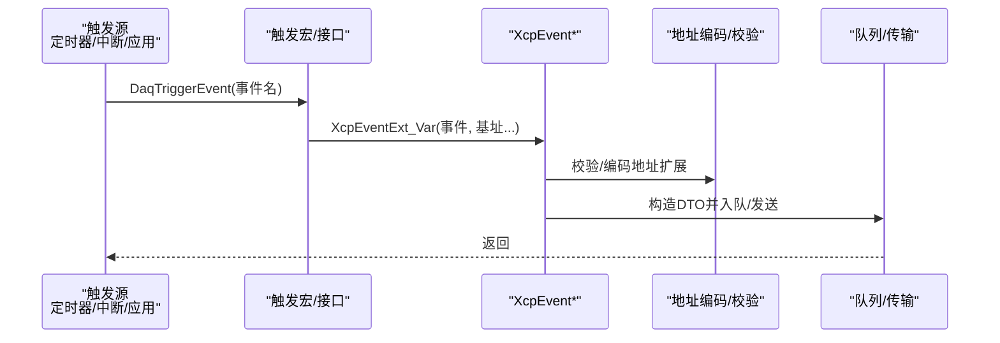
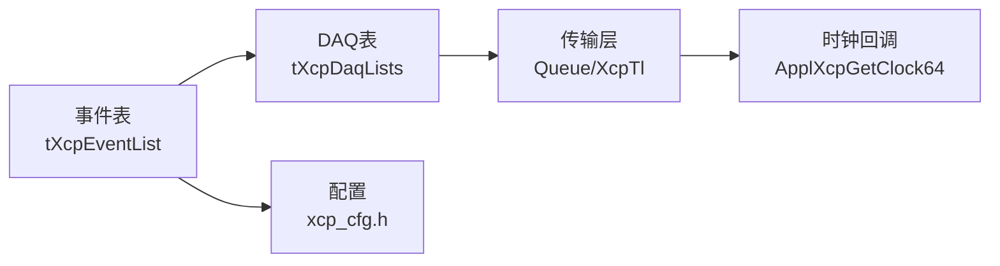

# 事件管理

<cite>
**本文引用的文件**
- [xcplite.h](file://src/xcplite.h)
- [xcplite.c](file://src/xcplite.c)
- [xcplib.h](file://inc/xcplib.h)
- [xcp_cfg.h](file://src/xcp_cfg.h)
</cite>

## 目录
1. [简介](#简介)
2. [项目结构](#项目结构)
3. [核心组件](#核心组件)
4. [架构总览](#架构总览)
5. [详细组件分析](#详细组件分析)
6. [依赖关系分析](#依赖关系分析)
7. [性能考虑](#性能考虑)
8. [故障排查指南](#故障排查指南)
9. [结论](#结论)
10. [附录](#附录)

## 简介
本文件系统性解析 XCPlite 的 DAQ 事件管理系统，覆盖事件的创建、注册与生命周期管理；事件触发机制（定时器、外部信号、软件触发）；事件优先级调度与资源分配策略；配置选项、性能调优参数与调试支持；以及自定义事件处理器与触发源的集成方法。文档以源码为依据，提供代码级图示与路径引用，便于读者快速定位实现细节。

## 项目结构
XCPlite 的事件系统由以下关键部分组成：
- 公共 API 与宏：定义事件描述符、创建与触发接口、地址扩展与栈帧基址获取等。
- 协议层实现：维护事件表、DAQ 列表、状态机、触发处理流程、队列与异步命令执行。
- 配置头：控制事件数量、内存大小、时钟分辨率、功能开关等编译期选项。

图表来源
- [xcplib.h:396-483](file://inc/xcplib.h#L396-L483)
- [xcplite.c:776-1074](file://src/xcplite.c#L776-L1074)
- [xcplite.c:1076-1200](file://src/xcplite.c#L1076-L1200)
- [xcplite.c:1775-1907](file://src/xcplite.c#L1775-L1907)
- [xcp_cfg.h:41-81](file://src/xcp_cfg.h#L41-L81)

章节来源
- [xcplib.h:396-483](file://inc/xcplib.h#L396-L483)
- [xcplite.c:776-1074](file://src/xcplite.c#L776-L1074)
- [xcplite.c:1076-1200](file://src/xcplite.c#L1076-L1200)
- [xcplite.c:1775-1907](file://src/xcplite.c#L1775-L1907)
- [xcp_cfg.h:41-81](file://src/xcp_cfg.h#L41-L81)

## 核心组件
- 事件描述符与预注册
  - tXcpEventDescriptor：包含名称、周期时间（纳秒）、优先级，用于链接期段扫描预注册事件。
  - XCP_EVENT_SECTION_ATTR：将事件描述符放入特定段（如 xcp_evts），供启动时扫描并批量注册。
- 动态事件列表
  - tXcpEvent：运行时事件项，含周期时间、实例索引、关联的第一个 DAQ 列表、标志位（禁用/优先级）、名称等。
  - tXcpEventList：原子计数 + 事件数组，支持并发安全访问。
- DAQ 表与 ODT
  - tXcpDaqList：DAQ 列表项，关联事件 ID、模式、状态、优先级、地址扩展等。
  - tXcpOdt：数据对象表项，描述采集的数据块范围与大小。
  - tXcpDaqLists：集中管理 DAQ/ODT/条目地址与大小的线性缓冲区。
- 触发与发送
  - XcpEvent* 系列：触发事件，支持绝对/相对/动态基址、带时间戳变体、可变参数基址列表。
  - XcpSendEvent：发送服务文本或终止会话等事件消息。
- 配置与能力
  - xcp_cfg.h：事件数量上限、DAQ 内存大小、时钟分辨率、功能开关（如事件信息、保留器、控制等）。

章节来源
- [xcplite.h:126-181](file://src/xcplite.h#L126-L181)
- [xcplite.h:224-293](file://src/xcplite.h#L224-L293)
- [xcplite.h:299-376](file://src/xcplite.h#L299-L376)
- [xcplib.h:314-483](file://inc/xcplib.h#L314-L483)
- [xcp_cfg.h:41-81](file://src/xcp_cfg.h#L41-L81)
- [xcp_cfg.h:361-389](file://src/xcp_cfg.h#L361-L389)

## 架构总览
下图展示事件从创建到触发的整体流程，包括预注册、动态创建、DAQ 关联、触发与发送。

图表来源
- [xcplib.h:396-483](file://inc/xcplib.h#L396-L483)
- [xcplite.c:776-1074](file://src/xcplite.c#L776-L1074)
- [xcplite.c:1076-1200](file://src/xcplite.c#L1076-L1200)
- [xcplite.c:1775-1907](file://src/xcplite.c#L1775-L1907)

## 详细组件分析

### 事件创建与注册（DaqCreateEvent 与预注册）
- 段扫描预注册
  - 在初始化阶段扫描 xcp_evts 段，按名称查找或创建事件，保持持久化后的稳定顺序。
  - 使用 __start_xcp_evts/__stop_xcp_evts 边界符号遍历描述符。
- 动态创建
  - XcpCreateEvent：线程安全，通过互斥锁保护事件列表，重复名称返回已有事件。
  - XcpCreateEventInstance：为同名事件生成实例索引，A2L 中显示为“名称_实例号”。
  - XcpCreateIndexedEvent：内部函数，填充事件字段（周期、优先级、标志、名称、应用ID等），发布新计数。
- 查询接口
  - XcpGetEventCount、XcpGetEvent、XcpGetEventName、XcpGetEventCycleTime、XcpGetEventPriority、XcpFindEvent。

图表来源
- [xcplite.c:882-971](file://src/xcplite.c#L882-L971)
- [xcplite.c:973-1005](file://src/xcplite.c#L973-L1005)

章节来源
- [xcplite.c:776-1074](file://src/xcplite.c#L776-L1074)
- [xcplite.c:882-971](file://src/xcplite.c#L882-L971)
- [xcplite.c:973-1005](file://src/xcplite.c#L973-L1005)

### 事件描述符结构与状态管理
- 描述符结构
  - tXcpEventDescriptor：name、cycle_time_ns、priority，固定16字节布局，便于工具解析。
  - 平台段属性：__attribute__((section("xcp_evts"), used)) 等，确保链接期收集。
- 运行时事件状态
  - tXcpEvent.flags：XCP_DAQ_EVENT_FLAG_DISABLED（禁用）、XCP_DAQ_EVENT_FLAG_PRIORITY（高优先级）。
  - 关联第一个 DAQ 列表：daq_first，用于事件到 DAQ 的快速跳转。
  - 可选分频器：daq_prescaler/daq_prescaler_cnt（需启用相关选项）。
- 状态查询
  - XcpIsDaqRunning、XcpIsDaqEventRunning(event)：检查全局 DAQ 运行及某事件是否被运行中的 DAQ 列表关联。

章节来源
- [xcplite.h:126-181](file://src/xcplite.h#L126-L181)
- [xcplite.h:224-293](file://src/xcplite.h#L224-L293)
- [xcplite.c:407-428](file://src/xcplite.c#L407-L428)

### 事件触发机制（定时器、外部信号、软件触发）
- 软件触发
  - 应用通过 DaqTriggerEvent / DaqTriggerEventExt / DaqTriggerEventCapture 等宏调用底层 XcpEvent* 系列。
  - 支持多种基址模式：绝对地址、栈帧相对、指针相对、动态基址列表。
  - 支持带时间戳触发：XcpEventAt / XcpEventExtAt / XcpEventExtAt_Var。
- 定时器触发
  - 由应用侧定时器回调调用触发接口，或在主循环中周期性触发。
  - 事件周期时间（cycle_time_ns）主要用于客户端估算数据速率，不强制调度。
- 外部信号触发
  - 可由中断/信号/内核事件（如 eBPF 示例）直接调用触发接口，保证低延迟。
  - 触发路径尽量无锁、轻量，避免阻塞。

图表来源
- [xcplib.h:559-643](file://inc/xcplib.h#L559-L643)
- [xcplite.c:1775-1907](file://src/xcplite.c#L1775-L1907)

章节来源
- [xcplib.h:559-643](file://inc/xcplib.h#L559-L643)
- [xcplite.c:1775-1907](file://src/xcplite.c#L1775-L1907)

### 事件优先级调度与资源分配
- 优先级
  - 事件优先级标志位决定实时性语义（>=1 为实时），影响 DAQ 列表优先级字段。
  - 事件优先级与 DAQ 列表优先级共同作用，指导传输层与队列调度。
- 资源分配
  - 事件表容量受 XCP_MAX_EVENT_COUNT 限制。
  - DAQ/ODT/条目占用静态缓冲 XCP_DAQ_MEM_SIZE，分配前进行溢出检查。
  - 事件到 DAQ 的映射通过 daq_first 链表快速索引。
- 控制与分频
  - 可启用事件控制（启用/禁用）与事件分频器（降低触发频率）。

章节来源
- [xcp_cfg.h:41-81](file://src/xcp_cfg.h#L41-L81)
- [xcp_cfg.h:361-389](file://src/xcp_cfg.h#L361-L389)
- [xcplite.c:1110-1195](file://src/xcplite.c#L1110-L1195)

### 配置选项、性能调优与调试支持
- 配置选项
  - 事件数量：OPTION_DAQ_EVENT_COUNT（或 OPTION_DAQ_EVENT_LIST 分支）。
  - DAQ 内存：OPTION_DAQ_MEM_SIZE（默认约 6KB）。
  - 时钟分辨率：CLOCK_TICKS_PER_S（必须定义），时间戳单位与刻度。
  - 功能开关：事件信息、事件控制、分频器、保留指示、测试检查等。
- 性能调优
  - 减少频繁触发的高开销路径；合理设置事件优先级与 DAQ 列表优先级。
  - 调整 DAQ 内存大小以满足采集需求，避免溢出。
  - 使用捕获宏（DaqTriggerEventCapture）避免寄存器变量无法测量问题。
- 调试支持
  - 日志级别：XcpSetLogLevel。
  - 指标：gXcpDaqEventCount、gXcpTxPacketCount 等（需启用 TEST_ENABLE_DBG_METRICS）。
  - 断言与错误码：严格检查长度、对齐、内存溢出等。

章节来源
- [xcp_cfg.h:41-81](file://src/xcp_cfg.h#L41-L81)
- [xcp_cfg.h:361-389](file://src/xcp_cfg.h#L361-L389)
- [xcplite.c:335-343](file://src/xcplite.c#L335-L343)
- [xcplite.c:349-374](file://src/xcplite.c#L349-L374)

### 自定义事件处理器与触发源集成指南
- 事件处理器
  - 通过 ApplXcpRegisterStartDaqCallback / StopDaqCallback 等注册回调，配合 DAQ 生命周期。
  - 使用 ApplXcpCheckMemory 校验内存访问权限，确保安全性。
- 触发源
  - 定时器：在定时回调中调用 DaqTriggerEvent 系列。
  - 外部信号：在中断/信号处理中调用触发接口，注意避免阻塞与重入风险。
  - 软件触发：在主循环或任务中周期性触发，结合捕获宏采集局部变量。
- 地址与基址
  - 绝对地址：基于模块基址或全局基址。
  - 栈帧相对：使用 xcp_get_frame_addr() 获取一致基址。
  - 动态基址：通过 XcpEventExt_Var 传递多个基址指针，支持多地址扩展。

章节来源
- [xcplite.h:501-627](file://src/xcplite.h#L501-L627)
- [xcplib.h:485-557](file://inc/xcplib.h#L485-L557)
- [xcplib.h:559-643](file://inc/xcplib.h#L559-L643)

## 依赖关系分析
事件系统与 DAQ、传输层、平台时钟紧密耦合：
- 事件表依赖配置头定义的数量与内存限制。
- 触发路径依赖地址编码与校验逻辑。
- 数据传输依赖队列与传输层抽象，支持异步命令与忙状态处理。
- 时钟回调提供高精度时间戳，满足 V1.3+ 时间同步需求。

图表来源
- [xcplite.c:776-1074](file://src/xcplite.c#L776-L1074)
- [xcplite.c:1076-1200](file://src/xcplite.c#L1076-L1200)
- [xcp_cfg.h:41-81](file://src/xcp_cfg.h#L41-L81)
- [xcplite.h:558-566](file://src/xcplite.h#L558-L566)

章节来源
- [xcplite.c:776-1074](file://src/xcplite.c#L776-L1074)
- [xcplite.c:1076-1200](file://src/xcplite.c#L1076-L1200)
- [xcp_cfg.h:41-81](file://src/xcp_cfg.h#L41-L81)
- [xcplite.h:558-566](file://src/xcplite.h#L558-L566)

## 性能考虑
- 触发路径优化
  - 使用无锁原子操作与轻量地址编码，避免在热路径引入锁。
  - 合理使用捕获宏，避免不必要的内存拷贝。
- 内存与队列
  - 合理设置 XCP_DAQ_MEM_SIZE，避免溢出导致 DAQ 配置失效。
  - 监控队列深度与传输负载，必要时降低触发频率或合并数据。
- 优先级与调度
  - 为高频或关键事件设置更高优先级，确保及时传输。
  - 利用事件分频器降低总线负载。

[本节为通用指导，无需具体文件引用]

## 故障排查指南
- 常见问题
  - 事件未注册：检查段扫描是否生效，确认 DaqCreateEvent 宏正确放置于全局/文件作用域。
  - 触发无效：确认 DAQ 列表已配置并关联事件，且全局 DAQ 处于运行状态。
  - 内存溢出：检查 DAQ/ODT/条目总数是否超过 XCP_DAQ_MEM_SIZE。
  - 地址错误：验证绝对/相对/动态基址是否正确设置，避免非法访问。
- 诊断手段
  - 日志级别：提升日志等级查看关键路径。
  - 指标统计：读取 gXcpDaqEventCount、gXcpTxPacketCount 等指标。
  - 状态查询：XcpIsDaqRunning、XcpIsDaqEventRunning(event)。

章节来源
- [xcplite.c:349-374](file://src/xcplite.c#L349-L374)
- [xcplite.c:407-428](file://src/xcplite.c#L407-L428)
- [xcplite.c:1110-1195](file://src/xcplite.c#L1110-L1195)

## 结论
XCPlite 的事件管理系统通过段扫描预注册与动态事件列表相结合，提供了灵活高效的事件创建与触发机制。其支持多种地址扩展模式、时间戳触发、优先级与资源管理，并通过配置头与回调接口实现高度可定制。遵循本文档的实践建议，可在不同平台上构建高性能、可靠的 DAQ 事件采集方案。

[本节为总结，无需具体文件引用]

## 附录
- 常用宏与接口速查
  - 创建：DaqCreateEvent、DaqCreateEventExt、DaqCreateEventInstance
  - 触发：DaqTriggerEvent、DaqTriggerEventExt、DaqTriggerEventCapture
  - 查询：XcpGetEventCount、XcpGetEventName、XcpGetEventCycleTime、XcpGetEventPriority
  - 控制：XcpEventEnable、XcpIsDaqRunning、XcpIsDaqEventRunning
- 配置要点
  - 事件数量：OPTION_DAQ_EVENT_COUNT
  - DAQ 内存：OPTION_DAQ_MEM_SIZE
  - 时钟：CLOCK_TICKS_PER_S
  - 功能开关：事件信息、事件控制、分频器等

[本节为补充信息，无需具体文件引用]