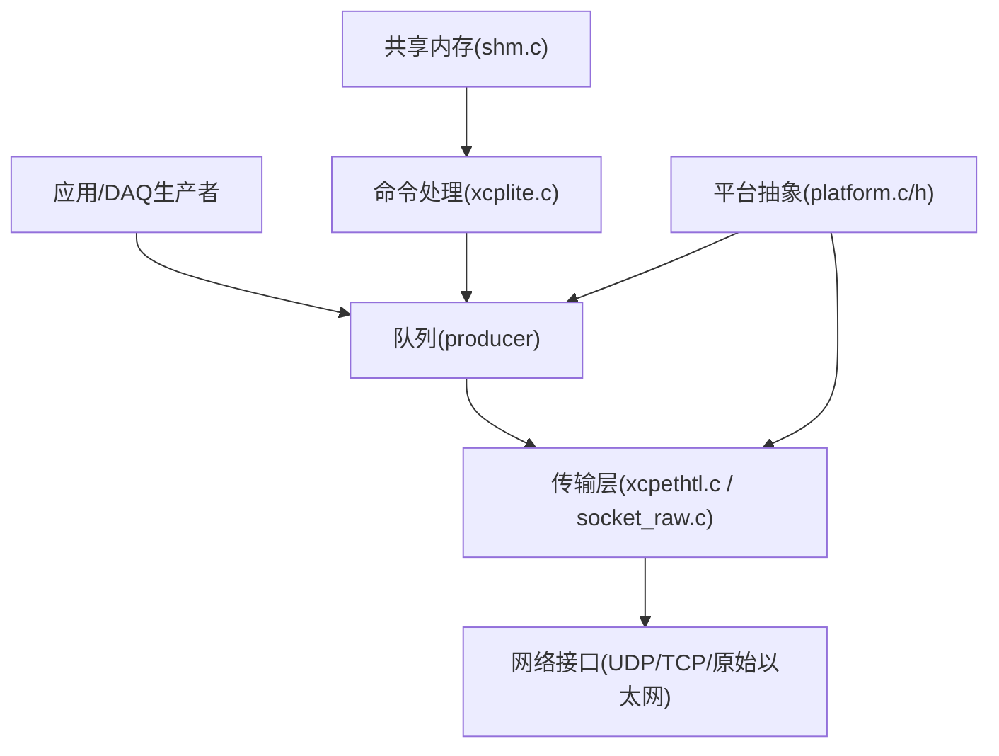
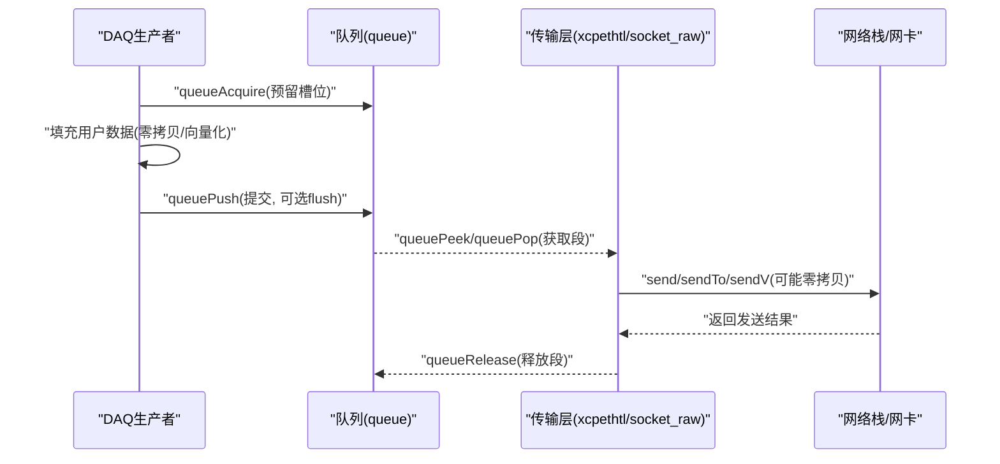
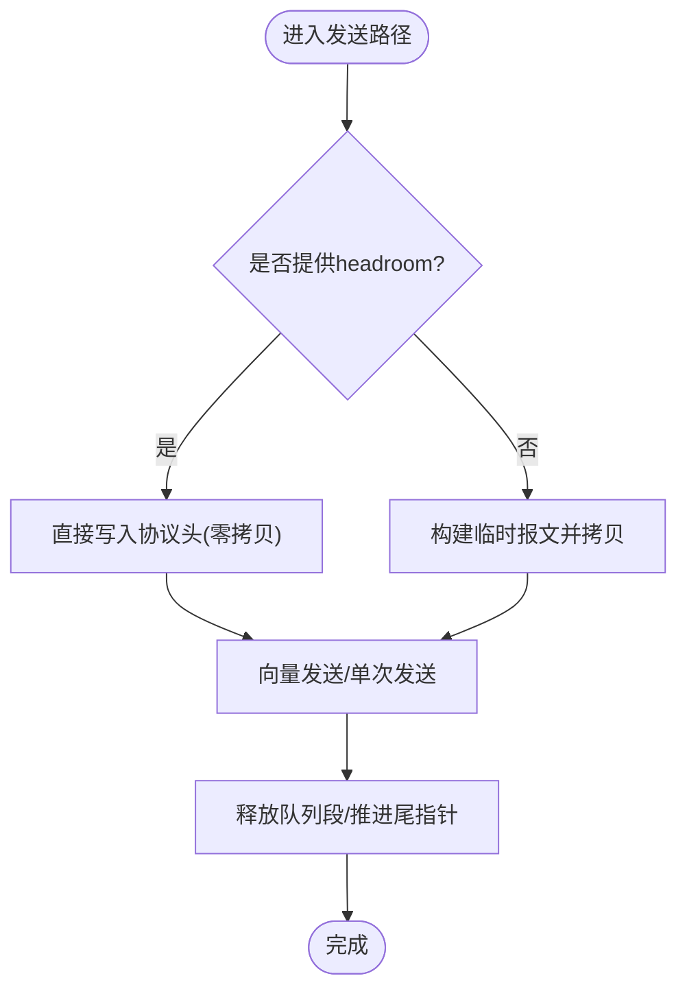
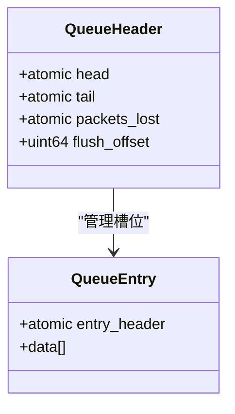
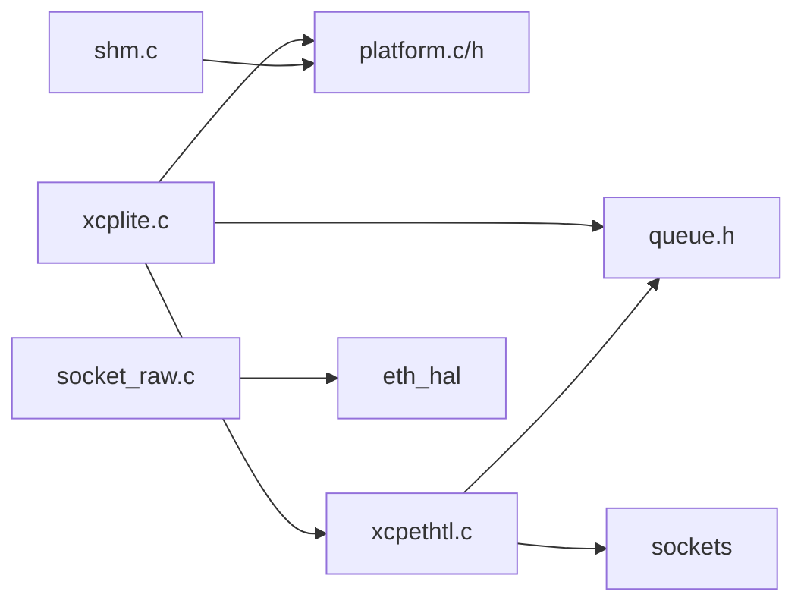

# 性能优化

<cite>
**本文引用的文件**
- [src/xcplite.c](file://src/xcplite.c)
- [src/xcpethtl.c](file://src/xcpethtl.c)
- [src/socket_raw.c](file://src/socket_raw.c)
- [src/shm.c](file://src/shm.c)
- [src/platform.c](file://src/platform.c)
- [src/platform.h](file://src/platform.h)
- [src/queue.h](file://src/queue.h)
- [src/queue32.c](file://src/queue32.c)
- [src/queue64f.c](file://src/queue64f.c)
</cite>

## 目录
1. [简介](#简介)
2. [项目结构](#项目结构)
3. [核心组件](#核心组件)
4. [架构总览](#架构总览)
5. [详细组件分析](#详细组件分析)
6. [依赖关系分析](#依赖关系分析)
7. [性能考量](#性能考量)
8. [故障排查指南](#故障排查指南)
9. [结论](#结论)
10. [附录](#附录)

## 简介
本文件聚焦于XCPlite DAQ事件系统的性能优化技术与最佳实践，围绕内存使用、CPU利用率、实时性保障、多线程调优、性能分析与回归检测，以及跨硬件平台的配置与部署建议进行系统化阐述。内容基于源码实现进行分析，强调在高频DAQ事件路径中的低延迟、高吞吐与确定性行为。

## 项目结构
XCPlite将协议层、传输层、队列与平台抽象解耦：
- 协议层：xcplite.c（XCP协议状态机、事件列表、指标）
- 传输层：xcpethtl.c（UDP/TCP收发、多播、发送聚合）、socket_raw.c（无TCP/IP栈的原始以太网封装）
- 队列：queue.h + queue32.c（互斥量+分段累积）/ queue64f.c（无锁固定大小）
- 平台抽象：platform.c/h（原子、线程、时钟、共享内存）
- 共享内存：shm.c（多进程状态、A2L协调、存活计数）

图表来源
- [src/xcplite.c:779-800](file://src/xcplite.c#L779-L800)
- [src/xcpethtl.c:126-237](file://src/xcpethtl.c#L126-L237)
- [src/socket_raw.c:660-720](file://src/socket_raw.c#L660-L720)
- [src/queue.h:122-187](file://src/queue.h#L122-L187)
- [src/platform.c:435-654](file://src/platform.c#L435-L654)
- [src/shm.c:162-208](file://src/shm.c#L162-L208)

章节来源
- [src/xcplite.c:779-800](file://src/xcplite.c#L779-L800)
- [src/xcpethtl.c:126-237](file://src/xcpethtl.c#L126-L237)
- [src/socket_raw.c:660-720](file://src/socket_raw.c#L660-L720)
- [src/queue.h:122-187](file://src/queue.h#L122-L187)
- [src/platform.c:435-654](file://src/platform.c#L435-L654)
- [src/shm.c:162-208](file://src/shm.c#L162-L208)

## 核心组件
- 事件列表与原子可见性：通过原子变量与acquire/release语义保证事件计数对消费者的可见性，避免不必要的内存屏障开销。
- 传输层发送聚合：支持向量IO与段内消息累积，减少系统调用次数与内核拷贝。
- 零拷贝路径：在具备headroom时直接在内核缓冲头部写入协议头，避免额外拷贝。
- 无锁队列：64位平台采用固定大小的无锁环形队列，降低竞争与上下文切换；32位/Windows使用互斥量保护的分段累积队列。
- 平台时钟与睡眠：高精度单调时钟与短延时忙等待结合，兼顾精度与CPU占用。
- 共享内存模式：多进程协作，leader负责传输层与队列，follower仅发布数据并消费本地资源。

章节来源
- [src/xcplite.c:779-800](file://src/xcplite.c#L779-L800)
- [src/xcpethtl.c:126-237](file://src/xcpethtl.c#L126-L237)
- [src/queue64f.c:399-519](file://src/queue64f.c#L399-L519)
- [src/queue32.c:207-304](file://src/queue32.c#L207-L304)
- [src/platform.c:435-654](file://src/platform.c#L435-L654)
- [src/shm.c:162-208](file://src/shm.c#L162-L208)

## 架构总览
下图展示DAQ事件从生产到发送的关键路径，包括队列、传输层与网络栈交互。

图表来源
- [src/queue.h:122-187](file://src/queue.h#L122-L187)
- [src/xcpethtl.c:126-237](file://src/xcpethtl.c#L126-L237)
- [src/socket_raw.c:722-755](file://src/socket_raw.c#L722-L755)

## 详细组件分析

### 内存使用优化策略
- 内存池与预分配
  - 队列以固定大小或可配置大小的连续缓冲区实现，避免运行时频繁分配。
  - 32位队列按段(segment)累积消息，减少拷贝与系统调用；64位无锁队列以固定条目布局，便于对齐与缓存友好访问。
- 零拷贝技术
  - 传输层在支持headroom时直接将以太网/IPv4/UDP头写入预留空间，避免复制数据包。
  - 向量发送(sendV)将多个消息一次性提交给内核，减少拷贝与中断。
- 垃圾回收机制
  - 队列通过release推进尾指针，复用槽位；溢出时统计丢包数，供上层监控与告警。
  - 共享内存模式下，进程退出时清理句柄与映射，避免僵尸对象。

图表来源
- [src/xcpethtl.c:126-237](file://src/xcpethtl.c#L126-L237)
- [src/socket_raw.c:722-755](file://src/socket_raw.c#L722-L755)
- [src/queue32.c:333-403](file://src/queue32.c#L333-L403)
- [src/queue64f.c:557-660](file://src/queue64f.c#L557-L660)

章节来源
- [src/xcpethtl.c:126-237](file://src/xcpethtl.c#L126-L237)
- [src/socket_raw.c:722-755](file://src/socket_raw.c#L722-L755)
- [src/queue32.c:333-403](file://src/queue32.c#L333-L403)
- [src/queue64f.c:557-660](file://src/queue64f.c#L557-L660)

### CPU利用率优化方法
- 避免忙等待
  - 短延时在部分平台采用忙等待以提升精度，但需限制范围以避免CPU浪费；长延时使用sleep/nanosleep。
  - 接收循环中设置超时，定期让出CPU执行后台任务。
- 中断最小化
  - 通过段内消息累积与向量发送减少系统调用与中断触发次数。
  - 仅在必要时唤醒发送线程或触发调度点。
- 上下文切换优化
  - 无锁队列减少互斥量争用；单消费者模型避免多消费者竞争。
  - 使用原子acquire/release精确控制可见性，避免全局屏障。

章节来源
- [src/platform.c:78-155](file://src/platform.c#L78-L155)
- [src/xcpethtl.c:777-800](file://src/xcpethtl.c#L777-L800)
- [src/queue64f.c:399-519](file://src/queue64f.c#L399-L519)

### 实时性保障措施
- 确定性延迟
  - 固定条目大小与对齐减少抖动；队列头/尾原子操作为O(1)。
  - 发送路径尽量走零拷贝与向量IO，降低内核态开销。
- 优先级继承
  - 队列支持flush标记，提示消费者优先处理关键数据；32位队列在push时可根据flush立即切分新段。
- 抢占式调度
  - 传输层在队列满或达到阈值时主动触发发送，避免阻塞DAQ线程过久。

章节来源
- [src/queue32.c:283-304](file://src/queue32.c#L283-L304)
- [src/queue64f.c:496-519](file://src/queue64f.c#L496-L519)
- [src/xcpethtl.c:777-800](file://src/xcpethtl.c#L777-L800)

### 多线程性能调优技巧
- 无锁编程
  - 64位平台使用无锁队列，生产者CAS申请槽位，消费者acquire-load读取，release-store提交。
- 缓存友好设计
  - 队列头与条目按缓存行对齐，减少伪共享；固定条目大小提升局部性。
- NUMA感知优化
  - 队列与共享内存可置于指定NUMA节点（由上层决定），减少跨节点访问延迟。

图表来源
- [src/queue64f.c:270-294](file://src/queue64f.c#L270-L294)
- [src/queue64f.c:256-265](file://src/queue64f.c#L256-L265)

章节来源
- [src/queue64f.c:399-519](file://src/queue64f.c#L399-L519)
- [src/queue64f.c:270-294](file://src/queue64f.c#L270-L294)

### 事件系统与指标
- 事件列表维护：原子计数与acquire/release确保事件可见性；支持动态事件注册与查询。
- 指标收集：发送包数、消息数、向量项数、接收包数等用于性能分析与回归检测。

章节来源
- [src/xcplite.c:779-800](file://src/xcplite.c#L779-L800)
- [src/xcplite.c:335-343](file://src/xcplite.c#L335-L343)

## 依赖关系分析
- 模块耦合
  - xcplite.c依赖queue与platform，并通过xcpethtl.c进行网络发送。
  - xcpethtl.c依赖sockets与queue，支持UDP/TCP与多播。
  - socket_raw.c提供无TCP/IP栈的底层封装，依赖HAL。
  - shm.c协调多进程状态，依赖platform共享内存API。
- 外部依赖
  - 平台原子、线程、时钟、套接字与共享内存API。
  - 操作系统网络栈（Linux/macOS/QNX/Windows）。

图表来源
- [src/xcplite.c:779-800](file://src/xcplite.c#L779-L800)
- [src/xcpethtl.c:126-237](file://src/xcpethtl.c#L126-L237)
- [src/socket_raw.c:660-720](file://src/socket_raw.c#L660-L720)
- [src/shm.c:162-208](file://src/shm.c#L162-L208)

章节来源
- [src/xcplite.c:779-800](file://src/xcplite.c#L779-L800)
- [src/xcpethtl.c:126-237](file://src/xcpethtl.c#L126-L237)
- [src/socket_raw.c:660-720](file://src/socket_raw.c#L660-L720)
- [src/shm.c:162-208](file://src/shm.c#L162-L208)

## 性能考量
- 内存使用优化
  - 使用固定大小队列与段累积减少分配与拷贝；启用headroom实现零拷贝。
  - 合理设置队列深度与段大小，平衡延迟与吞吐。
- CPU利用率优化
  - 避免长时间忙等待；使用超时轮询与批量发送降低系统调用频率。
  - 利用向量IO与多播减少重复工作。
- 实时性保障
  - 固定条目与对齐提高确定性；flush机制提升关键数据优先级。
  - 单消费者模型降低竞争；原子acquire/release精确同步。
- 多线程调优
  - 无锁队列在高并发下表现优异；缓存行对齐减少伪共享。
  - NUMA感知：将队列与共享内存放置于本地节点。
- 性能分析与回归检测
  - 启用指标宏统计发送/接收计数与向量项数；记录队列溢出与丢包。
  - 基准测试：在不同负载下测量端到端延迟分布与吞吐；对比不同队列实现与发送路径。
- 平台配置与部署
  - Linux/macOS/QNX：选择合适时钟源（CLOCK_MONOTONIC_RAW/CLOCK_REALTIME），启用UDP raw或标准套接字。
  - Windows：注意忙等待粒度与系统调用开销；使用临界区与高性能计数器。
  - FreeRTOS：静态任务与信号量，调整栈大小与优先级；使用高精度定时器。

章节来源
- [src/queue64f.c:399-519](file://src/queue64f.c#L399-L519)
- [src/xcpethtl.c:777-800](file://src/xcpethtl.c#L777-L800)
- [src/platform.c:435-654](file://src/platform.c#L435-L654)
- [src/xcplite.c:335-343](file://src/xcplite.c#L335-L343)

## 故障排查指南
- 常见问题
  - 队列溢出：检查队列深度与生产者速率；观察packets_lost指标。
  - 发送失败：确认目标地址有效、MTU配置正确；查看错误码与日志。
  - 共享内存异常：验证leader/follower状态；清理残留对象后重启。
- 调试手段
  - 启用调试日志级别，打印关键路径参数与状态。
  - 使用工具脚本检查共享内存状态与清理。
  - 基准测试工具对比不同配置下的性能差异。

章节来源
- [src/queue32.c:333-403](file://src/queue32.c#L333-L403)
- [src/xcpethtl.c:377-534](file://src/xcpethtl.c#L377-L534)
- [src/shm.c:221-277](file://src/shm.c#L221-L277)

## 结论
XCPlite通过无锁队列、零拷贝发送、段内累积与原子可见性控制，实现了高吞吐、低延迟与确定性的DAQ事件处理。结合平台抽象与共享内存模式，可在多进程与多平台上稳定运行。建议在生产环境中根据负载与硬件特性调优队列大小、发送阈值与时钟源，并持续进行基准测试与回归检测以确保性能稳定性。

## 附录
- 配置要点
  - 队列选项：固定大小vs可变大小；是否累积段；对齐要求。
  - 传输层：UDP/TCP/原始以太网；多播支持；headroom配置。
  - 平台：时钟分辨率与纪元；共享内存命名与生命周期。
- 最佳实践
  - 优先使用无锁队列与向量发送；避免频繁分配与拷贝。
  - 使用flush机制提升关键数据优先级；监控丢包与溢出。
  - 在多进程中明确leader职责，避免竞态与资源冲突。