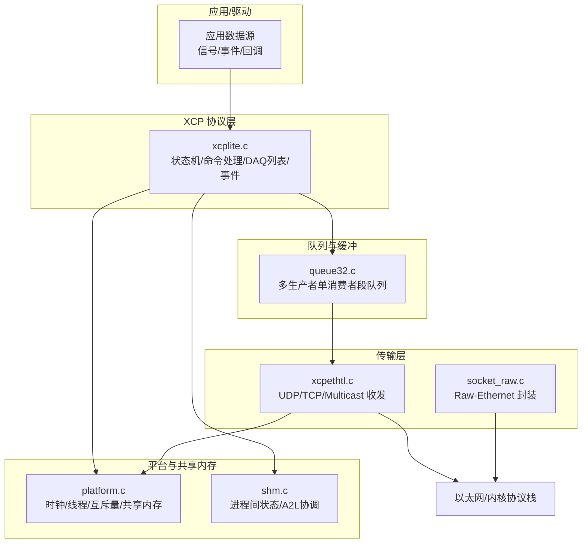
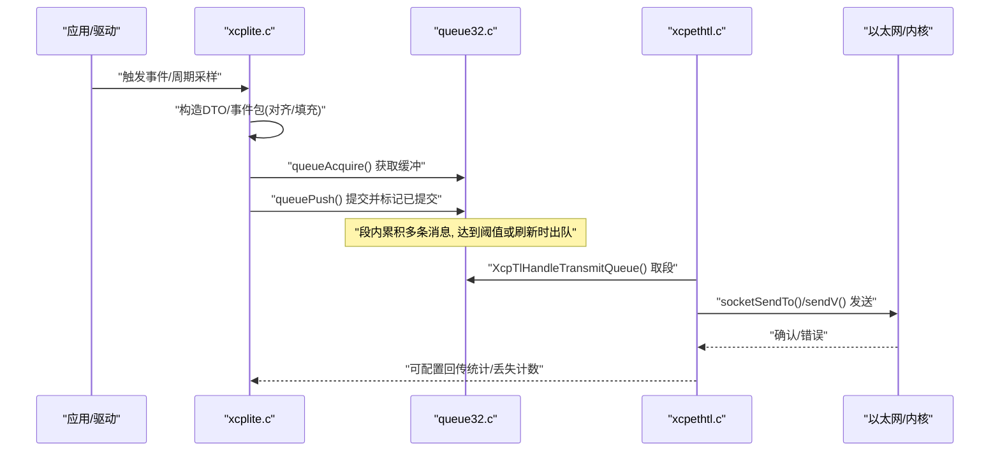
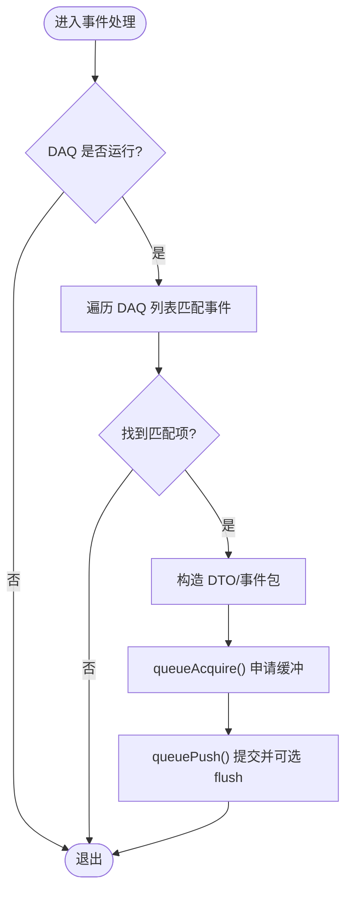
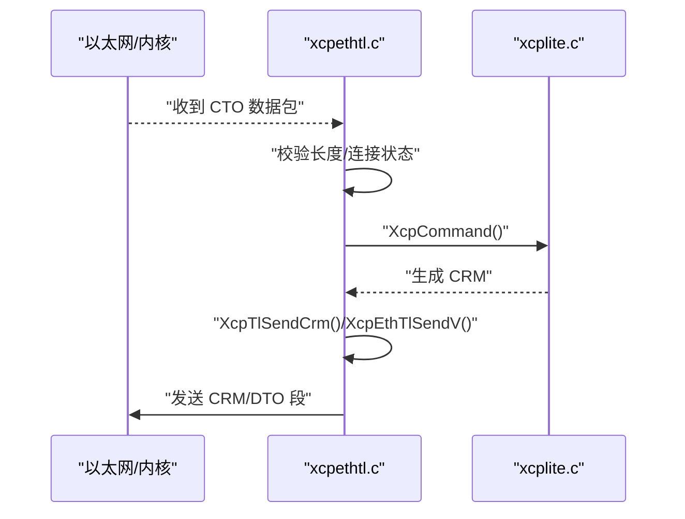
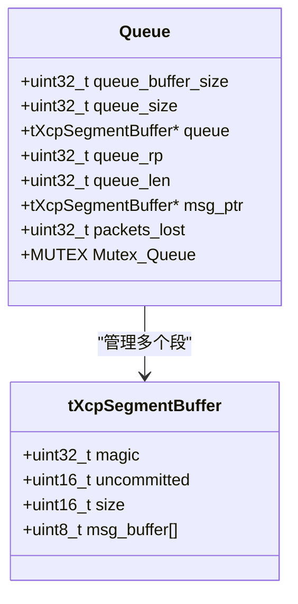
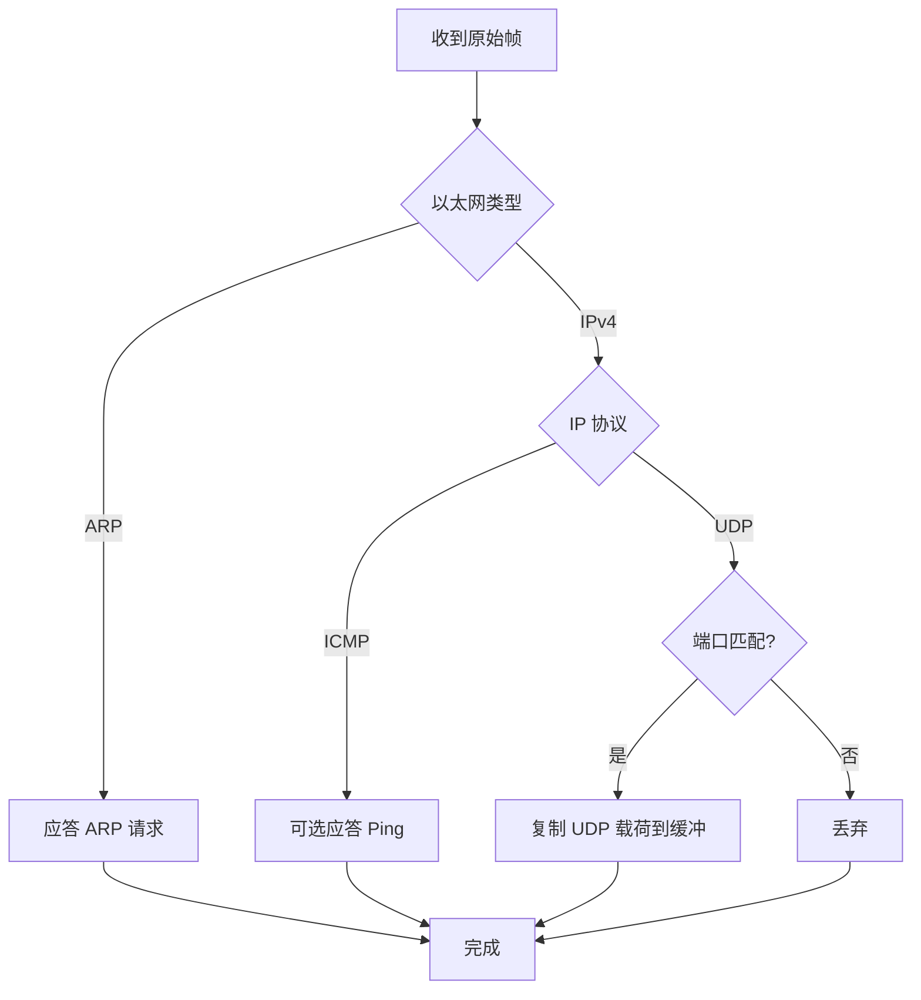
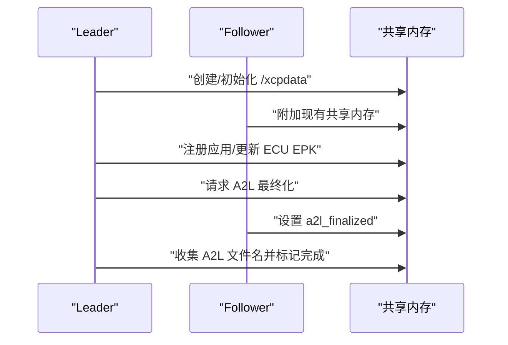
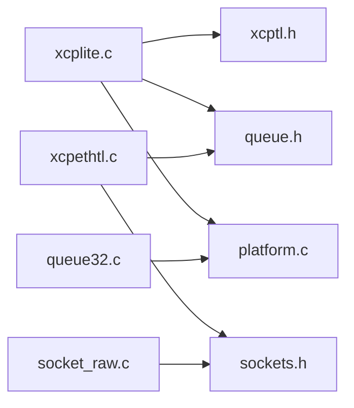

# 数据采集流水线

<cite>
**本文引用的文件**
- [xcplite.c](file://src/xcplite.c)
- [xcpethtl.c](file://src/xcpethtl.c)
- [queue32.c](file://src/queue32.c)
- [shm.c](file://src/shm.c)
- [socket_raw.c](file://src/socket_raw.c)
- [xcptl.h](file://src/xcptl.h)
- [xcp.h](file://src/xcp.h)
- [platform.c](file://src/platform.c)
</cite>

## 目录
1. [简介](#简介)
2. [项目结构](#项目结构)
3. [核心组件](#核心组件)
4. [架构总览](#架构总览)
5. [详细组件分析](#详细组件分析)
6. [依赖关系分析](#依赖关系分析)
7. [性能考量](#性能考量)
8. [故障排查指南](#故障排查指南)
9. [结论](#结论)
10. [附录：集成与调优](#附录：集成与调优)

## 简介
本文件系统性阐述 XCPlite 的数据采集（DAQ）流水线架构与处理流程，覆盖从数据源到网络传输的完整路径：数据采集点定义、数据格式转换、缓冲区管理、实时性保证（确定性执行时间、中断/事件触发、优先级调度）、多线程同步（生产者-消费者模型与线程安全）、数据打包与网络传输优化（向量发送、零拷贝头区、UDP/TCP/Raw-Ethernet），以及性能监控、瓶颈分析与调优工具。最后提供自定义数据源与传输后端的集成开发指南。

## 项目结构
XCPlite 将协议层、传输层、队列缓冲、平台抽象与共享内存等模块解耦，便于在不同目标（Linux/QNX/macOS/Windows/FreeRTOS）上实现高吞吐、低延迟的 DAQ 流水线。

**图示来源**
- [xcplite.c:188-256](file://src/xcplite.c#L188-L256)
- [xcpethtl.c:70-105](file://src/xcpethtl.c#L70-L105)
- [queue32.c:85-100](file://src/queue32.c#L85-L100)
- [shm.c:69-80](file://src/shm.c#L69-L80)
- [platform.c:434-654](file://src/platform.c#L434-L654)

**章节来源**
- [xcplite.c:188-256](file://src/xcplite.c#L188-L256)
- [xcpethtl.c:70-105](file://src/xcpethtl.c#L70-L105)
- [queue32.c:85-100](file://src/queue32.c#L85-L100)
- [shm.c:69-80](file://src/shm.c#L69-L80)
- [platform.c:434-654](file://src/platform.c#L434-L654)

## 核心组件
- 协议层（xcplite.c）：维护会话状态、DAQ 列表、事件表、MTA/校准访问、校验和计算、日志与指标；提供对外接口查询运行状态与事件。
- 传输层（xcpethtl.c）：负责 UDP/TCP 收包、CONNECT 握手、CRM 响应发送、多播支持、向量发送聚合段；通过 xcptl.h 暴露统一接口。
- 队列（queue32.c）：多生产者单消费者段队列，按 MTU 分段，消息头含长度与计数器，支持提交/释放与丢失统计。
- Raw-Ethernet（socket_raw.c）：在无 TCP/IP 栈的目标上手工构建以太网/IPv4/UDP 帧，支持 ARP 应答与可选 ICMP Echo。
- 平台抽象（platform.c）：线程、互斥量、时钟、睡眠、共享内存（POSIX shm_open/mmap）。
- 共享内存（shm.c）：多进程协作、Leader/Follower 选举、A2L 最终化协调、存活计数检测。

**章节来源**
- [xcplite.c:188-256](file://src/xcplite.c#L188-L256)
- [xcpethtl.c:70-105](file://src/xcpethtl.c#L70-L105)
- [queue32.c:85-100](file://src/queue32.c#L85-L100)
- [socket_raw.c:136-152](file://src/socket_raw.c#L136-L152)
- [platform.c:366-654](file://src/platform.c#L366-L654)
- [shm.c:69-80](file://src/shm.c#L69-L80)

## 架构总览
下图展示从应用数据源到网络传输的端到端数据流，包括 DAQ 事件触发、协议层打包、队列缓冲、传输层聚合发送。

**图示来源**
- [xcplite.c:270-317](file://src/xcplite.c#L270-L317)
- [queue32.c:207-304](file://src/queue32.c#L207-L304)
- [xcpethtl.c:135-236](file://src/xcpethtl.c#L135-L236)
- [xcpethtl.c:791-848](file://src/xcpethtl.c#L791-L848)

## 详细组件分析

### 协议层：DAQ 列表、事件与优先级
- DAQ 列表与 ODT：通过宏快速访问 DAQ 列表、ODT 范围、事件通道、优先级等，支持动态分配与运行时配置。
- 事件表：支持动态事件列表，使用原子操作与互斥量保护，提供 acquire/release 语义以平衡性能与可见性。
- 优先级调度：DAQ 列表支持优先级字段，结合事件通道与 prescaler 控制采样频率与输出顺序。
- 状态检查：isDaqRunning/isConnected/isStarted 等宏在共享内存模式下对 gXcpData 指针进行安全访问。

**图示来源**
- [xcplite.c:407-428](file://src/xcplite.c#L407-L428)
- [xcplite.c:779-797](file://src/xcplite.c#L779-L797)
- [queue32.c:207-304](file://src/queue32.c#L207-L304)

**章节来源**
- [xcplite.c:270-317](file://src/xcplite.c#L270-L317)
- [xcplite.c:407-428](file://src/xcplite.c#L407-L428)
- [xcplite.c:779-797](file://src/xcplite.c#L779-L797)

### 传输层：UDP/TCP/Multicast 与向量发送
- 接收路径：handleXcpCommand 解析 CTO，校验长度与连接状态，调用 XcpCommand 处理 CONNECT/其他命令。
- 发送路径：XcpEthTlSend 支持直接发送；当启用固定/可变大小队列时，使用 XcpEthTlSendV 进行向量发送，减少系统调用次数。
- CRM 响应：XcpTlSendCrm 通过队列或直接发送，保持与 DAQ 相同的发送路径以避免 UDP 重排序问题。
- Multicast：支持 GET_DAQ_CLOCK_MULTICAST 与独立多播线程。

**图示来源**
- [xcpethtl.c:291-375](file://src/xcpethtl.c#L291-L375)
- [xcpethtl.c:241-269](file://src/xcpethtl.c#L241-L269)
- [xcpethtl.c:192-236](file://src/xcpethtl.c#L192-L236)

**章节来源**
- [xcpethtl.c:291-375](file://src/xcpethtl.c#L291-L375)
- [xcpethtl.c:241-269](file://src/xcpethtl.c#L241-L269)
- [xcpethtl.c:192-236](file://src/xcpethtl.c#L192-L236)

### 队列：多生产者单消费者段缓冲
- 段结构：每段包含未提交计数、总字节数与消息缓冲区；消息头为长度+计数器，CTR 由消费者设置。
- 生产者：queueAcquire 获取缓冲并写入数据，queuePush 提交并可选择 flush（高优先级数据立即切分新段）。
- 消费者：XcpTlHandleTransmitQueue 循环取出已提交的段，批量发送，统计丢失包数量。

**图示来源**
- [queue32.c:70-100](file://src/queue32.c#L70-L100)
- [queue32.c:207-304](file://src/queue32.c#L207-L304)
- [queue32.c:333-403](file://src/queue32.c#L333-L403)

**章节来源**
- [queue32.c:207-304](file://src/queue32.c#L207-L304)
- [queue32.c:333-403](file://src/queue32.c#L333-L403)

### Raw-Ethernet：无协议栈目标的零拷贝路径
- 手工构建以太网/IPv4/UDP 帧，仅支持小端主机且需确保帧长不超过链路 MTU。
- 只应答 ARP 请求，不主动发起 ARP；可选 gratuitous ARP 加速邻居发现。
- 接收路径过滤非本机 MAC/端口/协议帧，避免无关流量影响性能。

**图示来源**
- [socket_raw.c:282-319](file://src/socket_raw.c#L282-L319)
- [socket_raw.c:354-403](file://src/socket_raw.c#L354-L403)
- [socket_raw.c:413-526](file://src/socket_raw.c#L413-L526)

**章节来源**
- [socket_raw.c:282-319](file://src/socket_raw.c#L282-L319)
- [socket_raw.c:354-403](file://src/socket_raw.c#L354-L403)
- [socket_raw.c:413-526](file://src/socket_raw.c#L413-L526)

### 共享内存：多进程协作与 A2L 协调
- Leader/Follower：首个进程创建共享内存成为 Leader，后续进程作为 Follower 附加；通过原子计数与存活检测清理失效进程。
- A2L 最终化：Leader 请求所有应用 finalize A2L，收集文件名并标记主 A2L 已完成。
- ECU EPK：基于所有应用 EPK 的 FNV-1a 哈希生成全局标识，用于客户端识别。

**图示来源**
- [shm.c:69-80](file://src/shm.c#L69-L80)
- [shm.c:162-208](file://src/shm.c#L162-L208)
- [shm.c:283-369](file://src/shm.c#L283-L369)
- [shm.c:526-608](file://src/shm.c#L526-L608)

**章节来源**
- [shm.c:69-80](file://src/shm.c#L69-L80)
- [shm.c:162-208](file://src/shm.c#L162-L208)
- [shm.c:283-369](file://src/shm.c#L283-L369)
- [shm.c:526-608](file://src/shm.c#L526-L608)

### 平台抽象：时钟、线程与互斥量
- 时钟：支持 POSIX/Windows/FreeRTOS 多种实现，提供单调时钟与实时时钟，支持 ns/us 分辨率。
- 线程/互斥量：跨平台封装，用于队列、传输层与事件列表的并发保护。
- 共享内存：POSIX shm_open/mmap 或 Windows VirtualAlloc，Leader 选举与生命周期管理。

**章节来源**
- [platform.c:366-654](file://src/platform.c#L366-L654)
- [platform.c:434-654](file://src/platform.c#L434-L654)

## 依赖关系分析
- 协议层依赖传输层接口（xcptl.h）与队列接口，通过平台抽象获得时钟/线程能力。
- 传输层依赖 sockets 抽象，可选择 UDP/TCP 或 Raw-Ethernet 后端。
- 队列与传输层共同实现“多生产者（DAQ/事件）—单消费者（发送）”模型，降低锁竞争与系统调用开销。

**图示来源**
- [xcptl.h:19-25](file://src/xcptl.h#L19-L25)
- [xcpethtl.c:21-29](file://src/xcpethtl.c#L21-L29)
- [queue32.c:16-35](file://src/queue32.c#L16-L35)
- [socket_raw.c:26-33](file://src/socket_raw.c#L26-L33)

**章节来源**
- [xcptl.h:19-25](file://src/xcptl.h#L19-L25)
- [xcpethtl.c:21-29](file://src/xcpethtl.c#L21-L29)
- [queue32.c:16-35](file://src/queue32.c#L16-L35)
- [socket_raw.c:26-33](file://src/socket_raw.c#L26-L33)

## 性能考量
- 确定性执行时间：DAQ 列表优先级与事件通道控制采样频率；队列 flush 机制确保高优先级数据尽快出队。
- 中断/事件触发：事件表支持动态添加与原子计数，避免热点路径中的昂贵操作。
- 多线程同步：队列采用多生产者单消费者设计，临界区最小化；传输层使用互斥量保护计数器与 socket 操作。
- 数据打包与网络优化：
  - 向量发送（sendV）聚合多个 DTO 为一个 UDP 帧，减少系统调用。
  - 零拷贝头区（headroom）允许网卡/内核直接写入以太网/IPv4/UDP 头，避免额外拷贝。
  - 对齐与填充：消息按 XCPTL_PACKET_ALIGNMENT 对齐，提升 DMA 效率。
- 监控与诊断：
  - 丢包统计：队列维护 packets_lost，传输层可上报。
  - 指标开关：TEST_ENABLE_DBG_METRICS 提供 TX/RX 包计数、IoVector 计数等。
  - 超时与重试：传输层设置接收超时，避免阻塞；发送失败记录错误码。

[本节为通用性能讨论，无需特定文件引用]

## 故障排查指南
- 常见错误与定位：
  - 连接断开：TCP 连接关闭或 UDP 源地址/端口变化导致 disconnect，检查 handleXcpCommand 的连接状态逻辑。
  - 报文损坏：UDP 长度不一致或截断，检查 xcpethtl.c 的长度校验与 socket_raw.c 的帧过滤。
  - 队列溢出：queueAcquire 返回空缓冲，增大队列尺寸或降低采样率。
  - 共享内存异常：Leader 未激活或版本不匹配，使用 tools/shm_cleanup.sh 清理残留对象。
- 调试建议：
  - 提高日志级别（XcpSetLogLevel）观察关键路径。
  - 启用指标统计（TEST_ENABLE_DBG_METRICS）分析 TX/RX 行为。
  - 使用抓包工具验证 UDP 帧结构与 MTU 限制。

**章节来源**
- [xcpethtl.c:291-375](file://src/xcpethtl.c#L291-L375)
- [xcpethtl.c:490-533](file://src/xcpethtl.c#L490-L533)
- [queue32.c:207-280](file://src/queue32.c#L207-L280)
- [shm.c:162-208](file://src/shm.c#L162-L208)

## 结论
XCPlite 的数据采集流水线通过清晰的层次划分与高效的缓冲/传输机制，实现了高吞吐、低延迟的 DAQ 能力。协议层专注状态管理与数据打包，传输层负责可靠与优化的网络发送，队列提供稳定的生产者-消费者模型，平台抽象屏蔽底层差异，共享内存支持多进程协作。借助向量发送、零拷贝头区与对齐策略，系统在多种平台上均能取得良好性能。

[本节为总结性内容，无需特定文件引用]

## 附录：集成与调优

### 自定义数据源集成
- 在应用侧定义事件或周期回调，调用协议层接口将数据写入队列：
  - 使用 queueAcquire 获取缓冲，填充数据后 queuePush 提交。
  - 对于高优先级数据，设置 flush 标志以强制切分新段。
- 参考示例：cpp_demo/sig_gen.cpp、multi_thread_demo/main.c 等。

**章节来源**
- [queue32.c:207-304](file://src/queue32.c#L207-L304)

### 自定义传输后端集成
- 若需替换 UDP/TCP 后端，实现 sockets.h 定义的 socketOpen/socketBind/socketRecvFrom/socketSendTo 等接口。
- 对于无协议栈目标，可使用 socket_raw.c 的 Raw-Ethernet 路径，确保帧长不超过链路 MTU 并正确设置本地 IP/MAC。

**章节来源**
- [socket_raw.c:531-658](file://src/socket_raw.c#L531-L658)
- [xcpethtl.c:603-715](file://src/xcpethtl.c#L603-L715)

### 性能调优建议
- 调整队列大小与段大小：根据 MTU 与应用负载选择合适的 XCPTL_MAX_SEGMENT_SIZE 与队列容量。
- 启用向量发送：在 OPTION_QUEUE_64_FIX_SIZE/OPTION_QUEUE_64_VAR_SIZE 下利用 sendV 聚合发送。
- 合理设置超时：传输层接收超时应兼顾后台任务与响应性。
- 监控指标：开启 TEST_ENABLE_DBG_METRICS 与日志级别，分析丢包与发送延迟。

[本节为通用调优指导，无需特定文件引用]