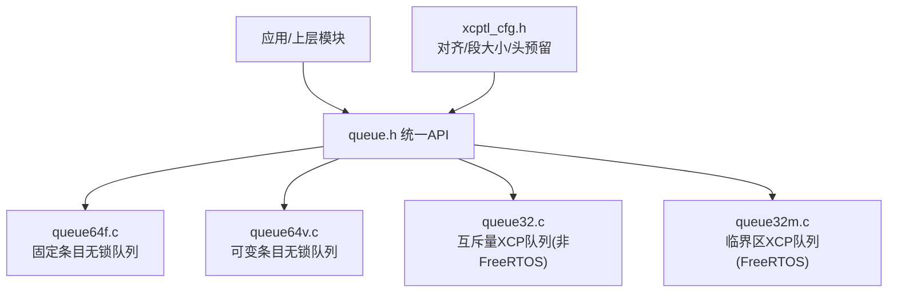
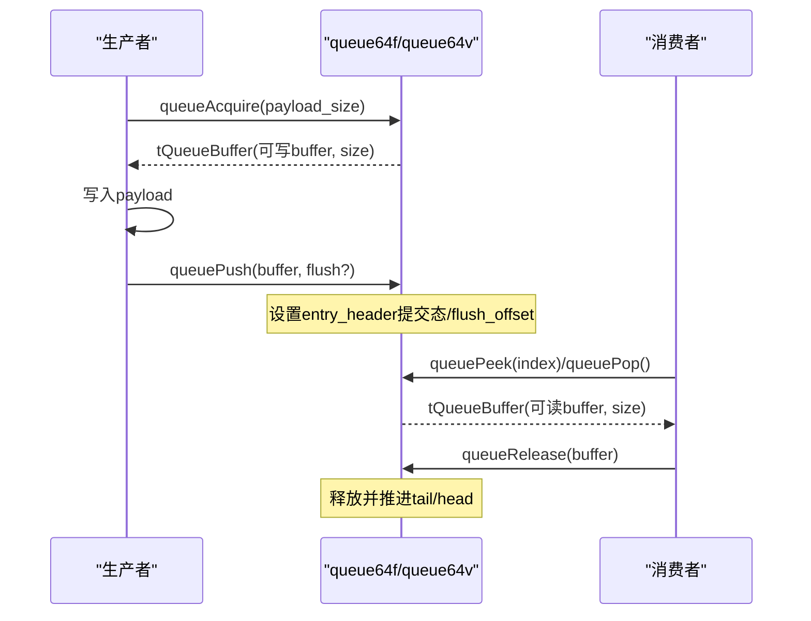
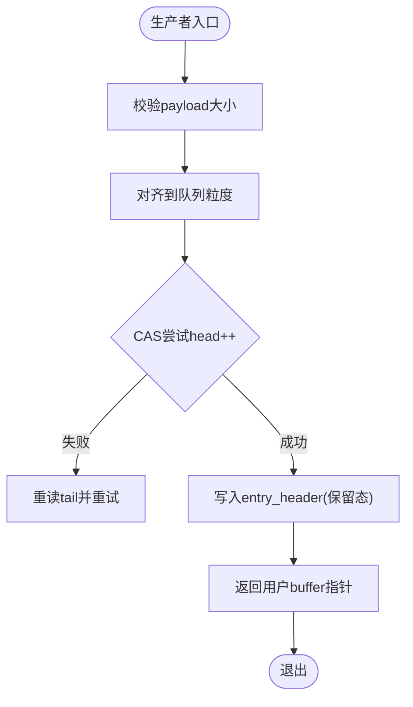
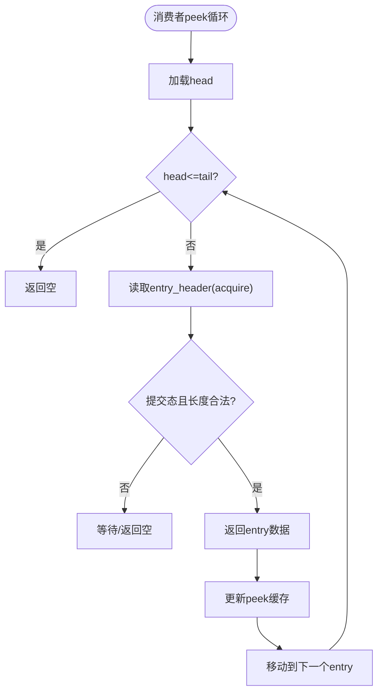
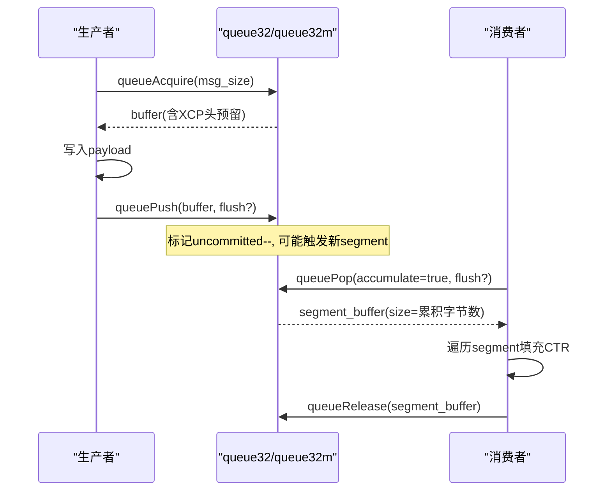
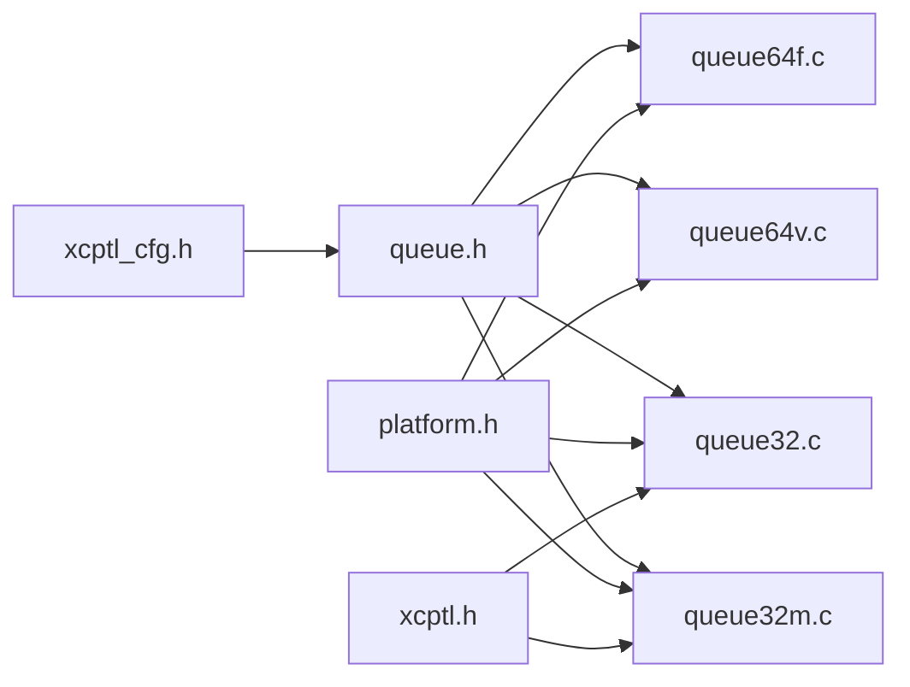

# 队列实现

<cite>
**本文引用的文件**
- [src/queue.h](file://src/queue.h)
- [src/queue32.c](file://src/queue32.c)
- [src/queue64f.c](file://src/queue64f.c)
- [src/queue64v.c](file://src/queue64v.c)
- [src/queue32m.c](file://src/queue32m.c)
- [src/xcptl_cfg.h](file://src/xcptl_cfg.h)
- [test/queue_test/src/main.c](file://test/queue_test/src/main.c)
</cite>

## 目录
1. [简介](#简介)
2. [项目结构](#项目结构)
3. [核心组件](#核心组件)
4. [架构总览](#架构总览)
5. [详细组件分析](#详细组件分析)
6. [依赖关系分析](#依赖关系分析)
7. [性能考量](#性能考量)
8. [故障排查指南](#故障排查指南)
9. [结论](#结论)
10. [附录](#附录)

## 简介
本文件深入解析 XCPlite 的无锁队列实现架构，覆盖三类队列：固定大小队列（queue64f）、浮动大小队列（queue64v）以及基于互斥/临界区的 XCP 专用队列（queue32/queue32m）。重点阐述：
- 不同队列类型的设计差异与适用场景
- 无锁并发访问机制：原子操作、内存序、缓存一致性保证
- 内存池分配策略、缓冲区管理与泄漏防护
- 性能特征、吞吐优化与延迟控制
- 监控统计与故障恢复能力
- 扩展自定义队列类型与内存管理器的方法

## 项目结构
XCPlite 通过统一的队列抽象接口暴露多实现，按平台与配置编译选择具体实现：
- 通用无锁实现（64位POSIX）：queue64f.c（固定条目）、queue64v.c（可变条目）
- XCP 专用实现（32位/Windows/FreeRTOS）：queue32.c（互斥量）、queue32m.c（FreeRTOS临界区）
- 统一API定义：queue.h
- 传输层参数：xcptl_cfg.h（对齐、段大小、头预留等）
- 测试与基准：test/queue_test/src/main.c

图表来源
- [src/queue.h:1-187](file://src/queue.h#L1-L187)
- [src/xcptl_cfg.h:44-114](file://src/xcptl_cfg.h#L44-L114)

章节来源
- [src/queue.h:1-187](file://src/queue.h#L1-L187)
- [src/xcptl_cfg.h:44-114](file://src/xcptl_cfg.h#L44-L114)

## 核心组件
- 统一队列API（queue.h）
  - 初始化/反初始化：queueInit / queueDeinit / queueInitFromMemory
  - 生产者：queueAcquire / queuePush
  - 消费者：queuePeek（64位无锁实现支持）、queuePop（32位XCP实现支持分段累积）
  - 释放与查询：queueRelease / queueLevel / queueClear
- 三种队列实现
  - queue64f：固定条目大小，原子entry_header+数据，tail仅用于容量元数据
  - queue64v：可变条目大小，消费者释放时清零已释放区域以保障后续生产者安全
  - queue32/queue32m：XCP专用，消息累积为segment，使用互斥或临界区保护
- 传输层配置（xcptl_cfg.h）
  - 对齐要求、最大DTO/段大小、头部预留空间等

章节来源
- [src/queue.h:88-187](file://src/queue.h#L88-L187)
- [src/xcptl_cfg.h:44-114](file://src/xcptl_cfg.h#L44-L114)

## 架构总览
队列采用“多生产者单消费者”模型。64位无锁实现通过原子head/tail与entry_header状态机实现无锁入队/出队；32位XCP实现通过互斥/临界区保护环形缓冲与segment累积逻辑。

图表来源
- [src/queue64f.c:399-519](file://src/queue64f.c#L399-L519)
- [src/queue64v.c:366-485](file://src/queue64v.c#L366-L485)
- [src/queue.h:122-176](file://src/queue.h#L122-L176)

## 详细组件分析

### 固定大小队列 queue64f（无锁，固定条目）
- 设计要点
  - 每个槽位包含一个原子entry_header（提交状态+长度），数据紧随其后，条目大小固定为 QUEUE_ENTRY_USER_SIZE + 4
  - head由消费者读取，tail由生产者写入；默认tail仅作为容量元数据，不引入额外acquire/release屏障
  - 支持可选 tail 同步模式（OPTION_QUEUE_64_FIX_SIZE_SYNC_TAIL）
- 关键流程
  - 生产者：CAS自旋获取head，写入entry_header为保留态，完成后release-store提交
  - 消费者：acquire-load entry_header确认可见性，处理后可选flush请求检测
  - 释放：清除entry_header并提交tail更新
- 内存与对齐
  - 队列头与条目对齐到缓存行，避免伪共享
  - 要求QUEUE_PAYLOAD_SIZE_ALIGNMENT为4的倍数以满足原子对齐

图表来源
- [src/queue64f.c:399-494](file://src/queue64f.c#L399-L494)

章节来源
- [src/queue64f.c:15-136](file://src/queue64f.c#L15-L136)
- [src/queue64f.c:250-294](file://src/queue64f.c#L250-L294)
- [src/queue64f.c:399-519](file://src/queue64f.c#L399-L519)
- [src/queue64f.c:528-660](file://src/queue64f.c#L528-L660)

### 可变大小队列 queue64v（无锁，可变条目）
- 设计要点
  - 将队列缓冲视为原始对齐存储，条目大小可变
  - 消费者释放时将已释放区域memset清零，确保后续生产者能安全地将其视为原子零值
  - 提供peek缓存优化（cached_peek_index/cached_peek_tail）加速顺序读取
- 关键流程
  - 生产者：acquire-load tail确保看到消费者清零的区域，CAS head并写入entry_header
  - 消费者：顺序遍历entry，检查提交态与长度合法性，支持flush请求检测
  - 释放：清零entry及header，release-store推进tail
- 内存与对齐
  - 同样要求QUEUE_PAYLOAD_SIZE_ALIGNMENT为4的倍数
  - 尾部预留最大条目空间以避免越界

图表来源
- [src/queue64v.c:512-638](file://src/queue64v.c#L512-L638)

章节来源
- [src/queue64v.c:15-34](file://src/queue64v.c#L15-L34)
- [src/queue64v.c:216-261](file://src/queue64v.c#L216-L261)
- [src/queue64v.c:366-485](file://src/queue64v.c#L366-L485)
- [src/queue64v.c:494-658](file://src/queue64v.c#L494-L658)

### XCP 专用队列 queue32/queue32m（互斥/临界区，消息累积）
- 设计要点
  - 将多个消息累积为一个segment（UDP载荷），减少系统调用开销
  - 使用互斥量（非FreeRTOS）或临界区（FreeRTOS）保护环形缓冲与segment状态
  - 消费者在pop时填充各消息的CTR计数器
- 关键流程
  - 生产者：申请segment，写入消息头（dlc/ctr占位），标记uncommitted计数
  - 消费者：当segment完全提交且队列中还有更多segment时返回segment；必要时flush尾段
  - 释放：推进读指针并减少长度
- 内存与对齐
  - segment payload需满足XCPTL_PACKET_ALIGNMENT
  - FreeRTOS版本可将队列头放DTCM、段缓冲放noncacheable SRAM以规避DMA缓存一致性问题

图表来源
- [src/queue32.c:207-304](file://src/queue32.c#L207-L304)
- [src/queue32.c:333-417](file://src/queue32.c#L333-L417)
- [src/queue32m.c:275-361](file://src/queue32m.c#L275-L361)
- [src/queue32m.c:389-463](file://src/queue32m.c#L389-L463)

章节来源
- [src/queue32.c:37-100](file://src/queue32.c#L37-L100)
- [src/queue32.c:146-200](file://src/queue32.c#L146-L200)
- [src/queue32.c:207-417](file://src/queue32.c#L207-L417)
- [src/queue32m.c:100-150](file://src/queue32m.c#L100-L150)
- [src/queue32m.c:217-268](file://src/queue32m.c#L217-L268)
- [src/queue32m.c:275-463](file://src/queue32m.c#L275-L463)

### 统一API与配置
- 统一API（queue.h）
  - 提供跨实现的相同语义：acquire/push/peek/pop/release/level/clear
  - 对32位XCP实现支持queuePop与消息累积；64位无锁实现支持queuePeek与索引前探
- 传输层配置（xcptl_cfg.h）
  - 对齐、最大DTO/段大小、头部预留（TX_HEADROOM）等影响队列布局与性能

章节来源
- [src/queue.h:29-83](file://src/queue.h#L29-L83)
- [src/queue.h:101-187](file://src/queue.h#L101-L187)
- [src/xcptl_cfg.h:44-114](file://src/xcptl_cfg.h#L44-L114)

## 依赖关系分析
- 编译期选择
  - 64位POSIX且未启用原子模拟：可选择queue64f或queue64v
  - 32位/Windows/原子模拟：选择queue32
  - FreeRTOS目标：选择queue32m
- 运行时依赖
  - 原子库（stdatomic.h）
  - 平台抽象（platform.h）
  - 调试打印（dbg_print.h）
  - XCP传输层（xcptl.h/xcptl_cfg.h）

图表来源
- [src/xcptl_cfg.h:44-114](file://src/xcptl_cfg.h#L44-L114)
- [src/queue.h:1-37](file://src/queue.h#L1-L37)

章节来源
- [src/queue64f.c:45-50](file://src/queue64f.c#L45-L50)
- [src/queue64v.c:36-41](file://src/queue64v.c#L36-L41)
- [src/queue32.c:16-22](file://src/queue32.c#L16-L22)
- [src/queue32m.c:16-20](file://src/queue32m.c#L16-L20)

## 性能考量
- 无锁队列优势
  - 多生产者单消费者下，64位无锁实现避免互斥竞争，降低延迟抖动
  - 固定条目队列（queue64f）减少内存碎片与对齐开销，适合高吞吐小报文
  - 可变条目队列（queue64v）灵活适配不同报文大小，但释放时需清零区域带来一定开销
- 内存与缓存友好
  - 队列头与条目按缓存行对齐，减少伪共享
  - 64位实现通过entry_header发布/消费，避免频繁更新共享tail带来的缓存抖动（默认模式）
- 吞吐与延迟
  - 32位XCP队列通过消息累积减少系统调用次数，提升整体吞吐
  - 测试程序提供采集acquire耗时直方图与自旋计数，便于定位热点路径
- 调优建议
  - 根据报文分布选择queue64f或queue64v
  - 合理设置XCPTL_MAX_SEGMENT_SIZE与对齐，避免过度分片
  - 在高负载下关注packets_lost统计，调整队列容量或消费速率

章节来源
- [src/queue64f.c:77-93](file://src/queue64f.c#L77-L93)
- [src/queue64v.c:76-103](file://src/queue64v.c#L76-L103)
- [src/queue32.c:37-44](file://src/queue32.c#L37-L44)
- [test/queue_test/src/main.c:46-96](file://test/queue_test/src/main.c#L46-L96)
- [test/queue_test/src/main.c:105-211](file://test/queue_test/src/main.c#L105-L211)

## 故障排查指南
- 常见错误与定位
  - 对齐错误：QUEUE_PAYLOAD_SIZE_ALIGNMENT必须为2或4的幂，否则编译报错
  - 溢出丢失：packets_lost递增，消费者应定期读取并记录
  - 不一致状态：entry_header既非初始也非提交态，断言失败，检查生产者是否完成写入即提交
- 恢复策略
  - 消费者检测到长时间未提交的entry时可考虑跳过或重置队列（需在应用层实现超时）
  - 32位XCP队列在pop时刷新CTR，若出现重复或跳变，检查上游发送逻辑
- 工具与观测
  - 使用queueLevel观察队列水位
  - 启用TEST_ACQUIRE_LOCK_TIMING采集acquire耗时直方图，识别瓶颈
  - 在FreeRTOS上注意缓存一致性，必要时清理/失效DCache

章节来源
- [src/queue.h:66-83](file://src/queue.h#L66-L83)
- [src/queue64f.c:557-642](file://src/queue64f.c#L557-L642)
- [src/queue64v.c:512-638](file://src/queue64v.c#L512-L638)
- [src/queue32.c:333-417](file://src/queue32.c#L333-L417)
- [test/queue_test/src/main.c:576-792](file://test/queue_test/src/main.c#L576-L792)

## 结论
XCPlite的队列体系通过统一API屏蔽底层差异，提供高性能的无锁实现与面向XCP的累积队列。64位无锁队列利用原子entry_header与缓存友好的布局实现低延迟高吞吐；32位XCP队列通过互斥/临界区与消息累积优化网络栈压力。结合配置项与测试工具，可在不同平台上获得稳定可靠的队列行为与可观测的性能指标。

## 附录

### 内存池分配策略与泄漏防护
- 分配方式
  - 64位无锁队列：queueInitFromMemory支持从用户提供的内存初始化（可用于共享内存），内部按条目大小对齐分配
  - 32位XCP队列：动态分配segment数组或静态放置于特定内存段（FreeRTOS）
- 防泄漏
  - queueDeinit会释放内部分配的内存（非from_memory情况）
  - 所有entry在clear时被重置，避免残留状态
  - 32位XCP队列在deinit时清空状态并释放/置空缓冲

章节来源
- [src/queue64f.c:299-391](file://src/queue64f.c#L299-L391)
- [src/queue64v.c:265-358](file://src/queue64v.c#L265-L358)
- [src/queue32.c:146-200](file://src/queue32.c#L146-L200)
- [src/queue32m.c:217-268](file://src/queue32m.c#L217-L268)

### 监控、统计与故障恢复
- 统计信息
  - packets_lost：每次acquire失败时递增，消费者读取后清零
  - queueLevel：当前队列占用（条目数或字节数，依实现）
  - flush_requested：生产者可通过flush标记优先处理某条消息
- 故障恢复
  - 消费者可基于packets_lost与queueLevel调整消费节奏
  - 对于长时间未提交的entry，可在应用层增加超时检测与恢复逻辑

章节来源
- [src/queue64f.c:528-642](file://src/queue64f.c#L528-L642)
- [src/queue64v.c:494-638](file://src/queue64v.c#L494-L638)
- [src/queue32.c:313-417](file://src/queue32.c#L313-L417)
- [src/queue32m.c:370-463](file://src/queue32m.c#L370-L463)

### 扩展开发指南
- 自定义队列类型
  - 遵循queue.h定义的API契约（acquire/push/peek/pop/release/level/clear）
  - 选择合适的并发模型（无锁/有锁）与内存布局（固定/可变条目）
  - 确保对齐与原子操作的可用性，必要时提供平台适配
- 自定义内存管理器
  - 实现queueInitFromMemory以接入外部内存池或共享内存
  - 在queueDeinit中正确释放或归还内存，避免泄漏
  - 在32位XCP队列中考虑DMA与缓存一致性（如FreeRTOS上的noncacheable段）

章节来源
- [src/queue.h:101-187](file://src/queue.h#L101-L187)
- [src/queue64f.c:299-391](file://src/queue64f.c#L299-L391)
- [src/queue64v.c:265-358](file://src/queue64v.c#L265-L358)
- [src/queue32m.c:100-150](file://src/queue32m.c#L100-L150)