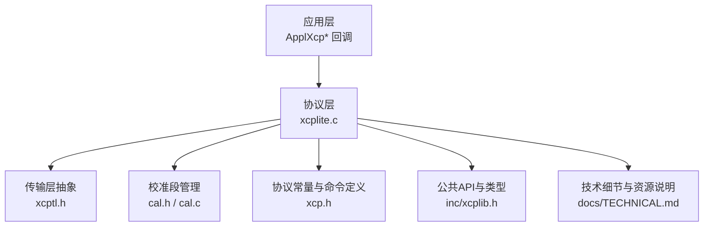
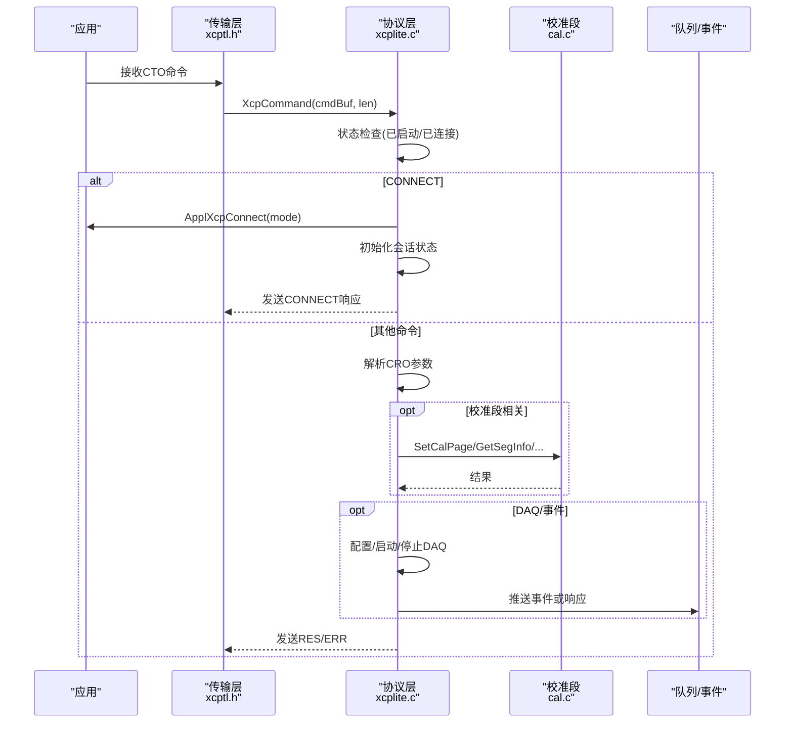
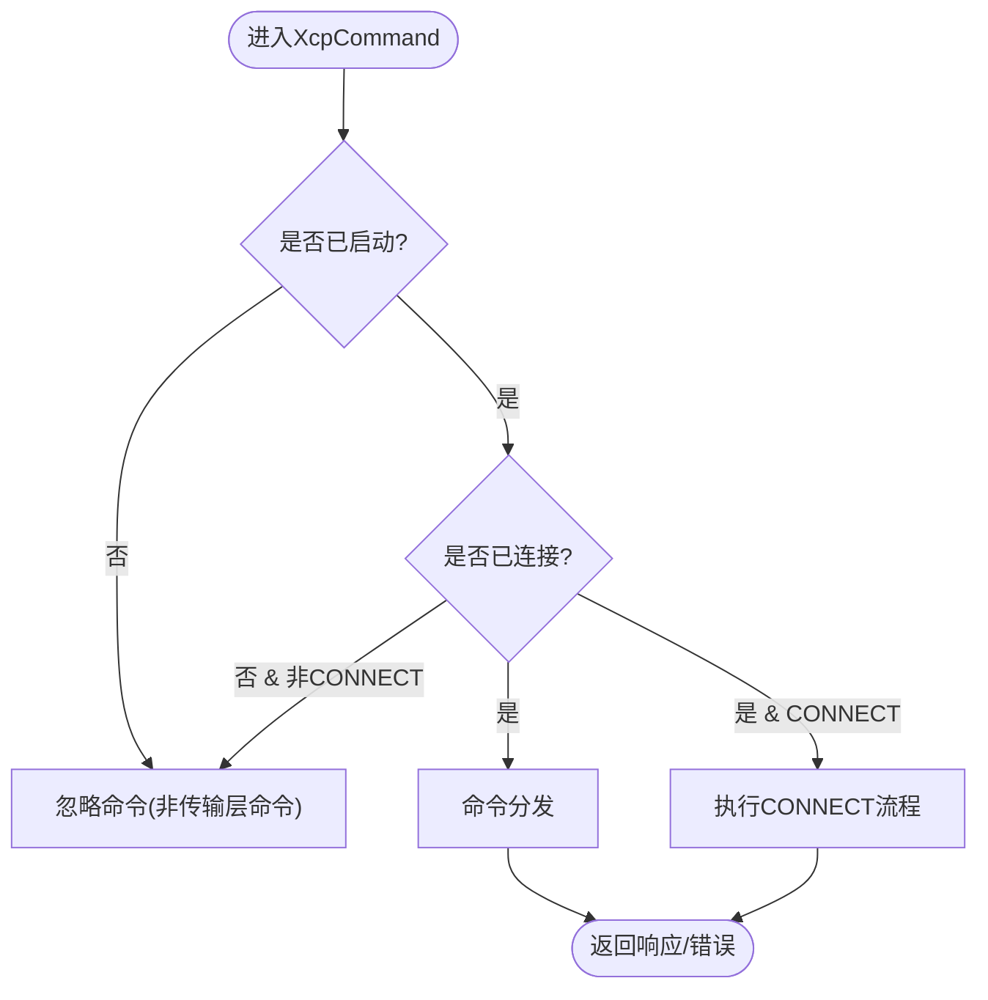
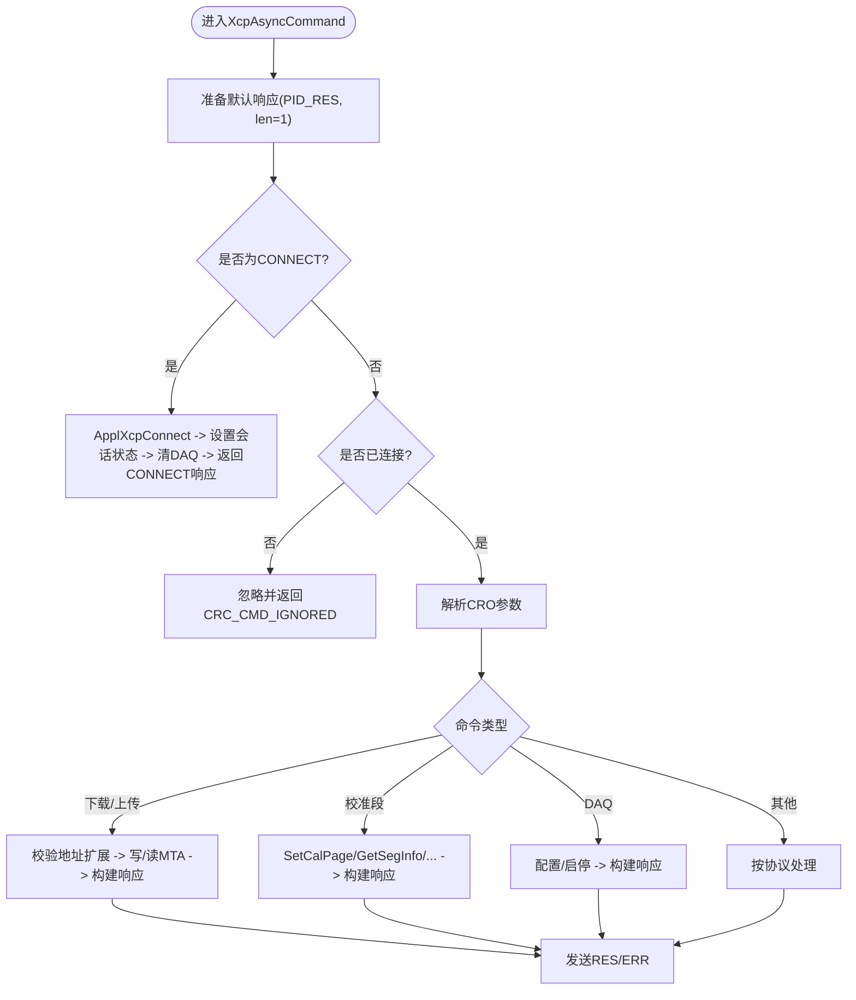
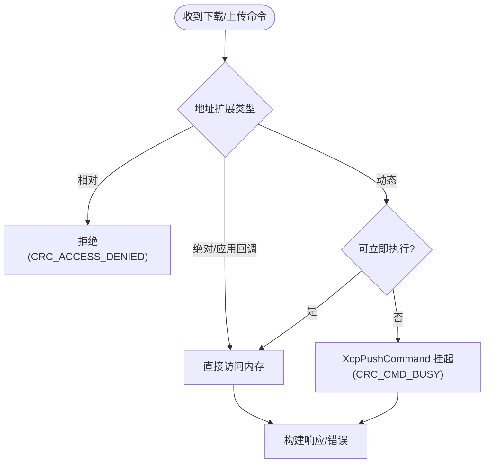
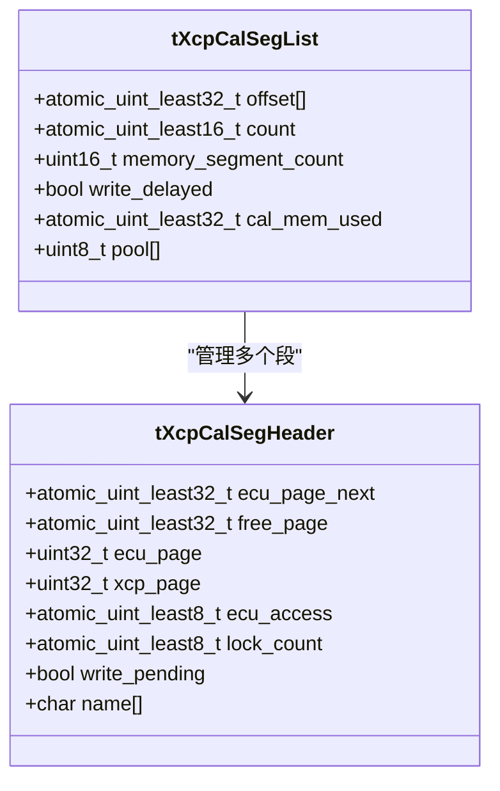
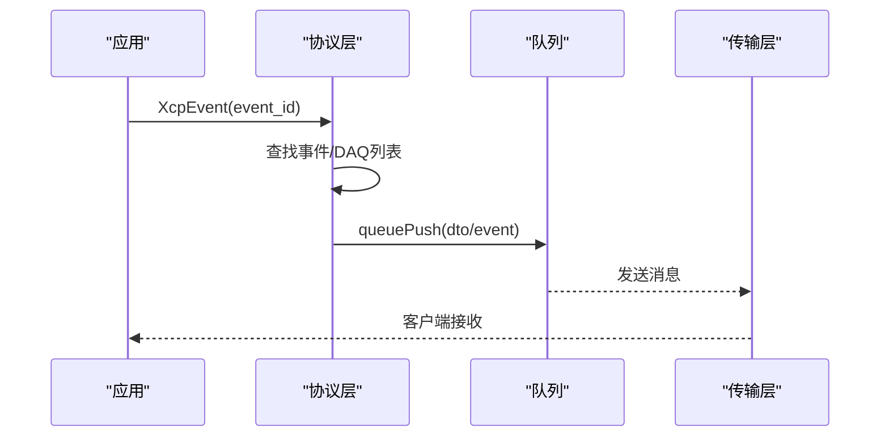
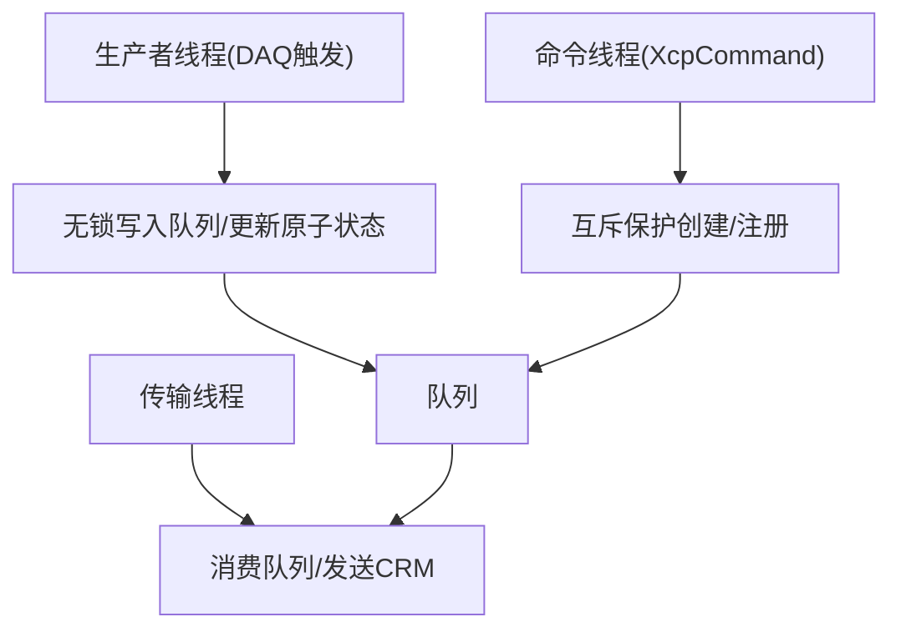
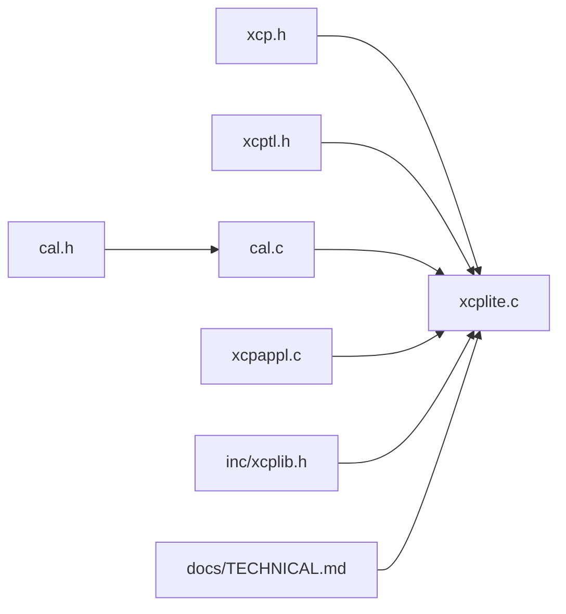

# XCP协议层

<cite>
**本文引用的文件**
- [src/xcplite.c](file://src/xcplite.c)
- [src/xcp.h](file://src/xcp.h)
- [src/xcptl.h](file://src/xcptl.h)
- [src/cal.h](file://src/cal.h)
- [src/cal.c](file://src/cal.c)
- [src/xcplite.h](file://src/xcplite.h)
- [src/xcpappl.c](file://src/xcpappl.c)
- [inc/xcplib.h](file://inc/xcplib.h)
- [docs/TECHNICAL.md](file://docs/TECHNICAL.md)
</cite>

## 目录
1. [简介](#简介)
2. [项目结构](#项目结构)
3. [核心组件](#核心组件)
4. [架构总览](#架构总览)
5. [详细组件分析](#详细组件分析)
6. [依赖关系分析](#依赖关系分析)
7. [性能考量](#性能考量)
8. [故障排查指南](#故障排查指南)
9. [结论](#结论)
10. [附录](#附录)

## 简介
本文件深入解析XCPlite的XCP协议层实现，聚焦ASAM XCP V1.4的核心能力：协议状态机管理、命令处理流程、错误处理机制与内存管理策略；阐述相对寻址模式、页切换机制与校准段管理的底层实现；说明多线程环境下的线程安全设计、原子操作使用与锁-free并发模型；并总结配置选项、性能优化技术与调试支持功能，为开发者提供协议扩展与自定义实现的指导。

## 项目结构
XCPlite将XCP协议层（xcplite.c）与传输层抽象（xcptl.h）、应用回调（xcpappl.c）、校准段管理（cal.h/cal.c）、公共接口（inc/xcplib.h）以及协议常量定义（xcp.h）解耦组织，便于在不同平台与传输介质上复用。

**图表来源**
- [src/xcplite.c:2031-2100](file://src/xcplite.c#L2031-L2100)
- [src/xcptl.h:19-26](file://src/xcptl.h#L19-L26)
- [src/cal.h:152-175](file://src/cal.h#L152-L175)
- [src/xcp.h:25-130](file://src/xcp.h#L25-L130)
- [inc/xcplib.h:39-58](file://inc/xcplib.h#L39-L58)
- [docs/TECHNICAL.md:5-24](file://docs/TECHNICAL.md#L5-L24)

**章节来源**
- [src/xcplite.c:2031-2100](file://src/xcplite.c#L2031-L2100)
- [src/xcptl.h:19-26](file://src/xcptl.h#L19-L26)
- [src/cal.h:152-175](file://src/cal.h#L152-L175)
- [src/xcp.h:25-130](file://src/xcp.h#L25-L130)
- [inc/xcplib.h:39-58](file://inc/xcplib.h#L39-L58)
- [docs/TECHNICAL.md:5-24](file://docs/TECHNICAL.md#L5-L24)

## 核心组件
- 协议状态机与会话管理：通过会话状态位（激活、启动、连接、遗留模式等）控制命令合法性与行为分支。
- 命令处理器：统一入口XcpCommand/XcpAsyncCommand分发标准命令、校准段命令、DAQ/STIM命令及V1.4 Level 1子命令。
- 错误处理：集中式错误码与负响应路径，保证一致性。
- 内存管理：静态全局共享状态tXcpData与进程本地状态tXcpLocalData分离；队列缓冲用于响应与事件发送；校准段采用固定池分配与原子 bump allocator。
- 寻址与数据访问：绝对/相对/动态寻址扩展；MTA设置与读写；应用回调完成实际内存访问。
- 校准段管理：页切换（ECU/XCP工作页）、冻结、复制、持久化；多页缓冲与原子交换。
- DAQ/事件：事件列表、ODT/DAQ表、触发与队列输出；可选预分频与时间戳。
- 传输层抽象：发送CRM、等待队列空、获取CTR等。

**章节来源**
- [src/xcplite.c:244-256](file://src/xcplite.c#L244-L256)
- [src/xcplite.c:2031-2100](file://src/xcplite.c#L2031-L2100)
- [src/xcplite.c:311-329](file://src/xcplite.c#L311-L329)
- [src/xcplite.h:385-423](file://src/xcplite.h#L385-L423)
- [src/cal.h:86-115](file://src/cal.h#L86-L115)
- [src/cal.h:152-175](file://src/cal.h#L152-L175)
- [src/xcptl.h:19-26](file://src/xcptl.h#L19-L26)

## 架构总览
下图展示从命令接收到响应/事件输出的整体流程，包括状态检查、命令分发、应用回调、校准段与DAQ交互、传输层发送。

**图表来源**
- [src/xcplite.c:2031-2100](file://src/xcplite.c#L2031-L2100)
- [src/xcplite.c:2131-2193](file://src/xcplite.c#L2131-L2193)
- [src/xcplite.c:2365-2453](file://src/xcplite.c#L2365-L2453)
- [src/xcptl.h:19-26](file://src/xcptl.h#L19-L26)

## 详细组件分析

### 协议状态机与会话管理
- 状态位：激活（SS_ACTIVATED）、启动（SS_STARTED）、连接（SS_CONNECTED）、遗留模式（SS_LEGACY_MODE）、DAQ运行（daq_running）。
- 生命周期：
  - XcpInit：初始化共享/本地状态、时钟、名称/EPK、DAQ清零、事件/校准段列表、设置SS_ACTIVATED；可选加载持久化文件。
  - XcpStart：设置SS_STARTED，可选恢复模式启动选中的DAQ列表。
  - CONNECT：调用ApplXcpConnect，重置DAQ，设置会话状态为激活+启动+连接+遗留模式，返回连接信息。
  - DISCONNECT/错误：清理状态，必要时断开。

**图表来源**
- [src/xcplite.c:2031-2100](file://src/xcplite.c#L2031-L2100)
- [src/xcplite.c:3047-3216](file://src/xcplite.c#L3047-L3216)
- [src/xcplite.c:3305-3462](file://src/xcplite.c#L3305-L3462)

**章节来源**
- [src/xcplite.c:244-256](file://src/xcplite.c#L244-L256)
- [src/xcplite.c:3047-3216](file://src/xcplite.c#L3047-L3216)
- [src/xcplite.c:3305-3462](file://src/xcplite.c#L3305-L3462)

### 命令处理流程与错误处理
- 统一入口：XcpCommand -> XcpAsyncCommand。
- 关键命令：
  - CONNECT：校验应用就绪，初始化会话状态，返回通信能力与最大包大小。
  - GET_STATUS/GET_COMM_MODE_INFO/GET_ID：返回状态、通信模式、标识信息（含EPK/A2L/ELF上传）。
  - SET_MTA/UPLOAD/DOWNLOAD/SHORT_UPLOAD/SHORT_DOWNLOAD：基于MTA进行内存读写，支持动态寻址异步挂起。
  - 校准段：SET_CAL_PAGE/GET_CAL_PAGE/COPY_CAL_PAGE/GET_SEGMENT_INFO/GET_PAGE_INFO/SET_SEGMENT_MODE/GET_SEGMENT_MODE。
  - DAQ：处理器信息、分辨率、列表模式、启动/停止、读取DAQ等。
  - V1.4 Level 1：如CC_LEVEL_1_COMMAND及其子命令（在xcp.h中定义）。
- 错误处理：集中宏error/check_error跳转至negative_response，填充PID_ERR与CRC_*错误码；长度检查check_len；非法地址扩展拒绝。

**图表来源**
- [src/xcplite.c:2031-2100](file://src/xcplite.c#L2031-L2100)
- [src/xcplite.c:2131-2193](file://src/xcplite.c#L2131-L2193)
- [src/xcplite.c:2277-2363](file://src/xcplite.c#L2277-L2363)
- [src/xcplite.c:2365-2453](file://src/xcplite.c#L2365-L2453)
- [src/xcp.h:25-130](file://src/xcp.h#L25-L130)

**章节来源**
- [src/xcplite.c:2031-2100](file://src/xcplite.c#L2031-L2100)
- [src/xcplite.c:2131-2193](file://src/xcplite.c#L2131-L2193)
- [src/xcplite.c:2277-2363](file://src/xcplite.c#L2277-L2363)
- [src/xcplite.c:2365-2453](file://src/xcplite.c#L2365-L2453)
- [src/xcp.h:25-130](file://src/xcp.h#L25-L130)

### 相对寻址模式与MTA管理
- 地址扩展（AddrExt）：
  - 绝对寻址（XCP_ADDR_EXT_ABS）：以模块基址偏移计算A2L地址。
  - 校准段相对寻址（XCP_ADDR_EXT_SEG）：以段内偏移访问。
  - 栈帧相对（Event相关）：以函数帧基址偏移。
  - 动态指针（XCP_ADDR_EXT_PTR/FILE）：指向外部空间（如文件上传）。
- MTA设置与限制：
  - SET_MTA设置当前传输地址；SHORT_*命令可内联设置。
  - 相对寻址模式下禁止直接DOWNLOAD/SHORT_DOWNLOAD（避免误写），需通过校准段管理或应用回调。
  - 动态寻址时，若不可立即执行，则挂起命令（XcpPushCommand）并在后台异步执行。

**图表来源**
- [src/xcplite.c:2277-2363](file://src/xcplite.c#L2277-L2363)
- [src/xcplite.c:2009-2024](file://src/xcplite.c#L2009-L2024)
- [docs/TECHNICAL.md:269-313](file://docs/TECHNICAL.md#L269-L313)

**章节来源**
- [src/xcplite.c:2277-2363](file://src/xcplite.c#L2277-L2363)
- [src/xcplite.c:2009-2024](file://src/xcplite.c#L2009-L2024)
- [docs/TECHNICAL.md:269-313](file://docs/TECHNICAL.md#L269-L313)

### 页切换机制与校准段管理
- 数据结构：
  - tXcpCalSegHeader：包含ECU页、XCP页、空闲页、访问计数、持久化位置、名称等。
  - tXcpCalSegList：原子偏移数组、计数、内存池（flat pool）与bump分配器。
- 页切换：
  - SET_CAL_PAGE/GET_CAL_PAGE：选择ECU/XCP工作页；COPY_CAL_PAGE：复制页内容。
  - FREEZE/SEGMENT_MODE：冻结模式与段模式控制。
- 线程安全：
  - 创建/注册使用互斥保护；访问页数据通过原子字段与无锁策略；bump分配器使用CAS。
- 持久化：
  - 可选二进制持久化文件，启动时加载，保持确定性顺序与参数数据。

**图表来源**
- [src/cal.h:86-115](file://src/cal.h#L86-L115)
- [src/cal.h:152-175](file://src/cal.h#L152-L175)

**章节来源**
- [src/cal.h:86-115](file://src/cal.h#L86-L115)
- [src/cal.h:152-175](file://src/cal.h#L152-L175)
- [src/cal.c:99-117](file://src/cal.c#L99-L117)
- [src/cal.c:122-180](file://src/cal.c#L122-L180)
- [src/cal.c:184-193](file://src/cal.c#L184-L193)

### DAQ/事件与队列输出
- 事件与DAQ表：
  - tXcpEvent/tXcpEventList：事件描述符、周期、优先级、关联DAQ链表。
  - tXcpDaqLists：DAQ列表、ODT、ODT条目地址/大小/扩展数组。
- 触发与输出：
  - XcpEvent系列函数触发事件，组装DTO并推入队列；队列溢出计数递增。
  - 支持时间戳、预分频、PID关闭、打包模式等。
- 传输：
  - 通过xcptl.h提供的发送接口将CRM/事件发送到上层传输。

**图表来源**
- [src/xcplite.h:126-195](file://src/xcplite.h#L126-L195)
- [src/xcplite.h:299-376](file://src/xcplite.h#L299-L376)
- [src/xcptl.h:19-26](file://src/xcptl.h#L19-L26)

**章节来源**
- [src/xcplite.h:126-195](file://src/xcplite.h#L126-L195)
- [src/xcplite.h:299-376](file://src/xcplite.h#L299-L376)
- [src/xcptl.h:19-26](file://src/xcptl.h#L19-L26)

### 多线程与并发模型
- 共享状态与本地状态分离：
  - tXcpData：跨进程/线程共享（SHM模式），仅含无指针字段与原子字段。
  - tXcpLocalData：进程本地，含队列句柄、MTA指针、互斥量等。
- 原子操作：
  - cmd_pending、daq_running、校准段头部的ecu_page/free_page/lock_count等使用原子类型与内存序。
- 锁-free路径：
  - 校准段内存池使用bump allocator与CAS；DAQ触发路径尽量无锁。
- 互斥保护：
  - 事件/校准段创建与注册时使用互斥；队列消费者在某些平台可能加锁。

**图表来源**
- [src/xcplite.h:385-423](file://src/xcplite.h#L385-L423)
- [src/cal.c:99-117](file://src/cal.c#L99-L117)
- [docs/TECHNICAL.md:28-52](file://docs/TECHNICAL.md#L28-L52)

**章节来源**
- [src/xcplite.h:385-423](file://src/xcplite.h#L385-L423)
- [src/cal.c:99-117](file://src/cal.c#L99-L117)
- [docs/TECHNICAL.md:28-52](file://docs/TECHNICAL.md#L28-L52)

### 配置选项、性能优化与调试支持
- 配置项：
  - XCPTL_MAX_CTO_SIZE/XCPTL_MAX_DTO_SIZE：最大命令/数据报文尺寸。
  - XCP_DAQ_MEM_SIZE：DAQ表内存大小。
  - XCP_ENABLE_*：启用DAQ时钟多播、PTP、事件列表、预分频、暂停恢复、校验和、用户命令、文件上传等。
  - OPTION_CAL_SEGMENTS/OPTION_SHM_MODE：校准段管理与共享内存模式。
- 性能优化：
  - 无锁DAQ触发与校准段访问；批量队列缓冲；最小化日志开销；对齐与紧凑结构体。
- 调试支持：
  - DBG_LEVEL分级打印；测试指标（gXcpTxPacketCount等）；XcpSetLogLevel；错误码与负响应；队列溢出告警。

**章节来源**
- [src/xcplite.c:95-158](file://src/xcplite.c#L95-L158)
- [src/xcplite.c:335-374](file://src/xcplite.c#L335-L374)
- [docs/TECHNICAL.md:5-24](file://docs/TECHNICAL.md#L5-L24)
- [docs/TECHNICAL.md:356-394](file://docs/TECHNICAL.md#L356-L394)

## 依赖关系分析
- 协议层依赖：
  - xcp.h：命令码、响应结构、错误码、事件码、服务请求码。
  - xcptl.h：传输层抽象（发送、等待队列空、计数器）。
  - cal.h/cal.c：校准段管理（页切换、冻结、复制、持久化）。
  - xcpappl.c：应用回调（连接、DAQ启停、内存访问、时钟、文件上传）。
  - inc/xcplib.h：公共API（以太网服务器、校准段、事件、A2L生成辅助）。
  - docs/TECHNICAL.md：资源消耗、平台要求、已知问题。

**图表来源**
- [src/xcp.h:25-130](file://src/xcp.h#L25-L130)
- [src/xcptl.h:19-26](file://src/xcptl.h#L19-L26)
- [src/cal.h:152-175](file://src/cal.h#L152-L175)
- [src/cal.c:122-180](file://src/cal.c#L122-L180)
- [src/xcpappl.c:39-67](file://src/xcpappl.c#L39-L67)
- [inc/xcplib.h:39-58](file://inc/xcplib.h#L39-L58)
- [docs/TECHNICAL.md:5-24](file://docs/TECHNICAL.md#L5-L24)

**章节来源**
- [src/xcp.h:25-130](file://src/xcp.h#L25-L130)
- [src/xcptl.h:19-26](file://src/xcptl.h#L19-L26)
- [src/cal.h:152-175](file://src/cal.h#L152-L175)
- [src/cal.c:122-180](file://src/cal.c#L122-L180)
- [src/xcpappl.c:39-67](file://src/xcpappl.c#L39-L67)
- [inc/xcplib.h:39-58](file://inc/xcplib.h#L39-L58)
- [docs/TECHNICAL.md:5-24](file://docs/TECHNICAL.md#L5-L24)

## 性能考量
- 资源占用：静态内存约10KB（DAQ表、校准段页），堆内存约32KB（传输队列），每线程栈约1KB。
- 队列大小：应足够覆盖至少10ms预期流量；除队列外无直接堆分配。
- 无锁路径：DAQ触发与校准段访问尽量无锁；bump分配器减少竞争。
- 日志与指标：按需开启DBG_LEVEL与测试指标，避免生产环境开销。

**章节来源**
- [docs/TECHNICAL.md:5-24](file://docs/TECHNICAL.md#L5-L24)
- [docs/TECHNICAL.md:28-52](file://docs/TECHNICAL.md#L28-L52)

## 故障排查指南
- 常见错误码：
  - CRC_CMD_SYNTAX：命令长度或格式错误。
  - CRC_OUT_OF_RANGE：参数越界。
  - CRC_ACCESS_DENIED：相对寻址下禁止直接下载。
  - CRC_CMD_BUSY：动态寻址命令挂起冲突。
  - CRC_PAGE_NOT_VALID/CRC_SEGMENT_NOT_VALID：页/段无效。
- 诊断要点：
  - 检查会话状态（是否已连接/启动）。
  - 检查地址扩展类型与MTA设置。
  - 查看队列溢出与事件计数。
  - 使用XcpSetLogLevel调整日志级别。
  - 参考“已知问题”部分（CANape特定行为与规避）。

**章节来源**
- [src/xcp.h:140-166](file://src/xcp.h#L140-L166)
- [src/xcplite.c:2099-2100](file://src/xcplite.c#L2099-L2100)
- [src/xcplite.c:2282-2317](file://src/xcplite.c#L2282-L2317)
- [docs/TECHNICAL.md:396-412](file://docs/TECHNICAL.md#L396-L412)

## 结论
XCPlite的XCP协议层实现了ASAM XCP V1.4的核心特性，具备清晰的协议状态机、健壮的命令处理与错误处理机制、高效的内存管理与无锁并发模型。通过相对寻址、页切换与校准段管理，提供了灵活且安全的参数访问与修改能力。结合配置选项与调试支持，开发者可在不同平台上快速集成与扩展。

## 附录
- 扩展建议：
  - 新增命令：在xcp.h定义命令码与结构，在xcplite.c的命令分发中添加case分支，遵循错误处理与长度检查规范。
  - 自定义寻址：实现ApplXcpReadMemory/ApplXcpWriteMemory回调，配合地址扩展使用。
  - 校准段：通过CalSegDecl/CalBlkDecl或运行时创建，利用页切换与冻结机制保障一致性。
  - DAQ优化：启用事件列表、预分频、打包模式，合理配置队列大小与优先级。

[无具体文件分析引用]