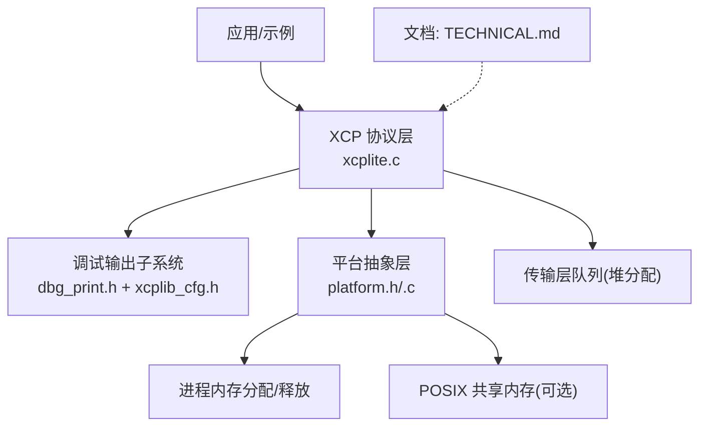
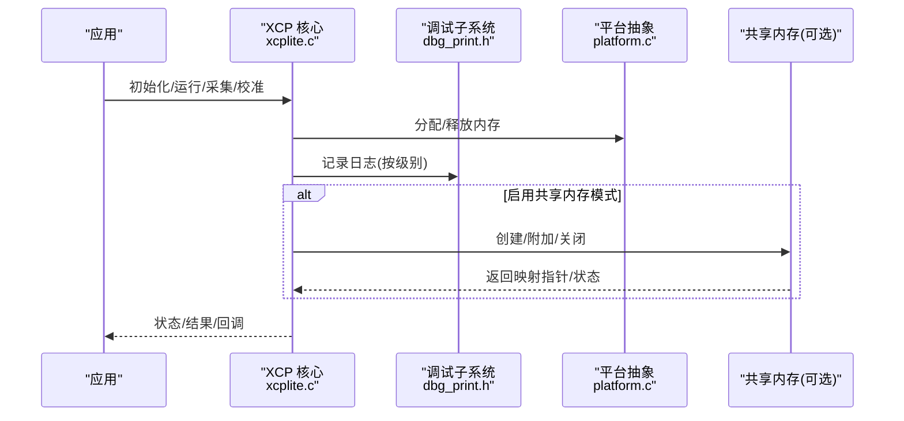
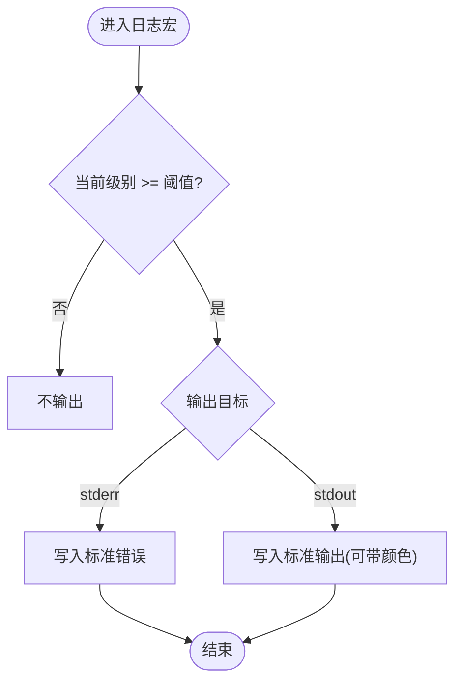
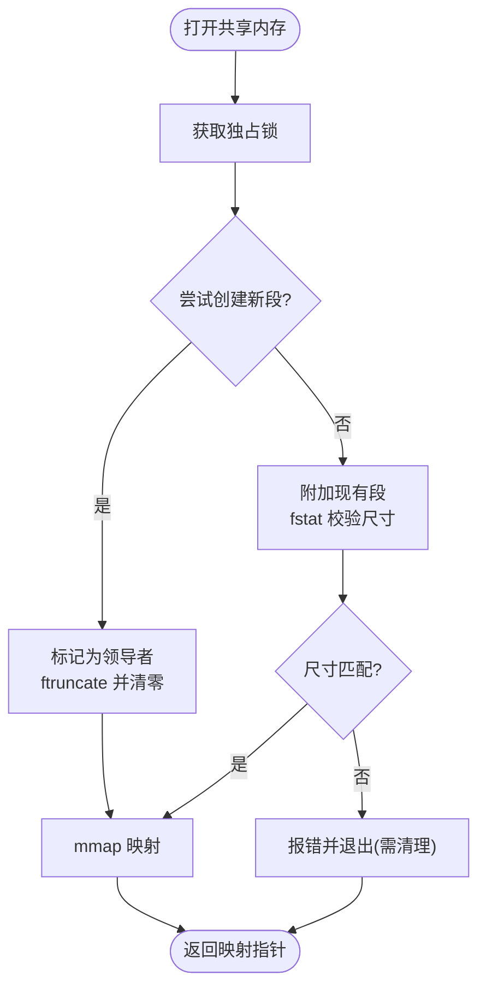
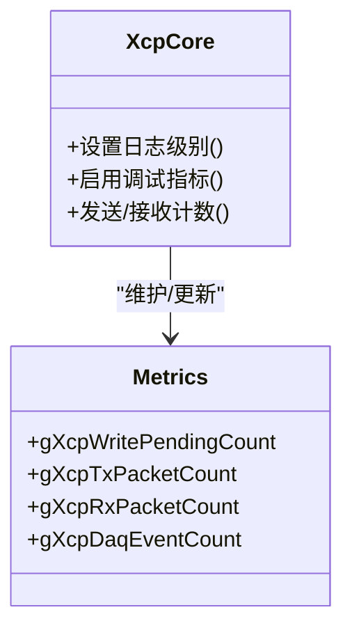
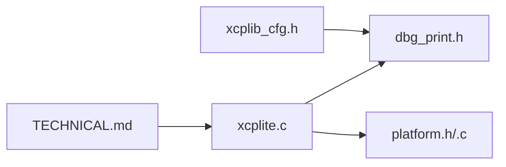

# 内存监控与调试

<cite>
**本文引用的文件**
- [dbg_print.h](file://src/dbg_print.h)
- [xcplib_cfg.h](file://src/xcplib_cfg.h)
- [platform.h](file://src/platform.h)
- [platform.c](file://src/platform.c)
- [xcplite.c](file://src/xcplite.c)
- [xcplib.h](file://inc/xcplib.h)
- [TECHNICAL.md](file://docs/TECHNICAL.md)
</cite>

## 目录
1. [简介](#简介)
2. [项目结构](#项目结构)
3. [核心组件](#核心组件)
4. [架构总览](#架构总览)
5. [详细组件分析](#详细组件分析)
6. [依赖关系分析](#依赖关系分析)
7. [性能考量](#性能考量)
8. [故障排除指南](#故障排除指南)
9. [结论](#结论)
10. [附录](#附录)

## 简介
本章节聚焦 XCPlite 的内存监控与调试能力，涵盖：
- 内存使用统计信息的收集方法与性能指标监控
- 内存泄漏检测机制与边界检查技术
- 调试输出系统的配置与使用（不同调试级别的日志记录）
- 内存分析工具的使用方法与问题诊断技巧
- 面向内存密集型应用的优化建议与故障排除指南

XCPlite 在默认构建下将大部分状态静态分配，传输层队列通过堆分配；同时提供可插拔的共享内存模式、可调式日志级别与多种平台抽象接口，便于在不同目标上进行内存与性能的观测与调优。

## 项目结构
围绕“内存监控与调试”的相关代码主要分布在以下位置：
- 调试输出系统：src/dbg_print.h，配合 src/xcplib_cfg.h 中的编译期选项控制
- 平台抽象与内存映射：src/platform.h/.c，提供进程内内存分配、POSIX 共享内存等
- XCP 核心与指标：src/xcplite.c，包含运行时日志级别设置、测试指标开关
- 公共 API：inc/xcplib.h，暴露日志级别设置等接口
- 资源与开销说明：docs/TECHNICAL.md，给出静态/堆/栈内存占用估算与队列分配策略

图表来源
- [xcplite.c:335-374](file://src/xcplite.c#L335-L374)
- [dbg_print.h:19-223](file://src/dbg_print.h#L19-L223)
- [platform.c:167-187](file://src/platform.c#L167-L187)
- [platform.c:201-360](file://src/platform.c#L201-L360)
- [TECHNICAL.md:5-24](file://docs/TECHNICAL.md#L5-L24)

章节来源
- [TECHNICAL.md:5-24](file://docs/TECHNICAL.md#L5-L24)
- [xcplite.c:335-374](file://src/xcplite.c#L335-L374)
- [dbg_print.h:19-223](file://src/dbg_print.h#L19-L223)
- [platform.c:167-187](file://src/platform.c#L167-L187)
- [platform.c:201-360](file://src/platform.c#L201-L360)

## 核心组件
- 调试输出子系统
  - 支持多级日志（错误/警告/信息/跟踪/调试/更详细），可通过编译期宏裁剪或运行时调整
  - 支持将错误/警告输出到标准错误流，或带 ANSI 颜色的标准输出
  - 提供固定日志级别或动态日志级别两种模式
- 平台内存抽象
  - 统一的进程内内存分配/释放接口
  - POSIX 共享内存的创建、附加、关闭与清理，含领导者选举与尺寸校验
- XCP 核心指标与日志
  - 运行时设置日志级别
  - 可选的调试指标计数器（如发送/接收包计数、事件计数等）
- 资源与开销说明
  - 静态内存、堆内存、栈内存的典型占用
  - 传输层队列的堆分配策略与大小建议

章节来源
- [dbg_print.h:19-223](file://src/dbg_print.h#L19-L223)
- [xcplib_cfg.h:42-53](file://src/xcplib_cfg.h#L42-L53)
- [platform.c:167-187](file://src/platform.c#L167-L187)
- [platform.c:201-360](file://src/platform.c#L201-L360)
- [xcplite.c:335-374](file://src/xcplite.c#L335-L374)
- [TECHNICAL.md:5-24](file://docs/TECHNICAL.md#L5-L24)

## 架构总览
下图展示了内存监控与调试在 XCPlite 中的整体交互：应用通过 XCP 核心进行数据采集与校准，核心调用平台抽象进行内存分配与共享内存管理；调试子系统按配置输出各级日志；文档提供资源消耗参考。

图表来源
- [xcplite.c:335-374](file://src/xcplite.c#L335-L374)
- [platform.c:167-187](file://src/platform.c#L167-L187)
- [platform.c:201-360](file://src/platform.c#L201-L360)
- [dbg_print.h:19-223](file://src/dbg_print.h#L19-L223)

## 详细组件分析

### 调试输出系统与日志级别
- 日志级别定义与裁剪
  - 支持 1=错误、2=警告、3=信息、4=跟踪、5=调试、6=更详细
  - 可通过 OPTION_MAX_DBG_LEVEL 裁剪未启用级别，减少代码体积
  - 支持固定日志级别（编译期）或运行时调整（默认级别 + 上限）
- 输出目标
  - 可选择输出到 stderr 或 stdout（带颜色）
  - 支持可选的文件与行号定位（编译开关）
- 运行时设置
  - 提供 XcpSetLogLevel(level) 接口用于运行时调整日志级别
  - 当启用固定级别时，该接口为占位实现并提示忽略

图表来源
- [dbg_print.h:19-223](file://src/dbg_print.h#L19-L223)
- [xcplib_cfg.h:42-53](file://src/xcplib_cfg.h#L42-L53)
- [xcplite.c:349-374](file://src/xcplite.c#L349-L374)
- [xcplib.h:867-871](file://inc/xcplib.h#L867-L871)

章节来源
- [dbg_print.h:19-223](file://src/dbg_print.h#L19-L223)
- [xcplib_cfg.h:42-53](file://src/xcplib_cfg.h#L42-L53)
- [xcplite.c:349-374](file://src/xcplite.c#L349-L374)
- [xcplib.h:867-871](file://inc/xcplib.h#L867-L871)

### 平台内存抽象与共享内存
- 进程内内存分配/释放
  - 提供 platformMemAlloc/Free 封装，底层使用 mmap/VirtualAlloc 等
- POSIX 共享内存
  - 领导者选举：首个成功创建并 ftruncate 的进程成为领导者，负责零初始化区域
  - 跟随者附加：仅附加已有共享内存段，读取实际大小并映射
  - 安全校验：对已存在段的尺寸进行校验，避免旧版本残留导致的数据损坏
  - 清理：支持关闭映射与 unlink 名称，防止僵尸对象
- 线程同步与原子
  - 提供跨平台的互斥锁与原子操作封装，确保并发访问安全

图表来源
- [platform.c:201-360](file://src/platform.c#L201-L360)

章节来源
- [platform.c:167-187](file://src/platform.c#L167-L187)
- [platform.c:201-360](file://src/platform.c#L201-L360)
- [platform.h:266-298](file://src/platform.h#L266-L298)

### XCP 核心指标与内存统计
- 运行时指标开关
  - 通过 TEST_ENABLE_DBG_METRICS 等编译选项启用内部计数器（如发送/接收包数、事件计数、待处理写计数等）
- 日志级别控制
  - 提供 XcpSetLogLevel 接口，允许在运行时调整日志级别，便于定位问题
- 资源消耗参考
  - 静态内存约 10KB（DAQ 表、校准页等）
  - 堆内存约 32KB（传输层队列）
  - 每线程栈约 1KB（收发线程）
  - 队列通过 malloc/aligned_alloc 分配，大小应覆盖预期流量的至少 10ms

图表来源
- [xcplite.c:335-374](file://src/xcplite.c#L335-L374)
- [TECHNICAL.md:5-24](file://docs/TECHNICAL.md#L5-L24)

章节来源
- [xcplite.c:335-374](file://src/xcplite.c#L335-L374)
- [TECHNICAL.md:5-24](file://docs/TECHNICAL.md#L5-L24)

### 内存泄漏检测与边界检查
- 内存泄漏检测
  - 库本身未内置通用内存泄漏检测器；建议在目标平台使用外部工具（如 Valgrind、AddressSanitizer、Windows CRT 调试器等）结合构建选项进行检测
  - 对于共享内存场景，注意领导者/跟随者的生命周期管理与清理流程，避免僵尸段
- 边界检查
  - 传输层与队列实现中通常包含长度/索引校验逻辑（例如队列入队/出队的边界判断），具体以各队列实现为准
  - 在 DAQ/校准路径中，建议结合断言与日志级别提升来捕获越界访问
- 建议实践
  - 在调试构建中开启更多断言与日志级别
  - 对关键路径增加输入参数校验与范围检查
  - 使用平台提供的内存调试工具生成报告，定位异常分配/释放

章节来源
- [platform.c:201-360](file://src/platform.c#L201-L360)
- [TECHNICAL.md:5-24](file://docs/TECHNICAL.md#L5-L24)

### 调试输出系统的配置与使用
- 编译期配置
  - 启用/禁用调试打印：OPTION_ENABLE_DBG_PRINTS
  - 默认日志级别：OPTION_DEFAULT_DBG_LEVEL
  - 最大日志级别裁剪：OPTION_MAX_DBG_LEVEL
  - 固定日志级别：OPTION_FIXED_DBG_LEVEL（运行时不可调）
  - 输出到 stderr：OPTION_ENABLE_DBG_STDERR
- 运行时配置
  - 调用 XcpSetLogLevel(level) 调整日志级别（仅在非固定模式下生效）
- 使用建议
  - 开发阶段：提高日志级别，启用 stderr 输出以便快速定位问题
  - 发布阶段：降低日志级别或使用固定级别以减少开销

章节来源
- [xcplib_cfg.h:42-53](file://src/xcplib_cfg.h#L42-L53)
- [dbg_print.h:19-223](file://src/dbg_print.h#L19-L223)
- [xcplib.h:867-871](file://inc/xcplib.h#L867-L871)
- [xcplite.c:349-374](file://src/xcplite.c#L349-L374)

### 内存分析工具使用方法与问题诊断技巧
- 工具选择
  - Linux/macOS：Valgrind、AddressSanitizer、perf 等
  - Windows：Visual Studio 调试器、CRT 调试器、Windows Performance Toolkit
- 使用步骤
  - 在调试构建中启用断言与较高日志级别
  - 针对共享内存场景，确认领导者/跟随者正确创建与清理
  - 运行被测程序并触发典型工作负载，收集内存快照或堆栈信息
  - 分析报告中关注：重复分配未释放、越界访问、竞争条件导致的破坏
- 诊断技巧
  - 逐步缩小范围：最小化复现用例，隔离问题模块
  - 结合日志：在关键路径插入日志，观察分配/释放时序
  - 验证队列大小：根据流量峰值调整传输层队列大小，避免拥塞导致的重传或丢包

章节来源
- [TECHNICAL.md:5-24](file://docs/TECHNICAL.md#L5-L24)
- [platform.c:201-360](file://src/platform.c#L201-L360)

### 内存密集型应用的优化建议
- 队列与缓冲
  - 合理设置传输层队列大小，覆盖预期流量的至少 10ms，平衡内存与吞吐
  - 在高吞吐场景考虑固定条目大小的队列以提升缓存友好性
- 日志与指标
  - 生产环境关闭或限制日志级别，避免 I/O 开销
  - 选择性启用指标计数器，仅保留关键路径统计
- 共享内存
  - 明确领导者/跟随者职责，确保初始化顺序与尺寸一致
  - 及时清理共享内存名称，避免僵尸对象
- 时间与同步
  - 使用高精度时钟接口，减少系统调用频率（利用 last 值缓存）
  - 在高频路径避免不必要的锁竞争

章节来源
- [TECHNICAL.md:5-24](file://docs/TECHNICAL.md#L5-L24)
- [platform.c:434-654](file://src/platform.c#L434-L654)
- [platform.c:201-360](file://src/platform.c#L201-L360)

## 依赖关系分析
- 调试子系统依赖配置头，决定是否启用及级别裁剪
- XCP 核心依赖平台抽象进行内存分配与共享内存管理
- 文档提供资源消耗与队列分配策略指导

图表来源
- [xcplib_cfg.h:42-53](file://src/xcplib_cfg.h#L42-L53)
- [dbg_print.h:19-223](file://src/dbg_print.h#L19-L223)
- [xcplite.c:335-374](file://src/xcplite.c#L335-L374)
- [platform.c:167-187](file://src/platform.c#L167-L187)
- [TECHNICAL.md:5-24](file://docs/TECHNICAL.md#L5-L24)

章节来源
- [xcplib_cfg.h:42-53](file://src/xcplib_cfg.h#L42-L53)
- [dbg_print.h:19-223](file://src/dbg_print.h#L19-L223)
- [xcplite.c:335-374](file://src/xcplite.c#L335-L374)
- [platform.c:167-187](file://src/platform.c#L167-L187)
- [TECHNICAL.md:5-24](file://docs/TECHNICAL.md#L5-L24)

## 性能考量
- 日志开销
  - 高日志级别会增加 I/O 与格式化开销，生产环境建议降低级别或固定级别
- 队列大小
  - 队列过小会导致丢包或阻塞，过大则浪费内存；建议基于峰值流量与延迟要求设定
- 共享内存
  - 领导者初始化与跟随者附加涉及系统调用，应在启动阶段完成，避免热路径
- 时间查询
  - 使用 last 值缓存减少系统调用，提升高频路径性能

章节来源
- [TECHNICAL.md:5-24](file://docs/TECHNICAL.md#L5-L24)
- [platform.c:434-654](file://src/platform.c#L434-L654)

## 故障排除指南
- 共享内存相关
  - 症状：无法附加或尺寸不匹配
  - 排查：检查是否存在旧版本残留段，使用清理脚本移除；确认领导者是否正确初始化
- 日志无输出
  - 症状：看不到期望的调试信息
  - 排查：确认已启用调试打印与合适的日志级别；检查是否启用了固定级别导致运行时设置无效
- 内存泄漏
  - 症状：进程内存持续增长
  - 排查：使用外部工具定位未释放分配；检查队列与共享内存的生命周期管理
- 性能下降
  - 症状：吞吐降低或延迟升高
  - 排查：调整队列大小；降低日志级别；检查锁竞争与系统调用热点

章节来源
- [platform.c:201-360](file://src/platform.c#L201-L360)
- [dbg_print.h:19-223](file://src/dbg_print.h#L19-L223)
- [TECHNICAL.md:5-24](file://docs/TECHNICAL.md#L5-L24)

## 结论
XCPlite 提供了完善的调试输出系统与平台抽象，支持灵活的日志级别控制与共享内存模式，便于在不同目标上进行内存与性能的观测与调优。结合文档中的资源消耗参考与队列分配策略，可在内存密集型应用中实现稳定的性能表现。通过外部工具与合理的配置，可有效定位内存泄漏与边界问题，保障系统的可靠性与可维护性。

## 附录
- 常用配置项速查
  - 启用调试打印：OPTION_ENABLE_DBG_PRINTS
  - 默认日志级别：OPTION_DEFAULT_DBG_LEVEL
  - 最大日志级别裁剪：OPTION_MAX_DBG_LEVEL
  - 固定日志级别：OPTION_FIXED_DBG_LEVEL
  - 输出到 stderr：OPTION_ENABLE_DBG_STDERR
- 资源估算
  - 静态内存：约 10KB
  - 堆内存：约 32KB（传输层队列）
  - 每线程栈：约 1KB

章节来源
- [xcplib_cfg.h:42-53](file://src/xcplib_cfg.h#L42-L53)
- [TECHNICAL.md:5-24](file://docs/TECHNICAL.md#L5-L24)