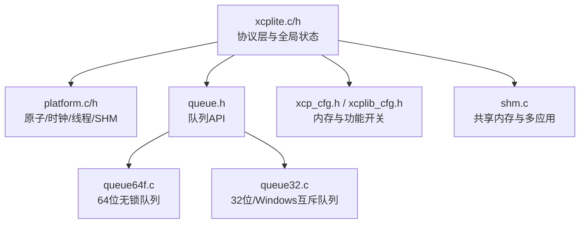
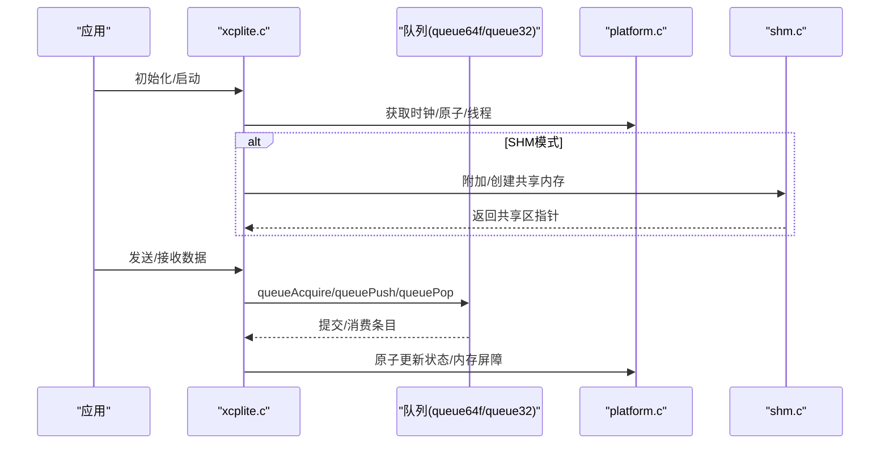
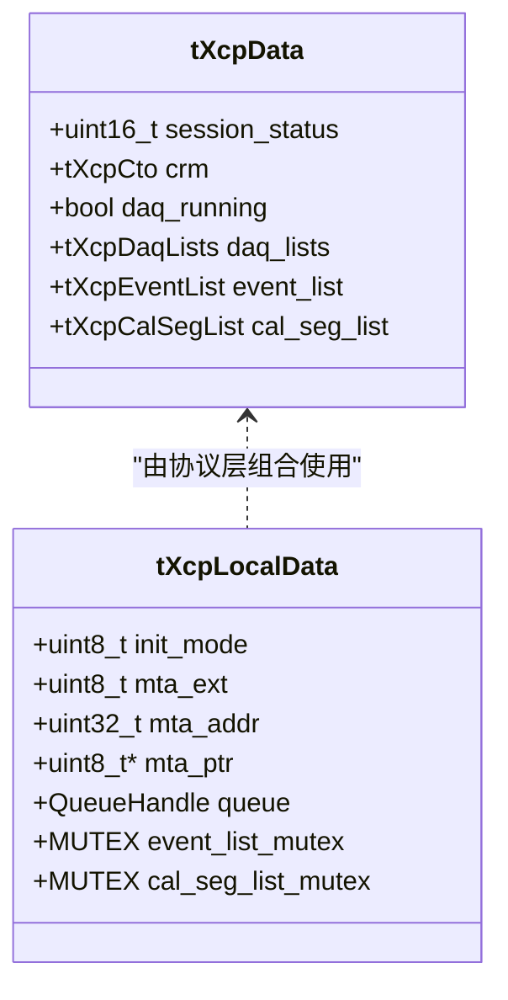
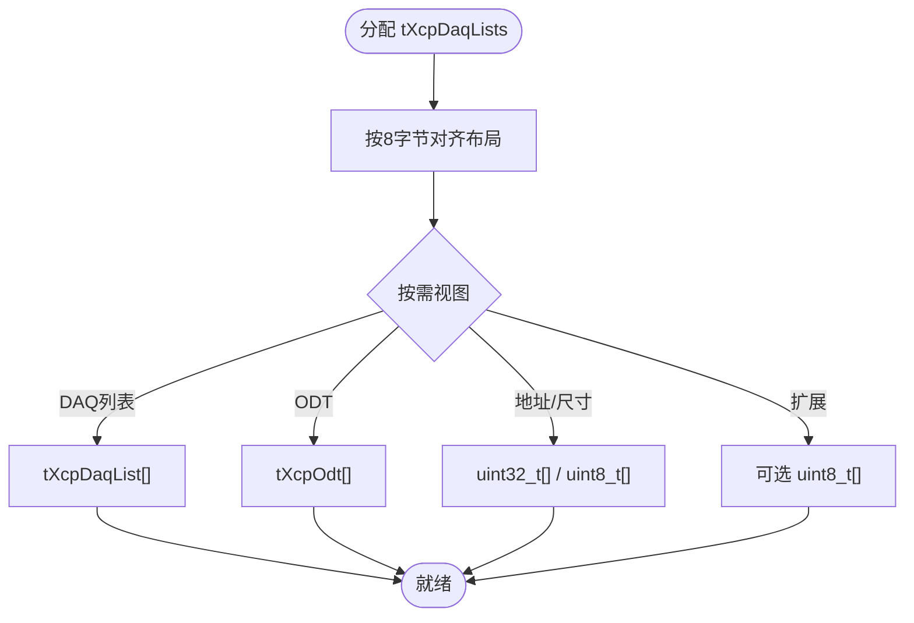
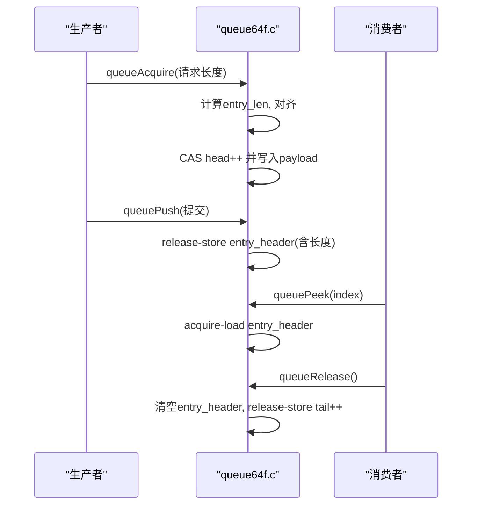
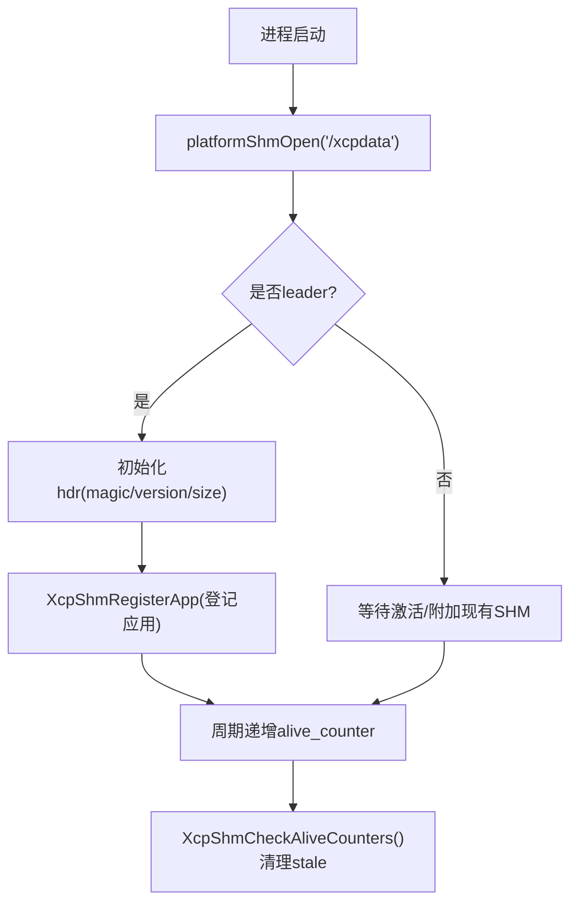
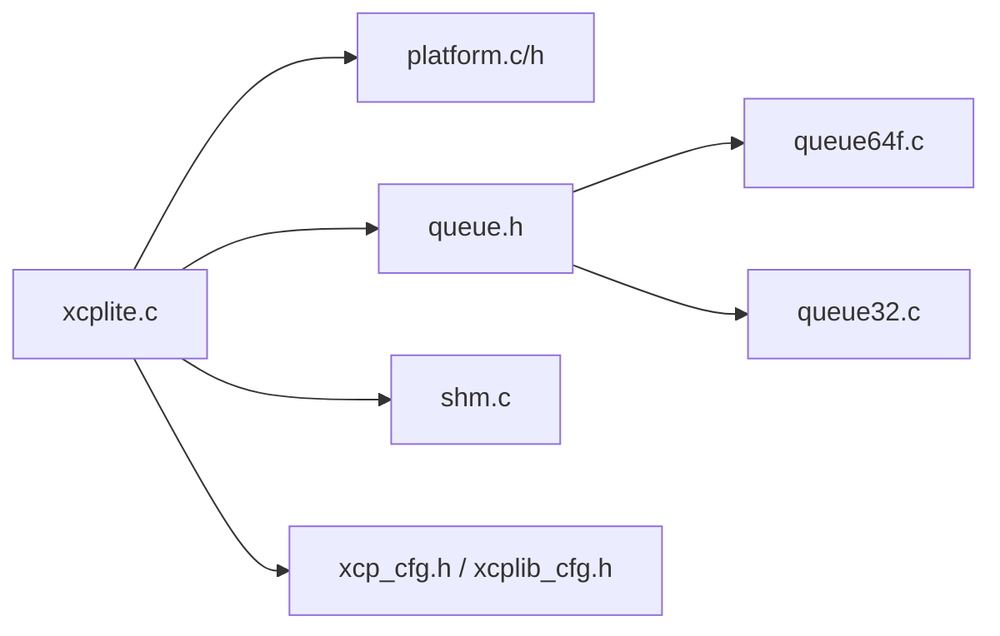

# 内存管理策略

<cite>
**本文引用的文件**
- [src/xcplite.c](file://src/xcplite.c)
- [src/xcplite.h](file://src/xcplite.h)
- [src/platform.c](file://src/platform.c)
- [src/platform.h](file://src/platform.h)
- [src/util.c](file://src/util.c)
- [src/util.h](file://src/util.h)
- [src/queue.h](file://src/queue.h)
- [src/queue32.c](file://src/queue32.c)
- [src/queue64f.c](file://src/queue64f.c)
- [src/xcplib_cfg.h](file://src/xcplib_cfg.h)
- [src/xcp_cfg.h](file://src/xcp_cfg.h)
- [src/shm.c](file://src/shm.c)
</cite>

## 目录
1. [简介](#简介)
2. [项目结构](#项目结构)
3. [核心组件](#核心组件)
4. [架构总览](#架构总览)
5. [详细组件分析](#详细组件分析)
6. [依赖关系分析](#依赖关系分析)
7. [性能考量](#性能考量)
8. [故障诊断指南](#故障诊断指南)
9. [结论](#结论)
10. [附录](#附录)

## 简介
本文件系统性阐述 XCPlite 的内存管理机制，覆盖全局状态与缓冲区分配、共享内存模式、队列（无锁与互斥）设计、原子操作与内存屏障、边界检查与泄漏防护、平台对齐与优化、配置选项、调试工具与故障诊断方法，并给出面向内存密集型应用的优化建议与最佳实践。

## 项目结构
XCPlite 将协议层、传输层与平台抽象解耦：
- 协议层与全局状态：xcplite.c/h 定义 tXcpData/tXcpLocalData、DAQ 表、事件列表等；在 SHM 模式下通过指针访问共享区，否则使用静态或进程内堆内存。
- 平台抽象：platform.c/h 提供原子、时钟、线程、互斥、共享内存映射等能力。
- 队列子系统：queue.h 统一 API，queue64f.c（64位无锁固定大小）、queue32.c（32位/Windows 互斥实现）提供多生产者单消费者缓冲。
- 配置：xcplib_cfg.h、xcp_cfg.h 控制 DAQ 内存池、事件数量、队列类型、校准段管理等。
- 共享内存：shm.c 负责跨进程共享状态、应用注册、A2L 生命周期协调。

图表来源
- [src/xcplite.c:188-256](file://src/xcplite.c#L188-L256)
- [src/xcplite.h:382-495](file://src/xcplite.h#L382-L495)
- [src/platform.c:161-363](file://src/platform.c#L161-L363)
- [src/queue.h:29-83](file://src/queue.h#L29-L83)
- [src/queue64f.c:250-294](file://src/queue64f.c#L250-L294)
- [src/queue32.c:85-100](file://src/queue32.c#L85-L100)
- [src/xcplib_cfg.h:120-162](file://src/xcplib_cfg.h#L120-L162)
- [src/xcp_cfg.h:360-406](file://src/xcp_cfg.h#L360-L406)
- [src/shm.c:69-80](file://src/shm.c#L69-L80)

章节来源
- [src/xcplite.c:188-256](file://src/xcplite.c#L188-L256)
- [src/xcplite.h:382-495](file://src/xcplite.h#L382-L495)
- [src/platform.c:161-363](file://src/platform.c#L161-L363)
- [src/queue.h:29-83](file://src/queue.h#L29-L83)
- [src/xcplib_cfg.h:120-162](file://src/xcplib_cfg.h#L120-L162)
- [src/xcp_cfg.h:360-406](file://src/xcp_cfg.h#L360-L406)
- [src/shm.c:69-80](file://src/shm.c#L69-L80)

## 核心组件
- 全局状态与本地状态
  - tXcpData：协议层共享/全局状态，包含会话状态、响应缓冲、DAQ 表、事件列表、校准段列表等。SHM 模式下为跨进程可见。
  - tXcpLocalData：进程本地状态，含 MTA、队列句柄、事件/校准段创建互斥量、时钟信息等。
- 缓冲区与内存池
  - DAQ 表内存池：tXcpDaqLists 以固定大小 XCP_DAQ_MEM_SIZE 线性块组织 DAQ 列表、ODT、地址/尺寸数组等，按 8 字节对齐。
  - 传输层队列：根据平台选择 queue64f.c（无锁）或 queue32.c（互斥），支持消息累积与头部预留空间。
  - 校准段内存池：OPTION_CAL_MEM_SIZE 管理的校准段工作页/参考页缓冲。
- 共享内存模式
  - 通过 platformShmOpen/mmap 建立共享区域，首进程作为 leader 初始化并清零，后续 follower 附加只读/读写视图。
  - 应用注册表、存活计数、A2L 最终化标志均位于共享区，使用原子操作保证一致性。

章节来源
- [src/xcplite.h:382-495](file://src/xcplite.h#L382-L495)
- [src/xcplite.c:188-256](file://src/xcplite.c#L188-L256)
- [src/xcplite.h:334-376](file://src/xcplite.h#L334-L376)
- [src/xcplib_cfg.h:82-118](file://src/xcplib_cfg.h#L82-L118)
- [src/platform.c:161-363](file://src/platform.c#L161-L363)
- [src/shm.c:69-80](file://src/shm.c#L69-L80)

## 架构总览
下图展示内存相关的关键交互：协议层通过 tXcpData 访问共享/全局状态，使用队列进行数据传输，平台层提供原子与共享内存能力。

图表来源
- [src/xcplite.c:188-256](file://src/xcplite.c#L188-L256)
- [src/queue64f.c:399-519](file://src/queue64f.c#L399-L519)
- [src/queue32.c:207-304](file://src/queue32.c#L207-L304)
- [src/platform.c:161-363](file://src/platform.c#L161-L363)
- [src/shm.c:162-208](file://src/shm.c#L162-L208)

## 详细组件分析

### 全局状态与本地状态的内存布局与访问
- 全局/共享状态 tXcpData
  - 字段包括 session_status、crm 响应缓冲、daq_running、daq_lists、event_list、cal_seg_list 等。
  - 在 SHM 模式下，gXcpData 为指向共享区的指针；非 SHM 模式下为进程内对象。
  - 通过宏 shared/shared_mut 提供受控访问，确保并发安全与可读性约束。
- 本地状态 tXcpLocalData
  - 包含 MTA（指针/地址/扩展）、队列句柄、写指针游标、时钟信息、互斥量等。
  - 所有跨进程不可移植的指针仅保存在本地状态中，避免跨进程失效。

图表来源
- [src/xcplite.h:382-495](file://src/xcplite.h#L382-L495)
- [src/xcplite.c:188-256](file://src/xcplite.c#L188-L256)

章节来源
- [src/xcplite.h:382-495](file://src/xcplite.h#L382-L495)
- [src/xcplite.c:188-256](file://src/xcplite.c#L188-L256)

### DAQ 表内存池与对齐
- tXcpDaqLists 使用单一连续内存块，内部 union 提供多种视图：DAQ 列表、ODT、地址/尺寸数组、可选地址扩展数组。
- 对齐要求：整体按 8 字节对齐，便于高效拷贝与 DMA 友好。
- 容量由 XCP_DAQ_MEM_SIZE 决定，编译期断言确保合理范围。

图表来源
- [src/xcplite.h:334-376](file://src/xcplite.h#L334-L376)
- [src/xcp_cfg.h:360-373](file://src/xcp_cfg.h#L360-L373)

章节来源
- [src/xcplite.h:334-376](file://src/xcplite.h#L334-L376)
- [src/xcp_cfg.h:360-373](file://src/xcp_cfg.h#L360-L373)

### 传输层队列设计与内存模型
- 通用 API：queue.h 定义 acquire/push/pop/release 等接口，支持用户头预留与段累积。
- 64位无锁队列（queue64f.c）
  - 固定条目大小，每个条目含 atomic entry_header 与 payload。
  - 生产者通过 CAS 推进 head，写入后 release-store 发布；消费者 acquire-load 读取，release 时清空并推进 tail。
  - 使用 memory_order_acquire/release 保证可见性与顺序。
- 32位/Windows 队列（queue32.c）
  - 基于互斥保护的多生产者单消费者，累积多个消息到 segment，pop 时填充传输层计数器。
  - 溢出统计通过 packets_lost 暴露。

图表来源
- [src/queue64f.c:399-519](file://src/queue64f.c#L399-L519)
- [src/queue64f.c:557-660](file://src/queue64f.c#L557-L660)

章节来源
- [src/queue.h:29-83](file://src/queue.h#L29-L83)
- [src/queue64f.c:250-294](file://src/queue64f.c#L250-L294)
- [src/queue64f.c:399-519](file://src/queue64f.c#L399-L519)
- [src/queue64f.c:557-660](file://src/queue64f.c#L557-L660)
- [src/queue32.c:207-304](file://src/queue32.c#L207-L304)
- [src/queue32.c:333-417](file://src/queue32.c#L333-L417)

### 原子操作与内存屏障
- 平台抽象：platform.h 在 POSIX 使用 stdatomic.h，FreeRTOS 使用 C11 原子或模拟；Windows 可通过 OPTION_ATOMIC_EMULATION 使用 Interlocked intrinsics。
- 关键用法
  - 事件计数：acquire/release 语义保证新事件可见性。
  - 队列条目：release-store 发布数据，acquire-load 消费数据。
  - 共享内存头：app_count、alive_counter、a2l_finalize_requested 等使用原子存取。
- 内存屏障
  - 通过 memory_order_acquire/release 显式建立 happens-before 关系，避免编译器/CPU重排导致的数据竞争。

章节来源
- [src/platform.h:177-197](file://src/platform.h#L177-L197)
- [src/platform.h:520-672](file://src/platform.h#L520-L672)
- [src/xcplite.c:779-789](file://src/xcplite.c#L779-L789)
- [src/queue64f.c:430-519](file://src/queue64f.c#L430-L519)
- [src/shm.c:434-462](file://src/shm.c#L434-L462)

### 共享内存模式与跨进程状态
- 创建与附加：platformShmOpen 使用 shm_open/ftruncate/mmap，leader 零初始化；follower 直接附加。
- 应用注册：XcpShmRegisterApp 在 app_list 中登记项目名、EPK、pid、角色（leader/server）。
- 存活检测：定期递增 alive_counter，超时未更新视为 stale，清理槽位。
- A2L 协调：leader 发起 finalize 请求，各应用设置 a2l_finalized，收集文件名。

图表来源
- [src/platform.c:201-319](file://src/platform.c#L201-L319)
- [src/shm.c:69-80](file://src/shm.c#L69-L80)
- [src/shm.c:526-608](file://src/shm.c#L526-L608)
- [src/shm.c:434-517](file://src/shm.c#L434-L517)

章节来源
- [src/platform.c:201-319](file://src/platform.c#L201-L319)
- [src/shm.c:69-80](file://src/shm.c#L69-L80)
- [src/shm.c:526-608](file://src/shm.c#L526-L608)
- [src/shm.c:434-517](file://src/shm.c#L434-L517)

### 内存泄漏防护与边界检查
- 队列溢出保护
  - queue64f.c：head > tail 且剩余空间不足时判定溢出，增加 packets_lost。
  - queue32.c：segment 满时丢弃新消息，packets_lost++。
- 参数校验
  - queueAcquire 对 packet_size 做范围检查与对齐。
  - xcp_cfg.h 对 CLOCK_TICKS_PER_S、XCP_MAX_EVENT_COUNT 等进行编译期断言。
- 字符串与缓冲区
  - 使用 safe_strnlen/SNPRINTF 防止越界；项目名/EPK 写入时截断并补零。
- 资源释放
  - queueDeinit/free 释放队列内存；platformMemFree/unmap 释放共享内存。

章节来源
- [src/queue64f.c:430-487](file://src/queue64f.c#L430-L487)
- [src/queue32.c:207-280](file://src/queue32.c#L207-L280)
- [src/platform.h:220-249](file://src/platform.h#L220-L249)
- [src/xcp_cfg.h:414-434](file://src/xcp_cfg.h#L414-L434)
- [src/xcplite.c:435-482](file://src/xcplite.c#L435-L482)

### 平台对齐与性能优化
- 对齐策略
  - DAQ 表按 8 字节对齐；队列条目按 CACHE_LINE_SIZE 对齐以减少伪共享。
  - 32位队列要求消息头字段对齐（16位），packet alignment 为 2 的幂。
- 缓存友好
  - 64位队列 entry_header 与数据分离，避免跨条目的缓存行污染。
  - 队列头结构体按缓存行对齐，减少竞争热点。
- 原子与屏障
  - 使用 acquire/release 最小化屏障开销，仅在发布/消费点使用强序。
- 时钟与延迟
  - clockGetLast 缓存最近值降低系统调用开销；sleepUs/sleepMs 按平台优化。

章节来源
- [src/xcplite.h:334-376](file://src/xcplite.h#L334-L376)
- [src/queue64f.c:77-93](file://src/queue64f.c#L77-L93)
- [src/queue32.c:54-83](file://src/queue32.c#L54-L83)
- [src/platform.c:600-654](file://src/platform.c#L600-L654)

### 内存密集型应用优化建议与最佳实践
- 合理配置 DAQ 内存池
  - 根据信号数量与 ODT 规模调整 XCP_DAQ_MEM_SIZE，避免频繁扩容与碎片。
- 选择合适队列
  - 高吞吐场景优先 64位无锁队列；Windows/32位回退至互斥队列。
  - 调整 XCPTL_MAX_DTO_SIZE 与 QUEUE_PAYLOAD_SIZE_ALIGNMENT 平衡内存效率与批量发送。
- 事件与校准段
  - 限制 EVENT_COUNT 与 CAL_SEGMENT_COUNT，避免过大静态占用。
  - 使用懒写（lazy write）降低单次校准延迟抖动。
- 共享内存
  - 合理设置 SHM 大小，避免版本不兼容导致的残留；使用工具清理。
- 监控与调优
  - 启用 TEST_ENABLE_DBG_METRICS 观察 TX/RX 包数、事件计数等指标。
  - 使用 queueLevel 监控队列水位，结合 packets_lost 定位拥塞。

章节来源
- [src/xcplib_cfg.h:120-162](file://src/xcplib_cfg.h#L120-L162)
- [src/xcp_cfg.h:360-406](file://src/xcp_cfg.h#L360-L406)
- [src/xcplite.c:335-343](file://src/xcplite.c#L335-L343)
- [src/queue32.c:313-326](file://src/queue32.c#L313-L326)
- [src/queue64f.c:528-550](file://src/queue64f.c#L528-L550)

## 依赖关系分析
- 模块耦合
  - xcplite.c 依赖 platform（原子/时钟/线程）、queue（传输缓冲）、shm（可选）。
  - queue64f.c/queue32.c 依赖 platform 的原子/互斥与配置常量。
  - shm.c 依赖 platform 的共享内存接口与 xcplite 的状态结构。
- 外部依赖
  - POSIX：shm_open/mmap/ftruncate。
  - Windows：VirtualAlloc/VirtualFree 或 Interlocked intrinsics（模拟原子）。
  - FreeRTOS：任务/信号量/时钟。

图表来源
- [src/xcplite.c:188-256](file://src/xcplite.c#L188-L256)
- [src/platform.c:161-363](file://src/platform.c#L161-L363)
- [src/queue.h:29-83](file://src/queue.h#L29-L83)
- [src/queue64f.c:250-294](file://src/queue64f.c#L250-L294)
- [src/queue32.c:85-100](file://src/queue32.c#L85-L100)
- [src/shm.c:69-80](file://src/shm.c#L69-L80)
- [src/xcplib_cfg.h:120-162](file://src/xcplib_cfg.h#L120-L162)
- [src/xcp_cfg.h:360-406](file://src/xcp_cfg.h#L360-L406)

章节来源
- [src/xcplite.c:188-256](file://src/xcplite.c#L188-L256)
- [src/platform.c:161-363](file://src/platform.c#L161-L363)
- [src/queue.h:29-83](file://src/queue.h#L29-L83)
- [src/queue64f.c:250-294](file://src/queue64f.c#L250-L294)
- [src/queue32.c:85-100](file://src/queue32.c#L85-L100)
- [src/shm.c:69-80](file://src/shm.c#L69-L80)
- [src/xcplib_cfg.h:120-162](file://src/xcplib_cfg.h#L120-L162)
- [src/xcp_cfg.h:360-406](file://src/xcp_cfg.h#L360-L406)

## 性能考量
- 队列路径
  - 64位无锁队列在高并发下显著降低锁开销；注意 ENTRY_SIZE 与缓存行对齐。
  - 32位队列通过消息累积减少系统调用次数，但需权衡 segment 大小与延迟。
- 原子与屏障
  - 仅在必要位置使用 acquire/release，避免过度同步。
- 内存访问
  - 使用 memcpy/整型对齐写入提升带宽；MTA 写入按 1/2/4/8 字节快速路径。
- 时钟
  - clockGetLast 减少高频调用开销；必要时注册高精度回调。

章节来源
- [src/queue64f.c:77-93](file://src/queue64f.c#L77-L93)
- [src/queue32.c:227-239](file://src/queue32.c#L227-L239)
- [src/xcplite.c:508-565](file://src/xcplite.c#L508-L565)
- [src/platform.c:600-654](file://src/platform.c#L600-L654)

## 故障诊断指南
- 队列溢出
  - 现象：packets_lost 增长，数据丢失。
  - 排查：增大队列缓冲、降低生产速率、优化 DTO 大小。
- 共享内存异常
  - 现象：无法附加/版本不匹配。
  - 排查：使用 tools/shm_cleanup.sh 清理残留；确认 leader 已正确初始化。
- 事件/校准段冲突
  - 现象：名称重复或内存不足。
  - 排查：检查 EVENT_COUNT/CAL_SEGMENT_COUNT，确保唯一命名与足够池大小。
- 日志与指标
  - 启用 OPTION_ENABLE_DBG_PRINTS 与 TEST_ENABLE_DBG_METRICS，观察 TX/RX 计数、事件计数、待处理写入数。

章节来源
- [src/queue64f.c:478-487](file://src/queue64f.c#L478-L487)
- [src/platform.c:273-287](file://src/platform.c#L273-L287)
- [src/shm.c:221-277](file://src/shm.c#L221-L277)
- [src/xcplite.c:335-343](file://src/xcplite.c#L335-L343)

## 结论
XCPlite 通过清晰的分层与可配置内存模型，实现了高性能、可扩展的 XCP 协议栈。其核心在于：
- 明确的全局/本地状态划分与共享内存支持；
- 高效的 DAQ 表内存池与对齐；
- 多实现队列（无锁/互斥）适配不同平台；
- 严格的原子与内存屏障使用保障并发安全；
- 完善的边界检查与泄漏防护；
- 丰富的配置项与调试工具支持。
针对内存密集型应用，应重点优化队列与 DAQ 池大小、选择合适的队列实现、利用指标与日志定位瓶颈，并结合平台特性进行对齐与屏障调优。

## 附录
- 配置选项速查
  - DAQ 内存：OPTION_DAQ_MEM_SIZE（默认 512*6 字节）
  - 事件数量：OPTION_DAQ_EVENT_COUNT（默认 16）
  - 队列类型：OPTION_QUEUE_64_VAR_SIZE/FIX_SIZE 或 OPTION_QUEUE_32
  - 校准段：OPTION_CAL_SEGMENTS、OPTION_CAL_MEM_SIZE、OPTION_CAL_SEGMENT_COUNT
  - 时钟：OPTION_CLOCK_EPOCH_ARB/PTP，OPTION_CLOCK_TICKS_1NS/1US
- 调试工具
  - 队列测试：test/queue_test
  - 共享内存工具：tools/shmtool、tools/shm_cleanup.sh
  - 客户端工具：tools/xcpclient（上传 A2L/ELF、测量队列与丢包）

章节来源
- [src/xcplib_cfg.h:120-162](file://src/xcplib_cfg.h#L120-L162)
- [src/xcp_cfg.h:360-406](file://src/xcp_cfg.h#L360-L406)
- [src/platform.c:201-319](file://src/platform.c#L201-L319)
- [src/shm.c:221-277](file://src/shm.c#L221-L277)